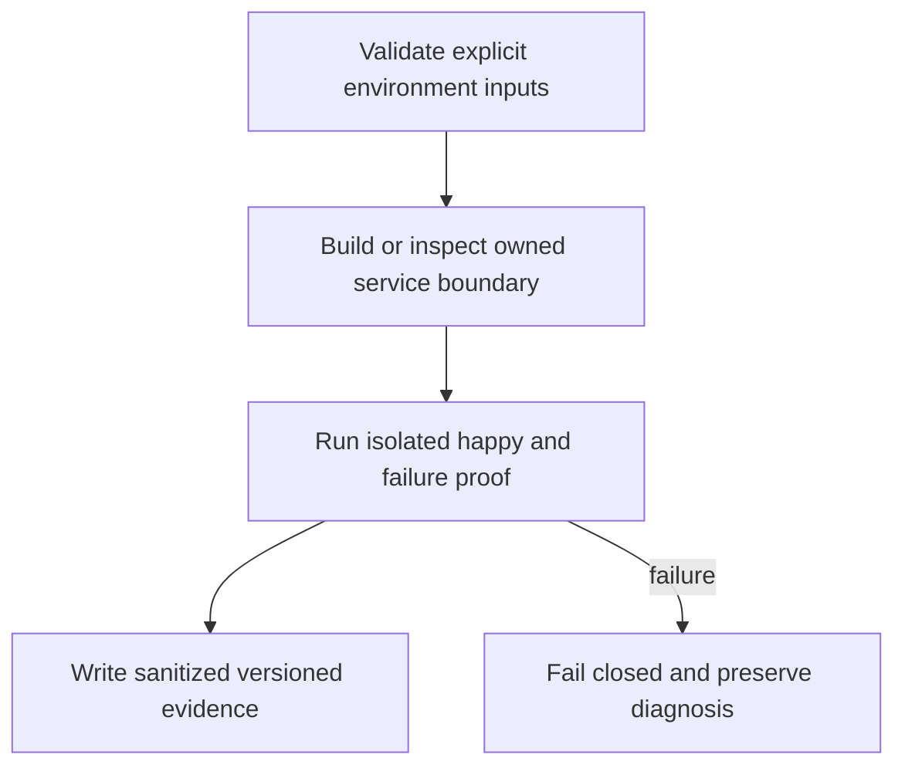

# Reusable Backend Feasibility - Plan

## Goal Capsule

Produce a reproducible decision on whether the existing Matrix service removes more custom work than it adds operational burden.

Authority: user decisions in `docs/product/decisions.md` precede this plan; then the approved ticket scope and owning contracts. Tail owner is the Khala Executor. This ticket does not grant authority over sibling Aiur processes or configuration.

Prerequisites and stop conditions: Evaluation is approved; production substrate selection is a separate gate. Railway paid provisioning is not needed for the local experiment.

---

## Product Contract

### Summary and problem frame

Produce a reproducible decision on whether the existing Matrix service removes more custom work than it adds operational burden. Khala currently has research and proposal documents, so this work must define its own evidence without claiming an existing implemented subsystem.

### Requirements

- R1. Evaluate existing OSS Synapse and Postgres with durable server identity and data.
- R2. Compare the actual components/custom work against a Netlify Functions/Blobs alternative.
- R3. Publish measured facts separately from browser/headless crypto and ownership proofs owned by other tickets.

### Acceptance examples

- AE1. Restart the disposable service; its server identity and stored events survive.
- AE2. A report with unrun backup or crypto cases marks them unverified rather than passing.

### Scope and decisions

Evaluate official Synapse image plus supported Postgres first. Netlify-native remains a bounded comparison of event consistency, realtime delivery and key/device lifecycle; do not build a second backend to compare.

Carry forward TypeScript, OSS reuse, Netlify preference, existing-session attachment, connector-gated E2EE review, and dashboard-native design. This ticket cannot add human technical setup or silently change an unresolved product policy.

---

## Planning Contract

Product Contract unchanged. An implementation-ready **plan** is not a claim that prerequisites have passed or that the ticket is dispatchable today. Resolve the named dependency and environment gates before production mutation; bounded local work may proceed where explicitly described.

### Grounding and technical decisions

KTD1. Evaluate official Synapse image plus supported Postgres first. Netlify-native remains a bounded comparison of event consistency, realtime delivery and key/device lifecycle; do not build a second backend to compare.

KTD2. Keep platform operations separate from feature policy. Reuse upstream service/SDK behavior and narrow ports; no custom cryptography, replacement session or shared mutable application store is introduced here.

KTD3. Reserve shared manifests/lockfile and app entrypoints for their assigned owner. Components land against real reviewed contracts and isolated fixtures; integration owns binding to live implementations. See `docs/product/repo-layout.md`.

KTD4. User-directed TypeScript and Netlify preference remain constraints; Railway-hosted OSS is acceptable where it saves development. The owner-side continuous subscriber cannot live inside a request-lifetime function. (session-settled: user-directed — chosen over a mandatory custom Hono backend: reduce ongoing backend development and operation.)

### Existing evidence and refreshable implementation pointers

Khala researched base: `6d4694173eff9b0832f4c3a2cdb90b4281fcccd9`; proposed paths below do not exist as app implementation yet. Archon reference: `c7d3254097acaa02eed1e3be6fd8fbf06c0e8128`, especially `netlify.toml`, `package.json`, `netlify/lib/store.mjs`, and `netlify/lib/hosted/record-store.mjs` in that repository. Aiur reference: `1f618cddf601a0b6d79bc1197579746b7584a64c`; its dashboard supplies design language, not the runtime language or service topology. Refresh source/version facts at worker pickup without changing accepted product requirements.

### Isolated experiment runner

KHA102 owns `experiments/backend/package.json` and its isolated `pnpm-lock.yaml`; it does not depend on101 tooling. Its `check` script validates compose/env inputs without deployment, and `test` executes the bounded lifecycle/persistence proof against disposable resources. Use `pnpm --dir experiments/backend install --frozen-lockfile` before the documented check/test commands. Do not add the experiment to production workspace exports.

### Proposed owned files

- `experiments/backend/compose.yaml`
- `experiments/backend/README.md`
- `experiments/backend/check.ts`
- `experiments/backend/check.test.ts`
- `docs/evidence/backend.md`

### Worked boundary record

The following is an example record, not an assertion of collected runtime evidence. Fields marked recorded/resolved are required outputs of the implementation proof.

```json
{
  "experiment": "backend",
  "server_name": "khala-test.invalid",
  "image_digest": "resolved-at-execution",
  "restart_identity": "pass|fail|not-run",
  "crypto_proof": "owned-by-KHA-141-and-142",
  "cost": "unmeasured"
}
```

### High-level technical design



### Dependencies and limits

Hard ticket prerequisites: none. Gates: Evaluation is approved; production substrate selection is a separate gate. Railway paid provisioning is not needed for the local experiment.

Every proposed verification command below is an implementation-time contract, not a command claimed to run during planning. The owning implementation must add the named script/entrypoint before invoking it. Package-manager and native SDK versions are pinned from actual supported releases at implementation; this plan does not fabricate a tested dependency tuple.

---

## Implementation Units

### U1. Pin candidate and isolation

**Goal:** Pin candidate and isolation.

**Requirements:** R1; overall R1–R3, AE1–AE2 constrain the completed ticket.

**Dependencies:** None beyond ticket prerequisites.

**Files:** `experiments/backend/compose.yaml`, `experiments/backend/README.md`.

**Approach:** Resolve supported Synapse/Postgres versions and image digests from upstream. Create isolated experiment project name and temporary secrets/volumes. Server_name uses an experiment-only stable identity.

**Patterns:** KTD1–KTD4; referenced upstream behavior and owned sibling boundaries.

**Test scenarios:** Manifest identifies digests, license sources and versions; startup refuses existing nonexperiment storage.

**Verification:** Record the observed pass/fail result, exact build/environment and sanitized evidence; do not infer runtime success from configuration parsing alone.

### U2. Exercise persistence and service boundary

**Goal:** Exercise persistence and service boundary.

**Requirements:** R2; overall R1–R3, AE1–AE2 constrain the completed ticket.

**Dependencies:** U1.

**Files:** `experiments/backend/check.ts`, `experiments/backend/check.test.ts`.

**Approach:** Provision two disposable identities through the experiment-only admin boundary; append synthetic events and restart services. Inspect API availability and persisted server identity without recording tokens.

**Patterns:** KTD1–KTD4; referenced upstream behavior and owned sibling boundaries.

**Test scenarios:** Successful restart retains expected IDs/history; unavailable database is reported unhealthy; plaintext experiment markers are never misrepresented as E2EE proof.

**Verification:** Record the observed pass/fail result, exact build/environment and sanitized evidence; do not infer runtime success from configuration parsing alone.

### U3. Measure and compare real work

**Goal:** Measure and compare real work.

**Requirements:** R3; overall R1–R3, AE1–AE2 constrain the completed ticket.

**Dependencies:** U2.

**Files:** `docs/evidence/backend.md`.

**Approach:** Record hardware, duration, CPU/RSS/disk observations and custom integration inventory. Compare Netlify-native needed components for durable ordering/CAS/replay/realtime and device lifecycle.

**Patterns:** KTD1–KTD4; referenced upstream behavior and owned sibling boundaries.

**Test scenarios:** Report separates observed baseline from estimates; identifies which SDK/crypto cases still belong to 141/142/144.

**Verification:** Record the observed pass/fail result, exact build/environment and sanitized evidence; do not infer runtime success from configuration parsing alone.

### U4. Write adoption criteria

**Goal:** Write adoption criteria.

**Requirements:** R3; overall R1–R3, AE1–AE2 constrain the completed ticket.

**Dependencies:** U3.

**Files:** `experiments/backend/README.md`, `docs/evidence/backend.md`.

**Approach:** Make recommendation conditional on all feasibility evidence; enumerate domain, hosting and license decisions required for production.

**Patterns:** KTD1–KTD4; referenced upstream behavior and owned sibling boundaries.

**Test scenarios:** Executor can distinguish pass/fail/unknown for each criterion and reproduce the experiment without paid provisioning.

**Verification:** Record the observed pass/fail result, exact build/environment and sanitized evidence; do not infer runtime success from configuration parsing alone.

---

## Verification Contract

| Check | Expected evidence |
|---|---|
| `docker compose -p khala-backend-spike -f experiments/backend/compose.yaml config --quiet` | Successful relevant validation after its owning script exists; failed prerequisites remain explicit. |
| `pnpm --dir experiments/backend test` | Successful relevant validation after its owning script exists; failed prerequisites remain explicit. |
| `pnpm --dir experiments/backend check` | Successful relevant validation after its owning script exists; failed prerequisites remain explicit. |

Feature tests must exercise behavior and failure cases rather than mirror constants. Pure docs/config units use schema/config/build and real smoke evidence instead of artificial unit tests. A test double proves a component contract; it cannot prove production identity, crypto persistence, hosted routing or session delivery. Integration owners in the graph supply that proof.

Security checks use synthetic data and disposable identities. Do not publish raw environment dumps, process arguments, token-bearing URLs, database credentials, server signing keys or decrypted participant messages. Failure logs preserve request IDs and reason codes without content.

---

## Definition of Done

All R1–R3 and AE1–AE2 have evidence. All U-IDs satisfy their stated validation; unresolved external gates prevent a pass for dependent outcomes. Owned code/docs land green on current base, no abandoned experiment or fixture is exported into production, and shared file ownership remains intact. The Executor receives exact changed paths, tests run, unavailable checks and remaining limitations.

### Sources

- https://element-hq.github.io/synapse/latest/setup/installation.html
- https://element-hq.github.io/synapse/latest/postgres.html
- https://docs.netlify.com/build/functions/configuration/

Local context: `docs/product/tickets/KHA-102.md`, `docs/product/repo-layout.md`, `docs/product/decisions.md`, and `docs/research/11-hosting-tradeoffs.md`. Official sources checked 2026-09-16; changing behavior must be rechecked at implementation.
