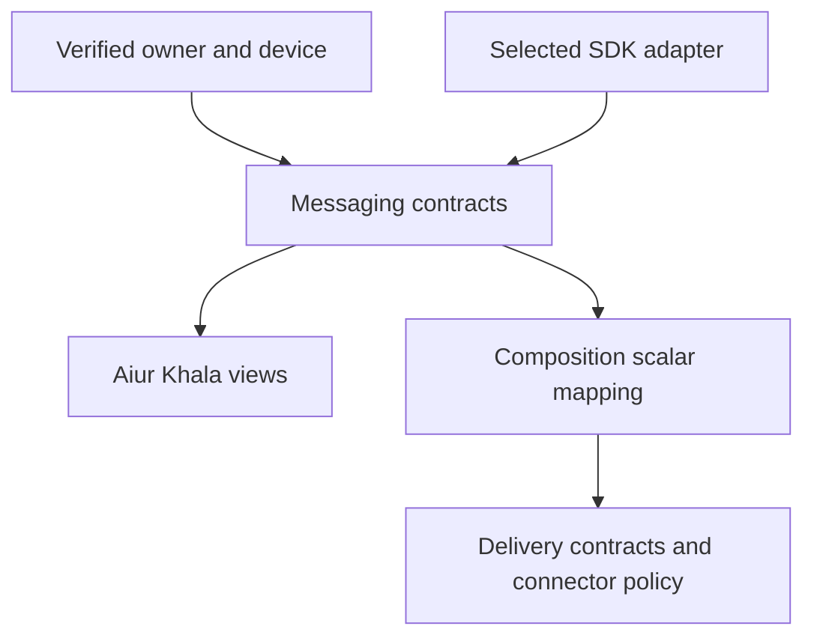

# KHA-105 Define identity, room and messaging ports - Plan

## Goal Capsule

Deliver define identity, room and messaging ports. Authority: latest user decisions, then `docs/product/decisions.md`, the approved scope card, and this contract. Dependencies: KHA-101, KHA-102, KHA-141, KHA-142, KHA-144. Product trace: R06, R09, R14. Open launch gates: G-SUBSTRATE, G-ADMISSION, G-RETENTION; unresolved feasibility conclusions from 102/141/142/144.

Implementation belongs to the assigned ticket worker after gates clear. Root dependency changes, integration wiring, tracker publication and executor startup remain with their named owners. This artifact does not claim runtime proof.

---

## Product Contract

### Summary

Keep provider identity, human ownership, messaging participants, devices and working sessions distinct. This ticket covers the bounded outcome in `docs/product/tickets/KHA-105.md`.

### Problem Frame

Contract drift can make one component interpret a device as a human or a relay receipt as delivery, invalidating the airlock across otherwise correct modules.

### Requirements

- R1. Keep provider identity, human ownership, messaging participants, devices and working sessions distinct.
- R2. Expose immutable room-event references and explicit recoverable/terminal outcomes to independent consumers.
- R3. Offer no-setup identity, admission and device lifecycle ports without prescribing unresolved admission/history behavior.
- R4. Provide exact success/failure fixtures and concurrency semantics that both browser and connector implementations can satisfy.

### Actors and flow

A1 is the owning human; A2 is their trusted owner connector; A3 is the model-facing adapter; A4 is the ciphertext delivery/control service. Human identity and agent identity remain distinct.

F1. An authorised actor requests this ticket's operation; the owning module validates current identity/state, returns an explicit result, and downstream consumers retain the narrow meaning of that result. Failures remain visible and retries preserve the original operation identity.

### Acceptance Examples

- AE1. A producer emits the documented exact intro fixture; both contract domains accept identical identity, content digest and binding generation. Covers R1, R2.
- AE2. A payload substitutes author/device/generation or contains an unknown version; the decoder rejects it before any adapter effect. Covers R3, R4.

### Key Decisions

Connector-gated review is the confidentiality boundary (session-settled: user-directed — chosen over separate human-only encryption groups: the owner connector may hold pending plaintext). Application code remains TypeScript with OSS reuse (session-settled: user-directed — chosen over building a new custom stack by default: reduce implementation ownership). Netlify is preferred; Railway is acceptable when reuse saves work. Existing sessions remain the target; a fresh replacement conversation is not equivalent.

### Scope Boundaries

Only the scope card's owned paths may change. Production features are not implemented by feasibility tickets. This ticket cannot choose a new recovery promise, add human connector setup, select a provider through a fixture, or redesign the Aiur dashboard shell. KHA-107/143 own its client reuse/navigation decisions.

### Open Questions

G-SUBSTRATE, G-ADMISSION, G-RETENTION; unresolved feasibility conclusions from 102/141/142/144.

### Sources

- `docs/product/tickets/KHA-105.md`, `docs/product/repo-layout.md`, `docs/product/decisions.md`.
- `docs/research/04-identity-trust.md`, `docs/research/05-e2ee.md`, `docs/research/08-security-evidence.md`.

---

## Planning Contract

Product requirements preserved; acceptance examples clarified against the same requirements during review. Planning baseline is Khala `6d4694173eff9b0832f4c3a2cdb90b4281fcccd9`. All implementation paths below are proposed new files. `docs/evidence/security-planning-sources.json` pins inspected source; no package exists yet. The artifact remains requirements-only until its listed gates close, despite the detailed candidate contract below.

### Key Technical Decisions

- KTD1. Use one messaging domain with explicit subpath exports rather than a global type barrel. Contracts contain data validation and interfaces, never SDK runtime imports. KHA-101 reserves `@khala/contracts/messaging`; KHA-105 owns its declarations and valid/invalid fixtures. KHA-106 is structurally compatible but must not import this domain, preventing a dependency cycle.
- KTD2. Keep owner identity independent of email and protocol account ID. Archon's `netlify/lib/hosted/contracts.mjs` at `c7d3254097acaa02eed1e3be6fd8fbf06c0e8128` derives identity from provider subject; Khala must additionally preserve issuer when more than one provider tenant is possible. An email change cannot merge accounts.
- KTD3. Event references identify the exact authored immutable content. An edit yields another event ID; rendering, newline conversion and Unicode normalisation never change approved bytes behind the reference. SDK encryption remains outside these contracts.
- KTD4. Control-store atomicity is per key, not an invented cross-key transaction. Every write has operation identity, expected revision and a resolvable uncertain outcome. Store failure is distinct from absent record. Archon's `auth-store.mjs` illustrates guarded consumption and ambiguous write readback; its provider-specific workaround is not a portable atomicity guarantee.
- KTD5. Human and connector authorities are runtime-verified inputs, not booleans supplied by request bodies. Preserve connector-gated policy (session-settled: user-directed — chosen over strict review groups: the owner endpoint is trusted with pending plaintext). Model-facing adapters never receive general messaging credentials.

### Exact exports and field meanings

This is a contract design table, not production code. Each named type exports from `packages/contracts/src/messaging/index.ts`; implementation files stay split by concern. Naming is fixed for dependent plans; gate resolution may revise a field only with producer/consumer review.

| Export/file | Fields or operation | Invariant |
|---|---|---|
| `AuthPrincipal` / `identity.ts` | `v:1`, `ownerId`, `providerIssuer`, `providerSubject`, `verifiedEmail`, `sessionExpiresAt` | Issuer+subject determine identity; email is verified display/contact data; expiresAt is UTC RFC3339 |
| `ParticipantView` / `identity.ts` | `participantId`, `kind:human|agent`, `ownerId`, `displayName`, `deviceIds` | Kind and owner association come from authenticated mapping, never text labels |
| `SessionBinding` / `identity.ts` | `bindingId`, `ownerId`, `agentParticipantId`, `deviceId`, `harness`, `sessionId`, `generation` | Immutable target; generation is nonnegative safe integer; another session requires another binding |
| `EventRef` / `events.ts` | `v:1`, `roomId`, `eventId`, `authorParticipantId`, `authorDeviceId`, `contentDigest` | `contentDigest` is `sha256:` plus 64 lowercase hex; reference never points at mutable display text |
| `MessageContent` / `events.ts` | `v:1`, `kind:text`, `body` | UTF-8 body retained exactly; R1 does not authorise attachment/redaction scope |
| `RoomSummary` / `rooms.ts` | `roomId`, `title:string|null`, `membership:joining|joined|left|revoked`, `revision` | Empty optional title resolves to null; revision opaque and scoped to one room projection |
| `TimelineItem` / `events.ts` | `ref`, `content`, `participant`, `clientTxnId:null|string`, `receivedAt` | Only endpoint ports expose decrypted content; control APIs use reference metadata |
| `TimelinePage` / `rooms.ts` | `items`, `nextCursor:null|string`, `snapshotRevision` | Cursors opaque; dedupe eventId; no global sequence inferred from SDK ordering |
| `SendState` / `rooms.ts` | `clientTxnId`, `state:pending|accepted|failed|outcome_unknown`, `eventRef:null|EventRef` | Accepted means transport event acceptance, never model processing |
| `DeviceView` / `devices.ts` | `deviceId:null|string`, `state:new|initializing|ready|locked|lost|revoked|failed`, `generation`, `reason:null|string` | Error reason from finite public codes, no SDK dump or secrets |
| `OperationResult<T>` / `outcomes.ts` | success `{kind:ok,value}` or `{kind:rejected,code}` or `{kind:unavailable,retryable:true}` or `{kind:outcome_unknown,operationId}` | Aborted local waiting does not imply cancelled remote work |
| `ControlRecord<T>` / `control-store.ts` | `key`, `revision`, `operationId`, `value`, `expiresAt:null|string` | Expiry enforced at lookup; no TTL-cleanup assumption |

Identifiers are opaque nonempty strings, at most 512 UTF-8 bytes. Reject NUL/control characters, unknown envelope versions and integers outside the safe range. Protocol identifiers such as Matrix room/event IDs must not be normalised, lowercased or converted to invented UUIDs. Display names and content have independent limits supplied by the substrate capability record; contract tests must include a value over that declared limit. No invented universal Matrix limit is asserted here.

`contentDigest` uses a versioned deterministic encoding owned by `events.ts`: UTF-8 encoding of a positional JSON array `["khala.message.v1","text",body]`, with JSON string escaping and no whitespace between array tokens. There are no object-key ordering rules to guess; body bytes are not Unicode-normalised. The function is named `encodeMessageContent`, returning bytes; `digestMessageContent` returns the prefixed SHA-256 digest. An adapter must hash what will be released, not HTML, markdown render output or an encrypted event blob. KHA-106 mirrors the reference fields and includes the same worked fixture digest, computed from these bytes. Broader message kinds require a reviewed contract version, not ad hoc properties.

### Port operations

Every asynchronous operation accepts an abort signal and an operation ID where it can cause effects. Observe methods return a disposer. Notifications carry the client lifecycle generation so an old account/session cannot update the new one.

| Port | Named operations and input/output contract | Producer |
|---|---|---|
| `IdentityPort` | `current` → principal or signedOut/unavailable; `beginSignIn(returnPath)` → same-origin navigation intent; `signOut(operationId)` → result | KHA-110; browser adapter composed by132 |
| `DevicePort` | `ensureReady(ownerId)` → DeviceView; `current`; `observe`; `stop` | KHA-111 |
| `RoomPort` | `create({operationId,title})` → RoomSummary; `prepareIntro({roomId,batchId,messages})` → per-item SendState; `resumeIntro(batchId)` → same states; `send({roomId,clientTxnId,content})`; `timeline({roomId,cursor,limit})` → TimelinePage; `observe(roomId,listener)` → disposer; listener receives full `{room:RoomSummary,items:TimelineItem[],snapshotRevision,generation}` snapshot (replacement, not delta) | KHA-112 |
| `AdmissionPort` | `share({operationId,roomId})` → `{inviteRef,shareUrl,expiresAt:null|string}`; `inspect(inviteRef)` → `auth_required|eligible|already_joined|expired|revoked|identity_mismatch|unavailable`; `admit({operationId,inviteRef,deviceId})` → membership result | KHA-113; authenticated principal comes from control context |
| `RevocationPort` | `revoke({operationId,targetKind:device|binding,targetId,expectedGeneration})` → progress; `inspect(operationId)` | KHA-128 |
| `RecoveryPort` | `capabilities` → supported modes and unavailable reason; `begin({operationId,mode})`; `provideSecret` through local-only callback; `inspect(operationId)` → locked/restoring/restored/partial/unrecoverable/failed | KHA-129; secrets never become serialisable control-port arguments |
| `ControlStore` | `read(key)` → absent/record/unavailable; `compareAndSet({key,expectedRevision:null|string,operationId,next})` → applied/conflict/outcome_unknown/unavailable; `resolve({key,operationId})` → same write's result | KHA-105 specifies; KHA-131 runtime supplies selected persistence adapter |

`expectedRevision:null` means create only if absent. A lost response is not safely retryable with new bytes. `resolve` may return unknown when a provider cannot prove the earlier write, and callers retain that uncertainty. Serialisation is logical and does not require a global storage lock.

### Worked fixture and cross-domain boundary

Fixture `packages/contracts/fixtures/messaging/exact-intro.json` uses owner `owner_alice`, agent `agent_alice`, device `device_a1`, room `room_demo`, event `event_intro_1`, binding `binding_a1`, harness `codex`, session `thread_existing_7`, generation `1`, and content body `Review the API change.\nDo not merge yet.`. The encoding is 71 bytes; its literal digest is `sha256:f16c1e5a70000f33eebc69c8ecf82d1ab7360fcdd15121ac3293f1afd4d4ea6b`, independently computed with Python hashlib during planning. Store this literal in both domain fixture families. A checked-in expected digest must be independently verified against a platform SHA-256 primitive, not generated and asserted by the same helper in one test.

Invalid peers: same reference with different body; same command operation ID with another room; empty issuer; email mapped as owner ID; wrong digest prefix; next generation substituted into a release targeting generation1; unknown envelope version; stale observer generation.

No production composition is included. Fixtures are test-only exports. ControlStore stores account/membership/control metadata; SDK history and keys stay with the messaging implementation, not a second Blobs transcript.

---

## Implementation Units

### U1. Identity, result and immutable-content declarations

**Goal:** Make principal, participant, device and session boundaries mechanically distinguishable. **Requirements:** R1, R2; KTD2, KTD3. **Dependencies:** KHA-101 and closed105 launch gates. **Files:** `packages/contracts/src/messaging/{identity,events,outcomes}.ts`, adjacent `identity.test.ts`, `events.test.ts`.

**Approach:** Implement bounded decoders and deterministic content encoding. Follow Archon's validated principal boundary without copying its single-provider assumption. Reject unknown versions and avoid SDK-specific runtime classes in public types.

**Test scenarios:** Same verified email from two issuers remains two identities; newline/Unicode variation changes exact digest; reordering object inputs cannot affect positional encoding; event edit is a new ref; malformed digest and invalid generation fail. Covers AE1/AE2.

**Verification:** Declarations build without SDK packages; independent digest vectors match literal fixtures; invalid examples never become typed successes.

### U2. Room/device/admission/recovery ports and views

**Goal:** Give human and connector consumers stable lifecycle operations. **Requirements:** R2, R3; KTD1, KTD5. **Dependencies:** U1. **Files:** `packages/contracts/src/messaging/{rooms,devices,admission,recovery,revocation,index}.ts`, adjacent port decoder tests.

**Approach:** Pin the operation table, all failure discriminants and observer disposal. Unresolved product choices are capability inputs, not defaults silently invented in decoder code. Include local-only secret callback interfaces without serialisable key fields.

**Test scenarios:** Empty optional title maps to null; stale observer generation ignored by a contract fake; aborted send retains unknown remote result; unavailable identity is not signedOut; recovery failure carries no secret; admission alreadyJoined is stable on retry. Covers AE2.

**Verification:** UI and SDK fake consumers compile against public exports; no delivery-domain or implementation imports.

### U3. Guarded control-store behavior

**Goal:** Define reliable purpose-separated state mutation without pretending Blobs supports cross-key transactions. **Requirements:** R4; KTD4. **Dependencies:** U1. **Files:** `packages/contracts/src/messaging/control-store.ts`, `control-store.test.ts`, `packages/contracts/fixtures/messaging/control-store.json`.

**Approach:** Write conformance cases usable by the persistence adapter owner. Define absent, conflict, unavailable and unknown separately; operation ID/payload reuse mismatch fails. Expiry is checked against injected trusted time.

**Test scenarios:** Two create-if-absent requests have one winner; two writers on one revision cannot both apply; lost response followed by matching operation resolution returns same value; mismatched payload cannot reuse operationId; expired record never authorises read; storage outage does not become absent.

**Verification:** In-memory conformance fake satisfies required semantics but is never shipped as production storage; selected provider must later run the same cases live.

### U4. Consumer fixture parity and documentation

**Goal:** Stop independently developed delivery/UI plans from drifting. **Requirements:** R1–R4. **Dependencies:** U1–U3; counterpart KHA-106 fixture review. **Files:** `packages/contracts/fixtures/messaging/{exact-intro,invalid,views}.json`, `packages/contracts/src/messaging/fixtures.test.ts`, `packages/contracts/src/messaging/README.md`.

**Approach:** Document names, expected scalar structural equality with delivery EventRef/SessionBinding and intended receipt meanings. Coordinate fixture bytes with106 without importing its module or editing its owned files.

**Test scenarios:** Worked fixture round-trip stable; private key property rejected at a serialisable control boundary; human/agent display attribution differs; public fixtures excluded from runtime exports; consumer fixture mismatch fails contract validation.

**Verification:** Affected consumers compile with real merged contracts; no test-only fixtures leak into bundles.

---

## Verification Contract

KHA-101 supplies `pnpm --filter @khala/contracts typecheck`, `pnpm --filter @khala/contracts test`, and `pnpm check:boundaries`; these are planned commands, not claims that current scripts exist. Run all three on the merged base when implementing. Unit evidence is adjacent tests; fixture parity evidence covers both105 and106. No runtime E2EE guarantee is established by this ticket.

### Settled production origin — user amendment

P11 sets the production app origin to `https://khala.aiur.team`. Canonical production share links use that origin; OAuth callback is `https://khala.aiur.team/api/human/auth/callback`. KHA131 owns origin validation/configuration,110 consumes the exact callback and132 composes it. Preview allowlists/credentials stay explicit and separate. This does not assign a Matrix server_name or claim DNS/hosting is already configured. Earlier synthetic `.example` links remain test fixtures, never deployment defaults. This later user decision supplements the preserved Product Contract.

## Definition of Done

All four requirements map to passing tests and stable exported names; the exact-intro fixture has an independently checked literal digest; all product/SDK gates are closed before changing readiness; consumer review resolves domain parity; no SDK implementation, root lockfile change, global barrel or abandoned experiment is left in the diff.

### Planning review and remaining confidence

Serial coherence, feasibility, security and adversarial review completed; see `docs/plans/reviews/security-planning-review.md`. This is a planning review, not a runtime security certification. Production implementation must record executed commands and observed evidence.
