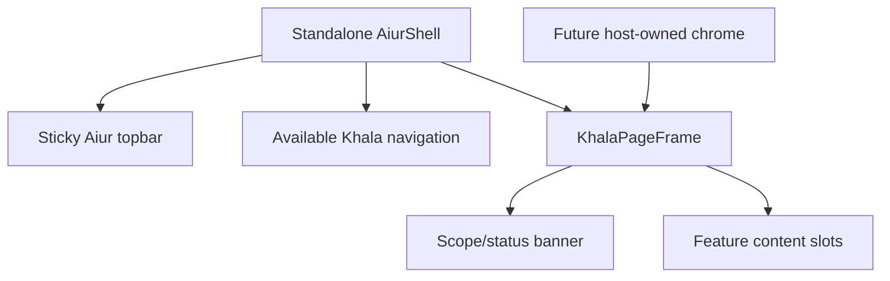

# KHA-107 Aiur dashboard shell - Plan

## Goal Capsule

A recognizable Aiur application page with reusable host chrome and content slots.

Authority: current user decisions override the approved ticket scope, which overrides technical recommendations. Scope source is `docs/product/tickets/KHA-107.md`; global requirements: R10, R12, R14. Planning snapshot: Khala `6d4694173eff9b0832f4c3a2cdb90b4281fcccd9` with approved ticket proposal at `d625c19`. Dependency tickets: KHA-101, KHA-143. This plan changes Khala only; sibling Aiur/Archon are read-only design references.

Stop condition: No product blocker. KHA143 selects the actual UI boundary before implementation; KHA101 provides build/test setup.

---

## Product Contract

### Summary

A recognizable Aiur application page with reusable host chrome and content slots.

### Problem Frame

The ordinary user is collaborating with another human and their already-working agent. Rebuilding generic chat, exposing infrastructure setup, or confusing pending delivery with model consumption undermines that workflow. This ticket owns one bounded part of the shared journey.

### Requirements

- R1. Khala uses the dashboard navigation, content measure, typography, controls and state language, not only the marketing identity.
- R2. Standalone delivery includes its own Aiur-style chrome; page content can render under host-owned chrome without duplicate navigation.
- R3. Theme, keyboard focus and responsive layout remain usable without feature routing, auth or review logic in the shell.
- R4. No unrelated Aiur routes imply features or integrations that Khala does not provide.

### Actors and flow

- A1. The authenticated human who owns the current agent connection.
- A2. Other admitted humans and their attributed agents, whose messages are content rather than control authority.
- F1. Open Khala standalone, switch themes, collapse navigation, then render the same content under a host wrapper without its own topbar.

### Acceptance examples

- AE1. Covers F1 / R1–R4. A 390px viewport keeps the composer and review entry reachable; an embedded content render has one navigation landmark, supplied by its host.
- AE2. Covers R3–R4. Blocked preference storage uses a valid default theme; missing assets and long navigation labels remain legible without breaking content or keyboard navigation.

### Key decisions

- Dashboard-native design is a user directive: Khala should look like a page in Aiur’s left navigation and permit later embedding. It remains independently deployable.
- Keep existing sessions and automated setup (session-settled: user-directed — chosen over manual connector/MCP setup or replacing the session: the person should share a link with the agent already doing the work).
- Connector-gated review (session-settled: user-directed — chosen over separate review/delivery encryption groups: a trusted connector may decrypt pending content, but only approved content reaches the model).

### Scope boundaries

This ticket does not redefine shared contracts, implement sibling-owned services, change Aiur itself, or introduce a second messaging/crypto stack. UI-only tickets demonstrate injected-port behavior; integration tickets own actual composition. Client selection and platform setup belong to their named predecessors. Attachments, retention and automation choices remain with their product/contract owners.

### Outstanding questions

No product blocker. KHA143 selects the actual UI boundary before implementation; KHA101 provides build/test setup.

---

## Planning Contract

Product Contract clarification: AE2 now names shell-specific failures rather than unrelated authorization operations; approved scope and requirements are unchanged. Implementation details below do not settle questions still marked blocking. Prerequisite tickets are dispatch dependencies, not evidence that their runtime experiments already passed.

### Technical decisions

- KTD1. Model Khala as route content inside an Aiur application shell. The source `DashboardShell` owns chrome and slots while feature modules own content. Reuse its presentation conventions in TypeScript; do not port Phoenix/LiveView runtime or copy the entire dashboard stylesheet.
- KTD2. Export shell and page-frame components separately. Standalone composition mounts both; host composition can mount the page frame alone. This is local component composition, not a credential-bearing iframe protocol or a general plugin framework.
- KTD3. Vendor the existing logo and application token subset with source commit/checksum/license attribution. App default values come from `../aiur/src/priv/static/dashboard.css`, including the stronger blue button fill; marketing tokens are secondary.
- KTD4. The shell never imports auth, messaging or feature implementations. Navigation items and action elements come from composition. Sidebar collapse/theme are UI preferences; subscription or policy state is passed in and never inferred from connectivity alone.

### Output and exported boundary

`brand/tokens.css`, `brand/fonts.css`, `brand/assets/aiur-logo.png`, `brand/SOURCES.md`, `shell/AiurShell.tsx`, `shell/KhalaPageFrame.tsx`, `shell/Panel.tsx`, `shell/StatusBadge.tsx`, `shell/shell.css`, `shell/types.ts`, `shell/theme.ts`. Export `AiurShell`, `KhalaPageFrame`, `Panel`, `StatusBadge`, `resolveInitialTheme` from preallocated shell subpaths, not a global feature barrel. The `.tsx` targets express the thin React baseline; KHA143 must validate or amend the renderer boundary before dispatch.

Directional local presentation interfaces, not messaging/auth wire contracts:

```ts
type ShellMode = "standalone" | "hosted-content";
type ThemeChoice = "dark" | "light";
type NavigationItem = { id: string; label: string; href: string; current: boolean; count?: number };
type PageFrameModel = { title: string; description?: string; labelledBy: string };
```

`AiurShell` takes navigation/action/content slots and a theme preference port. `KhalaPageFrame` takes the route heading, optional banner and content. Hosted-content mode is an explicit composition choice, never activated by arbitrary query parameters. The future host owns theme/navigation; a route cannot mutate the host's document or persist a conflicting theme.

### Layout and state model



Desktop mirrors the 15rem rail, 2.6rem collapsed rail and 75rem content measure at the source 960px breakpoint. Mobile reserves bottom navigation/safe-area space and permits the content/composer to use the remaining viewport. The channel list is feature content, not a second unrelated product sidebar. Native focus outline, `aria-current`, visible labels and stable landmark IDs survive layout changes. Theme startup reads a valid stored preference before app mount, tolerates blocked storage and supports host-provided theme. Do not copy fleet-wide pause into the Khala topbar; its authority differs.

### Assumptions and risks

Thin React presentation is a technical recommendation to validate in KHA143, not a user-selected framework. Initial standalone navigation contains only working Khala routes. Exact icon glyph can reuse an existing generic conversation/navigation glyph; no new logo or invented product identity. Source CSS contains corrected contrast pairs; measurements must cover the actual composed surface, not token arithmetic alone. Font license acquisition is part of asset vendoring; no unlicensed font blob copying.

### Shared implementation discipline

Use the selected OSS client/SDK through canonical contracts, not direct imports into UI controllers. `docs/evidence/ui-planning-grounding.md` records source SHAs, inspected dashboard components, external guidance and candidate versions. KHA101 owns package manifests, root lockfile, ESM/TypeScript tooling and generic test discovery; dependency changes go to its integration owner. Test files remain beside owned modules or in this ticket's assigned integration directory. Existing prerequisite exports win over illustrative data below; if they disagree, obtain a reviewed contract amendment rather than add a local compatibility copy.

No implementation or runtime test has run as part of this plan. Browser credentials, decrypted message bodies and invitation secrets must not enter screenshots, logs, telemetry or snapshot fixtures from real users. Use synthetic accounts and message canaries for evidence.

---

## Implementation Units

### U1. Source application assets and scoped tokens

**Goal:** Establish an attributable dashboard-native visual base.

**Requirements:** R1, R3; KTD1/KTD3. **Dependencies:** KHA101 and successful KHA143 selection.

**Files:** `apps/web/src/brand/tokens.css`, `apps/web/src/brand/fonts.css`, `apps/web/src/brand/SOURCES.md`, `apps/web/src/brand/assets/aiur-logo.png`, `apps/web/src/brand/tokens.test.ts`.

**Approach:** Record source commit and SHA-256 for copied assets. Copy only tokens/typefaces used by this page; scope application selectors below the shell root so a future host is not globally restyled. Source Bungee once, use Space Grotesk interface text and JetBrains Mono technical labels. Retain notices.

**Test scenarios:**

1. Covers AE1. Dark/light token sets include semantic ink/fill pairs and font fallbacks.
2. Logo bytes match the source digest; aspect ratio is preserved.
3. Storage unavailable and font load failure leave readable content and controls.

**Verification:** Source inventory is complete; no marketing animation or unrelated source stylesheet is bundled.

### U2. Implement chrome and route content slots

**Goal:** Render standalone and host-compatible page composition.

**Requirements:** R1–R4; F1; KTD1/KTD2. **Dependencies:** U1.

**Files:** `apps/web/src/shell/AiurShell.tsx`, `apps/web/src/shell/KhalaPageFrame.tsx`, `apps/web/src/shell/types.ts`, `apps/web/src/shell/shell.css`, `apps/web/src/shell/AiurShell.test.tsx`.

**Approach:** Use composition-supplied navigation and actions; keep heading inside content column. Preserve source rail collapse behavior, minimum-width zero and content width. Host-content render omits chrome without needing CSS to hide duplicates.

**Test scenarios:**

1. Standalone contains one topbar, one navigation landmark and one named main region.
2. Covers AE1. Host wrapper plus Khala content has no nested duplicate header/navigation or IDs.
3. Unknown/zero count is not falsely rendered as an authoritative backlog count.

**Verification:** Injected content renders identically under standalone and host-owned chrome; no feature imports.

### U3. Implement shared state primitives and theme

**Goal:** Provide reusable panels/chips without domain policy.

**Requirements:** R3–R4; KTD3/KTD4. **Dependencies:** U2.

**Files:** `apps/web/src/shell/Panel.tsx`, `apps/web/src/shell/StatusBadge.tsx`, `apps/web/src/shell/theme.ts`, `apps/web/src/shell/primitives.test.tsx`.

**Approach:** Use semantic tone plus text, not raw colors; Panel supports heading/body/footer and busy/empty/error slots. Resolve initial theme deterministically; subscribe only to local preference/host port. No status badge derives model readiness.

**Test scenarios:**

1. Repeated render retains focus and preference state.
2. Disabled/read-only action still exposes an explanatory accessible label.
3. Host-theme update changes colors without writing local host preference or mounting a second listener.

**Verification:** Primitive APIs accept presentation data only and unsubscribe when disposed.

### U4. Verify desktop, phone and host container behavior

**Goal:** Prove the visual shape survives real viewport constraints.

**Requirements:** R1–R4; AE1/AE2. **Dependencies:** U3.

**Files:** `apps/web/src/shell/shell.browser.test.ts`, `apps/web/src/shell/README.md`.

**Approach:** Use Playwright browser tests registered by bootstrap. Compare synthetic Khala shell beside source dashboard screenshot manually; structural token/style checks complement screenshots. Container-hosted layout uses the available container width, not a fullscreen assumption.

**Test scenarios:**

1. 390×844 and 360×780 contain long names and code without page overflow; bottom nav does not cover focused input.
2. 959/960px breakpoint and 844×390 landscape preserve navigation and focus.
3. Dark/light, reduced motion, 200% zoom and keyboard navigation remain legible; collapse does not move focus to a hidden element.

**Verification:** Document tested viewports and source reference; accessibility violations on owned controls resolved.

---

## Verification Contract

`pnpm --filter @khala/web typecheck` and `pnpm --filter @khala/web test -- src/brand src/shell` cover U1–U3. `pnpm --filter @khala/web test:browser -- src/shell/shell.browser.test.ts` covers U4. `pnpm check:boundaries` rejects feature imports in shell. Render checks use synthetic content only.
The commands are future verification targets after KHA101 establishes the named scripts, not commands claimed to pass today. Use Node 22 LTS at a version satisfying the pinned packages (at least 22.12 for the candidate toolchain). No skipped/mocked real-service case may be reported as a completed integration. A changed command contract requires updating the owning bootstrap and this plan together.

---

## Definition of Done

The standalone shell and host-content mount both satisfy the source-derived layout; all R1–R4 and AE1–AE2 have evidence. Brand source inventory and font notices are present. KHA132 receives documented slots/exports without requiring shell edits.
All owned unit tests and applicable contract checks pass on the merged base. Every acceptance example is linked to test evidence. Remove abandoned experiment code, fixture imports from production, unused subscriptions and dead fallbacks. Preserve scope/file ownership; report dependency defects to their owner instead of patching sibling directories. No deployment or implementation completion is implied by this document.
