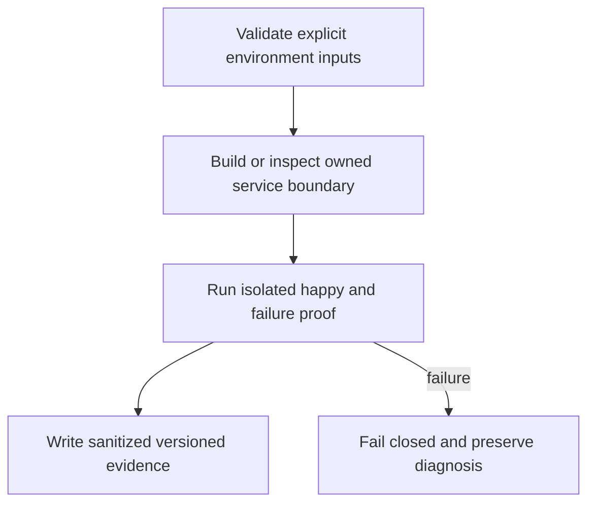

# Messaging Service Deployment - Plan

## Goal Capsule

Make the selected messaging backend reproducibly deployable without adding a custom application server.

Authority: user decisions in `docs/product/decisions.md` precede this plan; then the approved ticket scope and owning contracts. Tail owner is the Khala Executor. This ticket does not grant authority over sibling Aiur processes or configuration.

Prerequisites and stop conditions: KHA-102 accepted backend evidence and substrate selection; production domain/server_name and hosting credentials must be available. Stop if selection changes; do not translate into a bespoke backend.

---

## Product Contract

### Summary and problem frame

Make the selected messaging backend reproducibly deployable without adding a custom application server. Khala currently has research and proposal documents, so this work must define its own evidence without claiming an existing implemented subsystem.

### Requirements

- R1. Persist backend database, media and server identity across replacement/restart.
- R2. Expose only the intended public client endpoints over HTTPS and restrict registration/admin access.
- R3. Separate preview and production state and keep secrets out of repo, logs and web bundles.

### Acceptance examples

- AE1. Replace the service container; clients reconnect to the same identity and encrypted history.
- AE2. An anonymous registration attempt and public admin request are rejected.

### Scope and decisions

After Matrix selection, use the official Synapse image and supported Postgres with private DB connectivity. Preserve server_name independently of provider URL. A Railway volume is persistent storage, not evidence of a tested backup.

Carry forward TypeScript, OSS reuse, Netlify preference, existing-session attachment, connector-gated E2EE review, and dashboard-native design. This ticket cannot add human technical setup or silently change an unresolved product policy.

---

## Planning Contract

Product Contract unchanged. An implementation-ready **plan** is not a claim that prerequisites have passed or that the ticket is dispatchable today. Resolve the named dependency and environment gates before production mutation; bounded local work may proceed where explicitly described.

### Grounding and technical decisions

KTD1. After Matrix selection, use the official Synapse image and supported Postgres with private DB connectivity. Preserve server_name independently of provider URL. A Railway volume is persistent storage, not evidence of a tested backup.

KTD2. Keep platform operations separate from feature policy. Reuse upstream service/SDK behavior and narrow ports; no custom cryptography, replacement session or shared mutable application store is introduced here.

KTD3. Reserve shared manifests/lockfile and app entrypoints for their assigned owner. Components land against real reviewed contracts and isolated fixtures; integration owns binding to live implementations. See `docs/product/repo-layout.md`.

KTD4. User-directed TypeScript and Netlify preference remain constraints; Railway-hosted OSS is acceptable where it saves development. The owner-side continuous subscriber cannot live inside a request-lifetime function. (session-settled: user-directed — chosen over a mandatory custom Hono backend: reduce ongoing backend development and operation.)

### Existing evidence and refreshable implementation pointers

Khala researched base: `6d4694173eff9b0832f4c3a2cdb90b4281fcccd9`; proposed paths below do not exist as app implementation yet. Archon reference: `c7d3254097acaa02eed1e3be6fd8fbf06c0e8128`, especially `netlify.toml`, `package.json`, `netlify/lib/store.mjs`, and `netlify/lib/hosted/record-store.mjs` in that repository. Aiur reference: `1f618cddf601a0b6d79bc1197579746b7584a64c`; its dashboard supplies design language, not the runtime language or service topology. Refresh source/version facts at worker pickup without changing accepted product requirements.

Synapse server_name is an identity decision that cannot be changed like a deployment hostname. Require it before first durable production boot. Database encoding/locale follows upstream PostgreSQL guidance.

### Proposed owned files

- `infra/messaging/compose.yaml`
- `infra/messaging/railway.md`
- `infra/messaging/homeserver.template.yaml`
- `infra/messaging/env.example`
- `infra/messaging/check.ts`
- `infra/messaging/check.test.ts`

### Worked boundary record

The following is an example record, not an assertion of collected runtime evidence. Fields marked recorded/resolved are required outputs of the implementation proof.

```json
{
  "environment": "preview",
  "server_name": "approved-before-first-start",
  "public_origin": "https://matrix.example.invalid",
  "database": "private-service-reference",
  "secrets": [
    "signing-key",
    "database-password"
  ],
  "health": {
    "ready": false,
    "reason": "database-unavailable"
  }
}
```

### High-level technical design



### Dependencies and limits

Hard ticket prerequisites: KHA-101, KHA-102. Gates: KHA-102 accepted backend evidence and substrate selection; production domain/server_name and hosting credentials must be available. Stop if selection changes; do not translate into a bespoke backend.

Every proposed verification command below is an implementation-time contract, not a command claimed to run during planning. The owning implementation must add the named script/entrypoint before invoking it. Package-manager and native SDK versions are pinned from actual supported releases at implementation; this plan does not fabricate a tested dependency tuple.

---

## Implementation Units

### U1. Define deployment inputs

**Goal:** Define deployment inputs.

**Requirements:** R1; overall R1–R3, AE1–AE2 constrain the completed ticket.

**Dependencies:** None beyond ticket prerequisites.

**Files:** `infra/messaging/homeserver.template.yaml`, `infra/messaging/env.example`.

**Approach:** Name public homeserver origin, stable Matrix server name, private DB host, secret references and persistent volume paths. Validate placeholders without committing credentials.

**Patterns:** KTD1–KTD4; referenced upstream behavior and owned sibling boundaries.

**Test scenarios:** Missing required secret reference fails; malformed origin and duplicated environment identity fail; public configuration contains no DB/admin secret.

**Verification:** Record the observed pass/fail result, exact build/environment and sanitized evidence; do not infer runtime success from configuration parsing alone.

### U2. Package upstream services

**Goal:** Package upstream services.

**Requirements:** R2; overall R1–R3, AE1–AE2 constrain the completed ticket.

**Dependencies:** U1.

**Files:** `infra/messaging/compose.yaml`, `infra/messaging/railway.md`.

**Approach:** Use accepted image digests from 102; provision storage ownership/config mount paths from official image behavior. Keep database private and public registration disabled; dedicated control API access uses scoped credentials.

**Patterns:** KTD1–KTD4; referenced upstream behavior and owned sibling boundaries.

**Test scenarios:** Service starts against correct UTF8/C locale DB; changed container retains signing key; public client version endpoint works over HTTPS.

**Verification:** Record the observed pass/fail result, exact build/environment and sanitized evidence; do not infer runtime success from configuration parsing alone.

### U3. Validate operational boundary

**Goal:** Validate operational boundary.

**Requirements:** R3; overall R1–R3, AE1–AE2 constrain the completed ticket.

**Dependencies:** U2.

**Files:** `infra/messaging/check.ts`, `infra/messaging/check.test.ts`.

**Approach:** Add health checks and structured sanitized check output; explicitly enumerate any exposed federation routes according to approved policy. No voice/TURN/media-preview features are enabled accidentally.

**Patterns:** KTD1–KTD4; referenced upstream behavior and owned sibling boundaries.

**Test scenarios:** DB failure makes readiness fail; wrong configuration cannot look healthy; remote admin/registration negative cases pass.

**Verification:** Record the observed pass/fail result, exact build/environment and sanitized evidence; do not infer runtime success from configuration parsing alone.

### U4. Document promotion/replacement

**Goal:** Document promotion/replacement.

**Requirements:** R3; overall R1–R3, AE1–AE2 constrain the completed ticket.

**Dependencies:** U3.

**Files:** `infra/messaging/railway.md`.

**Approach:** Record provider steps and stable domain constraints; hand backup/restore ownership to109. Production provisioning requires existing account/budget/domain authority.

**Patterns:** KTD1–KTD4; referenced upstream behavior and owned sibling boundaries.

**Test scenarios:** Environment can be recreated from versioned config plus secret references; no undeclared local file is required.

**Verification:** Record the observed pass/fail result, exact build/environment and sanitized evidence; do not infer runtime success from configuration parsing alone.

---

## Verification Contract

| Check | Expected evidence |
|---|---|
| `docker compose -p khala-preview -f infra/messaging/compose.yaml config --quiet` | Successful relevant validation after its owning script exists; failed prerequisites remain explicit. |
| `pnpm exec tsx infra/messaging/check.ts --environment preview` | Successful relevant validation after its owning script exists; failed prerequisites remain explicit. |

Feature tests must exercise behavior and failure cases rather than mirror constants. Pure docs/config units use schema/config/build and real smoke evidence instead of artificial unit tests. A test double proves a component contract; it cannot prove production identity, crypto persistence, hosted routing or session delivery. Integration owners in the graph supply that proof.

Security checks use synthetic data and disposable identities. Do not publish raw environment dumps, process arguments, token-bearing URLs, database credentials, server signing keys or decrypted participant messages. Failure logs preserve request IDs and reason codes without content.

---

### Settled production origin — user amendment

P11 sets the production app origin to `https://khala.aiur.team`. Canonical production share links use that origin; OAuth callback is `https://khala.aiur.team/api/human/auth/callback`. KHA131 owns origin validation/configuration,110 consumes the exact callback and132 composes it. Preview allowlists/credentials stay explicit and separate. This does not assign a Matrix server_name or claim DNS/hosting is already configured. Earlier synthetic `.example` links remain test fixtures, never deployment defaults. This later user decision supplements the preserved Product Contract.

## Definition of Done

All R1–R3 and AE1–AE2 have evidence. All U-IDs satisfy their stated validation; unresolved external gates prevent a pass for dependent outcomes. Owned code/docs land green on current base, no abandoned experiment or fixture is exported into production, and shared file ownership remains intact. The Executor receives exact changed paths, tests run, unavailable checks and remaining limitations.

### Sources

- https://element-hq.github.io/synapse/latest/setup/installation.html
- https://element-hq.github.io/synapse/latest/postgres.html
- https://docs.railway.com/volumes/reference

Local context: `docs/product/tickets/KHA-108.md`, `docs/product/repo-layout.md`, `docs/product/decisions.md`, and `docs/research/11-hosting-tradeoffs.md`. Official sources checked 2026-09-16; changing behavior must be rechecked at implementation.
