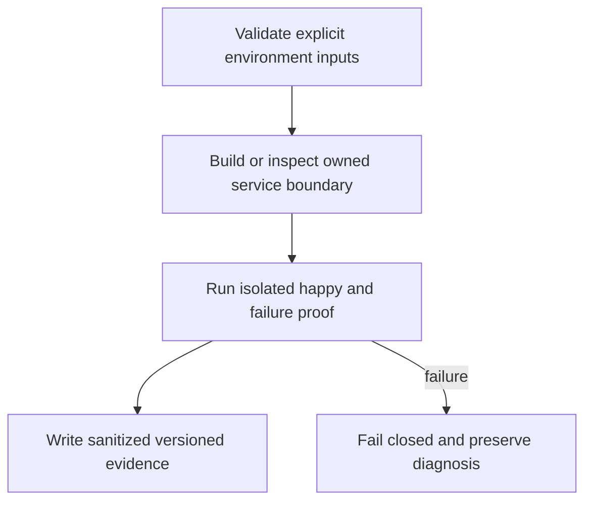

# Backend Restore and Upgrade Proof - Plan

## Goal Capsule

Prove that service data and server identity can be recovered, and that upgrades have a verified recovery route.

Authority: user decisions in `docs/product/decisions.md` precede this plan; then the approved ticket scope and owning contracts. Tail owner is the Khala Executor. This ticket does not grant authority over sibling Aiur processes or configuration.

Prerequisites and stop conditions: KHA-108 deployment contract available. Backup retention and recovery objectives require operator decision before production operation; disposable rehearsal remains executable.

---

## Product Contract

### Summary and problem frame

Prove that service data and server identity can be recovered, and that upgrades have a verified recovery route. Khala currently has research and proposal documents, so this work must define its own evidence without claiming an existing implemented subsystem.

### Requirements

- R1. Back up the database, server signing identity, configuration and required media as one documented recovery set.
- R2. Verify restoration in an isolated environment before declaring backups usable.
- R3. Treat schema-changing downgrade as a restore operation when upstream does not support binary rollback.

### Acceptance examples

- AE1. Restore synthetic encrypted history plus identity to a disposable environment and verify expected event IDs.
- AE2. A missing signing-key artifact causes recovery validation failure even if the database restores successfully.

### Scope and decisions

Use supported PostgreSQL backup tooling plus protected identity/config/media artifacts. Railway snapshots are supplementary; documented same-project/environment restore limits cannot serve as an untested cross-environment disaster plan.

Carry forward TypeScript, OSS reuse, Netlify preference, existing-session attachment, connector-gated E2EE review, and dashboard-native design. This ticket cannot add human technical setup or silently change an unresolved product policy.

---

## Planning Contract

Product Contract unchanged. An implementation-ready **plan** is not a claim that prerequisites have passed or that the ticket is dispatchable today. Resolve the named dependency and environment gates before production mutation; bounded local work may proceed where explicitly described.

### Grounding and technical decisions

KTD1. Use supported PostgreSQL backup tooling plus protected identity/config/media artifacts. Railway snapshots are supplementary; documented same-project/environment restore limits cannot serve as an untested cross-environment disaster plan.

KTD2. Keep platform operations separate from feature policy. Reuse upstream service/SDK behavior and narrow ports; no custom cryptography, replacement session or shared mutable application store is introduced here.

KTD3. Reserve shared manifests/lockfile and app entrypoints for their assigned owner. Components land against real reviewed contracts and isolated fixtures; integration owns binding to live implementations. See `docs/product/repo-layout.md`.

KTD4. User-directed TypeScript and Netlify preference remain constraints; Railway-hosted OSS is acceptable where it saves development. The owner-side continuous subscriber cannot live inside a request-lifetime function. (session-settled: user-directed — chosen over a mandatory custom Hono backend: reduce ongoing backend development and operation.)

### Existing evidence and refreshable implementation pointers

Khala researched base: `6d4694173eff9b0832f4c3a2cdb90b4281fcccd9`; proposed paths below do not exist as app implementation yet. Archon reference: `c7d3254097acaa02eed1e3be6fd8fbf06c0e8128`, especially `netlify.toml`, `package.json`, `netlify/lib/store.mjs`, and `netlify/lib/hosted/record-store.mjs` in that repository. Aiur reference: `1f618cddf601a0b6d79bc1197579746b7584a64c`; its dashboard supplies design language, not the runtime language or service topology. Refresh source/version facts at worker pickup without changing accepted product requirements.

Upstream backups require more than database rows: server identity and configuration must remain available. Railway volume restoration has project/environment constraints; use a logical export plus protected identity/config/media artifacts for the isolated restoration proof. Never test restore against production as a shortcut.

### Proposed owned files

- `infra/operations/backup.ts`
- `infra/operations/restore.ts`
- `infra/operations/upgrade-check.ts`
- `infra/operations/restore.test.ts`
- `infra/operations/manifest.schema.json`
- `docs/operations/backend.md`

### Worked boundary record

The following is an example record, not an assertion of collected runtime evidence. Fields marked recorded/resolved are required outputs of the implementation proof.

```json
{
  "schema_version": 1,
  "environment": "preview",
  "database_version": "recorded",
  "synapse_digest": "recorded",
  "artifacts": [
    {
      "kind": "database",
      "sha256": "recorded"
    },
    {
      "kind": "signing-key",
      "reference": "protected-artifact"
    },
    {
      "kind": "config",
      "reference": "protected-artifact"
    },
    {
      "kind": "media",
      "sha256": "recorded"
    }
  ],
  "restore_proof": "not-run"
}
```

### High-level technical design



### Mechanical restore isolation

The rehearsal first denies outbound network and excludes federation and active connector consumers, verifies that denial with a synthetic egress probe, then stops/quiesces writes before the consistent backup. A proven coordinated snapshot can replace quiescence only with equivalent consistency evidence. Restore database/media/config into fresh disposable volumes; restore the server signing identity only after isolation checks pass. Failed egress isolation aborts before boot. Never boot the restored identity against live users or production discovery/DNS. Record exact stop/snapshot/restore/start boundaries and refuse source-volume reuse.

### Dependencies and limits

Hard ticket prerequisites: KHA-108. Gates: KHA-108 deployment contract available. Backup retention and recovery objectives require operator decision before production operation; disposable rehearsal remains executable.

Every proposed verification command below is an implementation-time contract, not a command claimed to run during planning. The owning implementation must add the named script/entrypoint before invoking it. Package-manager and native SDK versions are pinned from actual supported releases at implementation; this plan does not fabricate a tested dependency tuple.

---

## Implementation Units

### U1. Specify recovery manifest

**Goal:** Specify recovery manifest.

**Requirements:** R1; overall R1–R3, AE1–AE2 constrain the completed ticket.

**Dependencies:** None beyond ticket prerequisites.

**Files:** `infra/operations/manifest.schema.json`.

**Approach:** Define versioned artifact list, hashes, source image/DB versions, timestamps and opaque secret artifact references. Keep keys out of manifest and plaintext logs.

**Patterns:** KTD1–KTD4; referenced upstream behavior and owned sibling boundaries.

**Test scenarios:** Missing required artifact/hash/version fails; manifest alone cannot decrypt messages or reveal DB credentials.

**Verification:** Record the observed pass/fail result, exact build/environment and sanitized evidence; do not infer runtime success from configuration parsing alone.

### U2. Produce consistent backup

**Goal:** Produce consistent backup.

**Requirements:** R2; overall R1–R3, AE1–AE2 constrain the completed ticket.

**Dependencies:** U1.

**Files:** `infra/operations/backup.ts`.

**Approach:** Use supported logical DB backup or verified equivalent, preserve server identity/config and media. Document consistency boundary and exclude only data upstream says safely regenerable.

**Patterns:** KTD1–KTD4; referenced upstream behavior and owned sibling boundaries.

**Test scenarios:** Restore test detects missing schema/data; media references can be checked; job failure never writes successful completion marker.

**Verification:** Record the observed pass/fail result, exact build/environment and sanitized evidence; do not infer runtime success from configuration parsing alone.

### U3. Rehearse restoration

**Goal:** Rehearse restoration.

**Requirements:** R3; overall R1–R3, AE1–AE2 constrain the completed ticket.

**Dependencies:** U2.

**Files:** `infra/operations/restore.ts`, `infra/operations/restore.test.ts`.

**Approach:** Require explicit isolated target allowlist and matching environment selector. Restore without contacting real users; verify counts/IDs and identity with synthetic fixtures.

**Patterns:** KTD1–KTD4; referenced upstream behavior and owned sibling boundaries.

**Test scenarios:** Wrong target refuses before mutation; corrupt artifact fails before restoring; successful proof records measured recovery time and observed data-loss window.

**Verification:** Record the observed pass/fail result, exact build/environment and sanitized evidence; do not infer runtime success from configuration parsing alone.

### U4. Exercise upgrade and recovery

**Goal:** Exercise upgrade and recovery.

**Requirements:** R3; overall R1–R3, AE1–AE2 constrain the completed ticket.

**Dependencies:** U3.

**Files:** `infra/operations/upgrade-check.ts`.

**Approach:** Read target version migration notes, test migration on copy and health/history checks; restore pre-upgrade backup if backward migration unsupported.

**Patterns:** KTD1–KTD4; referenced upstream behavior and owned sibling boundaries.

**Test scenarios:** Downgrading image alone is not called rollback; rehearsal records versions and exact safe sequence.

**Verification:** Record the observed pass/fail result, exact build/environment and sanitized evidence; do not infer runtime success from configuration parsing alone.

### U5. Write actionable runbook

**Goal:** Write actionable runbook.

**Requirements:** R3; overall R1–R3, AE1–AE2 constrain the completed ticket.

**Dependencies:** U4.

**Files:** `docs/operations/backend.md`.

**Approach:** Include ownership, alerts for stale/failed backups, resource baseline, retention and account-specific caveats. Define accepted RPO/RTO as an operator decision, not invented SLA.

**Patterns:** KTD1–KTD4; referenced upstream behavior and owned sibling boundaries.

**Test scenarios:** A second operator can reproduce restoration from artifacts and runbook; evidence contains no credentials or participant content.

**Verification:** Record the observed pass/fail result, exact build/environment and sanitized evidence; do not infer runtime success from configuration parsing alone.

---

## Verification Contract

| Check | Expected evidence |
|---|---|
| `pnpm exec tsx infra/operations/restore.ts --validate-only --manifest artifacts/backup-manifest.json` | Successful relevant validation after its owning script exists; failed prerequisites remain explicit. |
| `pnpm exec tsx infra/operations/upgrade-check.ts --environment rehearsal` | Successful relevant validation after its owning script exists; failed prerequisites remain explicit. |

Feature tests must exercise behavior and failure cases rather than mirror constants. Pure docs/config units use schema/config/build and real smoke evidence instead of artificial unit tests. A test double proves a component contract; it cannot prove production identity, crypto persistence, hosted routing or session delivery. Integration owners in the graph supply that proof.

Security checks use synthetic data and disposable identities. Do not publish raw environment dumps, process arguments, token-bearing URLs, database credentials, server signing keys or decrypted participant messages. Failure logs preserve request IDs and reason codes without content.

---

## Definition of Done

All R1–R3 and AE1–AE2 have evidence. All U-IDs satisfy their stated validation; unresolved external gates prevent a pass for dependent outcomes. Owned code/docs land green on current base, no abandoned experiment or fixture is exported into production, and shared file ownership remains intact. The Executor receives exact changed paths, tests run, unavailable checks and remaining limitations.

### Sources

- https://element-hq.github.io/synapse/latest/usage/administration/backups.html
- https://docs.railway.com/volumes/backups
- https://www.postgresql.org/docs/current/backup-dump.html

Local context: `docs/product/tickets/KHA-109.md`, `docs/product/repo-layout.md`, `docs/product/decisions.md`, and `docs/research/11-hosting-tradeoffs.md`. Official sources checked 2026-09-16; changing behavior must be rechecked at implementation.
