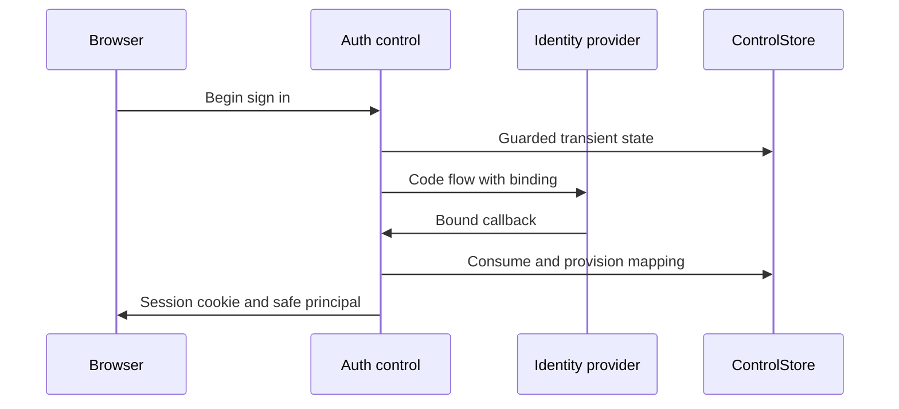

# KHA-110 Implement OAuth identity mapping - Plan

## Goal Capsule

Deliver implement oauth identity mapping. Authority: latest user decisions, then `docs/product/decisions.md`, the approved scope card, and this contract. Dependencies: KHA-101, KHA-105. Product trace: R02, R14, R15. Open launch gates: G-SUBSTRATE and G-ADMISSION; 105 contract and 144 binding proof.

Implementation belongs to the assigned ticket worker after gates clear. Root dependency changes, integration wiring, tracker publication and executor startup remain with their named owners. This artifact does not claim runtime proof.

---

## Product Contract

### Summary

Authenticate the human through the Archon-like email sign-in journey without a separate messaging account setup. This ticket covers the bounded outcome in `docs/product/tickets/KHA-110.md`.

### Problem Frame

Email-shaped display data and retried callbacks are insufficient to establish stable cross-organisation ownership.

### Requirements

- R1. Authenticate the human through the Archon-like email sign-in journey without a separate messaging account setup.
- R2. Bind ownership to verified issuer and subject, never a request-supplied email or display name.
- R3. Reject expired/revoked sessions and cross-origin mutations while distinguishing infrastructure failure from signed-out state.
- R4. Provision the internal messaging mapping idempotently without giving the backend message-decryption secrets.

### Actors and flow

A1 is the owning human; A2 is their trusted owner connector; A3 is the model-facing adapter; A4 is the ciphertext delivery/control service. Human identity and agent identity remain distinct.

F1. An authorised actor requests this ticket's operation; the owning module validates current identity/state, returns an explicit result, and downstream consumers retain the narrow meaning of that result. Failures remain visible and retries preserve the original operation identity.

### Acceptance Examples

- AE1. Repeated verified issuer/subject login after an email change retains the same owner and converges on one messaging account. Covers R1, R2.
- AE2. A replayed OAuth callback or forged owner body cannot create authority; a store outage returns unavailable rather than signed out. Covers R3, R4.

### Key Decisions

Connector-gated review is the confidentiality boundary (session-settled: user-directed — chosen over separate human-only encryption groups: the owner connector may hold pending plaintext). Application code remains TypeScript with OSS reuse (session-settled: user-directed — chosen over building a new custom stack by default: reduce implementation ownership). Netlify is preferred; Railway is acceptable when reuse saves work. Existing sessions remain the target; a fresh replacement conversation is not equivalent.

### Scope Boundaries

Only the scope card's owned paths may change. Production features are not implemented by feasibility tickets. This ticket cannot choose a new recovery promise, add human connector setup, select a provider through a fixture, or redesign the Aiur dashboard shell. KHA-107/143 own its client reuse/navigation decisions.

### Open Questions

G-SUBSTRATE and G-ADMISSION; 105 contract and 144 binding proof.

### Sources

- `docs/product/tickets/KHA-110.md`, `docs/product/repo-layout.md`, `docs/product/decisions.md`.
- `docs/research/04-identity-trust.md`, `docs/research/05-e2ee.md`, `docs/research/08-security-evidence.md`.

---

## Planning Contract

Planning baseline: Khala `6d4694173eff9b0832f4c3a2cdb90b4281fcccd9`; inspected Archon `c7d3254097acaa02eed1e3be6fd8fbf06c0e8128` and Aiur `1f618cddf601a0b6d79bc1197579746b7584a64c`. `docs/evidence/security-planning-sources.json` pins external source reads. Proposed paths are future outputs, not claims of existing implementation. Product requirements preserved; acceptance examples clarified against the same requirements during review.

### Key Technical Decisions

- KTD1. Reuse a maintained OIDC/OAuth client supported by the chosen identity provider, with code flow, state, nonce where applicable, PKCE and exact redirect allowlisting. Do not hand-write token signature validation. Issuer/audience/expiry and boolean verified-email claims are checked before constructing `AuthPrincipal`. [OAuth security BCP](https://www.rfc-editor.org/rfc/rfc9700.html) informs this boundary; provider/library/version selection must be recorded in144 evidence.
- KTD2. `createAuthService` is the module factory; it supplies `IdentityPort` and request-side `authenticateRequest`/`requireHumanMutation`. These functions return authenticated context separately from untrusted JSON. Passwords, Matrix access tokens and messaging crypto keys never appear in the human principal response.
- KTD3. Use purpose-separated, hashed session/transient tokens in ControlStore. Secure HttpOnly host-only cookies and mutation origin+CSRF checks follow Archon's `netlify/lib/hosted/identity.mjs`. Its storage-outage exception is distinct from missing session. Do not copy its 24-hour lifetime as an unapproved product requirement;144 records the configured policy.
- KTD4. Provision identity mapping as a resumable operation: verified principal → pending internal mapping → provider account exists → active mapping. CAS guards the mapping; lost provisioning response triggers lookup by stable external ID before another create. Login is not recovery of message keys.

### High-Level Technical Design

### State and failure contract

Exports live in `apps/control/src/auth/index.ts`; `createAuthService` takes provider client, ControlStore, trusted clock, random source and approved public origins. `authenticateRequest` returns authenticated/signed_out/unavailable; no catch-all converts outage to guest. Mutations require human principal and session-bound CSRF proof. A forged body `ownerId` has no authority. Same issuer/subject retains ownerId when verified email changes; two issuers with the same email remain separate identities. Server-side mapping stores protocol account ID, never endpoint crypto secrets. Return-path inputs must remain relative and reject scheme-relative or cross-origin navigation.

### Risks and open gates

G-ADMISSION determines account-linking/ownership semantics; G-SUBSTRATE determines supported provisioning/token exchange. Neither can be papered over with a development password or Matrix admin access in the browser. Infrastructure credentials are runtime secret bindings owned by131, least-privileged for provisioning. A shared Aiur dashboard does not automatically share an authentication trust domain;132 must use this explicit boundary.

---

## Implementation Units

### U1. Validate provider-bound identity

**Goal:** Validate provider-bound identity. **Requirements:** R1–R4; F1; applicable KTDs below. **Dependencies:** upstream tickets in Goal Capsule. **Files:** `apps/control/src/auth/{provider,principal}.ts`, `principal.test.ts`.

**Approach:** Implement claim-to-principal mapping after maintained-client validation, following KTD1. Persist issuer/subject, not email as key.

**Patterns to follow:** The named contract in KHA-105/106 and the source pattern cited in this Planning Contract; preserve the owned directory boundary.

**Test scenarios:**

- Covers AE1: repeated valid login yields same ownerId.
- Same verified email with another issuer yields distinct owner.
- Unverified boolean, string "true", missing subject, wrong issuer/audience and expired response fail without session.

**Verification:** The listed scenarios pass in the owned tests; record the observed result and relevant version/generation. A mocked result proves only module behavior, not a provider capability.

### U2. Guard callback and browser sessions

**Goal:** Guard callback and browser sessions. **Requirements:** R1–R4; F1; applicable KTDs below. **Dependencies:** U1. **Files:** `apps/control/src/auth/{sessions,csrf,callback}.ts`, `sessions.test.ts`, `callback.test.ts`.

**Approach:** Consume transient state with guarded operation identity; mint cookie only after identity and mapping success. Check origin and CSRF before mutation.

**Patterns to follow:** The named contract in KHA-105/106 and the source pattern cited in this Planning Contract; preserve the owned directory boundary.

**Test scenarios:**

- Covers AE2: simultaneous callback replay yields at most one active result.
- Missing/expired session is signed_out; store timeout is unavailable.
- Wrong-origin mutation and mismatched CSRF are rejected; callback return URL cannot redirect elsewhere.
- Logout retry after lost write response resolves same revocation.

**Verification:** The listed scenarios pass in the owned tests; record the observed result and relevant version/generation. A mocked result proves only module behavior, not a provider capability.

### U3. Reconcile internal account provisioning

**Goal:** Reconcile internal account provisioning. **Requirements:** R1–R4; F1; applicable KTDs below. **Dependencies:** U2. **Files:** `apps/control/src/auth/provisioning.ts`, `provisioning.test.ts`.

**Approach:** Use provider external identifier lookup and persisted pending mapping. No cross-key atomicity assumed.

**Patterns to follow:** The named contract in KHA-105/106 and the source pattern cited in this Planning Contract; preserve the owned directory boundary.

**Test scenarios:**

- Remote account created with lost response is adopted on retry without duplicate account.
- Competing same-owner requests converge; conflicting provider mapping fails explicitly.
- Messaging outage leaves retryable pending mapping, not authenticated ready channel.

**Verification:** The listed scenarios pass in the owned tests; record the observed result and relevant version/generation. A mocked result proves only module behavior, not a provider capability.

### U4. Publish typed service and redacted diagnostics

**Goal:** Publish typed service and redacted diagnostics. **Requirements:** R1–R4; F1; applicable KTDs below. **Dependencies:** U3. **Files:** `apps/control/src/auth/index.ts`, `service.test.ts`, `README.md`.

**Approach:** Expose injected service for131/132 adapters; log stable failure codes/request IDs only.

**Patterns to follow:** The named contract in KHA-105/106 and the source pattern cited in this Planning Contract; preserve the owned directory boundary.

**Test scenarios:**

- Public principal contains no bearer/private-key fields.
- Browser adapter signOut invalidates subsequent identify.
- Malformed input errors contain no raw provider token or cookie.

**Verification:** The listed scenarios pass in the owned tests; record the observed result and relevant version/generation. A mocked result proves only module behavior, not a provider capability.

---

## Verification Contract

After101 scripts exist: `pnpm --filter @khala/control typecheck`, `pnpm --filter @khala/control test`, and `pnpm check:boundaries`. Tests listed above run with injected provider/store faults. KHA-132 separately proves OAuth through the real deployed browser journey; these mocks cannot certify issuer configuration. Before dispatch,144 must supply the actual provider/library pins and supported provisioning path.

### Settled production origin — user amendment

P11 sets the production app origin to `https://khala.aiur.team`. Canonical production share links use that origin; OAuth callback is `https://khala.aiur.team/api/human/auth/callback`. KHA131 owns origin validation/configuration,110 consumes the exact callback and132 composes it. Preview allowlists/credentials stay explicit and separate. This does not assign a Matrix server_name or claim DNS/hosting is already configured. Earlier synthetic `.example` links remain test fixtures, never deployment defaults. This later user decision supplements the preserved Product Contract.

## Definition of Done

All authentication failure categories remain distinct; mapping is stable across retries/email changes; ordinary users never create a protocol account; callbacks and logout have concurrency evidence. G-ADMISSION/G-SUBSTRATE remain blocking until their signed-off evidence is incorporated. Remove abandoned-attempt code and temporary credentials; leave evidence free of message bodies, raw tokens and private keys. Do not change sibling implementations to make this ticket pass; return component defects to the named owner.

### Planning review and remaining confidence

Serial coherence, feasibility, security and adversarial review completed; see `docs/plans/reviews/security-planning-review.md`. This is a planning review, not a runtime security certification. Production implementation must record executed commands and observed evidence.
