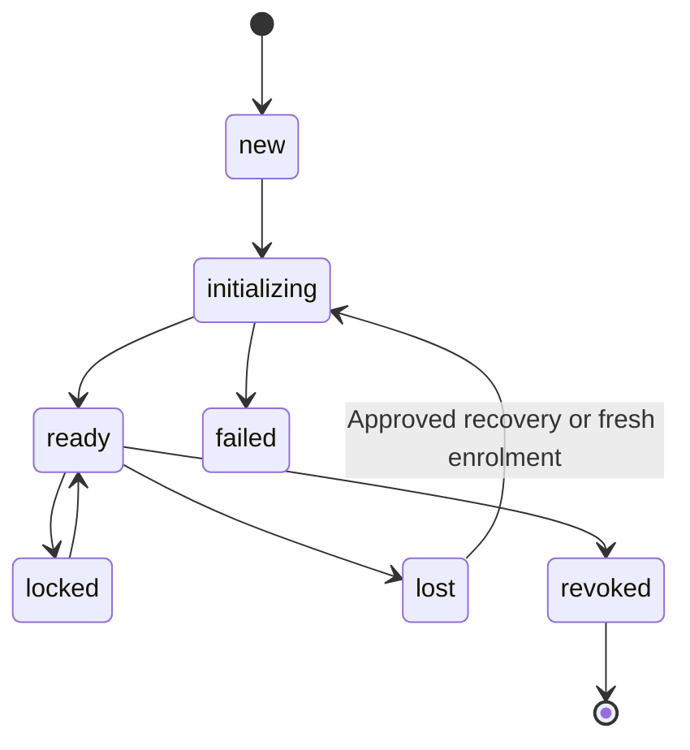

# KHA-111 Implement browser encrypted device lifecycle - Plan

## Goal Capsule

Deliver implement browser encrypted device lifecycle. Authority: latest user decisions, then `docs/product/decisions.md`, the approved scope card, and this contract. Dependencies: KHA-101, KHA-105. Product trace: R06, R14, R15. Open launch gates: G-SUBSTRATE; supported persistent-browser behavior from 141 and contract105.

Implementation belongs to the assigned ticket worker after gates clear. Root dependency changes, integration wiring, tracker publication and executor startup remain with their named owners. This artifact does not claim runtime proof.

---

## Product Contract

### Summary

Initialise usable encrypted device state automatically during the normal signed-in journey. This ticket covers the bounded outcome in `docs/product/tickets/KHA-111.md`.

### Problem Frame

Browser restart, multiple tabs and account switching can corrupt crypto state or expose the previous user's transcript if lifecycle ownership is implicit.

### Requirements

- R1. Initialise usable encrypted device state automatically during the normal signed-in journey.
- R2. Preserve the same device through supported browser restart without duplicating live crypto owners.
- R3. Surface missing, locked, revoked and unavailable key state without claiming lost history was recovered.
- R4. Keep private crypto state in authorised endpoint storage, outside backend logs and plaintext escrow.

### Actors and flow

A1 is the owning human; A2 is their trusted owner connector; A3 is the model-facing adapter; A4 is the ciphertext delivery/control service. Human identity and agent identity remain distinct.

F1. An authorised actor requests this ticket's operation; the owning module validates current identity/state, returns an explicit result, and downstream consumers retain the narrow meaning of that result. Failures remain visible and retries preserve the original operation identity.

### Acceptance Examples

- AE1. Restarting the browser with its persistent profile preserves device identity and decrypts a pre-restart encrypted event. Covers R1, R2.
- AE2. A late callback after account switch is ignored; cleared crypto state becomes lost rather than a fresh keyset under the old device. Covers R3, R4.

### Key Decisions

Connector-gated review is the confidentiality boundary (session-settled: user-directed — chosen over separate human-only encryption groups: the owner connector may hold pending plaintext). Application code remains TypeScript with OSS reuse (session-settled: user-directed — chosen over building a new custom stack by default: reduce implementation ownership). Netlify is preferred; Railway is acceptable when reuse saves work. Existing sessions remain the target; a fresh replacement conversation is not equivalent.

### Scope Boundaries

Only the scope card's owned paths may change. Production features are not implemented by feasibility tickets. This ticket cannot choose a new recovery promise, add human connector setup, select a provider through a fixture, or redesign the Aiur dashboard shell. KHA-107/143 own its client reuse/navigation decisions.

### Open Questions

G-SUBSTRATE; supported persistent-browser behavior from 141 and contract105.

### Sources

- `docs/product/tickets/KHA-111.md`, `docs/product/repo-layout.md`, `docs/product/decisions.md`.
- `docs/research/04-identity-trust.md`, `docs/research/05-e2ee.md`, `docs/research/08-security-evidence.md`.

---

## Planning Contract

Planning baseline: Khala `6d4694173eff9b0832f4c3a2cdb90b4281fcccd9`; inspected Archon `c7d3254097acaa02eed1e3be6fd8fbf06c0e8128` and Aiur `1f618cddf601a0b6d79bc1197579746b7584a64c`. `docs/evidence/security-planning-sources.json` pins external source reads. Proposed paths are future outputs, not claims of existing implementation. Product requirements preserved; acceptance examples clarified against the same requirements during review.

### Key Technical Decisions

- KTD1. `createBrowserDeviceService` implements DevicePort, owning one SDK client and crypto store per owner/device generation. A module singleton alone cannot coordinate two tabs; use a browser-wide exclusive owner lock and a bounded follower/readiness mechanism validated by141. A tab lacking that lock cannot mutate the crypto database.
- KTD2. Reuse the SDK's persistent IndexedDB crypto state. The inspected `matrix-js-sdk` commit `0e84500cc1f270e07b548b94e4a9991267d76bcb`, `src/client.ts`, selects IndexedDB or memory for Rust crypto; its documented shared-store multi-client restriction drives this single-owner design. The selected version may differ only after141 reproduces persistence.
- KTD3. Normal initialisation is automatic (session-settled: user-directed — chosen over manual keys/homeserver setup: human onboarding stays OAuth/create/share). Missing stored identity with existing server device is not an excuse to reuse that ID with a new keyset. Enter lost state and route approved recovery/re-enrolment.
- KTD4. Bind SDK callbacks to ownerId and generation. Stop observers, close SDK/store and wipe in-memory projections before account switch. Abort the caller's wait without claiming the server operation was cancelled.

### Lifecycle

`ensureReady` coalesces same-generation calls. Failures distinguish storage_unavailable, device_missing, device_revoked, credentials_expired and crypto_failed. UI gets DeviceView only; private stores, SDK credentials and decrypted timeline caches are not serialisable control state. Crypto operations queue behind initialisation. A lock timeout produces waiting/failed reason according to the view contract, never a second writer.

### Dependencies and risk

141 must name supported browsers, storage semantics and key-loss behavior;105 supplies public exports. IndexedDB clearing, quota pressure and service-worker updates can lose state. Do not imply local browser encryption resists malicious same-origin JavaScript. Recovery129 is injected rather than imported, avoiding a cycle and preserving gated scope.

---

## Implementation Units

### U1. Own SDK/store lifetime

**Goal:** Own SDK/store lifetime. **Requirements:** R1–R4; F1; applicable KTDs below. **Dependencies:** upstream tickets in Goal Capsule. **Files:** `packages/messaging/src/browser-device/{service,lifecycle}.ts`, `lifecycle.test.ts`.

**Approach:** Implement createBrowserDeviceService with injected SDK factory/store factory/lock provider; coalesce setup and reject use before ready.

**Patterns to follow:** The named contract in KHA-105/106 and the source pattern cited in this Planning Contract; preserve the owned directory boundary.

**Test scenarios:**

- Concurrent ensureReady returns one client generation.
- SDK setup failure closes partially opened store.
- Missing identity with old server device enters lost, not ready with new keys.

**Verification:** The listed scenarios pass in the owned tests; record the observed result and relevant version/generation. A mocked result proves only module behavior, not a provider capability.

### U2. Enforce cross-tab ownership

**Goal:** Enforce cross-tab ownership. **Requirements:** R1–R4; F1; applicable KTDs below. **Dependencies:** U1. **Files:** `packages/messaging/src/browser-device/ownership.ts`, `ownership.test.ts`.

**Approach:** Use141 validated exclusive browser lock; followers request state without opening mutation-capable clients.

**Patterns to follow:** The named contract in KHA-105/106 and the source pattern cited in this Planning Contract; preserve the owned directory boundary.

**Test scenarios:**

- Two tabs contend; exactly one owns writable crypto state.
- Owner termination releases/reacquires without cloning state.
- Unavailable locking fails explicitly; no hidden unsafe fallback.

**Verification:** The listed scenarios pass in the owned tests; record the observed result and relevant version/generation. A mocked result proves only module behavior, not a provider capability.

### U3. Handle account switch and revocation

**Goal:** Handle account switch and revocation. **Requirements:** R1–R4; F1; applicable KTDs below. **Dependencies:** U2. **Files:** `packages/messaging/src/browser-device/transitions.ts`, `transitions.test.ts`.

**Approach:** Invalidate old-generation callbacks before stopping SDK. Resolve current credentials through injected IdentityPort.

**Patterns to follow:** The named contract in KHA-105/106 and the source pattern cited in this Planning Contract; preserve the owned directory boundary.

**Test scenarios:**

- Covers AE2: old decryption callback after account switch cannot populate new account.
- Revocation during initialisation prevents ready publication.
- Expired session produces auth-required signal without deleting recovery material.

**Verification:** The listed scenarios pass in the owned tests; record the observed result and relevant version/generation. A mocked result proves only module behavior, not a provider capability.

### U4. Expose lifecycle and persistence checks

**Goal:** Expose lifecycle and persistence checks. **Requirements:** R1–R4; F1; applicable KTDs below. **Dependencies:** U3. **Files:** `packages/messaging/src/browser-device/index.ts`, `browser-device.browser.test.ts`, `README.md`.

**Approach:** Publish DevicePort and browser-backed persistence tests; unsupported recovery modes remain unavailable.

**Patterns to follow:** The named contract in KHA-105/106 and the source pattern cited in this Planning Contract; preserve the owned directory boundary.

**Test scenarios:**

- Covers AE1: full browser restart retains device ID and decrypts existing encrypted event.
- Cleared storage produces lost state and no invented old plaintext.
- Quota/write failure prevents successful readiness acknowledgement.

**Verification:** The listed scenarios pass in the owned tests; record the observed result and relevant version/generation. A mocked result proves only module behavior, not a provider capability.

---

## Verification Contract

Planned commands after101: `pnpm --filter @khala/messaging typecheck`, `pnpm --filter @khala/messaging test`, plus its registered browser-test target. A real persistent-profile browser restart is required; a page reload using an in-memory test store is insufficient. KHA-132 owns final browser/OAuth/room composition.

## Definition of Done

Single owner survives restart and account switches; lifecycle reasons are observable; actual browser-storage evidence exists; ordinary setup remains automatic. Dispatch waits for G-SUBSTRATE and141 capability evidence; this plan is decision-complete contingent on those dependencies. Remove abandoned-attempt code and temporary credentials; leave evidence free of message bodies, raw tokens and private keys. Do not change sibling implementations to make this ticket pass; return component defects to the named owner.

### Dispatch condition

Implementation-ready describes the bounded design, not a completed runtime proof or selected substrate. Dispatch waits for the named substrate/contract predecessors and incorporates their supported SDK APIs; a failed proof returns to the technical decision owner. No new product default is authorized.

### Planning review and remaining confidence

Serial coherence, feasibility, security and adversarial review completed; see `docs/plans/reviews/security-planning-review.md`. This is a planning review, not a runtime security certification. Production implementation must record executed commands and observed evidence.
