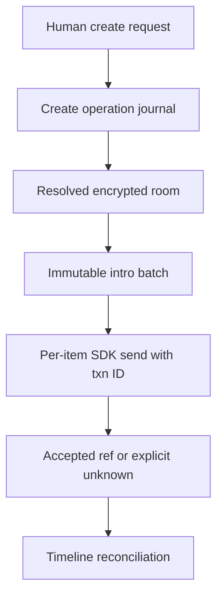

# KHA-112 Implement room and intro commands - Plan

## Goal Capsule

Deliver implement room and intro commands. Authority: latest user decisions, then `docs/product/decisions.md`, the approved scope card, and this contract. Dependencies: KHA-101, KHA-105. Product trace: R01, R03, R14. Open launch gates: G-SUBSTRATE; merged105; history disclosure policy belongs to113.

Implementation belongs to the assigned ticket worker after gates clear. Root dependency changes, integration wiring, tracker publication and executor startup remain with their named owners. This artifact does not claim runtime proof.

---

## Product Contract

### Summary

Create a chat with an optional name as the signed-in human. This ticket covers the bounded outcome in `docs/product/tickets/KHA-112.md`.

### Problem Frame

A multi-message introduction crosses several remote writes; a single optimistic success label hides partial acceptance and destroys reliable retry identity.

### Requirements

- R1. Create a chat with an optional name as the signed-in human.
- R2. Queue one or several introductory messages with human or delegated-agent authorship preserved.
- R3. Retries preserve room/message intent and reconcile partial acceptance without duplicate introductions.
- R4. Expose encrypted timeline and participant projection through owned messaging ports.

### Actors and flow

A1 is the owning human; A2 is their trusted owner connector; A3 is the model-facing adapter; A4 is the ciphertext delivery/control service. Human identity and agent identity remain distinct.

F1. An authorised actor requests this ticket's operation; the owning module validates current identity/state, returns an explicit result, and downstream consumers retain the narrow meaning of that result. Failures remain visible and retries preserve the original operation identity.

### Acceptance Examples

- AE1. An intro batch with two accepted items resumes its unresolved third using its original transaction identity, without resending the first two. Covers R1, R2.
- AE2. A lost room-create response remains outcome_unknown until reconciliation; retry does not blindly create another room. Covers R3, R4.

### Key Decisions

Connector-gated review is the confidentiality boundary (session-settled: user-directed — chosen over separate human-only encryption groups: the owner connector may hold pending plaintext). Application code remains TypeScript with OSS reuse (session-settled: user-directed — chosen over building a new custom stack by default: reduce implementation ownership). Netlify is preferred; Railway is acceptable when reuse saves work. Existing sessions remain the target; a fresh replacement conversation is not equivalent.

### Scope Boundaries

Only the scope card's owned paths may change. Production features are not implemented by feasibility tickets. This ticket cannot choose a new recovery promise, add human connector setup, select a provider through a fixture, or redesign the Aiur dashboard shell. KHA-107/143 own its client reuse/navigation decisions.

### Open Questions

G-SUBSTRATE; merged105; history disclosure policy belongs to113.

### Sources

- `docs/product/tickets/KHA-112.md`, `docs/product/repo-layout.md`, `docs/product/decisions.md`.
- `docs/research/04-identity-trust.md`, `docs/research/05-e2ee.md`, `docs/research/08-security-evidence.md`.

---

## Planning Contract

Planning baseline: Khala `6d4694173eff9b0832f4c3a2cdb90b4281fcccd9`; inspected Archon `c7d3254097acaa02eed1e3be6fd8fbf06c0e8128` and Aiur `1f618cddf601a0b6d79bc1197579746b7584a64c`. `docs/evidence/security-planning-sources.json` pins external source reads. Proposed paths are future outputs, not claims of existing implementation. Product requirements preserved; acceptance examples clarified against the same requirements during review.

### Key Technical Decisions

- KTD1. `createRoomService` implements RoomPort over selected SDK operations; SDK history remains the source of encrypted events. No Blobs duplicate transcript. Inputs carry stable operation/client transaction IDs before any effect.
- KTD2. Room creation and intro publication are separate outcomes. Some messaging APIs deduplicate event send transactions but not room creation; do not claim universal create idempotency. KHA-102/105 must supply the lookup/reconciliation mechanism. An unknown create result remains unknown until resolved rather than creating another room.
- KTD3. Intro batches are ordered immutable selections with per-item acceptance. There is no all-or-nothing SDK multi-event transaction assumed. A retry sends only unresolved items with their original transaction IDs and bytes; accepted items stay accepted.
- KTD4. Preserve human versus agent attribution and owner binding; a delegated agent may prepare/send authorised intro content but does not gain room creation authority through this ticket. Text bodies stay exact per105 digest encoding. Room titles are metadata: no promise of encrypted room names unless selected SDK support proves it.

### Data flow and state

Factory input: authenticated owner view, DevicePort readiness, SDK room adapter, local operation journal and clock. Exports `createRoomService` from owned index. Observe returns disposer; timeline projection merges local transaction with remote event ID without a second visible copy. Events missing decryption keys remain unavailable placeholders rather than blank messages or unsafe raw SDK exceptions. A room membership revocation stops new sends; it does not rewrite already accepted entries.

### Risks

Device/account changes during an outstanding batch must not retarget it. Intro completion only means transport accepted selected items. History disclosure on new admission is113's policy; room creation does not silently open old history to every future agent.

---

## Implementation Units

### U1. Create room with recoverable operation identity

**Goal:** Create room with recoverable operation identity. **Requirements:** R1–R4; F1; applicable KTDs below. **Dependencies:** upstream tickets in Goal Capsule. **Files:** `packages/messaging/src/rooms/{create,journal}.ts`, `create.test.ts`.

**Approach:** Persist intent before invoking SDK; reconcile success/unknown using approved substrate semantics.

**Patterns to follow:** The named contract in KHA-105/106 and the source pattern cited in this Planning Contract; preserve the owned directory boundary.

**Test scenarios:**

- Covers AE1: named and null-title rooms return proper summary.
- Create response loss does not cause blind duplicate room.
- Same operationId with another owner/title rejected.

**Verification:** The listed scenarios pass in the owned tests; record the observed result and relevant version/generation. A mocked result proves only module behavior, not a provider capability.

### U2. Commit and resume intro batches

**Goal:** Commit and resume intro batches. **Requirements:** R1–R4; F1; applicable KTDs below. **Dependencies:** U1. **Files:** `packages/messaging/src/rooms/intro.ts`, `intro.test.ts`.

**Approach:** Freeze batch ID, item order, actor and body digests; maintain per-item accepted refs.

**Patterns to follow:** The named contract in KHA-105/106 and the source pattern cited in this Planning Contract; preserve the owned directory boundary.

**Test scenarios:**

- Three-message batch with second failure retries unresolved items only.
- Late additional message is not appended to approved original batch.
- Delegated-agent original retains agent attribution; unsupported agent create returns forbidden.

**Verification:** The listed scenarios pass in the owned tests; record the observed result and relevant version/generation. A mocked result proves only module behavior, not a provider capability.

### U3. Project timeline and sends

**Goal:** Project timeline and sends. **Requirements:** R1–R4; F1; applicable KTDs below. **Dependencies:** U2. **Files:** `packages/messaging/src/rooms/{timeline,send}.ts`, `timeline.test.ts`, `send.test.ts`.

**Approach:** Map SDK events/local echoes into105 views and preserve opaque pagination cursors.

**Patterns to follow:** The named contract in KHA-105/106 and the source pattern cited in this Planning Contract; preserve the owned directory boundary.

**Test scenarios:**

- Remote echo before send response produces one item.
- Duplicate/out-of-order sync event dedupes by eventId.
- Missing key/failed decryption gives explicit safe placeholder; old generation is ignored.

**Verification:** The listed scenarios pass in the owned tests; record the observed result and relevant version/generation. A mocked result proves only module behavior, not a provider capability.

### U4. Publish RoomPort adapter

**Goal:** Publish RoomPort adapter. **Requirements:** R1–R4; F1; applicable KTDs below. **Dependencies:** U3. **Files:** `packages/messaging/src/rooms/index.ts`, `service.test.ts`, `README.md`.

**Approach:** Wire lifecycle/readiness internally; expose no SDK client to UI callers.

**Patterns to follow:** The named contract in KHA-105/106 and the source pattern cited in this Planning Contract; preserve the owned directory boundary.

**Test scenarios:**

- Covers AE2: revoked membership blocks new sends without altering accepted history.
- Stop/dispose removes observations.
- A failed message remains retryable with same content/transaction rather than silently changing bytes.

**Verification:** The listed scenarios pass in the owned tests; record the observed result and relevant version/generation. A mocked result proves only module behavior, not a provider capability.

---

## Verification Contract

After101: `pnpm --filter @khala/messaging typecheck`, `pnpm --filter @khala/messaging test`, `pnpm check:boundaries`. Live132 proof must cover partial intro acceptance with a lost network response. Provider create idempotency/reconciliation is a dispatch prerequisite; typed fakes cannot establish it.

## Definition of Done

Create, intro and timeline results retain narrow meanings; per-item retries preserve identity; named/unnamed UX and agent authorship are supported; no agent room-creation permission is invented. Remove abandoned-attempt code and temporary credentials; leave evidence free of message bodies, raw tokens and private keys. Do not change sibling implementations to make this ticket pass; return component defects to the named owner.

### Dispatch condition

Implementation-ready describes the bounded design, not a completed runtime proof or selected substrate. Dispatch waits for the named substrate/contract predecessors and incorporates their supported SDK APIs; a failed proof returns to the technical decision owner. No new product default is authorized.

### Planning review and remaining confidence

Serial coherence, feasibility, security and adversarial review completed; see `docs/plans/reviews/security-planning-review.md`. This is a planning review, not a runtime security certification. Production implementation must record executed commands and observed evidence.
