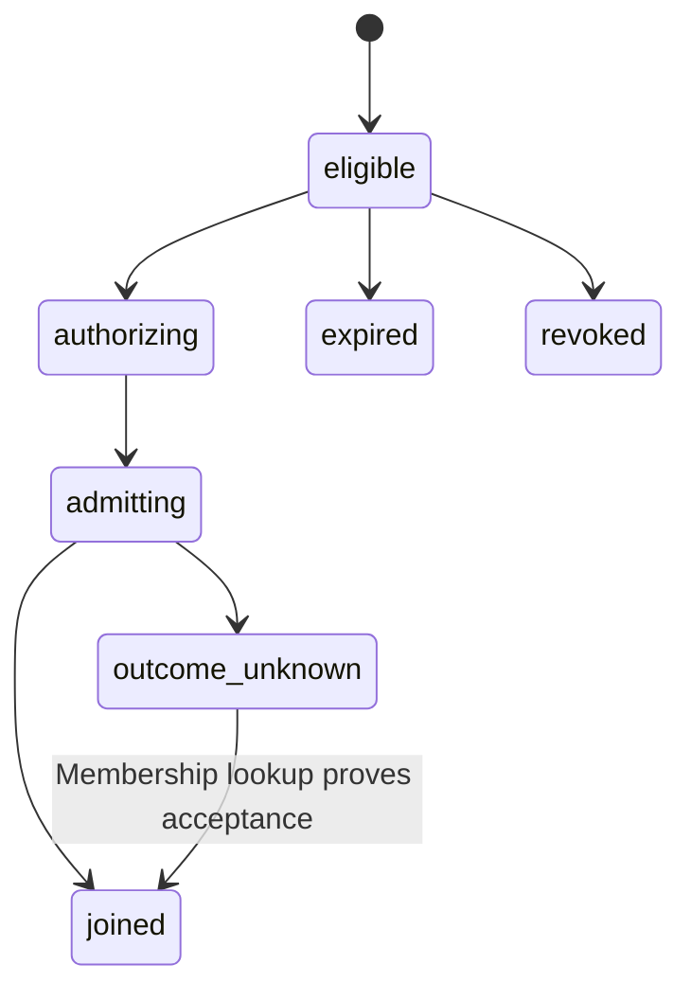

# KHA-113 Implement invitation admission - Plan

## Goal Capsule

Deliver implement invitation admission. Authority: latest user decisions, then `docs/product/decisions.md`, the approved scope card, and this contract. Dependencies: KHA-101, KHA-105. Product trace: R14. Open launch gates: G-ADMISSION and G-SUBSTRATE; history boundary must be resolved with G-RETENTION.

Implementation belongs to the assigned ticket worker after gates clear. Root dependency changes, integration wiring, tracker publication and executor startup remain with their named owners. This artifact does not claim runtime proof.

---

## Product Contract

### Summary

Admit the coworker through the approved channel-link journey without technical setup. This ticket covers the bounded outcome in `docs/product/tickets/KHA-113.md`.

### Problem Frame

A shared link can route the user but cannot simultaneously prove a named identity or owner authority without an additional authenticated binding.

### Requirements

- R1. Admit the coworker through the approved channel-link journey without technical setup.
- R2. Enforce the selected invite authority, expiry and revocation policy without disclosing content before authorisation.
- R3. Bind admission to the authenticated principal and selected device; retries do not create duplicate memberships.
- R4. Disclose only the history allowed by the approved admission policy.

### Actors and flow

A1 is the owning human; A2 is their trusted owner connector; A3 is the model-facing adapter; A4 is the ciphertext delivery/control service. Human identity and agent identity remain distinct.

F1. An authorised actor requests this ticket's operation; the owning module validates current identity/state, returns an explicit result, and downstream consumers retain the narrow meaning of that result. Failures remain visible and retries preserve the original operation identity.

### Acceptance Examples

- AE1. An authenticated eligible recipient retries the same admission operation and receives the same membership outcome. Covers R1, R2.
- AE2. A copied public invite cannot claim the creator’s agent identity; revoked, expired and wrong-account links return distinct safe outcomes. Covers R3, R4.

### Key Decisions

Connector-gated review is the confidentiality boundary (session-settled: user-directed — chosen over separate human-only encryption groups: the owner connector may hold pending plaintext). Application code remains TypeScript with OSS reuse (session-settled: user-directed — chosen over building a new custom stack by default: reduce implementation ownership). Netlify is preferred; Railway is acceptable when reuse saves work. Existing sessions remain the target; a fresh replacement conversation is not equivalent.

### Scope Boundaries

Only the scope card's owned paths may change. Production features are not implemented by feasibility tickets. This ticket cannot choose a new recovery promise, add human connector setup, select a provider through a fixture, or redesign the Aiur dashboard shell. KHA-107/143 own its client reuse/navigation decisions.

### Open Questions

G-ADMISSION and G-SUBSTRATE; history boundary must be resolved with G-RETENTION.

### Sources

- `docs/product/tickets/KHA-113.md`, `docs/product/repo-layout.md`, `docs/product/decisions.md`.
- `docs/research/04-identity-trust.md`, `docs/research/05-e2ee.md`, `docs/research/08-security-evidence.md`.

---

## Planning Contract

Planning baseline: Khala `6d4694173eff9b0832f4c3a2cdb90b4281fcccd9`; inspected Archon `c7d3254097acaa02eed1e3be6fd8fbf06c0e8128` and Aiur `1f618cddf601a0b6d79bc1197579746b7584a64c`. `docs/evidence/security-planning-sources.json` pins external source reads. Proposed paths are future outputs, not claims of existing implementation. Product requirements preserved; acceptance examples clarified against the same requirements during review.

### Key Technical Decisions

- KTD1. `createAdmissionService` implements AdmissionPort with inspect/admit/revoke-invite capability. Authenticated owner context is supplied out-of-band. Public link possession routes the request; whether it authorises recipient admission is G-ADMISSION, not a decoder assumption.
- KTD2. Keep admission orchestration resumable across control store and messaging service. Guard a per-invite/per-admission operation, then request idempotent membership, then mark outcome. Membership is not rolled back by deleting the journal after a timeout.
- KTD3. SDK-backed history disclosure obeys an explicit versioned policy output from144/105. A homeserver's history visibility alone does not prove cryptographic key exclusion. A recipient must never gain agent-owner authority just by joining the room.
- KTD4. Secret invite components are purpose-bound and stored only hashed where bearer semantics are selected. Do not log request URL, invite token or claimant PII in error traces. Rate limits and abuse controls use approved131 adapters; no custom global in-memory counter in serverless functions.

### Transition design

The transition diagram begins only after the chosen admission policy permits eligibility. Named-recipient versus transferable link changes that prior decision and remains blocked. `inspect` never returns pending message body, group keys or ownership credentials. `admit` binds operationId, principal, deviceId, invite revision and policy revision; a conflicting reuse rejects. If a invite is revoked after membership already committed, return joined/revocation-needed truthfully rather than pretending disclosure was undone.

### Open gates and integration

G-ADMISSION must choose named-person/bearer semantics, invitation reuse and any normal-context owner binding. G-RETENTION must set queued/prior history. KHA-144 verifies no-setup assumptions; KHA-132 composes UI, OAuth and browser key exchange. No default creator-approval screen is prescribed.

---

## Implementation Units

### U1. Validate invitation eligibility

**Goal:** Validate invitation eligibility. **Requirements:** R1–R4; F1; applicable KTDs below. **Dependencies:** upstream tickets in Goal Capsule. **Files:** `apps/control/src/invitations/{inspect,policy}.ts`, `inspect.test.ts`.

**Approach:** Use immutable metadata and current authenticated context; hide sensitive details from unauthorised callers.

**Patterns to follow:** The named contract in KHA-105/106 and the source pattern cited in this Planning Contract; preserve the owned directory boundary.

**Test scenarios:**

- Expired/revoked invite shows no channel content or secrets.
- Unauthenticated inspection yields auth_required with safe return navigation.
- Wrong named recipient rejects only when that policy is selected; bearer policy tests document its distinct authority.

**Verification:** The listed scenarios pass in the owned tests; record the observed result and relevant version/generation. A mocked result proves only module behavior, not a provider capability.

### U2. Guard redemption and retries

**Goal:** Guard redemption and retries. **Requirements:** R1–R4; F1; applicable KTDs below. **Dependencies:** U1. **Files:** `apps/control/src/invitations/journal.ts`, `journal.test.ts`.

**Approach:** Use105 ControlStore and operation ID binding; never rely on unconditional deletion for single use.

**Patterns to follow:** The named contract in KHA-105/106 and the source pattern cited in this Planning Contract; preserve the owned directory boundary.

**Test scenarios:**

- Concurrent redemption obeys configured use count.
- Same operation retry returns existing membership outcome.
- Same operationId with another device/principal rejects.
- Store outage produces unavailable rather than eligible.

**Verification:** The listed scenarios pass in the owned tests; record the observed result and relevant version/generation. A mocked result proves only module behavior, not a provider capability.

### U3. Reconcile membership and history

**Goal:** Reconcile membership and history. **Requirements:** R1–R4; F1; applicable KTDs below. **Dependencies:** U2. **Files:** `apps/control/src/invitations/admit.ts`, `admit.test.ts`.

**Approach:** Invoke injected membership/key-disclosure ports only after authorisation; read back remote membership on ambiguous result.

**Patterns to follow:** The named contract in KHA-105/106 and the source pattern cited in this Planning Contract; preserve the owned directory boundary.

**Test scenarios:**

- Covers AE1: valid join yields same member once.
- Membership accepted but response lost resolves without duplicate welcome/history transfer.
- Revocation before admission prevents join; after accepted membership reports disclosure truthfully.
- History transfer failure returns partial readiness instead of granting hidden extra history.

**Verification:** The listed scenarios pass in the owned tests; record the observed result and relevant version/generation. A mocked result proves only module behavior, not a provider capability.

### U4. Export service and safe responses

**Goal:** Export service and safe responses. **Requirements:** R1–R4; F1; applicable KTDs below. **Dependencies:** U3. **Files:** `apps/control/src/invitations/index.ts`, `service.test.ts`, `README.md`.

**Approach:** Return105 views for124/132; document chosen policy and state expiry.

**Patterns to follow:** The named contract in KHA-105/106 and the source pattern cited in this Planning Contract; preserve the owned directory boundary.

**Test scenarios:**

- Covers AE2: unknown membership outcome remains unknown after retry timeout.
- Copied public link cannot mint owner connector credential.
- Responses and logs contain neither raw bearer nor group key material.

**Verification:** The listed scenarios pass in the owned tests; record the observed result and relevant version/generation. A mocked result proves only module behavior, not a provider capability.

---

## Verification Contract

After101: `pnpm --filter @khala/control typecheck`, `pnpm --filter @khala/control test`, and `pnpm check:boundaries`. KHA-132 live two-human admission must establish membership/history behavior on the selected SDK. No dispatch until admission and history decisions are recorded in105; this artifact intentionally remains requirements-only.

### Settled production origin — user amendment

P11 sets the production app origin to `https://khala.aiur.team`. Canonical production share links use that origin; OAuth callback is `https://khala.aiur.team/api/human/auth/callback`. KHA131 owns origin validation/configuration,110 consumes the exact callback and132 composes it. Preview allowlists/credentials stay explicit and separate. This does not assign a Matrix server_name or claim DNS/hosting is already configured. Earlier synthetic `.example` links remain test fixtures, never deployment defaults. This later user decision supplements the preserved Product Contract.

## Definition of Done

Exact admission policy is documented and all corresponding race/expiry/ownership tests pass. A joined recipient receives no more authority/history than the signed-off policy. Lost acknowledgements remain reconcilable. Remove abandoned-attempt code and temporary credentials; leave evidence free of message bodies, raw tokens and private keys. Do not change sibling implementations to make this ticket pass; return component defects to the named owner.

### Consumer contract clarification

`AdmissionPort.share({operationId,roomId})` issues or reconciles the same invite and returns `{inviteRef,shareUrl,expiresAt:null|string}`. The service constructs the canonical allowlisted application URL; the UI never infers protocol identifiers or builds a bearer credential into a URL. Whether a link is public admission or requires an eligible account remains G-ADMISSION. `inspect` includes `identity_mismatch` when a verified current account fails the approved identity restriction; it never reveals another account’s email. Issuance requires room-authorized human context, supports operation-ID retries, and writes through injected ControlStore. Add `share.test.ts` for repeated issuance, missing room authority, forbidden origin, and wrong-account inspection.

### Planning review and remaining confidence

Serial coherence, feasibility, security and adversarial review completed; see `docs/plans/reviews/security-planning-review.md`. This is a planning review, not a runtime security certification. Production implementation must record executed commands and observed evidence.
