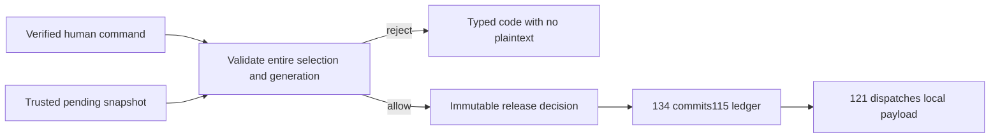

# KHA-119 Implement exact approval release - Plan

## Goal Capsule

Deliver implement exact approval release. Authority: latest user decisions, then `docs/product/decisions.md`, the approved scope card, and this contract. Dependencies: KHA-101, KHA-105, KHA-106. Product trace: R04, R14. Open launch gates: No new product fork; requires merged105/106 and verified authority supplied by composition.

Implementation belongs to the assigned ticket worker after gates clear. Root dependency changes, integration wiring, tracker publication and executor startup remain with their named owners. This artifact does not claim runtime proof.

---

## Product Contract

### Summary

Authorise only the immutable messages and bytes selected by the recipient human. This ticket covers the bounded outcome in `docs/product/tickets/KHA-119.md`.

### Problem Frame

Selection by timeline position or a blanket pending flag allows unseen arrivals and edited bytes to enter the agent context.

### Requirements

- R1. Authorise only the immutable messages and bytes selected by the recipient human.
- R2. Bind release to the intended recipient connector and existing working session.
- R3. Reject forged authority, stale policy, changed content and mismatched membership without releasing any selected item.
- R4. Repeating the same command returns its existing outcome; later arrivals remain pending.

### Actors and flow

A1 is the owning human; A2 is their trusted owner connector; A3 is the model-facing adapter; A4 is the ciphertext delivery/control service. Human identity and agent identity remain distinct.

F1. An authorised actor requests this ticket's operation; the owning module validates current identity/state, returns an explicit result, and downstream consumers retain the narrow meaning of that result. Failures remain visible and retries preserve the original operation identity.

### Acceptance Examples

- AE1. The human selects events A and B while C is pending; only exact A/B bytes are released to the specified existing session generation. Covers R1, R2.
- AE2. A changed B digest or stale recipient generation rejects the entire command; retrying the same accepted command returns its recorded result. Covers R3, R4.

### Key Decisions

Connector-gated review is the confidentiality boundary (session-settled: user-directed — chosen over separate human-only encryption groups: the owner connector may hold pending plaintext). Application code remains TypeScript with OSS reuse (session-settled: user-directed — chosen over building a new custom stack by default: reduce implementation ownership). Netlify is preferred; Railway is acceptable when reuse saves work. Existing sessions remain the target; a fresh replacement conversation is not equivalent.

### Scope Boundaries

Only the scope card's owned paths may change. Production features are not implemented by feasibility tickets. This ticket cannot choose a new recovery promise, add human connector setup, select a provider through a fixture, or redesign the Aiur dashboard shell. KHA-107/143 own its client reuse/navigation decisions.

### Open Questions

No new product fork; requires merged105/106 and verified authority supplied by composition.

### Sources

- `docs/product/tickets/KHA-119.md`, `docs/product/repo-layout.md`, `docs/product/decisions.md`.
- `docs/research/04-identity-trust.md`, `docs/research/05-e2ee.md`, `docs/research/08-security-evidence.md`.

---

## Planning Contract

Planning baseline: Khala `6d4694173eff9b0832f4c3a2cdb90b4281fcccd9`; inspected Archon `c7d3254097acaa02eed1e3be6fd8fbf06c0e8128` and Aiur `1f618cddf601a0b6d79bc1197579746b7584a64c`. `docs/evidence/security-planning-sources.json` pins external source reads. Proposed paths are future outputs, not claims of existing implementation. Product requirements preserved; acceptance examples clarified against the same requirements during review.

### Key Technical Decisions

- KTD1. Export `evaluateApproval` and `encodeReleasePayload` from `packages/policy/src/release/index.ts`. This module is pure: it receives verified OwnerAuthority, ApprovalCommand, current immutable binding, effective policy, and exact decrypted event records supplied by trusted composition. It returns a decision, never reads SDK/history/storage itself. KHA-134 executes approved ledger effects.
- KTD2. Validate owner, room membership, binding ID and `expectedBindingGeneration`, policy version, all author/device references and every content digest before creating any output. `issuedAt` is audit metadata; it is not proof of freshness or authority. User-supplied `human:true` never grants authority. Duplicate references are rejected to avoid multiple release interpretation.
- KTD3. One release is bound to the command ID plus exact selected references and immutable recipient. The command journal owned by115/134 returns the previously committed result for a retry, rejects same ID/different bytes, and preserves outcome_unknown if commit is ambiguous. Pure evaluation cannot promise exactly-once harness effects.
- KTD4. `ReleasedJob` follows106. `payloadRef` is a connector-local opaque ledger handle, not a filesystem path, HTTP token or model-readable resource. A notification includes release identity only. Pending text must not enter errors or tracing.

### Release encoding and flow

Canonical release bytes are UTF-8 compact positional JSON: `["khala.release.v1",releaseId,bindingId,generation,policyVersion,[[roomId,eventId,authorParticipantId,authorDeviceId,contentDigest,body],...]]`. Retain selection order; no Unicode/newline normalization; all integers are safe nonnegative integers. `payloadDigest` is prefixed lowercase SHA-256 over these bytes. KHA-105 owns the individual message codec; this release codec adds provenance and target identity. No mutable rendered text is re-read after evaluation.



A later arrival is not selected. An edit is a new event/digest and requires new authority. A redacted/unavailable selected body makes the whole command fail; do not silently release the remaining subset. Rebind after validation is caught again at ledger claim/dispatch by106/121; pure validation cannot make a distributed transaction.


---

## Implementation Units

### U1. Validate complete authority and selection

**Goal:** Validate complete authority and selection. **Requirements:** R1–R4; F1; applicable KTDs below. **Dependencies:** upstream tickets in Goal Capsule. **Files:** `packages/policy/src/release/{evaluate,types}.ts`, `evaluate.test.ts`.

**Approach:** Use106 delivery scalars and injected exact event records; no imports from messaging domain. Return typed rejection without partial decisions.

**Patterns to follow:** The named contract in KHA-105/106 and the source pattern cited in this Planning Contract; preserve the owned directory boundary.

**Test scenarios:**

- Two selected of three pending releases only those two.
- Forged owner, wrong room, stale expectedBindingGeneration, policy mismatch and one missing item each reject whole selection.
- Author device substitution and changed body with old digest fail.

**Verification:** The listed scenarios pass in the owned tests; record the observed result and relevant version/generation. A mocked result proves only module behavior, not a provider capability.

### U2. Specify deterministic release bytes

**Goal:** Specify deterministic release bytes. **Requirements:** R1–R4; F1; applicable KTDs below. **Dependencies:** U1. **Files:** `packages/policy/src/release/codec.ts`, `codec.test.ts`.

**Approach:** Encode the documented positional tuple and hash with supported platform primitive. Check literal fixture below independently.

**Patterns to follow:** The named contract in KHA-105/106 and the source pattern cited in this Planning Contract; preserve the owned directory boundary.

**Test scenarios:**

- Exact literal digest matches; reordered selection differs.
- Composed versus decomposed Unicode and LF versus CRLF differ.
- Unsafe integer or unknown message version rejected.

**Verification:** The listed scenarios pass in the owned tests; record the observed result and relevant version/generation. A mocked result proves only module behavior, not a provider capability.

### U3. Expose retry-safe decision handoff

**Goal:** Expose retry-safe decision handoff. **Requirements:** R1–R4; F1; applicable KTDs below. **Dependencies:** U2. **Files:** `packages/policy/src/release/index.ts`, `handoff.test.ts`, `README.md`.

**Approach:** Return decision identity/content fingerprint for134 journal. Document precommit validation and stale dispatch guard.

**Patterns to follow:** The named contract in KHA-105/106 and the source pattern cited in this Planning Contract; preserve the owned directory boundary.

**Test scenarios:**

- Same command and snapshot yields same decision.
- Same command changed bytes yields conflicting fingerprint for journal rejection.
- Error serialization carries no body; payloadRef cannot become public URL.

**Verification:** The listed scenarios pass in the owned tests; record the observed result and relevant version/generation. A mocked result proves only module behavior, not a provider capability.

---

## Verification Contract

Planned: `pnpm --filter @khala/policy typecheck`, `pnpm --filter @khala/policy test`, `pnpm check:boundaries`. Tests inject authority/pending snapshots and must prove absence of SDK/storage calls. KHA-134/138 own commit, restart and model-surface integration proof. Neither policy-unit tests nor this plan claim exactly-once injection.

## Definition of Done

Exact selection, provenance, digest, recipient generation and effective policy are checked before a release decision. Literal codec parity and all stale/forged cases pass;134 consumes the decision without broadening selection. Remove abandoned-attempt code and temporary credentials; leave evidence free of message bodies, raw tokens and private keys. Do not change sibling implementations to make this ticket pass; return component defects to the named owner.

### Literal release fixture

For release `release_demo_1`, binding `binding_a1`, generation1, policyVersion1 and one105 sample event authored by `agent_alice`/`device_a1`, canonical bytes have length 230 and digest `sha256:99014d34d49a8edd7f21b5c983a3fe63856ece67ea7c7ae2741db0193c3ec243`. Exact JSON representation:

```json
["khala.release.v1","release_demo_1","binding_a1",1,1,[["room_demo","event_intro_1","agent_alice","device_a1","sha256:f16c1e5a70000f33eebc69c8ecf82d1ab7360fcdd15121ac3293f1afd4d4ea6b","Review the API change.\nDo not merge yet."]]]
```

Computed independently with Python hashlib during planning. This checks the documented encoding, not SDK interoperability. Keep a literal expected value in `codec.test.ts`.

### Planning review and remaining confidence

Serial coherence, feasibility, security and adversarial review completed; see `docs/plans/reviews/security-planning-review.md`. This is a planning review, not a runtime security certification. Production implementation must record executed commands and observed evidence.

### Peer review reconciliation

ApprovalPort returns `outcome_unknown` with operationId when ledger commit cannot be proven; it never maps that case to an ordinary retryable rejection. Missing retained/deleted selection returns `expired_content` without partial release. Align decoder/result fixtures with106.
