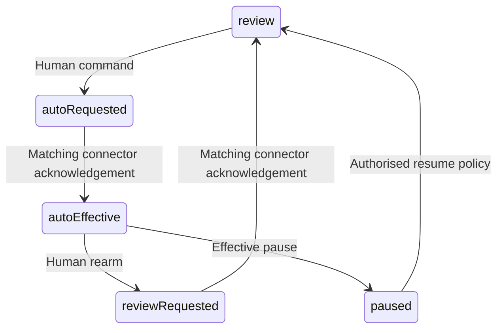

# KHA-120 Implement trust and re-arm transitions - Plan

## Goal Capsule

Deliver implement trust and re-arm transitions. Authority: latest user decisions, then `docs/product/decisions.md`, the approved scope card, and this contract. Dependencies: KHA-101, KHA-105, KHA-106. Product trace: R05, R14. Open launch gates: G-AUTOMATION: offline forwarding, pending backlog and pause semantics.

Implementation belongs to the assigned ticket worker after gates clear. Root dependency changes, integration wiring, tracker publication and executor startup remain with their named owners. This artifact does not claim runtime proof.

---

## Product Contract

### Summary

Enable automatic peer delivery only under human-authorised scoped policy. This ticket covers the bounded outcome in `docs/product/tickets/KHA-120.md`.

### Problem Frame

A browser toggle can claim review is active while a disconnected connector continues to apply an older automatic policy.

### Requirements

- R1. Enable automatic peer delivery only under human-authorised scoped policy.
- R2. Distinguish requested policy from policy acknowledged effective by the connector.
- R3. Re-arming review does not claim to retract previously delivered content.
- R4. Apply the approved backlog/offline policy deterministically under retries and competing requests.

### Actors and flow

A1 is the owning human; A2 is their trusted owner connector; A3 is the model-facing adapter; A4 is the ciphertext delivery/control service. Human identity and agent identity remain distinct.

F1. An authorised actor requests this ticket's operation; the owning module validates current identity/state, returns an explicit result, and downstream consumers retain the narrow meaning of that result. Failures remain visible and retries preserve the original operation identity.

### Acceptance Examples

- AE1. The owner requests re-arm while the connector is offline; the UI reports requested until a matching connector acknowledgment establishes effective review mode. Covers R1, R2.
- AE2. A model-supplied policy command or older acknowledgment cannot enable auto mode, roll back a newer policy or authorize another generation. Covers R3, R4.

### Key Decisions

Connector-gated review is the confidentiality boundary (session-settled: user-directed — chosen over separate human-only encryption groups: the owner connector may hold pending plaintext). Application code remains TypeScript with OSS reuse (session-settled: user-directed — chosen over building a new custom stack by default: reduce implementation ownership). Netlify is preferred; Railway is acceptable when reuse saves work. Existing sessions remain the target; a fresh replacement conversation is not equivalent.

### Scope Boundaries

Only the scope card's owned paths may change. Production features are not implemented by feasibility tickets. This ticket cannot choose a new recovery promise, add human connector setup, select a provider through a fixture, or redesign the Aiur dashboard shell. KHA-107/143 own its client reuse/navigation decisions.

### Open Questions

G-AUTOMATION: offline forwarding, pending backlog and pause semantics.

### Sources

- `docs/product/tickets/KHA-120.md`, `docs/product/repo-layout.md`, `docs/product/decisions.md`.
- `docs/research/04-identity-trust.md`, `docs/research/05-e2ee.md`, `docs/research/08-security-evidence.md`.

---

## Planning Contract

Planning baseline: Khala `6d4694173eff9b0832f4c3a2cdb90b4281fcccd9`; inspected Archon `c7d3254097acaa02eed1e3be6fd8fbf06c0e8128` and Aiur `1f618cddf601a0b6d79bc1197579746b7584a64c`. `docs/evidence/security-planning-sources.json` pins external source reads. Proposed paths are future outputs, not claims of existing implementation. Product requirements preserved; acceptance examples clarified against the same requirements during review.

### Key Technical Decisions

- KTD1. Export pure `evaluatePolicyChange` and `evaluateAutomaticRelease` from `packages/policy/src/trust/index.ts`. KHA-106 PolicySetCommand supplies binding ID, expectedBindingGeneration, expected policy version, mode review/auto, paused state and peer scope. Verified OwnerAuthority is a separate trusted argument. A peer message or model tool cannot change this policy.
- KTD2. Separate requested policy from effective connector policy. Control persistence receipt is not enforcement. Only a connector acknowledgment for the matching generation/version advances effective state. Re-arm while disconnected remains requested; display no claim of immediate revocation of already supplied plaintext.
- KTD3. Auto-release requires effective unpaused auto mode, allowed peer, unchanged session generation and the approved budget/causal constraints. It returns the same exact immutable release specification as119. Do not implement an all-pending shortcut, implicit trust inheritance or automatic model-created policy change.
- KTD4. G-AUTOMATION must settle budget, loop limit, human triggers and offline expectations before production implementation. Pure transition types can be reviewed now; invented default limits are not approved requirements.

### State semantics

CAS policy version conflict requires refresh and fresh human intent, not last-write-wins. Duplicate command returns original result. Old acknowledgments cannot overwrite a newer request. On reconnect, connector obtains latest authoritative policy before evaluating queued auto releases; if it cannot prove freshness it holds pending. In-flight release semantics must be explicitly recorded by G-AUTOMATION, with the irreversibility of already delivered content explained.

---

## Implementation Units

### U1. Model requested and effective transitions

**Goal:** Model requested and effective transitions. **Requirements:** R1–R4; F1; applicable KTDs below. **Dependencies:** upstream tickets in Goal Capsule. **Files:** `packages/policy/src/trust/{transitions,types}.ts`, `transitions.test.ts`.

**Approach:** Represent requested/effective revisions independently and accept explicit ack input from trusted connector composition.

**Patterns to follow:** The named contract in KHA-105/106 and the source pattern cited in this Planning Contract; preserve the owned directory boundary.

**Test scenarios:**

- Disconnected rearm remains requested.
- Old ack after newer request does not roll back effective state.
- Wrong owner, stale binding generation and stale policy version reject.

**Verification:** The listed scenarios pass in the owned tests; record the observed result and relevant version/generation. A mocked result proves only module behavior, not a provider capability.

### U2. Evaluate narrow automatic release

**Goal:** Evaluate narrow automatic release. **Requirements:** R1–R4; F1; applicable KTDs below. **Dependencies:** U1. **Files:** `packages/policy/src/trust/automatic.ts`, `automatic.test.ts`.

**Approach:** Use approved peer/budget/causal configuration and119 release decision shape. Require known policy freshness.

**Patterns to follow:** The named contract in KHA-105/106 and the source pattern cited in this Planning Contract; preserve the owned directory boundary.

**Test scenarios:**

- Review mode, paused, stale/unknown freshness and disallowed peer release nothing.
- Duplicate event does not produce another release identity.
- Model-generated policy command has no authority.

**Verification:** The listed scenarios pass in the owned tests; record the observed result and relevant version/generation. A mocked result proves only module behavior, not a provider capability.

### U3. Document race and budget handoff

**Goal:** Document race and budget handoff. **Requirements:** R1–R4; F1; applicable KTDs below. **Dependencies:** U2. **Files:** `packages/policy/src/trust/index.ts`, `README.md`, `race.test.ts`.

**Approach:** Expose pure effects for135; persisted CAS and delivery remain115/121/134 responsibilities.

**Patterns to follow:** The named contract in KHA-105/106 and the source pattern cited in this Planning Contract; preserve the owned directory boundary.

**Test scenarios:**

- Rebind between request and acknowledgment cannot activate trust for new generation.
- Budget exhaustion produces held status without plaintext reason.
- Restart with missing policy remains held until reconciled.

**Verification:** The listed scenarios pass in the owned tests; record the observed result and relevant version/generation. A mocked result proves only module behavior, not a provider capability.

---

## Verification Contract

Planned: `pnpm --filter @khala/policy test`, `pnpm --filter @khala/policy typecheck`, `pnpm check:boundaries`. G-AUTOMATION approval must provide exact budget/loop examples before tests freeze.135/138 prove real connector ack and reconnect behavior; a browser toggle test is insufficient.

## Definition of Done

Policy decisions are pure and scoped; requested/effective are distinguishable; peer/model cannot alter human authority; approved automation examples pass. G-AUTOMATION remains an implementation gate. Remove abandoned-attempt code and temporary credentials; leave evidence free of message bodies, raw tokens and private keys. Do not change sibling implementations to make this ticket pass; return component defects to the named owner.

### Planning review and remaining confidence

Serial coherence, feasibility, security and adversarial review completed; see `docs/plans/reviews/security-planning-review.md`. This is a planning review, not a runtime security certification. Production implementation must record executed commands and observed evidence.

### Peer review reconciliation

Policy acknowledgments echo command/request identity and binding generation, with a safe rejection reason when rejected. Matching version alone is insufficient after rebind. Tests include an otherwise identical version acknowledgment for a different generation/request.

### Backlog decision boundary

Enabling automatic delivery must not implicitly sweep pending history. G-AUTOMATION supplies the visible backlog choice; recommended contract separates future policy activation from an explicit119 exact backlog selection. If selected backlog release and policy activation are distinct commands, report their two outcomes and do not imply atomicity. Add transition tests for future-only activation, chosen backlog release, and failure between the two effects; newly arriving events are never silently added to an earlier selection. Coordinate106 command representation before contract freeze.
