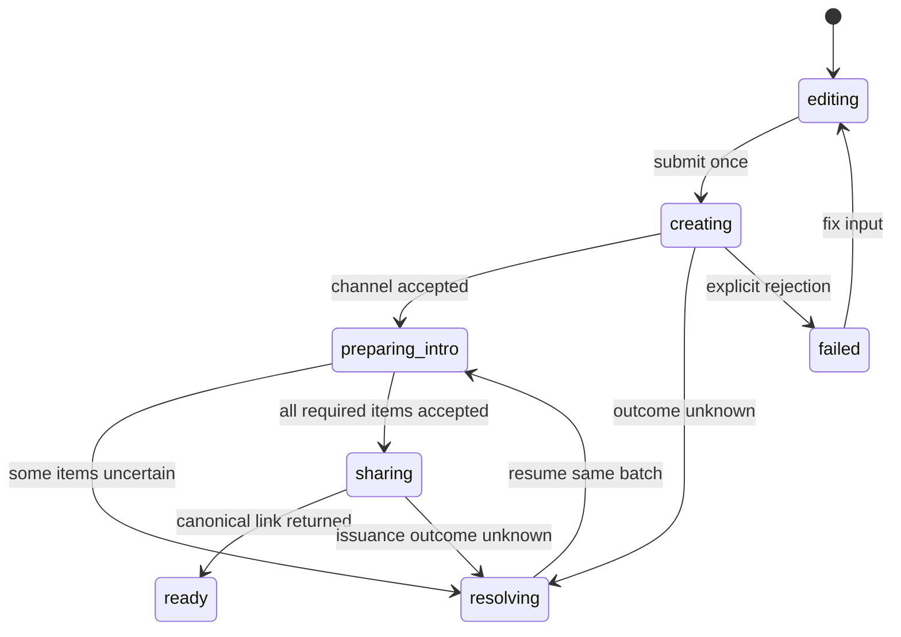

# KHA-122 Create channel and introductions - Plan

## Goal Capsule

A human can create an optionally named channel, prepare several introduction messages and copy its link.

Authority: current user decisions override the approved ticket scope, which overrides technical recommendations. Scope source is `docs/product/tickets/KHA-122.md`; global requirements: R03, R12, R14, R15. Planning snapshot: Khala `6d4694173eff9b0832f4c3a2cdb90b4281fcccd9` with approved ticket proposal at `d625c19`. Dependency tickets: KHA-101, KHA-105, KHA-107. This plan changes Khala only; sibling Aiur/Archon are read-only design references.

Stop condition: No product blocker for basic text creation. Upstream room/invitation contracts own eligibility and history limits; attachments are not silently added.

---

## Product Contract

### Summary

A human can create an optionally named channel, prepare several introduction messages and copy its link.

### Problem Frame

The ordinary user is collaborating with another human and their already-working agent. Rebuilding generic chat, exposing infrastructure setup, or confusing pending delivery with model consumption undermines that workflow. This ticket owns one bounded part of the shared journey.

### Requirements

- R1. An authenticated human creates a named or unnamed channel without configuring infrastructure.
- R2. Introduction messages preserve authored order and remain distinct messages suitable for later recipient review.
- R3. Retries do not duplicate the channel or already accepted introduction messages.
- R4. The same link can be shared with the owner’s existing agent and coworker; no manual connector setup is added.

### Actors and flow

- A1. The authenticated human who owns the current agent connection.
- A2. Other admitted humans and their attributed agents, whose messages are content rather than control authority.
- F1. Enter an optional title and two introduction messages, create, wait for confirmed availability, then copy the channel link.

### Acceptance examples

- AE1. Covers F1 / R1–R4. The first introduction succeeds and the second times out; retry resumes the unresolved operation without creating a second channel or resending the first.
- AE2. Covers R3–R4. Loss of authorization or an unavailable dependency produces an explicit state and no invented success; retry preserves operation identity where a write may already have happened.

### Key decisions

- Dashboard-native design is a user directive: Khala should look like a page in Aiur’s left navigation and permit later embedding. It remains independently deployable.
- Keep existing sessions and automated setup (session-settled: user-directed — chosen over manual connector/MCP setup or replacing the session: the person should share a link with the agent already doing the work).
- Connector-gated review (session-settled: user-directed — chosen over separate review/delivery encryption groups: a trusted connector may decrypt pending content, but only approved content reaches the model).

### Scope boundaries

This ticket does not redefine shared contracts, implement sibling-owned services, change Aiur itself, or introduce a second messaging/crypto stack. UI-only tickets demonstrate injected-port behavior; integration tickets own actual composition. Client selection and platform setup belong to their named predecessors. Attachments, retention and automation choices remain with their product/contract owners.

### Outstanding questions

No product blocker for basic text creation. Upstream room/invitation contracts own eligibility and history limits; attachments are not silently added.

---

## Planning Contract

Product Contract unchanged. Implementation details below do not settle questions still marked blocking. Prerequisite tickets are dispatch dependencies, not evidence that their runtime experiments already passed.

### Technical decisions and dependency ports

- KTD1. `CreateChannelScreen` consumes `IdentityPort`, `DevicePort`, `ChannelPort` and `AdmissionPort` from `@khala/contracts/messaging` via injected `CreateChannelPorts`. It never receives OAuth refresh tokens or raw Matrix credentials. KHA105 is authoritative for all transport shapes.
- KTD2. Model creation as a resumable local transaction journal: create room once, prepare ordered intro batch, resolve uncertain per-message results, then request/retrieve the canonical share URL from admission. The journal stores operation references in memory; persisting plaintext drafts across reload is not silently introduced.
- KTD3. Copy only the canonical server-issued channel URL; the UI cannot construct a Matrix URL or append an owner proof. Use one share affordance for own agent and coworker. Clipboard failure offers a selectable field and never claims success.
- KTD4. Screen-level tests inject merged contract fakes; KHA132 supplies production ports. Panel/footer/forms inherit dashboard primitives from107; layout is a compact route work panel, not a marketing hero.

### Exports and local state

Owned exports: `CreateChannelScreen`, `createChannelController`, `CreateChannelPorts`, `CreateChannelView`. Files are `CreateChannelScreen.tsx`, `controller.ts`, `model.ts`, `ports.ts`, `create-channel.css` with adjacent tests. The ports type selects existing operations rather than re-declaring their payloads.

```ts
type IntroDraft = { localId: string; body: string };
type CreateChannelPhase = "editing" | "creating" | "preparing_intro" | "resolving" | "sharing" | "ready" | "failed";
type CreateChannelView = { phase: CreateChannelPhase; title: string; intros: readonly IntroDraft[]; roomId: string | null; shareUrl: string | null; errorCode: string | null };
```

`roomId` remains opaque; controller maps empty optional title to canonical null using105. Intro message payloads use `MessageContent` v1 text with original body bytes. Each draft local ID has a stable batch item transaction identity. An intro is not considered ready because it exists locally. The eventual share policy/history comes from112/113 capabilities; this screen cannot widen room membership or history.

### State and failure sequence



If no introductions are entered, proceed directly from confirmed room creation to share issuance. A failure after room creation retains its room ID and operation references; the button says retry the failed phase, never create again. Leave/new-channel action warns only when unsent local content would be lost; it does not claim remote cancellation. A refreshed page can resolve known operation IDs only if the upstream contract supports a safe non-secret resume reference; otherwise show unresolved creation and never automatically recreate it. Navigate to an existing room only when its confirmed roomId is still available. A lost in-memory roomId cannot be recovered by inference; offer the available channel list or an explicit later new-channel action while explaining the prior outcome is unknown.

### Assumptions and open boundary

Text introduction ordering follows112's canonical per-item states. Rich attachments are outside this ticket. Exact limits derive from capability metadata; no arbitrary lower UI limit than the server is invented. Share URL issuance must be present in105/113 before dispatch; a missing operation is a contract defect, not a reason to synthesize a URL. Theme/layout rendering follows143's selected renderer; thin React is the documented baseline.

### Shared implementation discipline

Use the selected OSS client/SDK through canonical contracts, not direct imports into UI controllers. `docs/evidence/ui-planning-grounding.md` records source SHAs, inspected dashboard components, external guidance and candidate versions. KHA101 owns package manifests, root lockfile, ESM/TypeScript tooling and generic test discovery; dependency changes go to its integration owner. Test files remain beside owned modules or in this ticket's assigned integration directory. Existing prerequisite exports win over illustrative data below; if they disagree, obtain a reviewed contract amendment rather than add a local compatibility copy.

No implementation or runtime test has run as part of this plan. Browser credentials, decrypted message bodies and invitation secrets must not enter screenshots, logs, telemetry or snapshot fixtures from real users. Use synthetic accounts and message canaries for evidence.

---

## Implementation Units

### U1. Build draft and operation controller

**Goal:** Keep typed drafts separate from confirmed channel/intro state.

**Requirements:** R1–R3; F1; KTD1/KTD2. **Dependencies:** KHA101/105/107.

**Files:** `apps/web/src/features/create-channel/controller.ts`, `apps/web/src/features/create-channel/model.ts`, `apps/web/src/features/create-channel/ports.ts`, `apps/web/src/features/create-channel/controller.test.ts`.

**Approach:** Own local title/message ordering and a single in-flight operation. Use canonical ChannelPort create/prepareIntro/resumeIntro and AdmissionPort share boundary. Tag results with controller generation; disposed or wrong-account responses cannot update state.

**Test scenarios:**

1. Unnamed title produces null and two intros preserve exact order/body bytes.
2. Double submit calls create once with the same operation identity.
3. Covers AE1. Accepted first intro plus unknown second uses resumeIntro, not another create or fresh batch.

**Verification:** State tests demonstrate no duplicate channel/accepted intro across retries.

### U2. Render the dashboard work panel

**Goal:** Make named/unnamed creation and intro editing keyboard-accessible.

**Requirements:** R1/R2/R4; KTD4. **Dependencies:** U1.

**Files:** `apps/web/src/features/create-channel/CreateChannelScreen.tsx`, `apps/web/src/features/create-channel/create-channel.css`, `apps/web/src/features/create-channel/CreateChannelScreen.test.tsx`.

**Approach:** Use Panel, labelled title field and ordered labelled intro fields, add/remove/reorder controls with stable draft IDs. Do not put auth setup in this form; disabled prerequisites show contextual reason. Status announcements summarize changes without reading all content.

**Test scenarios:**

1. Tab and keyboard move through title/intros/actions; remove/reorder retains focus at an intentional neighbor.
2. Long code/URLs stay within the panel; required errors attach to fields.
3. Signed-out/unready-device state cannot submit or leak a stale share link.

**Verification:** All visible actions have accessible names and controlled busy/error state.

### U3. Complete copy-link and resumable failures

**Goal:** Provide truthful share and recovery affordances.

**Requirements:** R3/R4; AE1/AE2; KTD2/KTD3. **Dependencies:** U1/U2.

**Files:** `apps/web/src/features/create-channel/share-link.ts`, `apps/web/src/features/create-channel/share-link.test.ts`, `apps/web/src/features/create-channel/CreateChannelScreen.test.tsx`.

**Approach:** Obtain canonical URL from admission; display ready only after success. Copy callback can be injected for tests and host. Keep accepted channel identity when issuance times out; inspect/resolve same operation.

**Test scenarios:**

1. Clipboard denied exposes selectable URL and does not announce copied.
2. Issuer returns rejected/revoked; stale prior URL is cleared.
3. Sign-out during share clears URL/intro memory and ignores late response.

**Verification:** No reconstructed URL, credentials, automatic model release or connector setup instructions appear.

### U4. Publish fixtures and integration handoff

**Goal:** Give132 a tested feature export without fake production behavior.

**Requirements:** R1–R4; F1/AE1/AE2. **Dependencies:** U3.

**Files:** `apps/web/src/features/create-channel/fixtures.test.ts`, `apps/web/src/features/create-channel/create-channel.browser.spec.ts`, `apps/web/src/features/create-channel/README.md`.

**Approach:** Use105 fixtures as inputs, screen-local fixture adapters only in test code. Document setup/dispose and operation-identity ownership. Browser checks use narrow synthetic viewports.

**Test scenarios:**

1. Two pending intros, partial acceptance, unknown outcome and empty channel render distinct states.
2. 390px layout and 200% zoom keep submit/copy reachable.
3. Production export/import graph contains no fixture adapter.

**Verification:** 132 can mount the screen using live ports without editing this directory.

---

## Verification Contract

`pnpm --filter @khala/web typecheck`; `pnpm --filter @khala/web test -- src/features/create-channel`; `pnpm --filter @khala/web test:browser -- src/features/create-channel/create-channel.browser.spec.ts`; `pnpm check:boundaries`. Real room/admission outcomes are proven by132, not claimed here.
The commands are future verification targets after KHA101 establishes the named scripts, not commands claimed to pass today. Use Node 22 LTS at a version satisfying the pinned packages (at least 22.12 for the candidate toolchain). No skipped/mocked real-service case may be reported as a completed integration. A changed command contract requires updating the owning bootstrap and this plan together.

---

### Settled production origin — user amendment

P11 sets the production app origin to `https://khala.aiur.team`. Canonical production share links use that origin; OAuth callback is `https://khala.aiur.team/api/human/auth/callback`. KHA131 owns origin validation/configuration,110 consumes the exact callback and132 composes it. Preview allowlists/credentials stay explicit and separate. This does not assign a Matrix server_name or claim DNS/hosting is already configured. Earlier synthetic `.example` links remain test fixtures, never deployment defaults. This later user decision supplements the preserved Product Contract.

## Definition of Done

Named and unnamed creation, ordered introductions, phase-specific retries and the one-link share affordance pass their tests. Each error leaves a clear user action and no false successful share. Public exports document input ports and disposal.
All owned unit tests and applicable contract checks pass on the merged base. Every acceptance example is linked to test evidence. Remove abandoned experiment code, fixture imports from production, unused subscriptions and dead fallbacks. Preserve scope/file ownership; report dependency defects to their owner instead of patching sibling directories. No deployment or implementation completion is implied by this document.
