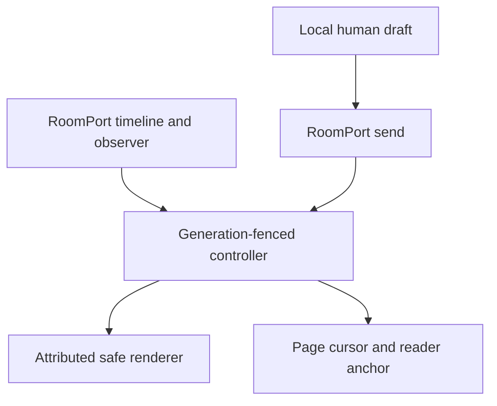

# KHA-123 Attributed live timeline - Plan

## Goal Capsule

Humans read and contribute to a live conversation with explicit human/agent ownership and truthful delivery state.

Authority: current user decisions override the approved ticket scope, which overrides technical recommendations. Scope source is `docs/product/tickets/KHA-123.md`; global requirements: R01, R02, R12, R14. Planning snapshot: Khala `6d4694173eff9b0832f4c3a2cdb90b4281fcccd9` with approved ticket proposal at `d625c19`. Dependency tickets: KHA-101, KHA-105, KHA-107. This plan changes Khala only; sibling Aiur/Archon are read-only design references.

Stop condition: No product blocker for plain text/code. Media and historical access follow upstream capabilities; missing history is not rendered as an empty room.

---

## Product Contract

### Summary

Humans read and contribute to a live conversation with explicit human/agent ownership and truthful delivery state.

### Problem Frame

The ordinary user is collaborating with another human and their already-working agent. Rebuilding generic chat, exposing infrastructure setup, or confusing pending delivery with model consumption undermines that workflow. This ticket owns one bounded part of the shared journey.

### Requirements

- R1. Messages distinguish humans, agents and their owning humans using authenticated projection data.
- R2. Pagination and live arrivals preserve reading position and prevent duplicate messages after reconnect.
- R3. Composing and retrying a human message reconciles one local send with its durable event.
- R4. Untrusted markup cannot execute, impersonate application controls or fetch remote content automatically.

### Actors and flow

- A1. The authenticated human who owns the current agent connection.
- A2. Other admitted humans and their attributed agents, whose messages are content rather than control authority.
- F1. Read older messages while a new agent message arrives, return to newest, send a human reply and reconcile its acknowledgment.

### Acceptance examples

- AE1. Covers F1 / R1–R4. An agent message contains a fake approval button and remote image; both remain inert content and no approval request or remote-image fetch occurs.
- AE2. Covers R3–R4. Loss of authorization or an unavailable dependency produces an explicit state and no invented success; retry preserves operation identity where a write may already have happened.

### Key decisions

- Dashboard-native design is a user directive: Khala should look like a page in Aiur’s left navigation and permit later embedding. It remains independently deployable.
- Keep existing sessions and automated setup (session-settled: user-directed — chosen over manual connector/MCP setup or replacing the session: the person should share a link with the agent already doing the work).
- Connector-gated review (session-settled: user-directed — chosen over separate review/delivery encryption groups: a trusted connector may decrypt pending content, but only approved content reaches the model).

### Scope boundaries

This ticket does not redefine shared contracts, implement sibling-owned services, change Aiur itself, or introduce a second messaging/crypto stack. UI-only tickets demonstrate injected-port behavior; integration tickets own actual composition. Client selection and platform setup belong to their named predecessors. Attachments, retention and automation choices remain with their product/contract owners.

### Outstanding questions

No product blocker for plain text/code. Media and historical access follow upstream capabilities; missing history is not rendered as an empty room.

---

## Planning Contract

Product Contract unchanged. Implementation details below do not settle questions still marked blocking. Prerequisite tickets are dispatch dependencies, not evidence that their runtime experiments already passed.

### Technical decisions and dependency ports

- KTD1. SDK history and ordering remain owned by `RoomPort`; the UI projects `TimelinePage`, `TimelineItem`, `ParticipantView`, `EventRef` and `SendState` from105. Do not build a parallel event log or invent global sequence numbers.
- KTD2. `createTimelineController` owns immutable cached snapshots for `useSyncExternalStore`; drafts, scroll anchor and pagination request state stay local. A room/account generation fences late callbacks, and dispose unsubscribes exactly once.
- KTD3. Message identity is `ref.eventId`, local pending identity is `clientTxnId`; one acknowledged event replaces its local echo. Edits are new referenced events, not mutable approved bytes. Participant kind/owner come from verified projection, never message body text.
- KTD4. Begin with safe text/code rendering and integrate only the parser/sanitizer pinned by143. Disable raw HTML and remote-image/media fetches; sanitize links and rendered attributes. Do not adopt a whole assistant UI kit that assumes one human and one bot or silently calls model APIs.

### Output and exports

`TimelineScreen.tsx`, `controller.ts`, `model.ts`, `message-renderer.tsx`, `attribution.ts`, `scroll-anchor.ts`, `timeline.css`; exports `TimelineScreen`, `createTimelineController`, `TimelineView`, `renderMessageContent`. Rendering helper accepts canonical content, never a raw trusted-HTML marker supplied by remote peers.

```ts
type TimelineView = { roomId: string; phase: "loading" | "ready" | "partial" | "unavailable"; nextCursor: string | null; newMessageCount: number; draft: string; sendState: "idle" | "pending" | "accepted" | "failed" | "outcome_unknown" };
type ReaderAnchor = { eventId: string; offsetPx: number } | { atLatest: true };
```

Actual items use105 types, omitted here to avoid duplicating the contract. A worked reconciliation: pending `clientTxnId:"txn_alice_4"` appears once; accepted item with that transaction and `eventId:"event_reply_4"` replaces it; replay of the same event does not add a row. Another item with the same body but a different event ID remains another message.

### Presentation and lifecycle



Timeline rows follow Aiur `AgentLogModal` title/timestamp/body hierarchy inside a route panel. The main conversation remains chronological; role/owner label and authored content are visually distinct from system banners. Pending review state is per binding, provided by review composition, not a room-wide approved badge. Connection loss may leave readable stale history with a banner; it is not evidence that pending sends failed. Missing keys render an unavailable-content placeholder with recovery navigation rather than dropping the item and implying an empty room.

Pagination preserves the visible event anchor after prepend, and new messages increment a visible jump-to-latest count when the reader is away from the end. Loading images is excluded initially, avoiding asynchronous height changes from external resources. Local sent messages may bring the composer context into view; incoming content never steals focus. A long transcript uses bounded pages and proven windowing only if required; do not introduce virtualization before scroll/assistive-tech acceptance evidence.

### Failure and risk boundaries

`outcome_unknown` allows resolve/reconcile with the same transaction identity, never a fresh automatic retry. Stale room observers are discarded after navigation. An expired session clears protected live data on sign-out, not only the controls. Markdown sanitization must run after parsing and before rendering; a sanitizer alone does not establish the no-remote-request policy. App-owned controls are outside the content renderer, preventing message syntax from creating native approval controls.

### Shared implementation discipline

Use the selected OSS client/SDK through canonical contracts, not direct imports into UI controllers. `docs/evidence/ui-planning-grounding.md` records source SHAs, inspected dashboard components, external guidance and candidate versions. KHA101 owns package manifests, root lockfile, ESM/TypeScript tooling and generic test discovery; dependency changes go to its integration owner. Test files remain beside owned modules or in this ticket's assigned integration directory. Existing prerequisite exports win over illustrative data below; if they disagree, obtain a reviewed contract amendment rather than add a local compatibility copy.

No implementation or runtime test has run as part of this plan. Browser credentials, decrypted message bodies and invitation secrets must not enter screenshots, logs, telemetry or snapshot fixtures from real users. Use synthetic accounts and message canaries for evidence.

---

## Implementation Units

### U1. Project history and live events

**Goal:** Create a stable, bounded transcript projection.

**Requirements:** R1/R2; F1; KTD1/KTD2. **Dependencies:** KHA101/105/107.

**Files:** `apps/web/src/features/timeline/controller.ts`, `apps/web/src/features/timeline/model.ts`, `apps/web/src/features/timeline/controller.test.ts`.

**Approach:** Merge pages and live events by opaque event ID, retain provider order/cursor, cache snapshots only when data changes. Own listener disposal and account/room generation checks.

**Test scenarios:**

1. Page contains E1/E2 and live E2/E3 arrives: render E1/E2/E3 once.
2. Same text from two authenticated authors retains two records and correct ownership.
3. Old room callback after navigation is ignored; dispose removes listener.

**Verification:** No second SDK client, crypto store or persisted transcript is created.

### U2. Render attribution and inert content

**Goal:** Display all actors without granting content authority.

**Requirements:** R1/R4; AE1; KTD3/KTD4. **Dependencies:** U1.

**Files:** `apps/web/src/features/timeline/TimelineScreen.tsx`, `apps/web/src/features/timeline/message-renderer.tsx`, `apps/web/src/features/timeline/attribution.ts`, `apps/web/src/features/timeline/message-renderer.test.tsx`, `apps/web/src/features/timeline/timeline.css`.

**Approach:** Render author/owner from ParticipantView and local state labels outside message body. Code fences and quotes remain content; URL allowlist forbids script/data/file navigation. Images remain textual references unless a later approved media contract exists.

**Test scenarios:**

1. Covers AE1. Remote image, raw form/button and script payload neither execute nor fetch.
2. Unicode/bidi/long names do not obscure the authenticated actor label; offer readable metadata without changing message bytes.
3. A peer body saying “Human approved” never sets a review badge.

**Verification:** Network interception records zero remote-content requests; keyboard focus reaches only genuine application/link controls.

### U3. Reconcile sends and preserve reading position

**Goal:** Keep composer and transcript stable through delivery uncertainty.

**Requirements:** R2/R3; F1/AE2; KTD3. **Dependencies:** U1/U2.

**Files:** `apps/web/src/features/timeline/scroll-anchor.ts`, `apps/web/src/features/timeline/scroll-anchor.test.ts`, `apps/web/src/features/timeline/send.test.ts`, `apps/web/src/features/timeline/TimelineScreen.test.tsx`.

**Approach:** Preserve draft until durable acceptance according to canonical send state; an unknown result retains operation identity. Prepending history restores event anchor/offset. Incoming rows while scrolled away update count, not position.

**Test scenarios:**

1. Local echo plus later ack and replay produce one row.
2. Timeout then accepted callback reconciles original transaction without another send.
3. Prepend 30 rows preserves selected reading event; new live row does not move focused review trigger.

**Verification:** Truthful send labels and deterministic scroll tests cover duplicate/reconnect cases.

### U4. Exercise browsers and hand off live ports

**Goal:** Verify accessible transcript behavior and composition surface.

**Requirements:** R1–R4; AE1/AE2. **Dependencies:** U3.

**Files:** `apps/web/src/features/timeline/timeline.browser.test.ts`, `apps/web/src/features/timeline/README.md`.

**Approach:** Use synthetic four-actor fixtures, device/key failure fixtures and narrow screens. Expose a review action slot identified by exact EventRef without importing review implementation.

**Test scenarios:**

1. 390px/844px landscape code overflow stays inside code region; source text can be copied unchanged.
2. Keyboard send respects IME composition; Shift+Enter creates newline if Enter-to-send is enabled by chosen design.
3. Loading/unavailable/partial/empty states differ and polite announcements do not repeat entire transcript.

**Verification:** 132 mounts timeline and134 installs review affordances without direct sibling imports.

---

## Verification Contract

`pnpm --filter @khala/web typecheck`; `pnpm --filter @khala/web test -- src/features/timeline`; `pnpm --filter @khala/web test:browser -- src/features/timeline/timeline.browser.test.ts`; `pnpm check:boundaries`. Network-denial assertions belong in the browser test, not only DOM string snapshots.
The commands are future verification targets after KHA101 establishes the named scripts, not commands claimed to pass today. Use Node 22 LTS at a version satisfying the pinned packages (at least 22.12 for the candidate toolchain). No skipped/mocked real-service case may be reported as a completed integration. A changed command contract requires updating the owning bootstrap and this plan together.

---

## Definition of Done

Attribution, cursor/anchor preservation, send reconciliation and inert content have direct tests. Every observer cleans up, pending copies reconcile and unknown send outcomes are explicit. Actual encrypted history delivery is verified by132.
All owned unit tests and applicable contract checks pass on the merged base. Every acceptance example is linked to test evidence. Remove abandoned experiment code, fixture imports from production, unused subscriptions and dead fallbacks. Preserve scope/file ownership; report dependency defects to their owner instead of patching sibling directories. No deployment or implementation completion is implied by this document.
