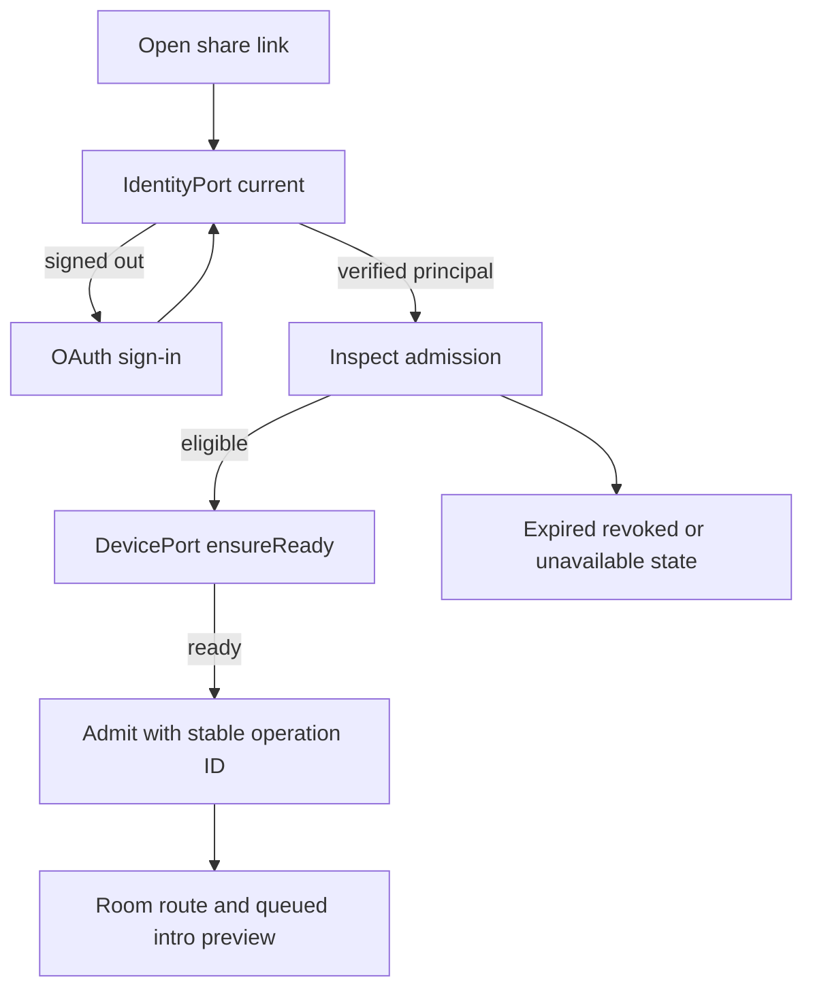

# KHA-124 OAuth and invitation journey - Plan

## Goal Capsule

A coworker opens the shared chat link and joins through ordinary OAuth identity.

Authority: current user decisions override the approved ticket scope, which overrides technical recommendations. Scope source is `docs/product/tickets/KHA-124.md`; global requirements: R12, R14, R15. Planning snapshot: Khala `6d4694173eff9b0832f4c3a2cdb90b4281fcccd9` with approved ticket proposal at `d625c19`. Dependency tickets: KHA-101, KHA-105, KHA-107. This plan changes Khala only; sibling Aiur/Archon are read-only design references.

Stop condition: Admission authority/history are upstream contract decisions. If KHA113 still leaves bearer-versus-addressed admission unresolved, dispatch is blocked rather than defaulting locally.

---

## Product Contract

### Summary

A coworker opens the shared chat link and joins through ordinary OAuth identity.

### Problem Frame

The ordinary user is collaborating with another human and their already-working agent. Rebuilding generic chat, exposing infrastructure setup, or confusing pending delivery with model consumption undermines that workflow. This ticket owns one bounded part of the shared journey.

### Requirements

- R1. The ordinary journey asks for OAuth sign-in and chat admission only, not Matrix credentials, homeserver selection or device-key setup.
- R2. Returning from OAuth resumes the intended room and preserves the verified human identity.
- R3. Expired, revoked, wrong-account and unavailable invitations have distinct recoverable states.
- R4. Joining or viewing queued introductions does not release pending messages to an agent model.

### Actors and flow

- A1. The authenticated human who owns the current agent connection.
- A2. Other admitted humans and their attributed agents, whose messages are content rather than control authority.
- F1. Open invitation while signed out, sign in, complete authorized admission, read queued introductions and copy the same link to an existing agent.

### Acceptance examples

- AE1. Covers F1 / R1–R4. A callback arrives after the invitation was revoked; the screen shows revoked admission and does not expose room contents or offer automatic model delivery.
- AE2. Covers R3–R4. Loss of authorization or an unavailable dependency produces an explicit state and no invented success; retry preserves operation identity where a write may already have happened.

### Key decisions

- Dashboard-native design is a user directive: Khala should look like a page in Aiur’s left navigation and permit later embedding. It remains independently deployable.
- Keep existing sessions and automated setup (session-settled: user-directed — chosen over manual connector/MCP setup or replacing the session: the person should share a link with the agent already doing the work).
- Connector-gated review (session-settled: user-directed — chosen over separate review/delivery encryption groups: a trusted connector may decrypt pending content, but only approved content reaches the model).

### Scope boundaries

This ticket does not redefine shared contracts, implement sibling-owned services, change Aiur itself, or introduce a second messaging/crypto stack. UI-only tickets demonstrate injected-port behavior; integration tickets own actual composition. Client selection and platform setup belong to their named predecessors. Attachments, retention and automation choices remain with their product/contract owners.

### Outstanding questions

Admission authority/history are upstream contract decisions. If KHA113 still leaves bearer-versus-addressed admission unresolved, dispatch is blocked rather than defaulting locally.

---

## Planning Contract

Product Contract unchanged. Implementation details below do not settle questions still marked blocking. Prerequisite tickets are dispatch dependencies, not evidence that their runtime experiments already passed.

### Technical decisions and ports

- KTD1. `JoinScreen` consumes105 `IdentityPort`, `AdmissionPort` and `DevicePort`. The browser receives an already-verified `AuthPrincipal`; email is display/contact data, never an account merge key. OAuth implementation and callback integrity belong to110.
- KTD2. Treat the share URL as a locator, not approval authority. An unauthenticated opening renders only safe invitation/account state; protected title/body/participants require the authorized endpoint result. The agent-readable representation is a separate content-negotiated representation owned by131/114, not this human screen.
- KTD3. Retain only a same-origin validated relative return path through OAuth. Join resumes after auth/device readiness and re-inspects admission before claiming it, so a revoked invitation is not accepted from stale pre-login state.
- KTD4. Avoid exposing the underlying Matrix account, password, homeserver or key-bootstrap screens in the ordinary path. Device initialization can be a short progress state; an actual failure leads to recovery capability or actionable retry, never pretend success.

### Exports and presentation model

Owned exports: `JoinScreen`, `createJoinController`, `JoinPorts`, `JoinView`, `parseJoinLocation`. Files: `JoinScreen.tsx`, `controller.ts`, `model.ts`, `location.ts`, `join.css`. The feature accepts an injected local RouteCodec with `parseJoinLocation(url): {inviteRef:string}|{error:"invalid_location"}`; tests use a synthetic codec and bounded opaque invite reference.132 later injects the concrete131 route mapping. This ticket neither imports nor waits for132/131 implementation and never invents production URL vocabulary.

```ts
type JoinPhase = "checking_identity" | "sign_in" | "checking_invitation" | "initializing_device" | "joining" | "joined" | "expired" | "revoked" | "wrong_account" | "unavailable";
type JoinView = { phase: JoinPhase; email: string | null; roomId: string | null; retryAllowed: boolean; errorCode: string | null };
```

The human-facing state can be richer than105's raw admission discriminant, but every mapping must cite a canonical result/code; `wrong_account` is never inferred merely because two display emails differ. If the upstream protocol lacks such evidence, show the known rejection and amend its contract rather than infer identity failure.

### Journey and authority



OAuth cancellation preserves a safe return action and does not enter a sign-in redirect loop. Opening a link while already joined goes to the existing room without claiming again. Link replay after membership revocation does not silently restore access. Identity changes dispose the previous device/session generation before any new room render. Browser back/refresh preserves the intended locator without persisting OAuth codes or invitation secrets to logs.

### Dashboard-native design and risks

Use a modest route panel under Aiur chrome; show signed-in email and invitation outcome beside the actual join action. After admission, the person can read and share the same chat link with their existing agent. There is no model selector or connector wizard. Device recovery is offered only for real failure; `initializing` is not an excuse for a default key-management ceremony. Cross-origin callback or open-redirect handling is110/131's responsibility, tested at132 as an integration seam.

### Shared implementation discipline

Use the selected OSS client/SDK through canonical contracts, not direct imports into UI controllers. `docs/evidence/ui-planning-grounding.md` records source SHAs, inspected dashboard components, external guidance and candidate versions. KHA101 owns package manifests, root lockfile, ESM/TypeScript tooling and generic test discovery; dependency changes go to its integration owner. Test files remain beside owned modules or in this ticket's assigned integration directory. Existing prerequisite exports win over illustrative data below; if they disagree, obtain a reviewed contract amendment rather than add a local compatibility copy.

No implementation or runtime test has run as part of this plan. Browser credentials, decrypted message bodies and invitation secrets must not enter screenshots, logs, telemetry or snapshot fixtures from real users. Use synthetic accounts and message canaries for evidence.

---

## Implementation Units

### U1. Decode safe navigation and identity state

**Goal:** Resume the intended join through OAuth without trusting URL authority.

**Requirements:** R1/R2; F1; KTD1/KTD2/KTD3. **Dependencies:** KHA101/105/107.

**Files:** `apps/web/src/features/join/location.ts`, `apps/web/src/features/join/model.ts`, `apps/web/src/features/join/ports.ts`, `apps/web/src/features/join/location.test.ts`.

**Approach:** Consume the injected RouteCodec and validate return paths; keep opaque references unchanged. Current identity unavailable differs from signed-out.

**Test scenarios:**

1. External or scheme-relative return path is rejected; malformed/overlong locator yields safe error.
2. Already signed-in principal skips sign-in without exposing a token.
3. Auth unavailable shows retry and does not force logout or a loop.

**Verification:** No URL field grants owner approval or is echoed into unsafe HTML.

### U2. Coordinate admission and device readiness

**Goal:** Join only with fresh authorized admission and ready device.

**Requirements:** R2/R3/R4; AE1/AE2; KTD3/KTD4. **Dependencies:** U1.

**Files:** `apps/web/src/features/join/controller.ts`, `apps/web/src/features/join/controller.test.ts`.

**Approach:** Reinspect after OAuth, preserve operationId across uncertain admit, and fence responses by principal/device generation. AlreadyJoined resolves to existing room.

**Test scenarios:**

1. Covers AE1. Revocation during OAuth denies admission without showing room content.
2. Device init fails then succeeds on explicit retry; join runs once.
3. Account switch during join discards old response and clears protected view.
4. Unknown admit result resolves same operation instead of issuing a second claim.

**Verification:** All async branches terminate in known safe states; no stale identity can mount content.

### U3. Render invitation and error panels

**Goal:** Provide a no-setup human journey in Aiur visual language.

**Requirements:** R1–R4; F1. **Dependencies:** U2.

**Files:** `apps/web/src/features/join/JoinScreen.tsx`, `apps/web/src/features/join/join.css`, `apps/web/src/features/join/JoinScreen.test.tsx`.

**Approach:** Use dashboard section-card/locked/loading/error idioms through107 primitives. Error copy states expired/revoked/wrong account only from authoritative codes. Button label/action changes with state; sign-in cancellation returns to an intentional retry.

**Test scenarios:**

1. No homeserver/password/MCP/device-key setup control on normal path.
2. Screen reader announces join/error once and focus reaches the recovery action.
3. Protected title/body absent from signed-out/rejected DOM.

**Verification:** Rendered states cover canonical fixture variants without invented identity claims.

### U4. Document integration and safe browser navigation

**Goal:** Make132 wiring and phone link opening deterministic.

**Requirements:** R1–R4; AE1/AE2. **Dependencies:** U3.

**Files:** `apps/web/src/features/join/join.browser.test.ts`, `apps/web/src/features/join/README.md`.

**Approach:** Test browser navigation with injected redirect intents and synthetic fixture callbacks; document what real OAuth tests remain132. Preserve share-link route across reload/back.

**Test scenarios:**

1. 390px and landscape render long verified email without overflow.
2. Browser back from sign-in does not auto-redirect forever.
3. Invite fragment/query secrets are not included in test analytics or logs.

**Verification:** Live composition can replace ports without changing the journey.

---

## Verification Contract

`pnpm --filter @khala/web typecheck`; `pnpm --filter @khala/web test -- src/features/join`; `pnpm --filter @khala/web test:browser -- src/features/join/join.browser.test.ts`; `pnpm check:boundaries`. Real OAuth/admission/key exchange proof belongs132.
The commands are future verification targets after KHA101 establishes the named scripts, not commands claimed to pass today. Use Node 22 LTS at a version satisfying the pinned packages (at least 22.12 for the candidate toolchain). No skipped/mocked real-service case may be reported as a completed integration. A changed command contract requires updating the owning bootstrap and this plan together.

---

### Settled production origin — user amendment

P11 sets the production app origin to `https://khala.aiur.team`. Canonical production share links use that origin; OAuth callback is `https://khala.aiur.team/api/human/auth/callback`. KHA131 owns origin validation/configuration,110 consumes the exact callback and132 composes it. Preview allowlists/credentials stay explicit and separate. This does not assign a Matrix server_name or claim DNS/hosting is already configured. Earlier synthetic `.example` links remain test fixtures, never deployment defaults. This later user decision supplements the preserved Product Contract.

## Definition of Done

Every join state maps to a canonical result; normal path has OAuth and chat admission only. URL/identity races, cancellation and revocation have tests. No model connection or release occurs merely by mounting this screen.
All owned unit tests and applicable contract checks pass on the merged base. Every acceptance example is linked to test evidence. Remove abandoned experiment code, fixture imports from production, unused subscriptions and dead fallbacks. Preserve scope/file ownership; report dependency defects to their owner instead of patching sibling directories. No deployment or implementation completion is implied by this document.
