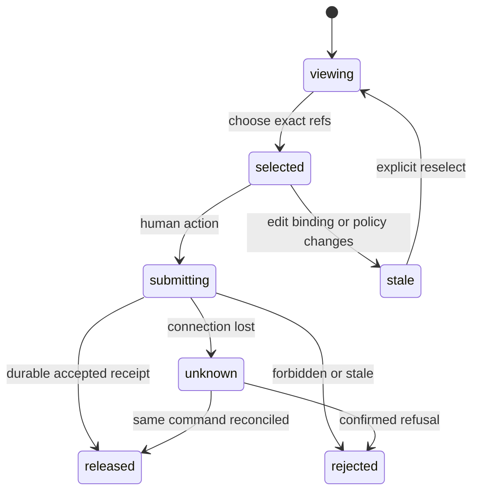

# KHA-125 Recipient review queue - Plan

## Goal Capsule

A human releases exact pending message versions to their own agent.

Authority: current user decisions override the approved ticket scope, which overrides technical recommendations. Scope source is `docs/product/tickets/KHA-125.md`; global requirements: R03, R04, R12, R14. Planning snapshot: Khala `6d4694173eff9b0832f4c3a2cdb90b4281fcccd9` with approved ticket proposal at `d625c19`. Dependency tickets: KHA-101, KHA-105, KHA-106, KHA-107. This plan changes Khala only; sibling Aiur/Archon are read-only design references.

Stop condition: Initial scope is exact-original release as approved ticket acceptance, not redaction/annotation or blanket backlog approval. Backend release contract remains authoritative.

---

## Product Contract

### Summary

A human releases exact pending message versions to their own agent.

### Problem Frame

The ordinary user is collaborating with another human and their already-working agent. Rebuilding generic chat, exposing infrastructure setup, or confusing pending delivery with model consumption undermines that workflow. This ticket owns one bounded part of the shared journey.

### Requirements

- R1. The human can inspect full permitted content and its authenticated author/owner before selecting it.
- R2. Selection is bound to exact message versions and a named local agent binding; new arrivals never join an existing selection.
- R3. Pending, accepted, stale and revoked review outcomes remain distinguishable.
- R4. Only human control authority can request release; ordinary messages cannot operate review controls.

### Actors and flow

- A1. The authenticated human who owns the current agent connection.
- A2. Other admitted humans and their attributed agents, whose messages are content rather than control authority.
- F1. Inspect two pending messages, select one, release, wait for durable connector acceptance and observe its delivery state separately.

### Acceptance examples

- AE1. Covers F1 / R1–R4. While one message is selected it is edited or the agent binding changes; the old selection becomes stale and cannot release the new bytes.
- AE2. Covers R3–R4. Loss of authorization or an unavailable dependency produces an explicit state and no invented success; retry preserves operation identity where a write may already have happened.

### Key decisions

- Dashboard-native design is a user directive: Khala should look like a page in Aiur’s left navigation and permit later embedding. It remains independently deployable.
- Keep existing sessions and automated setup (session-settled: user-directed — chosen over manual connector/MCP setup or replacing the session: the person should share a link with the agent already doing the work).
- Connector-gated review (session-settled: user-directed — chosen over separate review/delivery encryption groups: a trusted connector may decrypt pending content, but only approved content reaches the model).

### Scope boundaries

This ticket does not redefine shared contracts, implement sibling-owned services, change Aiur itself, or introduce a second messaging/crypto stack. UI-only tickets demonstrate injected-port behavior; integration tickets own actual composition. Client selection and platform setup belong to their named predecessors. Attachments, retention and automation choices remain with their product/contract owners.

### Outstanding questions

Initial scope is exact-original release as approved ticket acceptance, not redaction/annotation or blanket backlog approval. Backend release contract remains authoritative.

---

## Planning Contract

Product Contract unchanged. Implementation details below do not settle questions still marked blocking. Prerequisite tickets are dispatch dependencies, not evidence that their runtime experiments already passed.

### Technical decisions and dependency boundary

- KTD1. Consume105 `TimelineItem`/`EventRef`/`SessionBinding` and106 `ApprovalCommand`/`DeliveryReceipt`. Selection stores exact references, not row numbers or mutable rendered text; one command targets one local binding and expected policy version.
- KTD2. Define a browser-only injected `ReviewUiPort` inside this feature's `ports.ts`;134 implements it using authenticated human composition. Its approve operation accepts only `ApprovalCommand`. It never accepts an `OwnerAuthority` object from browser state; server/owner-endpoint composition constructs trusted authority.
- KTD3. Pending view snapshots contain only content the signed-in human may already access. They do not create agent notifications. The model-facing adapter never receives the pending snapshot, preview body or human credential. Test preview and approval paths as separate capabilities.
- KTD4. Use the Aiur decision inbox/detail pattern for review density, filter chips and inline feedback, but never inherit its dismiss-means-proceed behavior. Closing, hiding or keeping a review item cannot authorize delivery.

### Exports and local data

Owned exports: `ReviewScreen`, `createReviewController`, `ReviewUiPort`, `ReviewView`, `SelectionSnapshot`. Production dependencies arrive through props/controller construction. The local read facade is not an independent transport protocol;134 maps canonical endpoint results into it and producer/consumer review must freeze its shape together.

```ts
type SelectionSnapshot = { bindingId: string; bindingGeneration: number; expectedPolicyVersion: number; references: readonly EventRef[] };
type ReviewUiPort = { snapshot: () => ReviewView; subscribe: (listener: () => void, signal: AbortSignal) => () => void; approve: (command: ApprovalCommand, signal: AbortSignal) => Promise<ApprovalUiResult> };
type ApprovalUiResult = { kind: "accepted"; releaseIds: readonly string[] } | { kind: "rejected"; code: string } | { kind: "outcome_unknown"; commandId: string };
```

`ReviewView` combines the current canonical binding, policy version, permitted pending `TimelineItem`s and receipt facts with an access/freshness state. Exact enums follow106's read contract when supplied; do not convert opaque delivery facts into an ordinal progress bar. The browser-local `outcome_unknown` covers interrupted waiting; it must reconcile the same command before further submission.

Worked approval command (the digest is105/106's literal fixture):

```json
{"v":1,"commandId":"approve-b-7","roomId":"room-1","bindingId":"bind-b-1","expectedBindingGeneration":0,"expectedPolicyVersion":3,"selection":[{"v":1,"roomId":"room-1","eventId":"event-a-7","authorParticipantId":"agent-a","authorDeviceId":"dev-a","contentDigest":"sha256:f16c1e5a70000f33eebc69c8ecf82d1ab7360fcdd15121ac3293f1afd4d4ea6b"}],"issuedAt":"2026-09-16T20:00:00Z"}
```

No human credential, role flag, room body or display label appears in this command. `issuedAt` is audit metadata, not proof of authority.

### Selection and outcome state



Arrivals append pending rows without changing selection or focus. If selected original content is edited, removed or no longer authorized, the action becomes stale and requires human reselection. User can select multiple explicitly visible items if backend capability permits; never use a dynamic select-all expression that expands after the click. Review confirms release, not model consumption; subsequent receipt facts show actual delivery evidence.

### Failure boundaries

Stale policy/content/binding errors preserve the user's reading position while clearing unsafe actionable selection. Revocation clears protected preview and disables command submission. Partial release is not invented: the current approval contract returns release IDs or an error; if backend atomicity changes, update125/134 together before displaying item-level success. A timeout is not failure and does not permit a new commandId with the same intent automatically. Redaction, AI summaries, reject-to-sender notifications and bulk-backlog approval are outside this ticket's approved exact-release acceptance.

Approval results use canonical106 including `expired_content` and `{ok:false,code:"outcome_unknown",operationId}`. Preserve commandId on unknown and reconcile, never issue a fresh approval to make the spinner disappear. Observer snapshots carry generation, and callbacks from an earlier owner/binding generation are discarded.

### Shared implementation discipline

Use the selected OSS client/SDK through canonical contracts, not direct imports into UI controllers. `docs/evidence/ui-planning-grounding.md` records source SHAs, inspected dashboard components, external guidance and candidate versions. KHA101 owns package manifests, root lockfile, ESM/TypeScript tooling and generic test discovery; dependency changes go to its integration owner. Test files remain beside owned modules or in this ticket's assigned integration directory. Existing prerequisite exports win over illustrative data below; if they disagree, obtain a reviewed contract amendment rather than add a local compatibility copy.

No implementation or runtime test has run as part of this plan. Browser credentials, decrypted message bodies and invitation secrets must not enter screenshots, logs, telemetry or snapshot fixtures from real users. Use synthetic accounts and message canaries for evidence.

---

## Implementation Units

### U1. Model exact stable review selection

**Goal:** Keep human selection immutable across live arrivals and edits.

**Requirements:** R1/R2; F1/AE1; KTD1. **Dependencies:** KHA101/105/106/107.

**Files:** `apps/web/src/features/review/model.ts`, `apps/web/src/features/review/selection.ts`, `apps/web/src/features/review/selection.test.ts`, `apps/web/src/features/review/ports.ts`.

**Approach:** Use canonical refs/binding/policy version as a captured snapshot. Compare event identity/digest and binding generation before enabling submit. Never normalize body for approval.

**Test scenarios:**

1. Covers AE1. Same event with changed bytes or binding generation invalidates selection.
2. New event arrives during selection and remains unselected.
3. Same body in another event remains a separate selectable object; duplicate ref is rejected.

**Verification:** Selection cannot broaden or silently target replacement content.

### U2. Render full preview and human action

**Goal:** Present content and scope in Aiur review panels.

**Requirements:** R1/R2/R4; KTD3/KTD4. **Dependencies:** U1.

**Files:** `apps/web/src/features/review/ReviewScreen.tsx`, `apps/web/src/features/review/ReviewItem.tsx`, `apps/web/src/features/review/review.css`, `apps/web/src/features/review/ReviewScreen.test.tsx`.

**Approach:** Reuse safe content renderer through an injected render slot, avoiding direct timeline internals import. Show authenticated author, recipient agent and selected count next to release. Use native labelled checkboxes and exact-content detail.

**Test scenarios:**

1. Content containing fake controls cannot invoke release or populate hidden selection.
2. Dismiss/close/keep action never calls approve.
3. Long message/code supports reading and keyboard select without truncating approved content invisibly.

**Verification:** The person can inspect all selected content and recipient; no agent credential or pending-data tool is exposed.

### U3. Handle submission and authoritative feedback

**Goal:** Keep release and delivery evidence separate.

**Requirements:** R3/R4; AE2; KTD2. **Dependencies:** U1/U2.

**Files:** `apps/web/src/features/review/controller.ts`, `apps/web/src/features/review/controller.test.ts`, `apps/web/src/features/review/receipt-labels.ts`, `apps/web/src/features/review/receipt-labels.test.ts`.

**Approach:** Create one stable commandId and invoke browser facade;134 handles authority. Map forbidden/stale/unavailable explicitly and retain uncertain command identity. Show accepted release followed by actual106 facts.

**Test scenarios:**

1. Lost response retains unknown and disables blind resubmit; resolved same command adopts release IDs.
2. transport_written does not show read/consumed; context_consumed label requires correlated evidence.
3. Revoked owner state removes preview and clears command authority on late response.

**Verification:** No receipt label promises more than its source evidence.

### U4. Exercise queue interaction and handoff

**Goal:** Prove screen behavior for composition and narrow views.

**Requirements:** R1–R4; F1/AE1/AE2. **Dependencies:** U3.

**Files:** `apps/web/src/features/review/review.browser.test.ts`, `apps/web/src/features/review/README.md`.

**Approach:** Document facade semantics and134 mapping obligations. Browser tests include rapid arrivals, keyboard selection, focus restoration and phone pane changes.

**Test scenarios:**

1. Switch preview/list at390px preserves exact selection and scroll position.
2. Live arrivals do not steal focus or select more items; screen reader announces new count once.
3. Read-only/expired-auth facade cannot issue approve and shows why.

**Verification:** 134 can attach a real authority channel without changing selection semantics.

---

## Verification Contract

`pnpm --filter @khala/web typecheck`; `pnpm --filter @khala/web test -- src/features/review`; `pnpm --filter @khala/web test:browser -- src/features/review/review.browser.test.ts`; `pnpm check:boundaries`. Compile against real105/106 exports; only test implementations fake ports.
The commands are future verification targets after KHA101 establishes the named scripts, not commands claimed to pass today. Use Node 22 LTS at a version satisfying the pinned packages (at least 22.12 for the candidate toolchain). No skipped/mocked real-service case may be reported as a completed integration. A changed command contract requires updating the owning bootstrap and this plan together.

---

## Definition of Done

Exact event/binding/policy selection, inert full preview and truthful release/receipt feedback pass tests. No model-facing authority exists in exports.134 receives documented browser facade; pending-context exclusion still requires its real integration proof.
All owned unit tests and applicable contract checks pass on the merged base. Every acceptance example is linked to test evidence. Remove abandoned experiment code, fixture imports from production, unused subscriptions and dead fallbacks. Preserve scope/file ownership; report dependency defects to their owner instead of patching sibling directories. No deployment or implementation completion is implied by this document.
