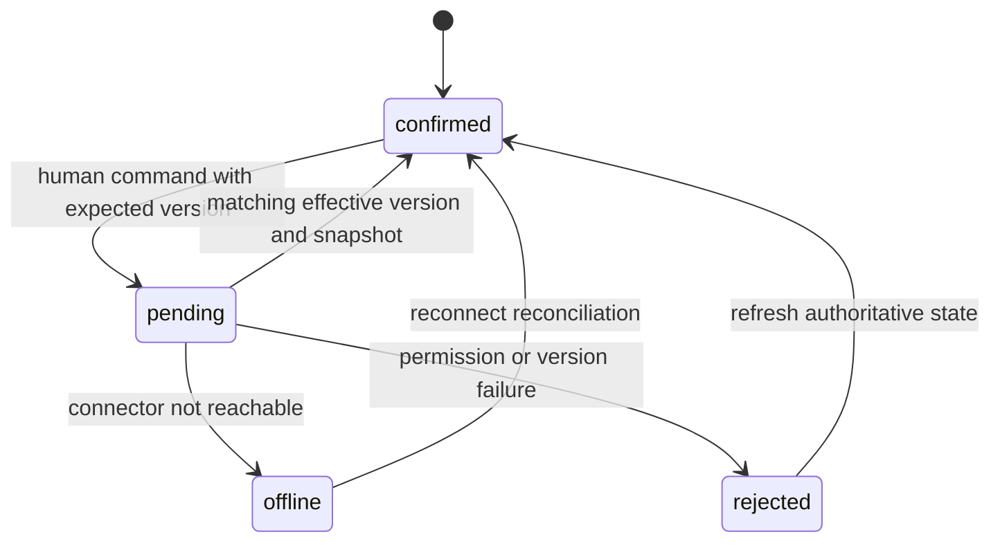

# KHA-126 Trust and agent status controls - Plan

## Goal Capsule

A human sees what the connected agent can receive and changes approved delivery policy without confusing requested and effective state.

Authority: current user decisions override the approved ticket scope, which overrides technical recommendations. Scope source is `docs/product/tickets/KHA-126.md`; global requirements: R05, R12, R14. Planning snapshot: Khala `6d4694173eff9b0832f4c3a2cdb90b4281fcccd9` with approved ticket proposal at `d625c19`. Dependency tickets: KHA-101, KHA-105, KHA-106, KHA-107. This plan changes Khala only; sibling Aiur/Archon are read-only design references.

Stop condition: P02/P08 and G-AUTOMATION: unattended lifecycle, trust scope, pause ownership and turn budgets need explicit product policy. Capability-only rendering can be specified; full behavior is not launch-ready.

---

## Product Contract

### Summary

A human sees what the connected agent can receive and changes approved delivery policy without confusing requested and effective state.

### Problem Frame

The ordinary user is collaborating with another human and their already-working agent. Rebuilding generic chat, exposing infrastructure setup, or confusing pending delivery with model consumption undermines that workflow. This ticket owns one bounded part of the shared journey.

### Requirements

- R1. Status distinguishes subscription, pending queue, transport delivery, model consumption and unknown outcomes.
- R2. Policy changes display requested and connector-confirmed effective versions separately.
- R3. Review re-arm, pause and permission failures remain visible without deriving state from message content.
- R4. Available controls follow the approved automation capabilities; absent controls are not simulated.

### Actors and flow

- A1. The authenticated human who owns the current agent connection.
- A2. Other admitted humans and their attributed agents, whose messages are content rather than control authority.
- F1. Request automatic delivery, observe its pending status while disconnected, then show effective policy only after connector acknowledgment.

### Acceptance examples

- AE1. Covers F1 / R1–R4. The connector is offline after pause is requested; the UI states pause pending and does not claim the model stopped.
- AE2. Covers R3–R4. Loss of authorization or an unavailable dependency produces an explicit state and no invented success; retry preserves operation identity where a write may already have happened.

### Key decisions

- Dashboard-native design is a user directive: Khala should look like a page in Aiur’s left navigation and permit later embedding. It remains independently deployable.
- Keep existing sessions and automated setup (session-settled: user-directed — chosen over manual connector/MCP setup or replacing the session: the person should share a link with the agent already doing the work).
- Connector-gated review (session-settled: user-directed — chosen over separate review/delivery encryption groups: a trusted connector may decrypt pending content, but only approved content reaches the model).

### Scope boundaries

This ticket does not redefine shared contracts, implement sibling-owned services, change Aiur itself, or introduce a second messaging/crypto stack. UI-only tickets demonstrate injected-port behavior; integration tickets own actual composition. Client selection and platform setup belong to their named predecessors. Attachments, retention and automation choices remain with their product/contract owners.

### Outstanding questions

P02/P08 and G-AUTOMATION: unattended lifecycle, trust scope, pause ownership and turn budgets need explicit product policy. Capability-only rendering can be specified; full behavior is not launch-ready.

---

## Planning Contract

Product Contract unchanged. Implementation details below do not settle questions still marked blocking. Prerequisite tickets are dispatch dependencies, not evidence that their runtime experiments already passed.

### Technical decisions and canonical data

- KTD1. Consume106 `SessionBinding`, `HarnessCapabilities`, `PolicySetCommand`, `PolicyAck` and `DeliveryReceipt`. Display effective mode only from acknowledged connector policy; submitted/requested mode is a separate local state.
- KTD2. `AgentControlsUiPort` is a browser facade: read a capability/status snapshot, subscribe with disposer, submit a policy command under the current human session.135 constructs owner authority outside the browser. The facade cannot export a general agent tool.
- KTD3. Render only actions supported by the approved policy and adapter capability. A pause request is not cancellation of an in-flight model turn. Do not implement cancel merely because106 includes a cancel_requested receipt kind.
- KTD4. Use Aiur status-chip and inline-feedback presentation. Avoid borrowing the dashboard global fleet-pause label or scope. The target owner, room and agent binding are visible next to a policy control.

### Output and presentation boundary

Owned exports: `AgentControlsPanel`, `createAgentControlsController`, `AgentControlsUiPort`, `AgentControlsView`, `receiptLabel`. Files: `AgentControlsPanel.tsx`, `controller.ts`, `model.ts`, `ports.ts`, `receipt-labels.ts`, `agent-controls.css`.

```ts
type PolicyDisplay = { effectiveMode: "review" | "auto" | null; effectiveVersion: number | null; paused: boolean | null; requestedMode: "review" | "auto" | null; requestedVersion: number | null; acknowledgment: "pending" | "effective" | "offline" | "rejected" };
type AgentControlsView = { bindingId: string; policy: PolicyDisplay; connection: "connected" | "offline" | "unknown"; controlsAvailable: boolean; unavailableReason: string | null };
```

This is a local display projection, not a replacement for106. The canonical policy read snapshot must additionally supply authoritative paused state; `PolicyAck` alone contains versions/state, not mode, so the UI must not assume that an ack echoes the browser's most recent toggle if concurrent commands exist.

Worked command:106 `PolicySetCommand` with `commandId:"policy-b-4"`, room `room-1`, binding `bind-b-1`, peer `agent-a`, expectedBindingGeneration0, expectedPolicyVersion3, mode review, paused true. Acknowledgment `{commandId:"policy-b-4",bindingId:"bind-b-1",generation:0,requestedVersion:4,effectiveVersion:3,connectorState:"offline",errorCode:null}` renders **Review and pause requested; agent connection offline**, retaining version3's effective policy. Only a subsequent confirmed snapshot/ack for version4 updates effective display.

### State and race behavior



Snapshot freshness is separate from connection state. A room may sync while its connector is offline. Receipts are facts: queued, transport_written, harness_queued, context_consumed and completed have separate labels; no ordinal max() can reconcile them. outcome_unknown remains visible despite a later unrelated connected status. A new binding generation clears old actionable state and cannot inherit permissive policy silently.

### Blocking product choices

P02/P08/G-AUTOMATION remain unanswered: background operation, trust scope, pause authority, bounds and pending-backlog treatment. This document specifies an implementation candidate and honest capability rendering, but stays requirements-only until policy owners settle those choices. Do not turn proposed room-local trust or specific budget defaults into requirements. Neutral controller/fixture work may proceed only if the parent explicitly splits it from the gated behavior.

Canonical106 `PolicyAck` echoes commandId, bindingId and generation; requested/effective versions may be null when no authoritative revision was observed. Never coerce null to zero or treat mismatched acknowledgment as effective. Effective requires connector acknowledgment and null errorCode. Unknown command persistence is reconciled with the same identity. Candidate semantics pending G-AUTOMATION: policy change affects future events only; selected existing backlog uses a separate exact ApprovalCommand, never implicit release or a promise of atomic combined changes.

When effectiveVersion is null, effectiveMode and paused are unknown/null and policy mutation controls are disabled until an authoritative snapshot arrives.

### Shared implementation discipline

Use the selected OSS client/SDK through canonical contracts, not direct imports into UI controllers. `docs/evidence/ui-planning-grounding.md` records source SHAs, inspected dashboard components, external guidance and candidate versions. KHA101 owns package manifests, root lockfile, ESM/TypeScript tooling and generic test discovery; dependency changes go to its integration owner. Test files remain beside owned modules or in this ticket's assigned integration directory. Existing prerequisite exports win over illustrative data below; if they disagree, obtain a reviewed contract amendment rather than add a local compatibility copy.

No implementation or runtime test has run as part of this plan. Browser credentials, decrypted message bodies and invitation secrets must not enter screenshots, logs, telemetry or snapshot fixtures from real users. Use synthetic accounts and message canaries for evidence.

---

## Implementation Units

### U1. Project status and receipt facts

**Goal:** Make status vocabulary match106 evidence.

**Requirements:** R1/R2; AE1; KTD1. **Dependencies:** Merged105/106/107 and approved automation contract.

**Files:** `apps/web/src/features/agent-controls/model.ts`, `apps/web/src/features/agent-controls/ports.ts`, `apps/web/src/features/agent-controls/receipt-labels.ts`, `apps/web/src/features/agent-controls/receipt-labels.test.ts`.

**Approach:** Map receipt kinds by explicit case and source/evidence constraints. Read effective policy from authoritative snapshot, keeping unknown/stale distinct from offline.

**Test scenarios:**

1. transport_written and harness_queued never imply context_consumed.
2. outcome_unknown stays visible after connector reconnect until correlated reconciliation.
3. Malformed or unsupported receipt shows unavailable detail without leaking error payload.

**Verification:** Status text is a tested mapping of facts, not UI optimism.

### U2. Implement versioned policy intent

**Goal:** Submit scoped human requests without racing effective state.

**Requirements:** R2–R4; F1/AE2; KTD2/KTD3. **Dependencies:** U1.

**Files:** `apps/web/src/features/agent-controls/controller.ts`, `apps/web/src/features/agent-controls/controller.test.ts`.

**Approach:** Keep requested command identity and expected version; refresh on conflict. Accept matching versioned results and reject old binding generation. Interrupted wait preserves unknown result.

**Test scenarios:**

1. Covers AE1. Offline ack leaves old effective mode visible.
2. Two browser tabs race; rejected stale command cannot overwrite winning effective snapshot.
3. Binding replacement clears pending controls and discards old acknowledgments.

**Verification:** No last-response-wins policy regression or blind retry.

### U3. Render scoped controls in dashboard panel

**Goal:** Explain who receives what and which actions are available.

**Requirements:** R1–R4; KTD4. **Dependencies:** U2.

**Files:** `apps/web/src/features/agent-controls/AgentControlsPanel.tsx`, `apps/web/src/features/agent-controls/agent-controls.css`, `apps/web/src/features/agent-controls/AgentControlsPanel.test.tsx`.

**Approach:** Use labelled scope text, native controls, requested/effective badges and inline notices. Disabled controls cite unavailable reason. Do not use a generic “safe peer” badge.

**Test scenarios:**

1. Fake incoming message text cannot toggle a control.
2. Pause pending label does not say stopped/cancelled.
3. Unsupported cancellation/budget setting is absent, not a dead action.

**Verification:** A human can tell target/scope/current effect without opening developer details.

### U4. Verify multi-state interaction and handoff

**Goal:** Give135 a stable browser facade and fixtures.

**Requirements:** R1–R4; F1/AE1/AE2. **Dependencies:** U3.

**Files:** `apps/web/src/features/agent-controls/agent-controls.browser.test.ts`, `apps/web/src/features/agent-controls/README.md`.

**Approach:** Use synthetic online/busy/offline/unknown snapshots and documented policy decisions. Compose under both standalone and host-content shell.

**Test scenarios:**

1. Keyboard request then incoming update retains focus and announces outcome once.
2. Phone viewport shows target owner and effective state adjacent to controls.
3. Closing/reopening panel does not submit or reset policy.

**Verification:** No missing product decision is hidden by a fixture default.

---

## Verification Contract

After product gates close: `pnpm --filter @khala/web typecheck`; `pnpm --filter @khala/web test -- src/features/agent-controls`; `pnpm --filter @khala/web test:browser -- src/features/agent-controls/agent-controls.browser.test.ts`; `pnpm check:boundaries`.
The commands are future verification targets after KHA101 establishes the named scripts, not commands claimed to pass today. Use Node 22 LTS at a version satisfying the pinned packages (at least 22.12 for the candidate toolchain). No skipped/mocked real-service case may be reported as a completed integration. A changed command contract requires updating the owning bootstrap and this plan together.

---

## Definition of Done

Approved policy is referenced by version; full status/control states are tested and135 receives documented facade. Readiness cannot be raised while P02/P08 remain materially unresolved.
All owned unit tests and applicable contract checks pass on the merged base. Every acceptance example is linked to test evidence. Remove abandoned experiment code, fixture imports from production, unused subscriptions and dead fallbacks. Preserve scope/file ownership; report dependency defects to their owner instead of patching sibling directories. No deployment or implementation completion is implied by this document.
