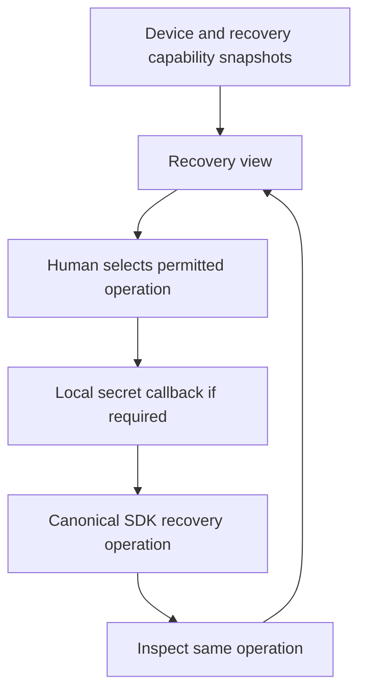

# KHA-127 Recovery and closure interface - Plan

## Goal Capsule

A human understands missing keys, replacement, revocation and closure without impossible deletion promises.

Authority: current user decisions override the approved ticket scope, which overrides technical recommendations. Scope source is `docs/product/tickets/KHA-127.md`; global requirements: R12, R14. Planning snapshot: Khala `6d4694173eff9b0832f4c3a2cdb90b4281fcccd9` with approved ticket proposal at `d625c19`. Dependency tickets: KHA-101, KHA-105, KHA-107. This plan changes Khala only; sibling Aiur/Archon are read-only design references.

Stop condition: P07/G-RETENTION: retention, history recovery and closure semantics remain product blockers. No default recovery escrow or deletion promise is approved.

---

## Product Contract

### Summary

A human understands missing keys, replacement, revocation and closure without impossible deletion promises.

### Problem Frame

The ordinary user is collaborating with another human and their already-working agent. Rebuilding generic chat, exposing infrastructure setup, or confusing pending delivery with model consumption undermines that workflow. This ticket owns one bounded part of the shared journey.

### Requirements

- R1. Device/authentication failure and missing historical keys are different states.
- R2. Recovery actions present only capabilities permitted by the selected recovery policy.
- R3. Revocation/closure consequences disclose what happens locally and what cannot erase participant-held copies.
- R4. Unknown external model outcomes survive the recovery journey without automatic replay.

### Actors and flow

- A1. The authenticated human who owns the current agent connection.
- A2. Other admitted humans and their attributed agents, whose messages are content rather than control authority.
- F1. Open a room on a replacement device, inspect available history/recovery state and perform an authorized recovery action if offered.

### Acceptance examples

- AE1. Covers F1 / R1–R4. Login succeeds but history keys remain unavailable; the interface states that history is unavailable rather than implying the room has no messages.
- AE2. Covers R3–R4. Loss of authorization or an unavailable dependency produces an explicit state and no invented success; retry preserves operation identity where a write may already have happened.

### Key decisions

- Dashboard-native design is a user directive: Khala should look like a page in Aiur’s left navigation and permit later embedding. It remains independently deployable.
- Keep existing sessions and automated setup (session-settled: user-directed — chosen over manual connector/MCP setup or replacing the session: the person should share a link with the agent already doing the work).
- Connector-gated review (session-settled: user-directed — chosen over separate review/delivery encryption groups: a trusted connector may decrypt pending content, but only approved content reaches the model).

### Scope boundaries

This ticket does not redefine shared contracts, implement sibling-owned services, change Aiur itself, or introduce a second messaging/crypto stack. UI-only tickets demonstrate injected-port behavior; integration tickets own actual composition. Client selection and platform setup belong to their named predecessors. Attachments, retention and automation choices remain with their product/contract owners.

### Outstanding questions

P07/G-RETENTION: retention, history recovery and closure semantics remain product blockers. No default recovery escrow or deletion promise is approved.

---

## Planning Contract

Product Contract unchanged. Implementation details below do not settle questions still marked blocking. Prerequisite tickets are dispatch dependencies, not evidence that their runtime experiments already passed.

### Technical decisions and ports

- KTD1. Consume105 `DeviceView`, `RecoveryPort`, `RevocationPort` and their typed operation outcomes. Authentication success, device readiness and historical content recovery are independent facts.
- KTD2. Recovery secrets use the canonical local-only callback, never a serializable request body, analytics field or generic app store. The UI can host a protected input only when the approved recovery capability actually requires it; normal joining stays automatic.
- KTD3. Operations are resumable by their stable operation ID. Unknown recovery/revocation/cleanup outcomes are not successful completion or permission to retry external model work.
- KTD4. Presentation follows Aiur locked/loading/partial/unavailable panels. Consequence summaries use actual policy scope and counts, never “delete everywhere.” Closure and retention behavior are not implemented by this view.

### Output and local display model

Exports `RecoveryPanel`, `createRecoveryController`, `RecoveryUiPort`, `RecoveryView`. Files: `RecoveryPanel.tsx`, `controller.ts`, `model.ts`, `ports.ts`, `recovery.css`. `RecoveryUiPort` selects105 operations and an approved closure capability provided by136; it cannot invent a new server command or fallback escrow.

```ts
type RecoveryView = { deviceState: DeviceView["state"]; history: "available" | "partial" | "unavailable"; operation: "idle" | "restoring" | "restored" | "partial" | "unrecoverable" | "failed" | "outcome_unknown"; operationId: string | null; allowedActions: readonly string[] };
```

Allowed action identifiers are fixed by105/128–130's reviewed capability contract; arbitrary server strings cannot dispatch browser functions. Example: verified principal + DeviceView locked + RecoveryPort capabilities unavailable renders a locked-history explanation and no fabricated recovery button. Partial restoration renders recovered access with remaining unavailable history, not an empty room.

### Lifecycle and safety boundaries



Clear secret input immediately after local handoff and on cancel/unmount/account change. Retain only operation identity/status in the controller. Browser refresh during an operation queries its known ID rather than replaying a destructive call. A room becoming revoked removes plaintext from the active view; claims about persisted SDK cache erasure belong to128/130 evidence.

A closure consequence screen requires approved semantics and command port before rendering an active submit action. If retention is not configured, show capability unavailable; do not default to seven/thirty-day deletion. State the distinction between stopping future access, local cleanup, service retention and copies already obtained by participants/models.

### Blocking product choices

P07/G-RETENTION determines history admitted to new devices/participants, recovery modes/escrow, retention duration and closure scope. These are not UI-only choices. Keep requirements-only until the parent records the product decision and105/128–130 resolve capability and command contracts. The candidate plan does not authorize deletion or collecting recovery secrets today.

### Shared implementation discipline

Use the selected OSS client/SDK through canonical contracts, not direct imports into UI controllers. `docs/evidence/ui-planning-grounding.md` records source SHAs, inspected dashboard components, external guidance and candidate versions. KHA101 owns package manifests, root lockfile, ESM/TypeScript tooling and generic test discovery; dependency changes go to its integration owner. Test files remain beside owned modules or in this ticket's assigned integration directory. Existing prerequisite exports win over illustrative data below; if they disagree, obtain a reviewed contract amendment rather than add a local compatibility copy.

No implementation or runtime test has run as part of this plan. Browser credentials, decrypted message bodies and invitation secrets must not enter screenshots, logs, telemetry or snapshot fixtures from real users. Use synthetic accounts and message canaries for evidence.

---

## Implementation Units

### U1. Project independent recovery facts

**Goal:** Keep login, keys and history availability separate.

**Requirements:** R1/R2; AE1; KTD1. **Dependencies:** Approved P07 and merged105/107.

**Files:** `apps/web/src/features/recovery/model.ts`, `apps/web/src/features/recovery/ports.ts`, `apps/web/src/features/recovery/projection.test.ts`.

**Approach:** Derive display from canonical DeviceView and recovery outcomes; unknown values fail closed. Preserve local operation identity without storing key material.

**Test scenarios:**

1. Covers AE1. Signed-in plus missing keys renders unavailable history, not no messages.
2. Partially restored history remains partial after connection becomes online.
3. Unsupported recovery mode cannot become a callable action.

**Verification:** Projection includes no inferred full recovery or hidden secret fields.

### U2. Implement local secret and operation lifecycle

**Goal:** Resume safe operations without leaking credentials.

**Requirements:** R2/R4; F1/AE2; KTD2/KTD3. **Dependencies:** U1.

**Files:** `apps/web/src/features/recovery/controller.ts`, `apps/web/src/features/recovery/controller.test.ts`.

**Approach:** Delegate secret input to local-only port callback; clear it at handoff/dispose. Inspect uncertain operation IDs; do not initiate another operation on a late response.

**Test scenarios:**

1. Secret never appears in serialized state, error snapshot or URL.
2. Account switch during restore clears view and ignores old callbacks.
3. Unknown model delivery remains unknown and cannot trigger a recovery resend.

**Verification:** Storage/telemetry spies observe no secret; operation identity survives interruption safely.

### U3. Render consequences and honest error states

**Goal:** Explain recovery/revocation/closure with approved actions.

**Requirements:** R1–R4; KTD4. **Dependencies:** U2.

**Files:** `apps/web/src/features/recovery/RecoveryPanel.tsx`, `apps/web/src/features/recovery/recovery.css`, `apps/web/src/features/recovery/RecoveryPanel.test.tsx`.

**Approach:** Use dashboard locked/error/partial panels. Confirmation text names the exact target and consequence supplied by policy. Local UI close is distinct from room close/revoke.

**Test scenarios:**

1. No delete-everywhere promise appears for remote copies.
2. Read-only/expired owner cannot invoke destructive operation.
3. Partial cleanup displays remaining failure and avoids a green completion label.

**Verification:** Every destructive action maps to an approved canonical capability.

### U4. Verify accessible exceptional journey

**Goal:** Document136 wiring and recovery limitations.

**Requirements:** R1–R4; AE1/AE2. **Dependencies:** U3.

**Files:** `apps/web/src/features/recovery/recovery.browser.test.ts`, `apps/web/src/features/recovery/README.md`.

**Approach:** Browser test secret-input lifecycle with synthetic material and test-only callbacks. Exercise phone keyboard/focus and progress announcements.

**Test scenarios:**

1. Cancel/unmount removes input and restores focus without logging its value.
2. 390px layout shows complete consequence text with no clipping.
3. Unavailable recovery has a meaningful next step and no repeated auto-prompt.

**Verification:** 136 can bind real SDK operations without changing display semantics.

---

## Verification Contract

After P07 resolution: `pnpm --filter @khala/web typecheck`; `pnpm --filter @khala/web test -- src/features/recovery`; `pnpm --filter @khala/web test:browser -- src/features/recovery/recovery.browser.test.ts`; `pnpm check:boundaries`. No real recovery is proved by these fakes.
The commands are future verification targets after KHA101 establishes the named scripts, not commands claimed to pass today. Use Node 22 LTS at a version satisfying the pinned packages (at least 22.12 for the candidate toolchain). No skipped/mocked real-service case may be reported as a completed integration. A changed command contract requires updating the owning bootstrap and this plan together.

---

## Definition of Done

Recovery/closure capabilities match approved P07; no secret serialization or impossible deletion claim; missing/partial keys and unknown outcomes have tests.136 receives the local-only secret and operation-status handoff.
All owned unit tests and applicable contract checks pass on the merged base. Every acceptance example is linked to test evidence. Remove abandoned experiment code, fixture imports from production, unused subscriptions and dead fallbacks. Preserve scope/file ownership; report dependency defects to their owner instead of patching sibling directories. No deployment or implementation completion is implied by this document.
