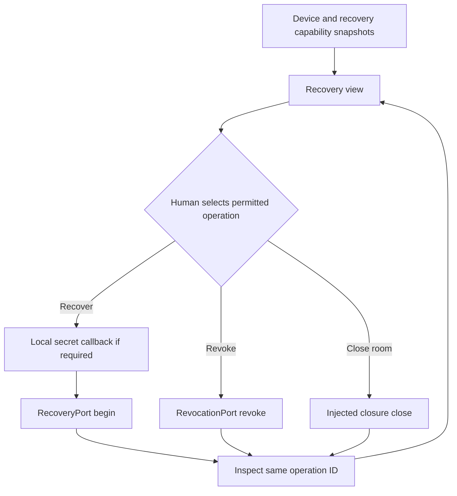

# KHA-127 Recovery and closure interface - Plan

## Goal Capsule

A human understands missing keys, replacement, revocation and closure without impossible deletion promises.

Authority: current user decisions override the approved ticket scope, which overrides technical recommendations. Scope source is `docs/product/tickets/KHA-127.md`; global requirements: R12, R14. Planning snapshot: Khala `6d4694173eff9b0832f4c3a2cdb90b4281fcccd9` with approved ticket proposal at `d625c19`. Dependency tickets: KHA-101, KHA-105, KHA-107. This plan changes Khala only; sibling Aiur/Archon are read-only design references.

P07/G-RETENTION is resolved for this surface: recovery is device- and key-based only, and room closure stops new messages, removes the room from the owner's view, and requests local cleanup on the owner's devices. Closure never claims to recall copies already delivered to other participants or models.

---

## Product Contract

### Summary

A human understands missing keys, replacement, revocation and closure without impossible deletion promises.

### Problem Frame

The ordinary user is collaborating with another human and their already-working agent. Rebuilding generic chat, exposing infrastructure setup, or confusing pending delivery with model consumption undermines that workflow. This ticket owns one bounded part of the shared journey.

### Requirements

- R1. Device/authentication failure and missing historical keys are different states.
- R2. Recovery actions present only capabilities permitted by the selected recovery policy.
- R3. Revocation/closure consequences disclose what happens locally and what cannot erase participant-held copies.
- R4. Unknown external model outcomes survive the recovery journey without automatic replay.

### Actors and flow

- A1. The authenticated human who owns the current agent connection.
- A2. Other admitted humans and their attributed agents, whose messages are content rather than control authority.
- F1. Open a room on a replacement device, inspect available history/recovery state and perform an authorized recovery action if offered.

### Acceptance examples

- AE1. Covers F1 / R1–R4. Login succeeds but history keys remain unavailable; the interface states that history is unavailable rather than implying the room has no messages.
- AE2. Covers R3–R4. Loss of authorization or an unavailable dependency produces an explicit state and no invented success; retry preserves operation identity where a write may already have happened.

### Key decisions

- Dashboard-native design is a user directive: Khala should look like a page in Aiur’s left navigation and permit later embedding. It remains independently deployable.
- Keep existing sessions and automated setup (session-settled: user-directed — chosen over manual connector/MCP setup or replacing the session: the person should share a link with the agent already doing the work).
- Connector-gated review (session-settled: user-directed — chosen over separate review/delivery encryption groups: a trusted connector may decrypt pending content, but only approved content reaches the model).
- Recovery and closure use the no-deletion-promise policy: no escrow fallback, no global erasure claim, and no recall of already-delivered copies.
- P14 disables recovery modes for the current product: messaging reports `unsupported_substrate`, the UI says “Recovery is not available,” and it offers neither configuration nor a recovery-key prompt. (session-settled: user-directed — chosen over treating capability refusal as missing setup: an unavailable reason is not a setup request.)

### Scope boundaries

This ticket does not redefine shared contracts, implement sibling-owned services, change Aiur itself, or introduce a second messaging/crypto stack. UI-only tickets demonstrate injected-port behavior; integration tickets own actual composition. Client selection and platform setup belong to their named predecessors. Attachments, retention and automation choices remain with their product/contract owners.

---

## Planning Contract

Product Contract changed: P07/G-RETENTION records the operator-approved no-deletion-promise policy, and P14 records that no recovery mode is offered. Prerequisite tickets are dispatch dependencies, not evidence that their runtime experiments already passed.

### Technical decisions and ports

- KTD1. Consume105 `DeviceView`, `RecoveryPort`, `RevocationPort` and their typed operation outcomes. Authentication success, device readiness and historical content recovery are independent facts.
- KTD2. P14 permits no recovery mode, so the current UI does not host a recovery secret input or configuration affordance. The canonical local-only callback remains a controller boundary for a future separately approved capability; it never becomes a serializable request body, analytics field or generic app store.
- KTD3. Operations are resumable by their stable operation ID. Before any effectful recovery, revocation or closure dispatch, the controller generates and persists a scoped operation reference; the remote call receives that same ID. An injected resume store persists only operation kind, ID and account/device/room scope; it never stores secret material or content. Unknown recovery/revocation/cleanup outcomes are not successful completion or permission to retry external model work.
- KTD4. Presentation reuses `Panel` and `StatusBadge`, with feature-owned status, alert and note regions for locked, loading, partial and unavailable states. Consequence summaries use actual policy scope and counts, never “delete everywhere.” Closure and retention behavior are not implemented by this view.
- KTD5. Recovery is device- and key-based only, while closure stops future room messages, removes the room from the owner's view, and requests local device cleanup. Already-delivered participant or model copies are never presented as recalled or erased. (session-settled: user-directed — chosen over recovery escrow or a global deletion promise: delivered copies cannot be reliably recalled.)
- KTD6. The feature owns a typed closure UI seam with stable operation identity and inspection semantics; each intent binds the operation ID to the authenticated owner, room and expected room revision. KHA-136 supplies the real adapter and independently revalidates authority and target context during composition. `RecoveryPort` and `RevocationPort` remain canonical for their own domains and are not stretched into a room-close command.

### Output and local display model

Exports `RecoveryPanel`, `createRecoveryController`, `RecoveryUiPort`, `RecoveryView`. Files: `RecoveryPanel.tsx`, `controller.ts`, `model.ts`, `ports.ts`, `recovery.css`. `RecoveryUiPort` provides an authoritative snapshot and subscription, typed recovery modes, typed revocation targets/generations, and a closure capability with owner, room, expected revision and consequence data. Its begin/inspect methods preserve stable operation identity. KHA-136 later adapts the feature-local closure seam to an approved command and performs authoritative server-side validation; this view cannot invent a server command, fallback escrow or authorization result.

```ts
type RecoveryView = { deviceState: DeviceView["state"]; history: "available" | "partial" | "unavailable"; operation: RecoveryOperation; allowedActions: readonly ("recover" | "revoke_device" | "revoke_binding" | "close_room")[] };

type RecoveryOperation =
  | { kind: "idle" }
  | { kind: "recovery"; operationId: string; state: RecoveryState | "outcome_unknown" }
  | { kind: "revocation"; operationId: string; state: "pending" | "propagating" | "complete" | "partial" | "failed" | "outcome_unknown" }
  | { kind: "closure"; operationId: string; state: "pending" | "complete" | "partial" | "failed" | "outcome_unknown" };
```

Allowed action identifiers are a closed union projected from canonical recovery/revocation capabilities plus the feature-local typed closure capability; arbitrary server strings cannot dispatch browser functions. Example: verified principal + DeviceView locked + RecoveryPort capabilities unavailable renders a locked-history explanation and no fabricated recovery button. Partial restoration renders recovered access with remaining unavailable history, not an empty room.

| Operation state | Presentation and permitted control |
|---|---|
| Idle | Show only actions present in the current authoritative capability snapshot. |
| Pending / restoring / propagating | Announce progress and disable every recovery, revocation and closure action until the operation reaches a terminal state. Cancel stops the local wait but does not claim to cancel a remote effect. |
| Complete / restored | Announce the exact completed effect. Successful closure navigates to the existing chat-list destination after the owner-visible room is removed. |
| Partial | Show completed and remaining effects separately; never use a positive completion badge for the whole operation. |
| Failed / unrecoverable | Show the finite public reason and only a capability-permitted next step. A definitive failure may begin a new operation; unrecoverable history remains explicit. |
| Outcome unknown | Keep the same operation ID, show no success, and offer inspection/resume only; never expose a fresh destructive submission. |

### Lifecycle and safety boundaries



Clear secret input immediately after local handoff and on cancel/unmount/account change. The controller writes the scoped operation reference before invoking any effectful port method, and the port receives that preallocated ID. The injected resume store retains only operation kind, ID and account/device/room scope. Controller creation hydrates a matching reference and inspects it; proven terminal results and scope mismatch clear the reference. Cancelling a local wait aborts only that wait, retains the reference as `outcome_unknown` and permits inspection under the same ID; it never claims to cancel a remote effect or permits a fresh destructive dispatch. Cache immutable snapshots, fence callbacks by account/device generation, and invalidate closure actions when owner, room or expected room revision changes. Enforce one global in-flight operation per controller so recovery, revocation and closure cannot race each other. Abort pending work on idempotent disposal so late responses cannot restore plaintext or actions. Browser refresh queries the stored operation ID rather than replaying a destructive call. A room becoming revoked removes plaintext from the active view; claims about persisted SDK cache erasure belong to128/130 evidence.

A closure consequence screen requires approved semantics and command port before rendering an active submit action. If retention is not configured, show capability unavailable; do not default to seven/thirty-day deletion. State the distinction between stopping future access, local cleanup, service retention and copies already obtained by participants/models.

### Approved recovery and closure policy

The UI offers only device/key recovery modes reported by the canonical capability contract. It does not invent escrow or a recovery fallback. Closure is available only through an injected approved capability and must describe each effect separately: future messages stop, the owner no longer sees the room, local cleanup is requested on the owner's devices, and already-delivered copies remain outside Khala's recall authority. Retention durations remain outside this view and no numeric deletion window is implied.

### Shared implementation discipline

Use the selected OSS client/SDK through canonical contracts, not direct imports into UI controllers. Follow the feature-local model/ports/controller/component pattern in `apps/web/src/features/agent-controls/`, the immutable snapshot/subscription lifecycle in `apps/web/src/features/timeline/controller.ts`, and the browser harness pattern in `apps/web/src/features/review/`. Reuse `apps/web/src/shell/Panel.tsx` and `apps/web/src/shell/StatusBadge.tsx`. `docs/evidence/ui-planning-grounding.md` records source SHAs, inspected dashboard components, external guidance and candidate versions. KHA101 owns package manifests, root dependencies, the lockfile, ESM/TypeScript tooling and generic test discovery; this ticket introduces no dependency or package-export change. Test files remain beside owned modules. Existing prerequisite exports win over illustrative data below; if they disagree, obtain a reviewed contract amendment rather than add a local compatibility copy.

No implementation or runtime test has run as part of this plan. Browser credentials, decrypted message bodies and invitation secrets must not enter screenshots, logs, telemetry or snapshot fixtures from real users. Use synthetic accounts and message canaries for evidence.

---

## Implementation Units

### U1. Project independent recovery facts

**Goal:** Keep login, keys and history availability separate.

**Requirements:** R1/R2; AE1; KTD1/KTD5. **Dependencies:** Merged105/107 and approved P07.

**Files:** `apps/web/src/features/recovery/model.ts`, `apps/web/src/features/recovery/ports.ts`, `apps/web/src/features/recovery/projection.test.ts`.

**Approach:** Derive display from canonical DeviceView and recovery outcomes; unknown values fail closed. Preserve local operation identity without storing key material.

**Test scenarios:**

1. Covers AE1. Signed-in plus missing keys renders unavailable history, not no messages.
2. Partially restored history remains partial after connection becomes online.
3. Unsupported recovery mode cannot become a callable action.
4. Recovery, revocation and closure progress project into distinct operation kinds without sharing misleading success labels.

**Verification:** Projection includes no inferred full recovery or hidden secret fields.

### U2. Implement resumable operation lifecycle

**Goal:** Resume safe operations without inventing a recovery prompt.

**Requirements:** R2/R4; F1/AE2; KTD2/KTD3. **Dependencies:** U1.

**Files:** `apps/web/src/features/recovery/controller.ts`, `apps/web/src/features/recovery/controller.test.ts`.

**Approach:** Keep the canonical local-only secret callback isolated in the controller, but expose no recovery-key UI while P14 reports `unsupported_substrate`. Allocate and persist each scoped operation reference before dispatch, then pass its ID to the effectful port method. Hydrate and inspect that reference after refresh; do not initiate another operation on an uncertain or late response. Permit only one nonterminal operation of any kind per controller.

**Test scenarios:**

1. `unsupported_substrate` renders “Recovery is not available” with no configuration action or recovery-key prompt; other unavailable reasons do not become setup prompts either.
2. Account/device generation switch during restore clears view and ignores old callbacks and late operation responses.
3. Unknown model delivery remains unknown and cannot trigger a recovery resend.
4. Refresh hydrates the matching non-secret operation reference and inspects the original ID; proven terminal and mismatched-scope operations clear it, while a locally cancelled wait remains inspectable under the original ID.
5. A crash or disposal after dispatch but before the response leaves the write-ahead reference intact; the next controller inspects that original ID instead of submitting again.
6. While any operation is nonterminal, attempts to begin a different recovery, revocation or closure action fail closed without reaching its port.

**Verification:** No recovery-key input exists in the P14 UI; operation identity survives interruption safely.

### U3. Render consequences and honest error states

**Goal:** Explain recovery/revocation/closure with approved actions.

**Requirements:** R1–R4; KTD4–KTD6. **Dependencies:** U2.

**Files:** `apps/web/src/features/recovery/RecoveryPanel.tsx`, `apps/web/src/features/recovery/recovery.css`, `apps/web/src/features/recovery/RecoveryPanel.test.tsx`.

**Approach:** Use `Panel`, `StatusBadge` and feature-owned status/alert/note regions. Confirmation text names the exact target and consequence supplied by policy. Cancel returns to the unchanged room. Submit disables repeat activation while pending; success invokes the injected chat-list navigation callback; unknown outcome remains on the consequence screen for inspection under the same operation ID. Local UI close is distinct from room close/revoke.

**Test scenarios:**

1. No delete-everywhere promise appears for remote copies.
2. Read-only/expired owner cannot invoke destructive operation.
3. Partial cleanup displays remaining failure and avoids a green completion label.
4. A late close response after account/device replacement cannot repopulate plaintext, re-enable actions or restore the room.
5. Pending, complete, partial, failed, unrecoverable and unknown states render the state matrix's permitted controls and status wording.
6. A room switch or stale closure capability revision invalidates submit before dispatch and cannot retarget the bound operation.

**Verification:** Every destructive action maps to an approved canonical capability.

### U4. Verify accessible exceptional journey

**Goal:** Document136 wiring and recovery limitations.

**Requirements:** R1–R4; AE1/AE2. **Dependencies:** U3.

**Files:** `apps/web/src/features/recovery/recovery.browser.spec.ts`, `apps/web/src/features/recovery/browser-harness/index.html`, `apps/web/src/features/recovery/browser-harness/main.tsx`, `apps/web/src/features/recovery/browser-harness/fake-recovery-port.ts`, `apps/web/src/features/recovery/README.md`.

**Approach:** Browser test the P14 recovery refusal plus revocation/closure operation lifecycles with synthetic ports. Exercise phone keyboard/focus and progress announcements.

**Test scenarios:**

1. Recovery refusal has no input, configure affordance or auto-prompt and remains stable across repeated snapshots.
2. The refusal is programmatically exposed as “Recovery is not available” without presenting an unavailable reason as setup guidance.
3. Keyboard-only destructive confirmation/cancel works and pending, failure, unknown and completion transitions are announced.
4. 390px and 320px layouts plus 200% text scaling show complete consequence text and every action without two-dimensional scrolling or clipping.
5. Unavailable recovery has a meaningful next step and no repeated auto-prompt.

**Verification:** 136 can bind real SDK operations without changing display semantics.

---

## Verification Contract

Run `pnpm --filter @khala/web typecheck`; `pnpm --filter @khala/web test -- src/features/recovery`; `pnpm --filter @khala/web exec node --import tsx --test src/features/recovery/recovery.browser.spec.ts`; `pnpm check:boundaries`. No real recovery is proved by these fakes.
Use the repository-pinned Node 22.23.2 runtime. No skipped or fake real-service case may be reported as completed integration. A changed command contract requires updating the owning bootstrap and this plan together.

---

## Definition of Done

Recovery/closure capabilities match approved P07 and P14; the UI exposes no recovery-key flow, setup prompt or impossible deletion claim; missing/partial keys and unknown outcomes have tests.136 receives the operation-status handoff and the canonical controller seam without changing display semantics.
All owned unit tests and applicable contract checks pass on the merged base. Every acceptance example is linked to test evidence. Remove abandoned experiment code, fixture imports from production, unused subscriptions and dead fallbacks. Preserve scope/file ownership; report dependency defects to their owner instead of patching sibling directories. No deployment or implementation completion is implied by this document.
