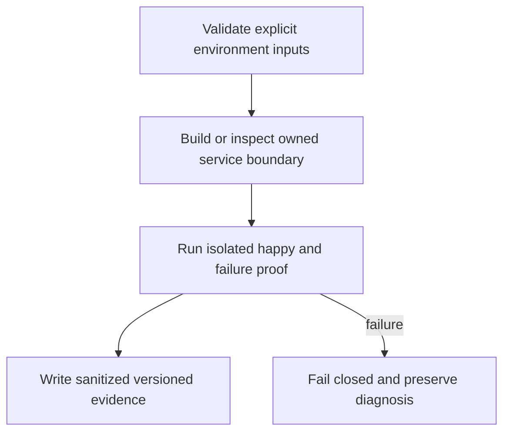

# Netlify Web and Control Functions - Plan

## Goal Capsule

Deploy the browser app and bounded control requests on Netlify while keeping continuous agent work on its owner host.

Authority: user decisions in `docs/product/decisions.md` precede this plan; then the approved ticket scope and owning contracts. Tail owner is the Khala Executor. This ticket does not grant authority over sibling Aiur processes or configuration.

Prerequisites and stop conditions: KHA-101 build contract and KHA-105 ControlStore contract; deployment account/site authorization for real remote proof. SDK-specific CSP finalization follows141/143 evidence and live UI integration132.

---

## Product Contract

### Summary and problem frame

Deploy the browser app and bounded control requests on Netlify while keeping continuous agent work on its owner host. Khala currently has research and proposal documents, so this work must define its own evidence without claiming an existing implemented subsystem.

### Requirements

- R1. Build the web app and control functions reproducibly from the same workspace.
- R2. Separate browser-public settings from server secrets and isolate preview from production identities/state.
- R3. Keep continuous messaging sync and agent session subscriptions outside function lifetimes.

### Acceptance examples

- AE1. A preview build references only preview origins and cannot consume production control credentials.
- AE2. A deep chat link reload serves the app, while an API error remains a structured API response.

### Scope and decisions

Use root netlify.toml with workspace-root dependency installation, apps/web/dist publishing, and generated top-level function entrypoints from apps/control handlers. Do not copy Archon security headers blindly: its dual-host renderer gate solves a different boundary.

Carry forward TypeScript, OSS reuse, Netlify preference, existing-session attachment, connector-gated E2EE review, and dashboard-native design. This ticket cannot add human technical setup or silently change an unresolved product policy.

---

## Planning Contract

Product Contract unchanged. An implementation-ready **plan** is not a claim that prerequisites have passed or that the ticket is dispatchable today. Resolve the named dependency and environment gates before production mutation; bounded local work may proceed where explicitly described.

### Grounding and technical decisions

KTD1. Use root netlify.toml with workspace-root dependency installation, apps/web/dist publishing, and generated top-level function entrypoints from apps/control handlers. Do not copy Archon security headers blindly: its dual-host renderer gate solves a different boundary.

KTD2. Keep platform operations separate from feature policy. Reuse upstream service/SDK behavior and narrow ports; no custom cryptography, replacement session or shared mutable application store is introduced here.

KTD3. Reserve shared manifests/lockfile and app entrypoints for their assigned owner. Components land against real reviewed contracts and isolated fixtures; integration owns binding to live implementations. See `docs/product/repo-layout.md`.

KTD4. User-directed TypeScript and Netlify preference remain constraints; Railway-hosted OSS is acceptable where it saves development. The owner-side continuous subscriber cannot live inside a request-lifetime function. (session-settled: user-directed — chosen over a mandatory custom Hono backend: reduce ongoing backend development and operation.)

### Existing evidence and refreshable implementation pointers

Khala researched base: `6d4694173eff9b0832f4c3a2cdb90b4281fcccd9`; proposed paths below do not exist as app implementation yet. Archon reference: `c7d3254097acaa02eed1e3be6fd8fbf06c0e8128`, especially `netlify.toml`, `package.json`, `netlify/lib/store.mjs`, and `netlify/lib/hosted/record-store.mjs` in that repository. Aiur reference: `1f618cddf601a0b6d79bc1197579746b7584a64c`; its dashboard supplies design language, not the runtime language or service topology. Refresh source/version facts at worker pickup without changing accepted product requirements.

Archon uses a one-site build and explicit function directory, with its own edge gate owning host-specific CSP. Copy the responsibility separation, not its renderer allowlists. Netlify synchronous/streaming functions are bounded to 60 seconds according to the cited platform configuration; persistent model subscriptions belong to the owner runtime.

### Proposed owned files

- `netlify.toml`
- `infra/netlify/env.schema.json`
- `infra/netlify/README.md`
- `apps/control/src/runtime/handler.ts`
- `apps/control/src/runtime/discover.ts`
- `apps/control/src/runtime/handler.test.ts`

### Worked boundary record

The following is an example record, not an assertion of collected runtime evidence. Fields marked recorded/resolved are required outputs of the implementation proof.

```json
{
  "web_publish": "apps/web/dist",
  "production_app_origin": "https://khala.aiur.team",
  "functions_input": "infra/netlify/functions-generated",
  "public_env": [
    "PUBLIC_HOMESERVER_ORIGIN",
    "PUBLIC_APP_ORIGIN"
  ],
  "server_env": [
    "OIDC_CLIENT_SECRET",
    "CONTROL_STATE_NAMESPACE"
  ],
  "error": {
    "code": "internal_error",
    "requestId": "opaque"
  }
}
```

### High-level technical design



Scaffold smoke in this ticket may use an unavailable placeholder screen; it must not expose fake chat behavior. Real authenticated chat proof remains KHA-132. KHA-131 must also register `build:functions` in its owned control package through the dependency owner when the initial scaffold lacks it.

### Concrete function registration contract

`apps/control/src/runtime/handler.ts` exports `RouteRegistration = { path: string; methods: readonly string[]; handle(request: Request): Promise<Response> }`. Paths are exact, normalized HTTP paths; no arbitrary regex routes. Only `apps/control/src/composition/human/handlers.ts` exporting `registerHumanHandlers(): readonly RouteRegistration[]` and `apps/control/src/composition/agent/handlers.ts` exporting `registerAgentHandlers(): readonly RouteRegistration[]` are discovered. Their routes must stay under `/api/human/` and `/api/agent/` respectively. Human OAuth callback is `/api/human/auth/callback`; provider registration uses that canonical route. Handler factories keep live dependency initialization inside request handling; importing registration modules performs no network or mutation.

`pnpm --filter @khala/control build:functions` executes owned `runtime/discover.ts` with the repository root explicitly resolved from its script location, validates exports and duplicate path/method pairs, then emits `infra/netlify/functions-generated/khala-control.ts` and a route manifest. That directory is the Netlify **input**, never Netlify's internal output directory; it is generated/ignored, not hand edited. Use the pinned standard Netlify bundler for packaging. The generated default Request→Promise<Response> handler applies the runtime wrapper then exact route/method dispatch. An absent approved producer is omitted safely so131 can build before132/133; an existing malformed producer is a build error. Reserved absent domain returns503 `feature_unavailable`, unknown route404, wrong method405; no response leaks configuration. Public `/api/health` is the sole explicit unauthenticated health route; auth entry/callback follows110's bound OAuth protocol rather than assuming an existing session.

`netlify.toml` puts forced `/api/*` → `/.netlify/functions/khala-control/:splat` rewrite before the SPA fallback. Preserve the original request pathname through the adapter, with an explicit tested mapping for direct Netlify function URLs; direct invocation cannot evade method, auth or route validation. Fixtures verify health, OAuth callback, unknown route, absent producer, method denial and direct invocation.132/133 own live producer implementations; they never modify the gateway list or root redirects. Production acceptance rejects required absent producers. The build never enumerates arbitrary worker modules.

### Control-store adapter

KHA-131 owns `apps/control/src/runtime/control-store.ts` and adjacent `control-store.test.ts`, implementing the KHA-105 `ControlStore` port with Netlify Blobs. Export `createControlStore` from the control runtime subpath; inject the SDK store and clock, and open no network connection at module import. Use strong reads with opaque nonempty ETags, create-if-absent writes and conditional replacement. Enforce logical expiry at read and maintain operation identity in the same value as the mutation.

An SDK conditional-write refusal may follow an earlier successful write whose response was lost. Read back before deciding failure. Return applied only when operation ID and input digest match; if another write obscures the earlier result, return outcome_unknown. Never manufacture a multi-key transaction or call a timeout a safe-to-repeat failure. Model tools never receive this store or its credentials.

Site-wide Blobs stores are available across deploy contexts: namespacing alone is not an authorization boundary. Use a separate preview Netlify site for untrusted preview code, with separate OAuth callbacks/service accounts and no production data credentials. Trusted same-site branch deploys still need explicit context namespaces and must not be described as isolation against malicious preview code.

### Dependencies and limits

Hard ticket prerequisites: KHA-101, KHA-105. Gates: KHA-101 build contract and KHA-105 ControlStore contract; deployment account/site authorization for real remote proof. SDK-specific CSP finalization follows141/143 evidence and live UI integration132.

Every proposed verification command below is an implementation-time contract, not a command claimed to run during planning. The owning implementation must add the named script/entrypoint before invoking it. Package-manager and native SDK versions are pinned from actual supported releases at implementation; this plan does not fabricate a tested dependency tuple.

---

## Implementation Units

### U1. Define build/environment contract

**Goal:** Define build/environment contract.

**Requirements:** R1; overall R1–R3, AE1–AE2 constrain the completed ticket.

**Dependencies:** None beyond ticket prerequisites.

**Files:** `netlify.toml`, `infra/netlify/env.schema.json`, `infra/netlify/README.md`.

**Approach:** Set workspace root base, explicit publish directory and functions bundle directory. Pin build/function Node versions supported by the platform and native-free control code.

**Patterns:** KTD1–KTD4; referenced upstream behavior and owned sibling boundaries.

**Test scenarios:** Clean preview build includes web assets and only intended function wrappers; missing server config fails without printing values.

**Verification:** Record the observed pass/fail result, exact build/environment and sanitized evidence; do not infer runtime success from configuration parsing alone.

### U2. Implement bounded handler wrapper

**Goal:** Implement bounded handler wrapper.

**Requirements:** R2; overall R1–R3, AE1–AE2 constrain the completed ticket.

**Dependencies:** U1.

**Files:** `apps/control/src/runtime/handler.ts`, `apps/control/src/runtime/handler.test.ts`.

**Approach:** Wrap domain handlers with method checks, payload size limits, request IDs and sanitized error mapping. Public health is explicitly allowlisted; authenticated domain handlers enforce their own identity/authorization port.

**Patterns:** KTD1–KTD4; referenced upstream behavior and owned sibling boundaries.

**Test scenarios:** Unexpected error returns generic code/request ID; authentication failure remains401/403; log redaction removes headers/tokens/body content.

**Verification:** Record the observed pass/fail result, exact build/environment and sanitized evidence; do not infer runtime success from configuration parsing alone.

### U3. Discover function registrations

**Goal:** Discover function registrations.

**Requirements:** R3; overall R1–R3, AE1–AE2 constrain the completed ticket.

**Dependencies:** U2.

**Files:** `apps/control/src/runtime/discover.ts`, `apps/control/src/runtime/handler.test.ts`.

**Approach:** Use the finite registration and generation contract below. Never ship fixtures/test ports in a production handler. Discovery occurs only at build time against the two literal approved paths.

**Patterns:** KTD1–KTD4; referenced upstream behavior and owned sibling boundaries.

**Test scenarios:** Unknown handler registration fails build; test double registration is rejected; API paths cannot fall through to SPA html.

**Verification:** Record the observed pass/fail result, exact build/environment and sanitized evidence; do not infer runtime success from configuration parsing alone.

### U4. Verify deployment and security policy

**Goal:** Verify deployment and security policy.

**Requirements:** R3; overall R1–R3, AE1–AE2 constrain the completed ticket.

**Dependencies:** U3.

**Files:** `netlify.toml`, `infra/netlify/README.md`.

**Approach:** Set route-aware caching and CSP compatible with selected SDK WASM/worker origins; keep assets immutable and auth responses noncacheable. Preview smoke uses isolated credentials.

**Patterns:** KTD1–KTD4; referenced upstream behavior and owned sibling boundaries.

**Test scenarios:** Browser reload of chat route works; auth callback/API are not SPA rewrites; browser bundle scan finds no server secret or native connector module.

**Verification:** Record the observed pass/fail result, exact build/environment and sanitized evidence; do not infer runtime success from configuration parsing alone.

### U5. Implement the guarded control-store adapter

**Goal:** Supply durable control metadata operations with explicit conflict and uncertain-outcome semantics. **Requirements:** R2, KTD2; KHA-105 ControlStore contract. **Dependencies:** U1 and merged KHA-105 declarations. **Files:** `apps/control/src/runtime/control-store.ts`, `apps/control/src/runtime/control-store.test.ts`, `infra/netlify/control-store-live-check.ts`.

**Approach:** Reuse the conditional-write/readback discipline from Archon `netlify/lib/hosted/record-store.mjs` at the researched SHA. Keep the SDK version's observed edge behavior in adapter tests instead of copying it as a timeless guarantee. Writes affect one key. Resolve by operation ID plus input digest; a matching latest record proves success, an obscured historical operation remains unknown. The adapter implements `read`, `compareAndSet`, and `resolve` from105, with validation before any write.

**Test scenarios:** Two absent-key creators yield one applied operation; same revision competitors cannot both apply; missing ETag refuses before an unconditional write; lost response plus matching readback returns applied; conflicting/newer readback remains unknown when earlier effect cannot be disproved; expired credentials never authorize; outage is unavailable rather than absent; same operation ID with changed bytes fails. Run these against isolated live Blobs in addition to the fake provider. An operation ledger in a second key cannot be used to claim atomicity.

**Verification:** `pnpm --filter @khala/control test` executes adapter negatives; `pnpm exec tsx infra/netlify/control-store-live-check.ts --environment preview` records live single-key CAS evidence without secrets. Live check remains unrun during planning and must refuse production targets.

---

## Verification Contract

| Check | Expected evidence |
|---|---|
| `pnpm --filter @khala/web build` | Successful relevant validation after its owning script exists; failed prerequisites remain explicit. |
| `pnpm --filter @khala/control build` | Successful relevant validation after its owning script exists; failed prerequisites remain explicit. |
| `pnpm exec netlify build` | Successful relevant validation after its owning script exists; failed prerequisites remain explicit. |
| `pnpm --filter @khala/control test` | Successful relevant validation after its owning script exists; failed prerequisites remain explicit. |

Feature tests must exercise behavior and failure cases rather than mirror constants. Pure docs/config units use schema/config/build and real smoke evidence instead of artificial unit tests. A test double proves a component contract; it cannot prove production identity, crypto persistence, hosted routing or session delivery. Integration owners in the graph supply that proof.

Security checks use synthetic data and disposable identities. Do not publish raw environment dumps, process arguments, token-bearing URLs, database credentials, server signing keys or decrypted participant messages. Failure logs preserve request IDs and reason codes without content.

---

### Settled production origin — user amendment

P11 sets the production app origin to `https://khala.aiur.team`. Canonical production share links use that origin; OAuth callback is `https://khala.aiur.team/api/human/auth/callback`. KHA131 owns origin validation/configuration,110 consumes the exact callback and132 composes it. Preview allowlists/credentials stay explicit and separate. This does not assign a Matrix server_name or claim DNS/hosting is already configured. Earlier synthetic `.example` links remain test fixtures, never deployment defaults. This later user decision supplements the preserved Product Contract.

## Definition of Done

All R1–R3 and AE1–AE2 have evidence. All U-IDs satisfy their stated validation; unresolved external gates prevent a pass for dependent outcomes. Owned code/docs land green on current base, no abandoned experiment or fixture is exported into production, and shared file ownership remains intact. The Executor receives exact changed paths, tests run, unavailable checks and remaining limitations.

### Sources

- https://docs.netlify.com/build/data-and-storage/netlify-blobs/

- https://docs.netlify.com/build/configure-builds/monorepos/
- https://docs.netlify.com/build/functions/configuration/
- https://docs.netlify.com/build/functions/api/

Local context: `docs/product/tickets/KHA-131.md`, `docs/product/repo-layout.md`, `docs/product/decisions.md`, and `docs/research/11-hosting-tradeoffs.md`. Official sources checked 2026-09-16; changing behavior must be rechecked at implementation.
