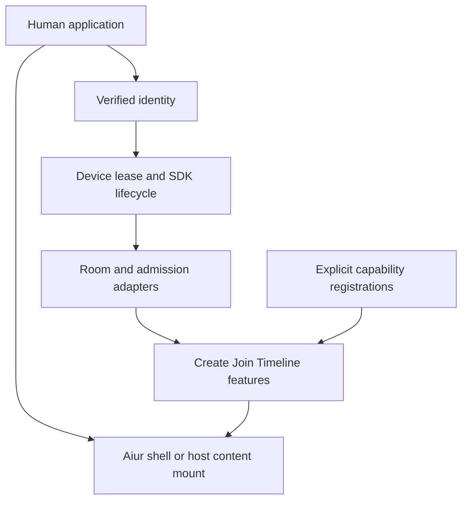
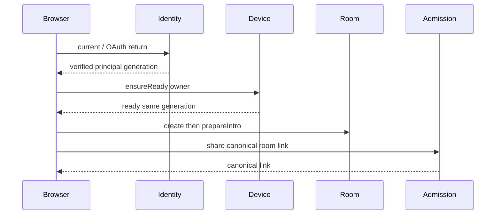

# KHA-132 Real human flow composition - Plan

## Goal Capsule

Two OAuth humans create, share and exchange encrypted attributed messages through production adapters.

Authority: current user decisions override the approved ticket scope, which overrides technical recommendations. Scope source is `docs/product/tickets/KHA-132.md`; global requirements: R01, R02, R14, R15. Planning snapshot: Khala `6d4694173eff9b0832f4c3a2cdb90b4281fcccd9` with approved ticket proposal at `d625c19`. Dependency tickets: KHA-108, KHA-110, KHA-111, KHA-112, KHA-113, KHA-122, KHA-123, KHA-124, KHA-131. This plan changes Khala only; sibling Aiur/Archon are read-only design references.

Stop condition: Normal prerequisite gates: KHA108/110–113/122–124/131 must supply real reviewed ports. Unresolved upstream admission/history product choices remain blocking if inherited.

---

## Product Contract

### Summary

Two OAuth humans create, share and exchange encrypted attributed messages through production adapters.

### Problem Frame

The ordinary user is collaborating with another human and their already-working agent. Rebuilding generic chat, exposing infrastructure setup, or confusing pending delivery with model consumption undermines that workflow. This ticket owns one bounded part of the shared journey.

### Requirements

- R1. Live auth, device, room, invitation and feature modules compose into the ordinary no-setup human journey.
- R2. Production routes cannot select fixture adapters or accidentally start duplicate device stores.
- R3. Queued introduction history is shown only according to authorized admission and key availability.
- R4. Standalone route composition leaves page content suitable for later Aiur-host embedding.

### Actors and flow

- A1. The authenticated human who owns the current agent connection.
- A2. Other admitted humans and their attributed agents, whose messages are content rather than control authority.
- F1. Human A signs in and creates a chat, sends intros and shares the link; human B signs in, joins and replies; both observe one consistent timeline.

### Acceptance examples

- AE1. Covers F1 / R1–R4. A stale device initialization completes after logout/account switch; its callback cannot attach the old identity or display its messages in the new session.
- AE2. Covers R3–R4. Loss of authorization or an unavailable dependency produces an explicit state and no invented success; retry preserves operation identity where a write may already have happened.

### Key decisions

- Dashboard-native design is a user directive: Khala should look like a page in Aiur’s left navigation and permit later embedding. It remains independently deployable.
- Keep existing sessions and automated setup (session-settled: user-directed — chosen over manual connector/MCP setup or replacing the session: the person should share a link with the agent already doing the work).
- Connector-gated review (session-settled: user-directed — chosen over separate review/delivery encryption groups: a trusted connector may decrypt pending content, but only approved content reaches the model).

### Scope boundaries

This ticket does not redefine shared contracts, implement sibling-owned services, change Aiur itself, or introduce a second messaging/crypto stack. UI-only tickets demonstrate injected-port behavior; integration tickets own actual composition. Client selection and platform setup belong to their named predecessors. Attachments, retention and automation choices remain with their product/contract owners.

### Outstanding questions

Normal prerequisite gates: KHA108/110–113/122–124/131 must supply real reviewed ports. Unresolved upstream admission/history product choices remain blocking if inherited.

---

## Planning Contract

Product Contract unchanged. Implementation details below do not settle questions still marked blocking. Prerequisite tickets are dispatch dependencies, not evidence that their runtime experiments already passed.

### Technical decisions and exact integration ownership

- KTD1. `createHumanApplication` is the browser composition root for110/111/112/113 and122/123/124. It binds real adapters to feature controllers and owns their lifetime. Feature components never locate global singleton services themselves.
- KTD2. One identity generation owns one browser device lease. Account switch/logout first deactivates feature subscriptions and pending control authority, then disposes the device session. Follow111's actual lease mechanism; never instantiate another MatrixClient merely because another route or host wrapper mounts.
- KTD3. Human control handler adapters live under `apps/control/src/composition/human/`;131 owns their actual Netlify registration. Register explicit handlers/capabilities through the preallocated runtime API, no filesystem/plugin scanning or dynamic request-supplied module URLs.
- KTD4. Standalone mode mounts107 chrome and Khala route content. Expose a content mount for a future host, but ship no cross-origin embed protocol, shared cookie assumption or Aiur source change. Routing/base path is injected and validated; room identifiers remain opaque.

### Producers, consumers and exports

| Source ticket | Canonical boundary consumed |132 responsibility |
|---|---|---|
|110 | IdentityPort and verified AuthPrincipal | Same-origin browser session adapter; no provider credentials in bundle |
|111 | DevicePort | Acquire/observe/stop one identity-scoped crypto lifecycle |
|112 | RoomPort | Create/intro/send/timeline operations and replacement snapshots |
|113 | AdmissionPort inspect/admit/share | Canonical link and admission under current verified human |
|122–124 | Feature controllers/screens | Construct/dispose with real ports, no fixture fallback |
|131 | Netlify discovery/handler registration | Provide human handler bundle in assigned composition directory |

Owned exports: `createHumanApplication`, `mountKhalaContent`, `registerHumanHandlers`, `HumanApplicationHandle`, `HumanRouteContext`. Proposed files: `application.ts`, `routes.ts`, `device-session.ts`, `capabilities.ts`, `mount.tsx`, with server `handlers.ts`. Public output handle exposes `dispose`, current safe route context and explicit capability slots. Credentials remain inside adapter closures, not in the page model.

Directional capability registration for follow-on composition modules:

```ts
type HumanCapability = { state: "unavailable" | "ready"; id: "review" | "controls" | "recovery"; attach: (context: HumanRouteContext) => { dispose: () => void } };
type HumanApplicationHandle = { dispose: () => void; navigate: (path: string) => void };
```

`HumanRouteContext` provides approved read/write ports and a scoped feature-slot registry, not raw SDK credentials or global host mutation. This ticket owns the finite imports/list in `apps/web/src/composition/human/capabilities.ts` and a one-time bootstrap exception: create `apps/web/src/composition/review/register.ts`, `apps/web/src/composition/controls/register.ts`, and `apps/web/src/composition/recovery/register.ts` as unavailable placeholders exporting `registerReview`, `registerControls`, and `registerRecovery`, each returning HumanCapability. These placeholders render explicit unavailable state and expose no write operation. They compile at132 completion and are replaced in place by134–136, which thereafter own those files. No later central-list edits or dynamic discovery are needed.

131 fixes control registration as `registerHumanHandlers(): readonly RouteRegistration[]`, exported by `apps/control/src/composition/human/handlers.ts`. Runtime-owned RouteRegistration is `{path:string,methods:readonly string[],handle:(Request)=>Promise<Response>}`; human routes are restricted to `/api/human/*`. Bind live adapters lazily per request, with no import-time network calls.131 generates `infra/netlify/functions-generated/khala-control.ts`, redirects `/api/*` before SPA, returns404 for unknown paths and503 for known unavailable domains.132 supplies that exact factory; duplicate route/method is a build error.

### Lifecycle and route flow





RoomPort.observe supplies a full replacement snapshot `{room,items,snapshotRevision,generation}`. Do not append it as a delta. Feature-controller pagination merges by event identity and respects the authoritative snapshot generation. A deep-link refresh must reach the SPA entry only after131 distinguishes reserved discovery/control routes. Logout clears UI data and stops observers even if SDK shutdown fails; it does not claim deletion of historical data from all stores.

### Failure propagation and evidence

Auth unavailable is not signed-out. Device locked is not empty room. Admission revoked denies mounting protected content. A failed handler/SDK dependency shows explicit unavailable state; no demo service can auto-enable. Stop old generation before rendering new principal to avoid transient cross-account plaintext. Live tests need two disposable OAuth identities and a real selected messaging deployment; fake OAuth is permitted only in component tests and cannot satisfy this ticket's completion proof.

### Assumptions and prerequisite gates

KHA143 selects client/SDK boundary, KHA108 supplies disposable messaging environment and KHA131 supplies control runtime. Matrix remains a candidate until upstream decision; if selected, the SDK-specific store/crypto setup stays111/112. KHA113 must settle admission/history before live proof. Future embedding only establishes local content/chrome separation now, not production integration into Aiur.

### Shared implementation discipline

Use the selected OSS client/SDK through canonical contracts, not direct imports into UI controllers. `docs/evidence/ui-planning-grounding.md` records source SHAs, inspected dashboard components, external guidance and candidate versions. KHA101 owns package manifests, root lockfile, ESM/TypeScript tooling and generic test discovery; dependency changes go to its integration owner. Test files remain beside owned modules or in this ticket's assigned integration directory. Existing prerequisite exports win over illustrative data below; if they disagree, obtain a reviewed contract amendment rather than add a local compatibility copy.

No implementation or runtime test has run as part of this plan. Browser credentials, decrypted message bodies and invitation secrets must not enter screenshots, logs, telemetry or snapshot fixtures from real users. Use synthetic accounts and message canaries for evidence.

---

## Implementation Units

### U1. Wire real browser services and lifecycle

**Goal:** Build a single identity-scoped application session.

**Requirements:** R1/R2; AE2; KTD1/KTD2. **Dependencies:** All listed source dependencies merged.

**Files:** `apps/web/src/composition/human/application.ts`, `apps/web/src/composition/human/device-session.ts`, `apps/web/src/composition/human/application.test.ts`.

**Approach:** Bind canonical adapters and enforce ordered disposal/generation. Mount no feature until identity/device prerequisites are valid. Spy on producer lifecycle only in unit tests; live test covers actual store lease.

**Test scenarios:**

1. Account A response arrives after switch to B: no A content renders.
2. Two route mounts share one device lease; second browser tab follows111 lease behavior.
3. Auth/device failure blocks protected routes without fixture fallback.

**Verification:** Owned lifecycle tests pass and imports reference only merged producers.

### U2. Connect routes and human handler composition

**Goal:** Make OAuth/create/share/chat reachable on standalone hosting.

**Requirements:** R1/R3/R4; F1; KTD3/KTD4. **Dependencies:** U1.

**Files:** `apps/web/src/composition/human/routes.ts`, `apps/web/src/composition/human/mount.tsx`, `apps/web/src/composition/human/capabilities.ts`, `apps/control/src/composition/human/handlers.ts`, `apps/control/src/composition/human/handlers.test.ts`.

**Approach:** Register canonical route shapes with131 and bind122–124 feature exports. Admission.share supplies URL; location decoder consumes it. Mount route content under107 or explicit host wrapper. Never deserialize owner authority from client body.

**Test scenarios:**

1. Reserved bootstrap/control request is not swallowed by SPA routing.
2. Deep-link refresh resumes intended invitation under same-origin OAuth.
3. Host content mode has no duplicate chrome and no different auth semantics.

**Verification:** Netlify-local route smoke reaches real handler adapters; standalone content remains separable.

### U3. Prove two-human encrypted collaboration

**Goal:** Observe the real no-setup human path.

**Requirements:** R1–R3; F1/AE1. **Dependencies:** U2.

**Files:** `tests/integration/human/create-share-chat.spec.ts`, `tests/integration/human/fixtures.ts`, `tests/integration/human/README.md`.

**Approach:** Use two isolated disposable identities/browser contexts and real control/messaging services. Create named and unnamed rooms, ordered intros, admission, reply and reconnect. Record synthetic event IDs/state evidence without logging plaintext credentials.

**Test scenarios:**

1. Human B sees admitted encrypted intro history and attributed A message.
2. Concurrent retry after dropped create response resolves same room/intro IDs.
3. Unauthorized account/device cannot read protected content; homeserver observer sees ciphertext for message content.

**Verification:** Evidence includes service versions, config identity, actual accounts/devices and redacted trace; no skip qualifies as pass.

### U4. Verify composition boundaries and extension seams

**Goal:** Bootstrap finite unavailable134–136 registrations without central-file contention.

**Requirements:** R2/R4; KTD3/KTD4. **Dependencies:** U3.

**Files:** `tests/integration/human/composition-boundary.spec.ts`, `apps/web/src/composition/human/README.md`, `apps/control/src/composition/human/README.md`.

**Approach:** Use explicit registry ownership and build artifact inspection. Confirm test fixture adapters do not enter production bundles. Document capability lifecycle/context without exposing credentials.

**Test scenarios:**

1. Unavailable optional capability remains unavailable; no dynamic module injection via URL.
2. Dispose/reopen route leaves one observer and no stale DOM listeners.
3. Built app boots standalone and in synthetic host-content wrapper.

**Verification:** Follow-on composition tickets have an exact owned registration seam and no unreviewed root edits.

---

## Verification Contract

`pnpm --filter @khala/web typecheck`; `pnpm --filter @khala/control typecheck`; `KHALA_E2E_LIVE=1 pnpm test:integration tests/integration/human`; `pnpm check:boundaries`; `pnpm --filter @khala/web build`. KHA101 owns root `test:integration` = `playwright test --config tests/integration/playwright.config.ts`; config testDir is its directory, testMatch `**/*.spec.ts`, and workers own only their assigned suite directories. Root runner fails with no collected tests; missing live configuration cannot produce skipped-green acceptance. Live OAuth/SDK cases require declared disposable configuration; a missing environment is blocked, not skipped green.
The commands are future verification targets after KHA101 establishes the named scripts, not commands claimed to pass today. Use Node 22 LTS at a version satisfying the pinned packages (at least 22.12 for the candidate toolchain). No skipped/mocked real-service case may be reported as a completed integration. A changed command contract requires updating the owning bootstrap and this plan together.

---

### Settled production origin — user amendment

P11 sets the production app origin to `https://khala.aiur.team`. Canonical production share links use that origin; OAuth callback is `https://khala.aiur.team/api/human/auth/callback`. KHA131 owns origin validation/configuration,110 consumes the exact callback and132 composes it. Preview allowlists/credentials stay explicit and separate. This does not assign a Matrix server_name or claim DNS/hosting is already configured. Earlier synthetic `.example` links remain test fixtures, never deployment defaults. This later user decision supplements the preserved Product Contract.

## Definition of Done

Two real OAuth humans complete encrypted create/share/chat and queued introduction access. Production bundles contain only live adapters, lifecycle races are tested, and follow-on registrations have a documented owner. Source/destination plaintext check is scoped to synthetic messaging payloads, not a claim that metadata is encrypted.
All owned unit tests and applicable contract checks pass on the merged base. Every acceptance example is linked to test evidence. Remove abandoned experiment code, fixture imports from production, unused subscriptions and dead fallbacks. Preserve scope/file ownership; report dependency defects to their owner instead of patching sibling directories. No deployment or implementation completion is implied by this document.
