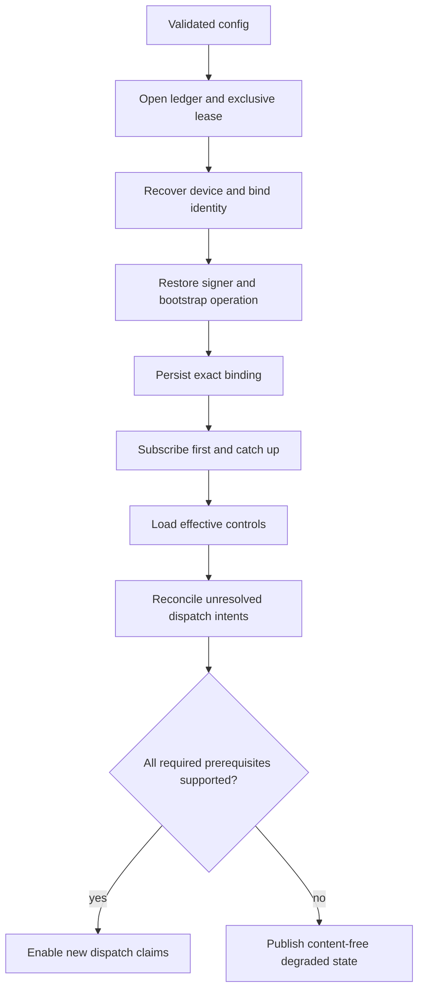
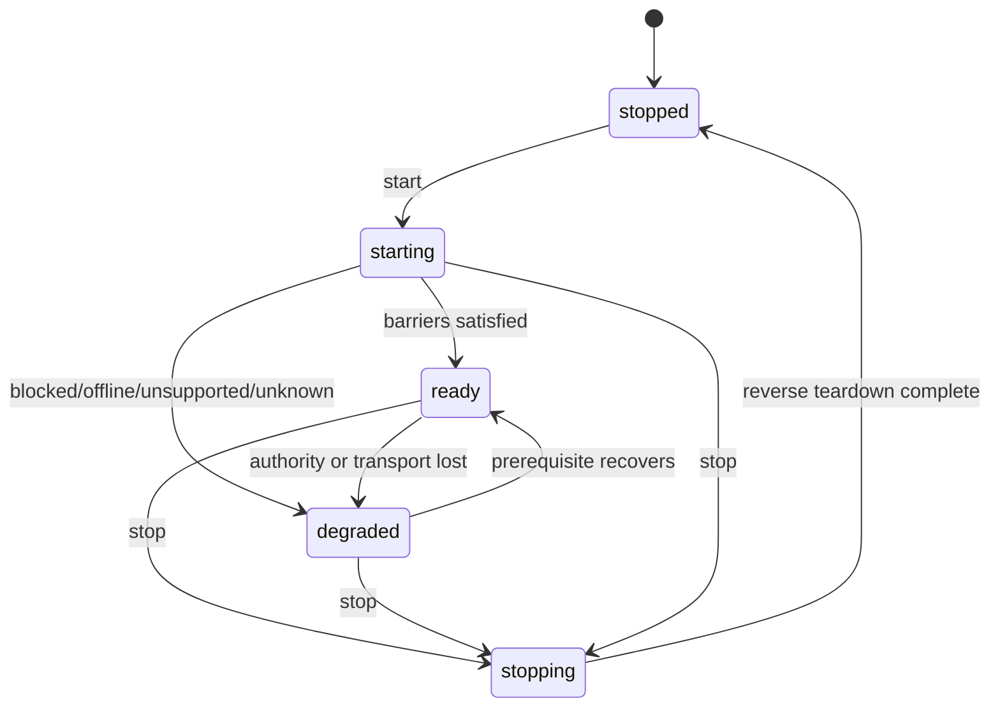

# KHA-133 Wire the existing-session connector runtime - Plan

## Goal Capsule

Compose the shipped bootstrap, durable storage, subscription, dispatch, and harness contracts behind one owner-controlled runtime. The runtime must preserve one device and binding across restart, keep pending plaintext outside the harness, reconcile ambiguous dispatch without resubmission, and report unsupported production delivery honestly. KHA-153 later replaces this ticket's single fail-closed Claude binding with capability-driven native/fallback selection.

Authority follows the current product decisions and the KHA-153 amendment, then this plan, then implementation-time evidence. A missing substrate/device port or unsupported harness is a truthful degraded state, not permission to add a production fake.

---

## Product Contract

### Summary

Provide the durable base connector runtime that later delivery capabilities plug into, while preserving owner review and exact session identity across crash, reconnect, revocation, and ambiguous model receipts.

### Problem Frame

A transport receipt cannot establish model consumption, and replay cannot establish exactly-once agent execution. Bootstrap progress and the connector signing identity must survive a crash without silently minting a new device. The merged Claude adapter deliberately proves no supported native delivery route, so this ticket must separate a harness-neutral composition proof from the production Claude configuration's fail-closed result.

### Requirements

- R1. Open one owner/device state handle under an exclusive lock and enforce explicit, idempotent startup and reverse-order shutdown.
- R2. Persist bootstrap operations and one Ed25519 signer on the connector ledger, bind the recovered device identity before any state-counting write, and resume the same operation and device after restart. Before admission, resume toward one binding; after admission, preserve the existing binding.
- R3. Catch up durable subscription state before enabling dispatch; persist dispatch intent, policy, approval lookup, counters, and evidence so restart reconciles but never blindly resubmits.
- R4. Only exact released bytes may reach a harness. Pending plaintext, owner authority, policy controls, workdir, secrets, and the test approval fixture never cross the harness or hosted agent-handler boundary.
- R5. Publish content-free prerequisite states for storage, bootstrap, subscription, controls, harness, dispatch, review, and recovery. Unsupported, offline, blocked, and unknown are distinct from ready.

### Actors and Flow

- A1. Owning human, who alone authorizes review, release, policy, revocation, and abandonment of unknown delivery.
- A2. Trusted owner connector, which holds pending plaintext and the durable ledger.
- A3. Exact agent session named by the bootstrap claim and verified by a harness adapter.
- A4. Ciphertext transport/control service, which never substitutes for local dispatch evidence.

- F1. Start opens storage and the device/SDK under one runtime owner, binds the recovered device identity, restores the signer and bootstrap operation, verifies the exact session, catches up subscription state, loads effective controls, reconciles unresolved dispatch intents, and only then enables eligible claims.
- F2. Stop prevents new claims, cancels subscription/reconnect work, preserves or settles in-flight evidence, stops feature observers, closes the harness/SDK, closes storage last, and remains safe when repeated.

### Acceptance Examples

- AE1. A pre-admission crash reopens the same signer/device and resumes the operation toward one binding. An admitted-or-later crash preserves that binding, reconciles ambiguous delivery, and performs no duplicate model submission. Covers R1-R3.
- AE2. Storage, crypto, replay, authority, controls, or harness readiness failure blocks the dependent stage and identifies the exact content-free prerequisite. Covers R1, R3, and R5.
- AE3. An instrumented harness receives only digest-matching released bytes, while the real Claude adapter reports unsupported and makes no route/model call. Covers R4 and R5.

### Key Decisions

- KD1. Existing-session identity remains a base-runtime invariant, but P15 supersedes it as the final delivery mechanism. KHA-133 preserves the exact claim/binding and ships one fail-closed Claude seam; KHA-153 owns native CLI/fallback selection, persisted route choice, install flow, and presence. (session-settled: user-directed — chosen over replacement agents: preserve context without claiming an unsupported route)
- KD2. Connector-gated review remains the trust boundary. Only released projection enters the harness; pending plaintext may stay in the trusted connector. (session-settled: user-directed — chosen over separate review encryption groups: keep review owner-controlled)
- KD3. Bootstrap operations, the signer key, binding, approvals/releases, dispatch intent/evidence, counters, cursors, and revocations share the owner-local connector ledger. SDK crypto storage remains separate and no cross-store atomicity is claimed.
- KD4. Revocation is terminal per `bindingId`; a later generation never re-arms it, and re-bootstrap must mint a new binding ID. (session-settled: user-directed — chosen over generation-only revocation: match the reviewed storage/bootstrap contract)
- KD5. Runtime orchestration is injection-only under `apps/connector/src/runtime/`; cross-package production imports remain in composition roots. Explicit typed factories expose missing ports and cannot silently substitute fixtures.

### Scope Boundaries

In scope:

- `packages/connector/src/storage/` for the KHA-133-owned persistence gaps explicitly handed off by KHA-114, KHA-115, and KHA-121.
- `apps/connector/src/runtime/`, the finite connector capability registry/placeholders, `apps/control/src/composition/agent/`, and focused connector integration tests.

Out of scope:

- Capability-driven adapter selection, fallback skill/CLI delivery, route-choice persistence, outbound `khala send`, installation, and presence; KHA-148/KHA-153 own those.
- Production credentials, provider deployment, root dependency versions, or a general plugin framework.
- Human review/control/recovery implementations; KHA-134/135/136 replace the typed unavailable placeholders.
- Claims that a fake harness or injected transport proves Claude support, exact-once model execution, or isolation from an unrestricted same-user process.

### Product Contract Preservation

Changed KD1, R2-R5, and AE1/AE3 to incorporate the settled P15/KHA-153 amendment plus the executor's bootstrap-persistence and revocation decisions. The owner-controlled review boundary and exact-session identity constraints are unchanged.

---

## Planning Contract

### Key Technical Decisions

- KTD1. Add a schema migration for bootstrap-operation CAS rows, the PKCS8 Ed25519 private key, approval command inputs, effective dispatch policy, dispatch records, and causal counters. Bootstrap-only rows and the signer do not by themselves make an unbound ledger adoptable; normal bindings/cursors/releases/dispatch state do.
- KTD2. The runtime device factory durably recovers or creates exactly one SDK device and its fingerprint before returning. `bindDeviceIdentity` succeeds before signer/bootstrap writes; a crash before ledger binding must recover the same SDK identity rather than minting a second device, and every later restart must match it.
- KTD3. The runtime owns the only storage/device lease. Subscription receives an adapter to that already-held lease rather than opening a second store or SDK instance.
- KTD4. Startup may prove the harness-neutral seam with injected contract-valid ports, but production Claude readiness stays degraded because `createClaudeHarness` reports unsupported and performs no native route call.
- KTD5. Runtime status is a finite snapshot and contains no content, token, path, workdir, transport secret, SQLite detail, or pending identifier.
- KTD6. Hosted agent registration is side-effect-free. Until live dependencies exist it exposes only an explicit 503 status route under `/api/agent/*`; it never publishes the test approval fixture or ledger access.

### High-Level Technical Design

The app runtime owns these stable contracts; composition roots adapt package implementations to them so `apps/connector/src/runtime/` does not import across component boundaries:

```ts
type PrerequisiteState =
  | "ready"
  | "blocked"
  | "offline"
  | "unsupported"
  | "unknown";

interface RuntimeStatus {
  binding: SessionBinding | null;
  phase: "starting" | "ready" | "degraded" | "stopping" | "stopped";
  prerequisites: Readonly<Record<RuntimePrerequisite, PrerequisiteState>>;
  effectivePolicyVersion: number | null;
  errorCode: string | null;
}

interface ConnectorRuntime {
  start(): Promise<void>;
  status(): RuntimeStatus;
  stop(): Promise<void>;
}

interface ConnectorRuntimeConfig {
  requiredCapabilities: readonly ConnectorCapabilityId[];
}

interface ConnectorRuntimeFactories {
  openStorage(): Promise<RuntimeStoragePort>;
  openDevice(storage: RuntimeStoragePort): Promise<RuntimeDevicePort>;
  bootstrap(context: BootstrapContext): Promise<BootstrapResult>;
  openSubscription(context: BoundRuntimeContext): Promise<RuntimeSubscriptionPort>;
  loadControls(context: BoundRuntimeContext): Promise<EffectiveControls>;
  openDispatcher(context: DispatchContext): Promise<RuntimeDispatcherPort>;
  inspectHarness(binding: SessionBinding): Promise<HarnessCapability>;
  registerCapabilities(context: ConnectorCapabilityContext): readonly ConnectorCapability[];
}
```

Each factory result is an explicitly closeable stage handle and carries only the data required by the next stage. Operational prerequisite failures resolve `start()` into `degraded` with the exact prerequisite state; invalid configuration, malformed factory results, identity/binding invariants, and teardown failures reject after best-effort reverse cleanup. Concurrent lifecycle calls share one in-flight transition.

`RuntimeSubscriptionPort` is the sole reconnect scheduler and publishes transport/replay/authority changes into one serialized runtime reevaluator. Capability handles publish readiness changes through the same reevaluator. It immediately closes dispatch eligibility when controls, authority, transport, harness support, or a required capability is lost, and re-runs only the idempotent control-load, reconciliation, and eligibility barriers after recovery; it never repeats bootstrap or submission implicitly.

```ts
type ConnectorCapabilityId = "review" | "controls" | "recovery";

interface ConnectorCapability {
  readonly id: ConnectorCapabilityId;
  readonly state: "unavailable" | "ready";
  start(): Promise<void>;
  stop(): Promise<void>;
}

interface ConnectorCapabilityContext {
  readonly binding: SessionBinding;
  readonly ledger: RuntimeLedgerPort;
  readonly dispatcher: RuntimeDispatcherPort;
  readonly clock: () => number;
  readonly protectedDependencies: Readonly<Partial<
    Record<ConnectorCapabilityId, unknown>
  >>;
  prerequisiteChanged(id: ConnectorCapabilityId): void;
}
```

`registerReview`, `registerControls`, and `registerRecovery` each accept `ConnectorCapabilityContext` and return exactly one matching handle. Controls is required for global dispatch readiness in this base runtime. Unavailable review or recovery blocks only that feature's readiness until its owning ticket replaces the placeholder; feature stop closes only its own observers.





### Assumptions and Deferred Evidence

- The runtime can be implemented and tested while the production substrate/device factory remains unavailable; that absence must keep production readiness degraded.
- Genuine disposable Matrix/session proof belongs in `tests/integration/connector/` and requires the existing explicit live opt-in. Local crash/fault tests stay adjacent to the implementation and use real disk plus injected external ports.
- KHA-153 owns package/dependency wiring for its selected native routes. This ticket does not edit the root manifest or lockfile to make an unsupported production path appear complete.

---

## Implementation Units

### U1. Persist bootstrap identity and approval inputs

- **Goal:** Close the storage handoffs required to resume bootstrap and re-verify released jobs.
- **Requirements:** R2, R3, KD3, KD4, KTD1, KTD2; covers AE1.
- **Dependencies:** None.
- **Files:** `packages/connector/src/storage/schema.ts`, `packages/connector/src/storage/ledger.ts`, `packages/connector/src/storage/bootstrap.ts`, `packages/connector/src/storage/bootstrap.test.ts`, `packages/connector/src/storage/open.test.ts`, `packages/connector/src/storage/README.md`.
- **Approach:** Migrate the ledger with strict bootstrap-operation CAS rows and one persisted PKCS8 Ed25519 key. Decode every stored operation/key on read. Store the exact `ApprovalCommand` alongside its command journal entry so dispatch can re-verify after restart. Keep terminal revocation semantics unchanged.
- **Execution note:** Start with failing real-disk restart, CAS conflict, key-stability, schema-migration, and identity-order tests.
- **Patterns to follow:** `packages/connector/src/storage/open.ts`, `ledger.ts`, and `schema.ts`; `packages/connector/src/bootstrap/orchestrator.test.ts` operation-store semantics.
- **Test scenarios:**
  1. A create/open cycle generates one Ed25519 key; reopening returns the same public thumbprint and corrupt/non-Ed25519 bytes fail closed without leaking bytes.
  2. Operation create/update uses per-row revisions, refuses stale CAS, rejects a changed fingerprint, and survives reopen at each bootstrap phase.
  3. A crash after the reserved operation persists reopens and binds the same device without `identity_unbound`.
  4. A crash after durable SDK identity creation but before `bindDeviceIdentity` recovers the same fingerprint and creates no second device.
  5. A v1 ledger migrates without losing pending/release state; a newer schema remains unsupported.
  6. A stored approval command round-trips and a missing legacy command returns unavailable to dispatch rather than fabricating approval.
- **Verification:** Connector storage tests prove durable restart and all current storage invariants still pass.

### U2. Implement the durable dispatch ledger adapter

- **Goal:** Supply the production `DispatchLedger`, effective-policy write seam, approval lookup, bounded payload reader, and recovery enumeration KHA-121 handed to composition.
- **Requirements:** R3-R5, KTD1, KTD3; covers AE1 and AE2.
- **Dependencies:** U1.
- **Files:** `packages/connector/src/storage/schema.ts`, `packages/connector/src/storage/dispatch.ts`, `packages/connector/src/storage/dispatch.test.ts`, `packages/connector/src/storage/README.md`.
- **Approach:** Map dispatch policies, binding/revocation state, records, sequence allocation, release uniqueness, active/queued selection, and causal counters onto one synchronous SQLite transaction. Expose an effective-policy update method only to the trusted controls composition after contract authentication; the storage boundary transactionally enforces the exact binding/generation, terminal revocation, and monotonically increasing version, accepting only an exact duplicate as idempotent. Enumerate dispatching/unknown records for startup reconciliation.
- **Execution note:** Prove rollback, restart, and no-resubmit behavior before wiring the runtime.
- **Patterns to follow:** `packages/connector/src/dispatch/types.ts`, `claim.ts`, `reconcile.ts`, and the test-only memory ledger as behavioral reference only.
- **Test scenarios:**
  1. Every `DispatchTx` read/write survives reopen, preserves queue order, and rolls back the whole transaction on throw or async callback.
  2. Revoked bindings report revoked at every generation; a new binding ID is independent.
  3. Duplicate release/approval and causal counters remain bounded and durable under restart.
  4. Dispatching and outcome-unknown records are enumerated for reconciliation, while completed/rejected records are not resubmitted.
  5. Payload reads enforce the caller's byte bound and approval lookup returns only decoded durable commands.
  6. Forged/unverified provenance never reaches the storage seam; binding mismatch, stale/conflicting version, and revocation fail closed, while an exact authenticated replay is idempotent.
- **Verification:** The real adapter passes the KHA-121 behavioral scenarios without importing fixture code.

### U3. Compose the single-owner runtime lifecycle

- **Goal:** Provide side-effect-free creation plus single-flight start, truthful status, recovery barriers, and deterministic teardown.
- **Requirements:** R1-R5, F1, F2, KTD2-KTD5; covers AE1-AE3.
- **Dependencies:** U1, U2.
- **Files:** `apps/connector/src/runtime/create.ts`, `apps/connector/src/runtime/status.ts`, `apps/connector/src/runtime/capabilities.ts`, `apps/connector/src/runtime/create.test.ts`.
- **Approach:** `createConnectorRuntime(config, factories)` validates the stable contracts above without starting I/O. `start()` performs the ordered barriers and records exact prerequisite outcomes. It persists the exact binding, starts catch-up, creates dispatch, reconciles durable ambiguous intents, and permits new claims only when controls and harness capability are supported. Subscription and capability events feed the serialized reevaluator so readiness can move in either direction without repeating bootstrap or submission. Repeated/concurrent starts and stops coalesce.
- **Execution note:** Add lifecycle tests before implementation; use recording factories to assert ordering, then one real-storage composition path.
- **Patterns to follow:** generation/single-flight lifecycle in `packages/messaging/src/browser-device/service.ts`; subscription and dispatcher stop contracts.
- **Test scenarios:**
  1. Module import/create performs no network, storage, SDK, bootstrap, or model work; two concurrent starts open one owner/device instance and one subscription.
  2. Storage lock failure, invalid identity, bootstrap block, replay gap, lost authority, missing controls, unsupported harness, and unknown outcome each produce the exact content-free prerequisite state.
  3. Startup reconciles every durable dispatching/unknown intent before enabling claims and never calls submit for reconciliation-only records.
  4. The exact bootstrap binding/session/generation flows to subscription and dispatch; no replacement session is created.
  5. Stop during partial start/catch-up/dispatch prevents new claims and closes capabilities, dispatcher, subscription, harness/SDK, and storage in reverse order; repeated stop is safe.
  6. Real Claude inspection leaves the runtime degraded as unsupported and invokes neither notify nor route submission.
- **Verification:** Connector-app tests prove ordering/status, then the real storage/bootstrap/dispatch integration proves persistence boundaries.

### U4. Install finite capability and hosted registration seams

- **Goal:** Let KHA-134/135/136 replace typed unavailable modules without later central-list edits and reserve the hosted agent domain honestly.
- **Requirements:** R4, R5, KD2, KTD6; covers AE2 and AE3.
- **Dependencies:** U3.
- **Files:** `apps/connector/src/runtime/registry.ts`, `apps/connector/src/composition/review/register.ts`, `apps/connector/src/composition/controls/register.ts`, `apps/connector/src/composition/recovery/register.ts`, `apps/control/src/composition/agent/handlers.ts`, `apps/control/src/composition/agent/handlers.test.ts`.
- **Approach:** Implement the exact capability/context signatures above and register exactly review, controls, and recovery. Placeholder start/stop are no-op and remain unavailable. Controls gates global dispatch readiness; unavailable review/recovery gate only their feature state. `registerAgentHandlers()` returns validated `/api/agent/*` registrations with no import-time work and a content-free 503 until live dependencies are composed.
- **Test scenarios:**
  1. The finite registry rejects duplicate/missing/malformed capability IDs and never reports an unavailable placeholder as ready.
  2. Feature stop closes only its own observers, not the shared SDK or ledger.
  3. Hosted registration is import-safe, restricted to `/api/agent/*`, and returns sanitized 503 without exposing pending content or test fixtures.
  4. Route discovery treats the producer as present and fails the build on malformed registrations.
- **Verification:** Connector/control typecheck and focused tests pass without future feature implementations.

### U5. Prove restart and release-boundary composition

- **Goal:** Exercise the durable base seam end to end without misrepresenting injected ports as production support.
- **Requirements:** R1-R5, AE1-AE3.
- **Dependencies:** U1-U4.
- **Files:** `apps/connector/src/runtime/composition.test.ts`; genuine live follow-up evidence, when available, belongs in `tests/integration/connector/`.
- **Approach:** Use real on-disk storage, bootstrap orchestration, subscription state machine, dispatcher, and an instrumented contract-valid harness. Seed an authenticated test-only approval/release through the real ledger API. Run separate positive seam and real-Claude negative cases.
- **Test scenarios:**
  1. Pending and released sentinel text coexist; the instrumented harness receives only the exact released bytes and no status/error/log contains either plaintext.
  2. Kill/reopen after native acceptance but before receipt persistence leaves one durable intent; reconciliation records evidence or unknown and submission count stays one.
  3. A pre-admission restart preserves key, operation, device, and lock ownership and resumes toward one binding; an admitted-or-later restart preserves the existing binding.
  4. Terminal revocation blocks the old binding ID; a simulated re-bootstrap succeeds only with a new ID.
  5. Real Claude composition stays degraded and makes zero model/route calls.
- **Verification:** The deterministic local integration passes with real disk; no live-send claim is made without explicit disposable-environment evidence.

---

## Verification Contract

| Gate | Scope | Done signal |
|---|---|---|
| `pnpm --filter @khala/connector test` | U1-U2 | Storage, bootstrap persistence, dispatch adapter, crash/restart, and existing connector tests pass. |
| `pnpm --filter @khala/connector-app test` | U3-U5 | Lifecycle, status, registry, teardown, and composition tests pass. |
| `pnpm --filter @khala/control test` | U4 | Hosted registration and route discovery tests pass. |
| `pnpm typecheck` | All | All workspace and harness types compile without production fixture imports. |
| `pnpm lint` | All | ESLint and import-boundary checks pass. |
| `pnpm test` | All | Full CI suite passes; live integration remains separately opt-in. |

No `KHALA_E2E_LIVE` run is required to claim the deterministic base seam. Any future live send must use a designated disposable environment/session and is support evidence only for the exact tested route/version.

---

## Definition of Done

- Bootstrap operation state and the Ed25519 signer survive restart on the owner-only ledger with correct CAS and identity ordering.
- The real durable dispatch adapter provides policy, binding/revocation, approval, payload, queue, intent, receipt, and causal-count semantics required by KHA-121.
- One runtime owns storage/device lifecycle, starts prerequisites in order, reconciles before claims, and tears down deterministically and idempotently.
- Status remains content-free and never reports ready when storage, binding, catch-up, controls, or harness support is blocked, offline, unsupported, or unknown.
- Only released, digest-verified bytes reach the harness; pending plaintext and owner-only controls never cross the model or hosted handler boundary.
- The shipped Claude adapter is proven fail-closed with zero route/model calls; KHA-153 remains the owner of supported native/fallback delivery and presence.
- Revocation remains terminal per binding ID, and restart/ambiguous receipt paths never duplicate model submission.
