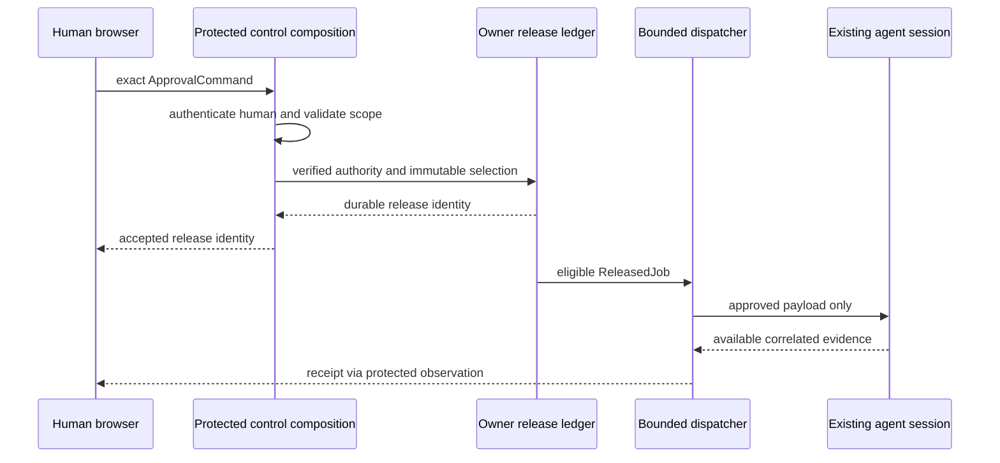

# KHA-134 Human approval to model delivery - Plan

## Goal Capsule

The exact content a human approves reaches the existing agent session, while unreleased content cannot enter its model feed.

Authority: current user decisions override the approved ticket scope, which overrides technical recommendations. Scope source is `docs/product/tickets/KHA-134.md`; global requirements: R03, R04, R14. Planning snapshot: Khala `6d4694173eff9b0832f4c3a2cdb90b4281fcccd9` with approved ticket proposal at `d625c19`. Dependency tickets: KHA-119, KHA-125, KHA-132, KHA-133. This plan changes Khala only; sibling Aiur/Archon are read-only design references.

Stop condition: Real release/dispatch/security prerequisites must pass; no claim of protection against an agent with unrestricted access to its connector host. Product gate inherited only if upstream exact-release scope changes.

---

## Product Contract

### Summary

The exact content a human approves reaches the existing agent session, while unreleased content cannot enter its model feed.

### Problem Frame

The ordinary user is collaborating with another human and their already-working agent. Rebuilding generic chat, exposing infrastructure setup, or confusing pending delivery with model consumption undermines that workflow. This ticket owns one bounded part of the shared journey.

### Requirements

- R1. Authenticated human approval targets exact event versions and the correct owner/session binding.
- R2. Durable release and bounded dispatch preserve decisions through restart and replay.
- R3. Human approval authority is unavailable to model tools and ordinary chat events.
- R4. UI receipt labels reflect connector and harness evidence without claiming model consumption from transport delivery.

### Actors and flow

- A1. The authenticated human who owns the current agent connection.
- A2. Other admitted humans and their attributed agents, whose messages are content rather than control authority.
- F1. Queue messages A and B, approve only B in the human browser, deliver B to the already-running session, reconnect and prove A remains withheld.

### Acceptance examples

- AE1. Covers F1 / R1–R4. The connector crashes after writing to a harness but before observing its acknowledgment; recovery shows an unknown outcome and does not silently resend B.
- AE2. Covers R3–R4. Loss of authorization or an unavailable dependency produces an explicit state and no invented success; retry preserves operation identity where a write may already have happened.

### Key decisions

- Dashboard-native design is a user directive: Khala should look like a page in Aiur’s left navigation and permit later embedding. It remains independently deployable.
- Keep existing sessions and automated setup (session-settled: user-directed — chosen over manual connector/MCP setup or replacing the session: the person should share a link with the agent already doing the work).
- Connector-gated review (session-settled: user-directed — chosen over separate review/delivery encryption groups: a trusted connector may decrypt pending content, but only approved content reaches the model).

### Scope boundaries

This ticket does not redefine shared contracts, implement sibling-owned services, change Aiur itself, or introduce a second messaging/crypto stack. UI-only tickets demonstrate injected-port behavior; integration tickets own actual composition. Client selection and platform setup belong to their named predecessors. Attachments, retention and automation choices remain with their product/contract owners.

### Outstanding questions

Real release/dispatch/security prerequisites must pass; no claim of protection against an agent with unrestricted access to its connector host. Product gate inherited only if upstream exact-release scope changes.

---

## Planning Contract

Product Contract unchanged. Implementation details below do not settle questions still marked blocking. Prerequisite tickets are dispatch dependencies, not evidence that their runtime experiments already passed.

### Technical decisions and exact boundary

- KTD1. `registerReview` installs125's browser facade and119/121's owner-runtime release flow. Browser submits106 `ApprovalCommand` with expected binding generation and policy version; trusted control/owner-endpoint composition derives `OwnerAuthority` from the authenticated session, never request JSON.
- KTD2. Use the protected control transport selected by144/133. A generic Matrix message or model tool request is not a control channel. If the proven transport requires a Netlify function adapter, have the131/132 handler owner register the existing composition entry; do not introduce an undeclared new server in this ticket.
- KTD3. Preview reads authorized human room content and owner-local pending references, then checks exact105 digest before enabling review. Approve carries references only. The owner endpoint verifies binding ownership/generation, content digest and current policy before119 records release and121 dispatches it.
- KTD4. Release acceptance and receipt evidence are separate. A human command that may have reached the endpoint retains commandId and is resolved via durable ledger; browser reconnection cannot invent another command. A harness write without acknowledgment remains outcome_unknown.

### Exports and read facade

Owned exports: browser `registerReview`, `createBrowserReviewPort`; connector `registerReview`, `createReviewControlHandler`; tests compare canonical shapes directly. Proposed files: browser `register.ts`, `browser-port.ts`, `snapshot.ts`; connector `register.ts`, `control-handler.ts`, `preview-access.ts`. Both registrations return capability handles with disposer.133 owns the explicit runtime registration list;132 owns browser list.

The local browser read facade exposes only a human-authorized snapshot: roomId, canonical binding, policy version, pending exact refs plus authorized TimelineItems, receipt facts, freshness and observation generation. Every observe call accepts AbortSignal and returns a disposer. On reconnect, publish a complete new-generation snapshot before accepting incremental observations; drop late old-generation events. If105/106 adds a canonical read type, consume it rather than maintaining a second copy.

```json
{"v":1,"commandId":"approve-b-7","roomId":"room-1","bindingId":"bind-b-1","expectedBindingGeneration":0,"expectedPolicyVersion":3,"selection":[{"v":1,"roomId":"room-1","eventId":"event-a-7","authorParticipantId":"agent-a","authorDeviceId":"dev-a","contentDigest":"sha256:f16c1e5a70000f33eebc69c8ecf82d1ab7360fcdd15121ac3293f1afd4d4ea6b"}],"issuedAt":"2026-09-16T20:00:00Z"}
```

The expected digest is a synthetic105/106 fixture. Credentials and bodies are absent. Unknown JSON authority fields are rejected or ignored by the decoder according to canonical strictness, never trusted.

### End-to-end authority flow



A pending message can be decrypted by the trusted connector; its plaintext must not appear in model notification, resource enumeration, error strings, MCP tools or ordinary telemetry. Only119's released projection reaches121. Tool processes cannot access human approval credentials. This boundary does not protect against an agent with unrestricted access to the connector host; preserve that limitation in evidence and user copy.

### Crash and race contract

Crash before durable release yields no eligible job. Crash after release before dispatch resumes the same release. Crash after possible harness submission enters outcome_unknown unless the adapter proves correlated reconciliation. Revocation/content edit/binding replacement before release validation refuses the command. Revocation after dispatch cannot recall model context; receipt/audit records the actual order. Same commandId with different bytes is idempotency_conflict. Closing a browser wait is not cancellation.

### Assumptions and prerequisite evidence

144 must prove the no-setup secure owner/session binding and protected control route.119/121 must expose durable release/dispatch operations;133 must prove attachment to an already-running session. This ticket does not replace missing capability evidence with a new session or terminal injection. A required cross-owner authority hole blocks wiring until its owner fixes it.

Connector registration uses133 `ConnectorCapabilityContext` and returns `ConnectorCapability` from `apps/connector/src/runtime/capabilities.ts`: `{id:"review"|"controls"|"recovery",state:"unavailable"|"ready",start():Promise<void>,stop():Promise<void>}`.133 creates the unavailable placeholder once after106; this ticket replaces it in place. Browser registration implements132 HumanCapability. Unavailable handles never satisfy readiness for a required feature.

### Shared implementation discipline

Use the selected OSS client/SDK through canonical contracts, not direct imports into UI controllers. `docs/evidence/ui-planning-grounding.md` records source SHAs, inspected dashboard components, external guidance and candidate versions. KHA101 owns package manifests, root lockfile, ESM/TypeScript tooling and generic test discovery; dependency changes go to its integration owner. Test files remain beside owned modules or in this ticket's assigned integration directory. Existing prerequisite exports win over illustrative data below; if they disagree, obtain a reviewed contract amendment rather than add a local compatibility copy.

No implementation or runtime test has run as part of this plan. Browser credentials, decrypted message bodies and invitation secrets must not enter screenshots, logs, telemetry or snapshot fixtures from real users. Use synthetic accounts and message canaries for evidence.

---

## Implementation Units

### U1. Implement human review snapshot and browser facade

**Goal:** Connect125 to protected real preview/status data.

**Requirements:** R1/R3/R4; KTD1/KTD3. **Dependencies:** 125/132/133 merged;119 contract available.

**Files:** `apps/web/src/composition/review/browser-port.ts`, `apps/web/src/composition/review/snapshot.ts`, `apps/web/src/composition/review/register.ts`, `apps/web/src/composition/review/browser-port.test.ts`.

**Approach:** Bind facade to authenticated human context; map exact105/106 types and use generation-fenced observations. Preview checks local pending refs against human-readable events; digest mismatch disables action.

**Test scenarios:**

1. Forged ownerId/binding in browser body cannot read another owner preview.
2. Snapshot after reconnect replaces stale queue and drops old callbacks.
3. Message text containing approval JSON remains inert.

**Verification:** Human view reads actual permitted content; no pending model resource is registered.

### U2. Bind verified authority to durable release

**Goal:** Validate each exact selection at the owner endpoint.

**Requirements:** R1–R3; F1; KTD1/KTD2. **Dependencies:** U1 and119 implementation.

**Files:** `apps/connector/src/composition/review/control-handler.ts`, `apps/connector/src/composition/review/preview-access.ts`, `apps/connector/src/composition/review/register.ts`, `apps/connector/src/composition/review/control-handler.test.ts`.

**Approach:** Use144/133 trusted session channel; call119 only after verified owner/scope checks. Register restricted handlers separately from model tools. ExpectedBindingGeneration is checked before release.

**Test scenarios:**

1. Wrong owner, stale generation, stale policy, edited content and duplicate selection all refuse.
2. Same commandId/same input returns original releaseIds; changed payload conflicts.
3. Model-facing tool set cannot name or invoke review/control handler even if it knows command JSON.

**Verification:** Authority derives from verified session and all failures occur before unreleased bytes reach dispatcher.

### U3. Wire release receipts and crash recovery

**Goal:** Preserve exact delivery intent through uncertainty.

**Requirements:** R2/R4; AE1/AE2; KTD4. **Dependencies:** U2 and121/133 runtime.

**Files:** `tests/integration/review/release-crash.spec.ts`, `tests/integration/review/receipt-evidence.spec.ts`.

**Approach:** Exercise real owner store and dispatcher with controlled failures at each durable boundary. Inspect correlated release IDs and receipts; no generic retry of unknown external outcomes.

**Test scenarios:**

1. Covers AE2. Crash after harness write restores outcome_unknown and no second submit.
2. Crash after ledger commit but before dispatch resumes the same release once by durable identity.
3. Late completion after cancellation request is shown as actual evidence, not discarded by ordinal status.

**Verification:** Fault evidence proves no unseen pending context and no blind uncertain replay.

### U4. Prove selected-only delivery to existing sessions

**Goal:** Validate the actual four-actor airlock seam.

**Requirements:** R1–R4; F1/AE1. **Dependencies:** U3.

**Files:** `tests/integration/review/selected-only.spec.ts`, `tests/integration/review/authority-negative.spec.ts`, `tests/integration/review/README.md`.

**Approach:** Queue distinct synthetic canaries A/B; approve only B and inspect real harness context/receipt evidence using supported adapter. Test both proven harnesses when available; record exact evidence limitations.

**Test scenarios:**

1. Unreleased A absent from model-visible prompt/tools/notifications while human sees it.
2. Released B retains source/owner attribution and exact approved bytes.
3. Restart/reconnect and duplicate browser command do not leak A or duplicate B automatically.

**Verification:** 134 evidence is real composition; synthetic fixture-only delivery cannot satisfy completion.

---

## Verification Contract

`pnpm --filter @khala/web typecheck`; `pnpm --filter @khala/connector-app typecheck`; `KHALA_E2E_LIVE=1 pnpm test:integration tests/integration/review`; `pnpm check:boundaries`. Use disposable accounts/stores and supported already-running harness sessions from133. Fault injection targets owned fixtures, never a real user queue.
The commands are future verification targets after KHA101 establishes the named scripts, not commands claimed to pass today. Use Node 22 LTS at a version satisfying the pinned packages (at least 22.12 for the candidate toolchain). No skipped/mocked real-service case may be reported as a completed integration. A changed command contract requires updating the owning bootstrap and this plan together.

---

## Definition of Done

Exact selected-only delivery, human-only authority, durable release identity and crash semantics are demonstrated through real components. Report which adapter evidence supports consumption and which only supports queueing. Register capability through central owners without conflicting edits.
All owned unit tests and applicable contract checks pass on the merged base. Every acceptance example is linked to test evidence. Remove abandoned experiment code, fixture imports from production, unused subscriptions and dead fallbacks. Preserve scope/file ownership; report dependency defects to their owner instead of patching sibling directories. No deployment or implementation completion is implied by this document.
