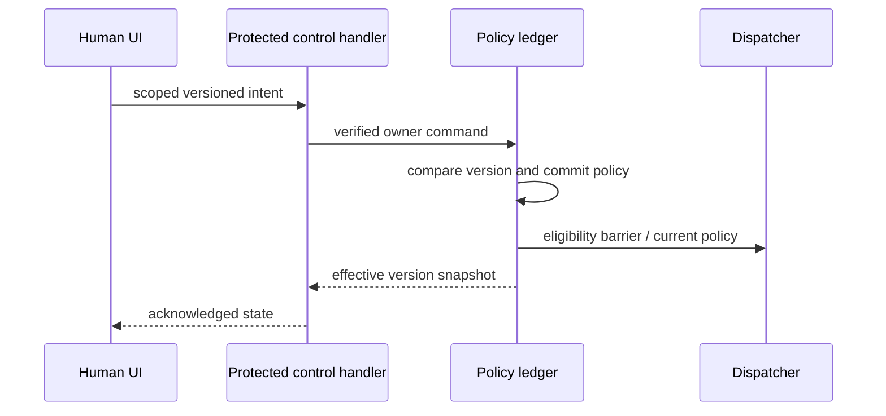

# KHA-135 Trust and controls composition - Plan

## Goal Capsule

Real policy acknowledgments, pause and bounded delivery agree between browser, connector and harness.

Authority: current user decisions override the approved ticket scope, which overrides technical recommendations. Scope source is `docs/product/tickets/KHA-135.md`; global requirements: R05, R14. Planning snapshot: Khala `6d4694173eff9b0832f4c3a2cdb90b4281fcccd9` with approved ticket proposal at `d625c19`. Dependency tickets: KHA-120, KHA-126, KHA-134. This plan changes Khala only; sibling Aiur/Archon are read-only design references.

Stop condition: P02/P08/G-AUTOMATION: do not implement unattended operation, peer-global trust, pause authority or budgets by guessing.

---

## Product Contract

### Summary

Real policy acknowledgments, pause and bounded delivery agree between browser, connector and harness.

### Problem Frame

The ordinary user is collaborating with another human and their already-working agent. Rebuilding generic chat, exposing infrastructure setup, or confusing pending delivery with model consumption undermines that workflow. This ticket owns one bounded part of the shared journey.

### Requirements

- R1. Policy transitions take effect at the connector’s defined serialization point.
- R2. Browser status reflects acknowledged effective policy rather than successful request submission.
- R3. Busy/offline/backlog and automatic conversation bounds follow the approved policy.
- R4. Rearming review prevents subsequent unauthorized model delivery without pretending to recall consumed content.

### Actors and flow

- A1. The authenticated human who owns the current agent connection.
- A2. Other admitted humans and their attributed agents, whose messages are content rather than control authority.
- F1. Switch to automatic delivery, receive messages, request review again and verify which exact events fall before and after the effective policy boundary.

### Acceptance examples

- AE1. Covers F1 / R1–R4. A permissive request is pending while a restrictive update arrives; actual connector order determines eligibility and stale browser state cannot overwrite it.
- AE2. Covers R3–R4. Loss of authorization or an unavailable dependency produces an explicit state and no invented success; retry preserves operation identity where a write may already have happened.

### Key decisions

- Dashboard-native design is a user directive: Khala should look like a page in Aiur’s left navigation and permit later embedding. It remains independently deployable.
- Keep existing sessions and automated setup (session-settled: user-directed — chosen over manual connector/MCP setup or replacing the session: the person should share a link with the agent already doing the work).
- Connector-gated review (session-settled: user-directed — chosen over separate review/delivery encryption groups: a trusted connector may decrypt pending content, but only approved content reaches the model).

### Scope boundaries

This ticket does not redefine shared contracts, implement sibling-owned services, change Aiur itself, or introduce a second messaging/crypto stack. UI-only tickets demonstrate injected-port behavior; integration tickets own actual composition. Client selection and platform setup belong to their named predecessors. Attachments, retention and automation choices remain with their product/contract owners.

### Outstanding questions

P02/P08/G-AUTOMATION: do not implement unattended operation, peer-global trust, pause authority or budgets by guessing.

---

## Planning Contract

Product Contract unchanged. Implementation details below do not settle questions still marked blocking. Prerequisite tickets are dispatch dependencies, not evidence that their runtime experiments already passed.

### Technical decisions and canonical boundary

- KTD1. `registerControls` binds126 to120's policy operations using106 `PolicySetCommand` and `PolicyAck`. Browser commands capture expectedBindingGeneration and expectedPolicyVersion; authenticated human authority is derived as in134.
- KTD2. The connector serializes trust, pause and dispatch eligibility at120/121's documented boundary. Successful control transport is only requested state; UI effective state requires a matching connector acknowledgment plus authoritative policy snapshot.
- KTD3. Freshness, connection status, model busy state and delivery outcome are separate signals. Keep receipt facts with their source/evidence and preserve outcome_unknown until correlated reconciliation.
- KTD4. The integration installs only approved controls. No cancellation endpoint is manufactured from a pause button, no peer-global trust inferred from a room command, and no ordinary channel message can change policy.

### Files, exports and example

Browser `register.ts`, `browser-port.ts`, `projection.ts` export `registerControls`, `createBrowserAgentControlsPort`. Connector `register.ts`, `control-handler.ts`, `status-observer.ts` export `registerControls`, `createPolicyControlHandler`. Capability handles dispose all subscriptions and carry current owner/binding generation.132/133 bootstrap the finite lists and unavailable registration placeholders once; this ticket replaces only its owned placeholders and never edits central entries.

```json
{"v":1,"commandId":"policy-b-4","roomId":"room-1","bindingId":"bind-b-1","expectedBindingGeneration":0,"peerParticipantId":"agent-a","expectedPolicyVersion":3,"mode":"review","paused":true,"issuedAt":"2026-09-16T20:00:00Z"}
```

An offline response with requestedVersion4/effectiveVersion3 is rendered pending, never effective. Reconnecting to generation1 cannot accept the generation0 command. The actual effective mode/paused values come from the canonical policy snapshot, not by echoing the last local form fields. `issuedAt` does not order concurrent commands or authorize them.

### Policy transition integration



For re-arm, record event/dispatch identities immediately before and after the serialization point. Work already accepted by a model cannot be recalled. Pending backlog treatment is the approved120 policy, not “automatically release everything on toggle.” For pause, retain exact semantics—delivery paused versus active model turn cancelled—based on actual adapter capability. If busy adapters queue, report harness_queued; if they reject/unknown, show that result without silently starting a new session.

### Product blockers and risks

P02/P08/G-AUTOMATION remain blocking until automation lifecycle, trust scope, pause authority and conversation bounds are decided. Browser-closed operation is not inferred from the mere existence of a connector. Control authority cannot be minted by a model-owned tool. Multiple browser tabs race through the same compare-version operation, not last-writer-wins UI state. A telemetry reconnect does not resolve external delivery uncertainty.

Canonical106 `PolicyAck` echoes commandId, bindingId and generation; requested/effective versions may be null when no authoritative revision was observed. Never coerce null to zero or treat mismatched acknowledgment as effective. Effective requires connector acknowledgment and null errorCode. Unknown command persistence is reconciled with the same identity. Candidate semantics pending G-AUTOMATION: policy change affects future events only; selected existing backlog uses a separate exact ApprovalCommand, never implicit release or a promise of atomic combined changes.

Connector registration uses133 `ConnectorCapabilityContext` and returns `ConnectorCapability` from `apps/connector/src/runtime/capabilities.ts`: `{id:"review"|"controls"|"recovery",state:"unavailable"|"ready",start():Promise<void>,stop():Promise<void>}`.133 creates the unavailable placeholder once after106; this ticket replaces it in place. Browser registration implements132 HumanCapability. Unavailable handles never satisfy readiness for a required feature.

### Shared implementation discipline

Use the selected OSS client/SDK through canonical contracts, not direct imports into UI controllers. `docs/evidence/ui-planning-grounding.md` records source SHAs, inspected dashboard components, external guidance and candidate versions. KHA101 owns package manifests, root lockfile, ESM/TypeScript tooling and generic test discovery; dependency changes go to its integration owner. Test files remain beside owned modules or in this ticket's assigned integration directory. Existing prerequisite exports win over illustrative data below; if they disagree, obtain a reviewed contract amendment rather than add a local compatibility copy.

No implementation or runtime test has run as part of this plan. Browser credentials, decrypted message bodies and invitation secrets must not enter screenshots, logs, telemetry or snapshot fixtures from real users. Use synthetic accounts and message canaries for evidence.

---

## Implementation Units

### U1. Bind scoped policy control and authoritative reads

**Goal:** Connect real policy operations to126 without optimistic effect claims.

**Requirements:** R1/R2; F1; KTD1/KTD2. **Dependencies:** Approved automation decisions,120/126/134 merged.

**Files:** `apps/web/src/composition/controls/register.ts`, `apps/web/src/composition/controls/browser-port.ts`, `apps/web/src/composition/controls/projection.ts`, `apps/connector/src/composition/controls/register.ts`, `apps/connector/src/composition/controls/control-handler.ts`, `apps/connector/src/composition/controls/status-observer.ts`, `apps/connector/src/composition/controls/control-handler.test.ts`.

**Approach:** Reuse134 authority route and canonical106 decoding. Capture binding/policy generation, expose read snapshot and observation lifecycle, and install capability handles through central owners.

**Test scenarios:**

1. Wrong owner or stale binding generation fails before policy mutation.
2. Offline response keeps old effective values and requested intent separate.
3. Model-facing registry exposes no control command or owner credential.

**Verification:** Real120 policy version and126 projection agree on every acknowledged state.

### U2. Prove transition races against dispatch

**Goal:** Verify re-arm/pause boundaries with actual ledger ordering.

**Requirements:** R1/R3/R4; AE1; KTD2. **Dependencies:** U1.

**Files:** `tests/integration/controls/policy-dispatch-race.spec.ts`, `tests/integration/controls/concurrent-controls.spec.ts`.

**Approach:** Use injected fault/barrier hooks in disposable runtime to race incoming event, automatic dispatch and restrictive control. Evidence names committed policy version and actual release IDs.

**Test scenarios:**

1. Auto request then restrictive update: only committed order determines later eligibility.
2. Two tabs use expected version3; one wins and one receives conflict without overwriting.
3. Event admitted after effective review version cannot dispatch without exact authorization.

**Verification:** No unauthorized post-barrier release; already-dispatched content is reported honestly.

### U3. Exercise busy/offline and loop bounds

**Goal:** Connect actual harness evidence to approved automation controls.

**Requirements:** R2/R3; F1/AE2; KTD3/KTD4. **Dependencies:** U2.

**Files:** `tests/integration/controls/offline-busy.spec.ts`, `tests/integration/controls/automation-bounds.spec.ts`.

**Approach:** Use supported harness capability record and approved budget policy. Close browser only when P02 permits that scenario; test operator endpoint availability separately. No invented prompt consumption receipt.

**Test scenarios:**

1. Queued busy session receives one approved job after readiness under same session ID.
2. Unknown submit outcome is not replayed because a new policy ack arrived.
3. Approved turn/budget bound stops further eligibility and produces visible reason without stopping unrelated agents.

**Verification:** Observed receipts and bounds match approved policy; unsupported cases marked blocked.

### U4. Verify user-visible control truth and registration

**Goal:** Prove the complete human control loop in the dashboard page.

**Requirements:** R1–R4; F1/AE1/AE2. **Dependencies:** U3.

**Files:** `tests/integration/controls/controls-ui.spec.ts`, `tests/integration/controls/README.md`, `apps/web/src/composition/controls/README.md`, `apps/connector/src/composition/controls/README.md`.

**Approach:** Drive real126 controls with synthetic accounts and compare DOM labels to durable connector evidence. Record actual ordering and redacted receipts.

**Test scenarios:**

1. Pending pause reads pending while endpoint offline, then effective after confirmed reconnect.
2. Rapid pane navigation/account switch disposes observers and prevents stale banners.
3. Phone control scope remains visible beside the action.

**Verification:** Integration evidence joins commandId, policy versions and UI state without plaintext logs.

---

## Verification Contract

After G-AUTOMATION closes: `pnpm --filter @khala/web typecheck`; `pnpm --filter @khala/connector-app typecheck`; `KHALA_E2E_LIVE=1 pnpm test:integration tests/integration/controls`; `pnpm check:boundaries`. Live race tests require disposable owner stores and already-running supported sessions; pure120 policy tests alone do not satisfy this ticket.
The commands are future verification targets after KHA101 establishes the named scripts, not commands claimed to pass today. Use Node 22 LTS at a version satisfying the pinned packages (at least 22.12 for the candidate toolchain). No skipped/mocked real-service case may be reported as a completed integration. A changed command contract requires updating the owning bootstrap and this plan together.

---

## Definition of Done

Real policy transitions and UI acknowledgments agree at the defined barrier; busy/offline/backlog/bounds are demonstrated under approved choices. No control implies cancellation or retrospective erasure. Parent records product decisions before promoting readiness.
All owned unit tests and applicable contract checks pass on the merged base. Every acceptance example is linked to test evidence. Remove abandoned experiment code, fixture imports from production, unused subscriptions and dead fallbacks. Preserve scope/file ownership; report dependency defects to their owner instead of patching sibling directories. No deployment or implementation completion is implied by this document.
