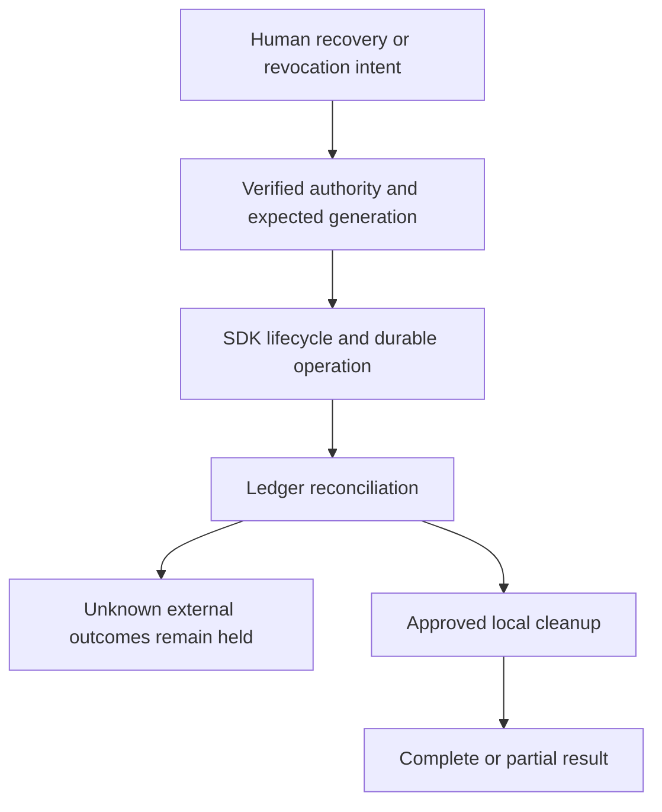

# KHA-136 Recovery and lifecycle composition - Plan

## Goal Capsule

Real SDK/storage operations recover or revoke access and apply approved cleanup without replaying uncertain external work.

Authority: current user decisions override the approved ticket scope, which overrides technical recommendations. Scope source is `docs/product/tickets/KHA-136.md`; global requirements: R14. Planning snapshot: Khala `6d4694173eff9b0832f4c3a2cdb90b4281fcccd9` with approved ticket proposal at `d625c19`. Dependency tickets: KHA-127, KHA-128, KHA-129, KHA-130, KHA-132, KHA-133. This plan changes Khala only; sibling Aiur/Archon are read-only design references.

Stop condition: P07/G-RETENTION and upstream KHA128–130 recovery/closure policy are blocking.

---

## Product Contract

### Summary

Real SDK/storage operations recover or revoke access and apply approved cleanup without replaying uncertain external work.

### Problem Frame

The ordinary user is collaborating with another human and their already-working agent. Rebuilding generic chat, exposing infrastructure setup, or confusing pending delivery with model consumption undermines that workflow. This ticket owns one bounded part of the shared journey.

### Requirements

- R1. Browser recovery state is driven by actual SDK device/key lifecycle and durable connector state.
- R2. Revocation stops future authorized delivery at the documented boundary.
- R3. Cleanup respects approved retention policy and never promises deletion from other participants or model providers.
- R4. Previously unknown external outcomes remain quarantined through restart, restore and replacement.

### Actors and flow

- A1. The authenticated human who owns the current agent connection.
- A2. Other admitted humans and their attributed agents, whose messages are content rather than control authority.
- F1. Replace a device, reconcile available keys and delivery ledger, remove a membership and close the chat according to approved policy.

### Acceptance examples

- AE1. Covers F1 / R1–R4. A backup contains an approved item with unknown harness outcome; restore keeps it unknown and ineligible for automatic redispatch.
- AE2. Covers R3–R4. Loss of authorization or an unavailable dependency produces an explicit state and no invented success; retry preserves operation identity where a write may already have happened.

### Key decisions

- Dashboard-native design is a user directive: Khala should look like a page in Aiur’s left navigation and permit later embedding. It remains independently deployable.
- Keep existing sessions and automated setup (session-settled: user-directed — chosen over manual connector/MCP setup or replacing the session: the person should share a link with the agent already doing the work).
- Connector-gated review (session-settled: user-directed — chosen over separate review/delivery encryption groups: a trusted connector may decrypt pending content, but only approved content reaches the model).

### Scope boundaries

This ticket does not redefine shared contracts, implement sibling-owned services, change Aiur itself, or introduce a second messaging/crypto stack. UI-only tickets demonstrate injected-port behavior; integration tickets own actual composition. Client selection and platform setup belong to their named predecessors. Attachments, retention and automation choices remain with their product/contract owners.

### Outstanding questions

P07/G-RETENTION and upstream KHA128–130 recovery/closure policy are blocking.

---

## Planning Contract

Product Contract unchanged. Implementation details below do not settle questions still marked blocking. Prerequisite tickets are dispatch dependencies, not evidence that their runtime experiments already passed.

### Technical decisions and lifecycle ownership

- KTD1. `registerRecovery` binds127 to128/129/130 without implementing new crypto/recovery primitives. Browser uses105 `RecoveryPort`/`RevocationPort`; owner runtime integrates approved cleanup and durable delivery reconciliation.
- KTD2. Recovery secrets remain inside SDK/local callback boundaries. Control services store only permitted status/operation metadata; browser/global app state and telemetry never receive a serializable key bundle.
- KTD3. Device and binding replacement increments generation, invalidates stale observers/commands, and preserves uncertain external job outcomes. A restored inbox is not permission to replay every accepted item.
- KTD4. Revocation/closure ordering follows the approved policy: revoke future authority, reconcile in-flight work, then perform permitted cleanup with a durable progress record. State partial failure explicitly; no UI label promises participant/model-provider erasure.

### Owned exports and integration map

Browser `register.ts`, `browser-port.ts`, `projection.ts` export `registerRecovery`, `createBrowserRecoveryPort`. Connector `register.ts`, `lifecycle.ts`, `reconcile.ts` export `registerRecovery`, `bindRecoveryLifecycle`. Each returns a disposer that closes only its observers, not the shared SDK client owned by111/133.132/133 bootstrap static lists and unavailable registration placeholders once; this ticket replaces only its owned placeholders.

Example observation is local presentation data, not another transport schema:

```json
{"operationId":"recover-b-2","deviceState":"ready","history":"partial","operation":"partial","unknownReleaseIds":["release-b-7"],"allowedActions":[]}
```

Actual protocol view shapes come from105/128–130. The `unknownReleaseIds` presentation is permissible only to the authenticated owner and contains no unreleased plaintext. Secret input is a local callback and cannot appear in this JSON. Closure cannot be wired until130 defines a typed approved command/capability; a missing port is an upstream defect, not an invitation to call storage deletion directly.

### Lifecycle sequence and crash points



Crash before confirmed revocation cannot show revoked success; inspect the operation. Crash after revocation before cleanup leaves delivery prohibited and cleanup resumable. A backup restored from before a completed external submission must not silently recreate eligibility; reconcile against durable evidence or retain outcome_unknown. If the recovery source cannot establish ordering, stop dispatch for affected release IDs and surface that limitation. Local device keys and session credentials are distinct from approval ledger facts and may have different recovery policies.

### Product blockers and operational limits

P07/G-RETENTION determines recoverable history, backup authority, closure/expiry and retention behavior. The selected SDK may not support a desired recovery mode;129 must prove it, not rely on a login success. This plan remains requirements-only while those product choices are unanswered. Browser privacy/cache cleanup scope and owner-runtime deletion scope must be documented separately. E2EE does not erase plaintext already processed by a model.

Connector registration uses133 `ConnectorCapabilityContext` and returns `ConnectorCapability` from `apps/connector/src/runtime/capabilities.ts`: `{id:"review"|"controls"|"recovery",state:"unavailable"|"ready",start():Promise<void>,stop():Promise<void>}`.133 creates the unavailable placeholder once after106; this ticket replaces it in place. Browser registration implements132 HumanCapability. Unavailable handles never satisfy readiness for a required feature.

### Shared implementation discipline

Use the selected OSS client/SDK through canonical contracts, not direct imports into UI controllers. `docs/evidence/ui-planning-grounding.md` records source SHAs, inspected dashboard components, external guidance and candidate versions. KHA101 owns package manifests, root lockfile, ESM/TypeScript tooling and generic test discovery; dependency changes go to its integration owner. Test files remain beside owned modules or in this ticket's assigned integration directory. Existing prerequisite exports win over illustrative data below; if they disagree, obtain a reviewed contract amendment rather than add a local compatibility copy.

No implementation or runtime test has run as part of this plan. Browser credentials, decrypted message bodies and invitation secrets must not enter screenshots, logs, telemetry or snapshot fixtures from real users. Use synthetic accounts and message canaries for evidence.

---

## Implementation Units

### U1. Bind typed recovery and lifecycle ports

**Goal:** Connect127 to real SDK and owner-runtime operation state.

**Requirements:** R1/R2; F1; KTD1/KTD2. **Dependencies:** P07 approved;127–130/132/133 merged.

**Files:** `apps/web/src/composition/recovery/register.ts`, `apps/web/src/composition/recovery/browser-port.ts`, `apps/web/src/composition/recovery/projection.ts`, `apps/connector/src/composition/recovery/register.ts`, `apps/connector/src/composition/recovery/lifecycle.ts`, `apps/connector/src/composition/recovery/lifecycle.test.ts`.

**Approach:** Use canonical authority/generation checks and SDK local secret callback; expose only safe operation state. Register capability through central owner.

**Test scenarios:**

1. Logged-in device without history keys stays partial/unavailable.
2. Serializing control view cannot include a key/password/SDK token.
3. Dispose recovery panel leaves shared messaging lifecycle intact.

**Verification:** Actual operations drive UI; no bypass/custom recovery store is added.

### U2. Preserve delivery uncertainty during restore

**Goal:** Prevent resurrected jobs from silently repeating model effects.

**Requirements:** R1/R4; AE1/AE2; KTD3. **Dependencies:** U1.

**Files:** `apps/connector/src/composition/recovery/reconcile.ts`, `apps/connector/src/composition/recovery/reconcile.test.ts`, `tests/integration/recovery/restore-outcomes.spec.ts`.

**Approach:** Join recovered ledger/release IDs with available external evidence. Keep unknown jobs held, reject old generation commands and preserve idempotency tombstones according to130 policy.

**Test scenarios:**

1. Covers AE1. Unknown release in backup remains unknown after restore.
2. Known consumed release cannot become queued because an older inbox snapshot returns.
3. Binding generation changes invalidate old release commands and receipt observers.

**Verification:** Restore never implies external effects were rolled back; evidence names affected release IDs.

### U3. Exercise revocation and partial cleanup

**Goal:** Prove approved order and honest partial failures.

**Requirements:** R2/R3; KTD4. **Dependencies:** U2.

**Files:** `tests/integration/recovery/revocation-cleanup.spec.ts`, `tests/integration/recovery/replacement.spec.ts`.

**Approach:** Use disposable real SDK/device/storage instances; fail cleanup after authority revocation and inspect resumed operation. Test future delivery boundary separately from already downloaded bytes.

**Test scenarios:**

1. Revoked device/binding cannot authorize new release or future protected delivery.
2. Cleanup outage leaves revoked authority enforced and visible partial state.
3. Replacement device recovers only policy-permitted history; no unauthorized key sharing.

**Verification:** Evidence distinguishes future access, local removal and irrecoverable remote copies.

### U4. Verify complete exceptional UI journey

**Goal:** Connect consequences, progress and retained uncertainty end to end.

**Requirements:** R1–R4; F1/AE1/AE2. **Dependencies:** U3.

**Files:** `tests/integration/recovery/recovery-ui.spec.ts`, `tests/integration/recovery/README.md`, `apps/web/src/composition/recovery/README.md`, `apps/connector/src/composition/recovery/README.md`.

**Approach:** Drive127 against real lifecycle; record synthetic evidence and documented policy. Exercise refresh, disconnect and logout during progress.

**Test scenarios:**

1. Refresh resumes inspection by operationId without repeating destructive start.
2. Secret input clears on cancel/account switch; logs and artifacts contain no synthetic secret canary.
3. UI never labels partial restoration as complete or closure as deletion everywhere.

**Verification:** The exceptional journey remains accessible and truthfully reflects real SDK/storage evidence.

---

## Verification Contract

After G-RETENTION closes: `pnpm --filter @khala/web typecheck`; `pnpm --filter @khala/connector-app typecheck`; `KHALA_E2E_LIVE=1 pnpm test:integration tests/integration/recovery`; `pnpm check:boundaries`. Use only disposable stores/accounts for revocation/cleanup/restore; no production backups.
The commands are future verification targets after KHA101 establishes the named scripts, not commands claimed to pass today. Use Node 22 LTS at a version satisfying the pinned packages (at least 22.12 for the candidate toolchain). No skipped/mocked real-service case may be reported as a completed integration. A changed command contract requires updating the owning bootstrap and this plan together.

---

## Definition of Done

Approved recovery, revocation and retention semantics are wired and proven with real SDK/stores. Unknown external outcomes survive restore without silent retry. Every partial failure has truthful UI and durable resumable operation identity.
All owned unit tests and applicable contract checks pass on the merged base. Every acceptance example is linked to test evidence. Remove abandoned experiment code, fixture imports from production, unused subscriptions and dead fallbacks. Preserve scope/file ownership; report dependency defects to their owner instead of patching sibling directories. No deployment or implementation completion is implied by this document.
