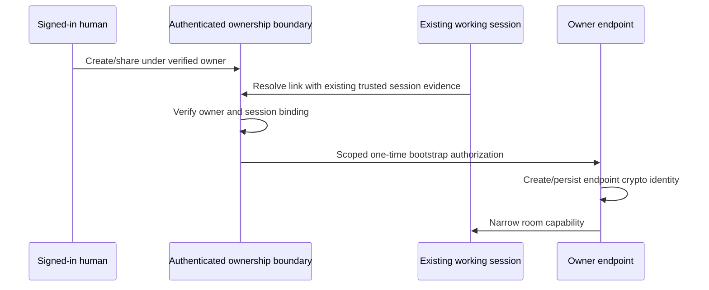

# KHA-144 Prove OAuth-to-agent ownership bootstrap - Plan

## Goal Capsule

Deliver prove oauth-to-agent ownership bootstrap. Authority: latest user decisions, then `docs/product/decisions.md`, the approved scope card, and this contract. Dependencies: KHA-102, KHA-141, KHA-142. Product trace: R13, R14, R15. Open launch gates: G-ADMISSION: an existing trusted identity or user-approved authenticated browser binding must be chosen;102/141/142 must finish.

Implementation belongs to the assigned ticket worker after gates clear. Root dependency changes, integration wiring, tracker publication and executor startup remain with their named owners. This artifact does not claim runtime proof.

---

## Product Contract

### Summary

Connect the channel link to the human's existing working agent without requiring technical setup by the human. This ticket covers the bounded outcome in `docs/product/tickets/KHA-144.md`.

### Problem Frame

The same public channel link must serve coworkers and agents, but routing information cannot prove which human owns an agent session.

### Requirements

- R1. Connect the channel link to the human's existing working agent without requiring technical setup by the human.
- R2. Authenticate owner, room, connector key and exact session before granting agent authority.
- R3. Ensure a copied public channel link alone cannot claim another person's ownership.
- R4. Prove automatic messaging account/device preparation or report the precise missing capability.

### Actors and flow

A1 is the owning human; A2 is their trusted owner connector; A3 is the model-facing adapter; A4 is the ciphertext delivery/control service. Human identity and agent identity remain distinct.

F1. An authorised actor requests this ticket's operation; the owning module validates current identity/state, returns an explicit result, and downstream consumers retain the narrow meaning of that result. Failures remain visible and retries preserve the original operation identity.

### Acceptance Examples

- AE1. The approved authenticated trust path attaches the intended existing session to its verified owner without human technical setup. Covers R1, R2.
- AE2. Another machine possessing only the public channel link cannot claim that owner or gain human policy/approval capability. Covers R3, R4.

### Key Decisions

Connector-gated review is the confidentiality boundary (session-settled: user-directed — chosen over separate human-only encryption groups: the owner connector may hold pending plaintext). Application code remains TypeScript with OSS reuse (session-settled: user-directed — chosen over building a new custom stack by default: reduce implementation ownership). Netlify is preferred; Railway is acceptable when reuse saves work. Existing sessions remain the target; a fresh replacement conversation is not equivalent.

### Scope Boundaries

Only the scope card's owned paths may change. Production features are not implemented by feasibility tickets. This ticket cannot choose a new recovery promise, add human connector setup, select a provider through a fixture, or redesign the Aiur dashboard shell. KHA-107/143 own its client reuse/navigation decisions.

### Open Questions

G-ADMISSION: an existing trusted identity or user-approved authenticated browser binding must be chosen;102/141/142 must finish.

### Sources

- `docs/product/tickets/KHA-144.md`, `docs/product/repo-layout.md`, `docs/product/decisions.md`.
- `docs/research/04-identity-trust.md`, `docs/research/05-e2ee.md`, `docs/research/08-security-evidence.md`.

---

## Planning Contract

Planning baseline: Khala `6d4694173eff9b0832f4c3a2cdb90b4281fcccd9`; inspected Archon `c7d3254097acaa02eed1e3be6fd8fbf06c0e8128` and Aiur `1f618cddf601a0b6d79bc1197579746b7584a64c`. `docs/evidence/security-planning-sources.json` pins external source reads. Proposed paths are future outputs, not claims of existing implementation. Product requirements preserved; acceptance examples clarified against the same requirements during review.

### Key Technical Decisions

- KTD1. Public invitation possession is not owner authentication. Distinguish room admission, verified human owner, existing harness session and protocol device. Demonstrate a binding joining all four without embedding owner credentials into a shared URL.
- KTD2. Prefer established authenticated local/Aiur capability or browser-authorized owner binding if102 and harness evidence support it. Whether an additional visible browser confirmation is acceptable is G-ADMISSION; do not invent a mandatory claim/pairing step. If no approved automatic trust path exists, report blocked feasibility rather than adding technical setup for the human.
- KTD3. Scope issued connector authorization to owner, agent participant, device, exact session ID and generation, approved rooms and capabilities. Audience/expiry/replay checks are required. A model receives only its allowed capability; human approval/policy mutation remains unavailable through that credential.
- KTD4. KHA-110 later implements OAuth/provisioning; this experiment proves the candidate provider exchange/provisioning route using maintained library and disposable identities. No production auth service, Matrix admin secret in browser, or server custody of E2EE keys.

### Proof flow

The second arrow is the critical unknown: a public URL alone supplies no trusted session evidence. Record exactly which existing mechanism supplies it, its issuer/audience, lifetime and local process custody. If that mechanism is unavailable, do not mark flow proven. Shared room links remain safe for coworkers under selected admission policy, not authority to impersonate the creator's agent.

---

## Implementation Units

### U1. Document candidate trust chain and gate

**Goal:** Document candidate trust chain and gate. **Requirements:** R1–R4; F1; applicable KTDs below. **Dependencies:** upstream tickets in Goal Capsule. **Files:** `experiments/ownership/README.md`, `docs/evidence/ownership.md`.

**Approach:** Use102 substrate and141/142 device evidence; name existing harness authentication mechanism and unresolved admission question before coding.

**Patterns to follow:** The named contract in KHA-105/106 and the source pattern cited in this Planning Contract; preserve the owned directory boundary.

**Test scenarios:**

- Each authority transition has an actual producer/verifier.
- Missing existing trust mechanism is blocking, not replaced by public-link possession.

**Verification:** The listed scenarios pass in the owned tests; record the observed result and relevant version/generation. A mocked result proves only module behavior, not a provider capability.

### U2. Build disposable provisioning proof

**Goal:** Build disposable provisioning proof. **Requirements:** R1–R4; F1; applicable KTDs below. **Dependencies:** U1. **Files:** `experiments/ownership/{package.json,pnpm-lock.yaml}`, `src/{identity,provisioning}.ts`, `tests/identity.test.ts`.

**Approach:** Use selected maintained provider client and actual supported protocol provisioning route; keep exact engine/package pins.

**Patterns to follow:** The named contract in KHA-105/106 and the source pattern cited in this Planning Contract; preserve the owned directory boundary.

**Test scenarios:**

- Same issuer/subject retains stable owner through email change.
- Lost provisioning response reconciles one protocol account.
- Browser/control projections expose no protocol access token or crypto keys.

**Verification:** The listed scenarios pass in the owned tests; record the observed result and relevant version/generation. A mocked result proves only module behavior, not a provider capability.

### U3. Prove scoped existing-session binding

**Goal:** Prove scoped existing-session binding. **Requirements:** R1–R4; F1; applicable KTDs below. **Dependencies:** U2. **Files:** `experiments/ownership/src/binding.ts`, `tests/binding.test.ts`.

**Approach:** Exchange approved trusted session evidence for endpoint-bound narrow authorization; stable operation and replay record.

**Patterns to follow:** The named contract in KHA-105/106 and the source pattern cited in this Planning Contract; preserve the owned directory boundary.

**Test scenarios:**

- Copied public link on unrelated machine cannot claim owner.
- Wrong audience, expired/replayed token and substituted session generation rejected.
- Same owner another session cannot silently take over current binding.

**Verification:** The listed scenarios pass in the owned tests; record the observed result and relevant version/generation. A mocked result proves only module behavior, not a provider capability.

### U4. Demonstrate normal-path user journey

**Goal:** Demonstrate normal-path user journey. **Requirements:** R1–R4; F1; applicable KTDs below. **Dependencies:** U3. **Files:** `experiments/ownership/tests/journey.test.ts`, `docs/evidence/ownership.md`.

**Approach:** Run OAuth/create/share using existing session and candidate endpoint, recording every human-visible action.

**Patterns to follow:** The named contract in KHA-105/106 and the source pattern cited in this Planning Contract; preserve the owned directory boundary.

**Test scenarios:**

- No human CLI/install/MCP/Matrix-account/key ceremony required.
- Forged human-approval invocation from agent capability fails.
- Unsupported harness/ownership prerequisite reported honestly rather than creating fresh session.

**Verification:** The listed scenarios pass in the owned tests; record the observed result and relevant version/generation. A mocked result proves only module behavior, not a provider capability.

---

## Verification Contract

Planned isolated install/build/test/test:live scripts under `experiments/ownership`. A successful mocked exchange does not close G-ADMISSION. Live evidence must identify owner authority, scoped token verifier, existing session ID/generation and both successful normal path and copied-link rejection, with secrets redacted. Record human-visible steps for product signoff.

### Settled production origin — user amendment

P11 sets the production app origin to `https://khala.aiur.team`. Canonical production share links use that origin; OAuth callback is `https://khala.aiur.team/api/human/auth/callback`. KHA131 owns origin validation/configuration,110 consumes the exact callback and132 composes it. Preview allowlists/credentials stay explicit and separate. This does not assign a Matrix server_name or claim DNS/hosting is already configured. Earlier synthetic `.example` links remain test fixtures, never deployment defaults. This later user decision supplements the preserved Product Contract.

## Definition of Done

Actual trust chain is reproducible and acceptable to the approved admission decision; no copied-link owner impersonation; no human technical setup; exact provider/SDK costs supplied to105/110/113. Until G-ADMISSION is resolved this candidate plan remains requirements-only. Remove abandoned-attempt code and temporary credentials; leave evidence free of message bodies, raw tokens and private keys. Do not change sibling implementations to make this ticket pass; return component defects to the named owner.

### Planning review and remaining confidence

Serial coherence, feasibility, security and adversarial review completed; see `docs/plans/reviews/security-planning-review.md`. This is a planning review, not a runtime security certification. Production implementation must record executed commands and observed evidence.
