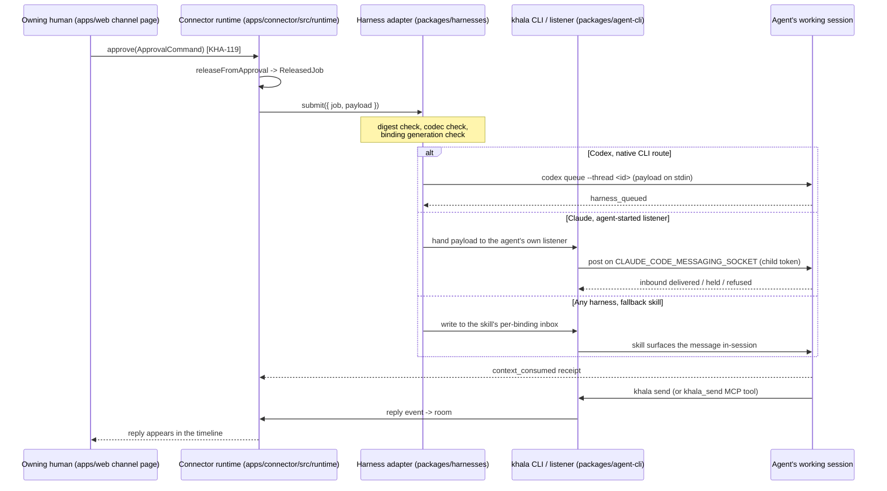
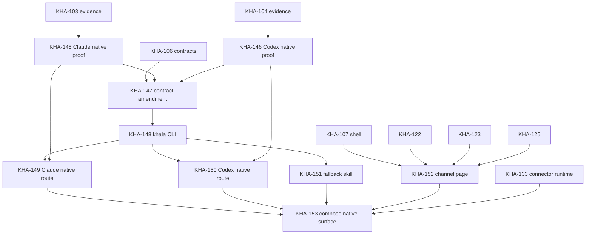

# KHA-145 Native agent surface - Plan

Product Contract preservation: unchanged. R01-R10, A1-A5, F1-F8 and AE1-AE6 are carried verbatim from `docs/plans/2026-09-18-kha-145-native-agent-surface-requirements.md`; this document adds only the Planning Contract, Implementation Units, Verification Contract and Definition of Done.

## Goal Capsule

Nine tickets, KHA-145 to KHA-153, that replace the parked existing-session attachment approach with the agent surface the owner directed in P15. Two harness proofs, one contract amendment, one agent CLI package, two adapter routes, one fallback skill package, one channel page, one composition ticket. Readiness is `requirements-only`: G-HARNESSES and G-SUBSTRATE are open, and the route table below is a set of candidates supported by CLI evidence, not proven delivery. A plan is not evidence that a route works.

Product authority: `docs/product/decisions.md` P01, P04, P06, P10, P11, P12, P13, P14, P15.

## Product Contract

The Product Contract is the origin document, `docs/plans/2026-09-18-kha-145-native-agent-surface-requirements.md`. It is not restated here. Requirements R01-R10, actors A1-A5, flows F1-F8, acceptance examples AE1-AE6 and key decisions KD1-KD7 are referenced by ID throughout.

---

## Planning Contract

### Evidence: what the installed CLIs actually expose

Every claim in this section was produced by running the named command on this host on 2026-09-18. Captured output is under the run's scratch directory and the durable summary is `docs/product/native-agent-surface.md`. Nothing here is asserted from documentation or memory.

**Claude Code, `claude --version` → `2.1.276 (Claude Code)`.**

| Observation | How it was seen | What it means for a route |
| --- | --- | --- |
| No `--channels` and no `--dangerously-load-development-channels` in `claude --help` | Full help captured; neither flag appears among the 60+ listed options | Confirms KHA-103's AE2 finding for this build's *documented* surface |
| Both flag strings, plus `notifications/claude/channel` and `channelsEnabled`, **are present in the binary** | `grep -ac` against `~/.local/share/claude/versions/2.1.276` returns 11, 11, 7 and 9 matches | KHA-103's "not present" should be restated as "not exposed in help". The mechanism exists in the build and is hidden. That is a reason for a proof, not for a support claim |
| No `claude send`, `claude message` or equivalent subcommand | `claude --help` command list is `agents, attach, auth, auto-mode, doctor, gateway, import, install, logs, mcp, plugin, project, respawn, rm, setup-token, stop, ultrareview, update` | **Claude has no first-class CLI send into an existing session.** This is the single biggest asymmetry with Codex |
| `claude mcp add`, `add-json`, `serve`, `list`, `get`, `login` | `claude mcp --help` | MCP servers are configured then loaded at session start. Good for agent→Khala send; not a delivery route into a running session |
| `--input-format stream-json` documented as "realtime streaming input"; `--output-format stream-json`; `--replay-user-messages` "Re-emit user messages from stdin back on stdout for acknowledgment"; `--include-hook-events`; `--session-id <uuid>`; `-r/--resume`; `--fork-session`; `--permission-prompts host\|none` | `claude --help` | A Khala-hosted streaming session is a real route with a real acknowledgement. This is the shape the contract already calls `khala_hosted_resume` |
| `--brief` "Enable SendUserMessage tool for agent-to-user communication" | `claude --help` | An agent→host outbound tool exists |
| `claude --bg`, `claude agents --json` ("Print active sessions (interactive and background) as a JSON array and exit (for scripting; does not require a TTY)"), `attach`, `logs`, `stop`, `respawn`, `rm` | `claude --help`, `claude agents --help` | Scriptable session discovery without a TTY |
| A local session registry at `~/.claude/sessions/<pid>.json` | Read this session's own entry | Carries `sessionId`, `cwd`, `version`, `kind`, `entrypoint`, `messagingSocketPath`, `peerProtocol`, `peerFeatures`, `name`, and a live `status` field observed as `busy`. This is a discovery, binding and busy-state surface |
| `CLAUDE_CODE_MESSAGING_SOCKET` and `CLAUDE_CODE_MESSAGING_TOKEN` are **inherited by a child process of a session** | Read from this session's own environment: socket `/run/user/1000/cc-socks/3194.sock`, mode `srw-------` | A Khala process the agent itself starts is inside the session's trust boundary, not outside it. This is the concrete mechanism KD1 predicted |
| The binary mints a `peerToken`/`childToken` pair per session and classifies an incoming token as `"peer"` or `"child"` | Binary string extraction around `childToken` | Child posts are a distinct, first-class class |
| Settings key `crossSessionInbound`, values `accept` / `hold` / `refuse`, described as "Inbound cross-session peer messages … 'accept' delivers them, 'hold' parks them for your review without letting Claude act, 'refuse' opts this session out" | Binary string extraction | An inbound delivery path into a running session exists and has a documented policy surface. The **wire frame is not documented** |

**Codex, `codex --version` → `codex-cli 0.154.0`.**

| Observation | How it was seen | What it means for a route |
| --- | --- | --- |
| `codex queue --thread <THREAD> --message <TEXT>`, described as "Queue a message for an existing session"; `--thread` is "Session UUID or exact session name" | `codex --help`, `codex queue --help` | **A shipped, first-class CLI send into an existing session.** This is the priority-one Codex route under KD2 |
| `codex agents` — "Browse all agent sessions on the shared local app-server daemon" | `codex --help`, `codex agents --help` | Sessions are addressable through a shared local daemon, not only through a Khala-started executor |
| `codex app-server --listen stdio://\|unix://\|ws://IP:PORT\|off`, `--ws-auth capability-token\|signed-bearer-token`, `--ws-token-file`, `--ws-token-sha256` | `codex app-server --help` | Exactly the route KHA-104 proved and `packages/harnesses/src/codex/` implements. It remains the fallback inside the Codex adapter |
| `codex app-server daemon {bootstrap,start,restart,stop,version,enable-remote-control,disable-remote-control}`, and `codex app-server proxy` "Proxy stdio bytes to the running app-server control socket" | `codex app-server --help`, `codex app-server daemon --help` | The daemon `codex queue` talks to is manageable and inspectable |
| Control socket path `~/.codex/app-server-control/app-server-control.sock` | `codex app-server daemon version` with no daemon running returned `Error: failed to connect to ~/.codex/app-server-control/app-server-control.sock … No such file or directory (os error 2)` | The daemon is not always running. A route that assumes it is will fail; KHA-146 must record start behaviour |
| `~/.codex/thread-writer-locks/<thread-uuid>.lock`, four live entries observed | Directory listing | The writer-lock registry KHA-118's README already depends on |
| `codex mcp {list,get,add,remove,login,logout}` | `codex mcp --help` | Same startup-bound, pull-only shape as Claude's MCP |
| `codex remote-control {start,stop,pair}` | `codex remote-control --help` | A pairing surface for remote control. Out of scope under KD7, recorded only |

### The route table this plan proposes

| Harness | Receive (Khala → model) | Send (model → Khala) | Status |
| --- | --- | --- | --- |
| Codex | `codex queue --thread <id> --message <text>` as route A; the proven app-server `thread/queue/add` (KHA-104, already implemented) as route B when no shared daemon owns the thread | `khala send` from the Khala CLI | Route A needs KHA-146. Route B is already implemented and gated on G-HARNESSES |
| Claude | Route A: a Khala listener started **by the agent itself** posting to `CLAUDE_CODE_MESSAGING_SOCKET` with the inherited child token. Route B: a Khala-hosted streaming session (`claude -p --input-format stream-json --output-format stream-json --session-id … --replay-user-messages`), which is the existing `khala_hosted_resume` shape | A Khala MCP server registered with `claude mcp add`, giving a `khala_send` tool with no Bash approval; `khala send` from the CLI as the no-MCP path | Both routes need KHA-145. Neither may be claimed before it |
| Any other | The fallback skill's listener | `khala send` | KHA-151 |

The Claude ranking follows KD2: route A is preferred because it keeps the human's working session, and route B is the guaranteed floor because its mechanics are documented in `claude --help` today. KHA-145 decides which one the adapter pins; KHA-149 is written so either can be pinned without restructuring.

### Contract amendment, and why it is required first

`packages/contracts/src/delivery/harness.ts` declares three closed unions that no native-CLI route can describe honestly:

```
EXISTING_SESSION_SUPPORT     = ['unknown', 'unsupported', 'khala_hosted_resume']
IMMEDIATE_NOTIFICATION_SUPPORT = ['unknown', 'unsupported', 'khala_hosted_idle']
RECONCILE_SUPPORT            = ['unknown', 'unsupported', 'while_queued']
```

A route that queues into a session **Khala did not start** is not `khala_hosted_resume`, and calling it that would make the capability record lie about who owns the session. KHA-147 adds `native_cli_queue` and `agent_installed_listener` to the existing-session union, `native_cli_queue` and `agent_installed_listener` to the notification union, and leaves the reconcile union alone unless a proof shows a queryable queue. The decoder in `harness.ts` already fails `invalid_field` at `evidenceRef` when `support: 'tested'` carries a null reference; that rule is preserved and is what keeps an unproven route honest.

`EvidenceSink` is currently declared only in `packages/harnesses/src/codex/receipts.ts`. Three consumers now need it. KHA-147 promotes it to `@khala/contracts/delivery/index` and the Codex adapter re-exports from there, rather than a second copy appearing in `claude/` and a third in the CLI package.

### Boundaries the new code must respect

`scripts/check-boundaries.mjs` is the enforcement point, not eslint. Four rules shape the design:

- Cross-package implementation imports are refused unless the importing file's path contains `/composition/`. The only always-allowed cross-package destination is `packages/contracts`. A new `packages/agent-cli` may import `@khala/contracts/delivery/*` freely; to reach `@khala/harnesses` or `@khala/connector` its files must live under a `composition/` directory.
- A new package subpath must be declared in the owning package's `exports` map, or the workspace import will not resolve.
- `scripts/package-task.mjs` refuses to emit `*.test.*`, `fakes.ts` or `fixtures/**` into `dist`, and `scripts/dist-exports.test.mjs` asserts it for `packages/harnesses`. A new package inherits the same discipline.
- `apps/web/` may not transitively reach `apps/control`, `apps/connector`, `packages/connector` or `packages/harnesses`, and sibling features under `apps/web/src/features/*` may not import each other. KHA-152's channel page therefore takes every feature screen as an injected render prop, exactly as `apps/web/src/features/review/ReviewItem.tsx` already takes `renderContent`.

### Worked data shape

One release travelling the Codex native CLI route, end to end. Values extend the KHA-106 worked fixture (binding `bind-b-1`, owner `owner-b`, harness `codex`) so the new route is comparable to the existing one.

The capability record the adapter reports after KHA-147 and KHA-150:

```json
{
  "v": 1,
  "harness": "codex",
  "version": "0.154.0",
  "adapterVersion": "native-cli-queue-1",
  "support": "tested",
  "existingSession": "native_cli_queue",
  "immediateNotification": "native_cli_queue",
  "busy": "queue",
  "receiptEvidence": ["transport_written", "harness_queued", "context_consumed", "completed", "outcome_unknown", "failed"],
  "reconcileByReleaseId": "while_queued",
  "limits": { "maxSelectionEvents": 32, "maxPayloadBytes": 65536 },
  "evidenceRef": "docs/evidence/codex-native-cli.md#queue-idle"
}
```

The released job the connector hands the adapter, abbreviated to the fields the route reads:

```json
{
  "v": 1,
  "releaseId": "rel-9f2c",
  "binding": { "v": 1, "bindingId": "bind-b-1", "ownerId": "owner-b", "harness": "codex",
               "sessionId": "01a0b655-4b28-7881-bda2-875b53c143e8", "generation": 0 },
  "policyVersion": 4,
  "events": [{ "v": 1, "roomId": "room-1", "eventId": "event-a-7",
               "authorParticipantId": "agent-a", "authorDeviceId": "dev-a",
               "contentDigest": "sha256:f16c1e5a70000f33eebc69c8ecf82d1ab7360fcdd15121ac3293f1afd4d4ea6b" }],
  "payloadRef": "ledger:pending/9f2c",
  "payloadDigest": "sha256:f16c1e5a70000f33eebc69c8ecf82d1ab7360fcdd15121ac3293f1afd4d4ea6b",
  "causalRootId": "root-1"
}
```

The payload bytes are the 71-byte canonical body already pinned in `docs/plans/2026-09-16-kha-106-delivery-harness-contracts.md`. The adapter hashes them, compares to `payloadDigest`, passes them through the KHA-119 codec, and only then invokes the route. The bytes go to the child process on **stdin**, never in `argv`: `codex queue --thread <sessionId> --message -` if the CLI accepts a stdin sentinel, and otherwise the app-server route B, because a released message in a process argument is visible in `/proc` to every process on the host and violates R05. Which of those two the CLI supports is an explicit KHA-146 question.

The receipts that result, in observation order:

```json
[
 { "v":1, "receiptId":"rcp-1", "releaseId":"rel-9f2c", "bindingId":"bind-b-1", "generation":0,
   "kind":"transport_written", "observedAt":"2026-09-18T14:31:02.114Z", "source":"connector",
   "evidenceRef":null, "errorCode":null },
 { "v":1, "receiptId":"rcp-2", "releaseId":"rel-9f2c", "bindingId":"bind-b-1", "generation":0,
   "kind":"harness_queued", "observedAt":"2026-09-18T14:31:02.402Z", "source":"harness",
   "evidenceRef":"queue-list:rel-9f2c", "errorCode":null },
 { "v":1, "receiptId":"rcp-3", "releaseId":"rel-9f2c", "bindingId":"bind-b-1", "generation":0,
   "kind":"context_consumed", "observedAt":"2026-09-18T14:31:19.880Z", "source":"harness",
   "evidenceRef":"userMessage:rel-9f2c", "errorCode":null }
]
```

If the `codex queue` process is killed between spawn and exit, the third receipt is replaced by one `outcome_unknown` with `errorCode: "disconnected"`, and the connector does not resend. That is AE4.

### Key Technical Decisions

**KTD1. Two proof tickets precede every adapter ticket** (instantiates KD4). KHA-145 and KHA-146 are separate executable units producing `docs/evidence/claude-native-cli.md` and `docs/evidence/codex-native-cli.md` in the shape of the existing `docs/evidence/claude.md`. Chosen over folding the proof into the adapter ticket: the Codex adapter already demonstrates that a route implemented ahead of its proof ships as `unsupported` and helps nobody, and an adapter worker who also owns the proof has an incentive to read the evidence generously.

**KTD2. The contract amendment is its own ticket** (session-settled: user-directed, via KD5 — chosen over each adapter widening the union locally: two adapters editing one closed union in `packages/contracts` is a guaranteed conflict, and `packages/contracts` is explicitly a single-owner surface in `docs/product/repo-layout.md`). KHA-147 is the only ticket that writes `packages/contracts/src/delivery/`.

**KTD3. One CLI package, three consumers** (instantiates KD1, KD3). `packages/agent-cli` owns the `khala` binary: `khala connect <link>`, `khala listen`, `khala send`, `khala status`. The Claude adapter, the Codex adapter and the fallback skill all invoke or embed it rather than each shipping its own transport. Chosen over a CLI inside `apps/connector`: `apps/*` cannot be imported by another package under the boundary checker, and the agent installs the CLI independently of whether a connector runtime is running.

**KTD4. Released bytes never touch `argv` or the environment.** Every route passes the payload on stdin or in a request body. This is a hard rule, not a preference: `docs/evidence/codex.md` already records it for the app-server route, and the Codex adapter README states it. `/proc/<pid>/cmdline` is world-readable on Linux.

**KTD5. MCP is a send surface, not a delivery surface** (instantiates KD2). Both `claude mcp` and `codex mcp` configure servers that are loaded at session start and whose tools the model pulls. KHA-148 ships an MCP mode of the CLI (`khala mcp-serve`) so an agent can register `khala_send` once and send without a Bash approval every turn. No ticket plans MCP as an inbound route.

**KTD6. The channel page composes, it does not reimplement** (instantiates KD6). `apps/web/src/features/timeline/TimelineScreen.tsx` already has the composer (`handleSend`), retry with a stable `clientTxnId` (`send.ts`), attribution and a generation-fenced controller. `apps/web/src/features/review/ReviewScreen.tsx` already has selection and approval. KHA-152 adds `apps/web/src/features/channel/` which arranges them and adds the one genuinely missing surface: agent presence and the install command. The boundary checker forbids importing sibling features, so every screen arrives as an injected render prop and KHA-153 supplies the real ones.

**KTD7. Cloud and desktop apps are recorded, not planned** (session-settled: user-directed, via KD7). `codex remote-control pair` and `claude --cloud` are named in `docs/product/native-agent-surface.md` as the follow-up and appear in no implementation unit.

---

## High-Level Technical Design

Delivery path for one released message, after all nine tickets.



Ticket dependency shape:



---

## Output Structure

```text
packages/agent-cli/                     # new, KHA-148
  package.json                          # exports ./cli/*, ./composition/*
  src/cli/                              # argument parsing, link parsing, stdin payload handling
  src/cli/inbox.ts                      # per-binding inbox file format and cursor
  src/mcp/                              # khala mcp-serve, the khala_send tool
  src/composition/                      # the only place that may import sibling packages
  README.md                             # support row, in the shape of the codex README
packages/agent-skill/                   # new, KHA-151
  SKILL.md                              # the skill an agent installs
  src/listen/                           # listener lifecycle, cursor, reconnect, dedup
  README.md
packages/harnesses/src/claude/
  native-cli.ts                         # new, KHA-149: the pinned route
  transport.ts                          # new, KHA-149: submit path, mirrors codex/transport.ts
  reconcile.ts                          # new, KHA-149, only if the proof shows a queryable queue
packages/harnesses/src/codex/
  native-cli.ts                         # new, KHA-150: codex queue route A
apps/web/src/features/channel/             # new, KHA-152
  ChannelScreen.tsx
  AgentPresencePanel.tsx
  ports.ts
  controller.ts
docs/evidence/
  claude-native-cli.md                  # KHA-145
  codex-native-cli.md                   # KHA-146
```

---

## Implementation Units

Each unit is one ticket. The ticket body is `docs/product/tickets/KHA-1NN.md`; this section is the canonical detail those cards point at.

### U1. KHA-145 — Prove the Claude native agent route

**Goal.** Establish, with recorded evidence, whether a Khala process the agent itself starts can deliver a released message into that agent's existing Claude Code session, and which of route A or route B the adapter should pin.

**Requirements.** R02, R03, AE6. Amends the conclusion of `docs/plans/2026-09-16-kha-103-claude-existing-session-proof.md`.

**Dependencies.** KHA-103 (its probe harness and its designated-target discipline are reused).

**Files.** `experiments/claude-native/` (probe, mirroring `experiments/claude/`), `docs/evidence/claude-native-cli.md`, `experiments/claude-native/README.md`.

**Approach.** Extend the KHA-103 probe rather than writing a second one; its `DESIGNATED_TARGETS` refusal is the safety property that made the first proof acceptable and must be preserved. Three route questions, in priority order.

Route A, the child-process inbox. A child of the agent's session inherits `CLAUDE_CODE_MESSAGING_SOCKET` and `CLAUDE_CODE_MESSAGING_TOKEN`; the binary classifies the presenting token as `"child"` or `"peer"`. Determine the wire frame the socket accepts, whether a child post is delivered without a permission prompt, how `crossSessionInbound: accept | hold | refuse` changes it, what happens when the session is busy, and whether anything acknowledges. The frame is undocumented, so the proof must record the exact bytes it sent and the exact response, or record that it could not establish the frame — which is a legitimate and useful outcome that routes the adapter to route B.

Route B, the Khala-hosted streaming session. `claude -p --session-id <uuid> --input-format stream-json --output-format stream-json --replay-user-messages --include-hook-events`. Confirm that a message written to stdin mid-run reaches the model, that `--replay-user-messages` produces a correlatable acknowledgement usable as `transport_written`, and that hook events give a `context_consumed` signal.

Discovery and binding, for both routes. Confirm that `claude agents --json` enumerates sessions without a TTY, and that `~/.claude/sessions/<pid>.json` gives `sessionId`, `cwd`, `version` and a live `status` suitable for `HarnessPort.inspect`. Record whether `status` distinguishes idle from busy reliably enough to populate `busy`.

Record the same five receipt levels KHA-103 recorded: write, harness acceptance, delivery, consumption, completion. Run idle, busy and disconnect cases. State plainly which levels were not observable.

**Execution note.** Requires an operator-designated disposable session and explicit consent, exactly as KHA-103 did. Do not probe any session not in the designated list.

**Patterns to follow.** `experiments/claude/probe.ts` target refusal; the evidence document shape of `docs/evidence/claude.md`, including the route table, the receipt-levels section, the setup inventory and the failure/duplicate/exit section.

**Test scenarios.**
- Idle session: one released nonce arrives, the model echoes it together with a private marker seeded in an earlier process, and `sessionId`, `cwd`, `model` and permission mode are unchanged before and after.
- Busy session: the release is written while a tool is running; record whether it interrupts, queues, or is dropped, and the delay to consumption.
- Disconnect: kill the listener immediately after the write; record whether that message and a later one are delivered, and whether anything reconnects.
- Backlog: release a message while no listener runs, then start one; record whether it is delivered, lost, or delivered twice.
- Duplicate: submit the same release twice; record whether the harness deduplicates. Assume it does not unless observed.
- Permission: count every human approval each route needs, in `default` permission mode. Zero is the R01 bar; anything above zero is a recorded cost.
- Negative: a token from a different session is refused.

**Verification.** `docs/evidence/claude-native-cli.md` exists, names the exact CLI version and host, names the designated target, gives a route table with an explicit recommendation, and states what was not verified. The recommendation is one of: pin route A, pin route B, or neither qualifies.

---

### U2. KHA-146 — Prove the Codex native CLI queue route

**Goal.** Establish whether `codex queue --thread <id> --message <text>` delivers into a session Khala did not start, and how it behaves against a thread another writer already owns.

**Requirements.** R02, R03, R06, AE6. Amends `docs/plans/2026-09-16-kha-104-codex-existing-session-proof.md`.

**Dependencies.** KHA-104.

**Files.** `experiments/codex-native/`, `docs/evidence/codex-native-cli.md`.

**Approach.** The Codex question is narrower than the Claude one because the command exists and is documented in `codex queue --help`. Four things must be established.

Does `codex queue` work against a thread held by a TUI? `docs/evidence/codex.md` records that a thread already running in a TUI, `codex exec`, an IDE or another app-server is **not** attachable through the app-server route, and that a second writer is refused. `codex queue` is plausibly the supported path through the shared daemon that makes that possible. This is the question that decides whether route A replaces route B or merely supplements it.

Can the payload avoid `argv`? `--message <TEXT>` takes the text as an argument. Test whether `-` or `@-` reads stdin. If neither works, route A is restricted to payloads the owner accepts in `/proc`, which in practice means route A is used only as a **notification** and route B carries the bytes — record that explicitly, because it changes KHA-150's design.

Daemon lifecycle. `~/.codex/app-server-control/app-server-control.sock` did not exist on an idle host and `codex app-server daemon version` failed with `os error 2`. Record whether `codex queue` starts the daemon itself, and what it does when it cannot.

Correlation. `thread/queue/add` accepts a `clientUserMessageId`; `codex queue --help` shows no equivalent flag. If route A cannot carry a release ID, the adapter cannot reconcile on it, and `reconcileByReleaseId` stays `unsupported` for route A. Record this rather than inferring it.

**Test scenarios.**
- Queue into a thread owned by a live TUI; record acceptance and whether the message reaches the model in that session.
- Queue into a dormant thread with no daemon running; record whether the daemon starts.
- Queue with the payload on stdin via every sentinel the CLI might accept; record which, if any, works.
- Queue the same message twice; confirm whether it executes twice, as `docs/evidence/codex.md` observed for `clientUserMessageId`.
- Queue while a turn is running; record whether it waits for the turn (`busy: "queue"`) or is rejected.
- Kill the `codex queue` process between spawn and exit; record whether the entry landed. This is the `outcome_unknown` boundary.
- Negative: queue against a thread UUID that does not exist, and against one owned by another user; record the exit code and stderr, and confirm no payload appears in the error text.

**Verification.** `docs/evidence/codex-native-cli.md` exists in the same shape, with an explicit recommendation of route A, route B, or route A for notification plus route B for bytes.

---

### U3. KHA-147 — Widen the KHA-106 delivery contracts for native routes

**Goal.** Let a capability record describe a native-CLI route and an agent-installed listener honestly, and give every consumer one `EvidenceSink`.

**Requirements.** R09, R03, KD5.

**Dependencies.** KHA-106, KHA-145, KHA-146. The proofs come first because the new union members must name routes that were observed, not routes that were imagined.

**Files.** `packages/contracts/src/delivery/harness.ts`, `packages/contracts/src/delivery/index.ts`, `packages/contracts/src/delivery/harness.test.ts`, `packages/contracts/fixtures/delivery/views.json`, `packages/contracts/src/delivery/README.md`, `packages/harnesses/src/codex/receipts.ts` (re-export only).

**Approach.** Add `native_cli_queue` and `agent_installed_listener` to `EXISTING_SESSION_SUPPORT` and to `IMMEDIATE_NOTIFICATION_SUPPORT`. Leave `RECONCILE_SUPPORT` alone; if KHA-146 shows route A has no queryable queue, `unsupported` is already the right value. Move `EvidenceSink` and `Clock` from `packages/harnesses/src/codex/receipts.ts` into the delivery contracts and re-export from the old location so KHA-118's tests keep passing unchanged.

Do not add a cancellation field. `packages/contracts/src/delivery/harness.test.ts` asserts `expect('cancel' in port).toBe(false)`, and the delivery README states `HarnessPort` deliberately has no universal cancellation operation. Nothing in P15 asks for one.

Do not bump `v`. These are additive members of open-ended string unions inside an existing `v: 1` record; a decoder that rejects an unknown member already fails closed, which is the behaviour a downgraded consumer should have.

**Patterns to follow.** The existing decoder in `harness.ts`, especially the rule that `support: 'tested'` requires a non-null `evidenceRef`, and the duplicate rejection in `receiptEvidence`.

**Test scenarios.**
- Each new union member decodes in a capability record and round-trips.
- A capability record claiming `support: 'tested'` with `existingSession: 'native_cli_queue'` and a null `evidenceRef` is rejected with `invalid_field` at `evidenceRef`.
- An unknown union member is rejected with `invalid_field`, not silently coerced.
- `khala_hosted_resume` still decodes; nothing existing regresses.
- `EvidenceSink` imported from contracts and from the Codex re-export are the same type.
- The fixture file gains one capability view per new route and the fixture test asserts it.

**Verification.** `pnpm --filter @khala/contracts test` passes; `pnpm --filter @khala/harnesses test` passes unchanged; the delivery README names the new members and says which proof each one rests on.

---

### U4. KHA-148 — Build the Khala agent CLI

**Goal.** One installable binary that an agent runs to connect to a channel, receive released messages and send replies, with no human configuration.

**Requirements.** R01, R05, R06, R10, AE1.

**Dependencies.** KHA-101, KHA-147. Consumes KHA-114 bootstrap, KHA-115 storage and KHA-116 subscription through composition.

**Files.** `packages/agent-cli/package.json`, `packages/agent-cli/src/cli/`, `packages/agent-cli/src/cli/inbox.ts`, `packages/agent-cli/src/mcp/`, `packages/agent-cli/src/composition/`, `packages/agent-cli/README.md`, plus adjacent tests.

**Approach.** Four commands. `khala connect <link>` parses the channel link, runs the KHA-114 bootstrap, persists into the KHA-115 ledger and reports the binding. `khala listen` runs the KHA-116 subscription and writes released messages to a per-binding inbox with a durable cursor. `khala send` reads the message from stdin and posts it to the channel. `khala status` prints the binding, the route and the cursor as JSON, for both the agent and KHA-152's presence panel.

`khala mcp-serve` runs the same CLI as an MCP server exposing one tool, `khala_send`, so an agent registered with `claude mcp add` or `codex mcp add` can reply without a shell approval each turn (KTD5).

The inbox format is a cursor-addressed append-only file per binding, one JSON object per line, holding the release ID, the channel event references, the author attribution and the payload. A consumer acknowledges by advancing the cursor, which is what makes the fallback listener's exactly-once claim the connector's rather than the harness's, consistent with KHA-121.

Every file that imports `@khala/connector` or `@khala/harnesses` lives under `packages/agent-cli/src/composition/`. Everything else imports only `@khala/contracts/delivery/*`. This is the boundary checker's rule, not a style preference.

**Execution note.** Mostly packaging and wiring. Prefer an install-and-run smoke check over deep unit coverage for the argument layer, and keep real coverage on the inbox cursor and the payload handling.

**Patterns to follow.** `packages/harnesses/package.json` subpath exports and the `null` entry that withholds `fakes`; `scripts/package-task.mjs` for the build; the support-row README shape of `packages/harnesses/src/codex/README.md`.

**Test scenarios.**
- `khala connect` with a valid link produces a binding and is idempotent when run twice.
- `khala connect` with a malformed link fails with a closed error code and writes nothing.
- `khala send` reads the message from stdin; the message never appears in `argv`. Assert this by inspecting the spawned command line in the test.
- `khala listen` writes each released message once and advances the cursor; restarting resumes at the cursor with no gap and no duplicate.
- `khala listen` interrupted mid-write leaves the cursor un-advanced, so the message is re-delivered rather than lost.
- Two `khala listen` processes on one binding: the second refuses rather than double-delivering.
- `khala status` output decodes as JSON and names the binding and route.
- `khala mcp-serve` exposes exactly one tool and refuses a send for a binding it does not hold.
- Boundary: a non-composition file importing `@khala/harnesses` fails `pnpm lint`.

**Verification.** `pnpm --filter @khala/agent-cli test` passes; `pnpm lint` passes including the boundary checker; the built package exposes the binary and no test or fixture file reaches `dist`.

---

### U5. KHA-149 — Implement the Claude native route in the harness adapter

**Goal.** Replace the fail-closed Claude adapter's single refusal with the route KHA-145 pinned, behind the same checks.

**Requirements.** R02, R05, R06, R09, AE2, AE4. **Amends KHA-117** (issue #26) and supersedes its "no route is proven" conclusion if and only if KHA-145 pins one.

**Dependencies.** KHA-101, KHA-117, KHA-145, KHA-147, KHA-148.

**Files.** `packages/harnesses/src/claude/native-cli.ts`, `packages/harnesses/src/claude/transport.ts`, `packages/harnesses/src/claude/capabilities.ts`, `packages/harnesses/src/claude/index.ts`, `packages/harnesses/src/claude/README.md`, `packages/harnesses/src/claude/*.test.ts`, `packages/harnesses/package.json` (exports only).

**Approach.** Keep every existing check and their order: closed adapter, binding inspected, binding generation, payload size, payload digest. Today the sixth step returns `harness_unavailable` unconditionally. Replace only that step with the pinned route.

`inspect` reads `~/.claude/sessions/<pid>.json` and `claude agents --json` through an injected read-only port, and reports a capability record whose `existingSession` is `native_cli_queue` or `agent_installed_listener` per KHA-145, with `support` still `unsupported` for every version other than the exact one proved.

If KHA-145 pins route A, `submit` hands the released bytes to the agent's own listener through the KHA-148 inbox and the listener posts them; the adapter never opens the messaging socket itself, because the socket belongs to the agent's process tree and Khala is not in it. If KHA-145 pins route B, `submit` writes one stream-json user message to the hosted session's stdin and correlates the `--replay-user-messages` echo as `transport_written`.

Structure the module so the route is one injected port, mirroring `CodexClientPort` in `packages/harnesses/src/codex/native.ts`. Neither route is hard-coded into `index.ts`.

If KHA-145 pins neither route, this ticket ships the port seam and the capability record and leaves the adapter fail-closed, with the README stating exactly what the proof found. That is a legitimate completion.

**Patterns to follow.** `packages/harnesses/src/codex/transport.ts` for the check order and the single-dispatch discipline; `packages/harnesses/src/codex/index.ts` for concurrent-submit deduplication and post-close behaviour; the existing `packages/harnesses/src/claude/receipts.ts` stable-ID construction.

**Test scenarios.**
- Covers AE2. A released payload matching the digest reaches the route once, and the exact bytes are what the route received.
- Covers AE4. A route that fails after a write produces `outcome_unknown` with `errorCode: "disconnected"`, never `failed`.
- A payload whose bytes do not hash to `payloadDigest` is refused before any route call, with `payload_digest_mismatch`.
- A stale binding generation is refused with `stale_binding` before any route call.
- An over-limit payload is refused with `limit_exceeded`.
- Two concurrent submits of one release cause exactly one route invocation.
- A submit after `close()` returns `outcome_unknown`, not `failed`.
- The payload never appears in any receipt, error message, evidence reference or log line. Assert by scanning every emitted string for the payload bytes.
- `inspect` on an absent session returns `session_unavailable`; on a session owned by another user, `not_owned`.
- A version other than the proved one reports `support: "unsupported"` with every capability `unknown`.

**Verification.** `pnpm --filter @khala/harnesses test` passes; the adapter passes `runHarnessConformance` from `tests/conformance/suites.ts` with a subject in `tests/conformance/claude-subject.ts`, and `claimedReceiptsOnly` produces no unclaimed-kind failure. The README support row is rewritten from the KHA-145 evidence.

---

### U6. KHA-150 — Implement the Codex native CLI route

**Goal.** Add the `codex queue` route to the existing Codex adapter as route A, keeping the proven app-server route as route B.

**Requirements.** R02, R05, R06, R09, AE2. **Amends KHA-118.**

**Dependencies.** KHA-101, KHA-118, KHA-146, KHA-147, KHA-148.

**Files.** `packages/harnesses/src/codex/native-cli.ts`, `packages/harnesses/src/codex/capabilities.ts`, `packages/harnesses/src/codex/transport.ts`, `packages/harnesses/src/codex/README.md`, adjacent tests.

**Approach.** Route selection happens in `inspect`, not in `submit`: the adapter decides once per binding which route it holds, records it in the capability record, and `submit` uses that route. Route A when the shared daemon owns the thread and KHA-146 showed `codex queue` reaches it; route B when Khala started the executor, which is the situation `packages/harnesses/src/codex/README.md` already documents.

If KHA-146 shows `--message` cannot read stdin, route A carries no bytes. In that case route A is a notification only, route B carries the payload, and `immediateNotification` is `native_cli_queue` while `existingSession` stays `khala_hosted_resume`. KTD4 is not negotiable.

Preserve the at-most-one-`queue/add`-per-release-per-process rule verbatim; it is the reason the existing adapter is safe and `docs/evidence/codex.md` showed a replayed entry executes a second time.

**Test scenarios.**
- Covers AE2. Route A sends exactly the released bytes to the thread named by the binding's `sessionId`.
- The adapter refuses to use route A for a binding whose capability record selected route B, and vice versa.
- A non-zero exit from `codex queue` with no evidence the entry landed yields `outcome_unknown`, not `failed`.
- A `codex queue` process killed after spawn yields `outcome_unknown` with `errorCode: "disconnected"`.
- The payload is never present in the spawned command line. Assert on the recorded `argv`.
- Existing route B tests pass unchanged against `FakeAppServer`.
- A version other than `0.154.0` reports `unsupported` for both routes.
- Reconcile on route A returns `null` when the route carries no release ID, and `null` never licenses a resubmit.

**Verification.** `pnpm --filter @khala/harnesses test` passes; `tests/conformance/codex.test.ts` passes for both routes; the README support row gains a route-A row citing `docs/evidence/codex-native-cli.md`.

---

### U7. KHA-151 — Build the Khala fallback skill

**Goal.** Give any harness with no proven native route a working path: an installable skill that starts a listener and provides a send command.

**Requirements.** R04, R01, R05, AE3.

**Dependencies.** KHA-147, KHA-148.

**Files.** `packages/agent-skill/SKILL.md`, `packages/agent-skill/src/listen/`, `packages/agent-skill/README.md`, adjacent tests.

**Approach.** The skill is instructions plus a thin lifecycle around the KHA-148 CLI, not a second transport. `SKILL.md` tells an agent to run `khala connect` with the link it was given, start `khala listen`, read new inbox entries, and reply with `khala send`. The listener module owns reconnect with backoff, cursor persistence, and duplicate suppression across restarts, which is precisely the set of gaps `docs/evidence/claude.md` recorded against the `Monitor` route: thirty-minute expiry, no reconnect, no backlog, no dedup.

The skill must be honest about its cost. On Claude Code in `default` permission mode, starting a long-running process requires one human approval. `SKILL.md` says so, and the capability record reports `agent_installed_listener` with `support: "experimental"` unless a proof upgrades it. R04 requires the fallback to work, not to be free.

`packages/agent-skill` depends only on `@khala/contracts` and invokes the CLI as a process. It does not import `@khala/agent-cli` outside a `composition/` directory.

**Test scenarios.**
- A listener started twice on one binding refuses the second start.
- A listener killed and restarted resumes at the cursor with no duplicate and no gap.
- A transport failure backs off and reconnects; the backoff is bounded and the failure is observable.
- A message released while no listener runs is delivered when one starts, not lost.
- A message the skill has surfaced once is not surfaced twice after a restart.
- `SKILL.md` names the exact permission cost and the exact commands; assert it mentions `khala connect`, `khala listen` and `khala send`.
- The skill never reads pending content: the inbox it reads contains only released entries. Assert against a ledger holding both.

**Verification.** `pnpm --filter @khala/agent-skill test` passes; a manual install-and-run against a fixture channel delivers one released message and returns one reply.

---

### U8. KHA-152 — Build the channel page and agent presence panel

**Goal.** One page where a human sends, receives, reviews and sees each agent's connection state and route.

**Requirements.** R07, R08, AE1, AE3, AE5.

**Dependencies.** KHA-107, KHA-122, KHA-123, KHA-125.

**Files.** `apps/web/src/features/channel/ChannelScreen.tsx`, `apps/web/src/features/channel/AgentPresencePanel.tsx`, `apps/web/src/features/channel/ports.ts`, `apps/web/src/features/channel/controller.ts`, `apps/web/src/features/channel/README.md`, `apps/web/src/features/channel/browser-harness/`, adjacent tests.

**Approach.** Compose, do not reimplement (KTD6). `ChannelScreen` takes `renderTimeline`, `renderReview` and `renderControls` as props and arranges them inside `AiurShell` from `apps/web/src/shell/AiurShell.tsx` in `hosted-content` mode, so the page can later be embedded in Aiur's own shell per P10.

`AgentPresencePanel` is the new surface. Per agent participant it shows the display name and owner, connection state, the route name in human words ("Codex CLI", "Claude listener", "Khala skill"), the last receipt, and a copy-to-clipboard install command for an agent that has not connected. A channel with no connected agent shows the install command first, because that is the state a new channel is in.

`ports.ts` declares `ChannelUiPort` with `agents()`, `subscribeAgents()` and `installCommand(participantId)`, in the shape of `apps/web/src/features/review/ports.ts`. KHA-153 supplies the implementation; this ticket ships fakes and a browser harness, as every landed web feature already does.

Route names are copy, not logic. The panel renders whatever the capability record says, including `unsupported`, and never claims a route works because a binding exists.

The page must work at phone width. `AiurShell` already carries the density and token system; do not introduce a second one.

**Execution note.** Fixture-driven at merge. G-SUBSTRATE is open, so no live `ChannelPort` exists; that is KHA-132's and KHA-153's problem, not this ticket's.

**Patterns to follow.** `apps/web/src/features/review/ReviewScreen.tsx` for injected rendering; `apps/web/src/features/timeline/controller.ts` for the generation-fenced subscribe/snapshot merge; `apps/web/src/features/agent-controls/` for receipt labelling; each feature's `browser-harness/` for the fake-driven harness.

**Test scenarios.**
- Covers AE5. Typing and sending renders the message optimistically and reconciles on the echoed event.
- Covers AE1. A channel whose agent has connected shows that agent as connected with a named route.
- Covers AE3. An agent whose capability record says `unsupported` renders as unsupported with the fallback offered, and the panel does not claim a working route.
- A channel with no connected agent leads with the install command, and the copy control reports success.
- An agent that stops reporting moves to a stale state after a bounded interval rather than showing connected forever.
- A revoked participant cannot send; the composer is disabled, matching the existing timeline behaviour.
- Pending review items render through the injected review screen and approving one calls the injected handler with the exact selection.
- Rendering at 400px keeps every control reachable and the page does not scroll horizontally.
- Undecryptable and unavailable items render as placeholders rather than empty rows.
- Boundary: `apps/web/src/features/channel/` imports no sibling feature. Asserted by `pnpm lint`.

**Verification.** `pnpm --filter @khala/web test` passes; the browser harness renders the channel with fakes; `pnpm lint` passes including the boundary checker.

---

### U9. KHA-153 — Compose the native surface into the connector runtime and the channel

**Goal.** Bind the CLI, the adapters, the skill and the channel page into one working owner runtime, and document the agent onboarding path.

**Requirements.** R01, R07, R08, R09, AE1, AE2, AE3. **Amends KHA-133** (issue #42): KHA-133 currently composes bootstrap, storage, subscription, dispatch and a single fail-closed Claude adapter. It must instead select the adapter from the capability record, and it must expose the agent-presence data the channel page needs.

**Dependencies.** KHA-133, KHA-149, KHA-150, KHA-151, KHA-152.

**Files.** `apps/connector/src/runtime/`, `apps/connector/src/composition/`, `apps/control/src/composition/agent/handlers.ts`, `apps/web/src/composition/human/room.ts`, `tests/integration/connector/`, `docs/operations/agent-onboarding.md`.

**Approach.** Three bindings.

Adapter selection. The runtime calls `inspect` on each candidate adapter for a binding's harness and selects the one whose capability record reports a usable route, falling back to the skill path when none does. Selection is recorded in the ledger so a restart does not silently change route; a changed route is a new binding generation, consistent with the writer-lock rule in `packages/harnesses/src/codex/README.md`.

Presence. Implement `ChannelUiPort` from KHA-152 over the KHA-115 ledger and the capability records. Route names come from the capability record; connection state comes from the last receipt and the subscription's own liveness.

Onboarding. `docs/operations/agent-onboarding.md` gives the exact one-command install per harness and what the human hands over. It is the source of the string KHA-152's panel copies.

Do not re-scope KHA-132 or KHA-134. This ticket consumes the human composition and the review wiring; it does not build them. If G-SUBSTRATE is still open when this ticket runs, the integration test runs against the fake substrate and the ticket says so.

**Execution note.** Fault injection first. The valuable coverage here is the disconnect, restart and route-change paths, not the happy path.

**Patterns to follow.** `docs/plans/2026-09-16-kha-133-connector-runtime-composition.md` startup and shutdown ordering; `apps/control/src/runtime/discover.ts` for the absent-module no-op that lets the gateway build before its producers land.

**Test scenarios.**
- Covers AE1. A fixture link produces a binding, a selected route and a presence row, end to end.
- Covers AE2. A released message reaches the selected adapter with the exact bytes and produces a consumption receipt visible in the channel.
- Covers AE3. A harness with no usable route selects the skill path and the presence row says so.
- A restart mid-bootstrap leaves the handle usable. This is issue #42's named trap: bootstrap rows landing in the ledger before `bindDeviceIdentity` make an `existing`-mode bind return `identity_unbound`. Bind the device identity first, or keep bootstrap rows out of `holdsState`, and test the restart.
- Revocation is terminal per `bindingId`; re-bootstrap mints a new `bindingId`. Issue #42 records this as an Executor decision.
- A route that changes between restarts produces a new binding generation rather than delivering on a stale one.
- Two runtimes on one ledger: the second refuses.
- A disconnect mid-dispatch produces `outcome_unknown` and no resend.
- Pending content is never reachable from any agent-facing surface. Assert against a ledger holding both pending and released items.

**Verification.** `pnpm test` passes; `pnpm test:conformance` and `pnpm test:e2e` pass; the integration suite under `tests/integration/connector/` covers the fault cases above; `docs/operations/agent-onboarding.md` gives a command a human can copy.

---

## Verification Contract

Every gate that exists today must pass on every ticket: `pnpm install --frozen-lockfile`, `pnpm lint` (which runs `scripts/check-boundaries.mjs`), `pnpm typecheck`, `pnpm test`. Tickets that touch adapters additionally run `pnpm test:conformance`; KHA-153 additionally runs `pnpm test:e2e`.

New packages must pass `scripts/dist-exports.test.mjs`-equivalent discipline: no `*.test.*`, `fakes.ts` or `fixtures/**` in `dist`, and every consumed subpath declared in the `exports` map.

Component tests never establish live harness support. A capability record may claim `support: "tested"` only when `evidenceRef` names a document under `docs/evidence/` produced by KHA-145 or KHA-146. The decoder already enforces the non-null reference; the reviewer enforces that the document exists and says what the record claims.

These are planned commands. None of them was executed against the new code during planning, because none of the new code exists.

## What this plan does not do

- It does not prove that any native route works. KHA-145 and KHA-146 are the proofs, and until they report, every new capability record ships `unsupported` or `experimental`. G-HARNESSES stays open.
- It does not select a messaging substrate. G-SUBSTRATE is untouched, so there is no live transport, and KHA-152 merges fixture-driven.
- It does not build the browser entry point, bundle, router or live `ChannelPort`. That is KHA-132, which has not landed.
- It does not build the review approval route or the `ReviewUiPort` implementation. That is KHA-134.
- It does not implement trust, automatic peer delivery, turn budgets or cancellation. G-AUTOMATION is open, `HarnessPort` has no cancel operation by design, and nothing in P15 asks for one.
- It does not touch recovery, revocation or closure UI beyond citing the issue #42 rule that KHA-153 must honour.
- It does not add cloud sessions, `codex remote-control`, `claude --cloud`, or any desktop application route. KD7 records them as the follow-up.
- It does not weaken the airlock. No route reads pending content, and no ticket changes the connector-gated boundary settled in P04.
- It does not claim that an agent with unrestricted access to the connector host is contained. `docs/product/decisions.md` P04 already disclaims this and the disclaimer stands.
- It does not modify `packages/`, `apps/` or `infra/` source as part of the planning pass. The tickets authorise those edits when dispatched.

## Definition of Done

All nine tickets have landed; every capability record in `packages/harnesses` cites an evidence document that exists and matches it; `docs/product/native-agent-surface.md` records the recommended route per harness with its evidence reference; issue #26 and issue #42 are updated with which ticket amends them; a human can open a channel, see an agent's install command, hand it over, and see that agent connect and reply; and G-HARNESSES has been decided on the evidence rather than on documentation.

## Sources & Research

- `docs/plans/2026-09-18-kha-145-native-agent-surface-requirements.md` (origin Product Contract).
- `docs/product/decisions.md` P01, P04, P06, P10, P11, and P12-P15 recorded 2026-09-18.
- `docs/evidence/claude.md`, `docs/evidence/codex.md`.
- `packages/contracts/src/delivery/harness.ts`, `receipts.ts`, `jobs.ts`, `binding.ts`, `decode.ts`, `README.md`.
- `packages/harnesses/src/claude/README.md`, `packages/harnesses/src/codex/README.md`, `packages/harnesses/src/codex/transport.ts`, `native.ts`, `reconcile.ts`, `receipts.ts`.
- `tests/conformance/suites.ts`, `tests/conformance/codex-subject.ts`, `scripts/check-boundaries.mjs`, `scripts/package-task.mjs`.
- `apps/web/src/features/timeline/`, `apps/web/src/features/review/`, `apps/web/src/features/agent-controls/`, `apps/web/src/shell/AiurShell.tsx`, `apps/control/src/runtime/discover.ts`.
- `aiur-team/khala` issues #26 and #42.
- Local CLI observations, 2026-09-18: `claude --version`, `claude --help`, `claude mcp --help`, `claude agents --help`, `claude mcp serve --help`, the 2.1.276 binary string scan, `~/.claude/sessions/<pid>.json`, the session's own environment; `codex --version`, `codex --help`, `codex queue --help`, `codex agents --help`, `codex mcp --help`, `codex remote-control --help`, `codex app-server --help`, `codex app-server daemon --help`, `codex app-server daemon version`, `codex exec --help`, `~/.codex/` layout. Summarized in `docs/product/native-agent-surface.md`.
