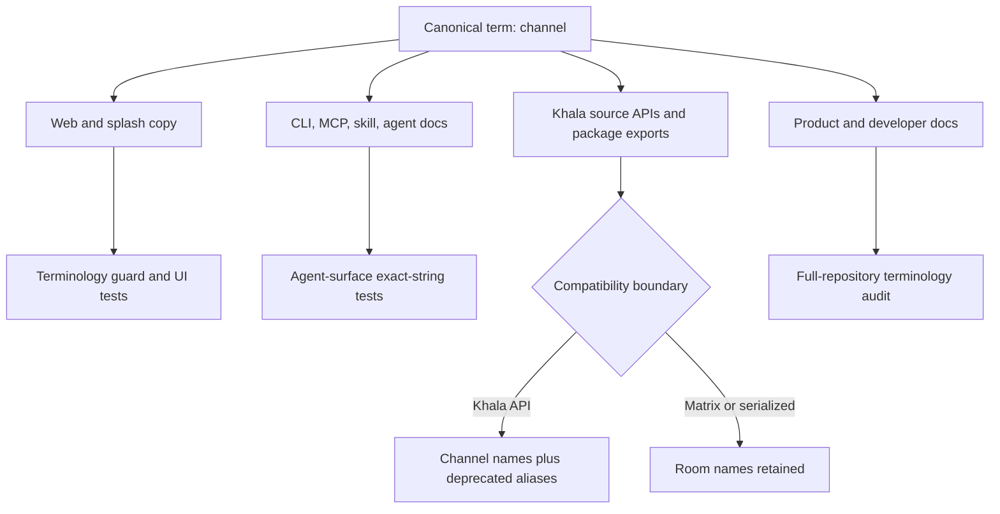

# Channel Terminology Migration - Plan

## Goal Capsule

- **Objective:** Make `channel` Khala's consistent user-, agent-, documentation-, and source-facing noun without changing Matrix or persisted wire contracts.
- **Authority:** Issue #163, then `docs/product/decisions.md`, then current tested contracts.
- **Stop conditions:** Do not rename Matrix protocol symbols, persisted fields, serialized keys, or values without a migration.
- **Tail ownership:** Update tests and docs in the same change, add a terminology regression guard, and pass every root verification command.

---

## Product Contract

### Summary

Khala presents conversations as channels across its website, application UI, CLI and MCP descriptions, agent skill, errors, docs, and safe code APIs. Matrix-native room vocabulary and compatibility-sensitive wire or persisted names remain unchanged and documented.

### Problem Frame

The repository currently mixes channel, chat, and room for the same Khala concept. That makes product copy inconsistent, makes agent instructions harder to follow, and leaks Matrix implementation vocabulary into Khala-owned APIs.

### Requirements

**Product and agent language**

- R1. Use `channel` for Khala nouns in splash copy, application copy, agent instructions, CLI documentation, MCP descriptions, errors, root docs, and `docs/**`.
- R2. Preserve the exact splash sentence “Encrypted chat for humans and their agents.”
- R3. Keep `chat` only as a natural generic verb and retain third-party terminology when it names an external product or quoted contract.

**Code and compatibility**

- R4. Make safe Khala-owned types, functions, modules, package exports, and feature names channel-first, retaining one-release deprecated aliases for public Room-named APIs.
- R5. Keep Matrix-native symbols and API terms unchanged, including `RoomId`, SDK room types, Matrix event names, and Synapse configuration.
- R6. Keep existing `roomId`, `room_id`, serialized error values, URL/query fields, hashes, fingerprints, and persisted records unchanged unless a migration exists.
- R7. Keep neutral CLI commands, flags, and the `khala_send` MCP tool unchanged; no deprecated alias is required where no public command was renamed.

**Enforcement and evidence**

- R8. Add a lint-backed guard for new user-facing `room` strings in `apps/web/src` and agent CLI help or descriptions, with narrow Matrix allowances.
- R9. Update every affected test and pass `pnpm typecheck`, `pnpm lint`, `pnpm test`, `pnpm build`, and `pnpm test:browser`.

### Scope Boundaries

- Matrix rooms remain rooms at the transport boundary.
- Historical quotations and third-party names retain their original vocabulary when rewriting them would be inaccurate.
- Research PRs #149–#158 remain owned by their existing branches; this change updates the merged tree and records the terminology rule they should consume.
- No new CLI command, flag, MCP tool, permission, wire migration, or persistence migration is introduced.

---

## Planning Contract

### Key Technical Decisions

- KTD1. `channel` is the canonical Khala noun. (session-settled: user-directed — chosen over chat/room: one product term must span human and agent surfaces.)
- KTD2. Matrix and wire compatibility vocabulary remains unchanged. `RoomId`, `roomId`, `room_id`, Matrix event names, and persisted values are protocol data rather than product copy.
- KTD3. Channel-named public TypeScript APIs and subpaths become canonical while Room-named symbols and old package subpaths remain deprecated aliases through the first tagged release containing #163. Aliases carry `@deprecated` removal notes and may be removed after that release.
- KTD4. Existing CLI verbs, `--binding`, and `khala_send` remain because they contain no deprecated noun. Documentation placeholders and descriptions change without inventing alias surface.
- KTD5. The regression guard parses production TypeScript/TSX string and template literals plus JSX text/visible attributes, skips import specifiers and non-visible JSX attributes, scans landing HTML text and visible attributes, and checks CLI/MCP description literals. It excludes test/spec and browser-harness files; allowances match exact Matrix tokens or patterns rather than whole files.

### High-Level Technical Design

### Risks and Dependencies

- A half-rename could leave agent discovery saying channel while setup steps request a room link; exact-string tests must cover the whole onboarding path.
- An over-broad mechanical rename could change signed bytes, decoders, database columns, Matrix API paths, or external terminology; compatibility-sensitive names require explicit audit.
- Open research PRs may later add stale terminology; their owners have already been directed toward channel, while the lint guard protects merged web and CLI surfaces and the repository audit covers the rest.

---

## Implementation Units

### U1. Establish the terminology boundary and guard

- **Goal:** Record the product/protocol rule and enforce future user-facing copy.
- **Requirements:** R1–R3, R5, R6, R8.
- **Dependencies:** None.
- **Files:** `docs/product/decisions.md`, `scripts/check-terminology.mjs`, `scripts/check-terminology.test.mjs`, `package.json`.
- **Approach:** Add the decision before bulk renames, then parse production TypeScript/TSX literals and JSX sinks plus landing HTML text/visible attributes and CLI/MCP description literals, using exact Matrix allowances and no file-wide exceptions.
- **Test scenarios:** Forbidden direct and constant/template-backed visible `room` copy fails; channel copy passes; Matrix protocol strings, import paths, CSS/id/class attributes, and `roomId` identifiers pass.
- **Verification:** The new script test passes and root lint invokes the guard.

### U2. Rename human-facing web surfaces

- **Goal:** Make channel the visible term across landing, create, join, conversation, controls, recovery, and bootstrap-consent UI.
- **Requirements:** R1–R3, R9.
- **Dependencies:** U1.
- **Files:** `apps/web/src/landing/**`, `apps/web/src/features/**`, `apps/web/src/composition/**`, `apps/control/src/agent-bootstrap/**`, and adjacent tests/browser specs.
- **Approach:** Update visible and accessible copy first, rename repo-internal feature/component/controller exports directly, and reserve one-release compatibility shims for documented public package entry points owned by U4.
- **Test scenarios:** Landing keeps the exact splash carve-out; create/join/channel/recovery screens expose channel labels; bootstrap consent uses channel; browser accessible-name assertions remain correct; rename-bearing loading, empty, error, success, partial-success, status, alert, and live-region copy uses channel throughout create, join, presence, and recovery flows.
- **Verification:** Web and control unit/browser tests pass without unallowlisted visible room nouns.

### U3. Rename agent-facing surfaces and safe bootstrap APIs

- **Goal:** Align CLI documentation, MCP descriptions, fallback skill instructions, public agent files, and connector bootstrap source names.
- **Requirements:** R1, R3, R6, R7, R9.
- **Dependencies:** U1.
- **Files:** `packages/agent-cli/**`, `packages/agent-skill/**`, `packages/connector/src/bootstrap/**`, `apps/web/src/landing/public/**`, `docs/operations/agent-onboarding.md`.
- **Approach:** Rename link placeholders and private source parameters, preserve fingerprints and schemas, and keep neutral commands/tool names unchanged.
- **Test scenarios:** Skill command parity remains exact; MCP lists one unchanged tool with channel description; renamed bootstrap calls remain idempotent and reject invalid links identically.
- **Verification:** Agent CLI, agent skill, and connector tests pass with unchanged wire outputs.

### U4. Make Khala code APIs channel-first

- **Goal:** Introduce canonical Channel-named contracts and messaging/web APIs without wire churn.
- **Requirements:** R4–R7, R9.
- **Dependencies:** U1.
- **Files:** `packages/contracts/src/messaging/**`, `packages/messaging/src/**`, `packages/messaging/package.json`, `apps/web/package.json`, affected consumers and tests.
- **Approach:** Rename safe implementation names and module paths; preserve Room-named symbols, old files, and old package subpath mappings as deprecated wrappers through the first tagged release containing #163; leave `RoomId` plus serialized room fields intact.
- **Test scenarios:** New Channel imports compile; old symbol and package-subpath imports compile and resolve to the same runtime behavior; exact fixture keys and persisted values do not change.
- **Verification:** Full-repository searches account for every old source name and contract fixtures remain byte-compatible.

### U5. Normalize current documentation

- **Goal:** Apply the terminology rule throughout root/package READMEs and `docs/**` while preserving accurate Matrix and third-party terms.
- **Requirements:** R1–R7.
- **Dependencies:** U1–U4.
- **Files:** `README.md`, `llms.txt`, `AGENTS.md`, package and feature READMEs, `docs/**`.
- **Approach:** Update current Khala narration and paths, then audit every remaining noun use as Matrix-native, third-party, quoted/historical, generic verb, or defect.
- **Test scenarios:** Documentation links and referenced package paths resolve; the decision record lists every deliberately retained compatibility category.
- **Verification:** Repository terminology audit contains only categorized exceptions.

---

## Verification Contract

| Gate | Applicability | Done signal |
|---|---|---|
| Terminology script tests | U1–U4 | Forbidden web/CLI copy fails fixtures; allowed protocol cases pass |
| Full old-name audit | U2–U5 | Every old identifier and noun hit is renamed or classified |
| `pnpm typecheck` | All | All packages and e2e harness compile |
| `pnpm lint` | All | ESLint, boundaries, and terminology guard pass |
| `pnpm test` | All | Unit, conformance, and e2e tests pass |
| `pnpm build` | All | Boundary check and every package build pass |
| `pnpm test:browser` | U2 | All workspace browser tests pass |

---

## Definition of Done

- Khala presents channel consistently on human and agent surfaces, except for the explicit splash sentence, natural verb uses of `chat`, accurate third-party or historical terminology, and Matrix-native boundary vocabulary.
- Channel-named source APIs are canonical where safe, and deprecated symbol plus package-subpath aliases preserve existing public Room-named imports through the first tagged release containing #163.
- Matrix terms and wire/persistence bytes are unchanged and the boundary is documented.
- The terminology guard and its tests prevent regressions without broad file exemptions.
- Required full-repository verification is green and abandoned rename experiments are absent from the diff.
