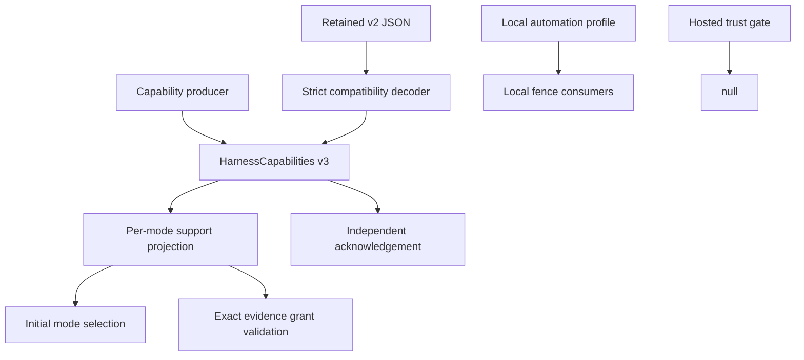

# feat: Define the listening-mode contract

## Goal Capsule

- **Objective:** Establish one strict listening-mode contract, migrate all capability reports to v3 without rejecting retained v2 data, and expose a local-only bounded automation profile.
- **Authority:** `docs/product/internal-mode/executor-decisions.md` items 1-40 override `docs/product/internal-mode/listening-modes.md`; ticket #192 narrows both to the contract and limit surfaces.
- **Execution profile:** Implement contract codecs and projections first, migrate producers/fixtures/consumers second, then prove local-limit boundaries and wrong-implementation guards.
- **Stop conditions:** Do not add persistence, dispatcher scheduling, UI controls, route implementations, receipts, or hosted automation.
- **Tail ownership:** This ticket owns local verification, the draft PR, self-review, and CI handoff against `main`.

---

## Product Contract

### Summary

Listening mode is exact-binding capability data for the user's already-running interactive CLI. This change defines the values and evidence rules without implementing mode persistence or delivery. `HarnessCapabilities` remains the sole owner of support data, secondary hosted evidence cannot enable primary interactive modes, and acknowledgement support remains independent.

### Problem Frame

The current v2 capability envelope describes generic harness mechanics but cannot express per-mode evidence, wrapper-blocked routes, evidence revisions, or batch-token acknowledgement. Downstream listening-mode work needs a strict, backward-compatible contract before it can persist choices or dispatch releases safely. The local automation fence also needs one approved profile while hosted automation remains closed.

### Requirements

**Mode values and evidence**

- R1. Define `steer`, `sync`, and `async`, with `sync` as the normal initial value.
- R2. Decode evidence-scoped `ModeSupport` states and reject malformed `unknown`, `unsupported`, `experimental`, `proven`, or `blocked_without_wrapper` records.
- R3. Keep primary interactive support separate from secondary hosted evidence, and report uninspected versions as `unknown`.
- R4. Invalidate route consent when binding generation, route, harness version, or evidence revision changes.

**Capabilities and compatibility**

- R5. Make every capability producer emit `HarnessCapabilities` v3 with a per-mode projection and independent `acknowledgement` value.
- R6. Decode retained v2 envelopes into a conservative v3 view with acknowledgement `unknown`; never infer interactive support from legacy hosted evidence.
- R7. Ensure a mode result cannot imply `batch_token_next_call`, and keep `HarnessCapabilities` as the only support-data owner.

**Commands and grants**

- R8. Add strict versioned codecs for mode commands/results and exact-route owner grant command shapes, rejecting unknown fields and stale evidence identity.
- R9. Select `async` initially only when exact interactive evidence proves `sync` unsupported and records the reason; otherwise select `sync`.

**Local automation**

- R10. Export the local-only profile `{maxCausalDepth:3,maxJobsPerCausalRoot:3,maxConcurrentJobs:1,busy:"wait"}` while keeping hosted `approvedAutomation()` closed.
- R11. Retain a representative two-agent completion fixture and a self-sustaining loop fixture that is stopped by the profile.

### Scope Boundaries

- No listening-mode store, authority construction, dispatcher timing, harness call, CLI/MCP surface, UI, receipt, or SQLite work.
- Do not modify immutable `packages/contracts/src/delivery/binding.ts`.
- Do not promote hosted Codex or Claude evidence to support for a user's interactive CLI.
- Do not open the hosted automation gate or pass local limits through hosted composition.

---

## Planning Contract

### Key Technical Decisions

- KTD1. The v3 envelope retains v2 route-mechanics fields and adds `modes` plus `acknowledgement`, minimizing consumer churn while establishing per-mode truth.
- KTD2. The v2 decoder upgrades to an in-memory v3 value with conservative unknown mode rows and `acknowledgement: unknown`; compatibility never manufactures primary evidence.
- KTD3. `ModeSupport` uses a discriminated union whose codec enforces evidence and reason invariants at the boundary, including mandatory audited evidence for `blocked_without_wrapper`.
- KTD4. Grant validity is a pure exact-identity comparison over binding generation, route, harness version, and evidence revision so later store/dispatcher tickets share one rule.
- KTD5. Local limits live under `packages/policy/src/listening-mode/` and are never imported by the hosted trust gate; tests prove both the values and that separation.

### High-Level Technical Design

The compatibility decoder has one output shape. Producers never emit v2, while retained serialized v2 data remains readable. Local-limit data and hosted policy stay separate modules so imports reveal accidental boundary violations.

### Risks and Dependencies

- Capability literals are spread across contracts, harnesses, agent skill, connector fakes, bootstrap tests, and web fixtures; every producer must move to v3 in one change.
- Existing consumers depend on legacy route-mechanics fields, so those fields remain until their owning tickets migrate behavior.
- Evidence vocabulary can overclaim support; tests must pin exact version, evidence revision, and primary-versus-secondary route identity.

---

## Implementation Units

### U1. Add listening-mode codecs and projections

- **Goal:** Define strict mode, support, command/result, grant, initial-selection, and grant-validity contracts.
- **Requirements:** R1-R4, R7-R9.
- **Dependencies:** None.
- **Files:** `packages/contracts/src/delivery/listening-mode.ts`, `packages/contracts/src/delivery/listening-mode.test.ts`, `packages/contracts/src/delivery/index.ts`.
- **Approach:** Mirror existing strict decoder helpers; keep authority objects out of serialized commands; make every support state evidence/reason invariant explicit; expose pure helpers for initial selection and exact grant matching.
- **Patterns to follow:** `packages/contracts/src/delivery/commands.ts`, `packages/contracts/src/delivery/harness.ts`, `packages/contracts/src/delivery/commands.test.ts`.
- **Test scenarios:** Round-trip all modes and result outcomes; reject extra fields; reject `blocked_without_wrapper` without reason/evidence revision; keep acknowledgement absent from mode results; select `sync` normally and `async` only for an exact evidenced negative; invalidate grants on each identity drift dimension.
- **Verification:** Focused contracts tests pass and public exports expose no fixture/test helpers.

### U2. Migrate HarnessCapabilities and every producer

- **Goal:** Emit v3 everywhere while decoding retained v2 values conservatively.
- **Requirements:** R3, R5-R7.
- **Dependencies:** U1.
- **Files:** `packages/contracts/src/delivery/harness.ts`, `packages/contracts/src/delivery/harness.test.ts`, `packages/contracts/fixtures/delivery/exact-release.json`, `packages/contracts/fixtures/delivery/views.json`, `packages/contracts/src/delivery/fixtures.test.ts`, `packages/harnesses/src/codex/capabilities.ts`, `packages/harnesses/src/codex/capabilities.test.ts`, `packages/harnesses/src/claude/capabilities.ts`, `packages/harnesses/src/claude/index.test.ts`, `packages/agent-skill/src/capabilities.ts`, `packages/agent-skill/src/capabilities.test.ts`, `packages/connector/src/dispatch/fixtures/fakes.ts`, `apps/connector/src/composition/agent/harnesses.test.ts`, `packages/connector/src/bootstrap/orchestrator.test.ts`, and affected web capability fixtures.
- **Approach:** Preserve current v2 mechanical fields, add v3 `modes` and `acknowledgement`, project only exact interactive evidence, and let v2 decode supply unknown primary modes plus unknown acknowledgement.
- **Execution note:** Strengthen fixtures/tests first and observe the expected v2/v3 failures before changing producers.
- **Patterns to follow:** Existing exact-release and views fixture decoder matrices.
- **Test scenarios:** Decode v2 to the expected v3 value; reject v1 and malformed v3; assert every live producer emits v3; prove hosted app-server evidence leaves Codex interactive modes unknown; prove mode support and acknowledgement vary independently; pin unknown support for uninspected versions.
- **Verification:** Contracts, harnesses, agent-skill, connector, and web focused tests compile and pass with no remaining capability `v: 2` producer literal.

### U3. Add local automation limits and boundary proofs

- **Goal:** Publish the approved local profile and prove completion, loop-stop, and hosted separation.
- **Requirements:** R10-R11.
- **Dependencies:** None.
- **Files:** `packages/policy/src/listening-mode/limits.ts`, `packages/policy/src/listening-mode/limits.test.ts`, `packages/policy/package.json`, `packages/contracts/src/delivery/README.md`.
- **Approach:** Export a readonly local profile and pure budget evaluator/fixture helper sufficient to retain the two-agent and runaway-loop proofs; do not modify `approvedAutomation()` or hosted composition.
- **Test scenarios:** Assert exact profile values; accept a bounded two-agent exchange that terminates within all limits; stop a self-sustaining loop at the causal/job bound; reject zero/fractional/overflow budgets; assert hosted `approvedAutomation()` remains null and hosted modules do not import the local profile.
- **Verification:** Policy focused tests pass, package exports resolve, and the hosted gate remains byte-for-byte behaviorally closed.

---

## Verification Contract

| Gate | Applies to | Done signal |
|---|---|---|
| Focused Vitest suites | U1-U3 | Contracts, harnesses, agent-skill, connector, policy, and affected web tests pass |
| Workspace typecheck | U1-U3 | `pnpm typecheck` exits successfully |
| Workspace lint | U1-U3 | `pnpm lint` exits successfully |
| Producer audit | U2 | No `HarnessCapabilities` producer or fixture emits `v: 2` |
| Wrong-implementation mutations | U1-U3 | Each guarded line reverted makes its named focused test fail for the intended reason |
| Base/deletion guards | PR tail | Current `origin/main` is an ancestor and `aiur guard-pr-deletions main` passes |

---

## Definition of Done

- All R1-R11 requirements are implemented without touching persistence, dispatch timing, UI behavior, receipts, SQLite, or binding identity.
- Retained v2 capability data decodes; all current producers and fixtures emit v3.
- Per-mode support, acknowledgement, initial-mode selection, and grant invalidation are independently tested.
- Local automation limits stop the runaway fixture, permit the bounded completion fixture, and remain unavailable to hosted composition.
- Exact wrong-implementation commands and observed failures are recorded in the workpad and PR handoff.
- The branch is current with `main`, the draft PR passes self-review, and the ticket is handed to CI only after local verification.
