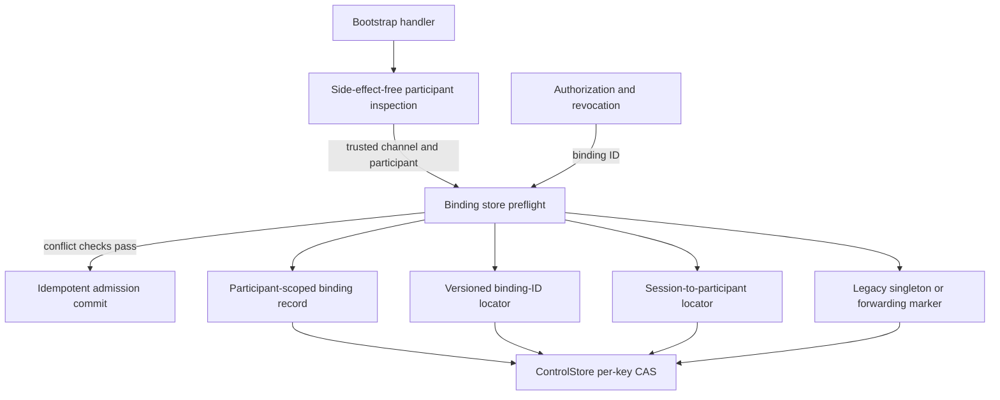
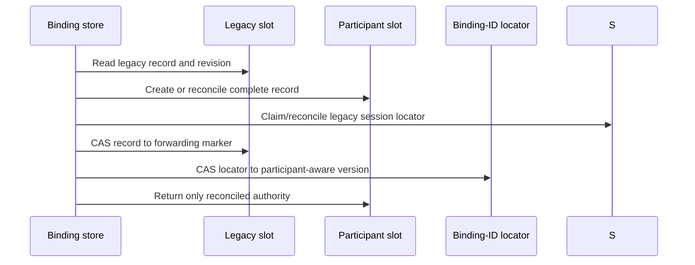
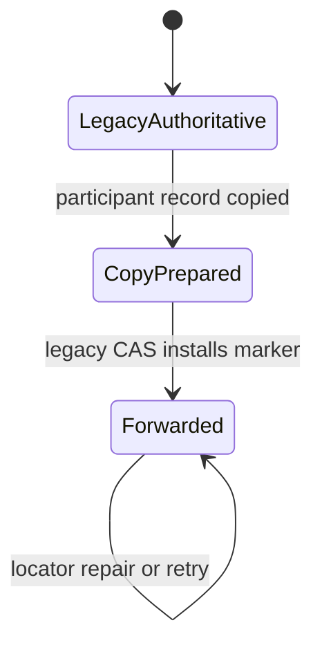

# Multi-Agent Hosted Channel Bindings - Plan

## Goal Capsule

- **Objective:** Let one owner connect multiple verified agent participants to one hosted channel while every binding retains independent generation, revocation, capability, lookup, and authorization state.
- **Authority:** `docs/product/internal-mode/make-external.md` section 3, then `docs/product/internal-mode/executor-decisions.md` items 1–40, then the existing bootstrap security guarantees.
- **Execution profile:** Add a migration-aware binding store, adapt bootstrap admission and capability lookup, update focused tests and the module README, and make no public route or `SessionBinding` wire change.
- **Stop conditions:** Fail closed when legacy migration or binding-index reconciliation is uncertain; do not invent shared authority or silently replace a changed session.
- **Tail ownership:** The implementing agent owns focused tests, typecheck, build, lint, the required wrong-implementation mutation proof, self-review, and PR delivery.

---

## Product Contract

### Summary

Replace the owner-plus-Matrix-room singleton binding key with participant-scoped hosted bindings.
Existing singleton records migrate without losing authority state, and every participant remains independently refreshable and revocable.

### Problem Frame

The current bootstrap reads a singleton owner/channel record before a session-aware, side-effect-free participant lookup exists.
That check rejects a second verified session for the same owner and channel as `binding_conflict`, and later authorization and revocation also recompute the singleton key.

### Requirements

**Binding identity and admission**

- R1. Derive authoritative binding storage from owner ID, Matrix room ID, and the participant ID returned by trusted session inspection and confirmed by admission.
- R2. Resolve the participant for the already verified harness session through a side-effect-free `AgentAdmissionPort` inspection, then admit that exact participant and device only after session and binding conflict checks pass.
- R3. Allow two or more distinct verified sessions for one owner and channel when inspection and admission agree on distinct participant IDs.
- R4. Enforce one admitted participant per owner, channel, harness, and session ID through a durable session locator. Participant, session, and device changes always conflict; a generation change conflicts unless the same participant/session/device binding was revoked and the requested generation is later.

**Persistence and authority isolation**

- R5. Migrate a legacy owner/channel singleton record to its participant-scoped location without losing binding ID, generation, revocation generation, or current capability digest.
- R6. Resolve authorization and revocation through a participant-aware binding-ID locator so refreshing, superseding, replacing, or revoking one binding cannot mutate another binding in the same channel.
- R7. Make session claiming, migration, and duplicate binding creation resumable under `ControlStore`'s per-key compare-and-set semantics and fail closed on malformed or unproven state.

**Compatibility and scope**

- R8. Preserve the existing HTTP routes, finite response codes, sender-constrained adapter scope, public `SessionBinding` version, and one-capability-per-binding supersession rule.
- R9. Keep conversion orchestration, new harness routes, shared capabilities, UI work, agent process launch/termination, and delivery-mode claims outside this change.

### Acceptance Examples

- AE1. Given a legacy active singleton record, the first participant-scoped lookup migrates its complete binding and capability state; authorization remains valid after migration.
- AE2. Given a legacy revoked singleton record, migration preserves its revoked generation, rejects re-bootstrap at or below that generation, and permits only a later-generation replacement with a new binding ID.
- AE3. Given two verified sessions for one owner and channel whose inspection and admission results name different participants, both receive distinct bindings and both current capabilities authorize.
- AE4. Refreshing or revoking participant A supersedes or revokes only A's capability while participant B remains authorized.
- AE5. Two racing bootstrap operations for the same participant/session/device converge on one session locator and binding identity. Participant, session, and device changes remain conflicts; a generation change succeeds only for the same revoked binding identity at a later generation.
- AE6. Replacing the participant-scoped key derivation with the legacy owner/channel key makes the two-participant test fail because the second bootstrap returns `binding_conflict`.

### Scope Boundaries

The change owns `apps/control/src/agent-bootstrap/` persistence, handler integration, focused tests, and the bootstrap README.
It does not add channel conversion, pairing, UI, shared capabilities, or a new public messaging contract.
Terminology remains “channel” in user-facing text; `RoomId` and Matrix-room storage fields remain internal exemptions.

### Sources

- `docs/product/internal-mode/make-external.md`, especially the multi-agent hosted channel binding contract and its wrong-implementation test.
- `docs/product/internal-mode/executor-decisions.md`, especially decisions 9, 24, 33–37.
- `packages/contracts/src/messaging/control-store.ts` for per-key atomicity and unknown-outcome semantics.
- `packages/contracts/src/messaging/identity.ts` for the existing participant-bearing `SessionBinding` contract.
- `apps/control/src/auth/store.ts` for guarded store calls and settled compare-and-set writes.

---

## Planning Contract

### Key Technical Decisions

- KTD1. Add `apps/control/src/agent-bootstrap/store.ts` as the sole owner of binding records, participant-scoped keys, binding-ID locators, legacy migration, and CAS retry behavior. The HTTP handler keeps grant, proof, admission, and response orchestration.
- KTD2. Use two private locators: a versioned binding-ID locator containing `agentParticipantId` for authorization/revocation, and a session locator keyed by owner, channel, harness, and session ID for pre-admission uniqueness. Generation remains binding lifecycle state rather than part of session identity. The public `SessionBinding` shape remains version 1 because its wire fields do not change.
- KTD3. Migrate legacy data with a forwarding marker: copy the complete legacy record to the participant key, reconcile the legacy binding's session locator, atomically replace the legacy slot with a pointer, then reconcile the binding-ID locator. Readers treat the legacy record as authoritative until the pointer lands, follow the pointer afterward, and can finish an interrupted migration. Every competing session claim checks the matching legacy slot before it can win.
- KTD4. Replace the pre-admission singleton decision with two-phase participant inspection and admission. A side-effect-free inspection resolves the channel and participant from the verified session; the handler checks or claims the session locator and applies the participant binding verdict before side-effecting admission. Admission receives that exact participant and a stable operation identity derived from owner, channel, participant, device, harness, session ID, and generation so independent grants for one verified session converge. The provider must atomically refuse commit when its current participant or channel differs from the inspected expectation.
- KTD5. Create the participant binding record before publishing its binding-ID locator. A retry repairs a missing locator before returning authority, while a duplicate race cannot leave an authoritative second binding for the same participant.
- KTD6. Any malformed, mismatched, or unavailable locator/migration state is `unavailable`, never permission to mint, authorize, or revive authority.
- KTD7. Installing the first legacy forwarding marker is a roll-forward schema boundary. The store exposes marker-aware reads independently from a required migration-write activation dependency, whose safe default is disabled. A composition root enables marker writes only after every live reader understands legacy records, markers, and scoped records; mixed-version tests prove disabled instances can read and operate without writing a marker. After activation and the first marker, recovery deploys the same or newer reader rather than rolling back to the singleton-only handler.

### High-Level Technical Design

Binding operations use one participant-aware lookup path:

Legacy migration is ordered so no mutable authority is copied after the legacy slot stops being authoritative:

Interrupted migration converges through three durable states:

### System-Wide Impact and Risks

- Trusted participant identity comes from side-effect-free session inspection and is confirmed by admission; the admission commit remains idempotent and its scoped operation identity includes the verified session, owner, channel, participant, and device.
- Participant inspection must be side-effect free. No device joins the channel until the session locator and existing participant binding have been checked, and independent equivalent grants use one stable admission operation.
- Participant-scoped keys alone do not preserve session uniqueness. The session locator prevents one verified session from silently acquiring a different participant while still allowing another verified session to join as another participant.
- A plain copy-then-index rewrite can split revocation and authorization across records; the forwarding marker is the ordering barrier that prevents stale legacy mutations from winning after migration.
- Migration must reread and reconcile a newer legacy revision when forwarding loses a race with revocation or capability supersession; the copied record cannot become authoritative until that reconciliation succeeds.
- Migration must establish the legacy binding's session locator before forwarding, and every new session claim must consult the legacy slot first, so another participant cannot capture that session during the transition.
- A legacy record for participant A must never block or be claimed by newly admitted participant B; B uses its own scoped key while A remains lazily migratable.
- Binding locators are private persistence metadata. Changing them does not require a `SessionBinding` contract version or website documentation.
- Marker-aware reads ship with migration writes disabled. The composition root activates marker writes only after reader convergence; rollback after the first marker is unsupported and recovery is roll-forward.

---

## Implementation Units

### U1. Add participant-scoped binding persistence and migration

- **Goal:** Encapsulate scoped binding creation, lookup, mutation, index reconciliation, and safe legacy migration.
- **Requirements:** R1, R5–R7; KTD1–KTD3, KTD5–KTD6.
- **Dependencies:** None.
- **Files:** `apps/control/src/agent-bootstrap/store.ts`, `apps/control/src/agent-bootstrap/store.test.ts`.
- **Approach:** Model legacy records, forwarding markers, binding-ID locators, session locators, and their decoders explicitly. Use settled CAS writes for every transition, make participant lookup migrate only a matching legacy participant, and make binding-ID or session lookup repair or follow legacy state before returning a mutable record. Keep marker writes behind a required activation dependency that defaults off while marker-aware reads and ordinary scoped writes remain available.
- **Patterns to follow:** `ControlStore` per-key CAS semantics in `packages/contracts/src/messaging/control-store.ts` and guarded/settled writes in `apps/control/src/auth/store.ts`.
- **Execution note:** Start with failing migration interruption, revocation preservation, locator repair, and duplicate-create race tests.
- **Test scenarios:**
  1. Active legacy migration preserves every `BindingRecord` field and leaves a forwarding marker plus participant-aware locator.
  2. Revoked legacy migration preserves `revokedGeneration` and a null capability.
  3. A legacy record for participant A is not migrated or overwritten while participant B creates an independent record.
  4. Lost or conflicting responses after copy, forwarding, or locator update converge on retry without widening authority.
  5. A deterministic interleaving pauses after the participant copy, mutates legacy revocation and capability state, then proves the forwarding CAS conflicts, recopies the newer state, and only then installs the marker.
  6. A competing participant cannot claim the legacy binding's session while migration is between copy and forward; migration establishes or validates that locator before the marker.
  7. With migration writes disabled, mixed-version operation reads legacy and scoped state but never installs a marker; enabling the gate permits the tested roll-forward transition.
  8. Concurrent session claims and creates for one participant return one authoritative mapping and binding; locator lookup resolves that winner.
  9. The same session cannot claim a second participant, while a distinct session may claim a distinct participant in the same channel.
  10. Malformed or mismatched locators and a missing forwarded target fail closed.
- **Verification:** Store tests prove each durable transition and failure result without depending on HTTP orchestration.

### U2. Integrate participant-aware admission and per-binding authority

- **Goal:** Use the binding store throughout redeem, capability issuance/authorization, and revocation while preserving the existing bootstrap protocol.
- **Requirements:** R2–R4, R6, R8–R9; AE1–AE6; KTD4 and KTD6.
- **Dependencies:** U1.
- **Files:** `apps/control/src/agent-bootstrap/handler.ts`, `apps/control/src/agent-bootstrap/handler.test.ts`, `apps/control/src/agent-bootstrap/README.md`.
- **Approach:** Split `AgentAdmissionPort` into side-effect-free session inspection and an idempotent commit for the inspected participant. Check participant/session binding state before commit, derive commit identity from the verified binding inputs rather than a client redemption ID, use binding-ID lookup for all later mutation/authorization, and update the README from singleton guarantees to per-participant isolation and migration behavior.
- **Patterns to follow:** Existing finite bootstrap errors, DPoP verification, generation/revocation verdicts, capability digest supersession, and route-level test helpers.
- **Execution note:** Implement the two-participant acceptance test before removing the singleton check, then preserve every existing security test.
- **Test scenarios:**
  1. Covers AE3 and AE6. Two sessions admitted as different participants coexist; reverting the scoped-key line makes the second fail with `binding_conflict`.
  2. Covers AE4. Refresh A rejects A's former capability but leaves B authorized; revoking A leaves B authorized.
  3. Covers AE5. Racing independent grants for the same verified session perform one idempotent admission commit, return the same binding identity, and leave only one current capability for that binding.
  4. Same-session participant substitution and same-participant session or device substitutions are refused before admission commit. Admission atomically refuses when commit observes a participant or channel different from inspection. A generation substitution is refused unless the same binding identity was revoked and the new generation is later; a distinct verified session inspected as another participant does not conflict.
  5. Covers AE1 and AE2. Handler authorization, revocation, and later-generation re-arm work through migrated active and revoked legacy records.
  6. Existing one-use grant, proof replay, narrow scope, expiry, owner separation, and finite failure tests stay green.
- **Verification:** Focused handler tests prove route behavior, isolation, the contract mutation guard, and compatibility with existing bootstrap guarantees.

---

## Verification Contract

| Gate | Command | Done signal |
|---|---|---|
| Focused behavior | `pnpm --filter @khala/control test -- src/agent-bootstrap/store.test.ts src/agent-bootstrap/handler.test.ts` | Migration, multi-participant, isolation, race, and existing bootstrap tests pass. |
| Wrong-implementation mutation | `pnpm --filter @khala/control test -- src/agent-bootstrap/handler.test.ts -t "admits distinct participants for one owner and channel"` | Passes normally; fails with the participant component removed from the guarded binding-key derivation, reporting the second bootstrap conflict. |
| Static contract | `pnpm --filter @khala/control typecheck` | The updated admission port, store boundary, and handler compile with no errors. |
| Package build | `pnpm --filter @khala/control build` | The control package builds successfully. |
| Repository policy | `pnpm lint` | ESLint, boundaries, and channel-terminology checks pass. |

Record the exact mutation-test command and observed guarded failure in the PR description and Agent Workpad.

---

## Definition of Done

- Legacy singleton records migrate or resume without losing binding, revocation, or capability state.
- Multiple admitted participants coexist under one owner/channel, and authority changes remain isolated to the targeted binding.
- Duplicate same-participant bootstrap is idempotent; conflicting session/device/generation changes remain refused under the existing re-arm rule.
- Capability authorization and revocation resolve participant-aware state through binding ID and fail closed on inconsistent persistence.
- The public routes, capability scope, `SessionBinding` version, and finite error vocabulary remain compatible.
- Marker-aware readers precede marker writes, and deployment recovery is roll-forward after the first marker is installed.
- The focused suite, mutation proof, typecheck, build, and lint gates pass with exact commands recorded.
- The bootstrap README matches the shipped behavior; no website docs are required because no operator-facing config, CLI, environment variable, or UI surface changes.
- Abandoned migration experiments, unused helpers, temporary fixtures, and debug output are removed from the final diff.
