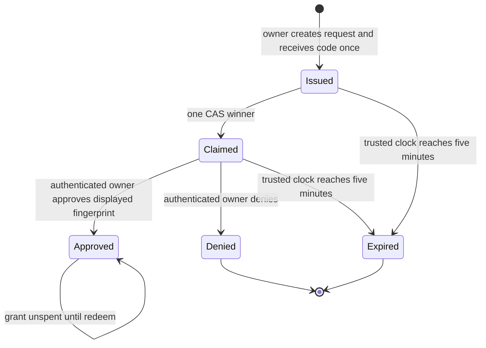
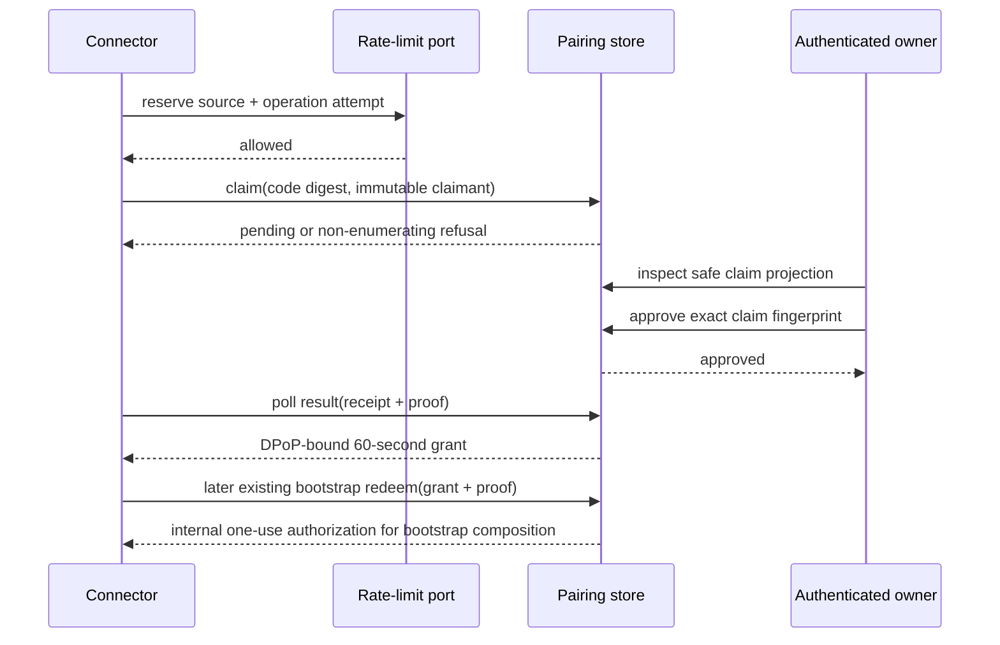

# Pairing Code Control Protocol - Plan

## Goal Capsule

- **Objective:** Add the hosted pairing-code state machine that reserves one evidence-bound connector claim, requires authenticated owner approval, and issues a 60-second sender-constrained grant without treating code possession as admission authority.
- **Authority:** Issue #218, then `docs/product/internal-mode/make-external.md`, then `docs/product/internal-mode/executor-decisions.md`, then current tested control-plane contracts.
- **Stop conditions:** Do not add connector CLI/MCP or UI work, create channels, admit participants, mint long-lived capabilities, persist raw codes, or weaken normal bootstrap/admission checks.
- **Tail ownership:** Ship contracts, control handlers/store/policy, route reservation, adversarial tests, the guarded-line mutation proof, self-review, and CI in one PR.

---

## Product Contract

### Summary

The hosted control plane issues a five-minute pairing code in canonical `XXXXX-XXXXX` form: ten Crockford Base32 symbols plus one separator. One connector key and its submitted session/device evidence may atomically claim it, but only the authenticated owner may approve the displayed claim and release a 60-second DPoP-bound bootstrap authorization.

### Problem Frame

Cross-machine pairing needs a human-entered locator without turning a 50-bit code into owner or channel authority. The protocol must remain finite under guessing, storage failures, response loss, races, expiry, and retries while preserving the existing separation between owner approval, bootstrap redemption, admission, and adapter capability issuance.

### Requirements

**Contracts and lifecycle**

- R1. Define strict version-1 request, claim, owner projection, decision, approval-result, and grant-redemption contracts with finite result codes.
- R2. Generate canonical `XXXXX-XXXXX` Crockford Base32 codes with exactly 50 pseudorandom bits and a five-minute lifetime measured by the injected trusted clock; the same create operation must recover the same code after response loss without persisting plaintext.
- R3. Persist every request's terminal `approved`, `denied`, or `expired` transition through CAS; keep the 256-bit grant lifecycle separate as `unspent`, `spent`, or `expired`, with the 60-second lifetime beginning at approval.

**Authority and secrecy**

- R4. Treat code possession only as permission to attempt one claim; it must never admit, bind, create a capability, approve, deny, or reveal owner/channel details.
- R5. Persist only purpose-separated keyed digests of codes, claim receipts, and grants, and exclude their raw values plus proofs, cookies, and authorization headers from durable records and diagnostics.
- R6. Bind approval, denial, and grant issuance to the exact stored claim shown to the authenticated owner: connector key thumbprint, harness, session ID, generation, device, target channel, canonical hosted origin, descriptor identity, and claim fingerprint.
- R7. Validate claim/result proofs with the existing RFC 9449 semantics, including exact method/URI, key thumbprint, and replay protection; require matching `ath` when the internal bootstrap adapter presents the grant for redemption.

**Concurrency and abuse resistance**

- R8. Atomically move one authoritative record from `issued` to `claimed`; reconcile the winning claimant's exact operation/fingerprint and give every different, invalid, expired, or already-used claimant the same non-enumerating refusal.
- R9. Consult an injected atomic rate-limit port before lookup, enforcing five failed claims per trusted source/network bucket and five per keyed canonical-code handle within five minutes; rotating a client operation ID must not create a fresh budget, unavailable reserve/finalization must fail closed, and a winning reconciliation must not consume a failure.
- R10. Preserve one-winner semantics for concurrent grant redemption through an internal port that exposes a bounded authorization to downstream bootstrap/admission composition, never a second public redeem route, direct admission, or a long-lived capability.

### Acceptance Examples

- AE1. Given two claimants synchronized after observing the same live issued request, when both attempt the transition, exactly one succeeds and only that winner's identical retry reconciles.
- AE2. Given a valid claimed code without owner approval, when the claimant polls or redeems, no grant, binding, admission, or capability is produced.
- AE3. Given the displayed claim changes or a stale claim fingerprint is approved, the owner decision is refused and no grant is minted.
- AE4. Given rate-limit storage throws or returns unavailable, claim returns one finite operational refusal and the pairing store receives no read.
- AE5. Given a grant bound to connector key A, the internal bootstrap adapter cannot redeem it with key B or bearer-only presentation; one valid redeem wins and all later redeems report the same spent result.
- AE6. Given a lost create, claim, decision, approved-result, or internal redeem response, the same operation recovers the same safe result without a second live request, a different grant, or a second spend.

### Scope Boundaries

- Connector CLI/MCP, native-session inspection, and device reservation belong to `pairing-code-connector`.
- Hosted approval UI belongs to `pairing-approval-ui`; this change supplies only the safe projection and authenticated routes it consumes.
- Channel creation, participant admission, binding creation, and adapter capabilities remain downstream bootstrap/admission responsibilities.
- The pairing endpoint is hosted; no internal server becomes remotely reachable.

---

## Planning Contract

### Key Technical Decisions

- KTD1. Use a runtime-injected versioned keyring with one active identifier, at least 32 bytes per key, and bounded retained keys. A purpose-separated keyed PRF derives 50 pseudorandom code bits from the canonical authenticated creation tuple `(owner, target channel, canonical origin, descriptor identity, client operation)` for response recovery, maps the canonical code to an opaque request handle, and derives claim receipts plus code/grant digests. Records carry only the key identifier and digests; lookup tries the bounded live key set, startup rejects invalid key material, and raw secrets are never retained.
- KTD2. Address one authoritative `ControlStore` request record by the opaque HMAC-derived request handle returned to the owner and recomputed from the presented code. Perform every lifecycle transition by compare-and-set against that record's exact revision; there is no cross-key request index in the correctness path.
- KTD3. Store business expiry inside the durable request record rather than physically expiring it. Every issued/claimed transition samples trusted time immediately before CAS; `now >= expiresAt` first CASes the record to `expired`, and every conflict re-reads and re-evaluates time, so no stale writer can revive a request after expiry was observed.
- KTD4. The rate-limit port owns atomic multi-instance source and canonical-code-handle budgets through leased, operation-bound reserve/finalize permits. The handler derives the source bucket only from trusted platform metadata, reserves both buckets atomically before lookup, reconciles the same permit on retry, counts it against the cap until idempotent finalization or five-minute lease expiry, finalizes invalid/different-claim outcomes as failures, releases successful or winning-retry permits, and maps any unavailable step to a fixed refusal.
- KTD5. Reuse `apps/control/src/agent-bootstrap/proof.ts` for signature, target, freshness, key, and token-hash validation, then atomically claim an expiring `(jkt, jti)` replay record before any pairing read or effect. DPoP does not bind request JSON, so approval uses only the immutable stored claim and owner-approved fingerprint.
- KTD6. Approval is one CAS on the authoritative request record and stores its timestamp plus approved revision; it does not write a grant record. The first authorized result poll rederives the same 256-bit grant from that approval, creates its digest-keyed record idempotently, and returns it; any failure between those steps is recoverable by the same result operation. An internal `PairingGrantPort.redeem` atomically records the stable redeem operation and bounded `PairingBootstrapAuthorization` before returning it, so a lost response reconciles without a second spend. The authorization is bound to owner, channel, origin, descriptor, key, device, session, and claim. The later `pairing-code-connector` bootstrap adapter calls this port from the existing bootstrap redeem flow; this PR exposes no second public redeem route and invokes no admission, binding, or capability port.
- KTD7. Reserve exact agent and human pairing routes through optional dependency factories. Dependencyless production discovery returns fixed `feature_unavailable` handlers until the composition root supplies live ports, matching the existing control-route convention.
- KTD8. The control service treats session identity as connector-inspected evidence bound into the claim; it validates structure, operation, origin/descriptor, and DPoP key but does not independently attest a remote native session. `pairing-code-connector` owns `SessionInspectionPort` and submits its canonical evidence digest. Human projections label it connector-verified rather than server-attested, and owner approval remains mandatory against arbitrary compatible clients.
- KTD9. Derive a 256-bit claim receipt under its own PRF purpose from the winning operation and immutable fingerprint, retain only its keyed digest, and return the same receipt to an identical winning retry. The result route requires both receipt and the winning DPoP key; random receipt probes use one fixed invalid result.

### High-Level Technical Design

### Finite Route Results

| Route | Success/result states | Fixed failures |
|---|---|---|
| `POST /api/human/pairing/request` | `issued` with request handle, code, and expiry; identical operation recovers it | `invalid_request`, `signed_out`, `forbidden`, `conflict`, `unavailable` |
| `POST /api/agent/pairing/claim` | `pending` with DPoP-bound claim receipt; identical winner recovers it | `claim_refused` for absent/expired/used/different claimant, `rate_limited`, `invalid_proof`, `unavailable` |
| `POST /api/agent/pairing/result` | `pending`, `approved` with the same live grant, `denied`, or `expired` | `invalid_receipt`, `invalid_proof`, `unavailable`; an expired approved grant is terminal and never reissued |
| `GET /api/human/pairing/request?request_id=...` | Safe immutable owner projection for `claimed`, `approved`, `denied`, or `expired` | `signed_out`, `forbidden`, `not_found`, `unavailable` |
| `POST /api/human/pairing/decision` | Idempotent identical terminal decision bound to claim fingerprint | `signed_out`, `forbidden`, `stale_claim`, `decision_conflict`, `expired`, `unavailable` |
| Internal `PairingGrantPort.redeem` | One `PairingBootstrapAuthorization` for the existing bootstrap flow | `invalid_grant` for absent/expired/spent, `invalid_proof`, `unavailable` |

All bodies carry `v: 1`. Malformed or unsupported-version input is `invalid_request`; no response includes bucket counts, owner/channel facts on an agent refusal, provider revisions, exception text, or raw authentication material.

### Risks and Dependencies

- `ControlStore` is atomic only per key; a split authoritative request/code model would recreate the required wrong implementation.
- Approval and grant creation are intentionally ordered across records: the approved request revision is authoritative, while a missing/ambiguous derived grant record is safely recreated before disclosure and can never precede approval.
- Keyed deterministic creation and approved-result derivation make response recovery depend on keyring continuity; each retired key remains available only until its last five-minute request and 60-second grant has expired.
- Creating `apps/control/src/composition/human/handlers.ts` changes the `/api/human/` discovery prefix from absent to present; dependencyless fallbacks and route-manifest tests must cover every reserved path.
- The rate-limit provider is an injected, unproven deployment dependency. This PR proves fail-closed behavior and port conformance, not production-provider availability.
- Pairing grant semantics must not drift from existing bootstrap DPoP behavior; shared proof validation and matching spend-before-effect tests are mandatory.

---

## Implementation Units

### U1. Add strict pairing contracts and security policy

- **Goal:** Establish versioned public shapes, canonical code policy, keyed digesting, claim fingerprints, finite failures, and the attempt-limit boundary.
- **Requirements:** R1–R7, R9.
- **Dependencies:** None.
- **Files:** `packages/contracts/src/messaging/pairing.ts`, `packages/contracts/src/messaging/pairing.test.ts`, `packages/contracts/src/messaging/index.ts`, `apps/control/src/pairing/policy.ts`, `apps/control/src/pairing/policy.test.ts`.
- **Approach:** Build exact-field decoders with current contract primitives; keep raw secrets out of every projection; use unbiased Crockford generation and an injected bounded keyring; define an atomic source/code-handle rate-limit port with fixed outcomes.
- **Test scenarios:** Valid shapes round-trip; unknown fields, unsupported versions, unsafe generations, malformed timestamps, invalid state/field combinations, ambiguous code characters, short/invalid key material, and secret-bearing projections fail; exact entropy, grouping, exact creation-tuple recovery/conflict, operation-ID rotation resistance, equivalent code formatting, key rotation inside and outside the live window, purpose separation, route-result matrix, concurrent last limiter slot, trusted bucket derivation, winning-retry charging, crash/lost-finalize permit reconciliation, and unavailable reserve/finalize outcomes pass.
- **Verification:** Contracts and control policy tests plus typechecks pass with no new package-boundary exception.

### U2. Implement the durable one-winner state machine

- **Goal:** Persist request/grant state without raw secrets and reconcile claim, decision, expiry, and redemption under races and ambiguous writes.
- **Requirements:** R2–R6, R8, R10; AE1–AE3, AE5.
- **Dependencies:** U1.
- **Files:** `apps/control/src/pairing/store.ts`, `apps/control/src/pairing/store.test.ts`.
- **Approach:** Use one HMAC-addressed CAS request record, stable operation/fingerprint bytes for retries, trusted-time terminal projection, CAS decisions, approved-revision grant rederivation, idempotent digest-keyed grant creation, atomic proof-replay records, and spend-before-return internal redemption.
- **Test scenarios:** Barrier-synchronize two claimants and require one winner; retry create and the winning claim plus receipt after lost/ambiguous responses; collapse loser/invalid/expired/used results; linearize expiry by racing a pre-deadline claim/approval read against an expiry CAS; reconcile identical decisions while refusing opposite decisions; refuse stale approve/deny fingerprints without changing state; race approval against expiry and denial against approval; prove both decisions bind owner, channel, origin, descriptor, key, device, session evidence, and receipt fields; verify the grant carries 256 pseudorandom bits; recover the same grant on result retry, refuse late reissue, reconcile a lost internal redeem response without a second spend, race grant redeems, retain terminal request projections, and inspect every key/value/diagnostic fixture for raw code, receipt, and grant absence.
- **Verification:** The store test proves the CAS guard, reconciliation, terminal projections, and secret absence independently of HTTP.

### U3. Expose authenticated finite routes and register them safely

- **Goal:** Provide agent claim/result and human create/inspect/decision routes plus the internal grant-redemption port without widening authority or leaking existence.
- **Requirements:** R1, R4–R10; AE2–AE5.
- **Dependencies:** U1–U2.
- **Files:** `apps/control/src/pairing/handler.ts`, `apps/control/src/pairing/handler.test.ts`, `apps/control/src/composition/agent/handlers.ts`, `apps/control/src/composition/agent/handlers.test.ts`, `apps/control/src/composition/human/handlers.ts`, `apps/control/src/composition/human/handlers.test.ts`, `apps/control/src/runtime/discover.test.ts`.
- **Approach:** Authorize create against the signed-in owner's target channel, require that owner for inspect/decision, require the winning DPoP key and claim receipt for result, validate and replay-claim exact-target DPoP on agent routes, enforce the limiter before lookup, map the literal route table to no-store JSON, and reserve immutable unavailable registrations when dependencies are absent.
- **Test scenarios:** A valid code without approval yields no grant; code/claim input cannot select or change owner, channel, canonical origin, or descriptor; cross-owner inspect/decision, changed target, missing CSRF, stale displayed claim, wrong operation/key/receipt/target/token hash, random receipt probing, replayed proof, malformed body, unavailable limiter reserve/finalize, unavailable proof/store dependencies, and thrown dependencies all fail safely; invalid/expired/used codes are observationally equivalent; result recovery belongs only to the winning operation/key; the internal grant port calls no admission, binding, or capability port; route discovery emits the exact human/agent paths and methods.
- **Verification:** Handler, composition, discovery, contract, and package-boundary tests pass and sanitized logs contain no request secrets or exception text.

---

## Verification Contract

| Gate | Applicability | Done signal |
|---|---|---|
| Pairing contract tests | U1 | Exact versioned shapes and state invariants accept/reject deterministically |
| Pairing policy/store/handler tests | U1–U3 | Lifecycle, auth, limiting, DPoP, races, expiry, and secrecy scenarios pass |
| Guarded-line mutation proof | U2 | Reverting the claim CAS guard makes the synchronized two-claim test fail; restoring it makes the same command pass |
| `pnpm --filter @khala/contracts test` and `pnpm --filter @khala/contracts typecheck` | U1 | Contract package is green |
| `pnpm --filter @khala/control test` and `pnpm --filter @khala/control typecheck` | U1–U3 | Control package is green |
| `pnpm lint`, `pnpm typecheck`, and `pnpm build` | All | Repository lint, boundaries, terminology, compile, and generated route build are green |
| Full `pnpm test` in CI | All | Full repository, conformance, and end-to-end suites are green on the exact PR head |

---

## Definition of Done

- Pairing codes contain ten unbiased Crockford Base32 symbols in the eleven-character rendered form `XXXXX-XXXXX`; they are five-minute, keyed-digest-only locators whose possession grants no owner, channel, admission, binding, or capability authority.
- Exactly one immutable connector claim wins atomically, the winner reconciles by stable operation/fingerprint, and other claimants receive the same finite non-enumerating refusal.
- Authenticated owner approval/denial binds the displayed stored claim; denial and expiry are terminal and mint no grant.
- Approved grants are 256-bit, DPoP-bound, expire after 60 seconds, and become spent only through one successful, response-reconcilable internal redemption into `PairingBootstrapAuthorization` for the existing bootstrap flow.
- Rate-limit unavailability fails closed before pairing lookup, and tests cover both source and operation budgets without claiming an unproven production provider.
- Agent and human routes are reserved with safe dependencyless fallbacks, all scoped local gates pass, the guarded-line mutation proof is recorded with exact failing and passing commands, and abandoned implementations are absent from the diff.
