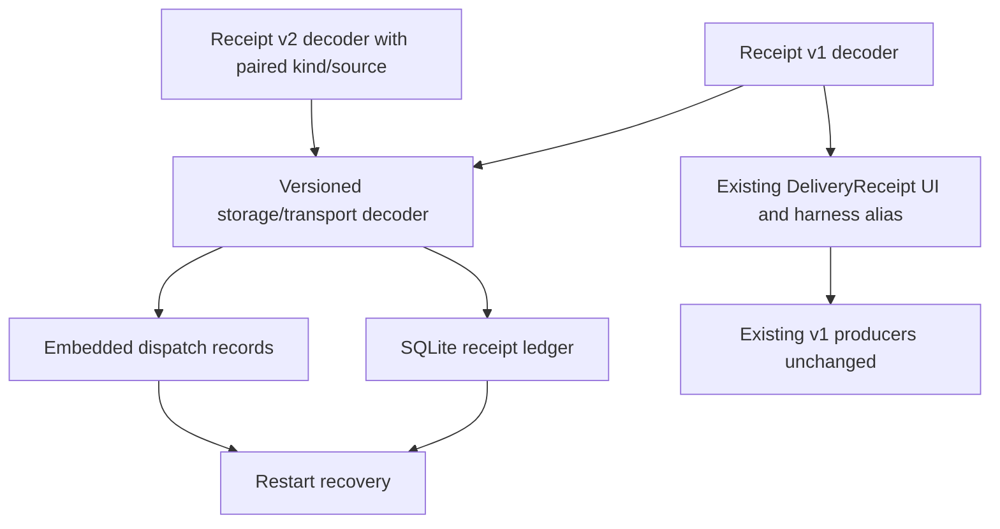

# Versioned Delivery Receipts - Plan

## Goal Capsule

- **Objective:** Add explicit delivery receipt v1/v2 contracts and make connector persistence and dispatch preserve either version before any producer emits v2.
- **Authority:** Issue #226, then `docs/product/internal-mode/read-receipts.md`, then `docs/product/internal-mode/executor-decisions.md`, then current tested contracts.
- **Stop conditions:** Do not widen the existing UI/harness v1 aliases, add acknowledgement production, change capability ownership, or reinterpret persisted v1 receipts.
- **Tail ownership:** Update contract fixtures and connector restart coverage, prove each guarded wrong implementation fails, and pass repository verification plus CI.

---

## Product Contract

### Summary

Delivery receipts gain explicit v1 and v2 shapes. Version 2 adds the closed `agent_acknowledged` kind and `agent` source as an inseparable pair, while current UI and harness-facing aliases remain v1-only until their owning follow-up tickets adopt the versioned union.

### Problem Frame

The current decoder, SQLite receipt ledger, recovery report, and embedded dispatch records accept only v1. Producing an acknowledgement receipt before every consumer can decode and preserve v2 would turn a truthful immutable fact into corruption, promotion, or data loss after restart.

### Requirements

**Contract compatibility**

- R1. Export explicit v1 and v2 receipt types and decoders while preserving `DeliveryReceipt`, `ReceiptKind`, and `decodeDeliveryReceipt` as v1-only compatibility APIs.
- R2. Reject `agent_acknowledged` and source `agent` in v1; in v2 require `agent_acknowledged` if and only if the source is `agent`, with a non-null shared evidence reference and no error code.
- R3. Export a separately named storage/transport union and decoder that preserve the decoded version without defaulting, promotion, or fallback.

**Persistence and dispatch**

- R4. Store and reload mixed receipt versions without changing version, field values, evidence references, or first-observation timestamps; exact duplicate v2 writes return the original fact and changed facts conflict.
- R5. Preserve v1 and v2 receipts embedded in durable dispatch records, and treat `agent_acknowledged` as dispatch evidence but not terminal completion.

**Rollout safety**

- R6. Keep every production receipt producer and harness capability on the v1 contract in this ticket.
- R7. Add canonical fixtures and focused tests whose guarded lines fail when version or acknowledgement/source invariants are removed.

### Scope Boundaries

- No acknowledgement token, batch, cursor, outbox, capability, UI, or receipt producer is added.
- No stored v1 row is migrated or rewritten as v2.
- Existing browser and harness consumers continue importing the v1-only compatibility names.

---

## Planning Contract

### Key Technical Decisions

- KTD1. Compatibility names remain v1-only; persistence and transport opt into an explicitly named versioned union. This prevents an early UI or harness widening from silently claiming v2 support.
- KTD2. Version-specific decoders are strict and the union decoder dispatches only on the explicit `v` discriminator. Unknown versions fail closed.
- KTD3. The v2 TypeScript shape and runtime decoder both encode the bidirectional `agent_acknowledged`/`agent` invariant.
- KTD4. SQLite continues storing canonical JSON text with no schema migration. Successful first and duplicate writes return the canonical stored fact; duplicate identity is the exact receipt JSON already persisted, so restart cannot regenerate immutable fields.
- KTD5. Durable dispatch records may preserve acknowledgement evidence, but generic harness/observer inputs remain v1-only so only the later authenticated acknowledgement path can originate an agent receipt. Recovery treats a stored acknowledgement as dispatch evidence, never as completion.

### High-Level Technical Design

### Risks and Dependencies

- A union accidentally substituted for `DeliveryReceipt` would widen UI and harness contracts before their owning tickets; exhaustive imports and typecheck guard that boundary.
- Decoding a stored v2 row with the v1 decoder would surface healthy state as corruption; both ledger rows and embedded dispatch JSON need restart tests.
- Omitting acknowledgement from recovery dispatch evidence would classify an acknowledged release as undispatched and permit unsafe resubmission.

---

## Implementation Units

### U1. Define explicit receipt versions and fixtures

- **Goal:** Establish strict version-specific contracts plus the opt-in storage/transport union without widening compatibility aliases.
- **Requirements:** R1–R3, R6, R7; KTD1–KTD3.
- **Dependencies:** None.
- **Files:** `packages/contracts/src/delivery/receipts.ts`, `packages/contracts/src/delivery/index.ts`, `packages/contracts/src/delivery/README.md`, `packages/contracts/fixtures/delivery/exact-release.json`, `packages/contracts/fixtures/delivery/invalid.json`, `packages/contracts/fixtures/delivery/views.json`, `packages/contracts/src/delivery/fixtures.test.ts`, `packages/contracts/src/delivery/harness.test.ts`.
- **Approach:** Keep existing names pinned to v1, add explicit v1/v2 vocabulary and decoders, encode the pairing in both the v2 type and decoder, and expose one union for storage and transport consumers.
- **Execution note:** Add failing version and pairing fixtures before changing the decoder.
- **Test scenarios:** v1 and v2 canonical fixtures round-trip byte-stably; each version-specific decoder rejects the other version; compile-time negative assertions keep `DeliveryReceipt`/`ReceiptKind` v1-only while the versioned union accepts v2; v1 rejects the new kind and source; v2 rejects a harness-sourced acknowledgement and an agent-sourced non-acknowledgement; both versions retain the existing failed/outcome-unknown error-code rules; unknown versions and extra content fields fail closed.
- **Verification:** Contract tests prove every accepted value retains its version and every invalid pairing fails at the guarded field.

### U2. Preserve mixed versions in the application ledger and recovery

- **Goal:** Make standalone receipt storage retain immutable v1/v2 facts across duplicate writes and restart.
- **Requirements:** R3–R5, R7; KTD2, KTD4, KTD5.
- **Dependencies:** U1.
- **Files:** `packages/connector/src/storage/ledger.ts`, `packages/connector/src/storage/recovery.ts`, `packages/connector/src/storage/fixtures/fakes.ts`, `packages/connector/src/storage/ledger.test.ts`.
- **Approach:** Widen only ledger receipt inputs/outputs to the versioned union, decode stored rows with its strict decoder, return the canonical fact on first and duplicate writes, keep canonical JSON equality as the idempotency fence, and add acknowledgement to non-terminal dispatch evidence.
- **Execution note:** Characterize raw stored JSON and reopened reads before changing persistence types.
- **Test scenarios:** A v1 row remains v1 after a mixed-version restart; a v2 acknowledgement retains identical serialized bytes, timestamp, source, and evidence reference; an exact v2 repeat returns the originally stored fact before and after restart without advancing the ledger; the same receipt ID with a changed immutable field conflicts; recovery classifies acknowledgement-only evidence as outcome unknown rather than undispatched.
- **Verification:** Ledger tests close and reopen the real SQLite store, compare canonical bytes before and after, and prove no schema migration or receipt regeneration occurs.

### U3. Preserve versioned receipts embedded in dispatch records

- **Goal:** Make dispatch decoding, reconciliation, and durable embedded records accept and preserve the versioned union while v1 producers remain unchanged.
- **Requirements:** R3, R5–R7; KTD1, KTD3, KTD5.
- **Dependencies:** U1.
- **Files:** `packages/connector/src/dispatch/types.ts`, `packages/connector/src/dispatch/reconcile.ts`, `packages/connector/src/storage/dispatch.ts`, `packages/connector/src/dispatch/fixtures/fakes.ts`, `packages/connector/src/dispatch/reconcile.test.ts`, `packages/connector/src/storage/dispatch.test.ts`.
- **Approach:** Widen durable receipt-bearing dispatch records to the union and use the union decoder for embedded JSON, while keeping generic harness/observer inputs on the v1 decoder so they reject `source: agent`. Preserve acknowledgement evidence as accepted rather than terminal when a trusted internal path stores it in a record.
- **Test scenarios:** A generic observer refuses a correlated v2 acknowledgement without changing state; invalid v2 pairings are refused; a trusted transaction can preserve a dispatch record containing both receipt versions unchanged after SQLite restart; duplicate acknowledgement evidence is idempotent without completing the job; a changed fact under an existing receipt ID conflicts.
- **Verification:** Dispatch unit and durable-storage tests prove state semantics, exact record preservation, and continued v1 producer typing.

---

## Verification Contract

| Gate | Applicability | Done signal |
|---|---|---|
| Focused contract Vitest run | U1 | Version, fixture, pairing, and compatibility tests pass |
| Focused connector Vitest run | U2–U3 | Ledger, recovery, reconciliation, and durable dispatch restart tests pass |
| Wrong-implementation mutation runs | U1–U3 | Reverting each guarded invariant or union decoder line makes its named focused test fail |
| `pnpm typecheck` | All | Existing UI/harness consumers compile on v1 aliases and connector union consumers compile |
| `pnpm lint` | All | Repository lint, boundaries, and terminology checks pass |
| `pnpm build` | All | Contracts, connector, and downstream packages build |

### Wrong-implementation mutation matrix

| Guarded invariant | Named test | Exact focused command | Required failure after reverting the guard |
|---|---|---|---|
| V1 compatibility aliases exclude acknowledgement/agent at compile time | Negative type assertions beside `keeps the compatibility receipt aliases v1-only` | `pnpm --dir packages/contracts typecheck` | A widened alias makes an expected type error disappear and fails the unused assertion guard |
| V1 runtime vocabularies reject acknowledgement/agent | Invalid receipt fixture cases | `pnpm --dir packages/contracts exec vitest run --config ../../vitest.config.ts src/delivery/fixtures.test.ts` | A forbidden v1 value no longer returns the expected invalid field |
| V2 acknowledgement requires source agent | `rejects invalid v2 acknowledgement/source pairings` | `pnpm --dir packages/contracts exec vitest run --config ../../vitest.config.ts src/delivery/harness.test.ts` | Harness-sourced `agent_acknowledged` decodes successfully |
| V2 source agent requires acknowledgement | `rejects invalid v2 acknowledgement/source pairings` | `pnpm --dir packages/contracts exec vitest run --config ../../vitest.config.ts src/delivery/harness.test.ts` | Agent-sourced non-acknowledgement decodes successfully |
| Versioned decoder dispatches strictly on `v` without promotion | `round-trips explicit receipt versions without promotion` | `pnpm --dir packages/contracts exec vitest run --config ../../vitest.config.ts src/delivery/fixtures.test.ts` | A v1 value returns as v2, a v2 value returns as v1, or an unknown version succeeds |
| Duplicate storage returns the existing canonical fact | `preserves mixed receipt versions and immutable duplicates across restart` | `pnpm --dir packages/connector exec vitest run --config ../../vitest.config.ts src/storage/ledger.test.ts` | A duplicate returns retry-supplied fields, changes stored bytes, or advances the ledger revision |
| Embedded dispatch storage decodes the versioned union without widening the generic observer | `preserves mixed-version dispatch receipts across restart` and `refuses agent receipts at the generic observer boundary` | `pnpm --dir packages/connector exec vitest run --config ../../vitest.config.ts src/storage/dispatch.test.ts src/dispatch/reconcile.test.ts` | Reopened v2 data is corrupt/lost, or an untrusted observer-originated acknowledgement changes dispatch state |

---

## Definition of Done

- Explicit v1/v2 decoders and the versioned storage/transport union satisfy every closed vocabulary and pairing rule.
- Compatibility APIs and all production producers remain v1-only.
- Standalone SQLite rows and embedded dispatch records preserve mixed versions and immutable fields across restart.
- First and duplicate v2 writes return the canonical stored fact; changed facts conflict; acknowledgement is dispatch evidence but not completion.
- Focused mutation checks, typecheck, lint, build, and CI are green, and abandoned implementation experiments are absent from the diff.
