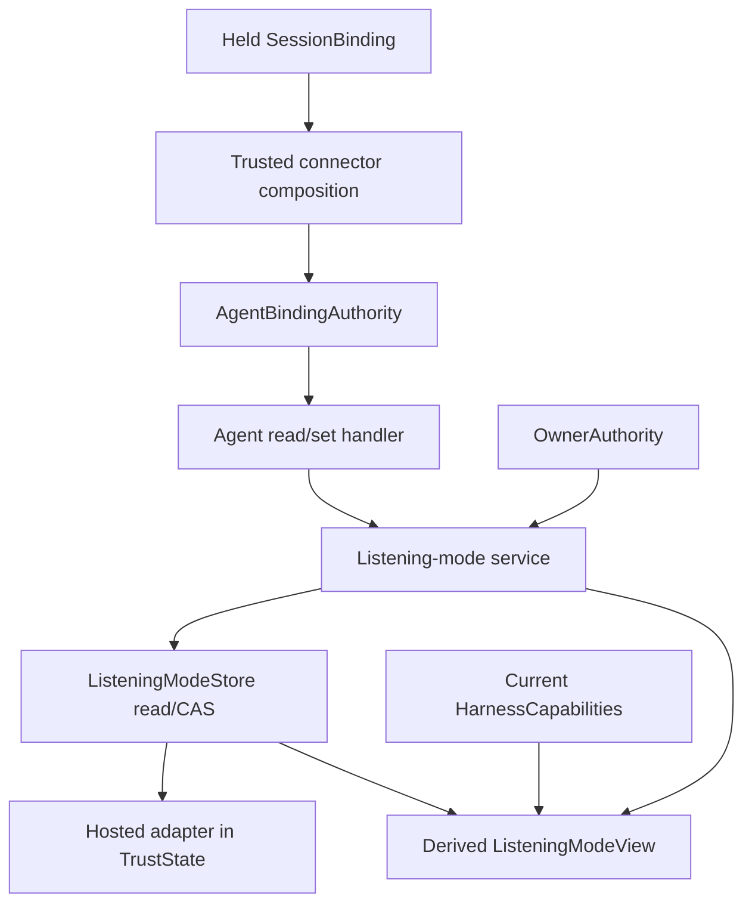
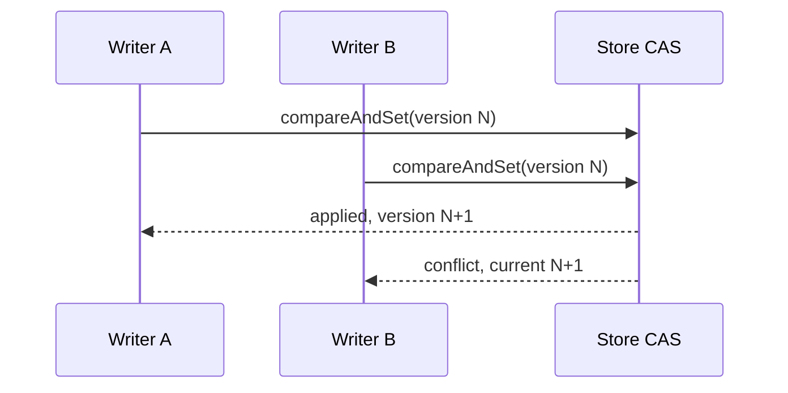
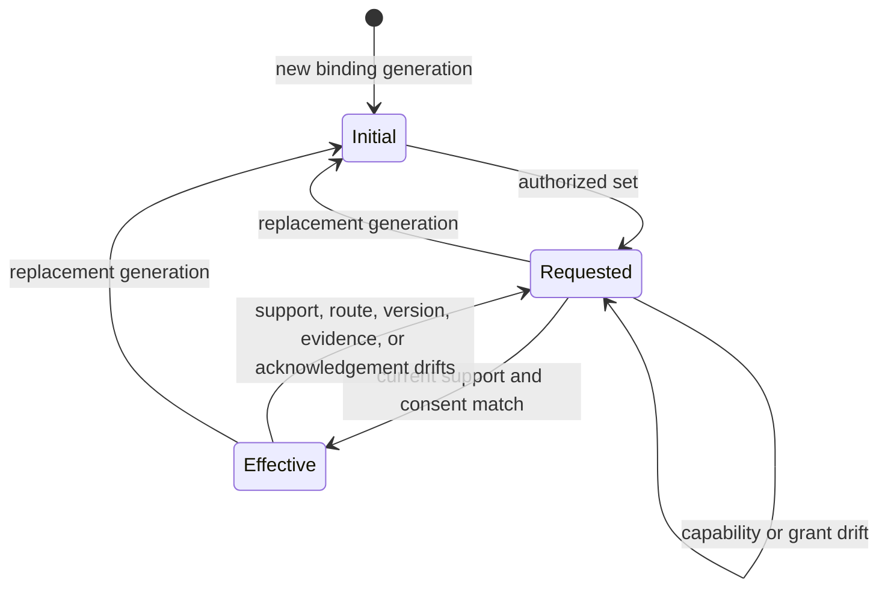

# feat: Persist listening-mode control

## Goal Capsule

- **Objective:** Persist versioned listening-mode choices and owner grants behind one binding/generation-keyed CAS port, with a hosted adapter in `TrustState` and a narrow authenticated agent application seam.
- **Authority:** `docs/product/internal-mode/executor-decisions.md` items 1-40 override `docs/product/internal-mode/listening-modes.md`; issue #193 and the CODEOWNER follow-up additionally require kind-aware hard-cancel matching and a mode-consistent owner grant command.
- **Execution profile:** Correct the contract first, add the reusable store/service second, then embed the hosted adapter and bind read/set in parallel.
- **Stop conditions:** Do not add SQLite, harness delivery, dispatch, CLI/MCP/UI surfaces, receipts, or agent-process lifecycle behavior.
- **Tail ownership:** This ticket owns focused verification, both required wrong-implementation mutations, the draft PR, self-review, and CI handoff against `main`.

---

## Product Contract

### Summary

Listening-mode control is mutable state for one exact agent binding generation. The store persists requested mode, its independent version, exact experimental-route and hard-cancel grants, and durable command idempotency. Effective mode and support remain projections of current `HarnessCapabilities`, so capability drift may make the requested mode ineffective without rewriting the stored request.

### Problem Frame

The merged listening-mode value contract has no persistence boundary or authenticated agent mutation seam. Without a single CAS port, hosted and future SQLite implementations could diverge on races, retries, rebinds, and grant invalidation. Without a composition-injected authority, an agent-facing request could target another binding or gain access to owner-only grants.

### Requirements

**Store and state**

- R1. Define one `ListeningModeStore` read/CAS port keyed by exact `bindingId` and generation, with explicit applied, conflict, idempotency-conflict, and unavailable outcomes.
- R2. Persist requested mode, independent control version, separate experimental-route and hard-cancel grants, and command idempotency data; never persist effective mode or copied capability support.
- R3. Make identical command retries return their durable first outcome, changed reuse of a command ID fail, and two writes at one expected version yield exactly one winner.
- R4. Embed the hosted adapter's durable state in `TrustState`, preserve it across reconstruction, and install capability-selected fresh state with empty grants and journal for a replacement generation.

**Mode and grant service**

- R5. Let either exact `AgentBindingAuthority` or matching `OwnerAuthority` read and set a mode through the same CAS path; trusted composition supplies authoritative binding ID, generation, owner ID, and current status, and the service rejects cross-binding, stale-generation, stale-version, revoked, or mismatched-owner requests before reading or journaling store state.
- R6. Let only matching `OwnerAuthority` create or revoke experimental-route and hard-cancel grants, with independent grant collections and exact binding, mode, route, harness-version, and evidence-revision identity.
- R7. Recompute `ListeningModeView` from current capabilities on every read. Unsupported, unknown, wrapper-blocked, missing experimental consent, or missing async acknowledgement makes `effective` null with an actionable reason but does not rewrite `requested` or delete grants. A missing capability snapshot returns the same fail-closed view with synthetic unknown support and a capability-unavailable reason; it never persists that projection.

**Agent boundary and merged-contract repair**

- R8. Define non-decodable `AgentBindingAuthority` from the connector's held binding and expose only read/set through the connector agent application port; grant/revoke methods must be unreachable from that façade.
- R9. Add `mode` to `OwnerRouteGrantCommand` and its strict decoder. Make `routeGrantMatches` require the expected grant kind so both hard-cancel and experimental-route grants can match only their own checks.
- R10. Prove hosted restart, CAS race, command idempotency, rebind, capability/grant drift, owner/agent parity for set, and authority isolation with focused tests and the ticket's two mutation reversions.

### Scope Boundaries

- No local SQLite adapter or schema; `local-sqlite-channel-store` will consume the reusable port and conformance suite.
- No dispatch claims, wake/pause scheduling, harness invocation, hard-cancel actuation, or receipts.
- No CLI, MCP, browser, or agent-skill surface.
- No capability evidence duplicated outside `HarnessCapabilities` and no listening-mode fields added to immutable `SessionBinding`.

---

## Planning Contract

### Key Technical Decisions

- KTD1. The port owns CAS and durable operation identity. The service does not use an in-memory mutex or private retry cache, so every adapter must prove the same race and restart semantics.
- KTD2. `TrustState` embeds hosted listening-mode control and its command journal. The hosted adapter receives the hosting layer's one atomic `TrustState` snapshot/CAS seam with an independent opaque aggregate revision; both listening-mode and trust-policy writes must use that seam, so reconstruction adds neither a second state model nor shared domain versions.
- KTD3. `AgentBindingAuthority` mirrors `OwnerAuthority`: it is a type-only contract with no decoder. Trusted connector composition derives it only from the held `SessionBinding`, resolves an authoritative binding context containing binding ID, generation, owner ID, and current status, and request JSON never carries authority or binding context.
- KTD4. The connector package depends only on contracts and an injected application port. Policy wiring occurs under `apps/connector/src/composition/`, the only layer allowed to connect implementation packages.
- KTD5. Grant validity compares an explicit expected kind plus exact binding generation, mode, route, harness version, evidence revision, and grant revision. This fixes hard-cancel matching without letting one grant kind authorize the other.
- KTD6. Capability projection is read-time only. Experimental support requires matching experimental consent, and async additionally requires `batch_token_next_call`; hard-cancel grants never enable a listening mode.

### High-Level Technical Design

### Risks and Dependencies

- A permissive grant-kind repair could let experimental consent authorize cancellation. Tests must pass the expected kind explicitly and exercise both cross-kind refusals.
- `TrustState` construction and rebind helpers have many tests and fakes. Every initializer must receive the new embedded field, and replacement generation must clear grants and journal atomically.
- Non-composition connector code cannot import `@khala/policy`; `pnpm check:boundaries` is a required gate.
- Command idempotency must survive state reconstruction. Service-memory caching is insufficient even if focused happy-path tests pass.

---

## Implementation Units

### U1. Repair grant command and matching contracts

- **Goal:** Make owner grant commands mode-complete and both grant kinds matchable without cross-kind authority.
- **Requirements:** R9.
- **Dependencies:** None.
- **Files:** `packages/contracts/src/delivery/listening-mode.ts`, `packages/contracts/src/delivery/listening-mode.test.ts`, `packages/contracts/src/delivery/index.ts`.
- **Approach:** Add the missing command mode to the strict wire codec, introduce expected-kind input to grant matching, and compare every exact identity field.
- **Patterns to follow:** Strict codec and authority surfaces in `packages/contracts/src/delivery/commands.ts`; substitution coverage in `packages/contracts/src/delivery/commands.test.ts`.
- **Test scenarios:** Decode all four owner grant command kinds with mode; reject missing/invalid/extra mode fields; match experimental and hard-cancel grants against their own expected kinds; refuse both cross-kind combinations; invalidate on binding, generation, grant revision, mode, route, harness version, and evidence revision drift.
- **Verification:** Contracts tests and typecheck pass, and the entire test tree contains no stale call using the old matcher input shape.

### U2. Add the reusable store and mode/grant service

- **Goal:** Establish one adapter-neutral persistence and authorization contract for all mode and grant changes.
- **Requirements:** R1-R3, R5-R7.
- **Dependencies:** U1.
- **Files:** `packages/policy/src/listening-mode/store.ts`, `packages/policy/src/listening-mode/store.test.ts`, `packages/policy/src/listening-mode/conformance.ts`, `packages/contracts/src/delivery/listening-mode.ts`, `packages/contracts/src/delivery/index.ts`.
- **Approach:** Keep CAS outcomes finite and operation-aware; centralize initialization, authorization against a trusted binding-context input, active-binding enforcement, set, grant, revoke, and current-capability projection in the service; authorize before any read or command-journal access; treat a missing capability snapshot as fail-closed unknown support; expose a reusable conformance suite for later adapters.
- **Execution note:** Start with conformance, simultaneous-writer, and unsafe-cast authority tests so the port semantics and owner boundary fail before implementation exists.
- **Patterns to follow:** `packages/contracts/src/messaging/control-store.ts`, `packages/policy/src/trust/transitions.ts`, and `apps/control/src/runtime/control-store.test.ts`.
- **Test scenarios:** Absent/create/read; exact key isolation; one-winner CAS; identical retry; changed command-ID reuse; stale-version conflict; owner/agent set parity; mismatched owner and stale/cross-binding agent refusal; captured authority cannot read or set after revocation and leaves state/journal unchanged; independent grant/revoke; effective projection for proven, experimental, closed, missing-snapshot, and async acknowledgement states; capability drift without requested mutation.
- **Verification:** Policy store tests pass against a memory conformance adapter, and unsafe agent authority cannot mutate either grant collection.

### U3. Embed and adapt hosted TrustState

- **Goal:** Persist the store contract inside hosted policy state with correct reconstruction and generation replacement.
- **Requirements:** R2-R4, R7, R10.
- **Dependencies:** U2.
- **Files:** `packages/policy/src/trust/types.ts`, `packages/policy/src/trust/transitions.ts`, `packages/policy/src/trust/transitions.test.ts`, `packages/policy/test/trust/fakes.ts`, `packages/policy/src/listening-mode/hosted.ts`, `packages/policy/src/listening-mode/hosted.test.ts`, `packages/policy/src/trust/index.ts`.
- **Approach:** Store only durable control and journal in `TrustState`; define a host-supplied atomic snapshot/CAS seam with an opaque aggregate revision and adapt it to the reusable port; clear and capability-initialize on rebind; read hosted durable state through the shared service so it derives effective mode after every read. The adapter never owns a second state cell, and aggregate compare-and-set rejects a stale snapshot so a listening-mode write cannot overwrite a concurrent policy transition.
- **Test scenarios:** Hosted adapter passes conformance; reconstruction preserves requested/version/grants/idempotency; changed capabilities alter effective only; rebind selects the current capability initial mode and clears grants/journal; old authority fails; two synchronized hosted writes at one version yield one applied and one conflict; a listening-mode write racing a trust-policy transition cannot report two successes or discard either winner.
- **Verification:** Trust and hosted tests pass, and removing the adapter's expected-version guard makes the named one-winner test fail.

### U4. Add the authenticated agent application seam

- **Goal:** Let an authenticated held binding read and set only its own listening mode without exposing owner grants.
- **Requirements:** R5, R8, R10.
- **Dependencies:** U2.
- **Files:** `packages/connector/src/agent/listening-mode.ts`, `packages/connector/src/agent/listening-mode.test.ts`, `packages/connector/package.json`, `apps/connector/src/composition/agent/listening-mode-authority.ts`, `apps/connector/src/composition/agent/listening-mode-authority.test.ts`, `apps/connector/package.json`.
- **Approach:** Define a transport-neutral injected port and bound handler in connector; construct authority from the held `SessionBinding` and resolve authoritative current binding context only in trusted app composition; expose no target override and no grant methods. The injected capability source may return null, which maps to the service's fail-closed unknown projection.
- **Patterns to follow:** `packages/connector/src/bootstrap/ports.ts`, `apps/connector/src/composition/agent/presence.ts`, and the type-only `OwnerAuthority` contract.
- **Test scenarios:** Read and set inject exact held binding/generation plus trusted active status; caller-supplied target fields cannot redirect; stale held generation, cross-binding commands, and captured authority after revocation refuse before store access; authority-shaped and owner-shaped JSON establish no authority; agent façade has no grant/revoke members; both owner grant methods reject agent authority through an unsafe cast.
- **Verification:** Connector and connector-app tests/typechecks pass, boundary checks pass, and removing the service's owner-only guard makes the named authority-isolation test fail.

---

## Verification Contract

| Gate | Applies to | Done signal |
| --- | --- | --- |
| Focused Vitest suites | U1-U4 | Contracts, policy, connector, and connector-app tests pass |
| Package typechecks | U1-U4 | All four affected packages typecheck |
| Workspace boundary/lint checks | U1-U4 | `pnpm check:boundaries` and `pnpm lint` pass |
| Signature audit | U1 | Complete test-tree search accounts for every old `routeGrantMatches` call shape and every owner grant command literal |
| CAS mutation | U3 | Reverting the expected-version guard fails the exact one-winner hosted test |
| Authority mutation | U2/U4 | Reverting the owner-only grant guard fails the exact agent-authority isolation test |
| Base/deletion guards | PR tail | Current `origin/main` is an ancestor and `aiur guard-pr-deletions main` passes |

---

## Definition of Done

- The reusable read/CAS port and hosted adapter satisfy the same conformance suite, including durable idempotency and exactly-one-winner races.
- Hosted restart preserves requested mode, version, grants, and command outcomes while current capabilities alone determine effective mode.
- Replacement generation receives the capability-selected initial mode with no inherited grants or journal entries.
- Owner and exact agent authority share the set path; only owner authority can create or revoke either grant kind.
- Hard-cancel and experimental grants match only their own expected kind and invalidate independently on exact identity drift.
- Agent composition derives authority from the held binding, exports only read/set, and has no authority decoder or request-carried authority field.
- The required focused tests, typechecks, boundary/lint gates, signature audit, and both mutation reversions are recorded in the workpad and PR handoff.
- The branch is current with `main`, the draft PR passes self-review, and the ticket reaches CI wait only after local verification.
