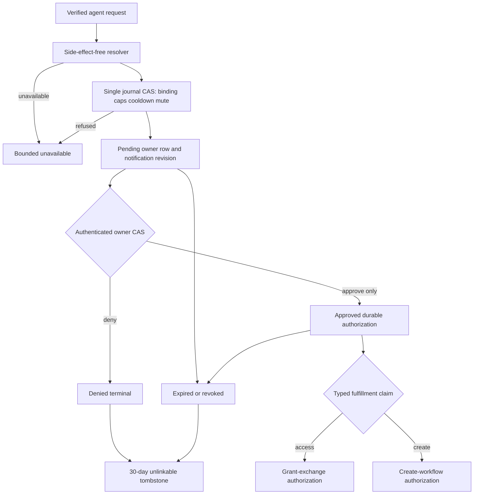
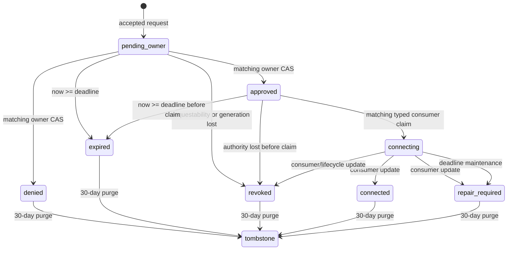

# Channel Access Journal and Decision Workflow - Plan

## Goal Capsule

- **Objective:** Add the transport-neutral and hosted channel-access request journal that records access/create intents, enforces abuse ceilings, authenticates owner decisions and mutes, expires and purges sensitive state, and exposes approval only through operation-specific fulfillment ports.
- **Authority:** Issue #208 and RD4A in `docs/product/internal-mode/room-discovery.md`, subject to the binding decisions in `docs/product/internal-mode/executor-decisions.md`; later executor decisions override earlier decisions and research. Current tested messaging/control contracts constrain implementation shape but do not override product decisions.
- **Stop conditions:** Do not create a channel, membership, device, binding, grant, connector activation, trust transition, provider call, web inbox, CLI, or MCP surface in this change.
- **Tail ownership:** Ship contracts, hosted persistence/service/handlers, composition reservations, focused adversarial tests, the guarded wrong-implementation proof, self-review, and CI in one PR against `main`.

---

## Product Contract

### Summary

A verified agent request may create one seven-day owner decision record, but never authority or membership by itself. The journal binds the first resolved target or creation proposal to the requester, session generation, origin, operation kind, and operation ID; applies hard requester/owner caps, cooldown, mutes, and bounded owner notifications; accepts only authenticated human-cookie owner decisions; and lets the correct downstream consumer claim a durable typed authorization before the deadline.

Product Contract unchanged from RD4A. The plan resolves only implementation seams that the source leaves directional: the merged discovery contract has no trusted resolver port, and the existing gateway supports fixed paths rather than path parameters.

### Problem Frame

Discovery and canonical URLs are locators, not admission authority. Without an explicit persisted decision boundary, an agent could accidentally create membership, operation IDs could be reused to prompt multiple owners, concurrent requests could exceed hard caps, a stale owner could decide after policy changed, or retained request context could become a durable social graph. The workflow must stay finite and privacy-preserving across response loss, restarts, CAS conflicts, expiry, revocation, notification failure, and downstream consumer delay.

### Requirements

**Contracts and privacy**

- R1. Define strict version-1 request-journal, trusted resolution/revalidation, owner-safe projection, decision, mute, notification, lifecycle, and typed fulfillment contracts in `packages/contracts/src/messaging/channel-access.ts`, reusing `AccessRequestStatus` and its finite outcomes from `discovery.ts` rather than creating a second agent status vocabulary.
- R2. Bind one operation to stable requester principal, verified session fingerprint, session generation, exact origin, operation kind, and the first hidden target/proposal digest. Discard submitted canonical URLs and listing references after resolution; mismatched reuse returns the same bounded `unavailable` result and creates no second prompt.
- R3. Persist only the hidden authorized channel reference/fingerprint or creation proposal digest plus the minimum server fields required for lifecycle correctness. Bounded proposed titles and requester display/workspace labels remain explicitly untrusted sensitive detail; status contains no owner, target, grant, or provider data.

**Limits, notification, and mutes**

- R4. Enforce exact hard maxima of five active requests per stable requester and 50 per owner, with configuration allowed only to lower those defaults. `pending_owner` and approved-but-unclaimed work consume capacity; denial, revocation, expiry, or fulfillment claim releases it without ever permitting an oversubscribed instant.
- R5. Enforce a five-minute accepted-request cooldown by stable requester plus hidden channel for access, or stable requester plus owner for creation. Exact retries reconcile before the cooldown check; muted, cap-limited, and resolver-failed attempts create neither a pending row nor a notification.
- R6. Persist indefinite revision-checked mutes. Access mute/unmute authenticates the current target-channel owner and scopes to `(owner, requester, hidden channel)`; creation mute/unmute scopes to `(owner, requester)` and cannot affect another owner. A mute affects future attempts and does not silently decide an existing row.
- R7. Notify only after durable row creation. Keep at most ten logical owner notifications per one-minute window by reserving the last slot for an idempotently updated batch notification; notification failure leaves the canonical inbox row pending and retryable without creating another row.

**Authority and lifecycle**

- R8. Derive human mutation authority only through `AuthService.requireHumanMutation`, then verify the stored owner. Binding/discovery capabilities and caller-supplied owner IDs cannot decide, mute, or unmute. Decisions are exact-revision CAS operations: identical duplicate decisions reconcile, stale revisions and opposite duplicates do not mutate state.
- R9. Persist the seven-day deadline in authoritative business state. At `now >= deadline`, pending or approved-but-unclaimed work atomically becomes `expired`, later decisions/notifications/fulfillment are suppressed, and capacity becomes reusable. Visibility/requestability loss, channel deletion/owner change, or relevant requester-generation revocation closes active work as `revoked` without treating a secret-but-valid URL request as revoked solely due to visibility.
- R10. Replace terminal sensitive detail after 30 days with a purpose-separated, HMAC-addressed idempotency tombstone that retains only the minimum finite outcome needed to prevent operation reuse. Do not rely on physical record expiry for operation identity.
- R11. Approval only writes `approved`. A typed fulfillment boundary separately claims exactly one access or creation authorization, rechecks deadline, request revision, owner/requestability, and requester generation, and routes access and create consumers through distinct methods/types. Downstream updates may project `connecting`, `connected`, `repair_required`, or `revoked`, but no decision path receives an admission, provider, grant, device, binding, or connector port.
- R12. Register finite no-store agent and human routes through optional composition factories and immutable dependencyless fallbacks. Because the gateway dispatches exact paths, carry operation/request handles in strict query/body fields rather than adding out-of-scope parameterized routing.

### Acceptance Examples

- AE1. Given two concurrent requests for the last requester or owner slot, exactly one authoritative reservation succeeds and the other returns `unavailable`; a restart and retry preserve the same result without leaking capacity.
- AE2. Given one operation first resolved to target A, submitting the same operation from another session, origin, kind, or target B creates no second owner row or notification and returns grant-free `unavailable`.
- AE3. Given an authenticated wrong owner, stale request revision, binding capability, or discovery capability, approve/deny and mute/unmute do not mutate the journal.
- AE4. Given a request created just before its persisted deadline, a decision or fulfillment claim at the deadline first commits `expired`, releases capacity, and never exposes authorization.
- AE5. Given an approved request, no channel, membership, device, binding, provider, connector, or grant state changes until the matching typed fulfillment consumer explicitly claims authorization.
- AE6. Given a terminal request 30 days after its terminal timestamp, rebuilding the service over the same store reveals no requester/session/origin/owner/fingerprint/target/proposal/labels while the same operation still cannot create another prompt.

### Scope Boundaries

- `channel-access-grant-exchange` consumes access authorization; `channel-create-workflow` consumes creation authorization, creates one secret channel, then hands one resolved access target to the exchange. Neither consumer is implemented here.
- `channel-access-inbox` owns the persistent web inbox and decision UI. This ticket supplies only safe projections and authenticated finite routes.
- Discovery catalog/listing, credential issuance, connector recovery/activation, trust changes, participant removal, and transport-specific notification delivery remain separate contracts.
- Runtime composition without injected dependencies remains `feature_unavailable`; this PR supplies tested factories and route reservations, not provider credentials or a new deployment root.

---

## Planning Contract

### Key Technical Decisions

- KTD1. Add a consumer-side `ChannelAccessResolutionPort` in `channel-access.ts`, referencing `ChannelAccessRequest`, `ChannelCreateIntent`, `DiscoveryRequester`, `AuthorizedChannelRef`, and `OwnerId`. It returns closed `resolved | unavailable` results plus side-effect-free access revalidation/current-ownership and requester-generation checks. It stays off the agent-facing `ChannelDiscoveryPort` and never invokes a provider effect. This fills the trusted seam absent from the merged `channel-discovery-contract` without duplicating its public request vocabulary.
- KTD2. Use one versioned channel-access journal aggregate over a dedicated `ControlStore` key. One CAS therefore commits the first-operation binding, requester/owner capacity counts, accepted row, cooldown, mute lookup, and notification revision together; retries settle through `resolve`. This intentionally favors a bounded single-writer correctness boundary over a multi-key protocol that could orphan requester reservations after a crash. Live request rows and notification windows are bounded by the hard caps; permanent tombstones are fixed-size operation digests with finite outcomes.
- KTD3. Purpose-separate keyed digests for requester-ledger keys, owner-journal keys, request handles, operation bindings, target/proposal fingerprints, mute scopes, cooldown scopes, notification IDs, and write operation IDs. Raw canonical URLs, listing references, session IDs, and URL-derived locators never enter records or diagnostics.
- KTD4. Keep `deadline` and terminal timestamps only while a live or retention-window row needs them. Lazy maintenance runs before every read/mutation: exact deadline comparison first CASes pending/approved-unclaimed to `expired`; an uncompleted `connecting` claim becomes `repair_required` no later than that same persisted deadline. At 30 days after a terminal transition, compaction removes the row and every requester/owner reverse reference and leaves only `{ outcome }` at the purpose-separated operation tombstone key—no deadline, terminal timestamp, aggregate placement, or principal linkage remains. Infrastructure backup retention remains the storage platform's responsibility, as RD4A states.
- KTD5. Store the normalized bounded proposed title and human-facing requester labels only in the recent-sensitive owner record, alongside a digest in the permanent operation binding. This resolves the source tension: inbox and downstream create consumers can use the proposal before purge, while the post-retention tombstone contains no title or identity context.
- KTD6. Reuse `AuthService.requireHumanMutation` for decision and mute routes. Human request bodies contain handles, expected revisions, decision/mute action, and client operation IDs only; the principal/owner comes from the authenticated context. Human reads use `authenticateRequest`, derive the owner from that principal, and return only rows whose stored current owner still matches; wrong-owner and stale-owner handles collapse to the same absent result. Agent routes receive an already-authenticated `DiscoveryRequester` plus verified session fingerprint/labels from their composition adapter.
- KTD7. Make the fulfillment port structurally operation-specific and available only to trusted in-process consumers: `claimAccess` can return only an access authorization with hidden `AuthorizedChannelRef`; `claimCreate` can return only a creation authorization with proposal data. Consumer identity is an injected trusted value, never an agent field. Both methods use an exact CAS claim operation, return the same authorization to the identical retry, reject cross-kind/different-consumer reuse, and move the request from capacity-consuming `approved` to `connecting`. A bounded update method records `connected`, `repair_required`, or `revoked` from the same consumer operation.
- KTD8. Model owner notification as a minimal-payload idempotent outbox in the journal. Requests one through nine in a minute enqueue individual notifications; the tenth reserves one aggregate notification whose count is revised for later requests in that window. Delivery is a revisioned upsert: each higher count is an undelivered revision under the stable batch ID, and success acknowledges only the exact delivered revision. Inbox persistence remains authoritative when delivery is unavailable.
- KTD9. Register exactly `POST /api/agent/channel-access/request`, `POST /api/agent/channel-access/create`, `GET /api/agent/channel-access/status`, `GET /api/human/channel-access/inbox`, `POST /api/human/channel-access/decision`, and `POST /api/human/channel-access/mute`. Handles or operation IDs live in strict query/body fields; every response is finite versioned JSON with `cache-control: no-store` and `x-content-type-options: nosniff`, and never includes exception text or sensitive inputs.

### High-Level Technical Design

### Risks and Dependencies

- `ControlStore` is atomic only per key. Keeping the authoritative journal under one dedicated key is therefore correctness-critical; tests must force synchronized last-slot CAS attempts and ambiguous writes to prove the hard maxima never exceed 5/50.
- The resolver seam is new because the merged discovery contract omitted it. Keep it consumer-side and minimal so later external/internal discovery adapters can implement it without provider assumptions.
- A global transaction or enumerator is unavailable. Cleanup and reconciliation operate only on the dedicated aggregate key; no test may rely on store enumeration.
- Route factories reserve behavior but production composition remains unavailable until a later composition owner injects concrete resolver, session, notification, and auth dependencies. The PR must not claim live hosted discovery.
- Notification delivery is not authoritative. A durable inbox row always survives a notification failure, and repeated flushing must remain idempotent.
- Retention tests must inspect serialized rows, tombstone values, indexes, and diagnostics—not only public projections. Deleting the sensitive row without leaving the permanent tombstone is an operation-reuse bug; retaining reverse references or timestamps in a compacted tombstone is a privacy bug.

---

## Implementation Units

### U1. Define strict channel-access contracts

- **Goal:** Establish trusted resolver/revalidation, requester identity context, owner projections/commands, notification, lifecycle, and typed fulfillment boundaries without widening agent authority.
- **Requirements:** R1–R3, R6, R8, R11–R12.
- **Dependencies:** Current `channel-discovery-contract` on `main`.
- **Files:** `packages/contracts/src/messaging/channel-access.ts`, `packages/contracts/src/messaging/channel-access.test.ts`, `packages/contracts/src/messaging/index.ts`, `packages/contracts/src/messaging/README.md`.
- **Approach:** Follow existing exact-field decoder and readonly discriminated-union patterns; reuse discovery request/status types; brand request handles/authorizations; bound and sanitize untrusted labels/titles; separate access and creation authorization at the type level; keep resolver/revalidation methods effect-free and lifecycle methods limited to journal-state mutation with no provider, grant, device, binding, connector, or admission effects.
- **Test scenarios:** Valid shapes round-trip; unknown fields, unsupported versions, malformed origins/timestamps/revisions, oversized or control-bearing labels, impossible state/field combinations, and secret-bearing projections fail. Compile-time tests reject raw `ChannelAccessRequest` as fulfillment authority, reject access authorization at the create consumer and vice versa, and prove decision ports expose no grant/provider/admission operation.
- **Verification:** Contract tests/typecheck pass and the messaging README documents the new ports and authority split.

### U2. Implement keyed policy and crash-safe persistence

- **Goal:** Persist operation bindings, requester reservations, owner rows, cooldowns, mutes, notification outbox state, deadlines, terminal detail, and unlinkable tombstones under per-key CAS.
- **Requirements:** R2–R7, R9–R10; AE1–AE2, AE4, AE6.
- **Dependencies:** U1.
- **Files:** `apps/control/src/channel-access/policy.ts`, `apps/control/src/channel-access/policy.test.ts`, `apps/control/src/channel-access/store.ts`, `apps/control/src/channel-access/store.test.ts`, `apps/control/src/channel-access/support.test.ts`.
- **Approach:** Derive purpose-separated HMAC keys from injected key material; update the single authoritative aggregate by CAS; encode the first target/proposal fingerprint in the operation row; settle ambiguous writes with `resolve` and identical retry; keep live rows bounded by active caps; use in-record deadlines and two-phase sensitive-detail reduction rather than authoritative operation-record expiry.
- **Execution note:** Implement the hard-cap and deadline paths test-first with forced CAS barriers and fault injection; these invariants are cheaper to prove before service/HTTP code exists.
- **Test scenarios:** Exact fifth/sixth requester and 50th/51st owner boundaries, including synchronized last-slot races; lower-only configuration accepts every valid lower boundary and rejects increases/zero/unsafe values; ambiguous writes before/after an accepted aggregate CAS reconcile without oversubscription or duplicate rows; exact retry recovers while changed session/origin/kind/target fails; cooldown boundary is strict at five minutes and starts only after acceptance; durable mute/unmute revisions survive restart and enforce operation-specific scopes; seven-day deadline persists across restart, expires at equality, suppresses late decisions/outbox, releases capacity, and bounds abandoned `connecting`; 30-day compaction removes every sensitive field, timestamp, and reverse reference across restart but preserves an outcome-only operation tombstone; raw URL/listing/session identifiers and forbidden labels are absent from serialized state/diagnostics.
- **Verification:** Store tests prove every invariant using only `ControlStore` operations and deterministic keys, without enumeration.

### U3. Build the journal, decision, notification, and fulfillment services

- **Goal:** Compose side-effect-free resolution with persistence, owner authorization, notification delivery, requester-bound status, policy revalidation, and operation-specific downstream authorization.
- **Requirements:** R1–R12; AE1–AE6.
- **Dependencies:** U1–U2.
- **Files:** `apps/control/src/channel-access/service.ts`, `apps/control/src/channel-access/service.test.ts`.
- **Approach:** Resolve before reservation; collapse every unsafe failure to one `unavailable` status; flush idempotent outbox only after durable creation; revalidate ownership/requestability and requester generation immediately before decisions, access mutes, and fulfillment; keep approval as one journal-only CAS; let only explicit `claimAccess`/`claimCreate` produce typed authorization and only matching consumer updates change readiness states.
- **Test scenarios:** Happy approve/deny and exact duplicate reconciliation; wrong/stale owner, stale request revision, binding/discovery capability substitutes, and changed ownership/revision fail before mutation; access versus creation mute isolation and old-owner mute non-transfer; cross-session/origin/kind operation lookup and two-reference operation reuse collapse to `unavailable`; exact cap/cooldown/mute refusals create no owner row or notification; first nine notification publishes plus one logical batch stay within the configured maximum and survive delivery failure/restart; revocation, deletion, requestability loss, and requester-generation revocation close active work; access and create claims route only to their typed authorization, reconcile identical consumer retries, and refuse cross-kind reuse; downstream completion projects connecting/connected/repair-required correctly.
- **Wrong-implementation scenario:** Snapshot fake channel, membership, device, binding, provider, connector, and grant stores; approve both access and create requests; assert the snapshots and grant output are byte-identical until the typed consumer runs and status remains `approved`. Mark a test-harness-only `// MUTATION GUARD:` line that deliberately invokes the fake downstream consumer immediately after approval; enabling that line must fail on the changed downstream snapshot/grant output (not merely a status label), then restoring it must pass.
- **Verification:** Service tests prove approval has no downstream dependencies or effects and every finite status remains grant-free.

### U4. Expose authenticated finite routes and reserve composition

- **Goal:** Add strict agent/human route factories and minimal composition registration without introducing a new runtime router or live provider wiring.
- **Requirements:** R2–R3, R8, R12; AE2–AE5.
- **Dependencies:** U1–U3.
- **Files:** `apps/control/src/channel-access/handler.ts`, `apps/control/src/channel-access/handler.test.ts`, `apps/control/src/composition/agent/handlers.ts`, `apps/control/src/composition/agent/handlers.test.ts`, `apps/control/src/composition/human/handlers.ts`, `apps/control/src/composition/human/handlers.test.ts`, `apps/control/src/runtime/discover.test.ts`, `apps/control/package.json`.
- **Approach:** Use `requireHumanMutation` for every owner mutation and `authenticateRequest` plus a stored-current-owner check for owner reads; inject authenticated discovery requester/session evidence for agent routes; place IDs in strict query/body fields; map service outcomes to finite no-store JSON; append optional channel-access route factories after existing status/pairing registrations; export the new control modules; keep immutable `feature_unavailable` fallbacks when dependencies are absent.
- **Test scenarios:** Human-cookie success, signed-out/CSRF/origin denial, and capability-shaped requests short-circuit before store/resolver access; requester status matches principal/fingerprint/generation/origin/kind; malformed/extra query and body fields fail; route bodies omit owner/target/grant/provider/exception fields; handler dependency throws become finite unavailable responses; dependencyless and live composition preserve exact route order/methods; runtime manifest contains only the intended fixed agent/human routes and no connector exchange or parameterized wildcard.
- **Verification:** Handler, composition, runtime-manifest, control package tests/typecheck/build, boundary lint, and terminology checks pass.

---

## Verification Contract

| Gate | Applicability | Done signal |
|---|---|---|
| `mise exec node@22.23.2 -- corepack pnpm --filter @khala/contracts exec vitest run --config ../../vitest.config.ts src/messaging/channel-access.test.ts` | U1 | Strict types, decoders, and authority separation pass |
| `mise exec node@22.23.2 -- corepack pnpm --filter @khala/control exec vitest run --config ../../vitest.config.ts src/channel-access/policy.test.ts src/channel-access/store.test.ts` | U2 | Digests, caps, CAS races, cooldown, mutes, expiry, and purge pass |
| `mise exec node@22.23.2 -- corepack pnpm --filter @khala/control exec vitest run --config ../../vitest.config.ts src/channel-access/service.test.ts src/channel-access/handler.test.ts` | U3–U4 | Workflow, auth, notification, fulfillment, privacy, and finite routes pass |
| Guarded wrong-implementation mutation | U3 | The focused approval-before-consumer test fails after changing the marked approval state assignment to fulfillment-claimed, with the exact failing command/line recorded; restoring it makes the same command pass |
| Package suites/typechecks/builds | All | `@khala/contracts` and `@khala/control` tests, typechecks, builds, and generated route manifest are green |
| Repository lint/build | All | ESLint, package-boundary, terminology, root typecheck, and root build pass on the branch |
| Full CI | All | The repository test/validation workflow is green on the exact PR head based on current `main` |

---

## Definition of Done

- One resolved operation creates at most one seven-day owner row and one bounded notification identity; mismatched operation reuse never prompts another owner.
- Hard requester/owner maxima, five-minute cooldown, notification batching, and revisioned operation-specific mutes hold under concurrency, response loss, restart, and lower-only configuration.
- Only the stored current owner authenticated by the human-cookie mutation guard can decide or mutate mutes; stale owners, stale revisions, and agent capabilities fail closed.
- Deadline, revocation/requestability loss, capacity release, typed fulfillment routing, downstream readiness updates, and 30-day unlinkable tombstones are persisted and tested at exact boundaries.
- Approval alone produces no channel, membership, device, binding, grant, provider, connector, or trust effect; only the correct typed downstream consumer can claim durable authorization.
- Agent status is requester/session/origin/kind bound and grant-free; all privacy-sensitive failures collapse to bounded `unavailable` and logs/JSON/state omit canonical URLs and derived locators.
- Fixed no-store routes and immutable unavailable fallbacks are registered without broadening the gateway; focused local gates and the exact guarded mutation proof are recorded before draft-PR self-review.
