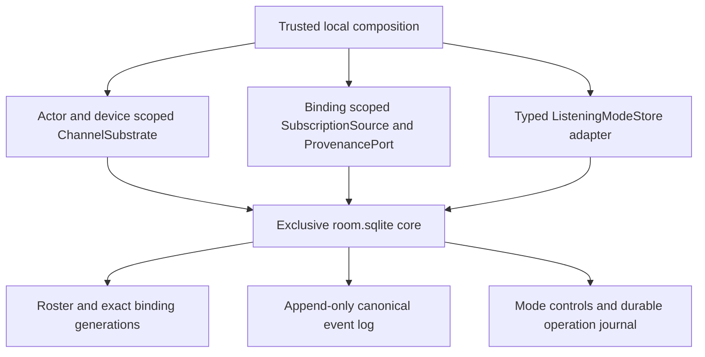
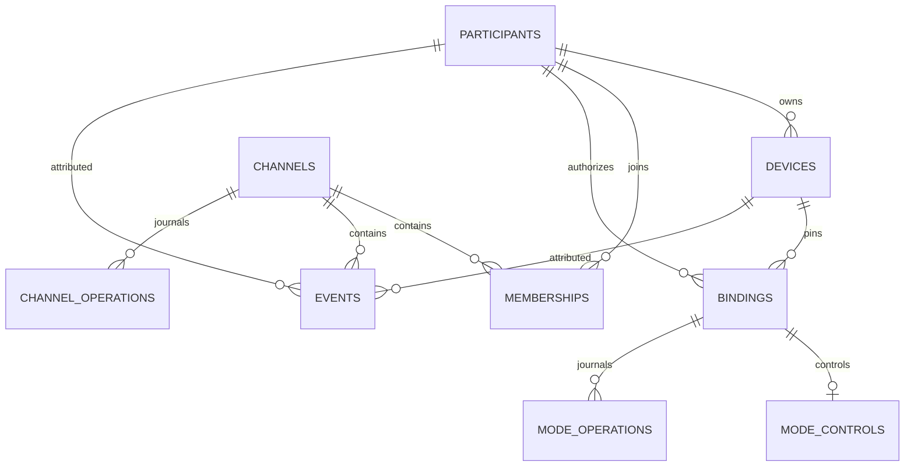
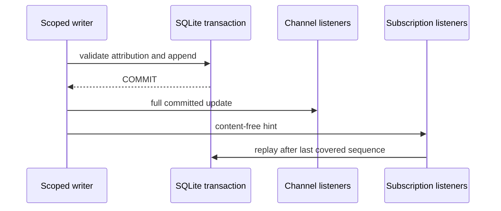
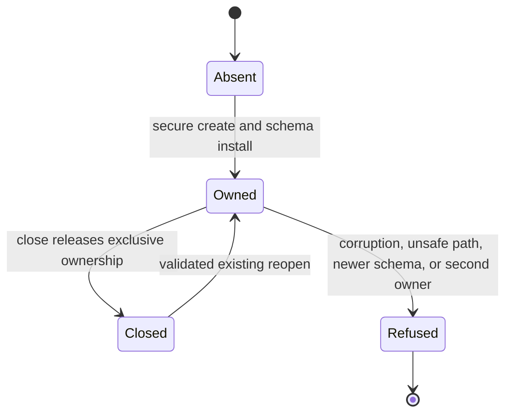
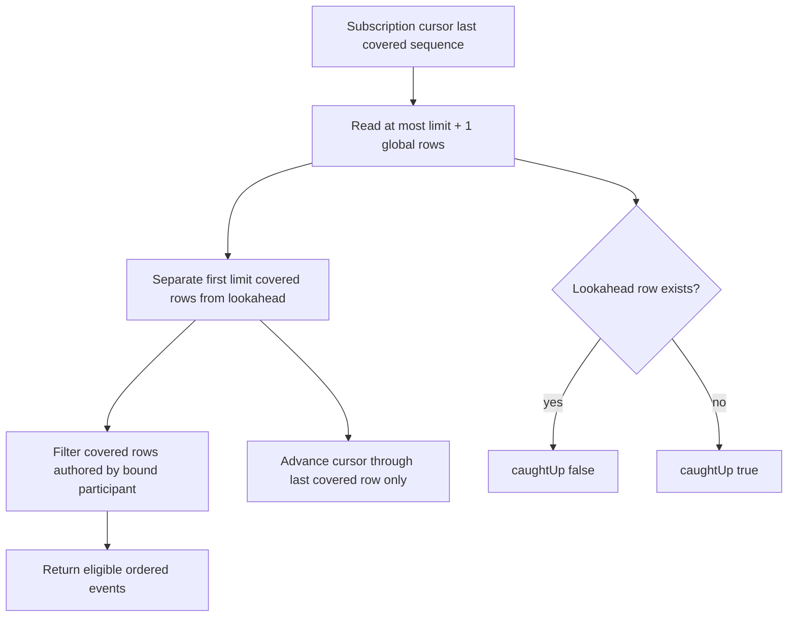
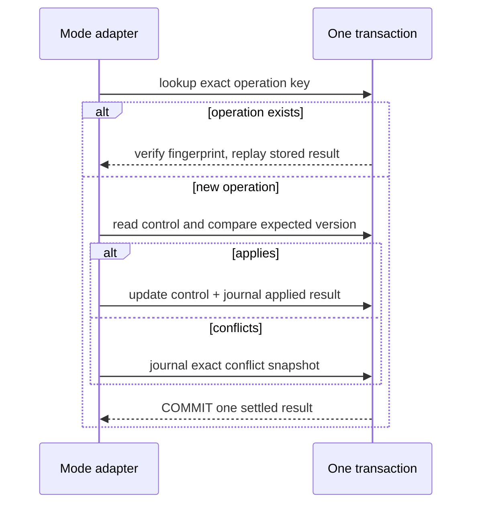

# Local SQLite Channel Store - Plan

## Goal Capsule

- **Objective:** Add the production local SQLite channel core and trusted adapters for `ChannelSubstrate`, binding-scoped `SubscriptionSource`, and `ListeningModeStore`.
- **Authority:** `docs/product/internal-mode/executor-decisions.md` items 1-40 override `docs/product/internal-mode/internal-core.md`; current public contracts on `main` are authoritative over deprecated room aliases.
- **Execution profile:** Establish secure storage and migrations first, then actor/binding-scoped adapters, listening-mode CAS, and the public-contract integration proof.
- **Stop conditions:** Do not add HTTP, browser UI, CLI, connector-ledger schema, retention, mode policy, automation limits, or agent-process lifecycle behavior.
- **Tail ownership:** This ticket owns focused mutation proof, package and repository validation, self-review, a draft PR, and CI handoff against `main`.

---

## Product Contract

### Summary

One owner-user-only SQLite database is the durable source for local channel history, roster and device attribution, binding authority, and listening-mode control. Trusted composition scopes every adapter to its actor or binding, while live notifications remain wakeups over already-committed state. The database is plaintext: filesystem controls isolate other OS users and unsafe path substitution, not unrestricted processes running under the operator's UID.

### Problem Frame

The browser channel service and connector subscription loop already define the required transport behavior, but no production local store implements both over one replayable log. A separate or weakly secured implementation would permit attribution spoofing, duplicate delivery after restart, cursor stalls on filtered events, divergent mode semantics, or silent adoption of corrupt and foreign files.

### Requirements

**Secure lifecycle and schema**

- R1. Create or reopen only an absolute owner-safe channel directory with mode `0700`, a `room.sqlite` database and companions with mode `0600`, no followed symlink or hard link, a pinned inode, and exclusive ownership before any accepted database mutation.
- R2. An explicit create may initialize one proven-new inode. Existing/reopen mode refuses missing, empty, corrupt, foreign, newer, unsafe, or concurrently owned state. Use a channel-specific application ID, transactional versioned migrations, version-specific structural, foreign-key and `quick_check` validation, WAL with `synchronous=FULL`, and foreign keys; raw-header refusal of an empty, foreign, or newer file must not mutate it.

**Durable channel data**

- R3. Persist channel creation operations, actor-relative membership, participants, immutable device-to-participant attribution, exact binding generations and active/revoked state so restart restores the same roster and authority.
- R4. Append events under a monotonic sequence with immutable event ID, canonical message bytes, digest, participant/device attribution, transaction ID, and receipt time; exact `(authorDeviceId, clientTxnId)` retries return the original event while changed reuse is `operation_mismatch`.

**Transport adapters and cursors**

- R5. Construct `ChannelSubstrate` from trusted actor/device context and implement create/find/room/send/timeline/subscribe without accepting caller-selected attribution.
- R6. Construct `SubscriptionSource` and its matching provenance port from one exact persisted binding/channel; authorize on every connection, filter the bound participant's own rows, and advance a versioned replay cursor over every scanned row.
- R7. Keep timeline and subscription cursor domains separate: timeline pages newest-first by request and chronological in output, subscription pages forward from the last covered sequence, and every malformed, future, or cross-scope cursor fails closed.
- R8. Publish full channel updates and content-free subscription hints only after a successful commit; rejected, rolled-back, or exact-idempotent operations publish nothing, and listener failures never change the committed result.

**Listening-mode persistence**

- R9. Implement the shared `ListeningModeStore` contract over exact `(bindingId, generation)` keys with one-winner CAS, durable applied and conflict outcomes, fingerprinted operation idempotency, and persisted requested mode and grants only.
- R10. Pass the upstream conformance suite, including replay of an original future-version conflict after the control later reaches that version, without persisting effective mode or capability projections.

**Acceptance proof**

- R11. Drive one real store through `createChannelService` and `startSubscription` using public package contracts, proving restart-stable deduplication, replay, cursor commits, roster attribution, and canonical listening mode.
- R12. The named wrong-implementation test must fail when the transaction dedupe guard is bypassed, then pass with the guard restored.

### Scope Boundaries

- Keep Node storage below `apps/internal`; do not expose it from browser-used messaging entry points.
- Keep connector ledgers separate and import no connector storage implementation.
- Provide narrow trusted roster/binding registration and revocation seams, not admission workflow or a general revocation policy.
- Retain all operation journals and channel history in v1; retention and export are separate ticket contracts.
- Use channel terminology in new surfaces; compatibility types such as `RoomId` and `createRoomService` remain only where existing public contracts require them.

### Acceptance Examples

- AE1. Given a committed send whose response is retried after close/reopen, the same device and transaction return the original event, and replay exposes one event.
- AE2. Given only self-authored rows after a binding cursor, the next page may contain no events but advances its cursor so a later peer event can be delivered.
- AE3. Given two mode writes at one expected version, exactly one applies, the other stores its conflict, and both exact outcomes replay after restart.
- AE4. Given a listener that rereads synchronously when notified, it observes the committed row; a rollback produces no notification.

---

## Planning Contract

### Key Technical Decisions

- KTD1. Scaffold `apps/internal` as the private Node workspace `@khala/internal` and use the pinned Node 22.23.2 `node:sqlite` `DatabaseSync`; no SQLite dependency or native addon is added.
- KTD2. Mirror the security behavior in `packages/connector/src/storage/{leases,open,schema,errors}.ts` without importing it. The connector helper is schema- and filename-specific, so this ticket keeps a focused channel-store implementation instead of widening an unrelated package.
- KTD3. `apps/internal/src/store/schema.ts` is the sole schema and migration owner for every table family, including listening-mode tables. Use a distinct channel-store application ID and a real core-schema-to-mode-schema migration fixture. Validate the old manifest before mutation; run each migration under the acquired exclusive lock in one transaction; validate the result and foreign keys; update `user_version` last. Migrations are forward-only and older binaries refuse newer versions.
- KTD4. Persist immutable event attribution on each event row rather than reconstructing history from the current roster. Device registration may add a new device but never remap a historical device to another participant.
- KTD5. Encode timeline and subscription cursors as distinct opaque formats. A timeline cursor binds format version, channel, snapshot high-water sequence/revision, and the next older boundary. A subscription cursor binds format version, channel, exact binding generation, and last covered sequence. Subscription limits bound covered rows rather than delivered rows: query `limit + 1`, process/filter only the first `limit`, advance only through the last of those covered rows, and use the extra row solely to compute `caughtUp`.
- KTD6. Snapshot listeners are copied and invoked outside transactions after COMMIT. Channel listeners receive content-bearing replacement updates; subscription listeners receive only `hint()` and reread durable rows.
- KTD7. The SQLite listening-mode primitives remain under `apps/internal/src/listening-mode-store/**`, while the typed `ListeningModeStore` wrapper lives under `apps/internal/src/composition/local-transport/**`. This obeys the repository's cross-package composition boundary without redefining the upstream port.
- KTD8. Trusted local-transport factories bind actor/device or exact `SessionBinding` context at construction. They also expose the matching `ProvenancePort`, because neither public adapter method carries enough identity to derive attribution safely.
- KTD9. One app-private store handle owns the sole `DatabaseSync`, closed/fenced state, transaction executor, and notification hub. Raw channel and mode repositories consume that handle; it is never passed through public contracts and no adapter opens a second connection.
- KTD10. Device-to-participant assignment is immutable. Binding registration persists the complete `SessionBinding`; an exact registration is idempotent, a new generation is a distinct authority row, and replacement/revocation never inherits mode state or deletes historical attribution. Authorization compares every owner, participant, harness, session, device, binding, and generation field.
- KTD11. Send deduplication is database-owned by unique `(author_device_id, client_txn_id)` plus a stored-input fingerprint. Duplicate lookup, fingerprint comparison, insert, and channel revision update are one transaction. Pre-commit failures roll back; definite commits are durable; indeterminate commits suppress hints, fence the handle, and reconcile after reopen by the durable transaction key.
- KTD12. Listening-mode operation lookup, fingerprint validation, version comparison, optional control update, and exact applied/conflict result insertion are one transaction keyed by `(binding_id, generation, operation_id)`. Journaled outcomes, including `current: null`, are immutable and replay before consulting later control state.
- KTD13. Channel-creation operation IDs are globally unique in the database, as required by the source contract. The settled fingerprint includes trusted creator participant/device context and title; an exact retry returns the original channel, while reuse by another owner or title is `operation_mismatch` rather than cross-resolving or creating another channel.
- KTD14. Every runtime value uses a prepared-statement binding and every SQL/schema identifier is a static implementation constant. Injection-shaped titles, identifiers, and message content are data and must round-trip without affecting schema or unrelated rows.

### High-Level Technical Design

`devices.id` has one immutable participant owner; events retain both participant and
device foreign keys with restrictive, non-cascading history. Bindings are uniquely
identified by the complete binding identity plus generation. Event transaction keys
are unique per author device; channel and mode operation journals retain their full
request fingerprints and settled results indefinitely in v1.

### Risks and Dependencies

- `node:sqlite` remains active-development in Node 22, so implementation stays within the already-used synchronous connection, prepared statement, transaction, and close surface documented for the pinned runtime.
- A direct policy import from `apps/internal/src/listening-mode-store/**` would fail `scripts/check-boundaries.mjs`; only the composition wrapper imports the policy port.
- Existing connector path tests document the desired hardening but are sensitive to sandbox ownership. New tests use unique owner-created directories directly beneath `/tmp`, whose sticky root-owned ancestor is accepted by the production check.
- Cursor parsing and persisted JSON decoding must be strict. Casting malformed database text would turn corruption into authority or replay drift.
- A crash after commit but before hint is recoverable through replay; a crash before commit must leave neither a row nor a hint.
- Secure open must inspect an existing inode, application identity, declared version, and version-specific manifest without creating companions or changing journal mode. Only an accepted owned file may enter WAL or migrate. A crash-created but uninitialized file is refused on subsequent create/reopen unless the current create attempt can prove and safely clean up its own inode.
- Timeline page chains retain one high-water sequence and revision across requests; concurrent appends appear only through a fresh null-cursor snapshot.
- Storage exhaustion and injected pre/post-commit failures must preserve all prior readable data. An indeterminate commit is never reported as definitely absent.

### System-Wide Impact

- **Dependency direction:** `apps/internal` is a new private pnpm workspace and lockfile importer. Only `composition/local-transport/**` imports messaging, connector, or policy implementations; raw persistence imports Node APIs and contract-neutral local types only.
- **Runtime reachability:** The package is Node-only and is not exported through browser or hosted entry points. The single exclusive store handle owns connection lifetime; downstream internal-mode consumers receive scoped factories rather than schema or `DatabaseSync` access.
- **Data compatibility:** Application ID, every historical schema manifest, migration, operation fingerprint, and cursor version become durable compatibility surfaces. Upgrades are forward-only; older binaries and unknown cursor versions refuse rather than reinterpret state.
- **Operational model:** One process owns the SQLite file at a time. WAL plus `synchronous=FULL` protects definite commits; replay repairs missed hints, while fenced indeterminate writes reconcile through durable operation keys after reopen.
- **Security and recovery:** Rejected foreign/unsafe files remain byte-for-byte and sidecar-for-sidecar unchanged. Roster revocation is non-destructive; historical events, attribution, binding generations, and operation results are never cascade-deleted.
- **Threat boundary:** The plaintext store, `0700` directory, `0600` files, no-follow checks, and pinned inode protect against other OS users and accidental/path-substitution attacks. At-rest encryption, secure erase, and malicious same-UID process isolation are outside v1; deployments that require that boundary must use a separate OS privilege boundary.

### Sources and Research

- `docs/product/internal-mode/internal-core.md` defines the store, cursor, notification, security, and acceptance contract.
- `packages/messaging/src/channels/substrate.ts` and `packages/connector/src/subscription/{adapter,index}.ts` define the two public transport seams.
- `packages/policy/src/listening-mode/store.ts` and `packages/policy/test/fixtures/listening-mode/conformance.ts` define CAS and durable idempotency semantics.
- `packages/connector/src/storage/{leases,open,schema,errors}.ts` is the local secure-open pattern, not a reusable implementation dependency.
- Node 22.23.2 documents synchronous `DatabaseSync`, zero-default lock timeout, foreign-key and extension options; SQLite documents `BEGIN IMMEDIATE`, WAL persistence, and per-commit durability under `synchronous=FULL`.

---

## Implementation Units

### U1. Scaffold and secure the internal SQLite core

- **Goal:** Create the Node-only internal package, secure path/open lifecycle, channel-specific schema, and transactional migrations.
- **Requirements:** R1-R2.
- **Dependencies:** None.
- **Files:** `apps/internal/package.json`, `apps/internal/tsconfig.json`, `pnpm-lock.yaml`, `apps/internal/src/store/errors.ts`, `apps/internal/src/store/path.ts`, `apps/internal/src/store/schema.ts`, `apps/internal/src/store/open.ts`, `apps/internal/src/store/open.test.ts`.
- **Approach:** Reproduce the connector store's fail-closed path and inode checks for `room.sqlite`. For existing files, read the pinned inode's SQLite header directly to reject empty/non-SQLite, wrong application ID, and unsupported versions before opening SQLite or creating companions. After identity acceptance, open that inode, immediately acquire exclusive ownership, revalidate the opened inode, then validate the version-specific manifest, migrate through the sole schema owner, and quick-check. For create, initialize one proven-new inode transactionally and fail closed on abandoned empty/partial files. Regenerate the lockfile and verify its `apps/internal` importer records every workspace dependency.
- **Execution note:** Write real-filesystem refusal and migration tests before exposing an adapter.
- **Patterns to follow:** `packages/connector/src/storage/leases.ts`, `packages/connector/src/storage/open.ts`, and `packages/connector/src/storage/schema.ts`.
- **Test scenarios:** Create with exact modes; reopen and migrate every old version; preserve seeded rows; inject failure after every migration stage and retry from the intact old version; reject missing constraints/indexes, orphaned foreign keys, relative/non-normal paths, unsafe ancestors, directory/database/companion symlinks and hard links, wrong modes, empty/foreign/corrupt/structurally invalid/newer files, same-process and child-process second owners; prove raw-header-rejected files and sidecars are unchanged; refuse a crash-abandoned uninitialized inode; recover ownership after close or killed child.
- **Verification:** The package builds and typechecks, all secure-open tests pass against unique `/tmp` roots, and no connector implementation import exists.

### U2. Persist roster, bindings, channels, and canonical events

- **Goal:** Provide the narrow trusted core API that owns durable identity, channel metadata, append-only history, and post-commit publication.
- **Requirements:** R3-R4, R8.
- **Dependencies:** U1.
- **Files:** `apps/internal/src/store/channel-store.ts`, `apps/internal/src/store/cursors.ts`, `apps/internal/src/store/channel-store.test.ts`.
- **Approach:** Build raw repositories over the sole app-private store handle and schema owned by U1. Add the explicit immutable-device and full-binding state machine, idempotent channel creation, immutable event rows, transactional send dedupe, separate cursor codecs, snapshot read transactions, and a notification hub invoked after definite commit.
- **Execution note:** Start with restart, changed-retry, cursor-scope, and listener-reread tests.
- **Test scenarios:** Restart preserves roster, exact device mapping, complete binding identity/status, channels, events and timestamps; device remap, destructive deletion, and mismatched attribution refuse; later generation/revocation leave old history intact; global channel-operation retry matches only the same trusted creator/title and rejects another owner/title; concurrent exact send retry returns the original row without duplicate notification; changed room/participant/content reuse refuses; injection-shaped values round-trip only as bound data; response loss after commit reconciles to the original result; timeline returns bounded chronological newest and older pages with one high-water/revision snapshot despite intervening appends; malformed/cross-scope/future cursors refuse; listener disposal and exceptions are isolated; injected pre-commit failure emits nothing, post-commit/pre-hint death replays the row, storage-full preserves prior rows, and synchronous reread after hint sees the row.
- **Verification:** Direct row-count inspection in tests confirms append-only dedupe and every accepted write is visible before notification.

### U3. Add trusted channel and subscription adapters

- **Goal:** Implement both public transport seams over the same real store without allowing request-selected identity.
- **Requirements:** R5-R8.
- **Dependencies:** U2.
- **Files:** `apps/internal/src/composition/local-transport/channel-substrate.ts`, `apps/internal/src/composition/local-transport/channel-substrate.test.ts`, `apps/internal/src/composition/local-transport/subscription-source.ts`, `apps/internal/src/composition/local-transport/subscription-source.test.ts`.
- **Approach:** Bind one actor/device lifecycle into each substrate and one exact persisted binding/channel into each source plus provenance port; translate only closed contract results and durable rows.
- **Test scenarios:** Create/find/room/send/timeline and initial/live subscription updates; actor membership refusal; source authorization compares every field for active, revoked, stale-generation, mismatched owner/participant/harness/session/device and missing bindings; ordered replay with canonical payload and stored attribution; a one-row budget over self row N and peer lookahead N+1 advances only through N, then delivers N+1 (also test self-authored lookahead); an all-peer page never returns or skips the lookahead; repeated cursor reads are stable; own commits still hint; listen receives content-free hints and no event body/count/sender.
- **Verification:** Adapter suites use public contract types, include no schema reads, and demonstrate the same event through both adapters.

### U4. Implement the SQLite listening-mode adapter

- **Goal:** Persist the upstream mode-control port and durable command outcomes in the channel database.
- **Requirements:** R9-R10.
- **Dependencies:** U1-U2.
- **Files:** `apps/internal/src/listening-mode-store/sqlite.ts`, `apps/internal/src/listening-mode-store/sqlite.test.ts`, `apps/internal/src/composition/local-transport/listening-mode-store.ts`.
- **Approach:** Consume the mode tables and core-to-mode migration already installed by U1's sole schema/migration owner. U4 adds only the raw repository, typed adapter, and conformance coverage. Keep SQL primitives internal over the shared store handle, validate controls and grants on decode, and map the upstream compare-and-set contract through a composition-owned typed wrapper and one immediate transaction. The test deliberately imports the unchanged conformance fixture by repo-relative test-only path because `@khala/policy` does not export test fixtures; production imports still use the package API.
- **Test scenarios:** Exact-key absence/read; create-if-absent; one-winner race and retry of both settled results; stale, future-version and absent-key conflicts; exact applied/conflict retry after intervening writes and restart; changed fingerprint refusal; injected failure between logical control and journal steps rolls both back; grant/control preservation; durable rows contain no effective/support/capability projection and derive different effective views under changed capabilities without a write; malformed or divergent persisted JSON maps to unavailable/fail-closed.
- **Verification:** `listeningModeStoreConformance('sqlite', ...)` passes against fresh and reopened databases, and bypassing the expected-version predicate makes the race test fail.

### U5. Prove public end-to-end composition and mutation guards

- **Goal:** Prove the real store composes with unchanged channel and subscription services and catches the specified wrong implementation.
- **Requirements:** R11-R12, AE1-AE4.
- **Dependencies:** U3-U4.
- **Files:** `apps/internal/src/composition/local-transport/integration.test.ts`.
- **Approach:** Compose `createChannelService`, memory channel journal, real scoped substrate, `startSubscription`, real source/provenance, and minimal fake cursor/ingestion/lock/scheduler ports; close and reopen the store between the original send and retry.
- **Test scenarios:** Create/send/replay through public services; restart preserves one event and attribution; repeated device transaction produces one stored and one replayed event; source cursor commits only after ingestion; self-authored traffic advances without delivery; mode request survives reopen and projects through the shared service.
- **Verification:** The named dedupe test fails when the unique/conflict guard is bypassed and passes when restored; the expected-version conformance test behaves the same for its CAS guard.

---

## Verification Contract

| Gate | Command | Done signal |
|---|---|---|
| Focused real-store suites | `mise exec -- pnpm --filter @khala/internal test -- src/store/open.test.ts src/store/channel-store.test.ts src/composition/local-transport/channel-substrate.test.ts src/composition/local-transport/subscription-source.test.ts src/listening-mode-store/sqlite.test.ts src/composition/local-transport/integration.test.ts` | Secure open, persistence, adapters, mode conformance, and integration pass |
| Required dedupe mutation | `mise exec -- pnpm --filter @khala/internal test -- src/composition/local-transport/integration.test.ts -t "deduplicates a restarted transaction into one stored and replayed event"` | Passes normally and fails with the transaction conflict/unique guard bypassed |
| Mode CAS mutation | `mise exec -- pnpm --filter @khala/internal test -- src/listening-mode-store/sqlite.test.ts -t "permits exactly one writer at an expected version"` | Passes normally and fails with the expected-version guard bypassed |
| Internal package | `mise exec -- pnpm --filter @khala/internal test && mise exec -- pnpm --filter @khala/internal typecheck && mise exec -- pnpm --filter @khala/internal build` | Package tests, types, and build pass |
| Repository quality | `mise exec -- pnpm check:boundaries && mise exec -- pnpm lint && mise exec -- pnpm typecheck` | Boundaries, terminology/lint, and workspace types pass |
| Base and deletion safety | `aiur guard-pr-deletions main` | Current remote `main` is fetched and no unrelated mass deletion is present |

---

## Definition of Done

- Secure create/reopen, migrations, integrity checks, exclusive ownership, modes, no-follow rules, and fail-closed corruption/version behavior pass real-file tests.
- Restart preserves channel metadata, roster, device attribution, exact binding authority, canonical events, and requested listening mode.
- Exact device transactions and mode operation IDs replay their original outcomes without duplicate rows or notifications; changed reuse refuses.
- Timeline and subscription cursor domains obey their opposite paging directions, bind scope/version, and advance across filtered own events.
- Channel listeners receive committed replacement updates and subscription listeners receive content-free hints only after commit.
- The SQLite mode adapter passes the unchanged shared conformance suite and persists both applied and conflict outcomes.
- One integration test drives unchanged public channel and subscription services over the same real store.
- Both named mutation commands are recorded with the guarded line changed, observed failure, restored line, and passing rerun.
- Package and repository gates pass, abandoned experimental code is removed, the branch is current with `main`, and the PR is ready for CI handoff.
