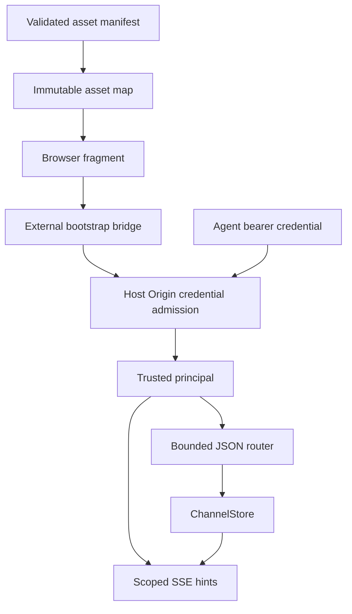
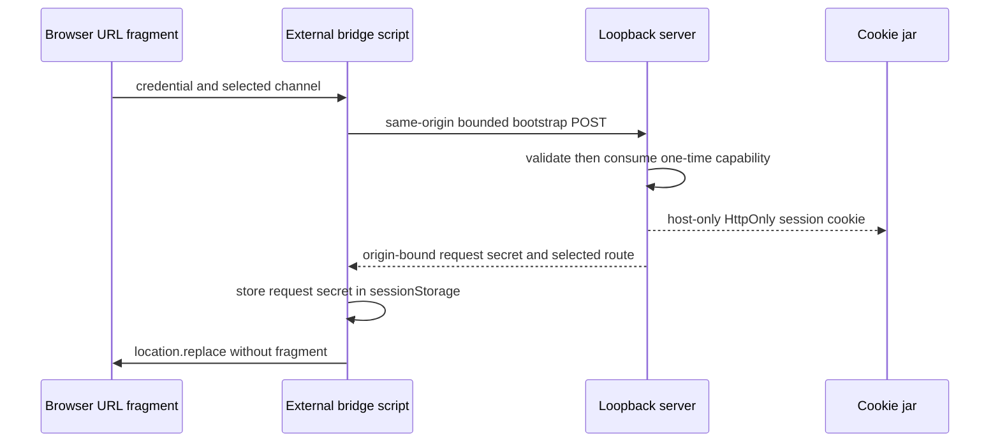
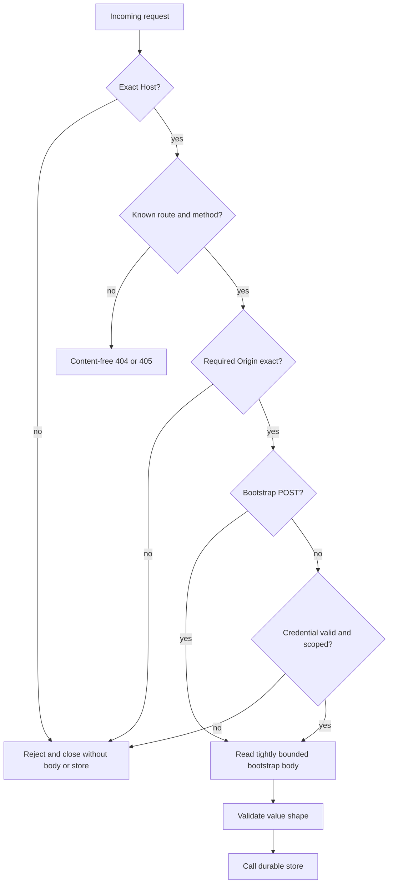
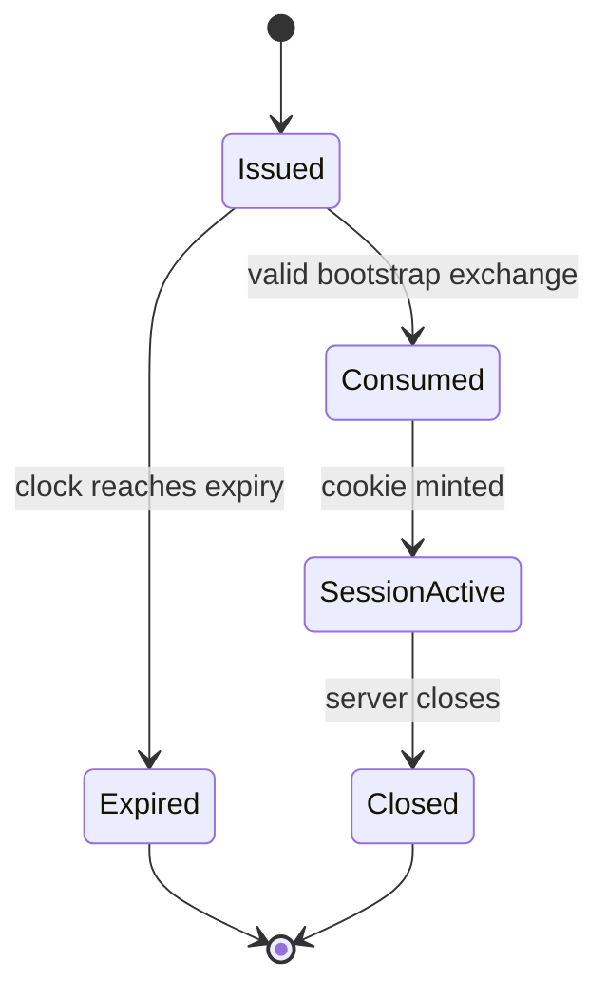

# Authenticated Loopback Server - Plan

## Goal Capsule

- **Objective:** Add a bounded Node HTTP server that exposes local channel operations only on an authenticated `127.0.0.1` origin, bootstraps the human browser without putting credentials in the request URL, and serves caller-declared assets plus one fixed server-owned bootstrap bridge.
- **Authority:** `docs/product/internal-mode/executor-decisions.md` overrides `docs/product/internal-mode/internal-core.md`; the merged `apps/internal` store is the persistence source of truth.
- **Execution profile:** Establish the request-admission boundary first, then credential exchange, versioned channel APIs, SSE hints, and manifest-only assets with a real browser proof.
- **Stop conditions:** Do not add the local web application, descriptor creation, CLI setup, automation policy, agent-process control, LAN binding, TLS, daemonization, or a second persistence model.
- **Tail ownership:** This ticket owns focused wrong-implementation mutation proof, package and boundary validation, self-review, a draft PR, and CI handoff against `main`.

---

## Product Contract

### Summary

The server is a single-user local transport boundary, not a general web host. It binds only to numeric IPv4 loopback, validates the exact authority before reading a request body or touching the store, maps opaque credentials to caller-injected human or binding authority, and exposes a small versioned API. Browser sessions begin with a one-time credential in the URL fragment; a fixed server-owned document and external same-origin script exchange it for an HttpOnly host-only cookie plus a same-origin request secret, then replace the URL with the selected channel route. Every other static response comes from the caller-declared manifest.

### Problem Frame

Listening on loopback is not authentication: hostile pages can target local services, alternate host spellings can bypass loose authority checks, and path-derived static serving can expose arbitrary files. The server must therefore reject requests at the outermost boundary, derive identity from injected authority rather than JSON fields, bound every resource it accepts or holds, and emit no message content through SSE, errors, or logs.

### Requirements

**Listener and request admission**

- R1. Bind on `127.0.0.1`, starting at port 4870 and advancing only for `EADDRINUSE`, while bounding the port search, open connections, concurrent requests, headers, request bodies, request duration, idle keep-alive time, and requests per socket.
- R2. Require the exact `Host` value `127.0.0.1:<bound-port>` on every request. Reject alternate spellings, duplicate authorities, absolute-form surprises, and malformed targets before routing.
- R3. Require the exact origin `http://127.0.0.1:<bound-port>` for bootstrap and cookie-authenticated mutations, plus `Sec-Fetch-Site: same-origin` when that browser header is present. A binding bearer request may omit `Origin`, but any presented origin must match exactly. Host and Origin failures occur before body consumption or store access.

**Credentials and identity**

- R4. Accept caller-injected human bootstrap credentials and agent binding credentials only as canonical unpadded base64url encodings of exactly 32 cryptographically random bytes; compare fixed-length digests without early-exit string equality and reject duplicate or malformed credential registrations at startup.
- R5. Consume an unexpired human bootstrap credential exactly once, mint an independent 32-byte random session credential for a host-only HttpOnly `SameSite=Strict; Path=/` cookie plus a separate 32-byte browser request secret returned once to the same-origin script, and return only a same-origin selected-channel route. Cookie-authenticated API requests must also present the request secret from same-origin `sessionStorage`, preventing a cookie received by a process on another loopback port from being replayed. Replay, expiry, channel mismatch, and wrong credentials fail closed.
- R6. Derive every participant and device used by a channel operation from the authenticated credential. Revalidate an agent's exact persisted binding and allowed channel on every request so revocation or generation replacement takes effect without restarting the server.

**Versioned local API and hints**

- R7. Expose bounded JSON operations under `/api/v1`: human-only channel creation plus authenticated channel summary, roster, timeline, and message send. Validate method, media type, object shape, identifiers, cursor length, page limit, title, transaction ID, and message size; never accept attribution fields from request JSON.
- R8. Map store outcomes to stable, content-free HTTP error envelopes and conservative status codes. Unknown or unavailable writes never claim success; responses never serialize canonical payload bytes or credentials.
- R9. Expose a credential-scoped SSE endpoint with global and per-credential stream limits, keepalive comments, reconnect support, deterministic cleanup, and generic hint events only. A hint tells the client to reread authenticated durable state and carries no message, participant, title, or credential data.

**Assets, browser bootstrap, and observability**

- R10. Preload only explicit manifest entries rooted beneath one absolute local bundle directory. Reject absolute, encoded, mixed-separator, traversal, non-regular, oversized, symlinked, or reserved-route entries; never translate an arbitrary URL path into a filesystem path.
- R11. Serve a minimal fixed document at `/__khala/bootstrap` that loads only the fixed external `/__khala/bootstrap.js` under a strict CSP with no inline, eval, or worker exception. The script reads only the fragment credential and selected channel, posts them to the same origin, stores the returned browser request secret in same-origin `sessionStorage`, then uses `location.replace` so the fragment disappears from browser history and the selected channel route becomes canonical.
- R12. Apply no-store and strict browser isolation headers consistently, disclose no cross-origin permission, and log only request ID, method, normalized route template, status, duration, safe lifecycle counts or bound port, and enumerated error codes. Raw request targets, headers, bodies, identifiers, content, credentials, filesystem paths, and raw exception messages never enter logs.

**Acceptance proof**

- R13. Real HTTP tests cover occupied-port fallback, authority/origin variants, credentials, bounds, slow/incomplete clients, concurrency, SSE, static escapes, headers, and sanitized failures; a real Chromium navigation proves the fragment exchange under the declared CSP.
- R14. The named wrong-implementation tests send a valid credential with `Host: localhost:<port>` and with a hostile mutation `Origin`, proving rejection before either the body reader or store is invoked. Each guard is separately reverted in an isolated mutation worktree and the exact focused command must fail for the expected assertion.

### Scope Boundaries

- The caller constructs and owns the SQLite store, injected bootstrap and binding credentials, assets, ID generator, clock, and logger; the server owns transport enforcement plus minted browser session credentials and their in-memory state.
- Human authority may create and use channels as its injected participant/device. Binding authority is restricted to its exact persisted binding and caller-declared channels; it cannot create channels or select attribution.
- Cookies protect the browser surface. Agent clients use an Authorization bearer credential supplied through a later secure descriptor flow; credentials are never accepted from query parameters or persisted by this ticket.
- Same-UID processes remain outside the isolation claim because they can copy runtime credentials or inspect process memory. This server protects against unauthenticated local/cross-origin access and other OS users when its inputs are stored safely.

### Acceptance Examples

- AE1. With port 4870 occupied, startup listens on `127.0.0.1:4871`; a request carrying `Host: localhost:4871` receives a rejection before its delayed body is sent and before the store spy records a call.
- AE2. A bootstrap URL containing `#credential=<secret>&channel=<id>` loads only an external script, exchanges once, sets a host-only HttpOnly cookie, and replaces the visible URL with `/channels/<encoded-id>` without the secret.
- AE3. A valid binding credential sends a message whose participant/device come from the injected binding; JSON attempts to provide alternate attribution are rejected as invalid shape.
- AE4. Two connected principals receive only generic SSE hints for channels they are authorized to observe; neither stream contains message bodies or identifiers outside its scope.
- AE5. A manifest entry targeting a symlink outside the bundle is rejected before listening, and request paths containing absolute, encoded, traversal, or backslash forms cannot select any file.

---

## Planning Contract

### Key Technical Decisions

- KTD1. Use Node 22's built-in `node:http` server and set explicit `headersTimeout`, `requestTimeout`, keep-alive, header-count, request-per-socket, and connection limits. The default listener is not accepted as a safe limit policy.
- KTD2. Use two-stage admission. Every request first passes exact Host, route/method classification, and route-specific Origin/Fetch-Metadata checks. Authenticated API and SSE routes then validate cookie-plus-request-secret or bearer authority before any body read. The fixed bootstrap GET resources remain credentialless, while bootstrap POST reads one tightly bounded JSON body only after Host/Origin admission and validates its one-time credential before any store access. The mutation tests target the pre-body Host/Origin ordering directly.
- KTD3. Represent credentials as startup-only capability records. Human records pin owner/participant/device and bootstrap channel scope; agent records pin one exact `SessionBinding` plus an allowed-channel set. Request JSON never supplies authority-bearing IDs.
- KTD4. Bootstrap credentials are one-time capabilities, not browser sessions. Successful exchange burns the credential before issuing a random independent cookie secret and browser request secret; failed validation burns nothing, and expired entries are unusable. Session state is in-memory and dies with the server.
- KTD5. Use a non-prefixed cookie name because the required server is plain HTTP on numeric loopback and `__Host-` requires `Secure`. Preserve the host-only property by omitting `Domain`, and apply `HttpOnly`, `SameSite=Strict`, and `Path=/`. Because cookies ignore ports, require the paired custom-header request secret from same-origin `sessionStorage` on every cookie-authorized API or stream request; another loopback port may receive the cookie but cannot read or forge that origin-bound secret.
- KTD6. Keep the API deliberately small: create, summary/roster, timeline, send, and hints. Return JSON values needed by the later local web adapter but do not introduce lifecycle, discovery, admission, listening-mode, acknowledgement, or automation endpoints owned by other tickets.
- KTD7. Build store calls directly from the authenticated principal and reuse `ChannelStore`'s durable idempotency/cursor contracts. The server adds transport validation and response serialization, not a parallel service or schema.
- KTD8. Use `ChannelStore.subscribeHints` for SSE so the transport never receives content-bearing updates. Each write commit may wake a client, but the client must reread durable authenticated state.
- KTD9. Load manifest assets into immutable memory before accepting connections after validating root containment, file type, no-follow semantics, per-file size, total size, and unique route names. This removes request-time path joins and symlink-swap races.
- KTD10. Serve a fixed minimal `/__khala/bootstrap` document and fixed external `/__khala/bootstrap.js` resource outside the caller manifest. The CSP allows only same-origin scripts/connections/assets required by the bundle and explicitly denies objects, frames, forms, base changes, and workers.
- KTD11. Logging is an enum-shaped callback rather than arbitrary strings. Error boundaries map raw exceptions to safe reason codes before logging or serializing responses.
- KTD12. Extend `scripts/check-boundaries.mjs` so production code under `apps/internal/src/server/` may not import browser applications or cross-component implementations; only app-private modules, Node built-ins, and contract packages are valid dependencies.

### High-Level Technical Design

The following diagrams are directional architecture guidance, not implementation syntax.

### Assumptions

- The existing store's `createChannel`, `channel`, `roster`, `timeline`, `send`, `binding`, and `subscribeHints` methods are the complete persistence surface needed here.
- A later launcher will generate high-entropy bootstrap and binding credentials and keep their descriptors owner-only; this ticket validates and consumes those injected values but does not create descriptor files.
- The fixed server-owned bootstrap document can hand control to the caller's selected channel route after credential exchange. The browser UI itself remains a separate ticket.
- No current website documentation describes this internal API, and this ticket adds no operator config key, CLI flag, or environment variable; repository product contracts remain the appropriate documentation surface.

### Risks and Dependencies

- Node may parse some socket bytes before the request callback runs, but application code must not attach body consumers or invoke the store before admission. Slow-body real HTTP tests prove the observable boundary.
- A session cookie on plain loopback cannot use the `Secure` attribute reliably for numeric `127.0.0.1` and is not port-scoped. Exact Host/Origin checks, host-only scoping, HttpOnly, SameSite, and the separate same-origin request secret together compensate for those limits.
- Connection limits can race at the TCP boundary. Tests assert bounded accepted work and prompt refusal/closure rather than relying on an exact kernel backlog count.
- SSE holds sockets open and can starve ordinary requests. Separate global and per-credential stream ceilings plus deterministic cleanup reserve server capacity.
- Asset MIME types are caller-supplied manifest metadata and therefore validated against a closed allowlist. `nosniff` remains mandatory.
- `local-sqlite-channel-store` is already merged into `main` at `25014ca`; no live dependency remains.

### Sources and Research

- `docs/product/internal-mode/internal-core.md` defines the server acceptance and wrong-implementation contract.
- `docs/product/internal-mode/executor-decisions.md` supplies binding terminology, lifecycle, and trust constraints.
- `apps/internal/src/store/channel-store.ts` defines the trusted durable operations and content-free hint seam.
- `packages/connector/src/bootstrap/loopback.ts` is the repository's existing real `127.0.0.1` listener, timing-safe secret, timeout, and bounded-response pattern.
- `apps/web/src/features/channel/channel.browser.spec.ts` is the repository's direct Chromium test pattern.
- Node 22 HTTP documentation: https://nodejs.org/docs/latest-v22.x/api/http.html
- Fetch Standard Origin semantics: https://fetch.spec.whatwg.org/#origin-header
- MDN cookie scope guidance: https://developer.mozilla.org/en-US/docs/Web/HTTP/Reference/Headers/Set-Cookie
- MDN CSP guidance: https://developer.mozilla.org/en-US/docs/Web/HTTP/Reference/Headers/Content-Security-Policy

---

## Implementation Units

### U1. Establish the bounded listener and admission boundary

- **Goal:** Start a resource-bounded numeric-loopback server and make exact Host/Origin admission structurally precede body and store access.
- **Requirements:** R1-R3, R12-R14.
- **Dependencies:** None.
- **Files:** `apps/internal/src/server/server.ts`, `apps/internal/src/server/security.ts`, `apps/internal/src/server/http.ts`, `apps/internal/src/server/server.test.ts`.
- **Approach:** Define validated server options and lifecycle, bounded 4870-upward binding, safe response helpers, strict headers, request concurrency accounting, and two-stage admission. Exact Host and route-specific Origin/Fetch-Metadata checks gate every body read; authenticated routes additionally require validated authority before receiving a body/store capability. Reject with connection close and content-free envelopes.
- **Execution note:** Start with the two wrong-implementation real HTTP tests. Observe each failure before adding the corresponding exact Host and Origin guard.
- **Patterns to follow:** `packages/connector/src/bootstrap/loopback.ts` for real loopback lifecycle, timing-safe comparison, and timeout ownership.
- **Test scenarios:**
  - Bind 4870 when free; occupy it and bind 4871; refuse exhaustion or non-`EADDRINUSE` listener failures without switching interfaces.
  - Accept only the exact numeric Host with the bound port; reject `localhost`, uppercase/alternate IPv4 spellings, absent/duplicate/malformed hosts, wrong ports, and absolute-form authority mismatches.
  - Require the exact Origin on bootstrap and cookie mutations; reject hostile, `null`, missing, alternate-host, wrong-port, multi-value, and non-same-origin Fetch Metadata forms before a slow request body is released.
  - Enforce header, request, connection, concurrency, keep-alive, and per-socket bounds; time out incomplete headers and bodies with sanitized outcomes.
  - Apply the strict header set to success, rejection, 404, and internal-error responses; never emit CORS allow headers.
  - Inject errors containing credential/message canaries and prove neither responses nor logger events include them.
- **Verification:** Real sockets demonstrate occupied-port fallback and early rejection; instrumentation proves the bounded body reader and store facade remain untouched for wrong Host/Origin.

### U2. Implement one-time browser bootstrap and credential authority

- **Goal:** Exchange fragment-only human credentials for scoped browser sessions and authenticate binding capabilities without accepting caller-selected identity.
- **Requirements:** R4-R6, R11-R12.
- **Dependencies:** U1.
- **Files:** `apps/internal/src/server/auth.ts`, `apps/internal/src/server/bootstrap.ts`, `apps/internal/src/server/auth.test.ts`, `apps/internal/src/server/bootstrap.test.ts`.
- **Approach:** Validate exact 32-byte canonical credential encodings, index only token digests, compare fixed-size digests safely, keep one-time/expiry/session state in memory, mint cookie and browser request secrets independently, parse cookie/custom-header/Authorization forms strictly, and return a principal that carries trusted participant/device/binding scope. Recheck exact agent binding state in the store for every routed request and before each binding SSE hint.
- **Execution note:** Implement credential rejection, replay, expiry, and revocation cases test-first before adding successful exchange/session behavior.
- **Patterns to follow:** Secret generation/comparison in `packages/connector/src/bootstrap/loopback.ts`; exact binding validation in `apps/internal/src/store/channel-store.ts`.
- **Test scenarios:**
  - Reject startup records whose credentials are empty, noncanonical, or not exactly 32 decoded bytes, plus duplicate tokens, invalid expiry, duplicate binding scope, or inconsistent participant/device fields.
  - Exchange a valid unexpired bootstrap once; set a cookie with no `Domain` and with `HttpOnly`, `SameSite=Strict`, `Path=/`; return only the independent browser request secret and route, and never echo bootstrap or cookie secrets.
  - Reject wrong token, expired token, replay, wrong selected channel, malformed JSON, and oversized bodies without minting a session.
  - Authenticate a valid session cookie only with its exact custom-header request secret, plus strict bearer form for bindings; reject cookie-only cross-port replay, ambiguous cookie/bearer combinations, duplicate cookies, alternate auth schemes, surrounding whitespace, and token prefixes.
  - Revoke or replace the exact stored binding after startup and prove its next request and reconnect fail while the human session remains unaffected.
- **Verification:** Focused auth tests prove one-time state transitions, strict parsing, timing-safe digest lookup, cookie attributes, and live binding revalidation.

### U3. Add versioned JSON channel operations and scoped SSE hints

- **Goal:** Serve the minimum local channel API with durable store semantics, server-derived attribution, bounded values, and content-free live wakeups.
- **Requirements:** R6-R9, R12.
- **Dependencies:** U1, U2.
- **Files:** `apps/internal/src/server/api.ts`, `apps/internal/src/server/serialization.ts`, `apps/internal/src/server/sse.ts`, `apps/internal/src/server/api.test.ts`, `apps/internal/src/server/sse.test.ts`.
- **Approach:** Route exact method/path pairs, validate closed JSON shapes, build every store input from the authenticated principal, serialize only public channel/event views, and map rejected/unavailable/unknown outcomes explicitly. Subscribe SSE through `subscribeHints`, bound streams separately from ordinary requests, and clean listeners on abort, close, timeout, or server shutdown.
- **Execution note:** Write integration tests against a real `ChannelStore` fixture before the route implementations so attribution and commit-before-hint behavior cross the transport/store boundary.
- **Patterns to follow:** `apps/internal/src/composition/local-transport/channel-substrate.ts` for store result mapping and `apps/internal/src/store/channel-store.test.ts` for real-store fixtures.
- **Test scenarios:**
  - Human creation accepts bounded operation/title input, derives creator identity, replays exact operations, and rejects a binding principal or identity-bearing extra fields.
  - Summary/roster and timeline require membership/scope, validate channel path and cursor/limit bounds, preserve event ordering/participant display attribution, and map invalid/not-found/unavailable outcomes without content leakage.
  - Send derives participant/device, preserves transaction idempotency, rejects alternate attribution keys, bounds message and transaction sizes, and never reports an indeterminate write as stored.
  - SSE rejects unauthorized/revoked/cross-channel principals, caps global and per-credential streams, sends initial/reconnect readiness and keepalive comments, revalidates a binding before every hint and closes on revocation/generation mismatch, emits one generic hint after a committed change, and removes all listeners after disconnect/shutdown.
  - Inspect complete SSE bytes and safe logger events after messages containing canaries; assert no message, title, participant, device, transaction, cursor, or credential value appears.
- **Verification:** Real-store HTTP tests prove versioned response contracts, credential-derived attribution, durable replay, and hint-only SSE behavior.

### U4. Serve validated assets and prove the CSP bootstrap in Chromium

- **Goal:** Restrict the static surface to immutable caller-declared assets and complete a fragment-to-cookie navigation using only an external script under strict CSP.
- **Requirements:** R10-R13.
- **Dependencies:** U1, U2.
- **Files:** `apps/internal/src/server/assets.ts`, `apps/internal/src/server/bootstrap-script.ts`, `apps/internal/src/server/assets.test.ts`, `apps/internal/src/server/bootstrap.browser.spec.ts`, `apps/internal/package.json`, `scripts/check-boundaries.mjs`.
- **Approach:** Validate and preload the manifest before binding, reserve `/api/` and `/__khala/` from manifest collisions, match request paths only against exact route keys, serve fixed `/__khala/bootstrap` and `/__khala/bootstrap.js` resources, and use SPA fallback only for explicitly declared channel routes. Add an internal-server dependency boundary and a package `test:browser` script following existing Node test/Chromium conventions.
- **Execution note:** Add filesystem escape cases before implementing manifest loading, then finish with the real browser navigation proof.
- **Patterns to follow:** Browser lifecycle in `apps/web/src/features/channel/channel.browser.spec.ts`; import graph analysis in `scripts/check-boundaries.mjs`.
- **Test scenarios:**
  - Load valid regular files beneath an absolute bundle root and serve exact bytes/type; reject duplicate or reserved routes, missing files, devices/non-regular files, oversized assets/totals, invalid MIME types, and roots or entries involving symlinks.
  - Prove absolute, encoded slash/dot, double-encoded, traversal, NUL, query, and mixed-separator request targets never select files or reveal filesystem paths.
  - Serve HTML/assets/bootstrap script with CSP, nosniff, frame/referrer/permissions/cross-origin policies, and no inline/eval/worker allowance; verify unknown routes are content-free.
  - In Chromium, navigate to `/__khala/bootstrap#token=<credential>&channel=<id>`, observe successful cookie/request-secret exchange and `/channels/<id>` replacement, assert the fragment is absent from final URL/history-visible state, prove a different loopback port cannot turn the leaked cookie into an authorized request, and confirm inline-script injection does not run.
  - Fail the boundary check for a fixture importing a browser or cross-component implementation from `apps/internal/src/server/`, while preserving valid contract/app-private imports.
- **Verification:** Filesystem integration tests, boundary fixtures, package build/typecheck, and one real Chromium navigation satisfy the static/CSP contract.

---

## Verification Contract

| Gate | Command | Covers | Done signal |
|---|---|---|---|
| Server integration | `pnpm --filter @khala/internal test` | U1-U4 | All real HTTP, credential, API, SSE, asset, and boundary-adjacent unit tests pass. |
| Browser bootstrap | `pnpm --filter @khala/internal test:browser` | U2, U4 | Chromium completes the external-script fragment exchange under the production CSP. |
| Types | `pnpm --filter @khala/internal typecheck` | U1-U4 | No TypeScript errors. |
| Build | `pnpm --filter @khala/internal build` | U1-U4 | Node package build succeeds. |
| Import fence | `pnpm check:boundaries` | U4 | Repository and new server dependency boundaries pass. |
| Wrong Host mutation | Focused Vitest command reported during execution | U1 | Reverting only the exact Host guard makes the localhost valid-token test fail because body/store access becomes observable. |
| Wrong Origin mutation | Focused Vitest command reported during execution | U1 | Reverting only the exact Origin guard makes the hostile-origin valid-token test fail because body/store access becomes observable. |

---

## Definition of Done

- The server binds only numeric IPv4 loopback and advances from 4870 only for occupied ports.
- Exact Host, Origin, credential, scope, and live binding checks precede body/store work as specified.
- Bootstrap tokens are one-time and expiring; browser sessions use independent host-only HttpOnly cookies and canonical channel routes.
- The `/api/v1` surface is bounded, versioned, identity-safe, and backed by the existing durable store.
- SSE emits only credential-scoped generic hints and releases all resources deterministically.
- Static serving is manifest-only, immutable after startup, root-contained, no-follow, and covered against encoded/mixed-separator/symlink escapes.
- CSP and browser security headers permit the external fragment bridge without inline, eval, or worker exceptions.
- Logs, errors, and hints contain no content, identifiers, paths, raw exceptions, or credentials.
- Both named wrong-implementation mutations fail under their exact reported focused commands and pass once their guards are restored.
- Package tests, browser test, typecheck, build, and repository boundary check pass; self-review finds no unresolved actionable issue.
