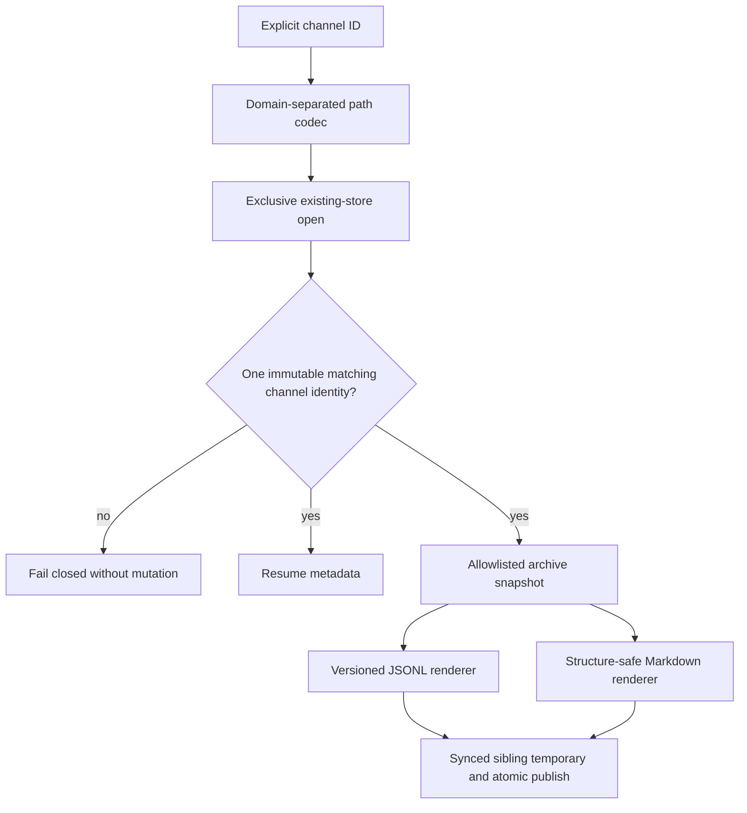
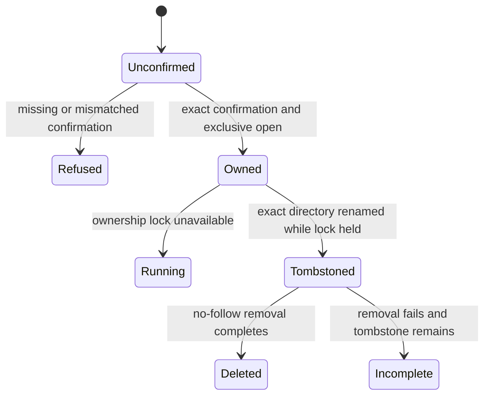

# Internal Channel Lifecycle - Plan

## Goal Capsule

- **Objective:** Add versioned store primitives for exact-channel resume metadata, deterministic Markdown and JSONL export, and confirmed symlink-safe deletion.
- **Authority:** `docs/product/internal-mode/executor-decisions.md` items 1-40 override `docs/product/internal-mode/internal-core.md`; the merged local SQLite store is the persistence boundary.
- **Execution profile:** Bind filesystem identity to one explicit channel, project an allowlisted consistent archive, publish exports atomically, then delete under retained exclusive ownership.
- **Stop conditions:** Do not add CLI parsing, runtime descriptor rotation, server launch, discovery, Make External conversion, backup, retention, secure erase, or agent-process lifecycle behavior.
- **Tail ownership:** This ticket owns focused mutation proof, package and repository validation, self-review, one PR, and CI handoff against `main`.

---

## Product Contract

### Summary

Internal channels must reopen only from their exact durable state, export as stable secret-free Markdown or JSONL without exposing partial files, and delete only after channel-bound confirmation while refusing a running store. Deletion removes the named plaintext files but makes no forensic secure-erase claim.

### Problem Frame

The SQLite store securely owns a caller-supplied directory, but channel IDs are general opaque strings and the schema currently permits multiple channels in one database. Lifecycle operations need a stable ID-to-directory mapping plus an immutable database identity check so a crafted path, mismatched store, or ambiguous database cannot resume, export, or delete unrelated state.

### Requirements

**Exact resume identity**

- R1. Map every valid opaque channel ID to one fixed path below an absolute owner-private internal root without using caller text as a path component.
- R2. Bind each lifecycle store to one immutable channel ID and require exactly one matching channel row before returning versioned resume metadata; missing, corrupt, foreign, newer, ambiguous, or mismatched state fails closed without creating replacement state.
- R3. Resume metadata includes the channel ID, nullable title, creation time, creator participant and device IDs, revision, participant count, event count, and latest event sequence from one owned store snapshot.

**Deterministic export**

- R4. Read an authority-neutral archive projection containing only allowlisted channel, membership, participant, device, and event fields in deterministic order from one synchronous store snapshot.
- R5. JSONL emits versioned fixed-shape records with a final newline; Markdown uses fixed document headings and literal message containers so authored headings, fences, HTML, lists, and newlines never become export structure.
- R6. Repeated exports of unchanged state are byte-identical, preserve canonical message bodies and authorship, and omit bindings, session IDs, capabilities, mode state, operation fingerprints, launch files, and connector ledgers.
- R7. Publish a `0600` same-directory temporary only after file sync; default no-replace refuses an existing or racing output, explicit replacement atomically replaces it, and every pre-publication failure leaves the old destination or no destination rather than a partial file.

**Confirmed deletion**

- R8. Delete requires confirmation bound to the exact requested channel ID before filesystem access, acquires the store's exclusive ownership, verifies the database identity, and returns `channel_running` when another owner holds the store.
- R9. Retain ownership while renaming the exact channel directory to a same-parent tombstone, verify the tombstone inode, then recursively unlink entries without following symlinks; sibling channels and external symlink targets remain untouched.
- R10. Success and incomplete cleanup return a stable plaintext/no-secure-erase notice. A post-rename failure returns a typed incomplete result and preserves the tombstone for later recovery rather than recreating the original path or claiming success.

**Proof**

- R11. Focused tests cover restart metadata, Markdown structure isolation, JSONL round-trip and order, secret canaries, overwrite races, injected partial-write faults, running-channel refusal, confirmation mismatch, symlink attacks, tombstone collisions, and cleanup failure.
- R12. The named wrong-implementation test fails when the Markdown literal-body guard is reverted and passes after restoration; the exact command and observed failure are reported in the PR.

### Scope Boundaries

- The future launcher acquires the root runtime lock, rotates credentials, writes `active.json`, and starts the local server after calling these primitives.
- Offline export refuses a running store. A future active launcher may render the same archive projection through its already-owned handle without weakening exclusivity.
- JSONL is the versioned integration seam for later Make External work; Markdown is presentation output.
- Channel text is preserved as authored data even when it contains secrets. Secret exclusion means source-field allowlisting, not message-body redaction.
- Delete confirmation is mandatory at this layer; a later CLI `--yes` or browser approval must produce the same channel-bound confirmation object.

### Acceptance Examples

- AE1. Given a missing or corrupt channel directory, resume returns a finite failure and creates no directory, database, companion, or metadata file.
- AE2. Given the same unchanged store before and after restart, Markdown and JSONL exports are byte-identical and JSONL records parse in their specified order.
- AE3. Given a body containing headings, nested backtick fences, blank lines, blockquotes, lists, and HTML-like text, Markdown retains every character inside one literal message block and adds no authored document structure.
- AE4. Given a destination created after temporary-file sync, no-replace export preserves the racing destination and removes its temporary; explicit replacement publishes one complete file.
- AE5. Given a live owner, delete returns `channel_running`; given a nested symlink, successful delete unlinks the symlink entry while preserving its external target and adjacent channel directories.
- AE6. Given a failure after the directory becomes a tombstone, delete reports incomplete cleanup plus the no-secure-erase boundary and leaves the tombstone available for recovery.

---

## Planning Contract

### Key Technical Decisions

- KTD1. Derive the directory name as a domain-separated SHA-256 digest of the UTF-8 channel ID. The fixed-length base64url segment prevents traversal, `.`/`..`, separator, Unicode-length, and filesystem-name hazards while preserving exact logical identity in SQLite.
- KTD2. Use the existing `meta` table for one immutable lifecycle channel ID and verify it against exactly one `channels` row. Creation binds the first channel transaction; legacy state may bind only when one row exactly matches the requested ID. Zero, multiple, or mismatched rows are invalid lifecycle state.
- KTD3. Keep the sole `DatabaseSync` behind `InternalStoreHandle`. Add a narrow snapshot projection under `apps/internal/src/store/**`; lifecycle code never opens a second connection or reads raw tables after releasing ownership.
- KTD4. Version the public lifecycle API and each JSONL record independently. Emit records in the fixed order metadata, channel, participants sorted by participant ID with sorted devices, then events by sequence; use explicit property construction rather than serializing database rows.
- KTD5. Render each Markdown body in a backtick fence longer than the body's longest backtick run. Fixed headings and JSON-escaped inline metadata keep all authored values out of structural positions while preserving body newlines verbatim.
- KTD6. Write and sync a random `0600` sibling temporary. No-replace uses atomic hard-link publication so `EEXIST` cannot clobber a racing destination; replace uses atomic rename over a validated non-directory destination. Sync the parent directory and clean ordinary failed temporaries.
- KTD7. Reuse `openChannelStore(..., mode: 'existing')` as the running-channel gate. Delete keeps that handle open through exact-directory rename, then closes it and walks the pinned tombstone with `lstat`/unlink/rmdir semantics that never traverse symlinks.
- KTD8. Export one stable notice: “Internal channel data is stored in plaintext. Deletion removes files but does not securely erase underlying storage.” Confirmation-required, successful, and incomplete delete outcomes carry it so later surfaces cannot omit the boundary.
- KTD9. Model lifecycle results as closed unions with finite codes. Raw SQLite errors, arbitrary filesystem paths, credentials, and message data never enter error strings.

### High-Level Technical Design





### Output Structure

```text
apps/internal/src/
  lifecycle/
    paths.ts
    resume.ts
    export.ts
    delete.ts
    index.ts
    *.test.ts
  store/
    lifecycle-snapshot.ts
```

### Risks and Dependencies

- The merged local SQLite store is present on `main`; no dependency stub is required.
- Hard-link no-replace publication requires the temporary and destination to share a filesystem, guaranteed by placing the temporary beside the destination.
- Same-UID malicious process isolation is outside the v1 threat model, but symlink substitution and accidental path traversal still fail closed.
- The directory codec becomes a launcher dependency. Its tests must pin domain separation and output shape so later callers do not reconstruct paths independently.

### Sources and Research

- `docs/product/internal-mode/internal-core.md` defines the resume/export/delete contract and plaintext boundary.
- `apps/internal/src/store/{open.ts,path.ts,channel-store.ts}` supplies the exclusive owner, no-follow filesystem checks, and deterministic event projection patterns.
- `packages/agent-cli/src/cli/inbox.ts` supplies the repository's same-directory temporary, file sync, atomic publication, directory sync, and cleanup pattern.
- No `CONCEPTS.md` or `docs/solutions/` corpus exists in this checkout; current contracts and code are the durable evidence.

---

## Implementation Units

### U1. Bind exact lifecycle identity and resume metadata

- **Goal:** Resolve an explicit channel ID to its safe store, bind and verify one immutable logical identity, and return versioned resume metadata under exclusive ownership.
- **Requirements:** R1-R3, R8; AE1.
- **Dependencies:** None.
- **Files:** `apps/internal/src/lifecycle/paths.ts`, `apps/internal/src/lifecycle/resume.ts`, `apps/internal/src/lifecycle/index.ts`, `apps/internal/src/lifecycle/resume.test.ts`, `apps/internal/src/store/channel-store.ts`, `apps/internal/src/store/channel-store.test.ts`.
- **Approach:** Add the hashed path codec, lifecycle identity metadata binding, exact single-channel verification, and metadata projection without exposing the database handle beyond the versioned resume result.
- **Execution note:** Start with missing, mismatched, ambiguous, and restart fixtures before changing store creation behavior.
- **Patterns to follow:** `apps/internal/src/store/path.ts` for normalized private paths and `apps/internal/src/store/open.ts` for finite fail-closed ownership.
- **Test scenarios:** Missing/corrupt/foreign/newer state creates nothing; slash, dot-segment, Unicode, and long IDs remain below the root; wrong ID and multi-channel state refuse; restart returns stable metadata; held ownership returns `channel_running` where appropriate.
- **Verification:** Every accepted handle is tied to the requested logical channel and every rejected open leaves existing bytes unchanged.

### U2. Project and publish deterministic exports

- **Goal:** Add one allowlisted archive snapshot plus deterministic Markdown/JSONL renderers and atomic overwrite-safe publication.
- **Requirements:** R4-R7, R11-R12; AE2-AE4.
- **Dependencies:** U1.
- **Files:** `apps/internal/src/store/lifecycle-snapshot.ts`, `apps/internal/src/store/lifecycle-snapshot.test.ts`, `apps/internal/src/lifecycle/export.ts`, `apps/internal/src/lifecycle/export.test.ts`, `apps/internal/src/lifecycle/index.ts`.
- **Approach:** Materialize a complete ordered snapshot while the owned store is open, close before output I/O, render only explicit fields, and publish a synced sibling temporary through separate no-replace and replace paths.
- **Execution note:** Implement the Markdown structure test first and retain one clearly identifiable fence-selection guard for mutation proof.
- **Patterns to follow:** `apps/internal/src/store/channel-store.ts` for canonical payload validation and participant ordering; `packages/agent-cli/src/cli/inbox.ts` for durable atomic writes.
- **Test scenarios:** Byte-identical restart exports; null-title and empty-history fixtures; JSONL record order and round-trip; bindings/session/mode/launch secret canaries absent; authored structure remains literal; existing and racing destinations preserved; injected write/sync/publish faults expose no partial output; output is `0600`.
- **Verification:** Both formats are deterministic and secret-field-free, and no failing publication changes channel state or exposes a prefix at the final path.

### U3. Tombstone and remove one confirmed channel

- **Goal:** Delete only one exactly confirmed offline channel while preserving running state, siblings, external symlink targets, and truthful partial-failure reporting.
- **Requirements:** R8-R11; AE5-AE6.
- **Dependencies:** U1.
- **Files:** `apps/internal/src/lifecycle/delete.ts`, `apps/internal/src/lifecycle/delete.test.ts`, `apps/internal/src/lifecycle/index.ts`.
- **Approach:** Validate channel-bound confirmation, acquire and retain store ownership, pin and rename the exact directory to a random same-parent tombstone, close ownership, verify inode continuity, then recursively unlink without following symlinks.
- **Execution note:** Treat a post-rename failure as a durable incomplete state; never roll back by recreating the original path.
- **Patterns to follow:** `apps/internal/src/store/path.ts` for identity/ownership checks and `apps/internal/src/store/open.test.ts` for live-owner contention fixtures.
- **Test scenarios:** Missing/wrong confirmation performs no I/O; live store refuses; wrong database identity refuses; successful deletion leaves a byte-identical sibling; top-level symlink and tombstone collision refuse; nested external symlinks are unlinked without target traversal; injected removal failure preserves a typed tombstone and notice.
- **Verification:** The named channel path is gone only after exact verification, and success or incomplete results always state the plaintext/no-secure-erase boundary.

---

## Verification Contract

| Gate | Command or evidence | Done signal |
|---|---|---|
| Focused lifecycle tests | `mise exec node@22.23.2 -- corepack pnpm --filter @khala/internal test -- src/lifecycle/*.test.ts src/store/lifecycle-snapshot.test.ts` | Resume, export, publication, and delete cases pass. |
| Store regression tests | `mise exec node@22.23.2 -- corepack pnpm --filter @khala/internal test -- src/store/open.test.ts src/store/channel-store.test.ts` | Existing ownership, migration, and channel behavior remain green. |
| Internal package suite | `mise exec node@22.23.2 -- corepack pnpm --filter @khala/internal test` | All internal package tests pass. |
| Type safety | `mise exec node@22.23.2 -- corepack pnpm --filter @khala/internal typecheck` | TypeScript exits cleanly. |
| Formatting and lint | `mise exec node@22.23.2 -- corepack pnpm exec eslint apps/internal/src/lifecycle apps/internal/src/store` | Touched TypeScript passes repository lint. |
| Build | `mise exec node@22.23.2 -- corepack pnpm --filter @khala/internal build` | The internal package builds. |
| Mutation proof | Run the named Markdown structure test, revert only the dynamic literal-fence guard in a unique worktree, rerun the exact command, then restore it. | The guarded version passes and the reverted version fails on authored headings/fences/newlines; command and failure are recorded. |

---

## Definition of Done

- U1-U3 satisfy their cited requirements and focused scenarios with no temporary stub or unresolved blocker.
- Resume never creates missing state and returns only exact-channel versioned metadata.
- Markdown and JSONL exports are deterministic, source-allowlisted, atomically published, and leave no visible partial output under injected failure.
- Delete refuses live or unconfirmed channels, removes only the exact named directory without following symlinks, and reports incomplete cleanup and the secure-erase boundary truthfully.
- The wrong-implementation Markdown mutation fails under the exact reported command and passes after guard restoration.
- Package tests, typecheck, lint, build, base freshness, self-review, and CI complete; abandoned experiments and temporary files are absent from the final diff.
