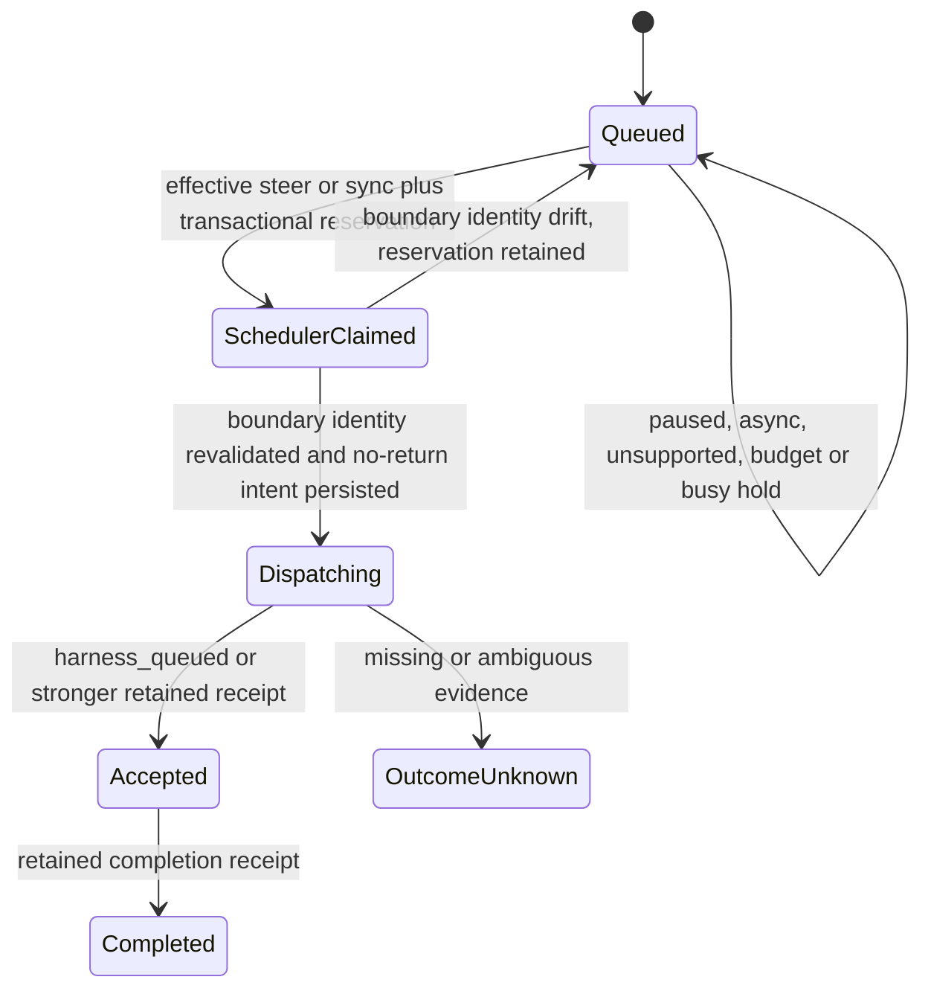
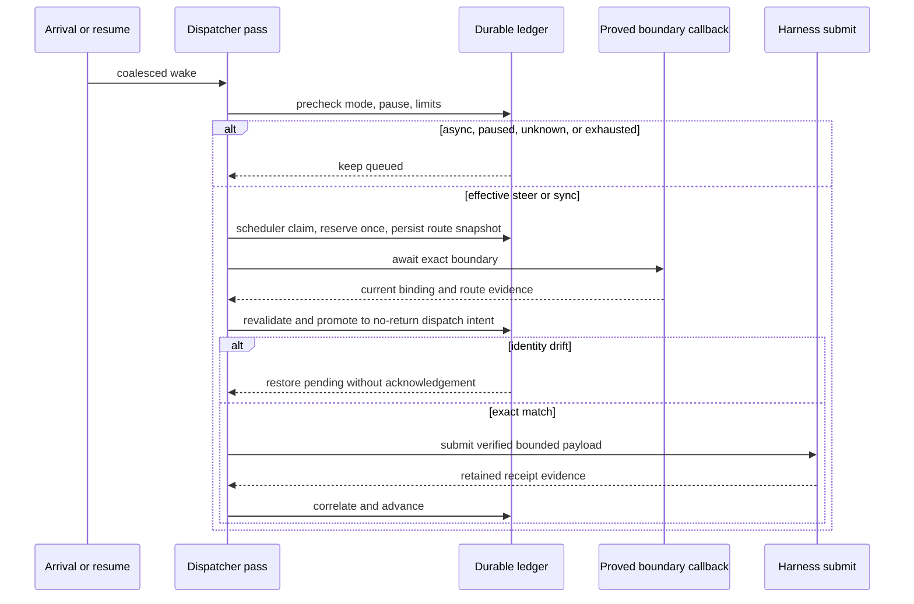

# feat: Add listening-mode dispatch gating

## Goal Capsule

- **Objective:** Extend connector dispatch so only an effective, unpaused `steer` or `sync` route can claim a release; an already claimed attempt may deliver under its snapshotted mode only after the exact user-owned interactive route is revalidated at its proved boundary.
- **Authority:** The listening-mode contract and E09 Executor decisions override older dispatch assumptions; `HarnessCapabilities` remains the sole route-evidence authority and the local automation profile supplies only job, concurrency, and busy limits.
- **Execution profile:** Preserve the existing at-most-once intent and receipt model while adding mode-aware claims, coalesced pause/resume wake behavior, and fail-closed boundary drift handling.
- **Stop conditions:** Stop rather than inventing a route when capabilities, effective mode, boundary proof, or exact session identity are absent or inconsistent.
- **Tail ownership:** Focused connector/storage tests, wrong-implementation mutations, workspace type/lint gates, and CI all belong to this change.

---

## Product Contract

### Summary

Dispatch must honor each binding's requested and effective listening mode without turning secondary hosted evidence into support for the user's CLI. `steer` and `sync` deliver only at a proved route boundary; `async` persists work and remains silent until the separate pull operation handles it. Pause blocks new claims but does not cancel an already claimed attempt.

### Problem Frame

The existing dispatcher has durable at-most-once claims, local policy limits, pause, and receipt reconciliation, but it treats every supported harness route as immediately dispatchable. It does not persist `modeAtClaim`, wait for a proved boundary, or verify that a claimed attempt still targets the same route, evidence revision, harness version, binding generation, and interactive session immediately before delivery.

### Requirements

- R1. A claim requires an exact active binding, an unpaused current policy, and a non-null effective mode equal to `steer` or `sync`; requested/effective divergence, unavailable capabilities, unsupported routes, and `async` remain pending without consuming budget.
- R2. Each claim durably records `modeAtClaim` and the complete proved route identity: binding generation, interactive session, harness and adapter versions, route, and capability-evidence revision.
- R3. The proved-boundary callback revalidates the durable binding and complete route identity immediately before submission. Drift returns the release to pending without a receipt, acknowledgement, or causal-budget refund.
- R4. Arrival and resume coalesce wake work. `async` arrival performs no harness inspection, notification, boundary wait, or submit; resume neither resets causal counters nor acknowledges a batch.
- R5. Dispatch consumes only `maxJobsPerCausalRoot`, `maxConcurrentJobs`, and `busy` from the approved local automation profile. `maxCausalDepth` remains exclusively enforced by automatic release and is rejected if presented to dispatch.
- R6. Receipt-derived transitions use only retained, correlated receipt kinds for the exact dispatched binding/session. `harness_queued` or stronger proved observations advance an attempt, refusal receipts fail it, unknown evidence waits for reconciliation, and no generic `delivered` fact is introduced.
- R7. Ordered selection preserves remaining work when job, item, payload-byte, concurrency, busy, pause, or route gates stop a pass.

### Scope Boundaries

- **In scope:** `packages/connector/src/dispatch/`, the durable dispatch-record adapter, focused connector-app composition fakes, and dispatch/storage tests.
- **Out of scope:** New receipt kinds, harness-specific delivery implementations, pull transport, UI, SQLite schema changes, read receipts, hard cancel, and any agent launch or hosting path.
- **Deferred to follow-up work:** Concrete Codex, Claude, and OpenCode boundary producers remain owned by their interactive-route tickets; this work defines and tests the harness-neutral callback contract they consume.

### Acceptance Examples

- AE1. A release queued in `sync` is claimed with the current route snapshot; if the binding is replaced before the boundary callback returns, it is restored to pending and never reaches the replacement session.
- AE2. A release arriving in `async` remains queued and produces zero harness calls; changing to an effective `sync` mode and waking later permits one ordered attempt.
- AE3. Pausing before claim prevents reservation; pausing after claim does not rewrite `modeAtClaim`; route or evidence drift before delivery still restores pending without acknowledgement.
- AE4. Exhausting the per-root job budget holds the ordered suffix. A resume or repeated wake does not reset the counter, while a human-authored new causal root remains independently eligible.
- AE5. Payloads and selected event batches exactly at capability limits can deliver; one byte or item beyond the boundary remains rejected or pending according to the existing contract without widening a harness read.

---

## Planning Contract

### Key Technical Decisions

- KTD1. Treat the applied `DispatchControlProjection` as the transactional projection of listening control and pause, carrying both `policyVersion` and `listeningModeVersion` plus requested/effective mode. Composition publishes only complete componentwise-nondecreasing projections, so neither independently versioned source can overwrite a newer value from the other. Inject a separate exact `DispatchLimits` value containing only job, concurrency, and busy limits. This keeps `maxCausalDepth` out of the dispatch contract while mode gating still participates in the same serializable claim transaction as budget reservation.
- KTD2. Persist a closed delivery-attempt snapshot rather than recomputing identity from mutable capabilities after claim. The snapshot is the authority for `modeAtClaim` and every route/session comparison.
- KTD3. Split the current one-step intent into a requeueable scheduler claim and the existing no-return dispatch intent. The first phase durably reserves budget and captures `modeAtClaim`; the second begins only after the proved boundary is revalidated and retains the old crash rule that nothing after a possible external effect can return to queued.
- KTD4. Model the proved boundary as an injected harness-neutral callback that accepts the dispatcher-lifetime `AbortSignal`. The dispatcher may wait on it, but performs no external effect inside the ledger transaction; after it resolves, dispatch performs a short revalidation transaction that promotes the scheduler claim into the no-return dispatch intent immediately before calling the existing harness submit port. Stop, abort, callback failure, or restart before promotion requeues the pre-effect claim with its one-time reservation intact.
- KTD5. Boundary drift is a pre-effect retryable outcome: the durable record returns to `queued`, keeps its sequence and one-time causal reservation, records a closed waiting reason, and stores no receipt. A later scheduler claim reuses that reservation rather than incrementing the counter again.
- KTD6. Key causal accounting by the trusted root plus a distinct durable `budgetEpoch`. Explicit re-arm increments that epoch without changing the release-freshness meaning of `armedAt`; pause/resume version bumps retain the epoch and counters.
- KTD7. Reuse the existing dispatcher pass coalescer for arrival/resume. Mode and pause are checked before capability inspection or boundary work, which makes `async` silence and paused silence observable without a harness call.
- KTD8. Treat each immutable `ReleasedJob` as one ordered boundary batch. Validate its event count and exact payload bytes against the current callback's `maxSelectionEvents` and `maxPayloadBytes` before promotion; if it exceeds either bound, that release and the later per-binding queue suffix remain pending rather than splitting an approved release.
- KTD9. Keep receipt vocabulary closed and transport-neutral. Existing correlation plus the persisted attempt snapshot establishes the user-session target; no process-write shortcut or `delivered` alias is added.

### High-Level Technical Design

### Risks and Dependencies

- Returning a post-claim attempt to pending is safe only before the harness effect; the boundary callback contract and revalidation transaction must make that ordering explicit.
- Persisted dispatch records are strict JSON contracts. Adding snapshot and scheduler-claim fields requires backward-compatible decoding for pre-E09 records, synchronized memory-ledger/SQLite canonicalization, corruption tests, and restart coverage without a table migration.
- Pre-E09 queued records may re-enter the new scheduler normally. Pre-E09 claimed or in-flight records without a complete route snapshot are non-deliverable and may advance only through retained-receipt reconciliation; current mutable capability data must never be synthesized into their historical attempt.
- Coalescing must not suppress a later legitimate resume after a prior boundary wait settles, and must not issue repeated content-free wakes while one pass is already active.
- Boundary unavailability, callback error/cancellation, or restart before no-return promotion must restore a scheduler claim to queued with its sequence and one-time reservation intact. Startup recovery enumerates these pre-effect claims before ordinary dispatch-intent reconciliation.
- A route can retain the same friendly name while its harness version, adapter version, evidence revision, binding generation, or session changes; every identity field is load-bearing.
- The three prerequisite implementations are merged on `main`: listening-mode contracts, the store/service, and the local SQLite adapter. No active dependency remains.

### System-Wide Impact

- **Persistence:** Existing dispatch records gain a versionless strict-field snapshot extension but no new SQLite table or migration.
- **Composition:** Harness-specific integrations receive one narrow callback contract and continue to own their route proofs; dispatch remains independent of `@khala/policy` implementations.
- **Runtime:** `async` and unavailable modes reduce harness activity; `steer` and `sync` add one pre-submit revalidation boundary.
- **Security:** Exact-session binding is checked twice, so released untrusted channel bytes cannot steer route selection or cross into a replacement user session.

---

## Implementation Units

### U1. Persist mode-aware claim identity

- **Goal:** Make mode eligibility and the complete route/session snapshot part of the durable claim linearization point.
- **Requirements:** R1-R2, R5, AE3-AE4.
- **Dependencies:** None.
- **Files:** `packages/connector/src/dispatch/types.ts`, `packages/connector/src/dispatch/budget.ts`, `packages/connector/src/dispatch/claim.ts`, `packages/connector/src/dispatch/claim.test.ts`, `packages/connector/src/dispatch/budget.test.ts`, `packages/connector/src/dispatch/fixtures/memory-ledger.ts`, `packages/connector/src/dispatch/memory-ledger.test.ts`, `packages/connector/src/storage/dispatch.ts`, `packages/connector/src/storage/dispatch.test.ts`.
- **Approach:** Separate the exact three-field limits projection from a complete `DispatchControlProjection` containing both independently monotonic source versions, pause, and requested/effective mode. Extend the durable record with a requeueable scheduler-claim snapshot and one-time reservation marker, and derive route identity only from the current exact binding plus evidenced support for the applied effective mode. Key causal counts by trusted root and a distinct `budgetEpoch`, while preserving `armedAt` as the release-freshness fence and rejecting unknown limit fields including `maxCausalDepth`.
- **Patterns to follow:** Strict `usablePolicy` validation, `sameSessionBinding`, `decodeRecord`, and monotonic causal-count storage.
- **Test scenarios:** `async`, null effective, requested/effective mismatch, nil capabilities, unsupported or wrapper-blocked support, and pause all remain unclaimed; proved and granted routes snapshot every identity field; componentwise-stale or partial control projections are rejected without overwriting either source; a legacy queued record claims afresh, while legacy claimed/in-flight records without a snapshot are reconciliation-only; malformed or partial new snapshots fail closed; per-root and concurrent reservations remain atomic; an explicit re-arm starts a new `budgetEpoch` and releases held work while pause/resume retains the old epoch and count; a limits value containing `maxCausalDepth` is rejected.
- **Verification:** Memory and SQLite ledgers round-trip the exact snapshot across restart, and the claim tests demonstrate that removing effective-mode gating consumes a reservation incorrectly.

### U2. Add proved-boundary delivery and pause/wake behavior

- **Goal:** Deliver claimed work only after a callback proves the same user-owned interactive route still exists.
- **Requirements:** R1-R4, R7, AE1-AE3.
- **Dependencies:** U1.
- **Files:** `packages/connector/src/dispatch/types.ts`, `packages/connector/src/dispatch/run.ts`, `packages/connector/src/dispatch/run.test.ts`, `packages/connector/src/dispatch/fixtures/fakes.ts`, `apps/connector/src/runtime/composition.test.ts`.
- **Approach:** Inject a trusted boundary port that accepts the dispatcher-lifetime `AbortSignal` and returns the current binding and capability evidence for a scheduler claim. After it resolves, transactionally require an active, unrevoked binding, compare every snapshot field, and promote to the existing no-return dispatch intent before submit. On identity drift or any pre-effect boundary exit, restore the scheduler claim to pending while retaining its single reservation; revocation records the closed revoked outcome with no submit. Reuse the pass coalescer so repeated arrival/resume signals share one pending wake, and precheck mode/pause before any boundary or harness inspection. Stop aborts unresolved callbacks, and startup recovery requeues stranded scheduler claims before reconciling irreversible intents.
- **Execution note:** Start with the replacement-session and async-silence tests, then preserve the existing crash/at-most-once suite while inserting the boundary.
- **Patterns to follow:** Existing fault-injection boundaries in `run.test.ts`, one-effect-after-durable-intent ordering, and content-free `HarnessPort.notify` semantics.
- **Test scenarios:** replacement binding/session, route, harness version, adapter version, and evidence revision each drift after claim; revocation after claim records revoked with zero submissions; a mode-only change after claim leaves the original snapshot valid; pause after claim does not cancel; callback refusal/error/cancellation and restart requeue the pre-effect claim without a second reservation; async arrival makes zero harness/boundary calls; concurrent wakes coalesce; resume wakes once without clearing causal count; stopped dispatchers make no callback or submit.
- **Verification:** Every drift case restores pending before submit, exact identity submits once, and the named replacement-session mutation fails when the session comparison is removed.

### U3. Preserve receipt truth and ordered boundaries

- **Goal:** Keep post-submit state changes grounded only in correlated retained receipt kinds while proving selection and payload boundaries.
- **Requirements:** R6-R7, AE4-AE5.
- **Dependencies:** U1-U2.
- **Files:** `packages/connector/src/dispatch/reconcile.ts`, `packages/connector/src/dispatch/reconcile.test.ts`, `packages/connector/src/dispatch/run.test.ts`, `packages/connector/src/dispatch/budget.test.ts`, `packages/connector/src/storage/dispatch.test.ts`.
- **Approach:** Audit receipt mapping against the mode snapshot and exact binding, retain unknown/refusal behavior, and validate each immutable release batch against the current boundary's event-count and payload-byte limits before promotion. Stop that binding's ordered pass at the first oversized release so its suffix remains pending. Keep the public observer boundary closed to agent-authored acknowledgement unless trusted application composition records it directly.
- **Patterns to follow:** `applyReceipt` correlation, closed `PROVES` mapping, bounded receipt retention, and the existing max-payload read of `limit + 1` bytes.
- **Test scenarios:** `harness_queued`, stronger observations, definitive refusal, disconnected/timeout, malformed and cross-binding receipts, no generic delivered fact, exact/over item and byte boundaries, and ordered suffix retention when a prior release is held.
- **Verification:** Receipt tests name every accepted decision kind, payload reads remain bounded, and no transition can be inferred from process write alone.

---

## Verification Contract

| Gate | Command | Done signal |
|---|---|---|
| Focused dispatch suites | `mise exec -- pnpm --filter @khala/connector exec vitest run --config ../../vitest.config.ts src/dispatch/claim.test.ts src/dispatch/budget.test.ts src/dispatch/run.test.ts src/dispatch/reconcile.test.ts src/dispatch/memory-ledger.test.ts src/storage/dispatch.test.ts` | Mode, claim, boundary, budgets, receipts, persistence, and restart tests pass |
| Replacement-session mutation | `mise exec -- pnpm --filter @khala/connector exec vitest run --config ../../vitest.config.ts src/dispatch/run.test.ts -t "does not deliver a claimed release to a replacement session"` | Passes normally and fails with the interactive-session comparison removed |
| Async-silence mutation | `mise exec -- pnpm --filter @khala/connector exec vitest run --config ../../vitest.config.ts src/dispatch/run.test.ts -t "keeps async arrival silent"` | Passes normally and fails when enqueue or precheck invokes the harness/boundary |
| Causal-depth ownership mutation | `mise exec -- pnpm --filter @khala/connector exec vitest run --config ../../vitest.config.ts src/dispatch/claim.test.ts -t "rejects maxCausalDepth"` | Passes normally and fails if dispatch accepts or derives the automatic-release limit |
| Resume-budget mutation | `mise exec -- pnpm --filter @khala/connector exec vitest run --config ../../vitest.config.ts src/dispatch/budget.test.ts -t "resume does not reset causal counters"` | Passes normally and fails if resume clears or refunds the job counter |
| Connector package | `mise exec -- pnpm --filter @khala/connector test && mise exec -- pnpm --filter @khala/connector typecheck && mise exec -- pnpm --filter @khala/connector build` | All connector tests, types, and build pass |
| Repository quality | `mise exec -- pnpm check:boundaries && mise exec -- pnpm lint && mise exec -- pnpm typecheck` | Boundary, lint, and workspace type gates pass |
| Base and deletion safety | `aiur guard-pr-deletions main` | Current remote `main` is fetched and no unrelated mass deletion is present |

---

## Implementation Deviations

- KTD1: rather than a separate `DispatchControlProjection` and `DispatchLimits` port, the listening
  projection is a strict `listening` field on the existing `DispatchPolicy`, whose limit fields are
  already exactly the three dispatch-owned limits. The SQLite adapter compares `version` and
  `listening.version` independently, which gives the componentwise-monotonic guarantee through one
  transactional read.
- KTD6: a distinct `budgetEpoch` would key `dispatch_causal_counts` by a second column, which is a
  schema change and out of scope. Counters stay keyed by trusted causal root; a re-arm reaches
  dispatch as a new trusted root from the releaser, and nothing in dispatch resets a count.
- Ordering: besides a claim waiting at its boundary, an earlier release returned to pending with
  its reservation holds the binding's later releases, so a requeued release is never overtaken.

## Definition of Done

- Every new claim is gated by requested/effective mode, pause, exact binding, proved support, and the three dispatch-owned local limits.
- The durable claim records `modeAtClaim` and complete route/session identity, and strict persistence rejects malformed snapshots.
- Every boundary field is revalidated before submission; drift returns the release pending with no acknowledgement or harness delivery.
- `async` arrivals and paused work make no harness or boundary call, while arrival/resume wake coalescing does not reset counters.
- Dispatch has no `maxCausalDepth` input, derived value, or enforcement path.
- Receipt transitions remain a closed mapping of retained correlated facts with no generic `delivered` state or process-write inference.
- Item, byte, ordering, concurrency, busy, restart, and crash boundaries pass focused tests.
- Each required wrong-implementation mutation is recorded with its exact command, observed guarded failure, restored line, and passing rerun.
- The branch is current with `main`, deletion guard passes, a draft PR is self-reviewed, and CI handoff is complete.
