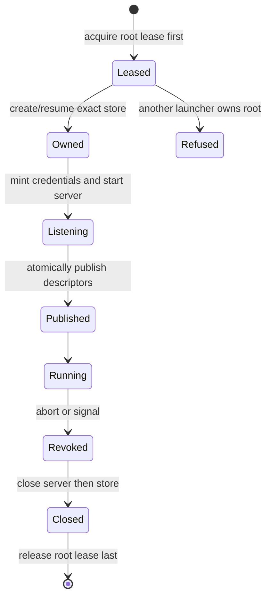

# Internal Launcher - Plan

## Goal Capsule

- **Objective:** Add `khala internal` create, resume, export, and delete commands through a lazy application-owned launcher that starts only the local authenticated server and publishes strict runtime descriptors.
- **Authority:** `docs/product/internal-mode/executor-decisions.md` items 1-44 override earlier research. The launcher never starts, hosts, stops, or signals an agent CLI.
- **Execution profile:** Define the shared descriptor and bundle-location contract first, acquire one crash-safe per-user runtime lease, compose the existing store/lifecycle/server primitives, rotate launch credentials, publish descriptors only after listen succeeds, and cleanly revoke discovery before releasing ownership.
- **Stop conditions:** Do not add agent admission/bindings, remote hosting, Make External, web UI implementation, or an MCP duplicate of the operator command.
- **Tail ownership:** This ticket owns focused process proofs, CLI documentation, package/repository validation, self-review, one PR, and CI handoff against `main`.

---

## Product Contract

### Summary

An operator can create or resume one local internal channel, receive the channel ID, exact resume command, descriptor path, and manual browser URL, then stop only the local server. Offline export and confirmed delete reuse the existing lifecycle APIs. Runtime discovery is strict, atomic, owner-private, and honest: it never implies an agent binding before one exists.

### Requirements

**Shared runtime contract**

- R1. Own a strict versioned internal descriptor contract in `packages/contracts/src/internal/descriptor.ts`, exported for the future local agent client. Transport-only and granted descriptors are closed shapes; the launcher publishes only transport-only state.
- R2. Accept only canonical IPv4 loopback origins, bounded identifiers, canonical 43-character base64url capabilities, exact keys, and complete granted-state fields. Reject paths, credentials, query/hash components, unknown fields, and mixed partial states.
- R3. Define one shared web bundle-directory constant beside the descriptor contract. The launcher accepts an injected asset manifest and tests against a fixture bundle; it does not wait for or import the web implementation.

**Exclusive launch and secure publication**

- R4. Acquire a stable per-user root runtime lease before inspecting or mutating stale active state, probing a port, minting credentials, or opening a channel. A second launcher fails without changing `active.json`.
- R5. Create private runtime directories and write `launch.json` plus root `active.json` through synced `0600` sibling temporaries, atomic rename, and parent-directory sync. Publish `active.json` only after the server is listening.
- R6. Create persists exactly one channel with its synthetic local human participant/device and lifecycle identity, with zero agent bindings. Resume opens and validates the exact existing channel and rotates every launch-scoped credential without creating replacement state.
- R7. Start the real authenticated loopback channel server on the requested/default port, falling forward only when an unrelated listener owns that port. A held root lease always wins over apparent port availability.
- R8. SIGINT, SIGTERM, and explicit abort share one idempotent shutdown path that invalidates runtime discovery and launch credentials, removes private browser handoff material, closes the server, closes the store, and releases the root lease last. It never enumerates or signals CLI processes.

**CLI and browser handoff**

- R9. Recognize `khala internal`, `khala internal --resume <channel-id>`, `khala internal export <channel-id> --format markdown|jsonl --output <path> [--replace]`, and `khala internal delete <channel-id> --yes`; reject mixed or extra arguments before invoking the lazy delegate.
- R10. Keep internal runtime modules out of unrelated CLI startup. The agent CLI supplies parsing/types while an application-owned composition entry dynamically imports the launcher only for `internal`.
- R11. Successful create/resume output includes one machine-safe JSON object with `channelId`, exact `resumeCommand`, `descriptorPath`, `origin`/selected port, and the credential-bearing manual URL. Export/delete produce finite lifecycle results and preserve the plaintext/no-secure-erase notice.
- R12. Always print the manual URL. Automatic browser opening remains off unless the exact host profile matches a proven matrix entry; if attempted, use a fresh `0700` directory and exclusive `0600` redirect file and pass only the absolute file path to `xdg-open`.
- R13. Profiling, parent creation, private-file preparation, leak checking, spawning, and cleanup are all best-effort adapter operations. Any failure, including `prepareHandoff` `ENOENT`, returns a normal not-opened result and never prevents manual startup output.

**Proof**

- R14. Process-level tests prove create, shutdown, and resume against a real store/server with fixture assets; descriptor modes and rotation; offline export/delete; signal cleanup; lazy loading; opener fallback; and concurrent-launch refusal.
- R15. The named wrong-implementation test starts launcher A and a sentinel CLI, then attempts launcher B while a free next port exists. It proves B refuses at the root lease, `active.json` is byte-identical, and the sentinel remains alive. Reverting the lease-before-port/descriptor guard makes that exact test fail.

### Scope Boundaries

- `launch.json` is the local human bootstrap record; `active.json` is agent-client transport discovery. Neither grants admission or asserts a live agent binding.
- A post-commit startup failure retains the newly created durable channel and returns its stable channel ID/resume command while leaving no active descriptor. It does not silently delete user state.
- Export and delete are one-shot offline operations: they do not start a server, mint launch credentials, prepare a browser handoff, or create an agent binding.
- The browser spike is evidence only. Production code ports its narrow private-file/profile contract and imports nothing from `experiments/`.
- The launcher may use a liveness check on its own runtime owner, but it never sends a signal to a CLI or treats a CLI PID as launcher ownership.

### Acceptance Examples

- AE1. A bare launch creates one human-only channel, listens on loopback, atomically publishes strict `0600` launch and active descriptors, prints all recovery information, and stays alive until abort.
- AE2. A resume of exact offline state rotates bootstrap and transport capabilities, replaces both descriptors atomically, preserves channel history/identity, and refuses missing, corrupt, mismatched, or already-running state.
- AE3. While launcher A owns the root, launcher B refuses before port probing or descriptor mutation even when another port is free; `active.json` bytes remain unchanged and an unrelated CLI sentinel receives no signal.
- AE4. Shutdown first makes discovery unavailable, then makes the URL unreachable, closes durable ownership, and releases the root lease. Repeated shutdown calls are harmless.
- AE5. An unproven desktop profile still prints the URL and never spawns a browser. A proven profile passes only a private redirect-file path, and any preparation/spawn error falls back to printed instructions.
- AE6. Unrelated CLI commands do not load launcher/store/server modules. Export/delete invoke only their lifecycle operations and preserve their confirmation and plaintext-storage boundaries.

---

## Planning Contract

### Key Technical Decisions

- KTD1. Model the shared descriptor as a strict discriminated union with decoder functions rather than optional grant fields. This gives #188 one stable import and prevents dishonest half-granted runtime state.
- KTD2. Put the bundle-directory name in the internal descriptor contract package so both #185 and this launcher consume it without package-to-app imports.
- KTD3. Use a stable SQLite-backed lease below the private runtime root, following the store's ownership, no-follow, mode, and crash-release guarantees. Do not use a stale-prone PID-only `O_EXCL` lockfile.
- KTD4. Keep creation/resume orchestration in `apps/internal/src/launcher/**` and executable wiring in `apps/internal/src/composition/**`. The package CLI exposes a narrow internal-command delegate seam; it never imports the application.
- KTD5. Store stable human identity alongside versioned bootstrap material in `launch.json`. On resume validate it against lifecycle metadata, preserve identity, and rotate only launch-scoped secrets.
- KTD6. Inject clock, ID/token generation, asset manifest, opener adapter, and signal/abort boundaries so focused tests remain deterministic while production uses the real server/store/filesystem.
- KTD7. Construct the bootstrap URL with the credential in the fragment, always render it, and gate auto-open on an exact proven-profile match. Private redirect cleanup occurs on shutdown and a deadline no later than credential expiry; no server exchange hook is added in this ticket.
- KTD8. Keep CLI stdout to one JSON value and finite stderr failures. Do not print transport capabilities separately, though the manual URL necessarily carries the bootstrap credential.
- KTD9. The launch lifecycle is a state machine: root leased -> store owned -> credentials prepared -> server listening -> descriptors published -> running -> discovery invalidated -> server/store closed -> lease released. Cleanup runs in reverse ownership order and is idempotent.

### High-Level Technical Design

```mermaid
flowchart LR
  C[khala CLI] -->|internal only| D[Lazy internal delegate]
  D --> L[Application launcher]
  L --> R[Root runtime lease]
  R --> S[Channel store + lifecycle]
  S --> H[Authenticated loopback server]
  H --> W[Atomic launch.json + active.json]
  W --> O[JSON output + manual URL]
  O -. exact proven profile .-> P[Private redirect-file opener]
```





### Output Structure

```text
packages/contracts/src/internal/
  descriptor.ts
  descriptor.test.ts
apps/internal/src/
  descriptor/write.ts
  launcher/
    lock.ts
    browser-handoff.ts
    launcher.ts
    *.test.ts
  composition/
    cli.ts
packages/agent-cli/src/cli/
  internal.ts
  app.ts
  main.ts
  types.ts
```

### Risks and Dependencies

- #188 consumes the descriptor contract and is blocked on its publication; implement, verify, commit, and push that unit first, then emit the validated ref/SHA.
- #297 owns the one-time agent CLI command-registry conversion and #257 owns setup CLI planning. Build the internal parser/delegate independently, then integrate only after their explicit `unblocked` events and validated branch refs; do not duplicate their hotspot work.
- #185 is not a blocker. Its build will target the shared bundle-directory constant after this ticket; launcher tests use fixture assets.
- Root-lease ordering is security-critical and has a required mutation proof. Descriptor publication, stale cleanup, and port fallback must remain structurally below successful lease acquisition.
- Credential-bearing output is intentional for the printed manual URL. Tests and errors must avoid echoing individual bootstrap/transport secrets elsewhere.

### Sources and Research

- `docs/product/internal-mode/internal-core.md` section 9 and `docs/product/internal-mode/executor-decisions.md` define the binding launcher, descriptor, lifecycle, and trust boundaries.
- `apps/internal/src/server/**`, `apps/internal/src/store/**`, and `apps/internal/src/lifecycle/**` provide the real loopback server, exclusive store, and exact-channel operations.
- `packages/agent-cli/src/cli/inbox.ts` provides durable file and ownership patterns; `scripts/check-boundaries.mjs` requires application-owned composition.
- `experiments/internal-mode/internal-core/browser-handoff/**` supplies the proven private-file/profile evidence but is not a production dependency.
- Executor decision 44 assigns the descriptor and bundle constant to this ticket and removes #185 as a launcher blocker.

---

## Implementation Units

### U1. Publish the descriptor and bundle contract

- **Goal:** Give the launcher and blocked downstream tickets one strict, exported internal runtime contract.
- **Requirements:** R1-R3; AE1-AE2.
- **Dependencies:** None.
- **Files:** `packages/contracts/src/internal/descriptor.ts`, `packages/contracts/src/internal/descriptor.test.ts`, `packages/contracts/package.json`.
- **Approach:** Define exact transport/granted shapes, strict decoders/validators, canonical loopback/capability rules, and the stable bundle-directory constant. Add package exports and compatibility tests.
- **Verification:** Focused contracts tests and typecheck pass; then commit, guard, push, and emit `unblocked` with the validated branch ref/SHA for #188/#185.

### U2. Secure launcher-owned filesystem state

- **Goal:** Acquire one crash-safe root lease and atomically write/rotate/invalidate launch and active descriptors.
- **Requirements:** R4-R5, R8, R15; AE3-AE4.
- **Dependencies:** U1.
- **Files:** `apps/internal/src/launcher/lock.ts`, `apps/internal/src/descriptor/write.ts`, focused tests.
- **Approach:** Reuse private-path/no-follow invariants, add a SQLite-backed lease, synced `0600` sibling temporaries, exact descriptor encoding, owner-checked cleanup, and stale-state recovery only after lease acquisition.
- **Verification:** Contention, crash release, symlink/mode/owner refusal, atomic rotation, injected failure, and unchanged-active tests pass.

### U3. Compose create, resume, and shutdown

- **Goal:** Start and resume real internal channels without creating or controlling an agent.
- **Requirements:** R6-R8, R11, R14-R15; AE1-AE4.
- **Dependencies:** U1-U2 and merged server/lifecycle primitives.
- **Files:** `apps/internal/src/launcher/launcher.ts`, fixture assets and process tests, `apps/internal/src/composition/cli.ts`.
- **Approach:** Implement the leased state machine, human-only create transaction, exact resume/credential rotation, real server startup, post-listen descriptor publication, JSON launch result, and idempotent abort cleanup. Preserve a committed channel on later startup failure and report recovery data.
- **Verification:** Real create -> reachable server -> abort -> unreachable -> resume process proof; credential rotation; zero binding assertion; occupied-port fallback; root-lock wrong-implementation proof.

### U4. Port the safe browser handoff

- **Goal:** Keep manual bootstrap reliable while permitting auto-open only for exact proven profiles without leaking the URL in process arguments.
- **Requirements:** R12-R13; AE5.
- **Dependencies:** U3 for the generated manual URL.
- **Files:** `apps/internal/src/launcher/browser-handoff.ts`, focused tests.
- **Approach:** Port the profile matrix contract, private `0700` directory/`0600` redirect file, argv leak guard, spawn adapter, deadline/shutdown cleanup, and one outer never-throws boundary that includes preparation.
- **Verification:** Unproven profiles skip; proven profiles pass only a file path; URL never appears in argv; missing parent/`ENOENT`, spawn, guard, and cleanup faults return not-opened while launch succeeds.

### U5. Add lazy CLI commands and lifecycle delegation

- **Goal:** Expose create/resume/export/delete without loading launcher code for unrelated CLI commands.
- **Requirements:** R9-R11, R14; AE5-AE6.
- **Dependencies:** U3-U4; #297/#257 only at their owned registry integration point.
- **Files:** `packages/agent-cli/src/cli/internal.ts`, `app.ts`, `main.ts`, `types.ts`, tests; `apps/internal/src/composition/cli.ts`; bundle script/package metadata; `packages/agent-cli/README.md`.
- **Approach:** Parse the closed grammar in the lightweight CLI layer, invoke an injected lazy delegate, wire the application composition entry for the bundle, map export/delete to existing lifecycle functions, and document every command/flag and plaintext boundary.
- **Verification:** Parser matrices, lazy-import sentinel, one-shot export/delete tests, package typecheck/build, CLI README accuracy, and boundary checks pass.

### U6. End-to-end wrong-implementation proof and cleanup audit

- **Goal:** Demonstrate the exact failure mode the contract forbids and close all verification gates.
- **Requirements:** R14-R15; AE3-AE6.
- **Dependencies:** U1-U5.
- **Files:** Process-level launcher test and existing package/repository configuration only as needed.
- **Approach:** Run launcher A plus an unrelated sentinel CLI, snapshot `active.json`, attempt B with a free fallback port, and assert lease refusal, byte identity, and sentinel liveness. Temporarily revert only the guarded lease-before-port/descriptor line, run the exact test to observe failure, restore, and rerun green.
- **Verification:** Record the exact green and mutation-failure commands/output in the PR; run affected package suites, typecheck, lint, build, boundary checks, base freshness, self-review, and CI.

---

## Verification Contract

| Gate | Command or evidence | Done signal |
|---|---|---|
| Descriptor contract | `mise exec node@22.23.2 -- corepack pnpm --filter @khala/contracts test -- src/internal/descriptor.test.ts` | Exact transport/granted shapes and hostile decode cases pass. |
| Launcher filesystem/security | `mise exec node@22.23.2 -- corepack pnpm --filter @khala/internal test -- src/launcher src/descriptor` | Lease, atomic descriptor, handoff, and failure-injection cases pass. |
| Internal package | `mise exec node@22.23.2 -- corepack pnpm --filter @khala/internal test` | Existing and new store/server/lifecycle behavior remains green. |
| Agent CLI | `mise exec node@22.23.2 -- corepack pnpm --filter @aiur/khala test` | Grammar, lazy delegation, output, export, and delete cases pass. |
| Type/build boundaries | `mise exec node@22.23.2 -- corepack pnpm typecheck && mise exec node@22.23.2 -- corepack pnpm check:boundaries && mise exec node@22.23.2 -- corepack pnpm build` | Workspace compiles, package ownership is valid, and the shipped bundle builds. |
| Formatting/lint | `mise exec node@22.23.2 -- corepack pnpm lint` | Touched code passes repository lint/format checks. |
| Wrong implementation | Run the exact focused concurrent-launch process test, revert only the lease-before-port/descriptor guard, rerun, restore, and rerun. | Guarded test passes; reverted version fails because launcher B proceeds/mutates despite A's root lease. Sentinel CLI remains alive in the guarded run. |

---

## Definition of Done

- The shared strict descriptor and bundle constant are pushed early and downstream consumers receive the validated ref/SHA.
- Create/resume hold one crash-safe root lease, start only the local server, publish/rotate exact private descriptors, print complete recovery output, and never create or control an agent binding/process.
- Export/delete stay offline and retain the existing lifecycle confirmation and plaintext-storage truth.
- Browser handoff never exposes the bootstrap URL in process arguments, remains off for unproven profiles, and cannot turn an opener failure into a launch failure.
- The concurrent-launch mutation proof fails under the exact reverted guard and passes after restoration; all commands and observed failure are recorded.
- CLI documentation, focused suites, workspace typecheck/lint/build/boundary checks, base freshness, self-review, draft PR, delivered CI, ready-for-review transition, and `agent:human-review` handoff are complete.
