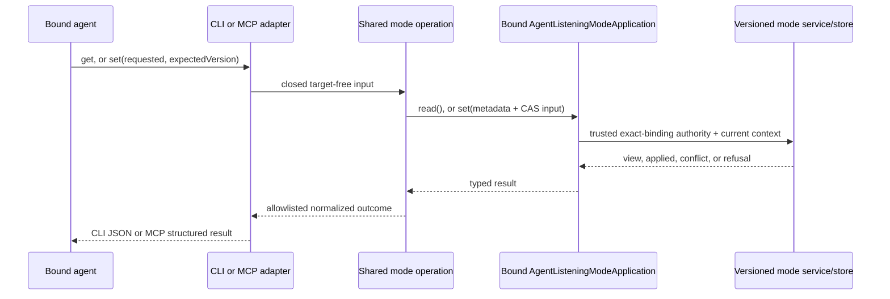

# Listening Mode Agent Controls - Plan

## Goal Capsule

- **Objective:** Let the authenticated bound agent inspect its exact listening-mode state and make one version-checked mode change through CLI and MCP without receiving target or grant authority.
- **Authority:** The `listening-mode-agent-controls` contract in `docs/product/internal-mode/listening-modes.md`, then the later decisions in `docs/product/internal-mode/executor-decisions.md`, then the merged listening-mode store and pull seams.
- **Execution profile:** Build one adapter-neutral operation over the merged `AgentListeningModeApplication`, expose it as `khala mode get/set` and `khala_listening_mode`, and keep shared registrations minimal.
- **Stop conditions:** Stop if the implementation needs request-carried binding authority, owner/grant operations, silent conflict retries, a second mode store, harness delivery, agent-process control, or claims that mode state proves current or idle delivery.
- **Tail ownership:** This ticket owns focused behavior tests, guarded wrong-implementation proofs, package and skill documentation, package verification, draft PR review, and CI handoff.

---

## Product Contract

### Summary

An authenticated agent can inspect the requested, effective, supported, and versioned listening mode for its own active binding, then submit one compare-and-set mutation using the inspected version. The bound application remains the authority boundary: callers choose only a requested mode and expected version, and conflicts require a fresh inspection instead of an automatic retry.

### Problem Frame

The listening-mode store already supplies exact-binding read/set operations and trusted connector composition already derives non-decodable agent authority from the held binding. The agent CLI has no shared operation or CLI/MCP surface for those capabilities, so an agent cannot safely inspect capability divergence or participate in last-change-wins mode control.

### Requirements

**Inspection and mutation**

- R1. `khala mode get` and MCP `khala_listening_mode` get return the exact active binding's requested mode, effective mode, effective reason, version, and complete per-mode support/reason projection.
- R2. `khala mode set <steer|sync|async> --expected-version <version>` and MCP set submit only `{requested, expectedVersion}` through one shared operation, with operation metadata generated once for that invocation.
- R3. An applied set returns the authoritative compact applied projection from `ListeningModeResult`; callers use get when they need the full support map.
- R4. A stale version returns a typed conflict containing the current requested/effective/version projection and an actionable `stale_version` reason, with no automatic retry.
- R5. Revoked, replaced, stale-generation, unavailable, and idempotency failures return typed refusals with stable actionable reasons and never imply the requested mode took effect.

**Authority and safety**

- R6. Neither surface accepts a binding ID, binding generation, owner authority, route, evidence, grant, or grant command; runtime validation rejects partial, extra, and target-shaped input before invoking the application.
- R7. The agent CLI reuses `AgentListeningModeApplication`; it never constructs, decodes, serializes, or widens `AgentBindingAuthority`, and exposes no experimental-route or hard-cancel grant operation.
- R8. Requested/effective divergence and support reasons are preserved verbatim enough to explain unavailable delivery; no output claims that a requested or effective mode proves current or idle delivery.
- R9. Mode operations never launch, host, interrupt, stop, or kill the user's CLI process and do not read the delivery inbox outside the existing MCP result-postprocessing contract.

**CLI, MCP, and guidance parity**

- R10. `khala_listening_mode` uses an explicit get/set discriminator; get accepts no mode fields, set requires both `requested` and `expectedVersion`, and malformed or notification-shaped calls neither inspect nor mutate mode.
- R11. Every valid MCP mode result, including conflict and refusal, participates in the merged optional `ackBatchToken` and incidental batch postprocessor exactly once; invalid parameters and notifications neither acknowledge nor select a batch.
- R12. CLI and MCP return equivalent normalized state and outcomes, while preserving their established exit-code and MCP `isError` conventions for conflict/refusal.
- R13. Agent skill and package guidance describe inspect-before-set, fresh-get conflict recovery, requested/effective divergence, support reasons, ambient exact-binding authority, and honest idle-delivery limitations.

### Acceptance Examples

- AE1. Given one active binding, when the agent calls CLI or MCP get, then it receives the same requested/effective/version/support state without supplying a target.
- AE2. Given version N, when the agent sets a supported mode with `expectedVersion: N`, then the operation applies once and returns version N+1 with the resulting requested/effective projection.
- AE3. Given an owner write after the agent's get, when the agent submits stale version N, then the operation reports conflict with the current state and `stale_version`, preserves the owner's value, and performs no retry.
- AE4. Given a replaced generation or revoked binding, when a captured CLI/MCP composition gets or sets, then trusted composition refuses before store access and the public surface leaks no target, grant, or authority field.
- AE5. Given requested/effective divergence or unknown/unsupported delivery evidence, when the agent inspects or sets, then output preserves the reason and guidance does not claim current or idle delivery.
- AE6. Given a valid mode MCP call with an outstanding batch token, when it completes with applied, conflict, or refusal, then acknowledgement/postprocessing follows the shared next-call contract; malformed calls and notifications leave both mode and batch state untouched.

### Scope Boundaries

In scope are exact-binding inspection, one CAS mutation, CLI/MCP parity, shared acknowledgement and piggyback participation, typed outcomes, support-reason fidelity, and concise agent/package guidance.

Out of scope are owner UI, grant mutation, arbitrary binding targeting, channel defaults, release pull implementation, provider or harness delivery, setup, receipts, polling, workflow-level mode selection, conflict auto-retry, and agent lifecycle control.

---

## Planning Contract

### Key Technical Decisions

- KTD1. Put command metadata generation and result normalization in `packages/agent-cli/src/composition/listening-mode.ts`, and inject the already-bound `AgentListeningModeApplication`. CLI and MCP remain thin adapters over the same operation.
- KTD2. Treat binding authority as ambient and non-serializable. The public request grammar has no target fields, and agent-cli never imports an authority constructor or owner/grant service.
- KTD3. Preserve the merged application split: get returns the full `ListeningModeView`; set returns the authoritative compact `ListeningModeResult`. Conflict normalization supplies `stale_version` when the store's effective-state reason is null, but never rewrites other support or refusal reasons.
- KTD4. Make MCP arguments an explicit closed union: `{ action: "get", ackBatchToken? }` or `{ action: "set", requested, expectedVersion, ackBatchToken? }`. This avoids interpreting omission as intent and makes partial mutations fail before the application call.
- KTD5. Route all valid mode tool outcomes through the existing generic MCP postprocessor. Mode calls may return an incidental untrusted channel batch and may acknowledge the prior exact token, but they never select through the explicit-read preselected path.
- KTD6. Keep state projection strict and allowlisted at the agent-cli boundary so injected extra fields are not printed. Preserve every mode's support status, route/evidence fields, and reason needed for honest capability inspection.
- KTD7. Treat conflict/refusal as typed non-success: CLI writes the structured result and exits with the existing refusal-class code; MCP returns structured content with `isError: true`. Neither adapter throws away the current conflict projection or retries.

### High-Level Technical Design

### Sequencing

1. Add the shared operation and extend the injected client/composition fixtures with the bound read/set seam.
2. Add CLI parsing/rendering and the MCP tool, then minimally register both surfaces and generic MCP postprocessing.
3. Add parity, authority, conflict, piggyback, and guarded mutation proofs before updating skill/package guidance.

### Risks and Dependencies

- All declared prerequisites are merged on `main`: listening-mode contracts (`ef20d38`), listening-mode store and authenticated agent façade (`0f45981`), ordered pull (`35334fd`), and the published/setup CLI layout (`670759b`).
- Shared CLI and MCP files are hotspot surfaces. New behavior stays in dedicated modules, while registrations and fake clients receive only the minimum new dependency/method wiring.
- Existing docs and tests say MCP exposes exactly two tools. The change must update every count/name assertion to exactly three without weakening closed schemas or unrelated send/read coverage.
- Existing skill-doc tests invoke documented top-level commands. They must understand the valid `mode get` command path instead of treating bare `mode` as a complete invocation.
- A requested/effective match is capability projection, not proof that the interactive or idle route delivered. Support/effective reasons and the retained idle warning remain authoritative.

---

## Implementation Units

### U1. Shared operation and CLI mode commands

- **Goal:** Implement target-free exact-binding inspection and one CAS mutation through `khala mode get/set`.
- **Requirements:** R1-R9, R12; AE1-AE5; KTD1-KTD3, KTD6, KTD7.
- **Dependencies:** Merged authenticated agent application façade.
- **Files:** `packages/agent-cli/src/composition/listening-mode.ts`, `packages/agent-cli/src/composition/listening-mode.test.ts`, `packages/agent-cli/src/cli/mode.ts`, `packages/agent-cli/src/cli/mode.test.ts`, `packages/agent-cli/src/cli/types.ts`, `packages/agent-cli/src/cli/app.ts`, `packages/agent-cli/src/cli/app.test.ts`, `packages/agent-cli/src/cli/main.ts`, `packages/agent-cli/src/cli/main.test.ts`, `packages/agent-cli/src/composition/bootstrap.ts`, `packages/agent-cli/src/composition/bootstrap.test.ts`, `packages/agent-cli/src/composition/unavailable.ts`.
- **Approach:** Generate command IDs and UTC timestamps inside the operation, validate exact public inputs, delegate through the bound application, and normalize only allowlisted state/result fields. Parse get/set as closed CLI shapes, reject any target/generation/grant flag, and preserve structured conflict/refusal output with the refusal-class exit code.
- **Patterns to follow:** `packages/agent-cli/src/cli/send.ts` for command metadata and defensive public results, `packages/agent-cli/src/cli/read.ts` for closed parsing/rendering, and `packages/connector/src/agent/listening-mode.ts` for the target-free application contract.
- **Test scenarios:**
  1. Get returns requested/effective/version and the complete support/reason map, with injected extra fields omitted.
  2. Set passes the exact requested mode and expected version once, generates stable per-call metadata, and returns the applied projection.
  3. A concurrent owner change makes the stale agent write conflict, preserves the current value, emits `stale_version`, and performs no retry.
  4. Revoked, replaced-generation, unavailable, and idempotency refusals retain stable reasons and never print requested success.
  5. Missing, negative, non-integer, duplicated, reordered, target-shaped, generation-shaped, authority-shaped, and grant-shaped arguments fail before the application call.
  6. The unavailable and connector-bootstrap clients delegate or fail closed without widening the public authority surface.
- **Verification:** Focused operation, parser, app, main, bootstrap, and unavailable-client tests prove target-free wiring, defensive projection, CLI exit semantics, and CAS behavior.

### U2. MCP listening-mode tool and shared result composition

- **Goal:** Expose the same get/set operation as `khala_listening_mode` while preserving MCP protocol and batch-token invariants.
- **Requirements:** R1-R12; AE1-AE6; KTD1-KTD7.
- **Dependencies:** U1 and the merged MCP result postprocessor.
- **Files:** `packages/agent-cli/src/mcp/listening-mode-tool.ts`, `packages/agent-cli/src/mcp/listening-mode-tool.test.ts`, `packages/agent-cli/src/mcp/server.ts`, `packages/agent-cli/src/mcp/server.test.ts`, `packages/agent-cli/src/cli/app.ts`, `packages/agent-cli/src/cli/app.test.ts`.
- **Approach:** Define the closed tool schema and runtime get/set union in a dedicated module. Register it as the third tool, strip the shared `ackBatchToken` once, execute target-free mode input, and pass every valid primary result through generic postprocessing. Preserve JSON-RPC invalid-parameter behavior for malformed requests and notification ineligibility for both mode and batch mutation.
- **Patterns to follow:** `packages/agent-cli/src/mcp/read-tool.ts` for dedicated schemas/execution, and the `khala_send` path in `packages/agent-cli/src/mcp/server.ts` for generic acknowledgement and incidental piggyback.
- **Test scenarios:**
  1. Tool listing contains exactly `khala_send`, `khala_read`, and `khala_listening_mode`, each with a closed schema and trust/action guidance.
  2. MCP get and applied set deep-match the CLI normalized state/result, including requested/effective divergence and support reasons.
  3. Conflict/refusal return actionable structured `isError` results and leave the server available for the next request.
  4. Partial, extra, binding-target, generation, owner, authority, route, evidence, and grant fields produce `-32602` before read/set or postprocessing.
  5. Valid get, applied, conflict, and refusal outcomes acknowledge only an exact prior token and may append one incidental batch; malformed calls, notifications, and protocol calls neither acknowledge, select, nor mutate.
  6. Pipelined mode calls remain ordered through response writes and do not cross-contaminate metadata or expected versions.
- **Verification:** MCP tool/server tests prove schema, runtime validation, CLI parity, typed outcomes, generic batch composition, notification safety, and serialization.

### U3. Agent guidance and capability honesty

- **Goal:** Teach agents to inspect before setting, recover from CAS conflict, and distinguish mode state from delivery proof.
- **Requirements:** R7-R9, R13; AE3-AE5.
- **Dependencies:** U1 and U2 behavior finalized.
- **Files:** `packages/agent-cli/README.md`, `packages/agent-skill/SKILL.md`, `packages/agent-skill/src/capabilities.ts`, `packages/agent-skill/src/capabilities.test.ts`, `packages/agent-skill/src/skill-docs.test.ts`.
- **Approach:** Document the exact CLI/MCP shapes, target-free ambient authority, inspect-before-set flow, conflict refresh, and requested/effective/support interpretation. Keep fallback capabilities unknown and preserve the honest next-turn idle-delivery reason; mode control does not promote delivery evidence.
- **Test scenarios:**
  1. Skill documentation names only implemented command/tool shapes and describes get-before-set plus fresh-get recovery after conflict.
  2. Guidance forbids arbitrary target/grant fields, silent retry, owner operations, and delivery/lifecycle claims.
  3. Capability fixtures retain the next-turn idle warning and do not become proven merely because mode controls exist.
  4. Package docs list exactly three MCP tools and explain that mode calls share optional next-call acknowledgement and incidental piggyback behavior.
- **Verification:** Agent-skill capability/doc tests and package assertions keep command names, tool inventory, conflict guidance, and safety language aligned with implementation.

---

## Verification Contract

| Gate | Command or evidence | Done signal |
| --- | --- | --- |
| Focused agent CLI | `pnpm --filter @aiur/khala exec vitest run --config ../../vitest.config.ts src/composition/listening-mode.test.ts src/cli/mode.test.ts src/cli/app.test.ts src/cli/main.test.ts src/mcp/listening-mode-tool.test.ts src/mcp/server.test.ts` | Get/set, strict input, CAS conflict, refusal, parity, postprocessing, and protocol scenarios pass. |
| Focused agent skill | `pnpm --filter @khala/agent-skill exec vitest run --config ../../vitest.config.ts src/capabilities.test.ts src/skill-docs.test.ts` | Guidance and capability honesty pass. |
| Package suites | `pnpm --filter @aiur/khala test` and `pnpm --filter @khala/agent-skill test` | All affected package tests pass. |
| Static contract | `pnpm --filter @aiur/khala typecheck`, `pnpm --filter @aiur/khala build`, `pnpm --filter @khala/agent-skill typecheck`, `pnpm --filter @khala/agent-skill build`, `pnpm check:boundaries`, and `pnpm lint` | Types, bundle, import boundaries, and lint pass. |
| Wrong implementation: arbitrary target | Run the focused target/extra-field test normally, revert the runtime target-field guard in an isolated ticket worktree, and rerun the exact command. | Normal run passes; reverted guard invokes or redirects the application and the named test fails. Record the exact command and failure. |
| Wrong implementation: stale version | Run the focused one-winner conflict test normally, revert exact `expectedVersion` propagation in an isolated ticket worktree, and rerun the exact command. | Normal run passes; reverted guard overwrites, misclassifies, or retries the concurrent value and the named test fails. Record the exact command and failure. |
| PR safety | `aiur guard-pr-deletions main` immediately before push, followed by an ancestry check against fetched `origin/main` | No unrelated deletion and current base is an ancestor of the exact PR head. |

No `website/docs-app/` tree exists on this branch, so the user-facing CLI documentation for this package lives in `packages/agent-cli/README.md` and the installed agent skill.

---

## Definition of Done

- U1-U3 satisfy their traced requirements without request-carried authority, target selection, owner/grant methods, conflict retry, duplicate state, harness delivery, or process lifecycle control.
- CLI and MCP share one operation and return equivalent allowlisted inspection/applied/conflict/refusal projections.
- A stale version preserves the concurrent winner and requires a fresh get; stale generation, revocation, and cross-binding attempts fail before storage through trusted composition.
- Every valid mode MCP result participates once in shared acknowledgement/piggyback behavior, while malformed and notification-shaped calls touch neither mode nor batch state.
- Skill and package guidance preserves requested/effective/support distinctions and makes no false current- or idle-delivery claim.
- Each guarded wrong-implementation test passes normally and fails with its production guard reverted; the exact command, changed line, and observed assertion are recorded in the workpad and PR.
- Focused tests, package suites, typechecks, builds, boundaries, lint, deletion guard, branch freshness, draft PR self-review, and CI handoff complete.
- The final diff contains no temporary stubs, authority decoders, target/grant inputs, abandoned experiments, or unrelated cleanup.
