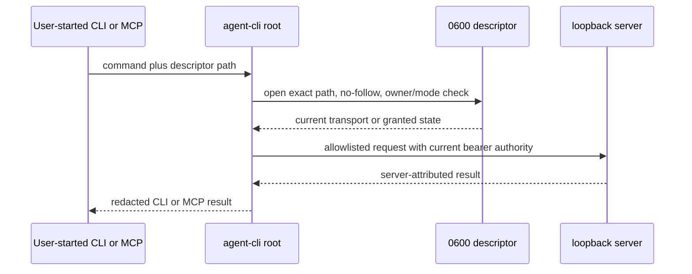

# Connect local agent clients

## Goal Capsule

Connect a user-started Khala CLI or MCP session to the active loopback server through one explicitly named, owner-only runtime descriptor. The descriptor is re-read for each operation so rotation, Stop revocation, and resume take effect immediately. The implementation must consume #189's descriptor contract, delegate access approval to #208/#209, preserve the shared read seam from #194, and never launch or control an agent process.

Stop if an upstream export cannot preserve those authority boundaries; do not duplicate blocker-owned schemas or services. This ticket owns implementation, focused validation, documentation, review, and the draft-PR/CI handoff.

---

## Product Contract

### Summary

The published CLI currently composes an unavailable client unconditionally. Internal mode needs an opt-in composition selected by `--internal-descriptor <path>` that securely reads the active local runtime, sends authenticated requests to loopback, and exposes identical behavior through CLI and MCP entry points.

### Problem Frame

Persisting a port or bearer token in CLI configuration makes rotation and revocation ineffective. Holding descriptor-derived authority for a long-lived process has the same failure. The client must therefore treat the descriptor path as the only stable input and revalidate current authority before every channel operation.

### Requirements

**Descriptor and authority**

- R1. Import the versioned descriptor schema and decoder owned by #189; #188 must not define a parallel descriptor contract.
- R2. Open only the path supplied by `--internal-descriptor`, reject symlinks, non-owner files, non-`0600` modes, unsupported versions, invalid origins, and invalid transport/granted states.
- R3. Keep credentials out of argv, environment variables, persistent config, logs, errors, and rendered output.
- R4. Re-read and revalidate the descriptor for every send, read, status, and MCP operation so rotation, resume, and Stop revocation fail closed.

**Client behavior**

- R5. A transport-only descriptor may expose availability and access-request behavior but cannot read or send channel content.
- R6. A granted descriptor uses only server-issued participant-scoped authority; attribution is derived by the server, never accepted from request bodies.
- R7. `/khala join <channel-url>` delegates request and grant state to the channel-access journal and inbox seams from #208/#209.
- R8. Delivered channel text retains its untrusted-content framing under normal trust settings; optional hardening is reported but never gates delivery.

**Composition**

- R9. CLI and MCP select the same local composition when the option is present, while unrelated commands do not load internal modules.
- R10. Khala never launches, hosts, interrupts, or kills the user's CLI process.

### Scope Boundaries

- In scope: descriptor-backed local HTTP composition, secure descriptor reads, CLI/MCP selection, join delegation, focused tests, and CLI reference documentation.
- Out of scope: writing descriptors, launching the server or browser, setup installation, hooks/plugins, listening-mode delivery, admission policy, channel creation, and restricted-profile enforcement.

### Acceptance Examples

- AE1. Given a granted descriptor, after Stop removes the grant or resume rotates it, the next read and send both reject the old authority even in a previously long-lived process.
- AE2. Given a transport-only descriptor, status can report the pending state but send and read fail before opening a channel inbox.
- AE3. Given the same descriptor path, CLI `mcp-serve` and direct CLI operations use the same current authority and redact every credential-bearing field.

---

## Planning Contract

### Key Technical Decisions

- KTD1. #189 owns `packages/contracts/src/internal/descriptor.ts`; this ticket imports its public contract and keeps file-security/runtime composition in `packages/agent-cli`.
- KTD2. The stable selection input is the descriptor path only. The composition reopens and decodes it per operation rather than caching a token-bearing object.
- KTD3. Internal transport is an `AgentClientPort` adapter plus the existing inbox/read boundary. CLI and MCP remain consumers of the same ports instead of gaining separate protocol implementations.
- KTD4. Root CLI registration parses and strips the internal option, then lazily imports the composition only when selected. This contains shared-file conflict and proves unrelated commands remain independent.
- KTD5. Server HTTP status maps conservatively per operation: status maps authentication or revocation to disconnected, while send and read map it to `binding_not_held`. Ambiguous write failures remain `outcome_unknown`, and no response field is forwarded without allowlisting.

### High-Level Technical Design

### Dependencies and Sequencing

- #184, #194, and #208 are merged and define the loopback, read, and access-journal seams.
- #189 must explicitly unblock before U1 consumes its descriptor export.
- #209 must explicitly unblock before U3 integrates the shared approval inbox/resume seam.
- #257 must explicitly unblock before final shared CLI registration is reconciled with setup-plan ownership.

---

## Implementation Units

### U1. Descriptor-backed local composition

- **Goal:** Build the secure descriptor reader and local `AgentClientPort`/inbox composition without owning the descriptor schema.
- **Requirements:** R1-R6, AE1-AE2, KTD1-KTD3, KTD5.
- **Dependencies:** #189's validated descriptor export; merged #184 and #194.
- **Files:** `packages/agent-cli/src/composition/internal.ts`, `packages/agent-cli/src/composition/internal.test.ts`, and narrowly required local transport helpers.
- **Approach:** Pin the opened inode with no-follow semantics, validate ownership and exact mode before decoding, derive loopback requests exclusively from decoded current state, and repeat the read for every operation. Adapt timeline/read responses through the existing durable read boundary rather than adding another public read contract.
- **Patterns to follow:** `packages/agent-cli/src/composition/bootstrap.ts`, `packages/agent-cli/src/composition/read.ts`, `apps/internal/src/server/channel-server.ts`.
- **Test scenarios:** valid transport and granted states; owner/mode/symlink/version/origin rejection; transport-only send/read denial; fresh-process grant use; long-lived rotation/revocation; cross-binding rejection; malformed and malicious response redaction; Stop/resume old-authority rejection.
- **Verification:** Every operation observes the latest valid descriptor and no token, port, or descriptor payload reaches public output.

### U2. Lazy CLI and MCP selection

- **Goal:** Add `--internal-descriptor <path>` once at the executable boundary and use the selected composition consistently for direct commands and `mcp-serve`.
- **Requirements:** R3-R4, R9-R10, AE3, KTD4.
- **Dependencies:** U1 and #257's final shared-file shape.
- **Files:** `packages/agent-cli/src/cli/app.ts`, `packages/agent-cli/src/cli/main.ts`, `packages/agent-cli/src/cli/types.ts`, `packages/agent-cli/src/cli/app.test.ts`, `packages/agent-cli/src/cli/main.test.ts`, `packages/agent-cli/src/mcp/server.ts`, `packages/agent-cli/src/mcp/server.test.ts`.
- **Approach:** Keep argument extraction and dependency selection at the root, dynamically import internal composition only when the option is present, and pass the same ports into the existing CLI/MCP implementations.
- **Test scenarios:** missing/duplicate/empty option rejection; parity for send/read/status/MCP; option ordering; unrelated commands do not import or open the descriptor; argv/output/error snapshots exclude credential bytes.
- **Verification:** One option chooses one composition, root registrations stay minimal, and the default unavailable path remains unchanged.

### U3. Shared join and grant handoff

- **Goal:** Route `/khala join <channel-url>` through the established access-request journal and the shared approval inbox without self-admission.
- **Requirements:** R5-R8, R10.
- **Dependencies:** U1, #208, and #209's explicit requester/inbox exports.
- **Files:** focused `packages/agent-cli/src/cli/` and `packages/agent-cli/src/mcp/` join modules and tests; shared registrations only where the blocker APIs require them.
- **Approach:** Validate the URL, create or inspect the request through the journal seam, resume only from the inbox grant, and accept participant authority only from the granted descriptor state.
- **Test scenarios:** pending approval, denial, expiry, approval, descriptor refresh after grant, cross-session grant rejection, and untrusted-frame preservation with hardening off and on.
- **Verification:** The agent can request and observe access but cannot approve or mint its own binding.

### U4. Documentation and guarded acceptance proof

- **Goal:** Document the option and prove the wrong implementation fails.
- **Requirements:** R1-R10, AE1-AE3.
- **Dependencies:** U1-U3.
- **Files:** `packages/agent-cli/README.md` and focused package tests.
- **Approach:** Describe only the descriptor path as stable configuration. Add separate acceptance cases that hold a long-lived client across Stop and across resume; each case requires both read and send to reject the prior grant. Mutation validation reverts the per-operation descriptor refresh guard and records the exact failing command for each lifecycle case.
- **Test scenarios:** installed-style CLI invocation, CLI/MCP parity, full credential redaction, and independent Stop/resume guarded-line mutation failures.
- **Verification:** Documentation matches shipped behavior and the mutation test fails for the intended stale-authority reason.

---

## Verification Contract

| Gate | Scope | Done signal |
|---|---|---|
| Focused tests | `packages/agent-cli` composition, CLI, and MCP tests | Descriptor safety, parity, grant lifecycle, and redaction scenarios pass |
| Package checks | `pnpm --filter @aiur/khala typecheck`, test, and build | Source and packed bundle compile without private app imports |
| Repository checks | `pnpm typecheck`, `pnpm lint`, affected tests | Shared registrations and boundaries remain valid |
| Mutation proof | Focused old-authority rejection test with the refresh guard reverted | Exact command fails at the guarded assertion and passes when restored |
| Manual CLI | Installed-style invocation without the prohibited agent-workspace harness | Status/send/read/MCP observe current descriptor state without exposing secrets |

---

## Definition of Done

- U1-U4 satisfy every cited requirement and acceptance example with blocker-owned APIs integrated from validated refs.
- The old granted descriptor is rejected after Stop and resume for both read and send, including a long-lived client.
- CLI and MCP behavior is compositionally identical and only the descriptor path is persisted or supplied.
- No internal app implementation is imported into the package, no agent process is controlled, and no abandoned stub or experimental code remains.
- CLI documentation is current, focused/package/repository gates pass, the mutation command and failure are recorded, and the draft PR is current with `main` for CI handoff.
