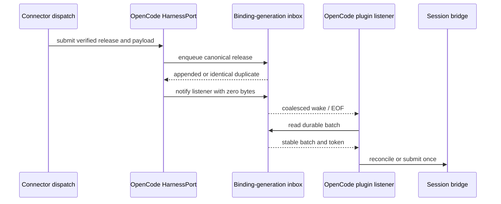

# OpenCode Inbox Notifier - Plan

## Goal Capsule

- **Objective:** Wake the exact user-started OpenCode plugin after its Khala inbox batch is durable, using a content-free, coalesced hint that never substitutes for reading or acknowledging the canonical batch.
- **Authority:** `docs/product/internal-mode/opencode-bridge.md` defines this ticket; later decisions in `docs/product/internal-mode/executor-decisions.md` override conflicts.
- **Execution profile:** Implement the inbox primitive first, then integrate the OpenCode adapter and connector route after issues #254 and #257 publish their final contracts.
- **Stop conditions:** Stop rather than inventing a delivery receipt, capability value, setup-owned package surface, second inbox API, or OpenCode process-control route.
- **Tail ownership:** This ticket owns focused tests, guarded-line mutation checks, draft-PR self-review, and CI handoff.

---

## Product Contract

### Summary

Add a zero-byte wake transport around the existing binding-generation inbox socket, then use it from an evidence-scoped OpenCode harness only after the matching release is durably stored.
Hints tell the plugin to re-read canonical state; they never carry message content, tokens, identifiers, or delivery claims.

### Problem Frame

`openInbox` already durably appends releases and persists stable batches and tokens across restart, but the private listener socket has no sender operation and its consumer cannot observe a connection as a coalesced wake.
Without that boundary, a release can remain durable while an idle OpenCode plugin has no content-free reason to re-read it.
The crash window after append and before notification must recover without a second append, a second token, or receiver-side deduplication.

### Requirements

**Durability and transport**

- R1. A matching release must be durably appended and synced before any listener notification is attempted.
- R2. A notification must use only connection and EOF on the inbox-owned Unix socket, with zero application bytes and no message, token, release, binding, session, path, argv, environment, or log content.
- R3. A dead, replaced, wrong-binding, or wrong-generation listener must fail closed while the durable batch remains recoverable.

**Wake semantics**

- R4. Listener startup or reconnect must expose one catch-up wake, and multiple pending hints must coalesce into one instruction to re-read canonical batch state.
- R5. A duplicate matching append may emit another harmless hint so the crash-after-append window recovers without creating another inbox record.
- R6. Hints must not advance a cursor, replace a stable batch token, acknowledge a release, or create a second OpenCode prompt.

**Harness and lifecycle**

- R7. The OpenCode `HarnessPort` must validate the exact inspected binding, enqueue before notifying, ignore the supplied payload as notification transport, and preserve truthful delivery receipts from the merged delivery contract.
- R8. Startup, reconnect, concurrent same-release submission, notifier failure, close, and revocation must remain fail-closed and must never start, abort, signal, or kill OpenCode.
- R9. Connector composition must register only the evidence-backed OpenCode route and preserve existing route ordering, generation fencing, persisted selection, and close-once behavior.

### Acceptance Examples

- AE1. Given a crash after a release append succeeds but before notification, when the binding listener restarts, then it receives one catch-up wake and reads the same batch and token without another append.
- AE2. Given a submitted but unacknowledged batch, when duplicate and reconnect hints arrive, then the fake bridge observes the same token and performs no second prompt submission.
- AE3. Given a listener for another binding generation, when the harness attempts notification, then that listener receives nothing and the intended batch stays durable.
- AE4. Given Stop or adapter close racing notification, when the race settles, then no later delivery is authorized and no OpenCode process-control operation is invoked.

### Scope Boundaries

In scope:

- The inbox-owned notifier sender and receiver wake contract.
- Zero-byte Unix-socket transport, catch-up, coalescing, listener fencing, and recovery tests.
- The connector-side OpenCode harness and minimal route registration.

Out of scope:

- OpenCode mode scheduling, envelope construction, prompt submission, prompt reconciliation, `khala_read`, or real read-receipt behavior; `opencode-session-bridge` owns these.
- A second batch, cursor, lease, acknowledgement, or socket-path API.
- Direct OpenCode SDK/server calls, launching or hosting OpenCode, or terminating the user's CLI.
- Setup/remove/status behavior owned by `setup-cli-plan` and its downstream setup tickets.

---

## Planning Contract

### Key Technical Decisions

- KTD1. **Keep addressing inside `openInbox`.** The inbox instance already binds `{bindingId, generation}` to a private socket path, so neither the harness nor plugin receives filesystem addressing data.
- KTD2. **Use a zero-byte level-triggered hint.** Connection and EOF are the complete wire protocol; the consumer keeps at most one pending wake and always re-reads the durable batch.
  - *Superseded in review of #306:* the wire format is #254's hint line (`encodeOpenCodeInboxHint`: `{v, kind, bindingId, generation, reason}`, at most 1024 bytes). The notifier sends `released` after a durable append and `catch_up` after route selection; the listener wakes only on a valid line for its own binding generation. Coalescing and re-reading are unchanged.
- KTD3. **Treat duplicate storage as catch-up eligible.** `enqueue` already rejects conflicting same-release content, so an identical duplicate proves durable state and may safely retrigger a wake after the append-to-hint crash window.
- KTD4. **Keep prompt idempotence downstream.** Coalescing reduces redundant work, but stable batch-token and bridge state remain the authority that prevents a second prompt.
- KTD5. **Do not upgrade notification evidence.** A socket connection proves only that the listener accepted a hint; receipt kinds and capability claims must come from issue #254's merged delivery contract.
- KTD6. **Integrate shared surfaces only after their owners publish.** U2 and U3 consume issue #254's route vocabulary and issue #257's package/setup shape instead of predicting either API.

### High-Level Technical Design

The durable inbox is authoritative throughout this sequence.
Notification failures do not roll back or delete the release, and notification success does not claim prompt storage or acknowledgement.

### Sequencing and Dependencies

1. U1 may proceed against the merged `mcp-inbox-batch` implementation because it extends the existing socket owner without touching capability or setup unions.
2. Decision 44 removed the start-order dependency on #254 and #257, and this ticket adds no GitHub dependency. U2 therefore ships with fail-closed capabilities (`support: unsupported`, route fields `unknown`, no evidence reference) and claims only `transport_written` for a durable write. When #254 publishes the `opencode_plugin` vocabulary, it replaces only `opencode/capabilities.ts`. *Done in review of #306:* the adapter now returns `openCodePluginCapabilities` for the claims a plugin bound to the exact generation reports, and receipts use its `harness_queued` evidence.
3. U3 adds only an optional per-candidate `catchUp` seam, because `apps/connector/src/composition/agent/harnesses.ts` is a shared route-selection surface. The route id itself belongs to #254.

### Risks and Mitigations

- **Lost wake after durable append:** synthesize one catch-up wake on listener acquisition and permit an identical duplicate to retrigger notification.
- **Redundant wakes:** coalesce pending connections into one wake while preserving re-read semantics.
- **Post-Stop race:** recheck binding generation and revocation downstream before acting; closing notifier authority never controls the CLI process.
- **Overstated receipts:** test that append and socket acceptance do not claim prompt storage, context consumption, or acknowledgement.
- **Cross-ticket drift:** fetch and inspect the explicit `unblocked` refs for #254 and #257 before implementing U2/U3.

---

## Implementation Units

### U1. Add the binding-scoped inbox notifier

- **Goal:** Expose content-free notification and a coalesced consumer wake on the existing private socket.
- **Requirements:** R1-R6; AE1-AE3.
- **Dependencies:** Merged `mcp-inbox-batch` implementation on `main`.
- **Files:** `packages/agent-cli/src/cli/inbox.ts`, `packages/agent-cli/src/cli/inbox.test.ts`.
- **Approach:** Extend the existing inbox/consumer ports without exposing the socket path. The sender connects and transmits zero bytes. The listener converts connection events into one pending wake, begins with one catch-up wake, and fails waiting operations after release. Notification returns a typed fail-closed outcome for a missing or stale listener without mutating inbox state.
- **Patterns to follow:** Reuse `listenerSocketPath`, `socketIsLive`, `CliError`, listener ownership, and the binding-generation directory hash already in `packages/agent-cli/src/cli/inbox.ts`.
- **Execution note:** Start with socket-level tests that inspect raw bytes and state before adding the public operations.
- **Test scenarios:**
  1. Acquire the matching listener, consume its startup wake, notify it, and assert the next wake contains no data.
  2. Send many notifications before the consumer waits and assert they coalesce to one wake.
  3. Notify with no listener and with a stale socket; assert the fail-closed result and unchanged JSONL, cursor, and batch state.
  4. Open two binding generations; assert notifying one cannot wake the other.
  5. Use the long-path fallback and assert no public result exposes the fallback path.
  6. Release the listener and assert future waits/notifies cannot revive its authority.
- **Verification:** Focused inbox tests prove zero-byte transport, coalescing, catch-up, fencing, and state preservation. Reverting each ordering/fence/coalescing guard makes its named test fail.

### U2. Implement the OpenCode inbox-backed harness

- **Goal:** Add a fail-closed `HarnessPort` that makes a release durable before issuing a content-free wake.
- **Requirements:** R1-R8; AE1-AE4; KTD3-KTD6.
- **Dependencies:** U1 plus validated `unblocked` refs for issues #254 and #257.
- **Files:** `packages/harnesses/src/opencode/index.ts`, `packages/harnesses/src/opencode/transport.ts`, `packages/harnesses/src/opencode/receipts.ts`, `packages/harnesses/src/opencode/index.test.ts`, `packages/harnesses/package.json`.
- **Approach:** Mirror the Codex adapter's exact-binding inspection, concurrent same-release join, limit/digest validation, and close behavior. Convert a verified job into the existing inbox delivery shape, accept both `appended` and identical `duplicate` as durable, then notify without transporting the payload. Return only receipt evidence authorized by issue #254; leave unsupported reconciliation as `null`.
- **Patterns to follow:** `packages/harnesses/src/codex/index.ts`, `packages/harnesses/src/codex/native-cli.ts`, and the smaller receipt helpers under `packages/harnesses/src/claude/`.
- **Execution note:** Use fake inbox/notifier ports to make durable-before-hint ordering and crash recovery deterministic.
- **Test scenarios:**
  1. Assert append/sync resolves before the first notification call and append failure emits no hint.
  2. Simulate crash after append; on restart return `duplicate`, issue one catch-up hint, and preserve one stored record.
  3. Submit concurrently for one release and assert one durable operation and one coalesced notification effect.
  4. Reject stale binding, wrong harness/generation, digest mismatch, payload limits, and closed adapter before notification.
  5. Fail notification and assert a truthful closed/unknown receipt while the batch remains readable.
  6. Capture notifier arguments, logs, and receipts and assert they contain no payload, token, release, binding, or session data beyond contract-required receipt correlation.
  7. Race close/revocation with notification and assert no process-runner, signal, abort, or kill surface exists.
- **Verification:** Harness tests prove the ordering, recovery, content boundary, receipt truthfulness, and lifecycle fences. Each ticket-required guarded-line revert fails the targeted test.

### U3. Register the evidence-backed route and catch-up lifecycle

- **Goal:** Compose the OpenCode harness without weakening existing route selection or listener lifecycle rules.
- **Requirements:** R4, R6-R9; AE1-AE4; KTD5-KTD6.
- **Dependencies:** U1 and U2.
- **Files:** `apps/connector/src/composition/agent/harnesses.ts`, `apps/connector/src/composition/agent/harnesses.test.ts`.
- **Approach:** Add only the merged OpenCode candidate/registration seam. Trigger one catch-up wake on startup or reconnect through the typed inbox port, preserve native-first selection, persist the route for the binding generation, and close notifier authority exactly once.
- **Patterns to follow:** `createRuntimeHarnessSelection` and its route ordering, recorded-selection, stale-generation, inspection-failure, and aggregate-close tests.
- **Test scenarios:**
  1. Admit the exact evidence-backed OpenCode route and refuse stale/unknown evidence keys.
  2. Start and reconnect with an outstanding batch; assert one coalesced catch-up wake and the same stable token.
  3. Repeat catch-up after fake bridge submission but before acknowledgement; assert one fake prompt submission and no cursor movement.
  4. Refuse a stale generation and assert no wake reaches the current listener.
  5. Close twice and assert the harness/notifier close once without signaling or terminating OpenCode.
- **Verification:** Connector composition tests prove route admission, catch-up integration, generation fencing, and lifecycle cleanup without broadening the shared selector.

---

## Verification Contract

| Gate | Command | Proves |
|---|---|---|
| Agent CLI inbox | `pnpm --filter @aiur/khala test -- inbox.test.ts` | Zero-byte notification, catch-up, coalescing, fencing, and durable-state preservation |
| OpenCode harness | `pnpm --filter @khala/harnesses test -- opencode` | Adapter ordering, recovery, closed outcomes, and no transport leakage |
| Connector composition | `pnpm --filter @khala/connector-app test -- harnesses.test.ts` | Route admission, startup/reconnect catch-up, generation fencing, and close behavior |
| Type safety | `pnpm typecheck` | Final cross-workspace interfaces and exports compose |
| Boundaries and terminology | `pnpm lint` | Package boundaries, lint rules, and channel terminology remain valid |
| Build | `pnpm build` | Published/exported source surfaces build without test-double leakage |

For every acceptance guard named by the ticket, run the focused passing test, revert only the guarded production line in a unique disposable worktree, rerun the exact same command, and record the expected failure before restoring the worktree.
The final ticket report must list each exact command and the failing assertion observed with that guard reverted.

---

## Definition of Done

- U1 exposes no socket path or content field and proves zero-byte, binding-generation-scoped wake behavior.
- U2 uses the merged OpenCode delivery vocabulary, persists before notification, and leaves notifier failure recoverable.
- U3 registers the route minimally and preserves existing selection, generation, and close semantics.
- AE1-AE4 pass, including crash recovery with the same durable batch/token and no second fake prompt.
- Every guarded-line mutation check fails for the intended reason and its exact command is recorded.
- Focused tests, typecheck, lint, and build pass on a branch containing current `main`.
- No config, CLI command, environment variable, or user-facing surface changed; website documentation is therefore not required.
- No abandoned stubs, provisional dependency types, debug logging, or alternate inbox/prompt state remains in the diff.
