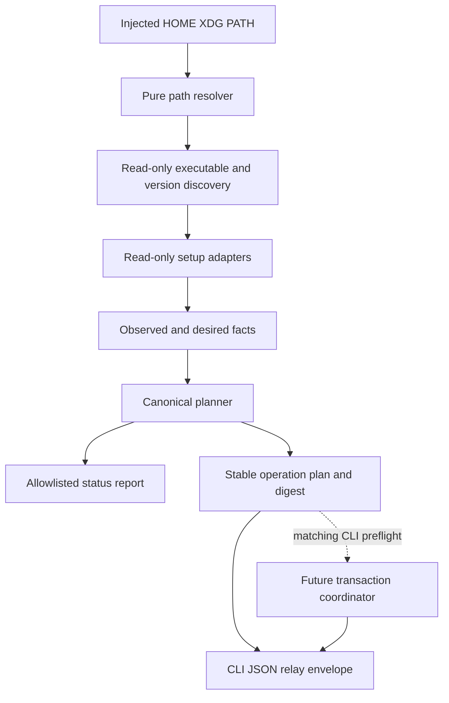
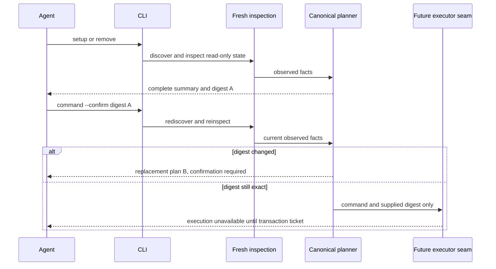

# Setup CLI Planning - Plan

> **Reconciled with the frozen contract (#297 / #311).** This plan predates `setup/types.ts`.
> Where they differ, the frozen module wins: its seven operation types, `SetupProbe`,
> `SetupAdapter`, and top-level states replace the operation/precondition vocabulary and
> adapter ports sketched below. The frozen states have no "detected, not configured"
> member, so status reports that case as `drifted` with a `setup_required` diagnostic.
> Execution-unavailable is `unsupported` with an `execution_unavailable` diagnostic.

## Goal Capsule

- **Objective:** Add the pure setup discovery, configuration-status, deterministic planning, and digest-bound confirmation layer for `@aiur/khala` without implementing filesystem mutation or harness-specific installers.
- **Authority:** The `setup-cli-plan` contract in `docs/product/internal-mode/setup-cli.md`, then decisions 1-40 in `docs/product/internal-mode/executor-decisions.md`, then the merged CLI package, explicit-pull, and authenticated-loopback contracts.
- **Execution profile:** Introduce versioned setup types, injectable XDG/PATH discovery, read-only adapter ports, a canonical planner, and minimal `setup`, `remove`, and additive `status --check` CLI wiring.
- **Stop conditions:** Stop if implementation writes setup state, installs harness assets, embeds runtime credentials, launches an agent, approves native trust, infers route readiness from presence, or adds transaction/journal behavior.
- **Tail ownership:** This ticket owns focused tests, the guarded stale-confirmation mutation proof, package documentation, scoped verification, draft PR review, and CI handoff.

---

## Product Contract

### Summary

An agent can discover global Claude Code, Codex, and OpenCode executables and versions, consume injected read-only harness observations, obtain one deterministic setup or removal plan, relay its complete approval summary to the person, and resubmit the approved digest. Status remains backward-compatible and adds configuration facts; dry-run and every unconfirmed or stale-confirmation path make no Khala-controlled state change. Real harness configuration inspection and actionable adapter plans remain owned by the later adapter tickets.

### Problem Frame

The published CLI currently exposes connection behavior only. Later transaction and harness-adapter tickets need a stable planning vocabulary, honest readiness model, injectable discovery boundary, and confirmation gate before any mutation code can safely land.

### Requirements

**Schemas and status**

- R1. Define versioned, closed setup result, confirmation, configuration, harness, component, observation, desired-state, operation, diagnostic, and exit-code types without importing future transaction implementations.
- R2. Preserve the existing top-level connection and inbox status fields and add one nested `configuration` report containing every known harness, including absent ones.
- R3. Bare status remains informational with exit 0; `status --check` maps `no_harness` and `ready` to 0, review/restart/effect-unknown/drift/conflict/unsupported to 3, and recovery-required to 4.
- R4. Executable presence, supported version, component state, current-session effectiveness, fallback availability, optional hardening, and evidence-backed route support remain separate facts.

**Discovery and paths**

- R5. Resolve HOME, XDG config/data/state roots, setup-owned paths, the product-contracted `<data-root>/khala/internal/active.json` descriptor path, and PATH only from injected inputs; empty XDG variables fall back below an absolute HOME and relative roots fail closed.
- R6. Detect known harness executables in stable order through injected read-only probes and run bounded version commands by absolute path, argument array, no shell, ignored stdin, fixed deadline, per-stream byte caps, descendant-aware termination on timeout/overflow, and a minimal injected environment. Reject empty, dot, or relative PATH entries and never search the current directory.
- R7. Distinguish absent executables from detected-but-unsupported or failed version probes while preventing raw subprocess output, inspected file contents, environment values, and arbitrary adapter fields from reaching public results.
- R8. Setup adapters expose only discovery, inspection, desired-state, and operation-description capabilities; they cannot write, delete, prompt, lock, print, or invoke unconstrained commands.

**Planning and confirmation**

- R9. Canonicalize and stable-sort plans by harness, component, and path so identical observations produce byte-identical output and the same SHA-256 digest.
- R10. Bind the digest to the command, planner identity (CLI package version plus plan-schema, operation-vocabulary, and adapter-contract versions), and every mutation-relevant observation and precondition while excluding timestamps, transaction IDs, temporary paths, backup contents, secrets, and the digest itself.
- R11. A non-empty plan without confirmation returns exit 5 and a complete relay summary naming the command, detected harnesses, component actions, paths, backup/restore promise, session effect, verified fallback availability, digest, and approval request.
- R12. Confirmation always reinspects and replans; a stale digest returns replacement plan B with exit 5 and performs no executor call, lock, cache, telemetry, or Khala-controlled filesystem write.
- R13. Empty already-satisfied plans succeed without confirmation, while an exact confirmation reaches only an injected future executor seam; the current production composition fails closed as execution unavailable rather than claiming a mutation.
- R14. Setup/remove dry runs use the same current plan and output model but cannot receive or reach an executor capability. An empty dry run exits 0; a non-empty dry run returns the same `confirmation_required` state, complete summary, digest, and exit 5 as an unconfirmed invocation, solely as a preview of the authorization a non-dry invocation would require.

**CLI and documentation**

- R15. Parse only `setup|remove [--dry-run | --confirm <sha256>]` and `status [--check]`, reject ambiguous combinations and duplicate/unknown flags, and emit one versioned JSON object per lifecycle invocation. Parsing, path, discovery, and inspection failures are caught inside lifecycle handlers and mapped to closed versioned results with prescribed exits rather than the legacy outer error envelope.
- R16. Update package documentation with the agent-relayed approval workflow, check semantics, dry runs that make no Khala-controlled state change, the vendor-process trust boundary, the current execution boundary, and the rule that Khala never launches or hosts an agent.

### Acceptance Examples

- AE1. Given an empty synthetic HOME and empty PATH, status reports all harnesses absent, configuration `no_harness`, and no new path; setup and remove return empty plans without confirmation.
- AE2. Given the same read-only adapter observations twice, setup and remove each return byte-identical command-specific plans; reordering adapter input does not change operation ordering or digest.
- AE3. Given plan A, when one observed target identity or hash changes before `--confirm A`, the command returns plan B with a new digest, `confirmed: false`, exit 5, zero executor calls, and no changes beyond the test's deliberate mutation.
- AE4. Given configured state whose effect is unproven or requires restart, status names only a verified installed CLI fallback and never claims native or idle delivery readiness.
- AE5. Given sentinel secrets in config bytes, descriptor values, subprocess output/errors, or unknown adapter fields, all public status, plan, confirmation, diagnostic, stdout, and stderr output omits those sentinels.

### Scope Boundaries

In scope are public schemas, path/executable/version discovery, pure inspection and adapter contracts, status aggregation, deterministic public plans, confirmation gating, dry runs, additive CLI wiring, package documentation, and focused proof tests.

Deferred to follow-up tickets are real Claude/Codex/OpenCode adapters, manifest reads, locks, journals, backups, mutation, rollback, recovery execution, force/adopt, and cross-harness packed-tarball acceptance.

Outside the product's identity are launching or hosting an agent, killing the user's CLI, approving native hook/plugin trust, installing a restricted profile, embedding runtime port/token values, or treating installed configuration as delivery proof.

---

## Planning Contract

### Key Technical Decisions

- KTD1. Keep setup configuration separate from `AgentClientPort.status()`. `runCli` receives a setup/configuration service port and allowlists its nested public report, preserving the existing connection client and status fields.
- KTD2. Make `paths.ts` a pure resolver and `detect.ts` a read-only discovery layer. Production Node filesystem/process adapters are composed in `cli/main.ts`; tests inject synthetic environment, probes, and version runners without ambient fallback.
- KTD3. Define adapters as data providers only. They return observed facts, desired components, and closed operation descriptions; the central planner owns public projection, sorting, canonical encoding, digesting, summaries, and aggregate status.
- KTD4. Freeze a central operation/precondition vocabulary sufficient for later transaction work, but store no content or secret bytes in the public plan. Arbitrary adapter fields are never spread into output.
- KTD5. Replan on every confirmed invocation and compare only against the freshly canonicalized digest. This is the CLI preflight guard; the later transaction engine must still replan under its lock before applying.
- KTD6. Represent exact CLI preflight as a request to an injected transaction-coordinator seam containing only the command and supplied digest, never as authority to apply the pre-lock plan. The later coordinator owns the shared inspector/planner dependencies, acquires its lock, reinspects, replans, and compares the under-lock digest before applying. Because mutation is outside this ticket, the production seam returns a stable `execution_unavailable` refusal and never reports `changed: true` or readiness.
- KTD7. Treat a dry run as a planner-only mode. `--dry-run --confirm` is invalid because authorization has no meaning when no executor capability exists.
- KTD8. Aggregate status with deterministic precedence: recovery required, conflict, drift, unsupported, awaiting hook review, effect unknown, restart required, ready, then no harness. Per-harness facts remain visible even when a higher-priority state wins.
- KTD9. Keep capability claims evidence-scoped. Detection can establish presence and parsed version only; route effectiveness, fallback usability, idle delivery, and optional hardening use explicit observations and default to unknown.

### Operation and precondition vocabulary

- Every internal operation has a stable operation ID, harness, component, primary absolute target, operation-vocabulary version, public action summary, exact precondition and postcondition, backup policy, and complete writable-target allowlist. Duplicate operation IDs or identical total-order keys are invalid rather than resolved by input order.
- Operation kinds are closed to `create_directory`, `write_file`, `remove_path`, and `run_command`. `write_file` represents creation, guarded replacement, owned-payload staging, and manifest publication; its private desired bytes remain behind the adapter/executor seam while the public plan and digest contain only the desired SHA-256, mode, and ownership. `run_command` contains an absolute executable, public non-secret argv, fixed resource limits, and declared writable targets; unconstrained or secret-bearing commands are unsupported.
- Filesystem snapshots are closed to `absent`, `regular_file`, `directory`, `symlink`, and `other`, with stable identity plus applicable SHA-256, mode, uid, and gid. A precondition is one exact snapshot; a postcondition is `absent`, `regular_file` with expected hash/mode/ownership, or `directory` with expected mode/ownership.
- Backup policy is closed to `none`, `record_absence`, or `restore_bytes`; guarded removal and replacement use it to express exact restoration without embedding bytes. The public plan names the promise but never exposes backup contents or private desired bytes. Later transaction work must revalidate the exact precondition under lock and verify the postcondition; this ticket only describes and hashes them.

### High-Level Technical Design

### Assumptions

- Generic production discovery reports detected harness versions honestly but cannot mark them supported until a real harness adapter supplies a certified version and inspection implementation.
- The exact runtime descriptor path is frozen by the internal-mode product contract, not exported by the current server implementation. This ticket resolves `<data-root>/khala/internal/active.json` as a pure convention and never reads or emits descriptor contents; the launcher implementation must consume the same contract later.
- PATH-resolved harness executables are user-selected trust inputs. Khala's zero-write guarantee covers Khala-controlled state; a vendor `--version` process is an observable external action and may have vendor side effects, so the CLI does not claim a deny-write sandbox and instead constrains path selection, environment, time, output, and descendant lifetime. Certification of a real adapter/version must include a version-probe canary before that adapter can be marked supported.
- Manifest-driven removal of an unsupported installed harness remains modeled in the types but fails closed until the manifest and transaction implementation exists.
- Existing package tests and the package gate may run on hosts with harness binaries installed, so their environment must inject deterministic synthetic HOME/XDG/PATH values.

### Risks and Dependencies

- All declared blockers are merged into `main`: setup CLI packaging (`670759b`), listening-mode pull (`35334fd`), and authenticated loopback server (`a335cbd`).
- The highest-risk bug is checking the supplied digest against cached plan A rather than fresh plan B. The required guarded-line mutation test targets this exact comparison.
- Object insertion order, filesystem enumeration order, or raw adapter values can make output nondeterministic or leak secrets. Canonicalization and public projection must precede both hashing and rendering.
- A matching confirmation with no transaction engine can create either an infinite consent loop or false success. The explicit execution-unavailable state prevents both.
- Shared CLI files are a serialized hotspot; dispatch, dependency, and composition changes must stay minimal.

### Sources and Research

- `docs/product/internal-mode/setup-cli.md` defines the command, status, planning, consent, dry-run, and ticket boundaries.
- `docs/product/internal-mode/executor-decisions.md` supplies agent-lifecycle, trust, terminology, delivery-honesty, and merge-order constraints.
- `packages/agent-cli/src/cli/app.ts` provides the injected-port, exact-parsing, allowlisted-output, and exit-code patterns.
- `packages/agent-cli/src/cli/main.ts` is the production environment/filesystem/process composition root.
- `packages/agent-cli/src/cli/inbox.ts` supplies local SHA-256 and owner-only path precedent without becoming a setup dependency.
- `packages/agent-skill/src/listen/node-process.ts` demonstrates absolute executable, argument-array, minimal-environment subprocess execution.

---

## Implementation Units

### U1. Versioned setup schemas and XDG path resolution

- **Goal:** Establish the closed public/internal vocabulary and deterministic, injectable setup paths used by every later unit and ticket.
- **Requirements:** R1, R4, R5, R8, R13; AE1, AE4, AE5; KTD2-KTD4, KTD6, KTD9.
- **Dependencies:** Merged setup package and authenticated-loopback descriptor contracts.
- **Files:** `packages/agent-cli/src/setup/types.ts`, `packages/agent-cli/src/setup/paths.ts`, `packages/agent-cli/src/setup/paths.test.ts`, `packages/agent-cli/src/cli/types.ts`.
- **Approach:** Define closed discriminated unions for paths, harness observations, configuration states, the explicit operation/precondition vocabulary above, plans, confirmations, diagnostics, results, adapter ports, and the future executor seam. Resolve all XDG paths from explicit values, treat empty overrides as unset, reject missing/relative HOME or XDG roots, derive the product-contracted descriptor path from the data root, and never touch the filesystem.
- **Patterns to follow:** Closed unions in `packages/agent-cli/src/cli/types.ts`; strict validators and allowlisted shapes in `packages/agent-cli/src/cli/validation.ts`.
- **Test scenarios:**
  1. Resolve default config/data/state/setup/bin/version/descriptor paths below an absolute HOME and override each XDG root independently.
  2. Treat empty XDG values as unset; reject missing or relative HOME/XDG inputs without consulting cwd or process environment.
  3. Snapshot absent roots before and after resolution and prove no directory, file, lock, cache, or temporary path is created.
  4. Type-level consumer fixtures accept guarded replacement and removal, constrained commands, owned-payload staging, restoration, and manifest publication; reject duplicate order keys and unconstrained commands; and expose no adapter mutation method.
- **Verification:** Focused path tests and package typecheck prove deterministic values, failure boundaries, and zero writes.

### U2. Read-only harness and version discovery

- **Goal:** Detect known harness executables and versions from injected PATH/environment inputs without claiming support or exposing subprocess data.
- **Requirements:** R4, R6-R8; AE1, AE4, AE5; KTD2, KTD3, KTD9.
- **Dependencies:** U1.
- **Files:** `packages/agent-cli/src/setup/detect.ts`, `packages/agent-cli/src/setup/detect.test.ts`.
- **Approach:** Use one stable descriptor registry for Claude Code, Codex, and OpenCode. Filter PATH to distinct absolute roots, resolve the first executable deterministically through an injected executable probe, then invoke a bounded injected version runner with an absolute path, explicit argv, no shell, ignored stdin, minimal environment, fixed deadline, per-stream caps, and descendant-aware termination. Normalize only presence/version/support facts and stable diagnostic codes.
- **Test scenarios:**
  1. Detect absent harnesses with an empty injected PATH and never fall back to ambient PATH.
  2. Resolve stable first matches across multiple absolute PATH roots and return harnesses in registry order regardless of probe completion order; reject leading, trailing, repeated, dot, and relative entries without cwd lookup.
  3. Prove the runner receives an absolute executable, argument array, no shell capability, ignored stdin, explicit time/output caps, and only injected HOME/XDG/PATH values.
  4. Classify nonzero, timeout, overflow, malformed, and throwing version probes as detected-but-unsupported with stable redacted diagnostics; prove an infinite-output process and its descendant are terminated.
  5. Seed unique stdout, stderr, error, environment, and unknown-field sentinels and prove none reaches public facts.
- **Verification:** Focused discovery tests cover deterministic selection, version parsing, redaction, and the absence/support boundary.

### U3. Canonical planning, confirmation, and configuration aggregation

- **Goal:** Produce byte-stable setup/remove plans, exact status truth-table results, and a fresh-state confirmation decision without any mutation capability.
- **Requirements:** R2-R4, R9-R14; AE1-AE5; KTD1, KTD3-KTD9.
- **Dependencies:** U1 and U2.
- **Files:** `packages/agent-cli/src/setup/plan.ts`, `packages/agent-cli/src/setup/plan.test.ts`.
- **Approach:** Allowlist adapter facts and operation descriptors, recursively canonicalize keys, stable-sort harnesses/components/paths, and hash the command plus mutation-relevant current/desired preconditions. Build confirmation and configuration projections centrally. Reinspection produces a fresh plan before digest comparison; stale confirmation returns replacement output and cannot obtain the executor seam.
- **Execution note:** Start with the stale-confirmation wrong-implementation test and observe it fail before adding the fresh-digest guard.
- **Patterns to follow:** Local hashing in `packages/agent-cli/src/cli/inbox.ts`; canonical JSON pattern in `apps/control/src/runtime/control-store.ts`, reimplemented within the package boundary.
- **Test scenarios:**
  1. Shuffle harnesses, components, operations, and object keys; repeated setup/remove plans remain byte-identical and command-specific.
  2. Change executable version, target identity/hash/mode/ownership, desired hash, operation, command, CLI package version, plan-schema version, operation-vocabulary version, or adapter-contract version and require a new digest; change timestamp/temp/backup metadata and retain the digest.
  3. Return no-confirmation success for empty plans, complete exit-5 confirmation for non-empty plans, and reject `--dry-run --confirm` at parsing.
  4. Confirm plan A, mutate a later observed target, and require replacement plan B, `confirmed: false`, exit 5, zero executor calls, and no extra filesystem changes.
  5. Supply the exact fresh digest and reach only the executor seam; the production unavailable executor yields safe refusal without `changed: true`.
  6. Cover the complete status truth table, mixed-harness precedence, absent-harness exclusion, optional-hardening readiness, pending Codex review, unknown effect, and honest fallback availability.
  7. Seed foreign config, descriptor, subprocess, adapter, and operation sentinels and prove every public/canonical projection omits plaintext.
- **Verification:** Focused planner tests prove canonical bytes, digest binding, confirmation freshness, truth-table exits, zero writes, and secret redaction.

### U4. CLI composition, additive status, and operator documentation

- **Goal:** Expose setup planning and configuration status through the published CLI while preserving every existing connection behavior.
- **Requirements:** R2-R4, R11-R16; AE1-AE5; KTD1-KTD9.
- **Dependencies:** U1-U3.
- **Files:** `packages/agent-cli/src/cli/app.ts`, `packages/agent-cli/src/cli/app.test.ts`, `packages/agent-cli/src/cli/main.ts`, `packages/agent-cli/src/cli/main.test.ts`, `packages/agent-cli/src/cli/types.ts`, `packages/agent-cli/README.md`.
- **Approach:** Add minimal dispatch handlers and one injected setup service. Keep existing status allowlisting and inbox lookup unchanged, append the configuration projection, and let only `--check` alter configuration exit mapping. Catch lifecycle parsing, path, discovery, and inspection failures inside those handlers and render their versioned failure envelopes. Compose bounded Node probes plus the execution-unavailable seam in `main.ts`, and document the agent-relayed digest workflow, vendor-process trust boundary, and deferred mutation boundary.
- **Test scenarios:**
  1. Preserve all existing status fields/values while appending configuration; disconnected status still inspects configuration and does not open an inbox.
  2. Table-test bare/check exits for every configuration state and mixed-harness precedence; bare status emits the same facts and exits 0.
  3. Reject missing digests, malformed digests, duplicate/unknown flags, extra args, and dry-run/confirm combinations with exit 2 before setup inspection or execution; map path/discovery/inspection failures to their versioned lifecycle envelopes rather than the legacy outer catch.
  4. Snapshot byte, type, mode, and mtime state around status, check, both dry runs, unconfirmed commands, stale confirmation, unsupported detection, conflicts, and invalid arguments, and prove no Khala-controlled state changes. Treat vendor version probes as the explicit user-selected-process trust boundary rather than claiming their internals are sandboxed.
  5. Run the bundled entrypoint with synthetic empty HOME/XDG/PATH and require the exact additive no-harness status schema without creating roots.
  6. Verify no lifecycle path launches, wraps, signals, stops, or kills an agent process and no output asks the person to run a command or restart.
- **Verification:** CLI/app tests, bundled smoke tests, README review, package gate, typecheck, build, lint, and manual synthetic-home invocations prove the public contract.

---

## Verification Contract

| Gate | Command or evidence | Done signal |
|---|---|---|
| Focused setup suites | `pnpm exec vitest run --config vitest.config.ts packages/agent-cli/src/setup/paths.test.ts packages/agent-cli/src/setup/detect.test.ts packages/agent-cli/src/setup/plan.test.ts packages/agent-cli/src/cli/app.test.ts packages/agent-cli/src/cli/main.test.ts` | Path, discovery, planning, confirmation, truth-table, no-Khala-state-change, and bundled CLI cases pass. |
| Package suite | `pnpm --filter @aiur/khala test` | All agent CLI regressions pass. |
| Static and bundle contract | `pnpm --filter @aiur/khala typecheck`, `pnpm --filter @aiur/khala build`, `pnpm lint`, and `node scripts/agent-cli-package-gate.mjs` | Types, self-contained bundle, boundaries, terminology, and packed synthetic-home status pass. |
| Manual CLI | Run built `status`, `status --check`, both dry runs, unconfirmed setup/remove, and stale confirmation against one synthetic HOME/XDG/PATH without `scripts/aiurdev --test` or `--test3` | Output is one stable JSON object, exits match the contract, and byte/mtime snapshots show no unexpected writes. |
| Wrong implementation | Run `pnpm exec vitest run --config vitest.config.ts packages/agent-cli/src/setup/plan.test.ts -t "refuses a stale confirmed plan with a replacement plan and no writes"`, then in a unique PR-numbered worktree revert the fresh-plan digest guard and rerun the exact command | Normal run passes; mutation fails at replacement-digest and zero-executor assertions. Record both exact commands and guarded line in the workpad/PR. |
| PR safety | Run `aiur guard-pr-deletions main` immediately before push and verify fetched `origin/main` is an ancestor of the exact PR head | The PR deletes no unrelated files and is current with the authoritative base. |

The repository has no `website/docs-app/` tree. The package README is the user-facing CLI reference for this surface.

---

## Definition of Done

- U1-U4 satisfy every traced requirement and scenario without implementing real mutation, journals, backups, harness adapters, force/adopt, text UI, or delivery routes.
- Existing connection-status fields remain compatible; configuration is nested and `--check` alone enforces readiness exits.
- HOME/XDG/PATH are injectable, path resolution and all Khala-owned discovery code perform no writes, vendor probes are explicitly bounded trust inputs, version failures are distinct from absence, and output leaks no raw config, process, environment, credential, or adapter data.
- Repeated plans are byte-identical, every mutation-relevant observation changes the digest, and confirmation contains the complete relay summary rather than an opaque token alone.
- Unconfirmed, dry-run, invalid, unsupported, conflicting, and stale-confirmation paths cannot reach execution; exact confirmation cannot claim success before a transaction executor exists.
- The stale-confirmation test passes normally and fails with the guarded comparison reverted, with exact evidence recorded.
- Focused/package tests, typecheck, build, lint, package gate, manual synthetic-home verification, deletion guard, base freshness, draft PR self-review, and CI handoff complete.
- The final diff contains no temporary stubs, abandoned experiments, ambient-environment fallbacks, arbitrary object spreading, secrets, or unrelated cleanup.
