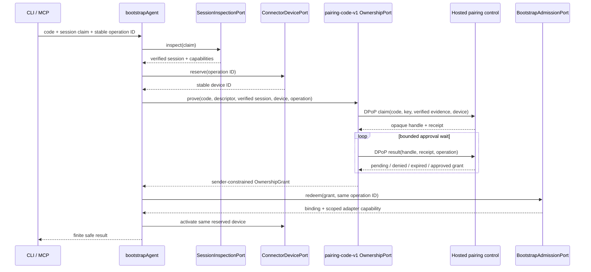

# Pairing Code Connector - Plan

## Goal Capsule

Add a code-only, cross-machine ownership path to the connector without weakening the existing native-session, device-reservation, admission, or capability boundaries. The product contract in `docs/product/internal-mode/make-external.md` and later decisions in `docs/product/internal-mode/executor-decisions.md` are authoritative. Stop if the implementation would require Khala to launch an agent, reveal a channel before approval, persist a plaintext code or grant, or duplicate the existing inbox/pull surfaces. This ticket owns the implementation through a ready pull request, including focused tests, CLI documentation, self-review, and CI handoff.

## Product Contract

### Summary

`pairing-code-v1` lets an already-running, locally verified agent claim a five-minute human-entered code from another machine. The connector pins the configured hosted origin, reserves one device, submits the inspected native session and connector proof-key identity, waits for the owner decision, and redeems the approved sender-constrained grant through the existing bootstrap path.

### Requirements

#### Bootstrap integrity

- R1. Preserve link bootstrap behavior and prefer `loopback-browser-v1` whenever the supplied link descriptor and local ownership port support it.
- R2. Fetch code-only discovery from `DESCRIPTOR_PATH` on one explicitly configured canonical hosted origin; neither the code, redirects, nor response data may choose another origin.
- R3. Strictly negotiate `pairing-code-v1` and include the configured origin, canonical descriptor identity, code digest, submitted session claim, and inspected session generation in the stable operation fingerprint.
- R4. Reuse the existing operation ledger, one-device reservation, bootstrap admission, device activation, and finite retry behavior; no plaintext code, claim receipt, approval grant, capability, or response body enters the ledger.

#### Pairing trust and lifecycle

- R5. Inspect the native session before claiming and submit only the inspected harness, session ID, and generation, plus a digest of that evidence; never trust caller-supplied session fields as verified facts.
- R6. Bind claim and result requests to the connector's existing Ed25519 proof key with fresh DPoP proofs for the exact fixed claim/result URLs.
- R7. Reconcile a repeated claim with the same operation/key/session/device, poll only the returned opaque handle and receipt, and return finite typed outcomes for approval, denial, expiry, refusal, rate limiting, cancellation, timeout, and unavailable/unknown transport.
- R8. Treat any operation, key, session, generation, device, descriptor, origin, or code substitution as a conflict or finite refusal without revealing channel identity.
- R9. Convert an approved 60-second grant into the existing `OwnershipGrant` shape and redeem it through `BootstrapAdmissionPort`; validate method, endpoint, session, device, expiry, binding, and capability exactly as link bootstrap does.

#### CLI and MCP parity

- R10. Provide one agent-CLI pairing service used by both `khala pair` and `khala_pair`, with strict bounded input and stable public results that exclude the code, receipt, grant, channel identity before admission, and thrown error text.
- R11. Register the command and tool through the minimal seams delivered by `setup-cli-plan` and `internal-launcher`; do not add a second inbox, pull, lease, batch, process-launch, or agent-hosting path.
- R12. Document the new CLI command and MCP tool in `website/docs-app/reference/cli.md`, `packages/agent-cli/README.md`, and the connector bootstrap README without claiming live-provider proof beyond tested composition.

### Acceptance Examples

- AE1. A normal channel link whose descriptor offers loopback and pairing still uses loopback and connects exactly as before.
- AE2. A valid code reserves one device, waits through one or more pending results, then redeems the approved DPoP-bound grant and activates that same device.
- AE3. A lost approval-result response followed by the same operation retries the claim/result exchange and does not reserve a second device.
- AE4. Reusing the operation ID with another session generation, connector key, device, descriptor, origin, or code returns a conflict/refusal and performs no admission.
- AE5. A forged caller session claim cannot override `SessionInspectionPort`; the claim request carries the inspected session or the operation refuses before network claim.
- AE6. Invalid, expired, used, and foreign codes produce bounded non-enumerating public results with no channel, binding, membership, receipt, or grant fields.
- AE7. CLI and MCP invoke the same pairing service and expose the same domain result vocabulary.

### Scope Boundaries

The ticket does not add the hosted approval UI, create pairing requests, change control-side pairing state, select a channel automatically, connect to the loopback internal server, launch or stop an agent process, or add message retrieval/delivery APIs.

### Dependencies

- `pairing-code-control-protocol` (#218) is merged and supplies the strict request/result decoders and fixed control behavior.
- `internal-launcher` (#189) is active and owns internal runtime/CLI composition details.
- `setup-cli-plan` (#257) is active and owns the shared CLI registration seam. Connector work and isolated pair modules proceed first; shared-file integration waits for its explicit unblock event and validated pushed ref.

## Planning Contract

### Key Technical Decisions

- KTD1. Extend `BootstrapInput` with a discriminated code-only form, but keep link normalization and the established link fingerprint bytes unchanged. Pairing computes its durable fingerprint only after strict descriptor resolution and native-session inspection, allowing the verified generation and descriptor identity to participate without changing existing stored records.
- KTD2. Extend `DiscoveryPort` with a no-argument configured-origin resolution path. `createDiscovery` receives one explicit `hostedOrigin` and performs a fixed-path, JSON-only, bounded, no-cross-origin request; callers never pass the origin alongside a code.
- KTD3. Implement pairing as an `OwnershipPort` method. It owns claim/result transport and approval polling, while `bootstrapAgent` continues to own session verification, device reservation, admission, activation, and operation persistence.
- KTD4. Derive the evidence digest from the exact inspected session plus its evidence reference/capability identity using a versioned canonical hash. The submitted `SessionClaim` is only a locator for inspection.
- KTD5. Pairing secrets stay ephemeral. Stable retries rely on the control protocol's idempotent claim/result operations and the existing durable non-secret bootstrap record; the record contains only the operation fingerprint, phase, device, and eventual binding.
- KTD6. CLI/MCP adapters render a closed public result rather than serializing arbitrary connector results. This keeps pre-approval and failure outputs free of channel or secret-bearing internals.

### High-Level Technical Design

### Implementation Constraints

- Keep `packages/connector/src/bootstrap/descriptor.ts` backward compatible for version-one link descriptors while recognizing the new method.
- Reuse `readBounded`, exact-origin validation, proof signer, contract decoders, and the existing guarded port-call pattern.
- All polling is bounded by the pairing request lifetime, caller cancellation, and injected clock/wait hooks for deterministic tests.
- Shared `packages/agent-cli/src/cli/app.ts` and `packages/agent-cli/src/mcp/server.ts` edits wait for #257's registration seam; do not recreate blocker-owned APIs.

## Implementation Units

### U1. Strict code-only descriptor negotiation

- Goal: recognize `pairing-code-v1` and resolve its descriptor only from configured origin state.
- Requirements: R1-R3.
- Files: `packages/connector/src/bootstrap/descriptor.ts`, `packages/connector/src/bootstrap/discovery.ts`, `packages/connector/src/bootstrap/discovery.test.ts`.
- Approach: extend the closed method union, add canonical descriptor hashing, and add fixed-origin resolution with strict redirects/content type/body bounds.
- Test Scenarios: descriptors offering both methods; configured-origin success; missing hosted origin; hostile redirect; response endpoint substitution; unknown method/version/field; code/response cannot choose origin; existing link cases and fingerprint fixture remain byte-identical.
- Verification: focused connector discovery tests and package typecheck.
- Dependencies: none.

### U2. Pairing ownership transport

- Goal: implement the DPoP-bound claim, bounded approval wait, and approved-grant conversion.
- Requirements: R5-R9.
- Files: `packages/connector/src/bootstrap/pairing.ts`, `packages/connector/src/bootstrap/pairing.test.ts`, `packages/connector/src/bootstrap/ports.ts`, `packages/connector/src/bootstrap/index.ts`.
- Approach: create an `OwnershipPort` implementation around the merged pairing contracts, fixed paths, strict response decoding, safe error mapping, and injectable wait/clock/transport.
- Test Scenarios: pending-to-approved; denial; expiry; invalid/used non-enumerating refusal; rate limit; malformed/oversized/wrong-media responses; DPoP targets and key thumbprint; key/session/device substitution; lost response and stable retry; cancellation and deadline.
- Verification: focused pairing tests and connector typecheck.
- Dependencies: U1 and merged #218 contracts.

### U3. Pairing through the existing bootstrap state machine

- Goal: route code-only input through verified inspection, one-device persistence, ownership, admission, and activation.
- Requirements: R1-R9.
- Files: `packages/connector/src/bootstrap/orchestrator.ts`, `packages/connector/src/bootstrap/orchestrator.test.ts`, `packages/connector/src/bootstrap/README.md`.
- Approach: discriminate link and pairing inputs, preserve the link path, compute the pairing fingerprint after descriptor/inspection, and pass the code only to the pairing ownership method.
- Test Scenarios: link still selects loopback; pairing descriptor/method enforcement; no claim before inspection and reservation; forged session claim wrong-implementation guard; changed generation/key/code/origin/descriptor conflict; lost approval response reuses device; no secret in every operation record; approved grant still passes all existing admission checks.
- Verification: focused orchestrator tests, connector test suite, and guarded-line mutation proving forged-session failure.
- Dependencies: U1-U2.

### U4. Shared CLI/MCP pairing service

- Goal: render one safe pairing operation consistently on both user surfaces.
- Requirements: R10-R12.
- Files: `packages/agent-cli/src/cli/pair.ts`, `packages/agent-cli/src/cli/pair.test.ts`, `packages/agent-cli/src/mcp/pair.ts`, `packages/agent-cli/src/mcp/pair.test.ts`, `packages/agent-cli/README.md`, `website/docs-app/reference/cli.md`.
- Approach: define a package-owned pairing service port, strict code parser, deterministic operation identity, shared safe result projection, and MCP tool definition/executor with no inbox semantics.
- Test Scenarios: CLI/MCP parity for every finite result; strict canonical code and no argv leakage beyond the human-entered code contract; response redaction; thrown errors; cancellation; tool schema rejects unknown fields; no batch/pull calls.
- Verification: focused agent-cli pair tests, docs review, package typecheck/build.
- Dependencies: U3.

### U5. Blocker-owned registration integration

- Goal: register `khala pair` and `khala_pair` through the landed shared seams with minimal diffs.
- Requirements: R10-R12.
- Files: `packages/agent-cli/src/cli/app.ts`, `packages/agent-cli/src/cli/app.test.ts`, `packages/agent-cli/src/mcp/server.ts`, `packages/agent-cli/src/mcp/server.test.ts`, plus only the composition injection required by the landed #189/#257 APIs.
- Approach: after explicit unblock events, fetch and inspect the validated blocker refs, stack on them, replace temporary caller scaffolding, and wire the shared service into the registries without changing setup/internal behavior.
- Test Scenarios: command/tool listing and dispatch; unconnected pairing availability; existing command/tool snapshots; no process launch; no second pull/batch surface; unavailable composition fails closed.
- Verification: affected agent-cli tests, package build/typecheck, fresh-base ancestry.
- Dependencies: explicit validated unblocks from #189 and #257.

## Verification Contract

- Run focused connector tests with `pnpm --filter @khala/connector test -- src/bootstrap/discovery.test.ts src/bootstrap/pairing.test.ts src/bootstrap/orchestrator.test.ts`.
- Run focused agent CLI tests with `pnpm --filter @aiur/khala test -- src/cli/pair.test.ts src/mcp/pair.test.ts src/cli/app.test.ts src/mcp/server.test.ts`.
- Run package checks with `pnpm --filter @khala/connector typecheck`, `pnpm --filter @aiur/khala typecheck`, and `pnpm --filter @aiur/khala build`.
- Run repository formatting/lint/boundary checks applicable to changed files and the repository's affected-test selector if present.
- For the required forged-session wrong-implementation test, temporarily replace the inspected session passed to the pairing claim with the submitted session fields in a unique worktree, run the exact focused test command, confirm the named guard fails, then discard only that mutation worktree.
- Inspect every persisted operation record in pairing tests and assert the code, receipt, grant, capability, and raw service body are absent.
- Before push, run `aiur guard-pr-deletions "$AIUR_BASE_BRANCH"`, confirm current `origin/main` is an ancestor of the PR head, and record exact commands/results in the workpad and PR.

## Risks & Dependencies

- Shared CLI files are active conflict zones. Integrating before #257's explicit unblock could duplicate or overwrite its registry seam.
- Pairing control grant redemption is an internal composition boundary. The connector must reuse `BootstrapAdmissionPort` and must not invent a public control redeem route.
- Approval polling can become an accidental unbounded command. Deadline and cancellation tests are release blockers.
- Changing the established link fingerprint would strand durable retries; the existing exact-byte fixture is a release blocker.

## Definition of Done

- Every R-ID and AE-ID is implemented and covered by a named test.
- Existing link bootstrap tests remain green with identical fingerprint bytes and loopback preference.
- The forged-session guarded-line mutation fails under the reported exact command.
- No pairing secret appears in the operation ledger, public output, logs, errors, argv-derived status, or docs examples.
- CLI/MCP registration uses the validated #189/#257 seams, and all dependency stubs or TODO integration points are removed before push.
- Required package tests, typechecks, build, lint/boundary checks, deletion guard, and fresh-base check pass.
- Documentation is updated, abandoned experimental code is removed, self-review findings are resolved, and the draft PR is ready for CI handoff.
