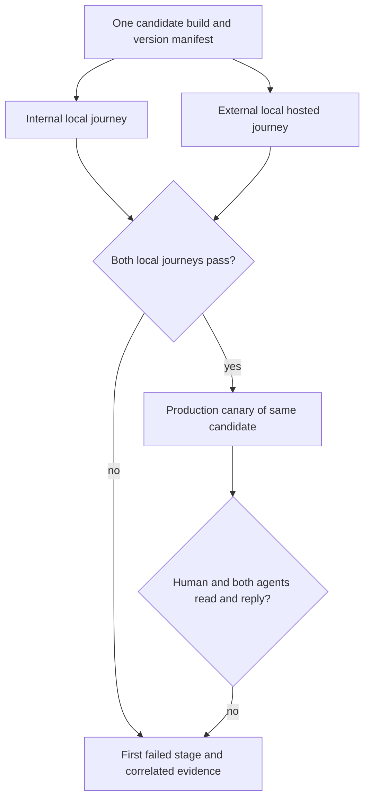
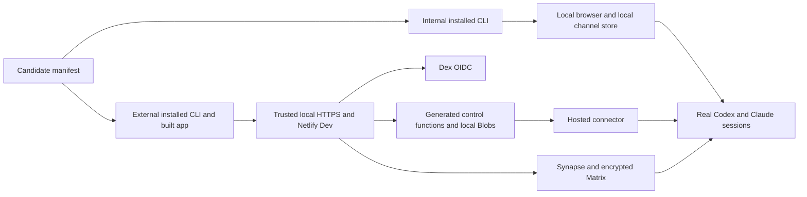

# Two-mode end-to-end parity - Plan

## Goal Capsule

Make a local failure reproduce the same Khala application path that fails after deployment, while preserving both designed chat modes. The user's explicit authority is to test the whole experience with a browser acting as a human and real Codex and Claude sessions, then prove the external release in production. No test result may be promoted from a component fixture, queued command, or successful HTTP request to a completed conversation.

Execution is now underway from refreshed main in isolated Aiur workspaces. The earlier GitHub, loopback, and Docker access failures were specific to a prior restricted session and are resolved; they are no longer acceptance blockers. The current blockers are proving real native model consumption in both local lanes and correlating the same released candidate through production.

## Product Contract

### Summary

Provide two repeatable local end-to-end journeys: one for dependency-free internal chat and one for encrypted external chat through the hosted application path. Promote the same source/lockfile and generated application code tested locally only after its journey passes, then run the same conversation canary against production. Origin- and provider-specific build/config values are recorded and checked as explicit allowed differences.

### Problem Frame

Internal and fixture-based tests have passed while production conversations have failed at identity, trust, dispatch, session lifecycle, or native-version boundaries. The evidence from separate green checks does not establish that a human, Codex, and Claude can read and write to one another through the released build.

### Key Decisions

- **Preserve two modes.** Internal chat remains local and requires no hosted service; external chat retains its encrypted Matrix and hosted application journey. (session-settled: user-directed — chosen over replacing either mode with a single shared path: both are product requirements, and both need local end-to-end proof.)
- **Prove the assembled application.** Local external acceptance exercises the real browser, sign-in protocol, control, durable state, Matrix encryption, connector, and installed native agents together. Narrower fixtures remain useful diagnostics but cannot satisfy this acceptance result. (session-settled: user-directed — chosen over component-only local green checks: local iteration must reproduce production code paths.)
- **Require model-visible delivery.** An agent's accepted command or queued release is not a read receipt or useful reply; the test records the actual existing session consuming a message and sending a response.

### Actors

- A1. The human owner uses the browser to create, approve, read, and send.
- A2. A real Codex session joins and receives messages under its own binding.
- A3. A real Claude session joins and receives messages under its own binding.
- A4. The internal local service or external hosted services carry state and delivery without impersonating an agent.

### Requirements

**Two local journeys**

- R1. The internal local test starts from the installed application, uses no hosted dependency or account, and proves browser, Codex, and Claude can exchange messages in both directions.
- R2. The external local test runs the production application paths for browser sign-in, channel creation and invitation, owner approval, encrypted Matrix transport, durable control state, connector delivery, and installed Codex and Claude sessions together.
- R3. The external local test uses a real authorization-code sign-in protocol and a local hosting environment that executes the production web and function code; a synthetic token shortcut cannot count as its sign-in proof.
- R4. Both tests preserve separate agent identities and require a model-visible read, an acknowledged delivery, a useful agent-origin reply, and browser-visible durable messages after reload.

**Release fidelity and failures**

- R5. Every run identifies the exact applicable web, function, connector, CLI, hook, configuration, and agent-version tuple it tested, recording `N/A` for hosted components absent from the internal lane. It fails clearly if applicable pieces are incompatible or drift during the run.
- R6. A local external pass is followed by a production canary of the same candidate and actors, including the real production sign-in and hosted services; local emulation alone does not claim production success.
- R7. A failed run reports the first failed stage with redacted correlation evidence, without leaking message bodies, credentials, invite secrets, or private keys.
- R8. Both journeys cover resume after an agent process stops. Work not consumed is released after reconnection; work read before a crash may be offered again until one durable model-origin acknowledgment exists. A reply is idempotent by operation ID and no acknowledgment may precede model consumption.
- R9. The tests clean up disposable local state and cannot silently reuse a previous successful room, device, browser profile, or connector binding.

### Key Flows

- F1. Internal: install/build the CLI, open the local browser channel, bind existing Codex and Claude sessions, exchange human-to-agent and agent-to-agent messages, restart one session, and verify durable catch-up while the Khala internal process and browser have no hosted Khala dependency. Native models may still reach their providers.
- F2. External local: start disposable hosted dependencies and the built application, sign in through a local identity provider, create and share a channel, approve both agents, exchange encrypted messages among all three actors, then reload the browser and reconnect an agent.
- F3. Production: promote the same external candidate and run an equivalent short canary through the real hosted origin and production identity provider before calling the release usable.



### Acceptance Examples

- AE1. Internal mode can complete a three-party conversation while outbound hosted Khala access is denied to its local application and browser; native model processes may use provider connections. Any hosted Khala call by internal-mode code fails the run.
- AE2. External local mode completes a real sign-in redirect and token exchange, then the human, Codex, and Claude each read and send encrypted messages visible after a fresh browser process loads the channel.
- AE3. A connector exits after owner approval but before dispatching intent; the release remains pending and is consumed by the same approved session after restart. If it exits after dispatching intent, the run observes `outcome_unknown` until a native receipt reconciles it. If the model read before crashing without acknowledgment, re-offer is allowed but one durable acknowledgment and one idempotent reply are required.
- AE4. The installed Codex version changes or a queued dispatch cannot resume; the canary fails at that boundary with the tested version and release state, rather than reporting success from an HTTP 200 or an empty native read.
- AE5. Local external succeeds but production sign-in, ingress, persistence, or native delivery fails; the release remains unaccepted and reports the production stage separately.

### Scope Boundaries

This work adds a faithful test and diagnosis path, not a third chat mode or a new encryption protocol. Internal remains dependency-free; external local may use disposable local implementations of hosted infrastructure while exercising the same application code and protocols. The actual Google and Netlify deployment boundaries remain part of the production canary. Existing fake-provider and synthetic-auth tests remain as fast, narrower checks, clearly labeled below the end-to-end gate.

### Sources

- `docs/plans/2026-09-16-kha-137-multi-owner-acceptance-harness.md`
- `docs/plans/2026-09-16-kha-139-collaboration-acceptance.md`
- `docs/plans/2026-09-16-kha-140-root-acceptance-plan.md`
- `docs/product/release-acceptance.md`
- `infra/preview/README.md`
- [Netlify local development](https://docs.netlify.com/api-and-cli-guides/cli-guides/local-development/)
- [Netlify Blobs local behavior](https://docs.netlify.com/build/data-and-storage/netlify-blobs/)
- [Playwright multi-user browser contexts](https://playwright.dev/docs/auth)

---

## Planning Contract

Product Contract unchanged. This plan defines an acceptance harness and the narrow runtime seams needed to run it; it does not declare the present product accepted. Implement against a fresh main candidate, not the older UI branch used to write this document.

### Grounding and key technical decisions

- KTD1. Keep two independent canary lanes under one candidate manifest. Internal uses the installed `khala internal` CLI and its local browser/state path; external uses the installed hosted CLI plus the built web and generated control function. Reuse the existing packaged smoke, installed delivery, and live browser assertions rather than replacing them with another synthetic test runner.
- KTD2. In external local mode, keep `KHALA_LOCAL_AUTH` disabled. Start the existing disposable Dex and Synapse/Postgres stack, expose app/issuer/homeserver through trusted local HTTPS, and run the generated function and built web through Netlify Dev so the normal OIDC client and Netlify Blobs adapter are used. Netlify Dev's local Blobs store emulates the provider, so only the production canary can prove the hosted provider itself. `apps/control/src/composition/human/production.ts` currently couples synthetic OIDC, filesystem CAS, and loopback allowances behind one flag; do not count that shortcut as external parity. If Netlify Dev cannot execute a required production route, repair the narrow runtime/packaging path rather than enabling synthetic auth.
- KTD3. Use real, existing, version-identified Codex and Claude sessions in isolated headless PTYs. Before room or binding creation, verify installed CLI setup, trusted native hook or plugin, supported route, effective listening mode, and model-visible delivery capability for each session; otherwise fail `unproven`. Keep connector processes alive through approval, intake, mode/status polling, read, acknowledgment, and reply. Fixture executables can still support unit tests but cannot satisfy R1, R2, or R4. Any native-version change stops the canary with a typed incompatibility record before another agent identity or room is created.
- KTD4. One run creates one disposable namespace, room, owner browser profile, and exact agent bindings. The orchestrator retains operation IDs across retries and permits no new join/send when a prior operation is merely pending. It observes terminal owner operation, connector dispatch, model-visible read, acknowledgment, and durable browser event as separate stages.
- KTD5. Record a candidate-level invariant of source commit, lockfile digest, CLI tarball digest, generated function and web **source/input** digests, hook/plugin artifact digest, and connector artifact digest. Each lane records its applicable execution tuple, an effective configuration fingerprint with secrets excluded, service image digests, and native versions; absent hosted components in internal mode are explicit `N/A`. Local and production bundle bytes may differ only for enumerated origin/CSP/provider configuration inputs; compare normalized build inputs and source digests, record those allowed differences, and reject any other drift. Production acceptance requires a canary on the deployed build ID and its exact agent package.
- KTD6. Use stage-bound evidence and redaction from `tests/e2e/harness/live-reporter.ts` and `scripts/acceptance` patterns. Record stable run, operation, event, binding generation, and receipt identifiers plus elapsed times, but never credentials, invite URLs, plaintext, encrypted payloads, or browser storage. Use an allowlisted child-process environment, private run-artifact permissions, and secret injection outside fixture files. Suppress or redact raw PTY, browser, and service logs before retention or upload. A test driver cannot infer success from rendered text before the Matrix event is durable or from a queued native command before model consumption.

### High-Level Technical Design

The two lanes share only candidate identity, native-session capture, and the evidence oracle. Internal delivery remains local even when the external topology is running. The witness correlates a fresh delivery challenge, exact native session, approved binding generation, model-visible read, and subsequent model-origin reply; scripted PTY input, connector-generated receipts, and an echo of the harness prompt cannot satisfy it.



For external acceptance, the owner browser signs in through Dex, creates the room, and approves the two proof keys. The control service releases each selected delivery to the connector; the bound native session must read it and emit a model-origin acknowledgment before its reply is counted. The browser then reloads in a fresh process and confirms the durable encrypted event. The production canary repeats this sequence against deployed services and the real identity provider.

```mermaid
stateDiagram-v2
  [*] --> pending: owner sends
  pending --> released: recipient approved and available
  released --> consumed: exact native session reads
  consumed --> acknowledged: model-origin receipt
  acknowledged --> durable: agent reply reaches Matrix and fresh browser
  pending --> pending: connector offline or approval withheld
  released --> pending: exits before dispatching intent
  released --> unknown: exits after dispatching intent
  unknown --> consumed: native receipt reconciles
  consumed --> consumed: exits before acknowledgment; re-offer allowed
  durable --> [*]
```

The state diagram is an acceptance oracle, not a proposal to add a new runtime state machine. Existing identifiers and receipts should be inspected first; add an adapter only where the current interfaces cannot report a boundary. Before dispatching intent, a retry retains the same operation and binding generation. After dispatching intent, the hosted dispatcher may report `outcome_unknown` and must reconcile a native receipt before advancing; it must not blindly requeue. A pre-acknowledgment re-offer is allowed, but a duplicate durable acknowledgment, duplicate reply, or missing model-origin receipt fails the run.

### Existing implementation and gaps

The internal packaged browser smoke in `tests/integration/internal-chat/packaged-smoke.test.mjs` already launches a packed CLI and prevents external browser requests. `tests/e2e/installed-delivery/installed-delivery.test.mjs` exercises installed entries but uses fake provider/version executables. The external browser suite in `tests/integration/human/create-share-chat.spec.ts` already proves real OAuth and encrypted browser traffic against an HTTPS deployment, but is not run by `.github/workflows/ci.yml` and does not prove both native agent sessions. `infra/preview/README.md` has disposable Dex and Synapse/Postgres with a real OIDC preflight, but no web/function/connector composition. `tests/e2e/collaboration/README.md` explicitly marks the live entry blocked; its scripted evaluator is not a live conversation. `scripts/acceptance/README.md` already provides exact installed-package provenance and native session identity capture.

### Sequencing and ownership

U1 defines the candidate/evidence contract first. U2 (internal native journey) and U3 (external hosted topology) can then proceed in parallel on disjoint test and infrastructure files. U4 adds one shared human–Codex–Claude conversation driver after U3 and reuses U1. U5 adds restart/fault proof against both lanes after U2 and U4. U6 wires a bounded local gate and production canary after U1–U5. Runtime changes to `apps/control` or `packages/agent-cli` require one owner per file and narrow regression tests; do not let two canary workers patch the same binding or auth logic independently.

The local identity provider tests the actual OIDC protocol and Khala callback logic. It does not pretend to be Google. Netlify Dev tests the generated function, routing, environment scope, and Blobs SDK behavior locally; it does not pretend to be Netlify's deployed edge. The production canary covers those two external provider boundaries.

### Implementation-time unknowns

- Whether the installed Netlify Dev version can serve the generated control function and local Blobs store behind trusted HTTPS without a small launcher adapter; verify this in U3 before changing production auth code.
- Which exact installed Codex and Claude versions have a proven interactive route when U2 and U4 execute; pin observed binaries in each run rather than copying a historical allowlist.
- Refresh main and recheck dispatcher, acknowledgment, and offline-status behavior before each runtime edit; the current release moved during planning and this document's requirements stay stable across those changes.

---

## Implementation Units

### U1. Candidate manifest and stage evidence

**Goal:** Make each local and production run attributable to one candidate and one isolated environment.

**Requirements:** R5, R7, R9; F1–F3; AE4–AE5.

**Dependencies:** None.

**Files:** `scripts/acceptance-pack.mjs`, `scripts/acceptance/README.md`, `tests/e2e/harness/live-reporter.ts`, new `tests/integration/two-mode/candidate-manifest.test.mjs`, and a new reusable manifest helper under `tests/integration/two-mode/`.

**Approach:** Reuse the clean-tree package provenance gate and add source/input and artifact hashes, hook/plugin identity, secret-free effective-config fingerprints, and version identifiers for applicable web, generated control function, connector, native CLI, and local services. Record `N/A` for hosted components absent from internal mode. Allocate a private run directory and emit a redacted stage journal whose verdict distinguishes `queued`, `model-consumed`, `acknowledged`, and `durable-browser-visible`.

**Execution note:** Characterize the current provenance and reporter outputs first. Write mismatch and redaction assertions that fail before extending the manifest.

**Test scenarios:** Mismatched CLI tarball, stale web bundle, changed native version, reused room/profile/namespace, absent terminal receipt, and a deliberately sensitive value in a diagnostic all fail with the correct first stage. Same candidate rerun gets a new isolated namespace without reusing a positive result.

**Verification:** Focused manifest and reporter tests; source/lockfile/bundle hashes and redaction assertions on one local run.

### U2. Real internal three-party canary

**Goal:** Prove the dependency-free product through an installed CLI, a headless human browser, and actual Codex and Claude sessions.

**Requirements:** R1, R4, R8–R9; F1; AE1, AE3.

**Dependencies:** U1.

**Files:** `tests/integration/internal-chat/packaged-smoke.test.mjs`, new `tests/integration/internal-chat/native-three-party.test.mjs`, and reusable native-session helpers under `tests/integration/two-mode/`. Keep `packages/agent-cli/src/composition/internal.ts` as the production path under test.

**Approach:** Preflight trusted hook/plugin setup, supported route, and effective listening modes before launching the installed package and real native CLIs in isolated headless PTYs. Capture session identity and owner approvals, then exchange human→Codex→Claude→human canaries through the browser. Isolate the Khala internal server/browser/CLI transport from hosted Khala origins while allowing provider connectivity for the native models; verify local persistence across a browser and one agent restart. Assert a session-bound model-origin acknowledgment and response for each agent, not fixture stdout.

**Execution note:** Run the existing packaged smoke as a characterization baseline. First make the new canary fail on a scripted or absent native recipient, then prove real-session consumption.

**Test scenarios:** No-host network isolation; approval withheld; both agents distinguishable; reply survives browser reload; agent exits with a queued message and the same binding consumes it after resume; a fake executable or new session ID is rejected as acceptance evidence.

**Verification:** Existing packaged smoke plus the new native canary with exact binary/session records; forced-stop cleanup proves no orphaned PTY or local server.

### U3. Disposable external local topology

**Goal:** Run the production external app path locally without synthetic sign-in or local-only auth bypasses.

**Requirements:** R2–R3, R5, R9; F2; AE2, AE5.

**Dependencies:** U1; independent of U2.

**Files:** `infra/preview/compose.yaml`, `infra/preview/README.md`, `netlify.toml`, new `scripts/acceptance/local-external.ts` and `tests/integration/two-mode/local-external-topology.test.mjs`; change `apps/control/src/composition/human/production.ts` or `packages/agent-cli/src/composition/hosted-production.ts` only if a targeted parity test proves a production-path defect.

**Approach:** Extend the pinned Dex/Synapse/Postgres preflight with local HTTPS ingress, generated control functions, built web output, Netlify Dev/Blobs, and an installed hosted connector. Bind test listeners to loopback, use per-run credentials and a private CA trusted only by spawned browser and CLI processes, and verify trust/listeners are removed at teardown. Keep `KHALA_LOCAL_AUTH` off and prove Dex authorization-code/PKCE callback reached the normal OIDC client. Preflight every service and tear down its isolated data and certificates after the run.

**Execution note:** Bring up the existing OIDC/Matrix preflight first and record which production route fails under Netlify Dev before adding an adapter or changing runtime code.

**Test scenarios:** Real callback and session cookie; Matrix versions/sync through HTTPS; generated `/api/*` routing; Blobs read/write after function restart; expired or missing runtime variable causes a typed stage failure; a synthetic-auth token, HTTP-only hosted origin, or production endpoint in the local descriptor is refused.

**Verification:** Disposable topology test and existing `infra/preview` OIDC checker, then browser sign-in via `tests/integration/human` against the local HTTPS descriptor; no production credentials or network origins in fixture files.

### U4. External local human–Codex–Claude conversation

**Goal:** Make the local external topology prove the same three-party encrypted conversation required in production.

**Requirements:** R2, R4–R5, R7; F2; AE2, AE4.

**Dependencies:** U1, U3.

**Files:** new `tests/integration/two-mode/external-three-party.spec.ts`, `tests/integration/human/fixtures.ts`, `tests/integration/review/native-witness.ts`, and reusable helpers under `tests/integration/two-mode/`; production paths under test are `apps/web/src/main.tsx`, `apps/control/src/runtime/discover.ts`, `apps/connector/src/composition/production.ts`, and `packages/agent-cli/src/composition/hosted-production.ts`.

**Approach:** Use one real browser owner and two exact native sessions after route/trust preflight. Create one channel, approve each proof/binding, send distinct fresh challenges, require encrypted Matrix event IDs, release only the selected recipient, correlate its model-visible read and acknowledgment with the exact session/binding generation, then require each agent's model-origin useful reply and a fresh-browser durable timeline. Have Codex and Claude exchange a message with each other and verify the human can read it. Preserve exact operation IDs and session generations across polling.

**Execution note:** Capture a failing full-path trace before fixing dispatch or native delivery. Check each boundary in order and change only the first failing runtime seam.

**Test scenarios:** Owner approval remains pending until reviewed; wrong binding cannot read; Codex and Claude get only selected releases; empty native read cannot pass; an optimistic UI echo cannot pass without a durable event; fresh browser/device handling is distinguished from same-device reload; agent→agent exchange and human timeline agree on event IDs.

**Verification:** Run the new Playwright/native acceptance test against the disposable external topology and inspect the redacted stage journal for every actor and event.

### U5. Restart and failure-boundary proof

**Goal:** Turn the production-only failures already observed into reproducible local failures.

**Requirements:** R5, R7–R8; F1–F2; AE3–AE5.

**Dependencies:** U2, U4.

**Files:** new `tests/integration/two-mode/recovery.test.mjs`, `tests/integration/recovery/installed-hosted-recovery.test.mjs`, `tests/integration/connector/README.md`, and narrow owning tests beside any changed dispatcher/ACK/status code.

**Approach:** Inject one failure at a named boundary, prove the injector fired, and assert the next durable state. Cover connector exit before dispatching, exit after dispatching with `outcome_unknown` reconciliation, stale queued dispatcher reason on reconnect, read→send→process-exit acknowledgment, mailbox status while agent offline, native binary version drift, browser reload, and a function/Blobs retry. The test must distinguish an allowed re-offer before acknowledgment from a lost message, duplicate durable acknowledgment, or duplicate reply.

**Execution note:** Each production bug first becomes a reproducible local red case or an explicitly retained characterization trace; only then change the narrow runtime seam and rerun both canaries.

**Test scenarios:** Queue wakes after supported-route projection; a pre-dispatch exit retries, while a post-dispatch exit remains `outcome_unknown` until native reconciliation; process exit before model-origin acknowledgment may re-offer content but produces only one durable acknowledgment and idempotent reply; status read does not acknowledge unseen content; offline controls show pending and reconcile on connector return; unsupported binary fails before join; wrong generation remains fenced.

**Verification:** Each fault is first observed red against the prior behavior or characterized by a retained production trace, then passes after the narrow fix. Rerun U2/U4 canaries after any source change.

### U6. Local gate, production canary, and release verdict

**Goal:** Make a local all-components pass and a production three-party pass the release evidence, with fast narrower checks still available for development.

**Requirements:** R5–R7, R9; F3; AE5.

**Dependencies:** U1–U5.

**Files:** `package.json`, `.github/workflows/ci.yml`, `scripts/acceptance/main.ts`, `docs/product/release-acceptance.md`, `README.md`, and new `tests/integration/two-mode/README.md`.

**Approach:** Expose separate internal and external local canary commands plus a combined gate. Run focused tests during edits; run the combined gate on the release candidate in an environment with Docker and native CLIs, and store its redacted report. After deploying from that candidate, rerun the equivalent short production canary against the deployed build and real identity provider using dedicated canary principals and a new restricted room. Verify expected owner and recipients before approval or send, then apply explicit remote retention/cleanup for canary state. A provider-specific production failure reopens the same stage with its build tuple; it cannot be hidden by a local pass.

**Execution note:** First prove the gate rejects an intentionally skipped actor and mismatched deployed build. A passing label is added only after both complete local traces and the deployed canary exist.

**Test scenarios:** Internal pass/external fail blocks; local external pass/production fail blocks; deployed source/input or non-allowlisted build hash differs from candidate blocks, while an enumerated origin/CSP difference does not; a skipped native actor or missing ACK blocks; all three real participants and durable receipts on both lanes produce a pass. CI labels fixture-only suites distinctly and does not silently skip the local all-components gate when its prerequisites are present.

**Verification:** Run unit/typecheck/lint for changed paths, both local canaries, and the production canary; record build IDs, native versions, pass/fail stages, and remaining provider limitations without secrets.

---

## Verification Contract

The owning implementation adds explicit scripts for `test:internal:native`, `test:external:local`, and `test:two-mode:e2e`; these names are proposed interfaces, not commands claimed to exist today. The existing baseline commands are `node --test tests/integration/internal-chat/packaged-smoke.test.mjs`, `node infra/preview/render-dex.ts`, `node infra/preview/smoke-oidc.ts`, `pnpm test:installed-recovery`, and `pnpm test:integration` with an HTTPS live descriptor. Run changed-path unit and browser tests after each implementation unit, then both full local journeys on a clean candidate. If Docker/native CLI or required network/runtime access is unavailable, report `blocked` with the exact missing prerequisite; never mark the unrun end-to-end gate green.

The pass oracle requires a browser-visible durable event after a fresh process reload, encrypted Matrix event ID for external mode, model-visible read in the exact existing Codex and Claude sessions, native acknowledgment, agent-origin reply, and no cross-binding leak. A queue insertion, owner operation `ok`, HTTP 200, or UI optimistic echo alone is insufficient. Each run uses a private isolated state directory and removes only resources it created.

## Definition of Done

The combined local gate passes for both unchanged product modes using real installed Codex and Claude sessions, and fails deliberately at every named fault boundary with a redacted, stage-specific report. The external local journey uses the production web/function/auth/Blobs/Matrix/connector code paths under disposable local services. A subsequent production canary passes against the deployed build with the same actor and evidence contract. Documentation gives one command per lane and a clear explanation of local provider emulation versus actual production proof. No issue or root acceptance is closed on fixture-only evidence.
