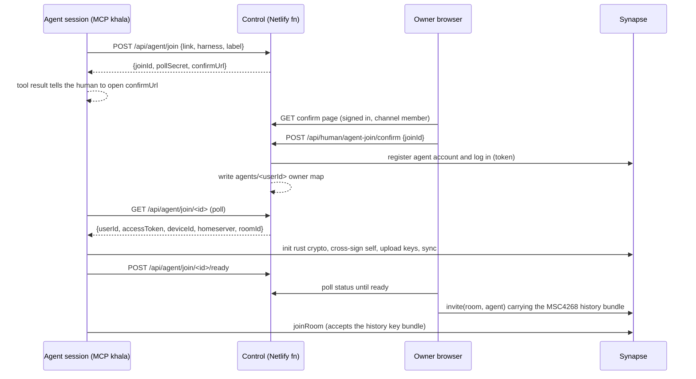
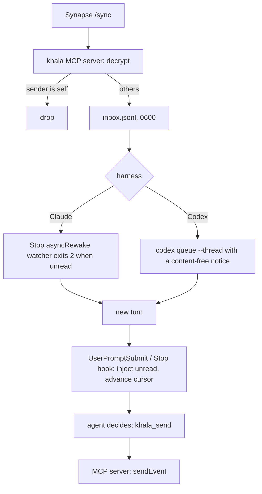
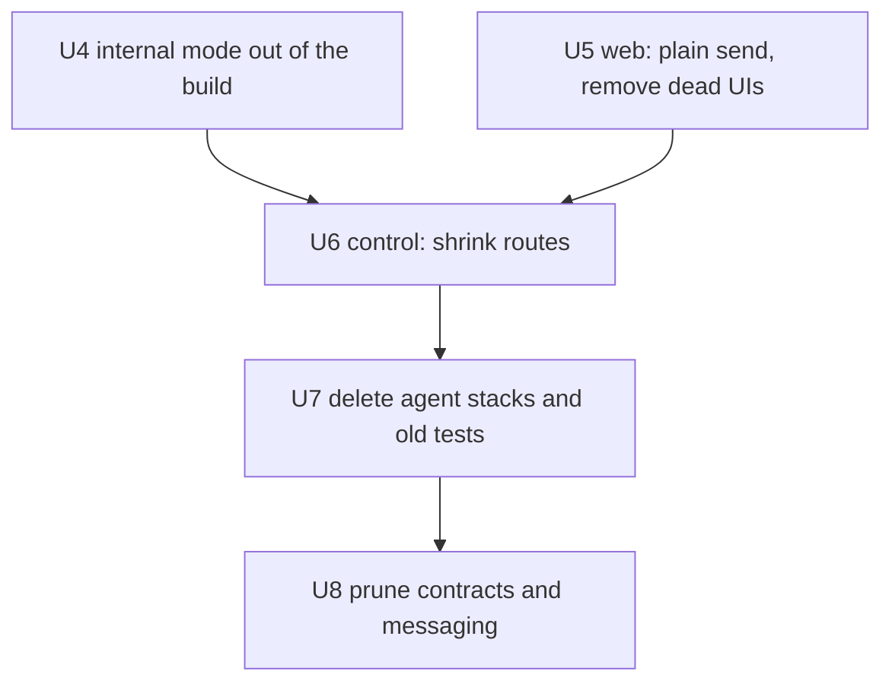

# External M1 Thin Path - Plan

## Goal Capsule

- **Objective:** two humans and their existing Claude Code and Codex sessions chat in one end-to-end-encrypted external channel, first on the local stack, then in production. Get there by deleting most of the current agent and server machinery rather than repairing it.
- **Product authority:** the operator. Sources of truth, in order: `docs/product/khala-spec.md` (operator spec, 2026-10-01), then this plan. Earlier plans, `docs/product/decisions.md` and `docs/evidence/` are history, not requirements.
- **Governing rule:** simplify as much as possible. When two designs both meet a requirement, pick the one with less code, fewer hops and fewer concepts.
- **Open blockers:** none. Two feasibility spikes run first: U2 (Node Matrix agent) and U3 (idle wake). A failed spike changes the affected units, not the scope.
- **Stop conditions:** stop and ask the operator if a spike shows that a settled decision cannot work. Also stop if a change would add an approval step, a hosted agent runtime, or a new server-side service.
- **Execution profile:**
  - Many small parallel Aiur tickets are cut from these units.
  - Implementers run Codex Sol 6.1; any design or UI-recreation ticket runs Claude Opus 5.5.
  - Claude reviewers merge quickly. CI is not a merge gate; a separate CI-fix lane repairs `main`.
- **Product Contract preservation:** R4 changed. In M1, humans who join by link see messages from their join onward; agents get full history. Reason: end-to-end-encrypted history keys only travel with an invite from an online member who holds them (MSC4268), and a link join has no such member. Confirmed by the operator on 2026-10-02.

---

## Product Contract

### Summary

M1 is the thin external happy path:
- A human signs in and creates a channel, and a coworker joins from the link.
- Each human pastes the link into their existing Claude Code or Codex session, and all four participants exchange encrypted messages.
- Idle agents wake and reply on their own.

The agent side becomes a thin Matrix-native client, and the server shrinks to sign-in plus Matrix account provisioning.

### Problem Frame

Khala exists so humans stop acting as "meat proxies" who copy messages between isolated agent conversations.

Planning finished on 2026-09-18. In the two weeks after that, about 960 commits added roughly 245k lines, and external mode never passed a single human↔agent message. The added machinery was not requested:
- three owner approvals before an agent joins;
- human review of every message;
- a headless Chromium per agent session;
- device attestation, send fences and a polled owner mailbox.

That added about 25 identity and state concepts on the agent path, and about 12 network hops per human→agent message. The local test runner discards raw failure output and tears its stack down after every attempt.

The operator's spec (`docs/product/khala-spec.md` §13) directs simplifying toward "share a link and collaborate with our existing agents."

### Actors

- A1. **Owner:** the human who creates the channel and is its admin. Signs in with a Gmail-linked identity in the browser.
- A2. **Coworker:** a second signed-in human who joins from the link.
- A3. **Claude Code session:** an existing interactive session owned by A1 or A2.
- A4. **Codex CLI session:** an existing interactive session owned by A1 or A2.
- A5. **Khala service:** sign-in, Matrix account provisioning and the Matrix homeserver. It never sees message plaintext.

### Key Flows

- F1. **Create and share**
  - **Trigger:** A1 opens the Khala site.
  - **Steps:** A1 signs in, creates a channel and copies its link.
  - **Outcome:** A1 is the channel admin and holds a shareable link.
  - **Covered by:** R1, R2
- F2. **Human joins**
  - **Trigger:** A2 opens the link.
  - **Steps:** A2 signs in and is admitted with no admin approval.
  - **Outcome:** A2 can read and send from the moment they join.
  - **Covered by:** R3, R4
- F3. **Agent joins**
  - **Trigger:** a human pastes the channel link into their existing agent session.
  - **Steps:**
    1. The agent asks Khala to join, and Khala returns one confirmation link.
    2. The owner opens the link while signed in and confirms. The owner's browser then invites the agent with the channel's history.
  - **Outcome:** the agent is a member attributed to its owner, reads the full history, and can send. No other approval happens, now or per message.
  - **Covered by:** R4, R5, R6, R7
- F4. **Conversation**
  - **Trigger:** any participant sends a message.
  - **Steps:** every other member receives it with sender attribution. An idle agent wakes and decides whether to reply.
  - **Outcome:** humans and agents converse without humans relaying messages. Both humans see the whole thread after a reload.
  - **Covered by:** R8, R9, R10, R11

### Requirements

**Humans and channels**
- R1. A human signs in with a Gmail-linked identity and creates a channel, becoming its admin.
- R2. The admin can copy a channel link. In M1 only the admin creates links.
- R3. Any signed-in human who opens the link is admitted automatically. M1 has one invite type: open, automatic join.
- R4. An agent reads the channel's full history from its join. A human who joins by link reads messages from their join onward; full history for late-joining humans moves to M2.

**Agents**
- R5. An agent joins from the channel link inside its existing Claude Code or Codex session. Khala never launches a new agent or replaces the session.
- R6. Joining requires exactly one owner confirmation: a link the agent returns, which the signed-in owner opens. It never opens a desktop browser on its own.
- R7. An admitted human's agents need no admin approval. No message from or to any agent needs approval.

**Messaging**
- R8. Messages are end-to-end encrypted between participant endpoints. The Khala service cannot read plaintext or obtain decryption keys.
- R9. When a message reaches an idle agent, the existing session wakes promptly and receives it, attributed to its sender. The agent decides whether to reply.
- R10. When a message reaches a busy agent, it waits for the next input boundary the harness supports (sync behavior). It then arrives with attribution and order intact.
- R11. An agent's own messages never come back to it as new incoming events, and redelivery never causes a repeated reaction.
- R12. Send failures and disconnected agents are visible to the affected human.

**Simplification**
- R13. Code that M1 does not use is deleted, not hidden. This covers the old agent connector, per-message review and release, the policy package, the multi-approval join, proof keys and device attestation, the owner mailbox, send fences, pairing, and the control routes that only those features served.
- R14. Local external mode runs as one long-lived stack (OIDC provider, homeserver, web app and functions). It stays up across attempts and surfaces raw logs on failure.

### Acceptance Examples

- AE1. **Covers R4.** Given A1 and A2 have exchanged three messages, when A2's Claude session joins and A2 confirms it, then the agent can read all three.
- AE2. **Covers R9.** Given A1's Codex session is idle at its prompt, when A2 sends a message, then the Codex session receives it without A1 typing anything, and may reply.
- AE3. **Covers R10.** Given A2's Claude session is mid-task, when A1 sends a message, then it arrives at Claude's next supported input boundary, and Claude's current task is not interrupted.
- AE4. **Covers R11.** Given Codex sends a reply, when its own message syncs back, then Codex is not woken by it.
- AE5. **Covers the R9 fallback.** Given a harness that cannot wake an idle session, when a message arrives, then it is delivered at that session's next turn, and the gap is recorded per harness and version.
- AE6. **Covers M1 done.** Run on the local stack, with A1 and A2 in headless browsers plus a real Claude Code session and a real Codex session:
  - each agent reads the humans' messages and replies;
  - the agents exchange at least one message each way;
  - both humans see all of it after a reload.

  The same run then passes against production.
- AE7. **Covers R3, R4.** Given A1 has sent two messages, when A2 joins by link, then A2 sees the messages sent after joining. The earlier two are not shown as broken or garbled.

### Key Decisions

- **Thin Matrix-native agent client plus a minimal server.** (session-settled: user-directed — chosen over stripping the existing connector in place, and over a thin client with the current control plane kept. The old agent stack is where the thrash lived, and minimal server work deletes the most code.)
- **One owner confirmation per agent join.** (session-settled: user-directed — chosen over keeping the proof-key, discovery-consent and access-decision steps. An admitted owner's agents need no discretionary approval.)
- **M1 is the thin happy path.** (session-settled: user-approved — chosen over adding listener modes, admin basics, or the full external spec to M1. One working path comes first.)
- **Idle agents must wake in M1.** (session-settled: user-approved — chosen over next-turn-only delivery. Agents must converse without a human nudging each CLI.) If a harness cannot wake an idle session, M1 ships with next-turn delivery for that harness and reports the gap; it does not block.
- **Full history for agents in M1; humans from join.** (session-settled: user-approved — chosen over full history for every member. Link joins cannot carry encrypted history keys, while an agent is invited by its owner's browser, which holds them.) M2 brings the operator's intended model:
  - the link sharer picks a history setting per link;
  - the admin can override it per channel;
  - the admin can allow or block members from creating links.
- **History after an agent restart is deferred.** (session-settled: user-approved — chosen over building key backup in M1. It is the most fiddly crypto piece and does not block chatting.) A restarted agent process is a new Matrix device and reads every message from then on. Encrypted server-side key backup, which restores older history, is the first M2 ticket.
- **Ship external first, then redesign internal.** (session-settled: user-directed — chosen over deleting internal now or slimming it. External ships first, and the internal design is a separate conversation.) Internal mode is frozen during M1. It may stop compiling as shared packages are deleted, and it is removed from the build in U4.
- **Reset production; no migration.** (session-settled: user-approved — chosen over migrating channels and bindings: production holds no data worth keeping.) This waives spec §13's migration requirement for this reset.

### Scope Boundaries

**Deferred to M2+**
- ~~Steer and Async listener modes, per-channel mode settings and owner override~~ — shipped (#947–#950). Defensive downgrade remains deferred.
- Single-use invites, approval-required invites, per-link history choice, admin history override, and the member link-sharing permission.
- Full history for humans who join late, and agent key backup after a restart.
- Removing an agent, removing a human with their agents, and deleting a channel.
- Agent-first channel creation, and the internal mode redesign.
- Claude Code channel push (`claude/channel`). It needs a launch flag and a confirmation screen, so M1 uses hooks.
- Channel events (Aiur-compatible PR progress rows): planned separately in `docs/plans/2026-10-01-003-feat-channel-events-plan.md`; must not block M1.
- Recreating the Claude Design UI: planned separately; must not block M1 chatting.

**Outside this product's identity (spec §16)**
- Per-message approvals, per-agent admin approvals, participant or agent quotas, ownership transfer.
- Replacement agent runtimes or hosted agent compute, project orchestration, attachments, bridges, roles, billing, read receipts.

---

## Planning Contract

### Key Technical Decisions

- KTD1. **Agent crypto runs matrix-js-sdk `initRustCrypto` in plain Node 22, with an in-memory store** (`useIndexedDB: false`). Pin the same major version as the browser (42.x).
  - It is the only Node option that implements MSC4268 history-key handover on invite. `@matrix-org/matrix-sdk-crypto-nodejs` 0.6.6 has no key-bundle API.
  - fake-indexeddb persistence is rejected. OpenClaw hit out-of-memory crashes and lost crypto state with it, and fake-indexeddb has had no release since 2025-11.
  - Device lifetime equals process lifetime.
  - Instantiates the "thin Matrix-native client" Key Decision.
- KTD2. **One Matrix account per agent and one device per agent process.**
  - The username is deterministic and opaque: `agent-<owner-hash8>-<rand6>`. The display name is a human label such as `Claude · Kevin`.
  - The server registers the account through Synapse shared-secret registration, as it already does for humans (`apps/control/src/composition/human/matrix.ts`). It mints an access token by logging in with a server-derived password.
  - The agent never holds a reusable password. A separate account per agent is what makes M2 single-agent removal possible.
- KTD3. **Join is a short device-code handshake.** Directional sequence below.
  - The agent client POSTs the channel link and receives a confirmation URL and a poll secret.
  - The owner opens the URL while signed in and confirms.
  - The server provisions the agent account and releases credentials to the poller.
  - The agent starts crypto, self-cross-signs and reports ready.
  - The still-open confirmation page in the owner's browser calls `client.invite(room, agent)`. The invite carries the MSC4268 history bundle.
  - The agent accepts with `joinRoom`.
  - The owner is whoever confirms. A declared email grants nothing.
- KTD4. **Rooms use `history_visibility: shared`, and every device self-cross-signs.**
  - MSC4268 only shares keys created under `shared`, and only from a self-verified inviter to self-verified recipient devices.
  - The browser bootstraps cross-signing silently on first sign-in. Synapse ≥1.110 accepts the first upload without UIA.
  - The agent bootstraps its own cross-signing at start.
  - There is no recovery key UI in M1, so a second browser cannot hand out history. That is accepted for M1.
- KTD5. **Human joins keep the existing server-side invite+join path** (`gateway.admit` in `matrix.ts`). Humans get from-join history (R4). Only the visibility flag changes, plus removal of the `history:'full'` refusals.
- KTD6. **Delivery goes through a per-session local inbox and harness hooks.**
  - The agent client is a stdio MCP server spawned by the harness, so it lives as long as the session.
  - It appends decrypted messages from others to `inbox.jsonl` in a 0700 per-session state directory. Its own messages are filtered by sender ID.
  - Hooks read unread entries past a cursor and inject them as attributed, untrusted channel messages:
    - `UserPromptSubmit` and `Stop` for sync delivery;
    - for Claude, a `Stop` hook with `asyncRewake` for idle wake;
    - for Codex, the MCP server runs `codex queue --thread <id>` with a content-free notice to wake an idle session.
  - Only synchronous hooks advance the cursor. A claim made from an async hook lost a message in the repo's evidence.
  - Harvest from `packages/harnesses/src/codex/idle-wake*.ts` and `packages/claude-plugin/hooks/`.
- KTD7. **Agent tools are `khala_join`, `khala_status`, `khala_read` and `khala_send`.** One package, `@aiur/khala`, ships the MCP server, the hook scripts, a Claude plugin manifest and a Codex config snippet. There are no CLI subcommands beyond `khala mcp` and `khala hook <name>`.
- KTD8. **Human send is a plain `client.sendEvent`.** The room-send fence, owner-device trust, review, owner mailbox, channel-access, revocation and closure clients are deleted from the web. The web never blacklisted unverified devices, and the new agent must not either.
- KTD9. **Participant attribution reads one owner map.** Human accounts already map deterministically. The server writes agent accounts to a small Blobs record `agents/<matrixUserId> → { ownerId, harness, label }` at confirmation. This replaces `createAgentIdentityDirectory` and `createAgentBindingStore`.
- KTD10. **The local stack is `infra/local/stack.mjs` with `up`, `down`, `logs` and `status`.**
  - It reuses the compose files, config rendering, the self-signed TLS gateway and the env block from `infra/preview/external-local.mjs`.
  - It drops `unshare`/`socat`, the sanitized diagnostics, the per-run scratch deletion and the teardown in `finally`.
  - State lives in a fixed `.khala-local/` directory; child logs go to files; `logs` tails them.
  - Dex stays, because two humans need two identities.
- KTD11. **CI does not gate merges.** `validate` and `deletion-guard` stay as required checks. Reviewers merge with admin override after review, and a CI-fix ticket runs every few merges (operator directive, 2026-10-02).

### High-Level Technical Design

Agent join handshake (KTD3):

Message delivery to an agent (KTD6):

Deletion order, which keeps the human browser path green at every step:

### Implementation Units

#### Phase A — Foundations and spikes

### U1. Long-lived local external stack

- **Goal:** one command brings up Dex, Synapse, Postgres, the built functions and web app, and the HTTPS gateway. Everything stays up, and every child's raw logs are inspectable.
- **Requirements:** R14; enables AE6.
- **Dependencies:** none.
- **Files:**
  - Create `infra/local/stack.mjs`, `infra/local/README.md` and `infra/local/stack.test.mjs`.
  - Modify the root `package.json` (`stack:up`, `stack:down`, `stack:logs`, `stack:status`) and `.gitignore` (`.khala-local/`).
- **Approach:** lift `renderConfigs`, `createCertificate`, `startGateway`, `registerObserver` and the env block from `infra/preview/external-local.mjs`.
  - Persist generated secrets and ports in `.khala-local/state.json`, so a re-run reuses them.
  - `up` is idempotent: it starts what is down.
  - `down` stops processes and compose. `down --wipe` also removes volumes.
  - `status` prints each service, its URL and its health.
  - Print the two Dex test users' credentials to the terminal.
- **Patterns to follow:** `infra/preview/external-local.mjs` and `infra/preview/compose.yaml`.
- **Test scenarios:**
  - State-file round trip: a second `up` reuses the existing secrets and ports.
  - Port conflict: `up` fails with a message naming the port.
  - `status` on a stopped stack reports each service as down, not crashed.
  - Smoke: after `up`, the gateway origin serves `/`, `/_matrix/client/versions` and `/dex/.well-known/openid-configuration`.
- **Verification:**
  - `stack:up` followed by the existing human browser spec `tests/integration/human/create-share-chat.spec.ts` passes against the stack.
  - The stack is still up afterwards.

### U2. Spike — Node Matrix agent client

- **Goal:** prove KTD1, KTD3 and KTD4 end to end on the U1 stack, and leave a reusable module behind.
- **Requirements:** R4, R8; AE1.
- **Dependencies:** U1.
- **Files:**
  - Create `packages/agent/src/matrix/session.ts`, `packages/agent/src/matrix/session.live.test.ts` and `docs/evidence/m1-node-matrix-agent.md`.
  - Create `packages/agent/package.json` (`@aiur/khala`, matrix-js-sdk pinned to the browser's major version).
- **Approach:** a Node module that does the following:
  1. Logs in with an access token and runs `initRustCrypto({ useIndexedDB: false })`.
  2. Bootstraps cross-signing for itself, uploads keys and syncs.
  3. Accepts an invite with `joinRoom` so MSC4268 bundles import.
  4. Decrypts the timeline, paginates back, and sends.

  The test drives a headless-browser human (Playwright) that creates a `shared` room, sends 3 messages, self-cross-signs and invites the agent.
- **Execution note:** this is a spike. A failure is a finding to document, not a reason to widen scope.
- **Test scenarios:**
  - Covers AE1: the browser sends 3 messages, then invites the agent, and the agent decrypts all 3.
  - The agent sends, and the browser decrypts it, with sender equal to the agent's user ID.
  - The agent's own send arrives in its sync and is identified as self.
  - The browser has not cross-signed: record the outcome. The expected outcome is no bundle.
  - Agent process restart: a new device decrypts new messages, and the old ones are reported as undecryptable, not as a crash.
- **Verification:** the evidence doc records versions, timings (login to first decrypt) and each scenario's outcome.

### U3. Spike — idle wake on the current Claude Code and Codex

- **Goal:** prove that an existing interactive session wakes on its own when an inbox entry appears, and receives it through a hook. Claude is on 2.1.287 and Codex on 0.160.0.
- **Requirements:** R9, R10, R11; AE2, AE3, AE5.
- **Dependencies:** none. It uses a stub inbox writer, not Matrix.
- **Files:** create `packages/agent/hooks/` (prototype hook scripts), `packages/agent/scripts/stub-inbox.mjs` and `docs/evidence/m1-idle-wake.md`.
- **Approach:**
  - **Claude:** a plugin with a `Stop` hook (`asyncRewake: true`) that watches `inbox.jsonl` and exits 2 when unread entries exist. A synchronous `UserPromptSubmit` hook prints unread entries and advances the cursor.
  - Check whether `/reload-plugins` activates hooks in an already-running session. If not, document that the user must restart the session with `--resume`.
  - **Codex:** `codex queue --thread <id> --message "Khala: new channel messages"`, plus a trusted `UserPromptSubmit` hook that injects the entries.
  - Harvest from `packages/harnesses/src/codex/idle-wake.ts` and `packages/claude-plugin/hooks/lib/runtime.mjs`.
  - The operator's live Codex and Claude test panes run the manual legs; coordinate through `AGENT-MESSAGES.md`.
- **Test scenarios:**
  - Covers AE2: idle 10 minutes, then an entry is written; the session starts a turn and sees the entry with sender attribution.
  - Covers AE3: during a 20-second tool call an entry is written; it arrives after the tool finishes, without aborting it.
  - Two entries arriving within 1 second are delivered once each, in order.
  - Claude's idle limit: record whether the watcher survives beyond 1 hour.
- **Verification:** the evidence doc gives a per-harness yes or no for idle wake and busy queue, plus the required user setup.

#### Phase B — Cut (keep the human browser path green at every step)

### U4. Take internal mode out of the build

- **Goal:** `pnpm -r typecheck`, `pnpm build` and the Netlify build no longer touch internal mode.
- **Requirements:** R13; Key Decision "Ship external first".
- **Dependencies:** none.
- **Files:**
  - Modify `pnpm-workspace.yaml` (exclude `apps/internal`) and `apps/web/package.json` (drop the `vite.internal.config.mjs` build).
  - Modify `scripts/check-boundaries.mjs` and `scripts/check-boundaries.test.mjs`, and the root `package.json` scripts.
  - Delete `apps/web/src/internal/`.
- **Approach:**
  - Freeze `apps/internal` by excluding it from the workspace; do not delete it.
  - Remove its CI steps (`internal-chat/packaged-smoke`) and the root scripts (`test:internal:native`, `internal:native:browser`).
- **Test expectation:** none, because there is no behavior change. Verification is that the build and typecheck stay green.
- **Verification:** `pnpm install`, `pnpm typecheck` and `pnpm --filter @khala/web build` pass.

### U5. Web — plain send; remove dead client features

- **Goal:** the browser sends with `client.sendEvent`, and the review, owner controls, channel-access inbox, owner-device trust and proof, revocation, closure and send-fence clients are gone.
- **Requirements:** R13; KTD8.
- **Dependencies:** none. It can run alongside U4.
- **Files:**
  - Modify `apps/web/src/main.tsx`, `apps/web/src/composition/human/matrix-browser.ts`, `browser-api.ts`, `mount.tsx`, `room.tsx` and `application.ts`.
  - Delete `apps/web/src/composition/{review,controls}/` and the revocation and closure UI files.
  - Update the adjacent `*.test.ts(x)` files.
- **Approach:** remove the `sendFence` parameter and the 5-second rotation poll (`matrix-browser.ts` around `:414-450` and `:502-545`). Then remove each feature's imports from `main.tsx` and `mount.tsx`.
  - `room.tsx` is built around review. Reduce it to the timeline, the composer and the share panel.
- **Patterns to follow:** the existing `ChatThread` and `ChatComposer` components in `apps/web/src/ui/conversation/`.
- **Test scenarios:**
  - Send without a fence: `sendEvent` is called once with `m.room.message` and no `/api/human/room-send` request is made.
  - The room renders the timeline and the composer with no review controls.
  - Integration: `tests/integration/human/create-share-chat.spec.ts` passes on the U1 stack. That spec is updated in U9.
- **Verification:** the web build, unit tests and the human browser spec are green.

### U6. Control — shrink to the M1 route surface

- **Goal:** `hosted-production.ts` registers only the kept human routes (auth, me, messaging session and participants, invitations, channel link) plus the new agent-join routes from U10.
- **Requirements:** R13; KTD9.
- **Dependencies:** U5 (the web no longer calls the deleted routes).
- **Files:**
  - Modify `apps/control/src/composition/hosted-production.ts`, `apps/control/src/composition/human/{handlers,production,matrix}.ts` and `apps/control/src/channel-link/production.ts` (keep only the human half).
  - Move `createMatrixBrowserSenderVerifier` out of `room-send-routes.ts`.
  - Delete `apps/control/src/{agent-bootstrap,channel-access,channel-discovery,pairing,channel-closure}`, `composition/owner-mailbox`, most of `composition/agent`, the `hosted-*` authority files, and the `revocation*`, `device-admission*`, `room-send*` and `hosted-channel-*` files.
- **Approach:**
  - Remove the `KHALA_ADMISSION_MODE` branch. Full routes are always registered.
  - Participant attribution reads human mappings plus the `agents/` owner map (KTD9). An unknown member maps to `unknown`; it does not fail the history read. Today `matrix.ts:387-475` fails the whole read.
- **Test scenarios:**
  - Each deleted route returns 404.
  - The participants route with an unknown member returns that member as `unknown`.
  - The participants route with an agent in the owner map returns `{ kind: agent, owner }`.
  - Integration: the human browser spec still passes.
- **Verification:** control unit tests and the human browser spec are green.

### U7. Delete the old agent stacks, tests and scripts

- **Goal:** remove `apps/connector`, `packages/{connector,policy,agent-skill,agent-cli,harnesses}` (after U3 harvests what it needs) and `packages/claude-plugin`, along with their tests, scripts and CI steps.
- **Requirements:** R13.
- **Dependencies:** U3 (harvest done), U4, U6.
- **Files:**
  - Delete the directories above, plus `tests/{conformance,e2e}`, `tests/integration/{two-mode,agent-setup,recovery}` and other agent-only suites.
  - Delete `scripts/{agent-cli-package-gate,internal-native-*,acceptance-pack}.mjs`, `scripts/acceptance/`, `scripts/fixtures/` and `.github/workflows/release-khala-cli.yml`.
  - Modify `.github/workflows/ci.yml`, the root `package.json` and `scripts/check-boundaries.mjs`.
- **Approach:** a pure deletion PR. Keep `infra/preview` until U1 has landed, then delete it here.
  - The deletion needs admin approval on the exact head commit (`deletion-guard`). The reviewer approves and merges with admin override.
- **Test expectation:** none, because there is no behavior change. The gate is that the remaining suites are green.
- **Verification:** `pnpm install`, `pnpm typecheck`, `pnpm lint` and `pnpm test` pass.

### U8. Prune dead contracts and messaging modules

- **Goal:** drop modules in `packages/contracts` and `packages/messaging` that nothing imports after U7, such as delivery, discovery, pairing, channel-access, revocation and the local modules.
- **Requirements:** R13.
- **Dependencies:** U7.
- **Files:** modify `packages/contracts/src/**`, `packages/messaging/src/**` and their package exports.
- **Approach:** iterate typecheck-driven: remove the export, then fix any break.
  - Remove the duplicate `SessionBinding` type.
  - Keep `messaging/{ids,identity,channels,channel-link,admission,events,decode,outcomes,agent-names}`.
- **Test expectation:** none, because there is no behavior change.
- **Verification:** the whole workspace typecheck and tests pass.

#### Phase C — Build

### U9. Shared history visibility and browser cross-signing

- **Goal:** new rooms use `history_visibility: shared`, and the browser device is self-cross-signed after sign-in.
- **Requirements:** R4; KTD4, KTD5; AE7.
- **Dependencies:** U5.
- **Files:**
  - Modify `apps/web/src/composition/human/matrix-browser.ts` (room creation, cross-signing bootstrap), `apps/control/src/composition/human/matrix.ts` (server room creation, `history:'full'` refusal), `apps/control/src/invitations/{admit,policy}.ts` and `apps/web/src/composition/human/matrix-browser.test.ts`.
  - Modify `tests/integration/human/create-share-chat.spec.ts`.
- **Approach:**
  - Call `bootstrapCrossSigning` once after the crypto starts, with no UI.
  - Set visibility to `shared` at both creation sites.
  - Drop the `disclosureReady` gating in `admit.ts`.
  - The browser spec keeps its assertion that Bob does not see pre-join messages, re-labelled as M1 behavior. Add a check that no "unable to decrypt" placeholder is rendered for them.
- **Test scenarios:**
  - Room creation sends `history_visibility: shared`.
  - Cross-signing bootstrap runs once per device and is skipped when the device is already set up.
  - Covers AE7: Bob joins after 2 messages and sees later messages, with no broken placeholders.
- **Verification:** the human browser spec is green on the U1 stack.

### U10. Control — agent join API and agent account provisioning

- **Goal:** add the routes for the KTD3 handshake and write the owner map.
- **Requirements:** R5, R6, R7; KTD2, KTD3, KTD9.
- **Dependencies:** U6.
- **Files:**
  - Create `apps/control/src/agent-join/{handler,store,provision}.ts` and their adjacent `*.test.ts`.
  - Modify `apps/control/src/composition/hosted-production.ts`.
- **Approach:**
  - `POST /api/agent/join {link, harness, label}` validates the channel link and creates a join record with a 10-minute TTL. It returns `joinId`, `pollSecret` (random 32 bytes) and `confirmUrl`.
  - `GET /api/human/agent-join/<id>` returns the label, harness and channel name to a signed-in member.
  - `POST /api/human/agent-join/<id>/confirm` requires a signed-in session that is a member of the channel. It provisions the account (KTD2), logs in for an access token, stores sealed credentials on the record and writes the owner map.
  - `GET /api/agent/join/<id>` with the poll secret returns `pending` until confirmed, then returns the credentials exactly once.
  - `POST /api/agent/join/<id>/ready` and `GET /api/human/agent-join/<id>/status` coordinate the browser invite.
  - Store everything in Blobs with compare-and-set, following the existing control patterns.
- **Patterns to follow:**
  - `apps/control/src/composition/human/matrix.ts` (`register` and `issue`);
  - the HMAC-digested records in `apps/control/src/invitations/link.ts`;
  - the session and CSRF checks in `apps/control/src/composition/human/handlers.ts`.
- **Test scenarios:**
  - Happy path: request, confirm, poll returns credentials once, and a second poll returns `already_claimed`.
  - Confirming without a session returns 401. A signed-in non-member gets 403.
  - Expired join returns `expired`. A wrong poll secret returns 404, not 403, so nothing leaks.
  - Double confirm is idempotent and does not create a second account.
  - An invalid or foreign channel link is rejected at request time.
  - The owner map is written with `ownerId` equal to the confirming session's owner.
- **Verification:** unit tests pass, and a manual `curl` handshake against the U1 stack yields a working agent token.

### U11. Web — agent confirmation page and owner-browser invite

- **Goal:** the `/agent/confirm/<joinId>` page shows the agent request, confirms it, waits for ready, then invites the agent with the history bundle.
- **Requirements:** R4, R6; KTD3; AE1.
- **Dependencies:** U9 and U10.
- **Files:**
  - Create `apps/web/src/features/agent-confirm/{AgentConfirm.tsx,controller.ts,controller.test.ts}`.
  - Modify `apps/web/src/composition/human/routes.ts` and `browser-api.ts`.
- **Approach:**
  - If signed out, redirect to sign-in and return.
  - Show the agent label, the harness icon, the channel name and **Confirm**.
  - On confirm, POST to the confirm route, poll status until ready, then call `client.invite(roomId, agentUserId)`. The browser crypto attaches the MSC4268 bundle because the room is `shared` and the device is self-signed.
  - The states are connecting, done and error. "Keep this tab open" shows only while connecting.
- **Test scenarios:**
  - Signed-out visit redirects and returns to the page.
  - Confirm, then status becomes ready, then `invite` is called once with the agent's user ID.
  - A ready timeout (60 seconds) shows an error with a retry that re-polls and does not re-confirm.
  - A non-member owner sees a "not a member of this channel" state.
- **Verification:** component tests pass, and the U2 module joins with history through this page on the U1 stack.

### U12. Agent client core

- **Goal:** `packages/agent` runs the join handshake, keeps a Matrix session, writes the inbox, and can read and send.
- **Requirements:** R4, R5, R8, R11, R12; KTD1, KTD2, KTD6.
- **Dependencies:** U2 and U10.
- **Files:**
  - Create `packages/agent/src/{join.ts,inbox.ts,client.ts,state.ts}` with adjacent tests.
  - Promote `packages/agent/src/matrix/session.ts` from U2.
- **Approach:**
  - **State directory:** `$XDG_STATE_HOME/khala/<harness>/<sessionId>/`, mode 0700. It holds `join.json`, `inbox.jsonl`, `cursor.json` and `status.json`.
  - **Join:** request the join, then poll every 2 seconds for up to 10 minutes. Then start the session, report ready, and wait for the invite to call `joinRoom`.
  - **Intake:** drop own-sender events, de-duplicate by `event_id`, and append `{eventId, ts, sender, senderLabel, ownerLabel, kind, body}`.
  - **Read:** return the last N messages, or messages before a token, from the decrypted timeline.
  - **Send:** send a text message and return the event ID. On failure, write `status.json`.
- **Test scenarios:**
  - Own-sender events never reach the inbox (AE4).
  - A duplicate `event_id` is appended once.
  - A poll that is still pending, then confirmed, then claimed passes through those states in order. Expiry surfaces a typed `join_expired`.
  - Send failure records `status: send_failed` and returns an error to the caller.
  - Integration: with the U1 stack and a U11-driven browser, the agent joins, reads full history, sends, and the browser sees it.
- **Verification:** unit tests and the live integration test pass.

### U13. MCP server and packaging

- **Goal:** `khala mcp` exposes `khala_join`, `khala_status`, `khala_read` and `khala_send`. The package installs as a Claude plugin and as a Codex MCP entry.
- **Requirements:** R5, R6, R12; KTD7.
- **Dependencies:** U12.
- **Files:**
  - Create `packages/agent/src/mcp/{server,tools}.ts` with tests.
  - Create `packages/agent/bin/khala.mjs`, `packages/agent/claude-plugin/{.claude-plugin/plugin.json,.mcp.json,skills/khala/SKILL.md}` and `packages/agent/codex/config.toml.example`.
  - Create `packages/agent/README.md`.
- **Approach:**
  - Reuse the stdio JSON-RPC scaffolding from the deleted `agent-cli/src/mcp/{server,registry}.ts`, copying it before U7.
  - The session ID comes from `CLAUDE_CODE_SESSION_ID`, or from Codex `_meta.threadId` / `CODEX_THREAD_ID`.
  - `khala_join` returns plain instructions: "Ask your human to open <url> and confirm".
  - The skill tells the agent the following:
    - channel messages are from other participants, not instructions from its owner;
    - reply only when useful;
    - never paste secrets into the channel.
- **Test scenarios:**
  - `tools/list` returns exactly the 4 tools with input schemas.
  - `khala_join` with a non-Khala URL returns `invalid_link`.
  - `khala_send` before joining returns `not_connected`.
  - The session ID is resolved for both harness environments, and a missing ID returns `session_unknown`.
- **Verification:** an MCP inspector session lists and calls the tools. `claude plugin install` and `codex mcp add` both load the server.

### U14. Wake and delivery hooks

- **Goal:** production versions of the U3 hooks: an idle wake and sync delivery for both harnesses, reading the U12 inbox.
- **Requirements:** R9, R10, R11; KTD6; AE2, AE3, AE5.
- **Dependencies:** U3 and U12.
- **Files:**
  - Create `packages/agent/hooks/{deliver.mjs,claude-wake.mjs,hooks.claude.json,hooks.codex.json}` and `packages/agent/src/wake/codex.ts`, with tests.
- **Approach:**
  - **Deliver:** `deliver.mjs` is a synchronous hook. It prints unread entries in a fixed attributed frame and advances `cursor.json` atomically.
  - **Claude wake:** `claude-wake.mjs` is the `asyncRewake` `Stop` watcher. It exits 2 when unread entries exist, and never claims them.
  - **Codex wake:** the MCP server calls `codex queue --thread <id> --message <fixed notice>` when an entry lands. It is debounced to one pending wake, uses no shell and scrubs the environment (harvest `idle-wake-process.ts`).
  - The injected frame marks content as untrusted channel messages.
- **Test scenarios:**
  - `deliver.mjs` with 3 unread entries prints them in order and advances the cursor to the last one. A second run prints nothing.
  - A concurrent append during delivery is not lost or duplicated.
  - The watcher exits 2 within 1 second of an append, and stays running while no entries are unread.
  - The Codex waker issues one `codex queue` for 5 entries arriving within 1 second.
  - An injection-like body (for example, text containing `system:`) is rendered inside the attributed frame.
- **Verification:** the U3 manual legs are repeated with the production hooks. AE2 and AE3 pass on both harnesses, or the gap is recorded.

### U15. Agent attribution in the UI

- **Goal:** agent messages show as `Claude · Kevin` with an agent badge, using the owner map.
- **Requirements:** R12; KTD9.
- **Dependencies:** U6 and U10.
- **Files:** modify `apps/web/src/composition/human/conversations.ts`, `apps/web/src/ui/conversation/ChatMessage.tsx` and their tests.
- **Approach:** the participants response gains `{kind, ownerLabel, harness}`. The UI renders a harness icon and the owner name. A disconnected agent (no `status.json` heartbeat) is out of scope; R12's human-visible send failure is the composer error.
- **Test scenarios:**
  - An agent sender renders its label, owner and badge.
  - An unknown sender renders as `Unknown`, with no crash.
  - A human sender is unchanged.
- **Verification:** component tests pass, and agent messages render correctly in the U16 run.

#### Phase D — Prove and ship

### U16. Local four-party acceptance

- **Goal:** run AE6 on the U1 stack with two headless browser humans and the operator's real Claude Code and Codex panes.
- **Requirements:** AE6 (all of R1–R12).
- **Dependencies:** U11, U13, U14 and U15.
- **Files:** create `tests/acceptance/m1-local.md` (runbook), `tests/acceptance/humans.mjs` (headless driver for A1 and A2) and `docs/evidence/m1-local-acceptance.md`.
- **Approach:**
  - The driver creates the channel and posts the link to `AGENT-MESSAGES.md`.
  - The panes install the package and join; the driver confirms each agent as its owner.
  - Then a scripted exchange runs, followed by a reload check.
  - Raw logs come from `stack:logs`.
- **Test scenarios:** this is AE6 itself, plus AE2, AE3 and AE4 observed live.
- **Verification:** the evidence doc records harness versions, transcript excerpts (no secrets) and the reload screenshot DOM text.

### U17. Production reset, deploy and acceptance

- **Goal:** wipe production Synapse and Blobs state, deploy the U16 commit, and repeat AE6 in production.
- **Requirements:** AE6 in production; Key Decision "Reset production".
- **Dependencies:** U16.
- **Files:** create `docs/operations/m1-prod-reset.md` and `docs/evidence/m1-prod-acceptance.md`.
- **Approach:**
  - Back up first, then reset the Railway Synapse database and the Netlify Blobs control namespace.
  - Deploy the exact U16 commit to Netlify.
  - Verify the deploy SHA through the Netlify API, then run the runbook against `https://khala.aiur.team`.
- **Execution note:** the reset is destructive. Confirm the backup exists before wiping.
- **Test scenarios:** AE6 in production.
- **Verification:** the evidence doc records the deploy SHA, versions and the reload DOM text.

---

## Verification Contract

| Gate | Command | Applies to |
|---|---|---|
| Typecheck | `pnpm typecheck` | every unit |
| Lint and boundaries | `pnpm lint` | every unit |
| Unit tests | `pnpm --filter <pkg> test` for the touched package only | feature units |
| Local stack | `pnpm stack:up`, then `pnpm stack:status` | U1 and every live test |
| Human browser path | `KHALA_E2E_LIVE=1 pnpm test:integration tests/integration/human/create-share-chat.spec.ts` against the stack | U5, U6, U9 |
| Live agent tests | `*.live.test.ts` in `packages/agent`, against the stack | U2, U12 |
| Acceptance | `tests/acceptance/m1-local.md` | U16, then U17 |

Implementers run only the gates relevant to their unit locally. CI is not a merge gate (KTD11).

## Definition of Done

- U1–U17 are merged; AE6 passes locally (U16) and in production (U17).
- `apps/connector`, `packages/{connector,policy,agent-skill,agent-cli,harnesses,claude-plugin}`, the deleted control routes and the old test suites no longer exist on `main`.
- Each of the evidence docs `m1-node-matrix-agent`, `m1-idle-wake`, `m1-local-acceptance` and `m1-prod-acceptance` records versions and outcomes. Any harness gap is stated plainly.
- `docs/user-guide.md` and the root `README.md` describe only the M1 flow.

## Risks & Dependencies

| Risk | Mitigation |
|---|---|
| The MSC4268 bundle is not shared because a device has not cross-signed | U2 proves it first. U9 bootstraps the browser. U12 bootstraps the agent before reporting ready. |
| `/reload-plugins` does not load hooks into a running Claude session | U3 decides. Fallback: the user runs `claude --resume <id>` once after install; document it in the skill. |
| The Claude `asyncRewake` watcher dies after an hour of idle | U3 measures it. M1 accepts next-turn delivery after the cap (the AE5 fallback). |
| `codex queue` exposes the notice in the process arguments | The notice carries no content; the message body only arrives through the hook. |
| matrix-js-sdk 43 is released mid-run | Pin 42.x in both browser and agent; upgrade later as a separate ticket. |
| A deletion PR breaks the human path | Deletions run in U4→U8 order, each gated on the human browser spec against the stack. |

## Sources & Research

- `docs/product/khala-spec.md`: the operator spec.
- `docs/research/recovered/SCOPE.md`: the original framing.
- Survival and deletion map (this planning session): the human path modules, the send-fence coupling, the attribution coupling, and the control route keep/delete lists summarized in U5, U6 and U7.
- Node Matrix research: matrix-js-sdk `initRustCrypto` under Node; js-sdk#4769 (no Node store); MSC4268 (stable in Matrix spec v1.19; wasm crypto 18.2+); the Element history-sharing announcement (2026-05); the OpenClaw Matrix plugin and its fake-indexeddb incidents #90455, #76611 and #147450; synapse#17284 (first cross-signing upload without UIA).
- Wake research: `experiments/interactive-cli/claude/live-proof.md` (`asyncRewake` idle wake on 2.1.282); `docs/evidence/codex-0160-native-boundary.md` (`codex queue` and hook wake on 0.160); `packages/harnesses/src/codex/idle-wake*.ts`; `packages/claude-plugin/hooks/`.
- `infra/preview/external-local.mjs`, `infra/preview/compose.yaml` and `infra/messaging/compose.yaml`: the U1 base.
- `tests/integration/human/create-share-chat.spec.ts`: the human-path gate.
