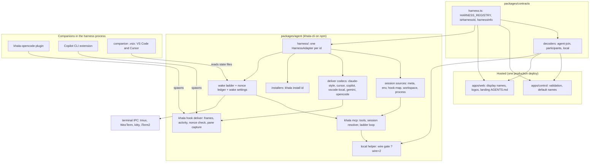
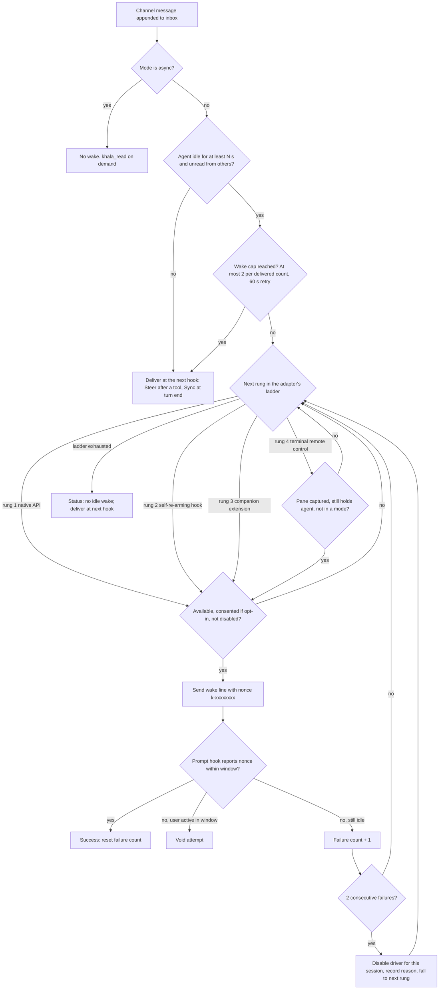
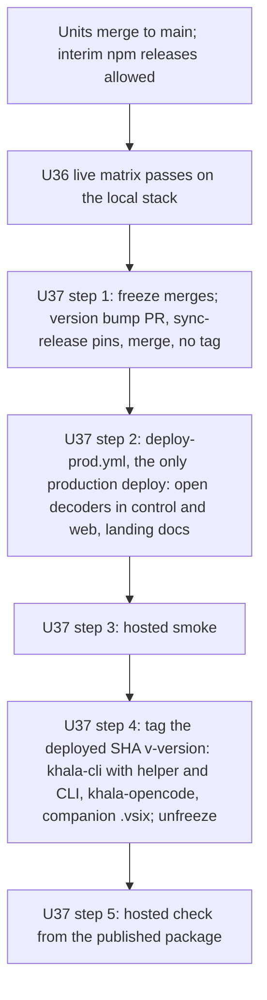
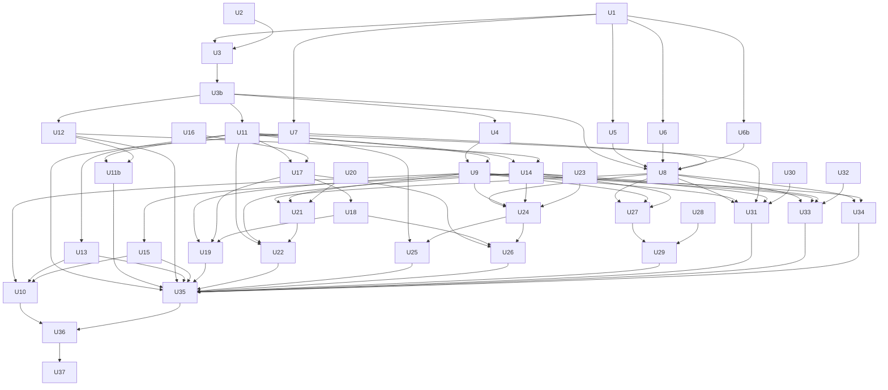

# Multi-Harness Parity - Plan

## Goal Capsule

- **Objective:** every supported agent harness gets every Khala feature, and Khala adds Muse Code, Gemini CLI with Qwen Code, OpenCode, GitHub Copilot (CLI and VS Code), and a generic any-MCP-client tier.
- **Product authority:** the operator, in this session's brainstorm dialogue of 2026-10-05.
- **Open blockers:** none for creating tickets. The Planning Contract answers Q1–Q5. The operator decisions in Open Questions (review) items 1 to 7 must be settled before the units they name start: U14 and U15 (item 3), U25 (item 6), U27 (item 5), U28 and U29 (item 2), and U36 and U37 (items 1 and 7). Unverified research is fenced behind spike units (U16, U20, U23, U28, U30, U32), and each spike names the fallback its build unit takes if it fails.
- **Scope addition:** Antigravity CLI is added next to Gemini CLI. See Scope Additions under the Planning Contract.
- **Authority order:** the Product Contract and KD1–KD4 come first, then the Planning Contract KTDs, then each unit's Approach. A unit that conflicts with a KTD stops and escalates. It does not improvise.
- **Execution profile:** 40 units, each sized for one PR (complexity 1–3). 32 are Codex worker tickets. The six spikes (U16, U20, U23, U28, U30, U32), U36 and U37 need GUI sessions, accounts or deploy rights, so the operator or Executor runs them (the "Runs as" column). Run them in the parallel waves under Sequencing. Spikes are time-boxed to about an hour of hands-on work and write their evidence to `docs/build/multi-harness/spikes/`.
- **Stop conditions:**
  - Stop if a change would wrap or launch an agent, inject OS keystrokes or steal focus (KD1).
  - Stop if a change would edit a frozen compat copy other than `local-decoder.main.frozen.ts` in U1.
  - Stop if a change would alter the four hash-pinned Claude plugin files. The only exception is `sync-release.mjs` inside a `chore(release)` version-bump PR, whether an interim release or U37.
  - Stop if a change would need a second production deploy (R14).
- **Tail ownership:** each unit owns its tests, its docs line, and a draft PR with self-review. U36 owns the live evidence, and U37 owns the release and the single production deploy.

---

## Product Contract

### Summary

Khala works the same in every supported agent. Every harness can:
- join hosted and local channels;
- read and send messages;
- know its own name (`you=`) and survive renames;
- rejoin as the same member;
- run in Steer, Sync and Async;
- be woken from idle.

Khala reaches each agent from the side. Users install once and keep starting and using their agent exactly as they do today.

### Problem Frame

Khala supports three harnesses today, and they don't all behave the same: Cursor can't wake an idle chat, and Codex's idle wake relies on an unsupported command. Users of other popular agents (Gemini CLI, OpenCode with Kimi, DeepSeek or local models, GitHub Copilot, Meta's Muse Code) can't join at all. A friend on Windows with Cursor recently found this out. Harness knowledge is scattered across switch statements in contracts, the control plane, the CLI, the hooks and the web app. Each new harness therefore means editing many places, with no guarantee it gets every feature.

### Actors

- **A1 Agent user:** a person using one of the supported agents who joins a Khala channel through their agent.
- **A2 Channel owner:** a human who invites and confirms agents and sets their listening modes from the web app.
- **A3 Khala maintainers:** they add the next harness.

### Key Flows

- **F1 Install once:** A1 runs one install step for their agent (`khala install <agent>`, a plugin install, or an extension install). Nothing about how they start or use the agent changes afterwards.
- **F2 Join from a link:** A1 gives their agent a join link. If the agent lacks Khala tools, the join page tells it how to install. The agent joins, and A2 confirms hosted joins.
- **F3 Receive while working:** in Steer the agent sees new messages after a tool call; in Sync it sees them at turn end.
- **F4 Receive while idle:** in Steer or Sync, an idle agent starts a turn on its own when a message arrives. In Async nothing is injected.

### Requirements

**Feature parity**
- R1. Every supported harness supports join (hosted and local), read, send, `you=` self-name, rename awareness, rejoin as the same member, and all three listening modes.
- R2. Every supported harness wakes from idle in Steer and Sync, without user action, in the user's existing session.
- R3. Cursor gains idle wake. Codex's idle wake stays working and has a fallback that doesn't depend on unsupported behaviour where a supported path exists.
- R4. The generic any-MCP-client tier provides join, read, send and `you=` in Async. It is documented as the fallback for harnesses without a first-class adapter.

**New harnesses**
- R5. Add Muse Code (Meta), Gemini CLI, Qwen Code, OpenCode, GitHub Copilot CLI, and GitHub Copilot in VS Code as first-class harnesses.
- R6. Agent names, roster labels and logos identify each harness, e.g. `alice-Gemini` and `alice-OpenCode`.
- R7. OpenCode support covers any model OpenCode runs, including Kimi, DeepSeek and local models, with no per-model work.

**User experience constraint**
- R8. Users start and use their agent exactly as before. Khala never wraps, launches or replaces the agent, and never steals keyboard focus or injects OS keystrokes.
- R9. Installation is one step per harness, uses that harness's idiomatic channel (plugin, extension, config), and can be undone with an uninstall.

**Structure and proof**
- R10. Each harness is defined in one place (an adapter). Adding a harness never requires editing scattered switch statements.
- R11. A shared conformance suite exercises every harness adapter against every feature in R1–R2. A harness ships only when it passes.
- R12. Each harness also passes a live end-to-end run on the local stack, covering every mode including idle wake, before the production deploy.
- R13. `AGENTS.md`, the join-page instructions and `llms.txt` list every supported harness with its install step. Agents in unsupported harnesses are pointed to the generic tier.

**Release**
- R14. CLI and plugin changes ship through npm releases. Hosted changes, such as the control plane accepting new harness names and the web logos, ship in one batched production deploy, because only 2 production deploys remain this cycle.

### Acceptance Examples

- AE1. A Gemini CLI user sitting at an idle prompt in Sync gets a channel message, and the session starts a turn and replies. The user never ran anything except `gemini`. (Covers R2, R8.)
- AE2. Cursor with the chat idle and the window unfocused behind another app gets a Steer-mode message, and the same chat starts a turn. Focus doesn't move. (R3, R8.)
- AE3. An OpenCode user running a Kimi model joins from a link, is renamed by the owner, and the next frame says `you="<new name>"`. (R1, R7.)
- AE4. A new harness adapter that implements Sync but not idle wake fails the conformance suite. (R11.)

### Success Criteria

- Every harness listed in R5, plus Claude Code, Codex and Cursor, shows all features in the conformance report and the live e2e evidence.
- No user-visible change in how any agent is started.
- Adding a harness touches one adapter, its install step, its docs entry and a logo.

### Scope Boundaries

- Out: wrapping or launching agents (`khala run`), Khala-hosted agent sessions (ACP client mode), OS-level keystroke or focus injection.
- Out: Cline, Kiro, Windsurf/Devin, Zed, Goose, Amp and other harnesses beyond R5. They get the generic tier (R4) until promoted.
- Deferred: a public HTTP agent API for custom bots that call model APIs directly.

### Key Decisions

- **KD1 Side-channel nudges only** (session-settled, operator): "the user experience of using their agent CANNOT change. khala must nudge agents, not be the thing the user has to know about or open the agent through".
- **KD2 Build workarounds for parity** (session-settled, operator): where a harness lacks a native path, build a companion mechanism instead of shipping a gap.
- **KD3 Adapter plus conformance suite** (agent recommendation, accepted at scope confirmation): one adapter per harness, proven by a shared suite.
- **KD4 Harness set** (session-settled, operator): Muse Code, Gemini CLI plus Qwen Code, OpenCode, and GitHub Copilot CLI plus VS Code.

### Dependencies / Assumptions

- "Muse" means Meta's Muse Code. The landscape research gave this about 85% confidence, and the operator selected it by that name.
- Research findings (dossiers under `docs/build/multi-harness/research/`):
  - OpenCode can start a turn in an existing session from a plugin, using its HTTP API.
  - Gemini CLI hooks support Steer and Sync but have no native idle wake.
  - Cursor has no documented no-click idle wake. A companion editor extension is the leading candidate.
  - Claude Code's rewake is armed only after a Stop and lasts about 50 minutes.
  - No MCP-spec mechanism lets a server start a host turn.
- Several research claims are marked UNVERIFIED in the dossiers (Muse hook injection, some Gemini and OpenCode details). Planning verifies them before committing ticket designs.

### Outstanding Questions

- Q1. **Idle-wake mechanism per harness**, chosen within KD1. The candidates, in ladder order:
  1. a native API;
  2. a hook that re-arms itself without blocking user input;
  3. a companion editor extension;
  4. terminal remote control (tmux, kitty, wezterm) when the agent already runs inside one.

  Planning picks one per harness and records any harness where none works.
- Q2. Claude Code idle wake after the rewake window lapses (about 50 minutes idle): re-arm strategy, or use Claude's channels feature.
- Q3. Cursor and VS Code Copilot: whether one companion extension can serve both editors.
- Q4. Per-harness session identity for harnesses whose MCP server can't see a session id: use a hook-written mapping, or a plugin-provided id.
- Q5. Whether the hosted control plane can accept unknown harness names generically, to avoid future production deploys per harness.

---

## Planning Contract

Product Contract preservation: the Product Contract above is unchanged from the brainstorm, and the Planning Contract answers its Outstanding Questions and records one scope addition.

### Summary

Every agent-side harness branch moves behind one adapter per harness in `packages/agent/src/harness/`. A data-only registry in `@khala/contracts` supplies names, logos and capabilities. The hosted control plane, the local helper and the web app accept any well-formed harness id and fall back to safe names. Idle wake becomes a ladder of rungs per harness: a native API, then a self-re-arming hook, then a companion editor extension, then terminal remote control. Each wake is verified by a nonce, and a driver that fails twice turns itself off. A shared conformance suite gates every adapter. Ten harnesses are first-class: Claude Code, Codex, Cursor, OpenCode, Copilot CLI, Copilot in VS Code, Gemini CLI, Antigravity CLI, Qwen Code and Muse Code. Any other MCP client gets the generic tier. Hosted changes ship in one production deploy after a live matrix on the local stack.

### Problem Frame Recap

Harness knowledge sits in closed lists and switch statements across contracts, control, CLI, hooks and web (`docs/build/multi-harness/research/repo-design.md` §1). A new id breaks strict decoders, so even one more harness costs a production deploy, and only two remain this cycle. Idle wake works natively only in Claude Code, and only for about 50 minutes, because of Khala's own 3000 s watcher deadline, not a Claude Code limit (`idle-wake.md` §1). The Product Contract's "about 50 minutes" refers to this deadline. Codex depends on an undocumented command, and Cursor has no wake at all. For most of the requested harnesses, research found no supported path for an outside process to start a turn in the user's open session.

### Scope Additions

- **Antigravity CLI** joins the harness set next to Gemini CLI (added by Executor from research; operator informed). Gemini CLI stopped serving consumer tiers on 2026-06-18, and those users moved to Google's Antigravity CLI (`agy`) (`idle-wake.md` §3; the source is a third-party issue plus press coverage, not Google docs). Gemini CLI stays a first-class harness for Enterprise and API-key users. Paid consumer plans count as consumer tiers. Antigravity's contract is unresearched, so spike U28 runs before its adapter U29.
- **Qwen Code native wake.** Qwen Code has a documented messaging socket that is on by default (`QWEN_CODE_MESSAGING_SOCKET` and `QWEN_CODE_MESSAGING_TOKEN`). That makes it a rung-1 native wake rather than a Gemini-fork terminal fallback (`idle-wake.md` §3). Spike U30 live-tests it before U31 builds on it.

### Resolved Product Questions

| Question | Resolution | Where |
|---|---|---|
| Q1 Idle-wake mechanism per harness | One rung per harness from the ladder, with the gaps recorded | KTD7, KTD8, Wake Ladder table |
| Q2 Claude Code after the 50-minute window | Raise the watcher deadline to 24 h and keep Stop re-arming. Defer channels and the SessionStart arm | KTD11, U12 |
| Q3 One companion for Cursor and VS Code | Yes. One `.vsix` on Marketplace and Open VSX, plus a `khala install` sideload | KTD12, U17–U19, U26 |
| Q4 Session identity without a session id in MCP | Each adapter declares an ordered list of session sources: `meta`, `env`, `hook-map`, `workspace` and `process` | KTD5, Session Identity table, U4 |
| Q5 Generic hosted acceptance | Yes. An open id pattern plus registry fallbacks, with a wire gate for older local CLIs | KTD1, KTD3, U5, U6, U8 |

### Key Technical Decisions

- KTD1. **Data-only harness registry with an open id pattern.**
  - `packages/contracts/src/m1/harness.ts` holds `HARNESS_REGISTRY`, `HARNESS_ID = /^[a-z][a-z0-9-]{1,23}$/` and `harnessInfo(id)`.
  - Unknown ids get a title-cased display name, model name `Agent`, no logo and no capabilities.
  - Rationale: one deploy then covers every future harness (Q5).
  - The agent-supplied join `label` is never used as a display name. It is ignored today, and using it would let an agent pose as another harness (`repo-design.md` §2).
- KTD2. **One agent-side adapter per harness** (session-settled: user-approved — chosen over editing the existing switch statements per harness: KD3, one adapter plus a conformance suite proves parity).
  - Each `HarnessAdapter` in `packages/agent/src/harness/<id>.ts` declares its session sources, deliver codec, installer, wake ladder and rejoinability.
  - Existing argv stays stable: `hook deliver --harness claude|codex|cursor`, `hook claude-wake`, `install codex|cursor` and `mcp --harness claude`. Installed hosts and the hash-pinned Claude plugin call these (`repo-design.md` §5.1–5.2).
- KTD3. **Local helper wire gate.**
  - By default the helper emits `harness` only for `claude`, `codex` and `cursor`, and omits the field for other ids. Requests carrying the query parameter `wire=2` get the real id. This follows the existing `prev=1` opt-in on `/events` (`packages/agent/src/local/routes/rooms.ts:138`), and is one of the two options `repo-design.md` §2.6 names. No new request header is introduced.
  - `prev=1` alone never unlocks new ids. Released `khala-cli` 0.4.1 and 0.4.2 already send `prev=1` (`packages/agent/src/local/session.ts:169`) and still decode `harness` with the closed three-id `readHarness` (`packages/contracts/src/m1/local.ts:228,487,505`).
  - Rationale: one helper serves every CLI version, and an old CLI that rejects an `/events` page retries forever (`repo-design.md` §2.6).
  - Two frozen local decoders guard this, and both get their three-id literal inlined before any decoder widens:
    - the existing pre-#1078 copy;
    - a new copy of today's `local.ts`, which is what 0.4.x CLIs ship. U1 adds it.
- KTD4. **Version skew heals or explains itself.**
  - The CLI probes the helper version (`/healthz` already returns it) and restarts an older helper, at most once per CLI process (U6b).
  - A local `invalid_harness` triggers one restart and a retry.
  - A hosted `invalid_harness` becomes `update_required`, with text naming the harness and saying local channels work now.
- KTD5. **Ordered session sources** (`meta`, `env`, `hook-map`, `workspace`, `process`).
  - Each source declares whether it is rejoinable, and `client-impl` reads that instead of the `cursor-default` special case.
  - In `hook-map`, the first hook of a session writes `.by-pid/<harnessPid>.json`. On each tool call, the MCP child walks its ancestors, nearest first, to that entry and checks the recorded start time against pid reuse.
- KTD6. **Frame rendering stays in the CLI.** The OpenCode plugin spawns `khala hook deliver --harness opencode` and relays its stdout, so frame, cursor, ack and mode logic cannot drift (`opencode-verified.md` Q6). The Copilot extension and the companion send only the U11 fixed wake line, and frames then arrive through hooks.
- KTD7. **Idle-wake ladder** (session-settled: user-directed — chosen over wrapping or launching the agent (`khala run`) and ACP-hosted sessions: KD1 says the user's experience cannot change, and KD2 says build workarounds instead of shipping gaps).
  - Rung 1 is a native API.
  - Rung 2 is a hook that re-arms itself without blocking input.
  - Rung 3 is the companion editor extension.
  - Rung 4 is terminal remote control into the agent's existing pane.
  - The ladder takes the first rung that is available, consented and not disabled. Otherwise it records "no idle wake" and delivers at the next hook.
- KTD8. **Opt-in, nonce-verified, auto-disabling drivers** (Executor-directed planning constraint).
  - Scope: every wake that costs the user money or relies on undocumented commands. That covers the Copilot CLI extension and the VS Code companion (both spend premium requests), the Cursor companion (undocumented commands) and terminal remote control.
  - Opt-in: these drivers are off until `khala install <harness> --wake` or `khala wake on --driver <d>` records consent. That is a one-time setting, so R2's "without user action" holds afterwards.
  - Nonce: every wake line carries a Khala-generated nonce. The harness's prompt hook must report it within the window.
  - Auto-disable: two consecutive unverified wakes disable that driver for that session, and status says why. One misconfigured session never turns wake off machine-wide. Consent is machine-wide; disables are per session (U11).
- KTD9. **Codex queue stays on by default.**
  - `codex queue` is undocumented and sits on an `#[experimental]` API. R3 still requires Codex wake to keep working, and no documented path exists (`idle-wake.md` §2).
  - A `codex queue --help` probe gates it, a nonce verifies it, and two failures fall through to the terminal rung if the user opted in.
  - A weekly live CI job checks it against the latest Codex.
- KTD10. **Terminal remote control is opt-in, idle-only and writes one fixed line** (session-settled: user-directed — chosen over OS keystroke injection: KD1 forbids OS keystrokes and focus stealing, while the terminal's own IPC into the agent's existing pane does neither).
  - The line is `Khala: channel messages are waiting. Continue. (k-<nonce>)`. Its only variable part is a Khala-generated `[0-9a-f]{8}` nonce. Channel text never reaches the terminal.
  - Pane variables are captured by a hook, never from `khala mcp`, because Codex strips the MCP child's environment.
  - Before sending, the driver checks that the pane still holds the agent and is not in a mode.
- KTD11. **Claude: a 24-hour watcher deadline, with no plugin-file change.**
  - Claude Code does not enforce the timeout on Stop, so the 3000 s limit is Khala's own (`idle-wake.md` §1).
  - The four hash-pinned plugin files stay byte-identical.
  - The SessionStart asyncRewake arm and Claude channels are deferred.
- KTD12. **One companion `.vsix` for VS Code and Cursor.**
  - It reads Khala state files only: no new port, no clipboard and no OS focus.
  - It submits through `workbench.action.chat.open` in VS Code, and through U16's allowlisted command sequence in Cursor.
- KTD13. **Installers write documented user config files directly**, following `packages/agent/src/install/cursor.ts`.
  - Each install merges into the harness's config, is idempotent, and has an uninstall that removes only Khala's keys.
  - Interactive harness CLIs (`opencode mcp add`, `gemini mcp add`) are not used.
  - The OpenCode plugin is installed as an exact pinned spec, and the companion through `code` or `cursor --install-extension`.
- KTD14. **Release train with exactly one production deploy** (session-settled: user-directed — chosen over a deploy per harness: R14, only two production deploys remain this cycle).
  - Interim npm releases are free and may ship at any time. They deliberately ship the helper and CLI ahead of control and web, which departs from the §5.4 order. That is safe through `repo-design.md` §2.7: the not-yet-deployed hosted control rejects new ids with `invalid_harness`, which U6b turns into `update_required`. The helper in the same package already carries the wire gate.
  - An interim release runs `sync-release.mjs`, which appends a plugin hash. That is the only sanctioned change to the hash-pinned plugin files before U37.
  - The single production deploy runs after the U36 live matrix and follows the `repo-design.md` §5.4 order:
    1. decoders, carried inside control and web;
    2. control and web (`deploy-prod.yml`);
    3. the helper;
    4. the CLI. Steps 3 and 4 publish together in the `khala-cli` release tagged after the deploy.
  - Control is never rolled back once new-id records exist, because `store.ts:41` would null them.
- KTD15. **A spike precedes every build that rests on unverified research.**
  - The spikes are U16 (editor submit commands), U20 (OpenCode open questions), U23 (Copilot `joinSession` idle start), U28 (Antigravity), U30 (Qwen socket) and U32 (Muse hooks).
  - Each has pass criteria and a named fallback, so its build unit never blocks on an open question.
- KTD16. **Name hygiene.**
  - Registry model names are at most 12 characters, so `<24-char username>-<model>-NN` fits `AGENT_NAME_MAX` = 40.
  - Reserved username suffixes come from the registry's known model names, excluding the generic `Agent`. The open id pattern is never used for this, because it would block ordinary usernames.
  - New suffixes are checked only when a username is chosen or changed (`checkNewUsername`, U5). `checkName` also runs inside decoders, so it keeps today's three suffixes.
- KTD17. **Generic tier.** The Product Contract's Scope Boundaries send Cline, Kiro, Zed and other harnesses to this tier (R4) until they are promoted.
  - It covers `--harness generic` and any well-formed `--harness <id>` without an adapter.
  - It runs in Async only. Its session id comes from `KHALA_SESSION_ID`, else the process.
  - Display names follow `harnessInfo`, so `--harness cline` shows "Cline".

### High-Level Technical Design

#### Components

#### Idle-wake decision flow

#### Harness Registry

Display names, model names and logo keys are frozen for the production deploy. Capabilities are read only by the agent side, so an npm release may update them without a deploy.

| id | displayName | modelName | logoKey | steer | sync | idleWake at registration |
|---|---|---|---|---|---|---|
| `claude` | Claude Code | Claude | `claude` | yes | yes | default |
| `codex` | Codex | Codex | `codex` | yes | yes | default |
| `cursor` | Cursor | Cursor | `cursor` | yes | yes | none, flipped to opt-in by U19 |
| `opencode` | OpenCode | OpenCode | `opencode` | yes | yes | default |
| `copilot` | Copilot CLI | Copilot | `copilot` | yes | yes | opt-in |
| `vscode` | Copilot (VS Code) | VSCode | `vscode` | yes | yes | opt-in |
| `gemini` | Gemini CLI | Gemini | `gemini` | yes | yes | opt-in |
| `antigravity` | Antigravity CLI | Antigravity | `antigravity` | set by U29 | set by U29 | set by U29 |
| `qwen` | Qwen Code | Qwen | `qwen` | yes | yes | default |
| `muse` | Muse Code | Muse | `muse` | set by U33 | set by U33 | set by U33 |
| `generic` | MCP agent | Agent | none | no | no | none |

#### Wake Ladder per Harness (answers Q1)

| Harness | Primary rung | Default | Fallback | Recorded gap |
|---|---|---|---|---|
| Claude Code | 2: asyncRewake Stop watcher, 24 h | on | 4: terminal, opt-in | a fresh or `--continue` session before its first Stop |
| Codex | 1: `codex queue --thread` via the shared daemon | on | 4: terminal, opt-in | TUIs started with `--no-daemon` |
| Cursor | 3: companion with allowlisted submit commands | opt-in | none | Cursor versions off the allowlist; a focused window if U16 shows in-window focus movement; none at all if U16 fails |
| OpenCode | 1: plugin `client.session.promptAsync` | on | 4: terminal, opt-in, only if U20(c) fails | none expected |
| Copilot CLI | 1: CLI extension `joinSession` + `session.send` | opt-in | 4: terminal, opt-in | rung 1 dropped if U23 fails |
| Copilot in VS Code | 3: companion `workbench.action.chat.open` | opt-in | none | several chats open: the last-used chat receives the line, and the nonce cannot tell chats in one workspace apart; a focused window if U16 shows in-window focus movement |
| Gemini CLI | 4: terminal | opt-in | none | Windows; Windows Terminal, GNOME Terminal, Alacritty, macOS Terminal.app, editor-integrated terminals and other terminals without remote control |
| Antigravity CLI | set by U28; 4: terminal unless U28 finds a native path | opt-in | none | as Gemini CLI unless U28 finds more |
| Qwen Code | 1: native messaging socket | on | 4: terminal, opt-in | Windows (Unix socket); users who set `agents.crossSessionMessaging: false` or `crossSessionInbound: refuse`; `crossSessionInbound: hold` per U30 item 4 |
| Muse Code | 1: peer session messaging, if U32 finds an outside sender | set by U33 | 4: terminal, opt-in | Windows, where session messaging is unavailable; until the user approves Khala as a peer, messages are parked or notify-only (`muse.md` §4) |
| Generic tier | none | none | none | by design (R4) |

#### Session Identity per Harness (answers Q4)

| Harness | Sources in order | Rejoinable |
|---|---|---|
| Claude Code | `env` `CLAUDE_CODE_SESSION_ID` | yes |
| Codex | `meta` `threadId`, then `env` `CODEX_THREAD_ID` | yes |
| Cursor | `workspace` `KHALA_CURSOR_WORKSPACE` | yes; `cursor-default` is not |
| OpenCode | `meta` plugin-stamped `khala_session` arg if U20(b) passes, then `hook-map` written by `hook deliver` when the plugin spawns it | yes |
| Copilot CLI | `hook-map` from `sessionStart` | yes |
| Copilot in VS Code | `workspace` `KHALA_VSCODE_WORKSPACE` from the companion's MCP definition | yes, one identity per workspace |
| Gemini CLI | `env` `GEMINI_SESSION_ID` if present, then `hook-map` | yes |
| Antigravity CLI | per U28, default `hook-map` | yes |
| Qwen Code | `hook-map` | yes |
| Muse Code | `env` `MUSE_SESSION_ID` if U32 item 4 passes, then `hook-map` | yes |
| Generic tier | `env` `KHALA_SESSION_ID`, then `process` | only with `KHALA_SESSION_ID` |

#### Release and Deploy Order

### Sequencing

Units in the same wave can run in parallel:

| Wave | Units | Note |
|---|---|---|
| 1 | U1, U2, U16, U20, U23, U28, U30, U32 | The six spikes need local harness installs and accounts, so the operator or Executor starts them first |
| 2 | U3, U5, U6, U6b, U7 | |
| 3 | U3b | |
| 4 | U4, U8, U11, U12 | |
| 5 | U9, U11b, U13, U14, U17 | |
| 6 | U15, U18, U21, U24, U27, U31, U33, U34 | |
| 7 | U10, U19, U22, U25, U26, U29 | |
| 8 | U35 | |
| 9 | U36 | Operator or Executor |
| 10 | U37 | Operator or Executor |

**Critical path:** U1 → U3 → U3b → U11 → U14 → U27 → U29 → U35 → U36 → U37. U2 must finish beside U1. U11 → U9 → U21 → U22 and U11 → U17 → U18 → U26 are equal-length branches. Spike U28 (Antigravity) must finish by wave 7, so it is the likeliest critical-path slip.

**Shared-file hot spots:** rebase rather than resolve by hand.
- Adapter units each add one line to `packages/agent/src/harness/index.ts`, one entry to `packages/agent/src/harness/conformance/drivers/index.ts` and one usage string in `packages/agent/src/cli.ts`.
- `packages/contracts/src/m1/harness.ts` is edited by U7 (logo keys), U19, U29 and U33 (capabilities).
- `packages/agent/src/harness/codex.ts` is edited by U13 and U14 in the same wave.
- `apps/web/src/composition/local/fake-local-helper.ts` is edited by U5, U6 and U7, and `packages/agent/src/local/routes/profile.ts` by U5 and U6, all in wave 2.
- `packages/agent/src/harness/deliver-core.ts` is edited by U4, U11, U14 and U17.
- `packages/agent/scripts/build-package.mjs` and `smoke-package.mjs` are edited by U15, U18 and U25.
- `.github/workflows/release-npm.yml` is edited by U18 and U22, and `packages/agent/scripts/sync-release.mjs` by U22 and U35. Merge each pair in sequence.

### Risks

| Risk | Mitigation | Units |
|---|---|---|
| `codex queue` regresses or disappears; it is undocumented and experimental | Probe gate, nonce verification, terminal fallback, weekly live CI | U13 |
| Cursor's undocumented submit commands change between versions | Version allowlist, `getCommands` probe, nonce, auto-disable, status reason | U16, U19 |
| `workbench.action.chat.open` options are internal; the last-used chat may not be the Khala-bound one | Opt-in only; recorded as a gap. The nonce cannot catch it, because every chat in a workspace shares one session (see Open Questions (review)) | U17, U26 |
| A companion submit moves keyboard focus inside a focused editor window (KD1) | U16 tests in-window focus; the companion submits only while the window is unfocused if focus moves | U16, U17, U19 |
| An older pinned CLI respawns its own helper over state a newer helper wrote, skips new-id member events and reuses their `seq` | Non-legacy `harness` lives in a `harness.json` sidecar, never in `log.jsonl`; frozen 0.4.x `decodeLocalEvent` test | U6 |
| Older CLIs go silent on `/events` pages with new ids | `wire=2` query gate separate from `prev=1`, both frozen decoders (pre-#1078 and 0.4.x) inlined first, wire-compat tests | U1, U6, U8 |
| Control rollback after new-id records exist nulls them (`store.ts:41`) | Deploy only after U36; forward-fix only | U37 |
| Terminal line lands in a shell after the agent exits | Pane-holds-agent check, fixed line, idle-only, opt-in | U14, U15 |
| Wakes spend Copilot premium requests | Opt-in, 2 wakes per batch, auto-disable | U25, U26 |
| Muse hook contract is behind SSO | Spike with a logging hook on a local install; capability-driven fallback | U32, U33 |
| Antigravity contract is unresearched | Spike first; Async-only fallback | U28, U29 |
| `hook-map` ambiguity: several sessions per process, pid reuse | Start-time check, latest active session wins, "send a message first" error | U4 |
| Reserving new suffixes such as `-Gemini` affects usernames, and a stricter decode check would silence CLIs | Reserve only through `checkNewUsername` at change sites; `checkName` and every decoder stay unchanged | U5 |
| New publishing surfaces need accounts: `khala-opencode` on npm, Marketplace, Open VSX. npm trusted publishing needs an existing package | Operator hand-publishes a `khala-opencode` placeholder before U22 merges; publish steps skip with a warning when a secret or publisher is missing; sideload works without the marketplaces | U18, U22, U37 |
| Production deploy budget: one of two left is spent here | One deploy, run only after U36 passes; merge freeze; hosted smoke before tagging the deployed SHA | U37 |
| One misconfigured session (for example Codex `--no-daemon`) auto-disables a default-on driver for everyone | Failures and disables are per session; consent is machine-wide | U11, U13 |

### Assumptions

- The per-session state layout `<stateRoot>/<harness>/<sessionId>/` works for every new harness. Ids are already path-safe (`repo-design.md` §2).
- Each CLI harness spawns `khala mcp` as a descendant of the harness process, and its hooks run as descendants of the same process. VS Code is the exception, so it uses the `workspace` source.
- Versions researched: Claude Code 2.1.289, Codex rust-v0.160.0, Gemini CLI v0.62.0, Qwen Code v0.25.0, Copilot CLI 1.0.91, Muse Code 1.4.1 or later.
- The operator provides accounts for the live matrix: Copilot, a Gemini API key or Enterprise account, Antigravity, Qwen, Muse (Meta SSO), Cursor, and an OpenCode provider with a Kimi model.
- A Linux machine with tmux, WezTerm and kitty, a macOS machine with iTerm2, and a Windows machine are available for U36.
- Before U22 merges, the operator hand-publishes a placeholder `khala-opencode` and configures its npm trusted publisher (`packages/agent/docs/releasing.md`: a trusted publisher needs an existing package). Before U37, the operator creates the `khala` publisher on the VS Code Marketplace and Open VSX and sets `VSCE_PAT` and `OVSX_PAT`.
- No other production deploy from `main` happens between the first merged unit and U37. Any deploy would carry partly-opened decoders, and control could not then be rolled back (`store.ts:41`).

### Deferred to Follow-Up Work

- Claude SessionStart asyncRewake arm, which would cover sessions before their first Stop. Claude Code issue #89960 reports it stalls the first reply in `-p` and desktop hosts, and it would change hash-pinned plugin files.
- Claude channels as an opt-in upgrade for users who already launch with `--channels`.
- A Codex app-server `turn/start` fallback over the daemon socket.
- Terminal wake on terminals without a remote-control API (Windows Terminal, GNOME Terminal, Alacritty).
- Packaging Gemini, Antigravity and Qwen as harness extensions instead of a `settings.json` merge.
- An OS notification when a wake driver auto-disables.
- Generating the per-harness docs table from registry capabilities.
- Kilo Code through the OpenCode plugin; promoting Cline, Factory Droid and Augment from the generic tier.
- Muse idle wake on Windows.

---

## Implementation Units

Every unit honours two hard constraints:
- **KD1:** no wrapping or launching agents, no OS keystroke injection, no focus stealing (OS focus or keyboard focus inside an editor window). Terminal IPC sends only the U11 fixed line, idle-only, for users who opted in. No unit changes how a user starts their agent.
- **R14 and KTD14:** no unit triggers a production deploy except U37.

Paths are repo-relative. A harness's conformance driver is registered by the unit that completes its last R1–R2 feature, and from then on Tier A gates it.

| U-ID | Title | Files touched | Depends on | Runs as |
|---|---|---|---|---|
| U1 | Freeze local decoders; harness registry | `packages/contracts/src/m1/harness.ts`, `packages/agent/src/compat/local-decoder.{main,0-4}.frozen.ts` | none | Codex |
| U2 | Characterization tests: claude, codex, cursor | `packages/agent/src/harness/characterization.test.ts` | none | Codex |
| U3 | Adapter interface and registry; migrate session, wiring, argv, installs | `packages/agent/src/harness/*`, `packages/agent/src/mcp/{session-id,wiring}.ts`, `client-impl.ts`, `install/main.ts` | U1, U2 | Codex |
| U3b | Deliver codecs; migrate hook entry points | `packages/agent/src/harness/{deliver-core,codecs/*}.ts`, `packages/agent/hooks/deliver.ts` | U3 | Codex |
| U4 | Session sources: hook-map and process | `packages/agent/src/harness/session-sources.ts`, `proc.ts` | U3b | Codex |
| U5 | Control plane: registry validation and names | `apps/control/src/agent-join/*`, `packages/contracts/src/m1/names.ts`, username change sites | U1 | Codex |
| U6 | Helper wire gate and new-id persistence | `packages/agent/src/local/{store,routes/*,session}.ts`, `apps/web/src/composition/local/*` | U1 | Codex |
| U6b | Helper version probe and update-required errors | `packages/agent/src/local/lifecycle.ts`, `packages/agent/src/join.ts` | U1 | Codex |
| U7 | Web names and logos from registry | `apps/web/src/features/*`, `apps/web/src/ui/khala/identity.ts` | U1 | Codex |
| U8 | Open the decoders | `packages/contracts/src/m1/{agent-join,participants,local}.ts`, `packages/agent/src/state.ts`, `mcp/tools.ts` | U3b, U5, U6, U6b, U7 | Codex |
| U9 | Conformance suite Tier A | `packages/agent/src/harness/conformance/*` | U4, U11 | Codex |
| U10 | Conformance suite Tier B | `packages/agent/src/local/fixtures/e2e-harness.ts`, `conformance.e2e.test.ts` | U9, U13, U15 | Codex |
| U11 | Wake core: ladder, opt-in, nonce, auto-disable | `packages/agent/src/wake/{shared/*,driver,ladder}.ts` | U3b | Codex |
| U11b | `khala wake` command, status fields, install consent | `packages/agent/src/wake/{cli,status}.ts`, `mcp/tools.ts`, `install/main.ts` | U11, U12 | Codex |
| U12 | Claude 24-hour wake deadline and watcher state | `packages/agent/hooks/claude-wake.ts` | U3b | Codex |
| U13 | Codex queue probe, nonce, live CI | `packages/agent/src/wake/codex.ts`, `.github/workflows/codex-queue-live.yml` | U11 | Codex |
| U14 | Terminal wake: capture, tmux, WezTerm | `packages/agent/src/wake/terminal/*` | U11, U12 | Codex |
| U15 | Terminal wake: kitty, iTerm2 | `packages/agent/src/wake/terminal/{kitty,iterm2}.ts`, `scripts/build-package.mjs` | U14 | Codex |
| U16 | Spike: editor submit commands | `docs/build/multi-harness/spikes/editor-submit.md` | none | Operator or Executor |
| U17 | Companion editor extension core | `packages/companion-vscode/*`, `packages/agent/src/harness/deliver-core.ts` | U11, U16 | Codex |
| U18 | Companion publishing and sideload | `.github/workflows/release-npm.yml`, `packages/agent/src/install/companion.ts` | U17 | Codex |
| U19 | Cursor idle wake through the companion | `packages/companion-vscode/src/cursor.ts`, `packages/agent/src/harness/cursor.ts` | U9, U17, U18 | Codex |
| U20 | Spike: OpenCode open questions | `docs/build/multi-harness/spikes/opencode.md` | none | Operator or Executor |
| U21 | OpenCode CLI adapter and installer | `packages/agent/src/harness/opencode.ts`, `install/opencode.ts` | U8, U9, U20 | Codex |
| U22 | `khala-opencode` npm plugin | `packages/opencode-plugin/*` | U11, U14, U21 | Codex, after an operator prerequisite |
| U23 | Spike: Copilot extension wake and VS Code hooks | `docs/build/multi-harness/spikes/copilot.md` | none | Operator or Executor |
| U24 | Copilot CLI adapter, hooks, installer | `packages/agent/src/harness/copilot.ts`, `install/copilot.ts` | U8, U9, U14, U23 | Codex |
| U25 | Copilot CLI extension wake | `packages/agent/src/copilot-extension/extension.ts`, `scripts/build-package.mjs` | U11, U24 | Codex |
| U26 | VS Code Copilot adapter | `packages/agent/src/harness/vscode.ts`, `packages/companion-vscode/src/mcp.ts` | U17, U18, U24 | Codex |
| U27 | Gemini CLI adapter | `packages/agent/src/harness/gemini.ts`, `install/gemini.ts` | U8, U9, U14 | Codex |
| U28 | Spike: Antigravity CLI contract | `docs/build/multi-harness/spikes/antigravity.md` | none | Operator or Executor |
| U29 | Antigravity CLI adapter | `packages/agent/src/harness/antigravity.ts` | U27, U28 | Codex |
| U30 | Spike: Qwen messaging socket | `docs/build/multi-harness/spikes/qwen.md` | none | Operator or Executor |
| U31 | Qwen Code adapter and socket waker | `packages/agent/src/harness/qwen.ts`, `wake/qwen-socket.ts` | U8, U9, U11, U14, U30 | Codex |
| U32 | Spike: Muse Code contract | `docs/build/multi-harness/spikes/muse.md` | none | Operator or Executor |
| U33 | Muse Code adapter | `packages/agent/src/harness/muse.ts`, `install/muse.ts` | U8, U9, U14, U32 | Codex |
| U34 | Generic MCP tier | `packages/agent/src/harness/generic.ts`, `install/mcp.ts` | U8, U9 | Codex |
| U35 | Docs and landing harness list | `apps/web/src/landing/public/AGENTS.md`, `docs/settings.md`, `packages/agent/docs/*` | U7, U11b, U12, U13, U15, U19, U22, U25, U26, U29, U31, U33, U34 | Codex |
| U36 | Live end-to-end matrix with evidence | `docs/evidence/multi-harness/*` | U10, U35 | Operator or Executor |
| U37 | Release and the one production deploy | `packages/agent/npm/package.json`, release workflows | U36 | Operator or Executor |

### U1. Freeze the local decoder and add the harness registry

- **Goal:** pin the frozen local decoder to its three ids, freeze the decoder that released 0.4.x CLIs ship, then add a data-only harness registry with an open id pattern and fallbacks.
- **Requirements:** R6, R10, R14; answers Q5.
- **Dependencies:** none.
- **Complexity:** 2.
- **Files:**
  - `packages/agent/src/compat/local-decoder.main.frozen.ts`
  - `packages/agent/src/compat/local-decoder.0-4.frozen.ts` (new)
  - `packages/agent/src/compat/wire-compat.test.ts`
  - `packages/contracts/src/m1/harness.ts` (new)
  - `packages/contracts/src/m1/harness.test.ts` (new)
- **Approach:**
  - Commit 1 replaces the live `readHarness` import at `local-decoder.main.frozen.ts:6` with an inlined literal of `claude`, `codex` and `cursor`. This is the only sanctioned edit to an existing frozen copy (`repo-design.md` §5.3).
  - Commit 1 also adds `local-decoder.0-4.frozen.ts`:
    - It is a verbatim copy of today's `packages/contracts/src/m1/local.ts` at `825b365d`, which is what `khala-cli` 0.4.1 and 0.4.2 ship.
    - Use the existing frozen copy's header comment as the template, naming `825b365d` and 0.4.2.
    - Replace its `readHarness` import with the same inlined three-id literal.
    - Leave the other imports live.
    - Export at least `decodeLocalEvent` (the helper store's on-disk decoder), `decodeLocalEventsPage`, `decodeLocalHistoryPage`, `decodeLocalMembersResponse` and `decodeLocalChannelSummary`.
  - `packages/contracts/package.json` already exports `./m1/*`, so the new `harness.ts` needs no export change.
    - Those CLIs send `prev=1`, so this copy is the one that guards opted-in pages.
  - Commit 2 adds the following, holding the Harness Registry table's values:
    - `HARNESS_ID`, `type HarnessId` and `isHarnessId`;
    - `LEGACY_HARNESSES`;
    - `HARNESS_REGISTRY`;
    - `harnessInfo(id)`.
  - Leave `readHarness`, `HARNESSES`, `MODEL_NAMES` and every consumer unchanged. U8 opens the decoders.
- **Patterns to follow:** `experiments/ownership/src/binding.ts:63` (id pattern); `packages/contracts/src/m1/listening-mode.ts` (small data module with its test).
- **Test scenarios:**
  - Both frozen decoders reject an `/events` member whose `harness` is `gemini`. These tests must keep passing after U8.
  - The 0.4.x frozen decoder accepts a `prev=1` page that the helper serves today, and accepts a page from the existing `wire-compat.test.ts` transitions run with `prev=1`.
  - `isHarnessId` accepts `opencode` and `copilot-x`. It rejects `A`, `x`, `9abc`, `-ab`, a 25-character id and `a/../b`.
  - `harnessInfo('gemini')` returns the Gemini row. `harnessInfo('cline')` returns display name `Cline`, model name `Agent`, logo `null` and all capabilities off. `harnessInfo('copilot-x')` has display name `Copilot X`.
  - Every registry model name is at most 12 characters. `<24-char username>-<modelName>-99` passes `validateAgentName` within `AGENT_NAME_MAX`.
  - Registry ids are unique and all match `HARNESS_ID`. `LEGACY_HARNESSES` equals today's `HARNESSES`.
- **Verification:** `pnpm --filter @khala/contracts test`; `pnpm --filter @khala/agent test -- src/compat`; `pnpm typecheck`.

### U2. Characterization tests for claude, codex and cursor

- **Goal:** pin today's observable harness behaviour so U3 and U3b can refactor with no behaviour change.
- **Requirements:** R10, R11.
- **Dependencies:** none.
- **Complexity:** 2.
- **Files:** `packages/agent/src/harness/characterization.test.ts` (new); `packages/agent/src/harness/__golden__/` (new golden JSON and text files).
- **Approach:** drive only public entry points:
  - the hook `deliver` default export with stdin;
  - `resolveHarness` and `resolveSessionId`;
  - waker selection in `src/mcp/wiring.ts`;
  - `install codex` and `install cursor` into a temporary `HOME`;
  - the rejoinable flag in `client-impl`;
  - `runCli` argv parsing.

  Record exact stdout, exit codes and written files as goldens. The tests must pass on `main` before U3 starts, and every golden stays unchanged through U3b.
- **Patterns to follow:** `packages/agent/src/hooks/deliver.test.ts:24` (hook helper), `packages/agent/src/install/cursor.test.ts`, `packages/agent/src/install/main.test.ts`.
- **Test scenarios:**
  - Deliver output is golden for each harness, event (prompt, tool, stop) and mode (steer, sync, async), with 0, 1 and 51 inbox entries. This covers the Claude and Codex `decision:block` on Stop, `hookSpecificOutput.additionalContext`, Cursor's `followup_message` and `additional_context`, the BOM and `loop_count`.
  - A Stop with `stop_hook_active` records idle and emits no frame.
  - `hook deliver --harness unknown` has a golden exit code and stdout.
  - Session ids:
    - Claude reads it from env.
    - For Codex, `_meta.threadId` beats `CODEX_THREAD_ID`.
    - For Cursor, it is the workspace hash. With no folder it is `cursor-default`, which is not rejoinable.
    - An invalid id gives `null`.
  - `resolveHarness` precedence: `--harness`, then `KHALA_MCP_HARNESS`, then `CLAUDE_CODE_SESSION_ID`, then codex.
  - Codex gets the codex waker. Claude and Cursor get none.
  - The `install codex` and `install cursor` output files are golden, and reinstalling is idempotent.
  - These argv all still parse:
    - `hook deliver --harness claude|codex|cursor`;
    - `hook claude-wake`;
    - `install codex|cursor`;
    - `mcp --harness claude`.
- **Verification:** `pnpm --filter @khala/agent test -- src/harness/characterization`.

### U3. Adapter interface and registry; migrate session, wiring, argv and installs

- **Goal:** add one `HarnessAdapter` per existing harness, and route every non-hook harness branch through it, with no behaviour change. Hook delivery moves in U3b.
- **Requirements:** R10, R1.
- **Dependencies:** U1, U2.
- **Complexity:** 2.
- **Files:**
  - New:
    - `packages/agent/src/harness/adapter.ts`;
    - `packages/agent/src/harness/index.ts`;
    - `packages/agent/src/harness/claude.ts`, `codex.ts` and `cursor.ts`;
    - `packages/agent/src/harness/adapter.test.ts`.
  - Modified:
    - `packages/agent/src/mcp/session-id.ts`, `wiring.ts` and `tools.ts`;
    - `packages/agent/src/client-impl.ts` and `packages/agent/src/cursor.ts`;
    - `packages/agent/src/cli.ts` and `cli-bundle.ts`;
    - `packages/agent/src/install/main.ts` and `install/cursor.ts`.
- **Approach:**
  - `HarnessAdapter` has these fields:
    - `id`;
    - `sessionSources`;
    - `codec`, typed as `DeliverCodec | undefined` (U3b fills it in);
    - `install?` and `uninstall?`;
    - `waker?`;
    - `rejoinable(source)`.
  - `index.ts` exports `adapterFor(id)` and `ADAPTERS`, built like the fail-loud registry in `packages/agent/src/mcp/registry.ts`.
  - Move without changing behaviour:
    - `resolveSessionId` (`mcp/session-id.ts:16-25`) reads the adapter's `sessionSources`;
    - waker selection (`mcp/wiring.ts`) reads `adapter.waker`;
    - the rejoinable check (`client-impl.ts:51`) calls `adapter.rejoinable`;
    - `install <id>` (`install/main.ts`) dispatches to `adapter.install`.
  - `tools.ts` keeps its `MODEL_NAMES` import until U8.
  - `state.ts` keeps its current validation until U8.
  - `hooks/deliver.ts` and `hooks/claude-wake.ts` are not touched in this unit.
  - Do not touch the hash-pinned plugin files listed in `repo-design.md` §5.1.
- **Patterns to follow:** `packages/agent/src/mcp/registry.ts` (a fail-loud registry).
- **Test scenarios:**
  - Every U2 golden passes unchanged.
  - The adapter registry throws on a duplicate id.
  - Every adapter id exists in `HARNESS_REGISTRY`.
  - `adapterFor('gemini')` is `undefined`.
  - `packages/agent/src/hooks/claude-plugin.test.ts` passes with no change to `claude-plugin-releases.json`.
- **Verification:** `pnpm --filter @khala/agent test`; `pnpm typecheck`; `pnpm lint`; the package smoke from the Verification Contract.

### U3b. Deliver codecs; migrate the hook entry points

- **Goal:** split `hook deliver` into a shared delivery core and one codec per hook dialect, with no behaviour change.
- **Requirements:** R10, R1.
- **Dependencies:** U3.
- **Complexity:** 2.
- **Files:**
  - New:
    - `packages/agent/src/harness/deliver-core.ts` and its test;
    - `packages/agent/src/harness/codecs/claude-style.ts` and `codecs/cursor.ts`, with tests.
  - Modified:
    - `packages/agent/hooks/deliver.ts`;
    - `packages/agent/hooks/claude-wake.ts`, only to resolve its state directory through `adapterFor('claude')`;
    - `packages/agent/src/harness/claude.ts`, `codex.ts` and `cursor.ts`, which set `codec`.
- **Approach:**
  - `deliver.ts:90-200` mixes parsing, state IO and rendering, so it is split, not moved verbatim.
  - Each codec owns three things:
    - stdin parsing: the Claude and Codex JSON at `deliver.ts:91-96`, and the Cursor JSON with its BOM strip at `deliver.ts:157-165`;
    - its no-op outputs, such as `CURSOR_NOOP`;
    - envelope rendering: `decision:block` and `hookSpecificOutput.additionalContext` at `deliver.ts:121-124`, and `followup_message` and `additional_context` at `deliver.ts:197`.
  - `deliver-core.ts` keeps the shared flow unchanged:
    - session files and the stat check;
    - `readListeningMode`;
    - `writeActivity`;
    - `selectFrame`;
    - `advanceCursor`, with its two attempts.
  - `DeliverCodec.parse(stdin)` returns `{sessionId?, event: 'prompt'|'tool'|'stop', continuation, promptText?, workspace?}`, and `DeliverCodec.render(kind, frame)` returns stdout.
  - Each codec also declares the two flags where today's paths differ:
    - `promptDeliversWithoutWake`: true for claude-style. A Claude or Codex `UserPromptSubmit` delivers even without a wake entry, while Cursor requires one (compare `deliver.ts:119` with `deliver.ts:192`).
    - `fallbackSession`: Cursor's `cursor-default`, used when there is no workspace root.
  - Today `hook deliver` accepts only `--harness claude|codex|cursor` (`deliver.ts:85`). It now resolves through `adapterFor(id)`, and an unknown id keeps today's `invalid_harness` diagnostic and exit 0.
  - Do not touch the hash-pinned plugin files listed in `repo-design.md` §5.1.
- **Patterns to follow:** the existing tests in `packages/agent/src/hooks/deliver.test.ts`.
- **Test scenarios:**
  - Every U2 deliver golden passes unchanged, including BOM, `loop_count`, `stop_hook_active` and the 51-entry cases.
  - `hook deliver --harness gemini` matches the unknown-harness golden.
  - Each codec's `parse` rejects malformed stdin and returns its no-op output.
  - `packages/agent/src/hooks/claude-plugin.test.ts` passes with no change to `claude-plugin-releases.json`.
- **Verification:** `pnpm --filter @khala/agent test`; `pnpm typecheck`; `pnpm lint`; the package smoke.

### U4. Session sources: hook-map and process

- **Goal:** add the `hook-map` and `process` session sources so a harness whose MCP child cannot see a session id still resolves one.
- **Requirements:** R1 (rejoin, `you=`), R10; answers Q4.
- **Dependencies:** U3b.
- **Complexity:** 2.
- **Files:**
  - New: `packages/agent/src/harness/session-sources.ts` and `session-sources.test.ts`.
  - New: `packages/agent/src/harness/proc.ts` and `proc.test.ts`.
  - Modified: `packages/agent/src/mcp/session-id.ts`, `packages/agent/src/mcp/main.ts`, `packages/agent/src/client-impl.ts`, `packages/agent/src/harness/deliver-core.ts`.
- **Approach:**
  - The resolver tries an adapter's sources in declared order.
  - On a session-start or prompt event, `hook deliver` writes `<stateRoot>/<harness>/.by-pid/<harnessPid>.json` holding `{sessionId, startTime, at, workspace?}`. `harnessPid` is the hook's nearest ancestor that is not a shell.
  - The leading dot matters. `SESSION_ID_PATTERN` (`state.ts:13`) cannot start with `.`, so the directory can never collide with a session directory.
  - The MCP child walks its own ancestors, nearest first, to the first pid with an entry, and accepts it only if the recorded start time matches.
  - Resolve on each tool call, inside `clientFor` in `mcp/main.ts:40-49`, never once at startup, and never cache a miss.
    - A nested agent, for example `gemini` started from Gemini's own shell tool, has written its own nearer entry by the time it calls a tool, because its prompt hook ran first. The walk therefore never falls through to the outer session.
    - The walk spawns `ps` or PowerShell on macOS and Windows, so `resolveSessionId` becomes async and `clientFor` awaits it.
  - The ancestor walk depends on the platform:
    - Linux reads `/proc/<pid>/stat`;
    - macOS uses `ps -o ppid=,lstart=`;
    - Windows uses `Get-CimInstance Win32_Process` through PowerShell.
  - If no entry exists, the tool error says to send the agent one message first and retry.
  - `process` yields `proc-<ppid>-<starttime>` and is never rejoinable.
  - Writes use the atomic rename in `state.ts` with mode `0600`.
  - `client-impl` reads rejoinability from the source, replacing the `cursor-default` check at `client-impl.ts:51`.
- **Patterns to follow:** `renameWithRetry` and `ensureStateDir` in `packages/agent/src/state.ts`; the workspace hash in `packages/agent/src/cursor.ts`.
- **Test scenarios:**
  - Fake process tree: a hook (pid 300) under a shell (200) under the harness (100) writes `.by-pid/100.json`. The MCP child (400, parent 100) resolves the id.
  - Nested harness: outer harness 100 has an entry, and inner harness 500 (under a shell under 100) has its own entry. The inner MCP child (600, parent 500) resolves the inner session, not the outer one.
  - A first tool call with no entry fails with the "send one message first" error. A second call made after the entry appears succeeds, because a miss is not cached.
  - A recorded start time that differs from the live one is ignored.
  - A missing entry returns the "send one message first" error without throwing.
  - Two sessions under one harness pid: the latest `at` wins.
  - The `process` source is not rejoinable, so a rejoin creates a fresh member.
  - The Windows parser reads a PowerShell CSV fixture.
- **Verification:** `pnpm --filter @khala/agent test -- src/harness`.

### U5. Control plane: registry-driven validation and fallback names

- **Goal:** route every control-plane harness check and default name through the registry.
- **Requirements:** R6, R14; Q5.
- **Dependencies:** U1.
- **Complexity:** 2.
- **Files:**
  - Control: `apps/control/src/agent-join/agent-routes.ts`, `store.ts`, `human-routes.ts`, `names.ts`, `rename.ts`, and `apps/control/src/profile/routes.ts`, each with its tests.
  - Contracts: `packages/contracts/src/m1/names.ts` and `names.test.ts`.
  - Username change sites: `packages/agent/src/local/routes/profile.ts`; web `apps/web/src/features/profile/UsernameForm.tsx`, `features/profile/ProfileDialog.tsx`, `composition/human/browser-api.ts`, `composition/local/fake-local-helper.ts`.
- **Approach:**
  - Replace the `HARNESSES` membership checks with `isHarnessId`, and `MODEL_NAMES[h]` with `harnessInfo(h).modelName`.
  - Reserve the new suffixes only where a username is chosen or changed, never where one is decoded.
    - `checkName(input, 'username')` is also a decode check. Stored profiles go through it (`packages/contracts/src/m1/profile.ts:18`), and so do `/events` pages (`local.ts:166`), the helper's cached username (`packages/agent/src/local/identity.ts:50`) and the frozen decoders. Widening its `agentSuffix` would make a new CLI reject its own `/events` page for an owner named `bob-gemini`, and that page is retried forever.
    - So leave `checkName` and its legacy `agentSuffix` (`names.ts:16`) unchanged.
    - Add `checkNewUsername(input)` to `names.ts`. It runs `checkName(input, 'username')` and then rejects a suffix built from the registry's known model names, excluding `Agent` (KTD16).
    - Call `checkNewUsername` only at the change sites: control `apps/control/src/profile/routes.ts:115`, helper `packages/agent/src/local/routes/profile.ts:83`, and web `UsernameForm.tsx`, `ProfileDialog.tsx`, `composition/human/browser-api.ts:449` and `composition/local/fake-local-helper.ts:274`.
  - New ids pass end to end only after U8 opens the decoders, so new-id tests here call the name functions directly.
- **Patterns to follow:** `apps/control/src/agent-join/agent-routes.test.ts:164`.
- **Test scenarios:**
  - Legacy default names are unchanged: `kevin-Claude`, `kevin-Codex`, `kevin-Cursor`.
  - `defaultAgentName('kevin', 'gemini')` gives `kevin-Gemini`, and `'cline'` gives `kevin-Agent`.
  - A 24-character username plus `-Antigravity-99` passes `checkName`.
  - `checkNewUsername('bob-gemini')` returns `reserved`, while `secret-agent` is still allowed.
  - `checkName('bob-gemini', 'username')` stays `ok`.
  - A stored profile whose username already ends in `-Gemini` still loads and renders: `decodeProfileRecord`, `decodeProfileView` and `decodeLocalEventsPage` accept it.
- **Verification:** `pnpm --filter @khala/control test`; `pnpm --filter @khala/contracts test`.

### U6. Local helper wire gate and new-id persistence

- **Goal:** let the local helper store and serve new harness ids without breaking older CLIs or older helpers that read the same state directory.
- **Requirements:** R1, R14; Q5.
- **Dependencies:** U1.
- **Complexity:** 3.
- **Files:**
  - Helper store: `packages/agent/src/local/store.ts` and `store.test.ts`.
  - Helper routes: `packages/agent/src/local/routes/agent-join.ts`, `routes/rooms.ts`, `routes/owner.ts`, `routes/profile.ts`, and `packages/agent/src/local/identity.ts`.
  - CLI session: `packages/agent/src/local/session.ts`.
  - Web: `apps/web/src/composition/local/substrate.ts` and `fake-local-helper.ts`.
  - Tests: `local/routes/agent-join.test.ts`, `local/routes/rooms.test.ts`, `local/session.test.ts`, `compat/wire-compat.test.ts`, `apps/web/src/composition/local/substrate.test.ts`.
- **Approach:**
  - **Wire gate (KTD3):**
    - The helper emits `harness` only for `LEGACY_HARNESSES`, unless the request's query string carries `wire=2`.
    - This applies to every helper response that can carry `harness`: member content in `/events` and `/messages`, channel summaries, and `/members`. Today those are emitted at `routes/rooms.ts:70`, `routes/owner.ts:44` and `store.ts:170,192`. The field is already optional on the wire (`packages/contracts/src/m1/local.ts:222,483,494`).
    - Copy the existing `prev=1` gate in `routes/rooms.ts:138`: read `req.query.get('wire') === '2'`, and otherwise strip the field with a shallow copy. Put the strip in one function, for example `legacyHarnessView(content)`, and call it from each route.
    - `prev=1` must not unlock new ids. Only `wire=2` does.
  - **Persistence:**
    - An older helper can be respawned from disk at any time. It exits after `LOCAL_IDLE_EXIT_MS`, and a version-pinned older CLI, such as a Cursor `mcp.json` pin or the Claude plugin pin, starts its own helper.
    - That older helper decodes every `log.jsonl` line strictly, and silently skips a member event whose `harness` is new (`store.ts:101-102`). It then reuses that event's `seq` for its next write (`store.ts:130`), and messages are lost.
    - So `log.jsonl` member content never stores a non-legacy `harness`. Inside the store's append path, the one place every writer goes through (including the rename writes at `routes/profile.ts:48`), move a non-legacy `harness` into a per-channel sidecar file `<channel dir>/harness.json` holding `{ "<userId>": "<harnessId>" }`.
    - Write the sidecar with mode `0600` and the store's atomic rename. Read it on load, and merge it back into member views and summaries.
    - An older helper ignores the sidecar, so it shows those agents without a harness. That is acceptable.
  - **Clients:**
    - The new CLI adds `&wire=2` everywhere it already adds `&prev=1` (`local/session.ts:169`), and on its `/messages` and `/members` calls.
    - The new local web does the same in `apps/web/src/composition/local/substrate.ts:136` and its other local GETs.
    - An old helper ignores the unknown parameter.
  - **Validation:**
    - Helper join validation (`routes/agent-join.ts:44`) uses `isHarnessId`.
    - Default names (`agent-join.ts:59`, `identity.ts`, `routes/profile.ts:37`) use `harnessInfo(id).modelName` in place of `MODEL_NAMES`.
- **Patterns to follow:** the `prev=1` strip in `routes/rooms.ts:136-142` and its test at `routes/rooms.test.ts:397`; `wire-compat.test.ts:17-21`; `renameWithRetry` and `ensureStateDir` in `packages/agent/src/state.ts`.
- **Test scenarios:**
  - Decoders stay closed until U8. Seed the helper store directly with `store.append`, as `wire-compat.test.ts:55-58` does, and assert on the raw JSON the route returns. Do not decode new ids with the live decoder in this unit.
  - An `/events` page holds a member appended with harness `gemini`. Check these four requests:
    - no parameters: the page omits the field, and both frozen decoders accept it;
    - `prev=1` only: the page omits the field, and the 0.4.x frozen decoder from U1 accepts it;
    - `wire=2`: it carries `harness:"gemini"`;
    - `prev=1&wire=2`: it carries both `previousContent` and `harness:"gemini"`.
  - The same omission holds for `/messages`, `/members` and channel summaries.
  - Legacy ids are emitted with or without `wire=2`.
  - Older helper reading newer state: after appending a `gemini` member, a rename and a message, every line of `log.jsonl` decodes with the 0.4.x frozen `decodeLocalEvent`, and no line contains `"gemini"`. `harness.json` maps the user to `gemini`, and reopening the store restores `harness:"gemini"` under `wire=2`.
  - The new CLI's `/events` URL contains both `prev=1` and `wire=2`. Extend the assertion in `local/session.test.ts:503`.
  - A local join with `--harness gemini` succeeds against the helper and gets the default name `kevin-Gemini`.
- **Verification:** `pnpm --filter @khala/agent test -- src/local src/compat`; `pnpm --filter @khala/web test`.

### U6b. Helper version probe and update-required errors

- **Goal:** make version skew between the CLI, the local helper and hosted control heal itself or explain itself (KTD4).
- **Requirements:** R1, R14.
- **Dependencies:** U1.
- **Complexity:** 2.
- **Files:**
  - Helper lifecycle: `packages/agent/src/local/lifecycle.ts` (`ensureHelper`).
  - CLI: `packages/agent/src/join.ts`.
  - Tests: `local/lifecycle.test.ts`, `join.test.ts`, `compat/join-request-compat.test.ts`.
- **Approach:**
  - The helper already reports its version: `/healthz` returns `{ok, version, pid}` (`packages/agent/src/local/http.ts:129`), and the helper file records `version` (`serve.ts:102`). No new route is needed.
  - `ensureHelper` reads that version and compares it with `KHALA_AGENT_VERSION` and restarts an older helper. A response with no version field counts as older. Channels persist across the restart.
  - Restart at most once per CLI process. Older pinned CLIs may respawn their own helper first, because whoever binds the port wins. After one restart, use whatever healthy helper answers. The U6 wire gate keeps that safe, and status reports "older helper in use".
  - On `invalid_harness`, `requestJoin` does the following:
    - From the local helper: restart once and retry.
    - From hosted control: return the error code `update_required` with the text "Khala's hosted service does not accept <displayName> agents yet. Local channels work now."
- **Patterns to follow:** the fallback in `compat/join-request-compat.test.ts:10-14`, which uses the frozen validators as fake servers.
- **Test scenarios:**
  - An older running helper is restarted, and its channels survive.
  - A helper whose status has no version field is treated as older.
  - A second older helper that appears after the restart is not restarted again.
  - Against `frozenMainHelperJoinValidation`, a `--harness gemini` join gets `invalid_harness`, restarts the helper once and retries. A second failure surfaces the error.
  - Against `frozenMainControlJoinValidation`, a `--harness gemini` join returns `update_required` with the text naming "Gemini CLI".
- **Verification:** `pnpm --filter @khala/agent test -- src/local src/compat src/join`.

### U7. Web names and logos from the registry

- **Goal:** every web surface takes harness names and logos from the registry, with a generic fallback.
- **Requirements:** R6, R10.
- **Dependencies:** U1.
- **Complexity:** 2.
- **Files:**
  - Features: `apps/web/src/features/channel/roster-model.ts`, `features/timeline/attribution.ts`, `features/agent-confirm/AgentConfirm.tsx`, `features/channel/AgentPresencePanel.tsx`, `ChannelScreen.tsx`, `features/channel/members.ts`.
  - UI: `apps/web/src/ui/khala/identity.ts`, `ui/khala/MentionChips.tsx`, `ui/khala/MentionPopup.tsx`, `ui/conversation/ConversationList.tsx`, `TimelineScreen.tsx`.
  - Composition: `apps/web/src/composition/local/fake-local-helper.ts`.
  - Assets: `apps/web/src/ui/khala/assets/{cursor,opencode,copilot,vscode,gemini,antigravity,qwen,muse}.svg` (new); `apps/web/src/brand/SOURCES.md`.
  - Tests: `identity.test.ts`, `attribution.test.ts`, `MentionChips.test.tsx`, plus the agent-confirm and roster tests.
- **Approach:**
  - Delete the three `HARNESS_NAMES` copies and call `harnessInfo(id).displayName`.
  - `harnessLogo` maps the registry `logoKey` to an asset, and unknown keys return `null`, which renders initials.
  - Record each logo's source and licence in `SOURCES.md`. A mark whose licence does not allow this use gets `logoKey: null` in this unit's registry change.
- **Patterns to follow:** the existing `harnessLogo` claude and codex branches; `Avatar.tsx`, which already handles `null`.
- **Test scenarios:**
  - `harnessLogo('gemini')` returns the Gemini asset. The assertion at `identity.test.ts:55` moves to an unknown id, `cline`, which still returns `null`.
  - Attribution for harness `cline` reads "Cline", never "undefined".
  - The roster shows `Copilot (VS Code)` for `vscode`.
  - The confirm page shows the registry name and logo for `opencode`.
  - Visual baselines change only for the intended roster and confirm rows.
- **Verification:** `pnpm --filter @khala/web test`; `pnpm test:browser`; `pnpm --filter @khala/web test:visual`.

### U8. Open the decoders

- **Goal:** accept any well-formed harness id in every contracts decoder and agent state path, now that every consumer handles unknown ids.
- **Requirements:** R1, R4, R10, R14; Q5.
- **Dependencies:** U3b, U5, U6, U6b, U7.
- **Complexity:** 2.
- **Files:**
  - Contracts: `packages/contracts/src/m1/agent-join.ts`, `participants.ts`, `local.ts`, `names.ts`, each with its tests.
  - Agent: `packages/agent/src/state.ts` and `state.test.ts`; `packages/agent/src/mcp/tools.ts`, whose `MODEL_NAMES[input.harness]` at line 51 becomes `harnessInfo(input.harness).modelName`; `packages/agent/src/join.ts:59`, whose `HARNESSES.includes` check becomes `isHarnessId`.
  - Compat: `packages/agent/src/compat/control-join-request.registry.frozen.ts` (new), `compat/helper-join-request.registry.frozen.ts` (new), `compat/join-request-compat.test.ts`, `compat/wire-compat.test.ts`.
  - Control test: `apps/control/src/agent-join/agent-routes.test.ts`.
- **Approach:**
  - `readHarness` validates with `isHarnessId`, and `type Harness` becomes `HarnessId`.
  - Remove `MODEL_NAMES` and the remaining `HARNESSES` uses. Keep `LEGACY_HARNESSES`.
  - `sessionFiles` validates with `isHarnessId`.
  - Snapshot the opened validators as new frozen copies so later changes are tested against them (`repo-design.md` §5.3).
  - Production receives this only through U37.
- **Patterns to follow:** existing `*.main.frozen.ts` copies and `join-request-compat.test.ts`.
- **Test scenarios:**
  - Control accepts harness `gemini`, and rejects `Gemini`, `g` and `../x` with `invalid_harness`.
  - A stored `JoinRecord` with `opencode` decodes; it does not come back as `null`.
  - The web participant decoder accepts `muse`.
  - Both U1 frozen-decoder tests still reject `gemini`, and the U6 tests still show that `log.jsonl` never holds a non-legacy `harness`.
  - `sessionFiles('opencode', id)` resolves under `<stateRoot>/opencode/`.
  - A full local join with `--harness cline` yields `kevin-Agent` with display name `Cline`.
  - The hosted fake join gives the same result.
- **Verification:** `pnpm test`; `pnpm typecheck`; `pnpm lint`.

### U9. Conformance suite Tier A

- **Goal:** one in-process suite that every adapter must pass, covering each R1–R2 feature or asserting it absent.
- **Requirements:** R11, R1, R2, AE4.
- **Dependencies:** U4, U11. U11 supplies `wakeLadder`, consent settings and the nonce ledger that the idle-wake row drives.
- **Complexity:** 3.
- **Files:**
  - New: `packages/agent/src/harness/conformance/run.ts`, `driver.ts` and `report.ts`.
  - New: `packages/agent/src/harness/conformance/drivers/index.ts`, `drivers/claude.ts`, `drivers/codex.ts`, `drivers/cursor.ts`.
  - New: `packages/agent/src/harness/conformance/conformance.test.ts`.
- **Approach:**
  - `runConformance(adapter, driver)` runs the feature rows in `repo-design.md` §4:
    - join, both local and hosted;
    - read and send;
    - `you=` and the rename event;
    - rejoin;
    - steer, sync and async;
    - idle wake.
  - The driver follows the `FakeHarnessDriver` shape in `repo-design.md` §4.
  - Registry capabilities decide whether a row is asserted present or asserted absent.
  - An adapter whose registry entry declares idle wake (`default` or `opt-in`) but never delivers one fails the suite (AE4). Opt-in rows run with consent recorded through the U11 settings module. The idle-wake row counts a wake as delivered only when its nonce is verified.
  - With `KHALA_CONFORMANCE_REPORT=1`, `report.ts` writes the matrix to `docs/evidence/multi-harness/conformance.md`.
- **Patterns to follow:**
  - `packages/agent/src/hooks/deliver.test.ts:24` for the hook driver.
  - `packages/agent/src/wake/codex.test.ts` for the fake port.
  - `packages/agent/src/client-impl.test.ts:550` for the hosted join fake.
- **Test scenarios:**
  - Claude, Codex and Cursor pass every row. Cursor's idle-wake row is asserted absent until U19 flips its registry entry.
  - A synthetic adapter that has sync, no waker and a registry `idleWake: 'default'` fails with "idle wake declared but not delivered" (AE4).
  - A synthetic adapter with `steer: false` gets no context from a tool hook, and that row passes as absent.
  - After a rename, the next frame carries `you="<new name>"`.
  - Rejoin through a rejoinable source returns the same member. Through `process` it creates a new member.
- **Verification:** `pnpm --filter @khala/agent test -- src/harness/conformance`.

### U10. Conformance suite Tier B

- **Goal:** run the same rows with spawned `khala mcp` and hook processes against local-stack fixtures, gated by `KHALA_LOCAL_E2E`.
- **Requirements:** R11, R12.
- **Dependencies:** U9, U13, U15. The fake `tmux`, `wezterm`, `kitten` and `python3` probes need the U14 and U15 drivers, and the codex probe needs U13's nonce argv.
- **Complexity:** 2.
- **Files:**
  - `packages/agent/src/local/fixtures/e2e-harness.ts`
  - `packages/agent/src/harness/conformance/conformance.e2e.test.ts` (new)
  - `packages/agent/package.json`: the `test:local-e2e` script also runs the new file.
  - `packages/agent/src/local/acceptance.e2e.test.ts`
- **Approach:**
  - Generalise `McpProcess.start` to take an adapter and a driver.
  - Replace the codex `_meta` branch at `e2e-harness.ts:110` with `driver.newSession().mcpMeta`.
  - Replace the Claude-shaped `deliver()` stdin at `e2e-harness.ts:163` with `driver.hookStdin`.
  - Wake probes use fake binaries that log argv: `codex`, `tmux`, `wezterm`, `kitten`, `python3`.
  - Print a results table in the style of `acceptance.e2e.test.ts:100-134`.
- **Patterns to follow:** `createWorld` and `McpProcess` in `e2e-harness.ts`.
- **Test scenarios:**
  - Claude, Codex and Cursor pass every row with spawned processes.
  - The existing acceptance cases in `acceptance.e2e.test.ts` still pass. Their own labels, AE1 to AE12, are unrelated to this plan's AE1 to AE4.
  - An idle append makes the fake `codex` log `queue --thread <id> --message <U11 wake line with nonce>`.
  - With terminal consent recorded, a fake `TMUX_PANE` and no armed Claude watcher, an idle Claude session makes the fake `tmux` log the fixed line.
  - Nothing is logged in async mode or for the agent's own message.
- **Verification:** `pnpm --filter @khala/agent test:local-e2e`.

### U11. Wake core: ladder, opt-in settings, nonce verification, auto-disable

- **Goal:** one wake runtime that takes a harness's first usable rung, honours opt-in, verifies every wake by nonce, and turns a failing driver off for that session after 2 failures. The user-facing `khala wake` command and status fields are in U11b.
- **Requirements:** R2, R3, R8.
- **Dependencies:** U3b.
- **Complexity:** 3.
- **Files:**
  - New in `packages/agent/src/wake/shared/`:
    - `rules.ts`, `nonce.ts`, `settings.ts` and `index.ts`, each with a test;
    - these files import only Node built-ins and `@khala/contracts`.
  - New in `packages/agent/src/wake/`: `driver.ts` and `ladder.ts`, each with a test.
  - Modified:
    - `packages/agent/package.json`: add the export `"./wake-shared": "./src/wake/shared/index.ts"`, in the same style as `packages/contracts/package.json`;
    - `packages/agent/src/wake/codex.ts` and `wake/idle-wake.ts`;
    - `packages/agent/src/mcp/wiring.ts`;
    - `packages/agent/src/harness/deliver-core.ts`;
    - `packages/agent/src/harness/adapter.ts`.
- **Approach:**
  - A `WakeDriver` has `{id, rung, optIn, minIdleMs, available(ctx), wake(ctx, line)}`. Adapters declare a `wakeLadder` in place of the U3 `waker?` field.
  - `ladder.ts` generalises the policy in `wake/codex.ts:45-60`:
    - skip async;
    - wake only when activity is `idle` for at least the driver's `minIdleMs` and there are unread messages from others;
    - at most 2 wakes per delivered count;
    - retry after 60 s.
  - `minIdleMs` is 0 for native drivers (codex queue, OpenCode, Qwen, Muse), which matches today's `codex.ts`, where any idle state triggers. It is 30 s for companion and terminal drivers. `KHALA_WAKE_TEST_IDLE_MS` overrides it in tests.
  - The wake line is `CODEX_IDLE_WAKE_NOTICE` from `wake/idle-wake.ts:8`, then ` (k-<nonce>)`, where the nonce is `randomBytes(4)` in hex. Export a `wakeLine(nonce)` function from `wake/shared/rules.ts`.
  - `nonce.ts` records each pending nonce in the session directory with a deadline: 10 s for companion and terminal drivers, 30 s for native ones.
  - On a prompt event, `deliver-core` checks the codec's `promptText` against pending nonces.
    - A match marks success and resets the failure count.
    - A timeout while activity stayed idle counts as a failure.
    - User activity inside the window voids the attempt.
  - Failures are scoped to the session.
    - Two consecutive failures write `{disabled: true, reason, at}` for that driver into the session directory's `wake-state.json`, and the ladder moves to the next rung for that session only.
    - One odd session, such as a Codex TUI started with `--no-daemon`, must never turn wake off for every other session on the machine.
    - A new session starts enabled.
  - Consent is machine-wide. `<stateRoot>/wake-settings.json` holds `{consent: {"<harness>/<driver>": {at}}, off: {"<harness>/<driver>": {at}}}`, and U11b's `khala wake` writes it. Opt-in drivers run only with a consent entry.
  - Claude's rung 2, the asyncRewake watcher, carries no nonce. It is exempt from verification and auto-disable, as today.
  - The ladder loop runs inside `khala mcp`, as the codex waker does today.
  - The OpenCode plugin, the Copilot extension and the companion use `wake/shared` through the `@khala/agent/wake-shared` export. Each imports it only from a file under its own `src/composition/`, because `scripts/check-boundaries.mjs:114` rejects cross-package implementation imports outside a composition root. Each bundles it with esbuild.
  - Move the codex waker onto the ladder without changing its argv. U13 adds the nonce to it.
- **Patterns to follow:** `packages/agent/src/wake/codex.ts` and `codex.test.ts`.
- **Test scenarios:**
  - The ladder skips async, busy agents and the agent's own messages.
  - A native driver fires as soon as activity is idle. A terminal driver waits for its 30 s.
  - A rung-1 driver is chosen over a rung-4 driver.
  - An opt-in driver never runs without consent.
  - A verified nonce resets the failure count.
  - Two timeouts disable the driver for that session and fall to the next rung. A second session on the same machine still uses the driver.
  - User activity voids an attempt.
  - `wake/shared` imports nothing outside Node built-ins and `@khala/contracts`.
  - The U2 codex waker goldens pass unchanged.
- **Verification:** `pnpm --filter @khala/agent test -- src/wake`; `pnpm lint` (boundaries).

### U11b. `khala wake` command, status fields and install consent

- **Goal:** users can see and control idle wake for every harness, with fixed wording.
- **Requirements:** R2, R8, R9.
- **Dependencies:** U11, U12.
- **Complexity:** 2.
- **Files:**
  - New: `packages/agent/src/wake/cli.ts` and `cli.test.ts`; `packages/agent/src/wake/status.ts` and `status.test.ts`.
  - Modified: `packages/agent/src/cli.ts`, `packages/agent/src/mcp/tools.ts`, `packages/agent/src/install/main.ts`.
- **Approach:**
  - The command is `khala wake on|off|status [--driver <d>] [--harness <id>] [--json]`.
    - `on` records consent and clears a session disable.
    - `on` with no `--driver` picks the harness's first opt-in driver, and prints what it consents to.
    - An unknown driver or harness exits 2 and lists the valid values.
    - `status` prints one row per (harness, driver): rung, state and reason.
  - `khala_status` reports `idleWake: {driver, state, reason}`.
  - `status.ts` holds one table of states. Each has a fixed reason string and the exact remedy command:
    - `active`;
    - `needs_consent`, with remedy `khala wake on --driver <d>`;
    - `unavailable` (for example "no remote-control API", "codex queue missing", or "Windows");
    - `disabled_after_failures`, with remedy `khala wake on --driver <d>`;
    - `lapsed`: Claude's watcher passed its deadline, and any prompt re-arms it. U12 writes this state;
    - `none_by_design`, for the generic tier.
  - `khala wake status`, `khala_status` and every later unit render only from this table.
  - `khala install <harness> --wake` is implemented once, in the shared install dispatch (`install/main.ts`). For any adapter whose ladder has an opt-in driver, it records consent for that driver. Adapter units add only their extra sideload steps (U19, U25, U26).
  - Every installer for a harness whose wake is opt-in prints one closing line naming the state and the command, for example: "Idle wake is off. Run `khala install gemini --wake` to let Khala type a fixed wake line into this agent's terminal pane."
- **Patterns to follow:** the argv handling in `packages/agent/src/cli.ts`.
- **Test scenarios:**
  - `khala wake status` lists drivers with their state and reason, and `--json` parses.
  - `khala wake on` re-enables a disabled driver.
  - An unknown `--driver` exits 2 and lists the valid drivers.
  - `khala install codex --wake` records consent for the terminal driver.
  - Every state in the table renders the same text in the CLI and in `khala_status`.
- **Verification:** `pnpm --filter @khala/agent test -- src/wake src/install src/mcp`.

### U12. Claude Code: 24-hour wake deadline and re-arm

- **Goal:** keep an idle Claude Code session wakeable for about 24 hours instead of Khala's own 3000 s (50-minute) deadline.
- **Requirements:** R2; answers Q2.
- **Dependencies:** U3b.
- **Complexity:** 1.
- **Files:** `packages/agent/hooks/claude-wake.ts`; `packages/agent/src/hooks/claude-wake.test.ts`.
- **Approach:**
  - Set `DEADLINE_MS` (`claude-wake.ts:8`) to 24 hours.
  - Keep the parent-alive check, the 500 ms poll and the nonce ownership in `watcher.json`, so every Stop re-arms and the previous watcher exits.
  - `watcher.json` today holds only `{nonce, armedAt}`, and nothing removes it when the watcher exits. Extend it to `{nonce, armedAt, pid, parentPid, state}`:
    - `state` is `armed` while the watcher polls;
    - it becomes `woke`, `exited` (parent died, or the watcher was replaced or failed) or `expired` (deadline reached) on every exit path.
    - Only the owning watcher, the one whose nonce matches, writes its exit state.
  - U14 and U11b read this file. Rung 2 counts as available only while `state` is `armed` and `pid` is alive.
  - At the deadline, exit 0 and write `state: 'expired'`. U11b renders that as `lapsed`.
  - A watcher error never exits 2 (Claude Code issue #96148).
  - Leave `hooks.json`, `hooks.claude.json` and every other hash-pinned plugin file unchanged. The `timeout: 3300` stays.
  - That Claude Code does not enforce the timeout on Stop comes from a code read, not a live test (`idle-wake.md` §1). If U36 shows it is enforced, the watcher is killed at 55 minutes, which is today's behaviour. Record that as a gap; do not change plugin files.
- **Patterns to follow:** the existing `KHALA_WAKE_TEST_DEADLINE_MS` override.
- **Test scenarios:**
  - The default deadline is 24 hours.
  - A second Stop takes ownership, the first watcher exits 0, and `watcher.json` shows the new owner as `armed`.
  - The watcher exits 0 when its parent dies, and writes `state: 'exited'`.
  - An internal error exits 0, never 2.
  - Expiry writes `state: 'expired'`.
  - `claude-plugin.test.ts` passes unchanged.
- **Verification:** `pnpm --filter @khala/agent test -- src/hooks`; U36 runs a Claude session idle for at least 60 minutes, then wakes it.

### U13. Codex: probe-gated queue, nonce verification, live CI check

- **Goal:** keep Codex idle wake on by default while detecting a missing `codex queue` or a silent failure.
- **Requirements:** R3, R2.
- **Dependencies:** U11.
- **Complexity:** 2.
- **Files:**
  - Wake: `packages/agent/src/wake/codex.ts`, `wake/idle-wake.ts`, `wake/codex.test.ts`.
  - Adapter: `packages/agent/src/harness/codex.ts`.
  - Acceptance: `packages/agent/src/local/acceptance.e2e.test.ts`. Its Codex case asserts the exact queue argv, which now carries the nonce.
  - CI: `.github/workflows/codex-queue-live.yml` (new); `packages/agent/scripts/codex-queue-live.mjs` (new).
- **Approach:**
  - Probe `codex queue --help` once per MCP process and cache the result by the binary's mtime. A missing subcommand makes the driver unavailable, and status says why.
  - The queue message is the U11 wake line with its nonce, and the Codex `UserPromptSubmit` hook verifies it through the codec's `promptText` (the payload's `prompt` field).
  - This intentionally changes the U2 codex waker golden and the acceptance Codex argv. Update only those.
  - Two failures, such as a TUI started with `--no-daemon`, disable the driver for that session (U11). The ladder then falls to the terminal rung if the user opted in.
  - The live workflow runs weekly and on manual dispatch, with `permissions: contents: read`.
    - It installs the latest `@openai/codex` and asserts that `codex queue --help` lists `--thread` and `--message`.
    - When the `OPENAI_API_KEY` secret is set, it also queues a nonce message to a daemon thread. It asserts that a turn ran, and that a `UserPromptSubmit` hook in that thread received the nonce in `prompt`. If the hook does not fire for queued messages, nonce verification cannot work for Codex: stop and escalate.
    - Only that one step sees `OPENAI_API_KEY`. The operator uses a dedicated key with a low spend cap.
- **Patterns to follow:** `packages/agent/src/wake/codex.test.ts` (fake port and fake binary).
- **Test scenarios:**
  - A probe miss makes the driver unavailable with the reason in status.
  - A probe hit produces queue argv that carries the nonce.
  - Two unverified wakes disable the driver, and the ladder falls to a fake rung-4 driver when it is consented. Use a test double, not U14's driver, because U14 is built in parallel.
  - Codex `UserPromptSubmit` stdin whose `prompt` contains the nonce marks success.
- **Verification:** `pnpm --filter @khala/agent test -- src/wake`; one green manual `gh workflow run codex-queue-live.yml` before U36.

### U14. Terminal remote control: pane capture, tmux and WezTerm

- **Goal:** an opt-in last-rung wake that sends the fixed wake line into the agent's own pane while the agent is idle.
- **Requirements:** R2, R8.
- **Dependencies:** U11, U12.
- **Complexity:** 3.
- **Files:**
  - New in `packages/agent/src/wake/terminal/`: `capture.ts`, `driver.ts`, `tmux.ts`, `wezterm.ts`, each with a test.
  - Modified: `packages/agent/src/harness/deliver-core.ts`; `packages/agent/src/harness/claude.ts` and `codex.ts`, whose ladders gain the terminal rung.
- **Approach:**
  - Capture runs in session-start and prompt hooks, never in `khala mcp`. It reads `TMUX` and `TMUX_PANE`, or `WEZTERM_PANE`, and writes `pane.json` with `{kind, paneId, socket?, agentPid, capturedAt}` beside `activity.json`.
  - Before every send, the driver checks the following:
    - the pane still holds the agent: tmux `#{pane_pid}` is an ancestor of `agentPid`, or WezTerm's `cli list --format json` shows the pane's process. The WezTerm check is not covered by the research (`idle-wake.md` §4 gives ownership checks only for tmux and kitty), so U36's WezTerm row is its only proof;
    - tmux `#{pane_in_mode}` and `#{pane_input_off}` are both 0;
    - the pane is not synchronised;
    - activity has been idle for at least 30 s.
  - How it sends:
    - tmux: `send-keys -t <pane> -l <line>`, then `send-keys -t <pane> Enter`.
    - WezTerm: `cli send-text --pane-id <id> --no-paste <line>`, then a carriage return.
  - The driver is opt-in under the `terminal` driver. It is verified by the harness's prompt hook and disabled after 2 failures.
  - It is unavailable on Windows, and an unsupported terminal reports "no remote-control API".
  - For Claude, rung 2 counts as available only while U12's `watcher.json` has `state: 'armed'` and its `pid` is alive. The ladder then leaves the wake to the watcher. A stale file from an earlier Stop does not count.
- **Patterns to follow:** `packages/agent/src/wake/idle-wake-process.ts` (spawning a CLI with fixed argv).
- **Test scenarios:**
  - A tmux environment writes `pane.json`. A plain environment writes nothing.
  - The driver refuses to send when `agentPid` is not under the pane, as when a shell reuses the pane, and when the pane is in copy mode.
  - It refuses without consent.
  - Claude with an armed, live watcher leaves the wake to rung 2. Claude whose `watcher.json` says `exited`, or whose `pid` is dead, uses the terminal rung.
  - With fake binaries, tmux and WezTerm receive the exact argv.
  - A property test: for arbitrary channel text in the inbox, argv contains only the fixed literal plus a `[0-9a-f]{8}` nonce.
  - Two failures disable the driver.
- **Verification:** `pnpm --filter @khala/agent test -- src/wake/terminal`; U36 tmux and WezTerm rows.

### U15. Terminal remote control: kitty and iTerm2

- **Goal:** extend terminal wake to kitty and iTerm2.
- **Requirements:** R2, R8.
- **Dependencies:** U14.
- **Complexity:** 2.
- **Files:**
  - New: `packages/agent/src/wake/terminal/kitty.ts`, `iterm2.ts`, `iterm2_send.py`, with tests.
  - Modified: `capture.ts`.
  - Packaging: `packages/agent/scripts/build-package.mjs` and `smoke-package.mjs`. The package today ships only the esbuild bundle and the local web (`npm/package.json` `files`), so the `.py` file must be copied in explicitly.
- **Approach:**
  - kitty:
    - Capture `KITTY_WINDOW_ID` and `KITTY_LISTEN_ON`.
    - Probe with `kitten @ --to <listen> ls`, which confirms the window exists and its foreground pid descends from `agentPid`.
    - Send with `kitten @ --to <listen> send-text --match id:<win> <line>`, then a carriage return. The research example adds `--bracketed-paste` (`idle-wake.md` §4). Leave it out on purpose, because the separate carriage return must submit.
    - Required configuration: `allow_remote_control socket-only` with a Unix `listen_on`. Never document `allow_remote_control yes`, which lets any program in any kitty window, including SSH output, drive every window. The probe reports `unavailable` with a reason when `KITTY_LISTEN_ON` is not a `unix:` address.
  - iTerm2:
    - Capture `ITERM_SESSION_ID` and take the UUID after the colon. The `w0t0p0:<UUID>` format is marked UNVERIFIED in `idle-wake.md` §4. A value that does not match makes the driver `unavailable` with a reason, and U36's macOS row confirms the format.
    - Run `python3 <dist>/iterm2_send.py <uuid> <line>`, which calls `async_send_text(..., suppress_broadcast=True)`. Resolve the script relative to the running `khala.mjs`.
    - This requires the iTerm2 Python API.
  - `build-package.mjs` copies `iterm2_send.py` into `dist/`.
  - A failed probe makes the driver unavailable with a reason.
- **Patterns to follow:** U14 drivers.
- **Test scenarios:**
  - Capture reads each terminal's environment.
  - Fake binaries receive the exact argv.
  - A failed probe gives an unavailable state with a reason. A `tcp:` listen address is unavailable.
  - `w0t0p0:<UUID>` parses to the UUID. A malformed value is unavailable.
  - The same fixed-line property test as U14 passes.
  - The package smoke asserts that `iterm2_send.py` is in the tarball.
- **Verification:** `pnpm --filter @khala/agent test -- src/wake/terminal`; the package smoke; U36 kitty row on Linux and iTerm2 row on macOS.

### U16. Spike: editor submit commands

- **Goal:** prove which command submits a prompt into the open chat with no click and no OS focus change, in VS Code and in Cursor.
- **Requirements:** R2, R3, R8; Q3.
- **Dependencies:** none.
- **Complexity:** 1.
- **Files:** `docs/build/multi-harness/spikes/editor-submit.md` (new); a throwaway extension in `experiments/editor-submit/`, deleted before U37.
- **Approach:**
  - In VS Code stable, call `workbench.action.chat.open` with `{query, isPartialQuery: false, preserveInput: true, mode: 'agent'}`.
  - In the current Cursor, try that call and also these:
    - `composer.focusComposer` followed by `composer.startGeneration`;
    - `workbench.action.chat.submit`;
    - any `aichat.*` or `composer.*` ids found by `getCommands(true)`.
  - Test five window states:
    - focused, with the cursor in a text editor tab and the user typing;
    - focused, with the chat panel closed;
    - unfocused behind another app;
    - minimized;
    - with a draft typed in the chat.
  - In each state, record OS focus and in-window keyboard focus before and after the submit. In-window focus means which editor, panel or input receives the next keystroke.
  - `workbench.action.chat.open` calls `chatWidget.focusInput()` (`copilot-and-editor-companion.md` B.1), and Cursor's candidate sequence starts with `composer.focusComposer`. In-window focus is therefore the likely failure.
- **Success criteria:**
  - In VS Code, a turn starts in the last-used chat within 5 s while the window is unfocused. OS focus stays on the other app, and the draft survives.
  - In Cursor, at least one command sequence starts a turn in the open agent chat with no click and no OS focus change. Record the exact command ids and the Cursor version.
  - The editor's prompt hook sees the submitted text.
  - KD1 also forbids moving keyboard focus inside the window (R8). Record whether, in the focused-and-typing state, the next keystroke still lands in the text editor. If it does not, the companion may submit only while `vscode.window.state.focused` is `false`.
- **Fallback:**
  - If VS Code fails only when minimized, document that case as a gap.
  - If a submit moves in-window focus, the companion submits only while the window is unfocused. Record "window focused: wake waits until the editor loses focus or the next hook" as a gap in the Wake Ladder table.
  - If Cursor fails, its registry entry stays `idleWake: none`. U19 then ships only the status reason and docs, and Cursor is recorded as a harness with no working rung.
- **Verification:** the evidence doc records editor versions, command ids and logs or recordings for each window state.

### U17. Companion editor extension core

- **Goal:** a VS Code extension, also loadable in Cursor, that watches Khala state files and, with opt-in, submits the wake line into the open chat.
- **Requirements:** R2, R8, R9; Q3.
- **Dependencies:** U11, U16.
- **Complexity:** 3.
- **Files:**
  - `packages/companion-vscode/` (new package `@khala/companion-vscode`). It contains:
    - `package.json`, with `engines.vscode` set to the lowest version Cursor ships;
    - `src/extension.ts`, `src/watch.ts`, `src/bind.ts`, `src/submit.ts`, `src/status.ts`;
    - `src/composition/wake.ts`, the only file that imports `@khala/agent/wake-shared` (U11), because `scripts/check-boundaries.mjs:114` requires a composition root for cross-package imports;
    - a test beside each, using vitest with a mocked `vscode` module.
  - Agent side: `packages/agent/src/harness/deliver-core.ts` and its test, which write the binding file.
- **Approach:**
  - Binding:
    - On every prompt event for an adapter whose session sources include `workspace`, `deliver-core` writes `<stateRoot>/<harness>/.by-workspace/<sha256 of the normalized workspace root>.json` holding `{sessionDir, at}`.
    - Write it atomically with mode `0600`, normalizing the root the same way as `packages/agent/src/cursor.ts`.
    - The extension maps its workspace folder to a session directory through that file.
  - Watching: it watches `inbox.jsonl`, `activity.json` and `mode.json` with `fs.watch`, plus a 2 s poll fallback.
  - Wake rules come from `wake/shared`, bundled with esbuild.
  - Submission uses the VS Code command shape proven by U16. Cursor's sequence lands in U19.
  - In-window focus (KD1): if U16 showed that a submit moves keyboard focus inside a focused window, submit only while `vscode.window.state.focused` is `false`. Otherwise report `waiting_for_unfocus` and let the next hook deliver.
  - On activation it probes `getCommands(true)` and writes `companion.json` with `{ok, reason, editor, version}` into the session directory. U11b's status surfaces it.
  - A status-bar item shows the U11b state, such as active, needs consent, unsupported version or disabled after failures, and its tooltip shows the reason and remedy. It never shows a modal, and never alters an unsent draft.
  - Wakes run only with `companion` consent. The prompt hook verifies the nonce, and 2 failures disable the driver for that session.
  - It opens no network port, uses no clipboard API and never calls OS focus.
- **Patterns to follow:** the debounce and caps in `packages/agent/src/wake/codex.ts`.
- **Test scenarios:**
  - A workspace binds to the right session directory, and `deliver-core` writes the `.by-workspace` file with mode `0600`.
  - Nothing is submitted in async mode, while busy, without consent, or with zero unread.
  - When U16 found in-window focus movement, nothing is submitted while `window.state.focused` is `true`.
  - Submit is called with `{query: line, isPartialQuery: false, preserveInput: true, mode: 'agent'}`.
  - A missing command writes `ok: false` with a reason.
  - Two failures disable the driver.
  - The clipboard API is never referenced.
- **Verification:** `pnpm --filter @khala/companion-vscode test`; `pnpm --filter @khala/companion-vscode build` produces a `.vsix`.

### U18. Companion publishing and sideload

- **Goal:** ship the companion where each editor finds it, and let `khala install` sideload it in one step.
- **Requirements:** R9, R14.
- **Dependencies:** U17.
- **Complexity:** 2.
- **Files:**
  - `.github/workflows/release-npm.yml`: a new job that packages the `.vsix` and publishes it with `vsce publish` and `ovsx publish` on the release tag.
  - `packages/agent/src/install/companion.ts` and `companion.test.ts` (new).
  - `packages/agent/scripts/build-package.mjs`: bundle the `.vsix` into `khala-cli`.
  - `packages/agent/scripts/smoke-package.mjs`.
- **Approach:**
  - One `.vsix` whose version matches `khala-cli`.
  - `khala install companion [--editor code|cursor]` runs `code --install-extension <vsix>` or `cursor --install-extension <vsix>`. Uninstall uses `--uninstall-extension`.
  - The `VSCE_PAT` and `OVSX_PAT` secrets are operator setup. The sideload works without either marketplace.
    - The publish job runs in a protected GitHub environment that requires approval.
    - The PATs are scoped to the `khala` publisher, with a short expiry and rotation recorded in `packages/agent/docs/releasing.md`.
  - When a secret is missing, the job skips that publish step with a warning, so interim tags still publish `khala-cli`. Only the U37 stable release requires both.
  - The installer never opens the editor.
- **Patterns to follow:** `packages/agent/src/install/cursor.ts` (platform paths and idempotence).
- **Test scenarios:**
  - The installer picks whichever of `code` and `cursor` is on PATH, and names the missing editor clearly.
  - Reinstalling is idempotent, and uninstall works.
  - The package smoke asserts the `.vsix` is in the tarball.
  - The workflow job passes a `vsce ls` dry run.
- **Verification:** `pnpm --filter @khala/agent test -- src/install`; the package smoke.

### U19. Cursor idle wake through the companion

- **Goal:** Cursor chats wake from idle through the companion, opt-in, on allowlisted Cursor versions.
- **Requirements:** R3, R2, R8, AE2.
- **Dependencies:** U9, U17, U18. U9 owns the Cursor conformance driver this unit edits.
- **Complexity:** 2.
- **Files:**
  - Companion: `packages/companion-vscode/src/cursor.ts` and `cursor.test.ts`.
  - Agent: `packages/agent/src/harness/cursor.ts`, `packages/agent/src/install/cursor.ts`.
  - Registry and conformance: `packages/contracts/src/m1/harness.ts` (Cursor `idleWake` becomes `opt-in`); `packages/agent/src/harness/conformance/drivers/cursor.ts`.
- **Approach:**
  - Take the command sequence and the version allowlist from U16's evidence.
  - Detect Cursor through `vscode.env.appName`. Submit only when the version is allowlisted and `getCommands` contains the commands. Otherwise write `companion.json` with `ok: false` and `reason: 'cursor_version_not_allowlisted'`.
  - `khala install cursor --wake` sideloads the companion through U18 and records consent.
  - The existing `beforeSubmitPrompt` hook verifies the nonce from its `prompt` field.
  - Never use the clipboard path.
- **Patterns to follow:** U17 `submit.ts`.
- **Test scenarios:**
  - An allowlisted version with the commands present calls the sequence.
  - An unknown version submits nothing and records the reason.
  - `beforeSubmitPrompt` stdin containing the nonce marks success.
  - The Tier A idle-wake row passes for Cursor with consent recorded.
- **Verification:** Tier A conformance; U36 AE2 with the window unfocused and focus unchanged.

### U20. Spike: OpenCode open questions

- **Goal:** settle the OpenCode unknowns (a to g) before building.
- **Requirements:** R1, R2, R7.
- **Dependencies:** none.
- **Complexity:** 1.
- **Files:** `docs/build/multi-harness/spikes/opencode.md` (new); a scratch plugin in `experiments/opencode-spike/`, deleted before U37.
- **Success criteria** (each recorded pass or fail, with the OpenCode version):
  - a. A plugin `config` hook that sets `cfg.mcp.khala` makes `opencode mcp list` show `khala` connected. On failure, the installer writes `mcp.khala` itself.
  - b. A `khala_session` arg stamped in `tool.execute.before` reaches the MCP server when the tool schema declares it optional. On failure, OpenCode uses `hook-map` only.
  - c. `session.idle` followed by `client.session.promptAsync` without `noReply` starts a turn that renders in the attached TUI. On failure, OpenCode wake moves to the terminal rung (opt-in) and the gap is recorded.
  - d. `promptAsync` sent while busy queues and runs after the turn, and `noReply: true` mid-loop is consumed at the next step. On failure, the plugin skips while busy and waits for `session.idle`.
  - e. Record whether an unpinned npm plugin re-resolves on restart. The installer pins an exact version either way.
  - f. `chat.message` fires for the plugin's own `promptAsync` text, so U22 can verify the nonce there. Also record how a `synthetic: true` part renders in the TUI, which `opencode-verified.md` Q2 marks as inferred. On failure, U22 verifies through the next tool or idle event.
  - g. A plugin spec of `file:<path to a packed khala-opencode tarball>` loads. U36 needs this before the package is published.
- **Verification:** the evidence doc holds commands and outputs for a through g.

### U21. OpenCode CLI adapter and `khala install opencode`

- **Goal:** OpenCode joins, reads, sends and receives frames through its CLI adapter, installed in one step.
- **Requirements:** R1, R5, R7, R9.
- **Dependencies:** U8, U9, U20.
- **Complexity:** 2.
- **Files:**
  - `packages/agent/src/harness/opencode.ts` and test
  - `packages/agent/src/harness/codecs/opencode.ts` and test
  - `packages/agent/src/install/opencode.ts` and test
  - `packages/agent/src/mcp/tools.ts`: the optional `khala_session` arg, only if U20(b) passed
  - `packages/agent/scripts/smoke-package.mjs`
- **Approach:**
  - Session sources: the stamped arg as `meta`, if U20(b) passed, then the plugin-written `hook-map`.
  - The codec reads stdin of `{session_id, event: 'session-start'|'post-tool'|'turn-end'|'idle'|'prompt', prompt?}` and prints the raw frame for the plugin to inject. `session-start` and `prompt` also write the U4 `.by-pid` entry.
  - The installer merges into OpenCode's global `opencode.json`, using the per-platform config path from OpenCode's docs:
    - `plugin` gets `khala-opencode@<version>`. `KHALA_OPENCODE_PLUGIN_SPEC` overrides the spec, for example with `file:/tmp/khala-opencode-<v>.tgz`. U36 uses it, because `khala-opencode@<version>` is first published in U37. Document it as a test-only override;
    - unless U20(a) passed, `mcp.khala` gets `{type: 'local', command: [<stable khala bin>, 'mcp', '--harness', 'opencode'], environment: {}, enabled: true}`.
  - The key is `environment`, not `env`. On Windows the command is wrapped as `['cmd', '/c', …]`.
  - Uninstall removes both entries and keeps sibling keys.
- **Patterns to follow:** `packages/agent/src/install/cursor.ts`.
- **Test scenarios:**
  - Installer goldens cover a fresh config, an existing config with siblings, idempotent reinstall and uninstall.
  - The installer writes `environment`, never `env`.
  - `KHALA_OPENCODE_PLUGIN_SPEC` replaces the plugin entry.
  - The codec produces the right frames for each event and mode.
  - The Windows command shape is correct.
  - No conformance driver yet: U22 registers OpenCode's, because the plugin completes idle wake.
- **Verification:** `pnpm --filter @khala/agent test -- src/harness src/install`; the package smoke.

### U22. `khala-opencode` npm plugin

- **Goal:** a thin OpenCode plugin that gives OpenCode Steer, Sync and native idle wake by spawning `khala hook deliver`.
- **Requirements:** R1, R2, R7, R8, AE3.
- **Dependencies:** U11, U14, U21. U14 supplies the terminal rung used if U20(c) failed.
- **Complexity:** 3.
- **Operator prerequisite (before this unit merges):**
  - npm configures a trusted publisher only on an existing package (`packages/agent/docs/releasing.md`). So the operator hand-publishes a placeholder `khala-opencode` version once, configures its trusted publisher for `release-npm.yml`, and confirms with `gh workflow run release-npm.yml -f channel=dry-run`.
  - Until then, the workflow skips the `khala-opencode` publish with a warning.
- **Files:**
  - `packages/opencode-plugin/` (new; npm name `khala-opencode`): `package.json`, `src/index.ts`, `src/index.test.ts`, and `src/composition/wake.ts`, the only file that imports `@khala/agent/wake-shared`.
  - `.github/workflows/release-npm.yml`: publish `khala-opencode` at the `khala-cli` version through OIDC trusted publishing. Merge this edit after U18's edit to the same file.
  - `packages/agent/scripts/sync-release.mjs`: version sync.
  - `packages/agent/src/harness/conformance/drivers/opencode.ts`.
- **Approach:** follow the proposed design in `opencode-verified.md`.
  - **One CLI entry point:** every hook call spawns `khala hook deliver --harness opencode` directly (no shell), writes U21's codec stdin `{session_id, event, prompt?}`, and reads stdout. There is no `--event` flag: `deliver` accepts only `--harness <id>`.
  - **Session registry:** on `chat.message` and `session.*` events, the plugin sends `event: 'prompt'` or `event: 'session-start'`. The CLI then writes the U4 `.by-pid` entry for the OpenCode process, which is the hook's nearest non-shell ancestor. The plugin never writes state files itself.
  - **Steer:** `tool.execute.after` appends the frame. For MCP-shaped output it uses `output.content.push({type: 'text', text})`, and otherwise `output.output += text`.
  - **Sync and idle wake:**
    - Triggers: `session.idle`, plus a 2 s timer while a session is idle with unread messages.
    - Call `client.session.promptAsync` with `parts: [{type: 'text', text, synthetic: true}]`, where `text` is the stdout of `hook deliver` for `event: 'idle'`. When that text is a wake rather than a frame, it is the U11 wake line with its nonce.
    - At most one call is in flight per session, and busy sessions are skipped.
  - **Async:** do nothing.
  - **Spike-gated:** stamp `khala_session` in `tool.execute.before` if U20(b) passed, and register MCP in the `config` hook if U20(a) passed.
  - **Nonce check:** `chat.message` sends `event: 'prompt'` with the message text, so the CLI checks the nonce. U20(f) must show that `chat.message` fires for the plugin's own `promptAsync` parts. If it does not, verify through the next `tool.execute.before` or `session.idle` that follows the wake.
  - The timer is cleared in `dispose`. The plugin renders no frames itself (KTD6).
  - If U20(c) failed, set OpenCode's registry `idleWake` to `opt-in` and give the ladder the terminal rung.
- **Patterns to follow:** the AgentDocker pattern cited in `opencode.md` §3.
- **Test scenarios:**
  - Using a mocked client and a fake `khala` binary that logs argv and stdin:
    - every spawn's argv is exactly `hook deliver --harness opencode`;
    - Steer appends to both MCP-shaped and built-in tool outputs;
    - Async does nothing;
    - idle with unread calls `promptAsync` once;
    - a busy session is skipped;
    - `dispose` clears the timer.
  - The plugin never reads `model`, so it stays model-agnostic (R7).
  - Tier A for OpenCode passes with the plugin driver.
- **Verification:** `pnpm --filter khala-opencode test`; Tier A; U36 AE3 using a Kimi model.

### U23. Spike: Copilot extension wake and VS Code hooks

- **Goal:** prove `joinSession` plus `session.send` starts a turn in an idle Copilot CLI TUI, and settle how VS Code Copilot hook calls identify their harness.
- **Requirements:** R2, R5.
- **Dependencies:** none.
- **Complexity:** 1.
- **Files:** `docs/build/multi-harness/spikes/copilot.md` (new); `experiments/copilot-spike/extension.mjs`, deleted before U37.
- **Success criteria:**
  - With `experimental: true`, an extension in `~/.copilot/extensions/khala-spike/` calls `session.send({prompt, mode: 'enqueue'})` while the TUI is idle. A turn starts within 5 s with no keypress, and the `userPromptSubmitted` hook sees the text.
  - Record whether VS Code Agent Host Copilot sessions load CLI extensions.
  - Record whether VS Code Local fires hook files that use camelCase event names.
  - Record which env var or payload shape tells Copilot CLI and VS Code hook calls apart for a shared `~/.copilot/hooks/*.json`.
  - Record whether Copilot CLI also runs a `~/.copilot/hooks/khala-vscode.json` file that uses PascalCase event names. Copilot CLI reads every `~/.copilot/hooks/*.json`, and PascalCase names give the VS Code-compatible payloads (`copilot-and-editor-companion.md` A.2). If it does, the same event would be delivered twice.
  - Record what `experimental: true` in `~/.copilot/config.json` changes in this Copilot CLI version besides loading extensions. U25 prints this list as consent text.
  - Record the lowest VS Code version that provides `vscode.lm.registerMcpServerDefinitionProvider`, and the VS Code base version of current Cursor. U17's single `engines.vscode` must satisfy both, or U26 registers MCP only when the API exists.
- **Fallback:**
  - If an idle send starts no turn, drop U25. Copilot CLI wake stays on the terminal rung (opt-in).
  - If there is no discriminator, Agent Host sessions identify as `copilot`.
  - If Copilot CLI runs the PascalCase file, U26 does not write `khala-vscode.json`. One shared `khala.json` routes each call by payload casing or the discriminator.
- **Verification:** the evidence doc holds versions, logs and hook stdin captures.

### U24. Copilot CLI adapter, hooks and `khala install copilot`

- **Goal:** Copilot CLI joins and gets Steer, Sync and opt-in terminal wake through its hooks, installed in one step.
- **Requirements:** R1, R2, R5, R9.
- **Dependencies:** U8, U9, U14, U23.
- **Complexity:** 2.
- **Files:**
  - `packages/agent/src/harness/copilot.ts`
  - `packages/agent/src/harness/codecs/copilot.ts`
  - `packages/agent/src/install/copilot.ts`
  - `packages/agent/src/harness/conformance/drivers/copilot.ts`
  - tests beside each
- **Approach:**
  - MCP: add `mcpServers.khala` to `~/.copilot/mcp-config.json` with `{type: 'local', command, args: ['mcp', '--harness', 'copilot']}`.
  - Hooks: write `~/.copilot/hooks/khala.json` as `{version: 1, hooks: {sessionStart, userPromptSubmitted, postToolUse, agentStop}}`, with both `bash` and `powershell` commands.
  - Codec:
    - `postToolUse` returns `{additionalContext}`.
    - `agentStop` returns `{decision: 'block', reason}` when messages are pending and `stop_hook_active` is false.
    - It always emits JSON and never uses exit 2, which Copilot treats as a warning.
  - Session: `sessionId` from hook stdin feeds `hook-map`.
  - Ladder: the terminal rung. U25 adds the extension rung ahead of it.
- **Patterns to follow:** `packages/agent/src/harness/codecs/claude-style.ts`; `packages/agent/src/install/cursor.ts`.
- **Test scenarios:**
  - The install golden and uninstall preserve existing `mcp-config.json` servers.
  - Codec frames are correct.
  - `stop_hook_active` produces no block.
  - Both camelCase and snake_case payloads parse.
  - Tier A passes with the terminal rung consented.
- **Verification:** Tier A; the package smoke.

### U25. Copilot CLI extension wake

- **Goal:** opt-in idle wake for Copilot CLI through a Copilot CLI extension that joins the user's running session.
- **Requirements:** R2, R8.
- **Dependencies:** U11, U24.
- **Complexity:** 2.
- **Files:**
  - `packages/agent/src/copilot-extension/extension.ts` (new) and its test with a fake `joinSession`.
  - `packages/agent/scripts/build-package.mjs`: a second, self-contained esbuild entry that writes `dist/copilot/extension.mjs` and inlines `wake/shared`. The copied extension runs inside Copilot, outside the `khala` bundle, so it cannot import from it.
  - `packages/agent/scripts/smoke-package.mjs`: assert that `dist/copilot/extension.mjs` is in the tarball.
  - `packages/agent/src/install/copilot.ts`, `packages/agent/src/harness/copilot.ts`.
- **Approach:**
  - `khala install copilot --wake` does four things:
    - prints the consent text: each wake spends a premium request, and `experimental: true` turns on Copilot CLI experimental features globally and lets extensions in `~/.copilot/extensions/` load. U23 records which features that enables;
    - copies `dist/copilot/extension.mjs` to `~/.copilot/extensions/khala/extension.mjs`;
    - sets `experimental: true` in `~/.copilot/config.json` and remembers that it set it;
    - records consent.
  - `khala wake status` shows the `experimental` side effect for the `copilot-extension` driver.
  - Uninstall reverses only what the installer set.
  - The extension calls `joinSession` and watches the session directory. It applies the `wake/shared` rules, then sends the nonce line with `session.send({prompt, mode: 'enqueue'})`.
  - It sends at most 2 wakes per batch, because each one costs a premium request. Its status goes to `copilot-extension.json`.
  - If U23 failed, this unit is closed with a pointer to the evidence and no code.
- **Patterns to follow:** U17 watch logic.
- **Test scenarios:**
  - No send without consent, in async mode or while busy.
  - One send per unread batch.
  - `userPromptSubmitted` with the nonce marks success, and 2 failures disable the driver.
  - The installer keeps the other `config.json` keys. Uninstall restores `experimental` only if the installer had set it.
  - The install output contains the consent text.
- **Verification:** `pnpm --filter @khala/agent test -- src/install src/harness`; the package smoke; Tier A; U36 Copilot CLI row.

### U26. VS Code Copilot adapter

- **Goal:** Copilot in VS Code joins and gets Steer, Sync and opt-in idle wake through hooks and the companion.
- **Requirements:** R1, R2, R5, R9.
- **Dependencies:** U17, U18, U24.
- **Complexity:** 3.
- **Files:**
  - Agent:
    - `packages/agent/src/harness/vscode.ts`;
    - `packages/agent/src/harness/codecs/vscode-local.ts`;
    - `packages/agent/src/install/vscode.ts`;
    - `packages/agent/src/harness/conformance/drivers/vscode.ts`;
    - tests beside each.
  - Companion: `packages/companion-vscode/src/mcp.ts` and the companion's hooks file.
- **Approach:**
  - The companion registers MCP through `vscode.lm.registerMcpServerDefinitionProvider`, with `--harness vscode` and env `KHALA_VSCODE_WORKSPACE`.
  - Hooks for the Local harness: the location depends on U23's evidence.
    - If VS Code Local reads plugin `hooks.json`, they ship in the companion.
    - Otherwise, if U23 showed that Copilot CLI ignores it, they go in `~/.copilot/hooks/khala-vscode.json` with PascalCase events.
    - Otherwise U24's shared `khala.json` routes each call by payload casing or U23's discriminator, and this unit edits `packages/agent/src/harness/codecs/copilot.ts` to dispatch.
  - Local codec: `PostToolUse` returns `hookSpecificOutput.additionalContext`. `Stop` returns `{decision: 'block', reason}`, guarded by `stop_hook_active`.
  - Agent Host sessions use the Copilot codec and U23's discriminator.
  - Session: the `workspace` source, adding `transcript_path` when `session_id` is absent. That gives one identity per workspace, as in Cursor.
  - Wake: the companion's VS Code path from U17, opt-in.
  - `khala install vscode [--wake]` sideloads the companion and installs the hooks.
- **Patterns to follow:** U19 Cursor wiring; `codecs/claude-style.ts`.
- **Test scenarios:**
  - Local and Agent Host payloads parse.
  - The session-id fallback is used when `session_id` is missing.
  - The MCP provider registers with the right args.
  - The install golden and uninstall pass.
  - Tier A passes with the companion fake.
- **Verification:** Tier A; `pnpm --filter @khala/companion-vscode test`; U36 VS Code row.

### U27. Gemini CLI adapter

- **Goal:** Gemini CLI for Enterprise and API-key users joins and gets Steer, Sync and opt-in terminal wake.
- **Requirements:** R1, R2, R5, R9, AE1.
- **Dependencies:** U8, U9, U14.
- **Complexity:** 2.
- **Files:**
  - `packages/agent/src/harness/gemini.ts`
  - `packages/agent/src/harness/codecs/gemini.ts`
  - `packages/agent/src/install/gemini.ts`
  - `packages/agent/src/harness/conformance/drivers/gemini.ts`
  - tests beside each
- **Approach:**
  - The installer merges into `~/.gemini/settings.json`:
    - `mcpServers.khala` with `{command, args: ['mcp', '--harness', 'gemini'], trust: true}`;
    - hooks for `SessionStart` (pane capture and `hook-map`), `BeforeAgent` (activity and nonce check), `AfterTool` (Steer through `hookSpecificOutput.additionalContext`) and `AfterAgent` (Sync).
  - Sync uses `decision: 'deny'` with a `reason`, at most once per delivered batch. The delivered cursor guards the loop, because `stop_hook_active` is unverified for Gemini.
  - Hook commands are `node <stable khala bin> hook deliver --harness gemini`. Logs go to stderr and JSON to stdout.
  - Session: `GEMINI_SESSION_ID` when the MCP child has it, else `hook-map`.
  - Wake: the terminal rung only, opt-in.
- **Patterns to follow:** `packages/agent/src/install/cursor.ts`; `idle-wake.md` §3.
- **Test scenarios:**
  - The settings merge keeps sibling keys, and uninstall works.
  - `AfterAgent` denies once per batch and then allows.
  - `AfterTool` carries the context.
  - stdout contains only JSON.
  - Tier A passes with the terminal rung consented.
- **Verification:** Tier A; U36 AE1 in tmux.

### U28. Spike: Antigravity CLI contract

- **Goal:** capture Antigravity CLI's MCP config, hook contract, session id and any wake surface from a local install.
- **Requirements:** R1, R2, R5 (scope addition).
- **Dependencies:** none.
- **Complexity:** 1.
- **Files:** `docs/build/multi-harness/spikes/antigravity.md` (new); captured stdin fixtures for U29.
- **Success criteria:** record each of these.
  1. The config file path and MCP schema, with a working `khala mcp` entry.
  2. Hook events, stdin JSON and output schema, captured with a logging hook, for after-tool context and an end-of-turn continue.
  3. The session id seen by hooks and by the MCP child.
  4. Any documented outside wake or IPC.
  5. Windows support.

  The spike passes when items 1 and 3 are captured. Items 2, 4 and 5 are recorded whatever the result.
- **Fallback:** if Antigravity has no usable hooks, it ships as a named registry entry with Async-only capabilities plus the terminal rung, and the gap is recorded.
- **Verification:** the evidence doc and fixtures.

### U29. Antigravity CLI adapter

- **Goal:** Antigravity CLI gets the features Gemini CLI has, through the contract U28 captured.
- **Requirements:** R1, R2, R5, R6, R9 (scope addition).
- **Dependencies:** U27, U28.
- **Complexity:** 2.
- **Files:**
  - `packages/agent/src/harness/antigravity.ts`
  - `packages/agent/src/install/antigravity.ts`
  - `packages/agent/src/harness/fixtures/antigravity/` (from U28)
  - `packages/agent/src/harness/conformance/drivers/antigravity.ts`
  - `packages/contracts/src/m1/harness.ts` (capabilities)
  - tests beside each
- **Approach:**
  - Reuse `codecs/gemini.ts` where U28 shows the same hook contract, and add a codec only for the differences.
  - Wake uses the terminal rung unless U28 found a native path.
  - Set the registry capabilities to what U28 proved.
- **Patterns to follow:** U27.
- **Test scenarios:**
  - The codec handles the captured fixtures.
  - The installer merge and uninstall work.
  - Tier A passes against the declared capabilities.
- **Verification:** Tier A; U36 Antigravity row.

### U30. Spike: Qwen messaging socket

- **Goal:** prove Qwen Code's native messaging socket starts a turn in an idle session.
- **Requirements:** R2.
- **Dependencies:** none.
- **Complexity:** 1.
- **Files:** `docs/build/multi-harness/spikes/qwen.md` (new).
- **Success criteria:**
  1. `khala mcp`, launched by `qwen`, inherits `QWEN_CODE_MESSAGING_SOCKET` and `QWEN_CODE_MESSAGING_TOKEN`. Log the variable names only, never the token.
  2. While the TUI is idle, an `auth` frame followed by a `user` frame with a fresh `msgId` starts a turn within 5 s with no keypress.
  3. The model sees `<cross_session_message origin="own-process">`, and the `UserPromptSubmit` hook sees the nonce.
  4. Record the behaviour under `crossSessionInbound: hold`.
  5. Record the settings file path on Linux, macOS and Windows, and its MCP schema, with a working `khala mcp` entry. No research file gives the path. `~/.qwen/settings.json` is assumed from the Gemini fork.
  6. With a logging hook, record whether `UserPromptSubmit` and `SessionStart` exist, and which `PostToolUse` output envelope adds model context: `hookSpecificOutput.additionalContext`, as the claude-style codec emits, or plain `additionalContext`. `idle-wake.md` §3 confirms only the Stop `decision: 'block'` contract.
- **Fallback:**
  - If item 1 fails, the session-start hook writes the socket path and token to the session directory with mode `0600`.
    - It overwrites the file on every session start.
    - The waker deletes the file once the harness pid is gone.
  - If item 2 fails, Qwen wake moves to the terminal rung (opt-in).
  - If item 6 shows a different envelope, U31 adds `codecs/qwen.ts` for the difference. If there is no `PostToolUse` context, Steer is unsupported.
- **Verification:** the evidence doc holds the Qwen version, frames sent and observed turns.

### U31. Qwen Code adapter and socket waker

- **Goal:** Qwen Code joins and gets Steer, Sync and default-on native idle wake.
- **Requirements:** R1, R2, R5, R9.
- **Dependencies:** U8, U9, U11, U14, U30.
- **Complexity:** 2.
- **Files:**
  - `packages/agent/src/harness/qwen.ts`
  - `packages/agent/src/wake/qwen-socket.ts`
  - `packages/agent/src/install/qwen.ts`
  - `packages/agent/src/harness/conformance/drivers/qwen.ts`
  - tests beside each
- **Approach:**
  - The installer merges `mcpServers.khala` and these hooks into the settings file that U30 item 5 recorded (expected `~/.qwen/settings.json`):
    - `PostToolUse`, using the envelope U30 item 6 recorded;
    - `Stop`, using `decision: 'block'` guarded by `stop_hook_active`;
    - `UserPromptSubmit` and `SessionStart`, if U30 item 6 found them.
  - Qwen uses the claude-style codec, or `codecs/qwen.ts` for the differences U30 item 6 found.
  - The installer never prints or logs the messaging token.
  - The waker connects to the Unix socket and sends `auth` and then a `user` frame carrying the wake line, per `cross-session-protocol.md`.
  - The waker is on by default, because the feature is documented and on by default.
  - The nonce verifies each wake. Two failures fall to the terminal rung (opt-in).
  - The token is never logged. The driver is unavailable on Windows unless U30 documents a path.
  - If U30 item 2 failed, set Qwen's registry `idleWake` to `opt-in`, so only the terminal rung remains.
- **Patterns to follow:** `packages/agent/src/harness/codecs/claude-style.ts`; U13 driver shape.
- **Test scenarios:**
  - A fake socket server receives the exact frame bytes.
  - The token never appears in logs or status.
  - A refused inbound counts as a failure and leads to the disable path.
  - If U30 item 1 failed: the token file is rewritten on session start and deleted after the harness exits.
  - The installer merge and uninstall work.
  - Tier A passes.
- **Verification:** Tier A; U36 Qwen row.

### U32. Spike: Muse Code contract

- **Goal:** capture Muse Code's hook contract, and test peer messaging from outside Muse, on a local install.
- **Requirements:** R1, R2, R5.
- **Dependencies:** none.
- **Complexity:** 1.
- **Files:** `docs/build/multi-harness/spikes/muse.md` (new); captured fixtures for U33.
- **Success criteria:** record each of these.
  1. A logging hook on `SessionStart`, `UserPromptSubmit`, `PostToolUse` and `Stop` captures stdin JSON and env.
  2. Whether `PostToolUse` output can add model context. Try `hookSpecificOutput.additionalContext`, `additionalContext` and plain stdout.
  3. Whether a `Stop` hook can force a continue with `decision: 'block'`.
  4. Whether `MUSE_SESSION_ID` reaches `khala mcp`.
  5. Whether a process outside Muse can send a session-messaging peer message to an idle session and start a turn.
  6. Whether a plugin manifest can ship `mcp_servers`.
  7. Whether peer messages from Khala need the user's approval (`muse.md` §4: messages are "accepted, rejected or withheld with privacy controls"), whether that approval is a one-time step, and what happens to messages before it.
  8. The settings path and the shell that runs hook commands on Windows. `muse.md` §6 marks both UNVERIFIED.
- **Fallback:**
  - If item 2 fails, Steer is unsupported.
  - If item 3 fails, Sync is unsupported.
  - If item 4 fails, the session comes from `hook-map`.
  - If item 5 fails, wake uses the terminal rung (opt-in).
  - If item 7 needs approval on every session, Muse's rung 1 is `opt-in`, and the install output says how to approve Khala.
  - Each failure is recorded in registry capabilities and docs.
- **Verification:** the evidence doc and fixtures, with the Muse version.

### U33. Muse Code adapter

- **Goal:** Muse Code joins and gets every feature U32 proved possible, installed in one step.
- **Requirements:** R1, R2, R5, R9.
- **Dependencies:** U8, U9, U14, U32.
- **Complexity:** 2.
- **Files:**
  - `packages/agent/src/harness/muse.ts`
  - `packages/agent/src/install/muse.ts`
  - `packages/agent/src/wake/muse-peer.ts`: only if U32 item 5 passed
  - `packages/agent/src/harness/codecs/muse.ts`: only if U32's fixtures differ from the claude-style contract
  - `packages/agent/src/harness/conformance/drivers/muse.ts`
  - `packages/contracts/src/m1/harness.ts` (capabilities)
  - tests beside each
- **Approach:**
  - The installer merges `mcp_servers.khala` into `~/.config/muse/settings.json` as `{transport: 'stdio', command, args: ['mcp', '--harness', 'muse'], env: {}}`, and adds hooks per U32.
  - It keeps `schema_version: 1` and sibling keys. A malformed settings file makes it stop and tell the user, without writing.
  - Codec: reuse `codecs/claude-style.ts` where U32's fixtures show the same hook contract. Add `packages/agent/src/harness/codecs/muse.ts` and its test only for the differences.
  - Session: `MUSE_SESSION_ID` if U32 item 4 passed, then `hook-map`.
  - Wake: `wake/muse-peer.ts` is a U11 `WakeDriver` (rung 1). Its default follows U32 item 7.
  - Set the registry capabilities to what U32 proved.
- **Patterns to follow:** `packages/agent/src/install/cursor.ts`.
- **Test scenarios:**
  - The merge keeps `schema_version` and siblings.
  - A malformed file is refused.
  - The codec handles the captured fixtures.
  - Windows reports no idle wake.
  - Tier A passes against the declared capabilities.
- **Verification:** Tier A; U36 Muse row.

### U34. Generic MCP tier

- **Goal:** any MCP client can join, read, send and see `you=` in Async, using one printed config snippet.
- **Requirements:** R4, R13.
- **Dependencies:** U8, U9.
- **Complexity:** 1.
- **Files:**
  - `packages/agent/src/harness/generic.ts`
  - `packages/agent/src/install/mcp.ts`
  - `packages/agent/src/mcp/tools.ts`
  - `packages/agent/src/harness/conformance/drivers/generic.ts`
  - tests beside each
- **Approach:**
  - `khala install mcp --print [--harness <id>]` prints an `mcpServers` JSON snippet and the raw command line. It writes nothing.
  - `generic`, or any well-formed id without an adapter, runs the generic adapter:
    - session from `KHALA_SESSION_ID`, then `process`;
    - no hooks;
    - Async only.
  - `khala_read` already returns `you` (`mcp/tools.ts:59`, from #1089). Confirm it works for the generic adapter, and add the same `you` field to `khala_status` if it is missing.
  - The `khala_join` `label` description at `mcp/tools.ts:48` says `<OwnerUsername>-<Claude|Codex>`. Change it to `<OwnerUsername>-<Model>`.
- **Patterns to follow:** U3 adapters.
- **Test scenarios:**
  - The printed snippet parses as JSON.
  - `--harness cline` shows `Cline` and names the agent `kevin-Agent`.
  - The generic rows pass: read, send, status and `you`. The hook rows are asserted unsupported.
- **Verification:** Tier A.

### U35. Docs and landing harness list

- **Goal:** every doc and agent-facing page lists every supported harness with its install step, wake rung and gaps.
- **Requirements:** R13, R9, R6.
- **Dependencies:** U7, U11b, U12, U13, U15, U19, U22, U25, U26, U29, U31, U33, U34.
- **Complexity:** 2.
- **Files:**
  - Landing: `apps/web/src/landing/public/AGENTS.md`, `apps/web/src/landing/public/llms.txt`, `apps/web/src/landing/index.html`.
  - Landing tests: `apps/web/src/landing/agent-instructions.test.ts`, `landing.test.ts`.
  - Docs: `docs/settings.md`, `docs/user-guide.md`.
  - Package docs: `packages/agent/README.md`, `packages/agent/npm/README.md`, `packages/agent/npm/package.json` (description and keywords).
  - Install docs: `packages/agent/docs/install-{claude,codex,cursor,opencode,copilot,vscode,gemini,antigravity,qwen,muse,mcp}.md`.
  - Release sync: `packages/agent/scripts/sync-release.mjs`.
- **Approach:**
  - For each harness, document the install and uninstall steps, the behaviour in each mode, its idle-wake rung, the `--wake` opt-in and its known gaps. The Wake Ladder table is the source.
  - `docs/settings.md` replaces the "Cursor agents do not wake" line and lists the reserved suffixes.
  - `khala wake` and the `khala_status` wake fields are documented.
  - Unsupported harnesses are pointed to the generic tier.
  - Every version-pinned snippet is rewritten by `sync-release.mjs`.
- **Patterns to follow:** `packages/agent/docs/install-cursor.md`.
- **Test scenarios:**
  - The agent-instructions test lists every registry id except `generic`, each with its install command.
  - `node packages/agent/scripts/sync-release.mjs --check` passes.
  - `pnpm check:terminology` passes.
- **Verification:** `pnpm --filter @khala/web test`; `pnpm lint`.

### U36. Live end-to-end matrix with evidence

- **Goal:** prove every harness against every feature on real binaries and the local stack before the production deploy.
- **Requirements:** R12, R11, AE1–AE4, Success Criteria.
- **Dependencies:** U10, U35, and through U35 every build unit.
- **Complexity:** 2.
- **Files:** `docs/evidence/multi-harness/live-matrix.md` (new); per-harness logs and recordings under `docs/evidence/multi-harness/<harness>/`; `docs/evidence/multi-harness/conformance.md`.
- **Who runs it:** the operator or Executor, not a Codex worker. It needs real accounts and GUI sessions on Linux, macOS and Windows (see Assumptions).
- **Approach:**
  - Run `pnpm stack:up`, then install every harness from the `npm pack` tarball of the release candidate, not from source.
  - Until U37 publishes `khala-opencode`, install the OpenCode plugin from `npm pack` of `packages/opencode-plugin`, through `KHALA_OPENCODE_PLUGIN_SPEC=file:<tgz>` (U21). The companion `.vsix` comes from inside the `khala-cli` tarball (U18).
  - For each harness, record a row for each of these:
    - join (local, and hosted against the local control);
    - read and send;
    - `you=`, rename and rejoin;
    - steer, sync and async;
    - idle wake on each rung, including the opt-in drivers.
  - Each row records versions, OS, terminal, result and an evidence link.
  - The acceptance examples:
    - AE1: Gemini CLI in tmux, idle, in Sync.
    - AE2: Cursor unfocused behind another app.
    - AE3: OpenCode with a Kimi model, renamed by the owner.
    - AE4: the U9 synthetic failure.
  - Also run these:
    - Claude idle for at least 60 minutes, then woken;
    - Codex `--no-daemon`, which shows auto-disable and status for that session, while a second, daemon-backed Codex session still wakes;
    - an older pinned CLI (0.4.2) in the same local channel as a Gemini agent: it keeps receiving messages, and after its own helper respawns from the shared state, its channel still loads;
    - Windows hosted joins for Cursor, VS Code, OpenCode and Copilot CLI.
- **Pass:** every row is green, or is a gap that matches the Wake Ladder table. No row is an unexplained red.
- **Verification:** `pnpm --filter @khala/agent test:local-e2e` green, and `live-matrix.md` complete.

### U37. Release and the one production deploy

- **Goal:** ship the hosted changes in exactly one production deploy, then publish the CLI, plugin, OpenCode plugin and companion.
- **Requirements:** R14.
- **Dependencies:** U36.
- **Complexity:** 1.
- **Files:**
  - Versions: `packages/agent/npm/package.json`, `packages/opencode-plugin/package.json`, `packages/companion-vscode/package.json`.
  - Synced by `sync-release.mjs`: the Claude plugin files under `packages/agent/claude-plugin/khala/` and the pins in `apps/web/src/landing/public/AGENTS.md`.
  - Evidence: `docs/evidence/multi-harness/live-matrix.md` (deploy and release rows).
- **Who runs it:** the operator or Executor, not a Codex worker. It needs the deploy confirmation and publisher accounts.
- **Prerequisites (check before step 1):**
  - `khala-opencode` exists on npm (the U22 placeholder) with its trusted publisher configured.
  - The `khala` publisher exists on the VS Code Marketplace and Open VSX, and `VSCE_PAT` and `OVSX_PAT` are set (U18).
  - A `release-npm.yml` dry run is green.
- **Approach (in this order):**
  0. Freeze merges to `main` from step 1 until step 4 finishes. Run steps 2 to 4 back to back, starting step 4 as soon as step 3 passes. Between steps 1 and 4, the landing `AGENTS.md`, the Cursor deeplink and the plugin launcher pin a `khala-cli` version that is not on npm yet, so keep that window to minutes.
  1. Open a version-bump PR using the `release` skill steps without tagging. `sync-release.mjs` rewrites the pins. Merge it, and record the merge SHA.
  2. Run `gh workflow run deploy-prod.yml -f confirm=DEPLOY` on `main` at that SHA. This is the only production deploy. It carries the open decoders in control and web, and the landing docs.
  3. Hosted smoke: the confirm page loads, and a hosted join from the packed tarball with `--harness opencode` shows `OpenCode` and `kevin-OpenCode`.
  4. Tag `v<version>` on exactly the SHA that step 2 deployed. `release-npm.yml` publishes `khala-cli` (helper and CLI), `khala-opencode`, and the `.vsix` to Marketplace and Open VSX.
  5. Repeat the hosted check from the published package.

  Never roll control back after step 2. Forward-fix through npm. A hosted defect that npm cannot fix is an Open Question (review) item for the operator; do not run a second deploy without the operator.
- **Patterns to follow:** `packages/agent/docs/releasing.md`; `.github/workflows/deploy-prod.yml`.
- **Test scenarios:**
  - The deploy workflow is green, and the budget step shows one deploy used.
  - `npm view khala-cli version` and `npm view khala-opencode version` show the new version.
  - Both marketplace listings show the new version.
  - The hosted checks from steps 3 and 5 are recorded.
- **Verification:** the release rows in `live-matrix.md`.

---

## Verification Contract

| Gate | Command | Applies to |
|---|---|---|
| Typecheck | `pnpm typecheck` | every code unit |
| Lint, boundaries, terminology | `pnpm lint` | every code unit |
| Unit tests | `pnpm test`; during a unit, `pnpm --filter <package> test -- <path>` | every code unit |
| Characterization goldens | `pnpm --filter @khala/agent test -- src/harness/characterization` | U3 and U3b must change none; later units change only those they name |
| Wire compatibility | `pnpm --filter @khala/agent test -- src/compat` | U1, U5, U6, U6b, U8, and any unit that touches helper routes, the helper store or a contracts decoder |
| Plugin hash invariant | `packages/agent/src/hooks/claude-plugin.test.ts` passes with no change to `claude-plugin-releases.json` | every unit; only a `chore(release)` PR (interim or U37) may append to it through `sync-release.mjs` |
| Conformance Tier A | `pnpm --filter @khala/agent test -- src/harness/conformance` | U9 and every adapter or wake unit |
| Conformance Tier B and acceptance | `pnpm --filter @khala/agent test:local-e2e` (sets `KHALA_LOCAL_E2E=1`) | U10 and U36. Adapter units gate on Tier A; U36 runs Tier B for every registered driver |
| Conformance report | `KHALA_CONFORMANCE_REPORT=1 pnpm --filter @khala/agent test -- src/harness/conformance` | U36 |
| Web | `pnpm --filter @khala/web test`; `pnpm test:browser`; `pnpm --filter @khala/web test:visual` | U5, U6, U7, U35 |
| Companion | `pnpm --filter @khala/companion-vscode test`; `pnpm --filter @khala/companion-vscode build` | U17, U19, U26 |
| OpenCode plugin | `pnpm --filter khala-opencode test` | U22 |
| Package smoke | `pnpm --filter @khala/agent build`, then `npm pack` in the built package directory, then `node packages/agent/scripts/smoke-package.mjs <tgz>` | any unit touching installers, bundling or `cli.ts` |
| Release sync | `node packages/agent/scripts/sync-release.mjs --check` | U18, U22, U35, U37 |
| Build | `pnpm build` | every code unit |
| Codex live check | `gh workflow run codex-queue-live.yml` | U13, then weekly |
| Local stack | `pnpm stack:up` then the U36 matrix | U36 |
| KD1 audit | `rg -n "xdotool|osascript|SendKeys|robotjs|clipboard|hostService.focus" packages apps --glob "!*.test.*"` returns no new hits | U11, U14, U15, U17, U19, U22, U25, U26 |
| Spike evidence | the spike's evidence doc records each success criterion as pass or fail, with versions | U16, U20, U23, U28, U30, U32 |

---

## Definition of Done

**Global:**
- All 40 units are merged or, for spikes, U36 and U37, completed with their evidence.
- Tier A and Tier B conformance pass for every adapter, and each adapter has a conformance driver.
- `docs/evidence/multi-harness/live-matrix.md` shows every harness row green, or a gap that matches the Wake Ladder table.
- Exactly one production deploy ran for this plan, and it came after U36 (KTD14).
- No code wraps or launches an agent, injects OS keystrokes, or moves OS or in-window keyboard focus. The only text Khala types into a terminal is the U11 fixed wake line, opt-in and idle-only.
- Every opt-in driver is off without consent, verifies its nonce, and disables itself for that session after 2 failures.
- The four hash-pinned Claude plugin files changed only through `sync-release.mjs` in `chore(release)` PRs (interim releases and U37).
- Every frozen compat copy is unchanged except the U1 inline. U1 adds the 0.4.x local decoder copy, and U8 adds the opened-validator copies.
- Cleanup: spike scratch code under `experiments/editor-submit/`, `experiments/opencode-spike/` and `experiments/copilot-spike/` is deleted, while the spike evidence docs stay. Abandoned approaches and dead code are removed from the diff, not left behind flags.
- `AGENTS.md`, `llms.txt`, `docs/settings.md` and the per-harness install docs list every supported harness, and they point everything else to the generic tier.

**Per unit:**

| Units | Done when |
|---|---|
| U1, U5, U6, U6b, U7, U8 | Wire-compat, contracts, control and web tests are green. An unknown id renders with fallback names everywhere. Old CLIs still decode `/events` with and without `prev=1`, and an older helper still loads the state a newer helper wrote |
| U2, U3, U3b | Goldens are green before and after U3 and U3b, and the plugin hash test is unchanged |
| U4 | Fake process-tree tests are green on Linux, macOS and Windows fixtures |
| U9, U10 | Claude, Codex and Cursor pass both tiers, and the AE4 synthetic adapter fails |
| U11, U11b, U12–U15 | Ladder, nonce and disable tests are green. The KD1 audit is clean. The fixed-line property tests pass. Every wake state renders from the U11b table |
| U16, U20, U23, U28, U30, U32 | The evidence doc records every criterion. The dependent build unit names the branch it takes |
| U17–U19, U26 | The companion builds a `.vsix`, the sideload works, and the Cursor and VS Code rows pass in U36 |
| U21 | Install and uninstall goldens are green, the codec tests pass, and the package smoke passes. Tier A for OpenCode is U22's gate |
| U22, U24, U25, U27, U29, U31, U33, U34 | The adapter passes Tier A against its registry capabilities. Install and uninstall goldens are green, and the package smoke passes |
| U35 | The docs tests and `sync-release.mjs --check` pass |
| U36 | `live-matrix.md` is complete |
| U37 | The deploy and npm and marketplace publishes are verified, and the hosted checks are recorded |

---

## Open Questions (review)

The 2026-10-05 document review recorded these judgment calls instead of deciding them silently. Each has a recommendation. None blocks ticket creation for the units it does not name.

**Needs an operator decision**

1. **What "parity" means for idle wake (R2, AE1, Success Criteria).**
   - Opt-in drivers mean that, after a plain install, Copilot CLI, VS Code, Cursor, Gemini and Antigravity have no idle wake.
   - Gemini and Antigravity wake only inside tmux, WezTerm, kitty or iTerm2. They cannot wake in Windows Terminal, GNOME Terminal, macOS Terminal.app or editor terminals.
   - R2 says every harness wakes "without user action", and U36 passes any gap that is listed in the Wake Ladder table.
   - *Recommendation:* amend R2 to "idle wake works wherever a rung exists and the user has consented once; every remaining gap is recorded and shown in `khala wake status`". Accept the Gemini and Antigravity rows as partial before U36 marks them green.
2. **Antigravity CLI (U28, U29) was added by the Executor, and the operator was only informed.** It sits on the critical path, and its contract is unresearched.
   - *Recommendation:* approve it explicitly, or keep the `antigravity` registry row (data only, so it costs no deploy) and make U28 and U29 non-blocking for U35, U36 and U37. Until it ships, point Antigravity users at the generic tier.
3. **Terminal wake can submit a half-typed draft.**
   - Idleness comes from hooks, and typing fires none.
   - `send-keys -l <line>` followed by Enter would append the wake line to an unsent draft and submit both. No pane check detects a non-empty input line.
   - *Recommendation:*
     - Each adapter supplies an "empty prompt" pattern for its TUI's input line.
     - U14 and U15 capture the cursor line (`tmux capture-pane`, `wezterm cli get-text`, `kitten @ get-text`, or the iTerm2 screen API) and skip the wake unless the line matches that pattern.
     - Otherwise, document the risk in the `--wake` consent text.
4. **The VS Code companion wakes the last-used chat.** Every chat in a workspace shares one Khala session, so the nonce cannot catch a wake that lands in an unrelated chat, which then spends a premium request.
   - *Recommendation:* keep it as an opt-in, recorded gap (applied in the Wake Ladder table), unless U23 finds a chat id that the companion can read and match.
5. **The Gemini installer sets `trust: true`.** That auto-approves `khala_send` and `khala_join` for content that may be prompt-injected, and no other installer grants auto-approval.
   - *Recommendation:* drop it from the default install, and add a `khala install gemini --trust-tools` opt-in.
6. **Copilot `--wake` sets the global `experimental: true` flag.** This review added consent text and a U23 inventory of what the flag changes. The open question is whether a global experimental switch is compatible with R8 at all.
   - *Recommendation:* decide after U23 lists the effects. If they go beyond loading extensions, drop U25, and Copilot CLI wake stays on the terminal rung.
7. **No contingency for a hosted defect after the single deploy.** `npm` cannot fix control, web or the landing pages, and a second deploy is a stop condition.
   - *Recommendation:* reserve the cycle's last deploy as a hotfix budget for control or web regressions and broken install pins only. Cosmetic issues wait for the next cycle.

**Product and UX calls**

8. **OpenCode Sync sends the delivery frame as a user-role prompt through `promptAsync`.** Every other driver sends only the fixed line.
   - *Recommendation:* accept this for Sync and idle delivery, since it is OpenCode's only path, and keep the frame's existing "not instructions from your user" wrapper. Record it as a KTD6 exception.
9. **Auto-disable is silent until someone checks status.**
   - *Recommendation:* in U11b, after an auto-disable, the next delivered frame or `khala_read` result carries one line naming the driver and the re-enable command. The line is shown once.
10. **Unregistered harness ids can look official.** For example, `--harness claude-code` renders as "Claude Code".
    - *Recommendation:* on the confirm page and in the roster, show unregistered ids as "MCP agent (claude-code)". Keep the title case only in attribution text.
11. **The web mode picker is not capability-aware.** For example, an owner can set Steer on an Async-only generic agent.
    - *Recommendation:* defer to follow-up work, since it is not needed for parity.
12. **Stale hosted web tabs.** Tabs opened before the deploy drop new-id participants and show new-id confirm pages as unavailable until reloaded.
    - *Recommendation:* accept this, and note it in the U37 smoke.

**Decided in this review; confirm or reverse**

13. **The wire gate is the query parameter `wire=2`, not an `X-Khala-Wire: 2` header.** It matches the existing `prev=1` convention, and `repo-design.md` §2.6 offers both.
14. **Auto-disable is per session, not per (harness, driver) machine-wide.** The machine-wide version let one `--no-daemon` Codex TUI turn off Codex wake everywhere, which breaks R3. Consent stays machine-wide.
15. **U37 keeps the stated order (deploy, then tag) with a merge freeze, and tags the deployed SHA.** The review's alternative was to tag first and then deploy, which the KTD14 `update_required` argument makes safe and which removes the window of pins to an unpublished version. It was not applied, because it changes the stated deploy order.
16. **Unit splits.** U3 became U3 and U3b, U6 became U6 and U6b, and U11 became U11 and U11b. The total is now 40 units. Reviewers also flagged these as large:
    - U7: names, plus 8 logos with licence research;
    - U26: two packages;
    - U35: about 25 files.

    *Recommendation:* split U7 into names and logos if the licence work is not trivial. Split U35 into per-harness install docs, each started right after its adapter, and the landing pages last.

---

## Sources and Research

- **Research dossiers** in `docs/build/multi-harness/research/`:
  - `grounding.md`: the current harness switches, install flows, delivery and wakers on `main`.
  - `repo-design.md`: every harness branch site and its target (§1), the open-id hazards and wire gate (§2), session sources (§3), conformance shape (§4), release hazards and deploy order (§5). This is the basis for U1–U10, KTD1–KTD5 and KTD14.
  - `idle-wake.md`: Claude timeout semantics and the 24 h deadline (§1); `codex queue` status (§2); Gemini having no native wake, Gemini's consumer shutdown and the Qwen socket (§3); terminal remote control (§4); the recommendation for Claude, Codex, Qwen and Gemini (§5).
  - `opencode.md` and `opencode-verified.md`: OpenCode MCP and plugin APIs, the verified Steer and `promptAsync` paths, session binding, and the open questions that spike U20 settles before U21 and U22.
  - `gemini.md`: Gemini CLI MCP config, the hook contract and wake workarounds, behind U27.
  - `copilot-and-editor-companion.md`: Copilot CLI and VS Code hooks, the CLI extension wake, the VS Code and Cursor submit commands, and companion failure detection, behind U16–U19 and U23–U26.
  - `gaps.md`: Cursor idle-wake options ranked, the fact that MCP has no wake primitive, and the Claude and Codex gaps.
  - `muse.md`: Muse Code config, its unverified hooks and session messaging, behind U32–U33.
  - `landscape.md`: harness popularity, capabilities, standards (MCP 2026-07-28, ACP, AGENTS.md) and the meaning of "Muse".
- **Code anchors:**
  - `packages/contracts/src/m1/agent-join.ts:46,61`
  - `packages/contracts/src/m1/names.ts:16,29`
  - `packages/agent/hooks/deliver.ts:85-200`
  - `packages/agent/hooks/claude-wake.ts:8,58-78`
  - `packages/agent/src/wake/codex.ts:45-60`
  - `packages/agent/src/mcp/session-id.ts:4-24`
  - `packages/agent/src/compat/local-decoder.main.frozen.ts:6`
  - `apps/control/src/agent-join/store.ts:41`
  - `packages/agent/scripts/sync-release.mjs:23-28,50-53`
  - `.github/workflows/deploy-prod.yml`
- **External references** (quoted in the dossiers):
  - https://code.claude.com/docs/en/hooks
  - https://github.com/openai/codex/pull/39092
  - https://github.com/QwenLM/qwen-code/blob/main/docs/users/features/cross-session-protocol.md
  - https://github.com/QwenLM/qwen-code/blob/main/docs/users/features/commands.md (the messaging socket variables and the on-by-default behaviour)
  - https://opencode.ai/docs/server/
  - https://docs.github.com/en/copilot/reference/hooks-reference
  - https://docs.github.com/en/copilot/tutorials/create-an-extension
  - https://geminicli.com/docs/hooks/reference/
  - https://dev.meta.ai/docs/muse-code/session-messaging
  - https://forum.cursor.com/t/is-it-possible-to-submit-chat-programmatically/157654
