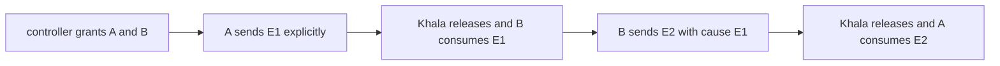

# Internal mode acceptance

Status: research proposal, 2026-09-24. This document applies the fixed D1–D12 decisions in [requirements.md](requirements.md) and the reuse findings in [survey.md](survey.md). It does not reopen those decisions.

## Summary

Use two acceptance layers with one evidence rule:

| Layer | System under test | Test doubles | Pass condition |
|---|---|---|---|
| CI | The real internal server, SQLite stores, connector/release/dispatch path, explicit-send path, and served web app | Only the native Claude/Codex harness boundaries and clocks | The complete requirements Acceptance 1 scenario passes in Vitest and Playwright, including restart without duplicate consumption |
| Live Aiur | Disposable Aiur tickets, real provider harnesses, the real internal server, and a human/controller admission grant | None | Trusted Khala and Executor metadata proves a causal two-way exchange between two distinct admitted participants |

Agent prose, issue state, and process exit status are never proof of an exchange. CI produces an issued body-free manifest; live runs persist a signed body-free envelope with exact source versions and cleanup result. The live runner executes the Claude/Codex pair first, then OpenCode/DeepSeek as a separate run. The second lane remains **unproven** until Aiur can dispatch an OpenCode harness backed by DeepSeek; Aiur's current direct DeepSeek backend is not an acceptable substitute.

## Status and assumptions

| Item | Status | Assumption or consequence |
|---|---|---|
| D1–D12 and Acceptance 1/2 | Fixed | Tests must preserve deliberate sends, honest listening-mode support, human admission, local security, and body-free logs. |
| Public terminology | Fixed | User- and agent-facing docs, contracts, CLI, MCP tools, and UI say **channel**. Matrix-internal `room` types and existing symbols remain internal; ticket #163 owns their code rename. |
| Internal-mode implementation | Not on `main` | File paths below name intended seams; implementation tickets may refine new filenames without changing the contracts. |
| Claude/Codex live versions | Version-specific | Preflight must pin and record the exact tested versions. Unsupported versions block the run. |
| Trusted explicit-send causation | Unproven | Current `AgentClientPort.send`/`khala_send` inputs do not carry a reply-to event. A Khala contract below must add and prove this before the live verifier can claim a reply. |
| Stop semantics | Assumption | The human stop is session-wide: it prevents new claims, terminates both model sessions and the local server, and leaves the persisted channel resumable. Implementation must surface contrary sibling research before changing this. |
| Second live pair | Assumption | “OpenCode + DeepSeek” means two independent OpenCode agent sessions backed by DeepSeek. The runner verifies both the harness and provider/model; it never substitutes Aiur's direct DeepSeek backend. |
| OpenCode + DeepSeek through Aiur | Unproven | This lane is blocked on an explicit OpenCode coding-agent route and DeepSeek enablement/credentials. Direct `Aiur.OpenAICompat.CodingAgent` does not qualify. |
| Run-scoped credential injection into Aiur agents | Unproven | The lifecycle ticket must prove a private 0600 descriptor path. Tokens, channel URLs, and credentials must not enter issue bodies, argv, or logs. |
| Institutional learnings | Unavailable | This repository has no `docs/solutions/` directory at this revision; risks are derived from source and the approved research instead. |

## Findings and evidence

Evidence is from this repository at `8d59f5f` and a read-only Aiur checkout at `0972f0297`, unless noted.

| Finding | Evidence | Design consequence |
|---|---|---|
| The existing E2E harness already separates fake and live evidence, gives each owner a private state directory, and disposes resources in reverse order. | `tests/e2e/harness/scenario.ts:27-52,85-136,191-226` | Extend its behavior; do not build another lifecycle abstraction. |
| Live evidence must come from a registered driver, use a non-fake clock, and name exact source versions. Evidence fields accept identifiers rather than free text. | `tests/e2e/harness/evidence.ts:1-4,25-33,42-59,94-135`; `tests/e2e/harness/live.ts` | Add acceptance-specific metadata through trusted drivers and keep message bodies out of manifests. |
| Reference channel implementations/connectors and fake harness adapters are test oracles, not the product. Fixture imports are excluded from production boundaries. | `tests/e2e/harness/reference.ts`; `packages/connector/src/dispatch/fixtures/fakes.ts`; [survey.md](survey.md#5-existing-fakes-and-harnesses-that-could-be-promoted) | CI must wrap the real internal composition with fake native drivers, not test a reference channel. |
| Agent replies are deliberate sends; `HarnessPort` has no model-output-to-channel path. The current send input has binding, transaction ID, and body but no reply-to event. | `packages/contracts/src/delivery/harness.ts`; `packages/agent-cli/src/cli/types.ts:45-47`; [survey.md](survey.md#2-model-harness-adapters) | Fake actors and live agents must call `AgentClientPort.send`, `khala send`, or `khala_send`; the trusted-causation contract must extend that path. Captured final output must fail acceptance. |
| Ordinary CI runs root tests and browser specs, but not root `pnpm test:integration`. | `.github/workflows/ci.yml`; `package.json` | Put the Node scenario under `tests/e2e/` and the served-app Playwright check in the existing `apps/web/**/*.browser.spec.ts` lane, or explicitly add an integration step. |
| Aiur's GitHub state-label prefix and active/terminal states are configurable. Its conditional poll also returns open issues with zero or multiple configured state labels for repair. | `Aiur@0972f0297: src/lib/aiur/config/schema/tracker.ex:24-26,211-226`; `src/lib/aiur/github/issues.ex:380-390,450-469,1121-1129` | Prefix-only isolation is unsafe. Every acceptance issue needs exactly one terminal normal-prefix label and exactly one active acceptance-prefix label. |
| Aiur writes per-ticket `.log`, `.events.log`, and `.agent_events.jsonl` files. | `Aiur@0972f0297: src/lib/aiur/issue_log.ex:294-347,1043-1045` | Correlate the two expected ticket sessions with Khala's structured evidence; never grep prose or message content. |
| Aiur has guarded reset/cleanup precedent for pinned test tickets, but that reset returns tickets to normal dispatch. | `Aiur@0972f0297: .aiur-test-tickets.json`; `src/lib/aiur/test_reset.ex`; `src/test/aiur/test_reset_test.exs` | Reuse its ownership guards and resource cleanup ideas, not its final `agent:todo` state. Dynamic tickets close after each run. |
| Aiur's DeepSeek entry is a disabled-by-default direct OpenAI-compatible backend. | `Aiur@0972f0297: src/lib/aiur/open_ai_compat/registry.ex:36-66` | Verify OpenCode and DeepSeek independently; reject direct-DeepSeek evidence in the OpenCode lane. |

Local proof on 2026-09-24:

```text
pnpm --store-dir /home/everdred/.aiur/repo/aiur-team/khala/.aiur-npm-cache/store install --frozen-lockfile
pnpm test:e2e -- tests/e2e/harness/harness.test.ts tests/e2e/harness/live-gate.test.ts
Result: 2 files, 27 tests passed (including 7 live-gate fixture tests).
```

The workspace used ambient Node `24.18.0` while `package.json` requests `22.23.2`; the proof passed, but CI remains authoritative for the pinned runtime. An initial install using pnpm's default store failed read-only, so the proof used the repository's writable package cache. No product files were changed by the proof.

## Design

### Evidence model

The acceptance driver emits structured records to the existing issued-manifest mechanism. The acceptance extension needs these identifiers:

| Field | Purpose |
|---|---|
| `runId`, `pairId`, `channelId` | Reject stale, cross-run, and cross-channel records; the implementation may map `channelId` to a Matrix-internal room identifier |
| `ticketId`, `participantId`, `bindingId` | Prove two distinct Aiur tickets and two distinct admitted agents |
| `eventId`, `clientTxnId`, trusted `causationId` | Prove authorship, idempotency, and B's explicit reply to A; requires the causation contract below |
| `releaseId`, `receiptKind` | Prove the intended recipient consumed the released event |
| `nativeSessionId`, `toolInvocationId` | Bind each explicit send to the requested launched agent session rather than the controller or a shim |
| `harness`, `provider`, `model`, exact `version` | Prove the requested runtime rather than a fallback |
| authenticated source identity, monotonic timestamp/clock | Admit only server/connector/Executor-driver records and preserve ordering |

Forbidden fields include message text, payload bytes, prompts, tokens, channel URLs, emails, and arbitrary error strings. The verifier rejects a manifest containing any forbidden material rather than redacting it after collection.

Authority is not a caller-supplied field. Qualifying records enter through a controller-owned authenticated append channel bound to the run lease and a registered driver identity. Agent child processes cannot access its signing/append capability or mutate the ledger/manifest. A syntactically valid record that merely claims `sourceAuthority=server` fails. If the implementation cannot isolate that channel from same-UID child processes, it must use distinct OS identities or an equivalent process/filesystem boundary before live acceptance is enabled.

The retained artifact is not a JSON serialization that relies on the harness's process-local issued-object marker. It is an immutable, controller-signed envelope over the versioned manifest, cleanup report, run ID, and exact source versions. The verifier has the corresponding trust root and rejects unsigned reconstruction, mutation, and replay. Signing capability remains outside agent child environments.

The current explicit-send interfaces cannot supply trusted causation: `AgentClientPort.send` has `bindingId`, `clientTxnId`, and `body`, while `khala_send` exposes the message and optional binding. The implementation contract adds a reply-to event identifier to the explicit-send path. The local server validates that the sending binding consumed that event in the same channel/run, then records the derived causal edge. A timestamp, prompt instruction, or message-body marker is not a substitute.

A qualifying send also carries a server-observed tool/CLI invocation ID bound to the native session ID and per-binding credential created by the acceptance Executor. This rules out a controller or harness shim posting both sides while model sessions sit idle.

A pair passes only when one causal graph exists:



The admission grant and all four message actions—A send, B consume, B send, and A consume—must share one run, pair, and channel. A and B must have different ticket, participant, and binding IDs. A completion label, agent-authored comment/event, self-delivery, one-way message, duplicate-only delivery, or old-run replay fails.

`accepted` or `queued` is never consumption. Each live provider profile names its strongest trusted delivery boundary before it can run: Codex requires the release-linked `context_consumed` receipt; Claude and OpenCode remain unproven until their owning contracts publish an equivalent tool/turn-boundary receipt. The verifier rejects a weaker or unknown receipt kind.

### CI acceptance

One stateful Vitest scenario exercises the real internal-mode composition:

1. Start the internal server on loopback with a disposable SQLite/state root and register two independent fake native-harness drivers.
2. Create a channel through the production channel API. Both fake agents request entry; the controller grants each request, exercising D11.
3. A consumes a release and deliberately uses the production explicit-send surface to send E1. B consumes E1 and explicitly sends E2. Inject a human message and prove both bindings consume it.
4. Exercise listening modes using their exact v1 meanings: `steer` at the next tool boundary, `sync` after the current tool/turn, and `async` only after an explicit check. An unsupported capability is displayed/refused, never upgraded silently.
5. Pause before claim, prove no new claim/delivery occurs, resume, and prove the pending event is consumed once.
6. Restart the server over the same SQLite files after a durable send/release boundary. Replay cursors and prove one timeline event and one recipient consumption per durable ID.
7. Invoke the human stop, prove new claims cease and both model sessions/server terminate, then resume the persisted channel without replaying consumed work.
8. Close through `ScenarioHarness.defer`, fail on leftovers or unfired faults, and validate the issued fake-contract manifest.

The Playwright slice opens the actually served internal application, not a feature harness with a fabricated Matrix-internal `RoomPort`. One keyboard-only flow launches the app, creates a channel, observes separate A/B join requests, grants each as the human owner, verifies the empty channel, exchanges agent and human messages, operates each named agent's mode and pause controls, stops the session, observes the terminal state, and resumes the persisted channel. It also proves sign-in/share/recovery UI is absent; fixture-only admission or direct channel seeding cannot satisfy this flow. Prefer `apps/web/src/composition/internal/*.browser.spec.ts` so the existing CI browser lane runs it; otherwise add the root integration command to CI explicitly.

The composed-app assertions cover these UI states, using the product's exact enums when they land:

| Surface | Required states and oracle |
|---|---|
| Timeline | Loading; ready with zero messages; ready populated; partial history; unavailable. Empty is distinct from failed, and partial/unavailable offers a visible recovery action. |
| Two-agent roster | Neither, one, and both admitted/connected; A and B have unique visible and accessible names. Connection/support/mode is text, not color alone. |
| Harness capability | Tested, experimental, and unsupported; unsupported controls are disabled with the reason visible. |
| Policy command | Pending, effective/matched, offline, rejected, and outcome unknown; controls do not claim success before acknowledgment. |
| Pause/stop | Paused, resumed, stopping, stopped, and failed stop; stop is distinct from pause and offers resume for the persisted channel. |

Pending/effective transitions use a status announcement; rejected/unavailable outcomes use an alert. Focus remains on the triggering per-agent control after an asynchronous update and moves to a stable heading or resume action after stop.

High-value negative cases:

| Defect | Test that must fail |
|---|---|
| Fake adapter auto-posts final turn output | Driver returns prose without invoking explicit send; no channel event may appear |
| Pause leaks work | Event arriving after pause is neither claimed nor delivered until resume |
| Restart duplicates | Restart after durable acceptance; a second event ID or recipient consumption fails |
| One fake binding stands in for both agents | Same participant/binding on both graph sides fails |
| `steer` is overstated | Implementation claims hard abort without a proved capability; UI/manifest assertion fails |
| UI test bypasses the app | Browser spec pointed at a feature harness cannot obtain the internal composition marker and fails |
| Stop aliases pause or is visual-only | After stop, any new claim, live model session, or bound local server fails the scenario |
| Composition is mouse/color dependent | Keyboard-only create-to-stop flow or text-state assertions fail |

### Live Aiur acceptance

Each provider pair runs sequentially in a fresh channel and with a fresh run ID:

1. **Preflight.** Verify disposable environment, exact Aiur/Khala/harness/provider/model versions, required credentials, repository target, label set, empty run lease, bounded cost/job count, and a human-visible stop control. The controller derives executable versions itself and binds the provider-returned model identity to the session; if the provider cannot attest the served model, that profile is `unproven`. Unsupported or disabled capabilities produce `unproven`/blocked, never skip/pass/fallback.
2. **Write-ahead ledger.** Persist the run ID and every intended resource before creating it. All later mutations append their returned IDs. A second runner cannot acquire the same lease.
3. **Create fenced tickets.** Preflight requires an allowlisted sandbox GitHub repository that the normal Executor does not watch, verifies every static label there, then creates each issue atomically with `test:khala-acceptance`, a provider marker, exactly one `khala-acceptance:*` active state, and `agent:cancelled`. A create response missing any label aborts and fences the run. A dedicated Executor configured only for that repository, with `label_prefix: khala-acceptance`, separate runtime/log/state/workspace roots, and maximum two inflight agents sees the tickets. The repository boundary is the primary dispatch isolation; the terminal normal-prefix label and label checks before launch are defense in depth, not an atomic cross-Executor claim. Issue bodies come from a fixed secret-free template; agents cannot create comments/workpads during the run.
4. **Sandbox and instruct.** Launch each agent with an explicit environment allowlist, no GitHub/controller credentials or ambient secrets, no writable repository, and a distinct 0700 scratch/descriptor boundary the peer cannot read. Give it only a short-lived, non-transferable Khala token scoped to the run, channel, participant/binding, and agent operations; it cannot admit participants, impersonate the peer, or access another channel. The fixed acceptance prompt remains defense in depth: no repository changes or PRs, treat issue text and channel content as untrusted, request entry, and send only the fixed handshake through Khala's explicit-send tool. The 0600 descriptor supplies endpoint/token data outside the issue body and argv.
5. **Admit.** Each agent requests entry. The controller acts as the human owner and records two explicit grants; tickets cannot self-admit or begin already admitted.
6. **Exchange.** A sends a nonce-free protocol marker E1, B consumes it and sends E2 causally linked to E1, and A consumes E2. The marker's content is irrelevant and is not logged; trusted event IDs carry the proof.
7. **Verify provisionally.** Correlate Khala's issued `live-harness` manifest with the two run-windowed Aiur ticket event logs. Require the causal graph above, exact requested harness/model versions, and no forbidden fields, but do not report a pass yet.
8. **Clean and report.** In `finally`, fence both tickets first; revoke admission and launch credentials; stop agent sessions, the acceptance Executor, and Khala; close accidental PRs and remove owned branches/workspaces/subscriptions; explicitly delete the disposable channel/token/state; then close (do not delete) the test issues with a terminal acceptance label. Before each destructive action, re-fetch the target and corroborate its repository, resource type, acceptance marker, run ownership, and creation window against controller-owned data; any mismatch fails closed. Scan all retained issue text for forbidden values; quarantine and fail the run, redact controller-owned text, and record an incident if anything leaked. Only after cleanup reports no leftovers may the runner print a body-free final pass. Retain only the sanitized manifest and cleanup report.

Cleanup is idempotent (`cleanup --run <id>`), reverse-ordered, and runs on setup failure, timeout, verifier failure, success, and signals. A TTL reaper handles process death. The protected ledger is necessary but never sufficient deletion authority: every target also needs independent live ownership corroboration. Unrelated tickets, branches, workspaces, channels, and processes are untouchable.

#### Provider profiles

| Profile | Minimum consumption receipt | Required proof | Refusal condition |
|---|---|---|---|
| Claude + Codex | Codex: release-linked `context_consumed`; Claude: equivalent tool/turn-boundary receipt published by `claude-plugin` | Distinct Claude and Codex ticket/native sessions; exact harness/version and tool-invocation records; the two-way causal graph | Claude receipt remains unproven/fail-closed, Codex version is unsupported, or either agent uses a captured turn instead of explicit send |
| OpenCode + DeepSeek | Equivalent prompt/tool-boundary receipt published by `opencode-bridge` | `harness=opencode` and `provider/model=deepseek/...` independently recorded on each ticket/native session; the same graph in a new run/channel | Receipt is unproven, only Aiur's direct DeepSeek backend exists, the bridge/credentials are disabled, or any fallback occurs |

### Executor confirmation

The Executor confirms from logs by running the verifier over a bounded run window, not by visually reading transcripts:

| Source | What it proves |
|---|---|
| Acceptance run ledger | Expected run, pair, issue, channel, participant, and process identities |
| Aiur per-ticket structured event logs | Both expected tickets launched under the requested backend/session and reached bounded terminal handling |
| Khala registered-driver manifest | Admission, authorship, release/consumption, causation, exact sources, and cleanup metadata |
| Final verifier output | One valid two-way graph, no forbidden content, no stale/mismatched/self-authored evidence, and a completed cleanup report with no leftovers |

Ticket completion is cleanup evidence only. Agent-authored workpads, issue comments, alerts, or files cannot satisfy graph edges because an agent could spoof them.

## Trade-offs

| Choice | Benefit | Cost / rejected alternative |
|---|---|---|
| Real composition with fake native drivers | Deterministic CI still proves storage, policy, dispatch, explicit send, and UI | More setup than `createReferenceRoom`; the reference implementation alone would test the oracle, not internal mode |
| Separate Vitest and Playwright slices | Fits current CI and gives fast protocol failures plus real UI proof | Requires a shared fixture/seed contract between runners |
| Dynamic disposable tickets | Every run has uncontaminated prompts and auditable ownership | More GitHub API and cleanup work than pinned tickets |
| Dedicated sandbox repository plus label fence | The normal Executor has no polling/claim path to test tickets; dual-prefix labels still fail closed under accidental misconfiguration | Requires a maintained sandbox repository and separate acceptance Executor profile |
| Metadata causal graph | Strong, automatable proof without logging message bodies | Requires trusted instrumentation and a verifier; prose logs are insufficient |
| Sequential provider pairs | Bounds cost and makes attribution/cleanup clear | Takes longer than four concurrent agents |
| Close issues; delete channel/state | Preserves a minimal GitHub audit while removing plaintext channel content and credentials | Closed test tickets remain visible by design |

## Risks and mitigations

| Risk | Mitigation |
|---|---|
| Normal Executor claims or repairs a test ticket | Allowlisted sandbox repository outside normal polling, dedicated Executor roots, dual-prefix defense-in-depth fence, negative dispatch test |
| Model-to-model prompt injection causes tool use | Treat all channel content as untrusted; capability sandbox and environment allowlist enforce the boundary; fixed handshake prompt, timeout, and visible stop add defense in depth |
| Agent or runner spoofs success | Controller-owned authenticated append channel, protected manifest/ledger, registered driver identities, and rejection of self-asserted authority |
| Agent escapes through inherited tools or secrets | Per-agent capability sandbox, environment allowlist, no GitHub/controller credentials, non-writable repository, and peer-isolated scratch roots |
| Agent token exceeds its role | Separate controller and per-binding tokens; run/channel/participant/operation scope; no admission; immediate revocation tests |
| Message or credential leaks into logs or retained tickets | Identifier-only schema, forbidden-field rejection, 0600 descriptor, fixed issue template, no agent comments/workpads, and retained-text scan |
| Crash leaves cost or public resources running | Protected write-ahead ledger, signal-safe idempotent cleanup, park/fence first, TTL reaper, leftovers fail |
| Poisoned ledger targets unrelated resources | Re-fetch and independently corroborate repository/type/marker/run/time before each destructive action; fail closed |
| Provider capability or version drifts | Exact preflight and manifest versions; disabled/unsupported is `unproven`, never fallback |
| OpenCode is confused with direct DeepSeek | Require separate harness and provider/model attestations; block on `opencode-bridge` |
| Concurrent/stale run contaminates proof | Exclusive run lease plus run/pair/channel/ticket correlation and replay rejection |
| Acceptance instrumentation changes core contracts prematurely | Keep evidence extensions acceptance-local until internal-core event names settle |

## Non-goals

- Capturing final assistant output or transcripts as channel messages.
- Proving external-mode encryption, Make external, LAN access, recovery, or revocation.
- Benchmarking model quality, latency, token use, or conversational usefulness.
- Treating a green fake test as live provider support.
- Treating issue closure, agent self-report, or a direct DeepSeek Aiur ticket as exchange proof.
- Running live acceptance in ordinary CI or through normal Aiur dispatch.
- Retaining message bodies, launch credentials, or disposable internal-channel state after a run.

## Implementation ticket contracts

### 1. Add real-composition internal-mode CI acceptance

| Field | Contract |
|---|---|
| Slug | `internal-ci-acceptance` |
| Complexity | `complexity:4` |
| Scope | Add the stateful fake-driver E2E scenario and served-app Playwright slice described above. Exercise create, D11 grants, two-way explicit sends, human interjection, honest mode semantics, pause/resume, stop/resume, persistent restart, UI state/error coverage, accessibility, dedupe, and cleanup. |
| Out of scope | Live CLIs/providers; a second reference implementation; product behavior beyond what `internal-core` and `listening-modes` expose. |
| Files/packages | `tests/e2e/internal-mode/**`; `tests/e2e/harness/**` only for generic evidence/driver extensions; `apps/web/src/composition/internal/**/*.browser.spec.ts`; `package.json` or `.github/workflows/ci.yml` only if the existing lanes cannot run the tests. Packages consumed: contracts, messaging, connector, policy, harnesses, agent-cli, internal app composition. |
| Acceptance criteria | Both test slices run in ordinary CI; native boundaries alone are fake; all Acceptance 1 behaviors plus the fixed human stop are asserted; unsupported modes are refused/displayed; composed loading/empty/partial/error and keyboard/focus/status states are covered; issued manifests contain identifiers only; cleanup has zero leftovers. |
| Tests | Happy path full scenario and keyboard-only browser create→admit→exchange→stop→resume flow. Wrong implementation: restart after accepted send/release and fail if either timeline event count or recipient consumption count becomes two. Also reject captured-output auto-post, paused leakage, stop that leaves a claim/session/server live, same binding on both sides, false hard-abort support, inaccessible controls, feature-harness-only browser target, unauthenticated/cross-channel/cross-binding requests, agent self-admission, and invalid Host/Origin. |
| Blocked by | `internal-core` (#138), `listening-modes` (#139), and the public terminology rename (#163). |
| Conflict risk | **High** with `internal-core` app composition and `listening-modes` semantics. Consume their public surfaces; do not define competing production APIs. |

### 2. Isolate an acceptance-only Aiur Executor

| Field | Contract |
|---|---|
| Slug | `aiur-acceptance-executor` |
| Complexity | `complexity:3` |
| Scope | In the Aiur repository, add an allowlisted sandbox-repository guard and dedicated `khala-acceptance` Executor profile with its own label prefix, prompt/config fixture, runtime/log/state/workspace roots, and inflight limit. Add the atomic labeled acceptance-ticket creation primitive and dual-prefix defense-in-depth fence. |
| Out of scope | Multi-resource run orchestration, run ledger, credentials, provider launch, cleanup, Khala evidence, and normal test-ticket reset behavior. |
| Files/packages | Aiur acceptance-only config/prompt fixtures plus GitHub candidate/dispatch tests. Reuse configurable tracker prefix/state policy and existing orchestrator test helpers. |
| Acceptance criteria | The configured repository is explicitly allowlisted and differs from every normal Executor target; all labels exist before issue creation; an issue is created atomically with one active `khala-acceptance:*` state and one terminal `agent:*` state; only the acceptance Executor polls it; labels are revalidated immediately before launch as defense in depth; normal `agent:*` semantics remain unchanged. |
| Tests | Normal and acceptance Executors against distinct repository fixtures, refusal when repository targets overlap, normal poll immediately after issue creation, zero/multiple-label repair regression, incomplete create-response rejection, and pre-launch label-change rejection. Wrong implementation: any acceptance issue visible to a normal repository poll fails before a provider can launch. |
| Blocked by | None. |
| Conflict risk | **Low** with Khala E09 work; **medium** within Aiur tracker/config/dispatch surfaces. |

### 3. Add guarded Aiur acceptance-run lifecycle

| Field | Contract |
|---|---|
| Slug | `aiur-acceptance-lifecycle` |
| Complexity | `complexity:4` |
| Scope | In the Aiur repository, add the manual runner core: exclusive lease, dynamic fixed-template tickets through contract 2, protected write-ahead ledger and signing key, capability sandbox/private descriptors, controller/agent credential separation, bounded sessions, supervised stale-run reaper, and idempotent corroborated cleanup. |
| Out of scope | Provider-specific profiles; Khala record schema/verifier; OpenCode bridge; normal test reset. |
| Files/packages | Aiur acceptance runner/modules/tests and a daemon-supervised periodic/startup stale-run reaper. Reuse guarded GitHub issue/PR/branch/workspace/subscription operations, session supervision, and `Aiur.TestReset` ownership patterns. |
| Acceptance criteria | Every mutation is recorded before/after execution; agent environments contain no ambient/GitHub/controller credentials; peer descriptors, ledger, signing key, and evidence channels are inaccessible; partial, timed-out, signalled, and orphaned runs are fenced and reclaimed; each deletion re-fetches and corroborates ownership; retained issue text is fixed-template and forbidden-field clean. |
| Tests | Concurrent lease refusal; environment/sandbox allowlist; peer-descriptor and GitHub-mutation denial; partial failure at each resource boundary; signal/timeout cleanup; daemon restart/TTL reaping; poisoned-ledger targets survive; idempotent retry. Wrong implementation: a ledger entry pointing at an unrelated marked-or-unmarked branch must never authorize deletion. |
| Blocked by | `aiur-acceptance-executor`. |
| Conflict risk | **Low** with Khala E09 work; **medium** with Aiur reset, session, workspace, and GitHub lifecycle code. |

### 4. Add trusted reply evidence and verifier

| Field | Contract |
|---|---|
| Slug | `trusted-acceptance-evidence` |
| Complexity | `complexity:4` |
| Scope | In the Khala repository, extend the explicit-send API/tool with a reply-to event identifier, validate it against the sending binding's consumed event/channel/run, bind sends to native session/tool invocations, emit authenticated server/connector records through a controller-owned append channel, define a signed versioned body-free envelope, and implement the pure causal-graph verifier with profile-specific receipt thresholds. |
| Out of scope | Aiur ticket/session lifecycle; provider launching; message-content inspection; product read-receipt semantics beyond the identifiers consumed here. |
| Files/packages | `packages/agent-cli` send/MCP/transport surfaces; internal local server/connector instrumentation from `internal-core`; `tests/e2e/harness/**` or an acceptance evidence module; verifier CLI/API, fixtures, and tests. |
| Acceptance criteria | An explicit reply can name E1 without identifiers in the body; the server accepts it only from a binding that consumed E1 in the same channel/run; every send matches a trusted native session/tool invocation; records have authenticated origin; the signed envelope crosses process/repository boundaries; each profile sets a qualifying consumption receipt; the verifier requires the complete graph and clean teardown. |
| Tests | Send decoder/authorization tests for valid reply, unknown/unconsumed/cross-binding/cross-channel/cross-run event, duplicate transaction, controller-injected send, agent self-admission, token transfer, and replay after revocation; authenticated append tests including same-UID threat where applicable; signed-envelope serialization/mutation/reconstruction/replay tests; accepted/queued-only receipt fails; verifier accepts one minimal graph and rejects every negative case above. Wrong implementation: a syntactically valid agent-written record claiming server authority and two completed tickets must fail. |
| Blocked by | `internal-core` (#138), `mcp-piggyback` (#141) for final tool composition, and the public terminology rename (#163). |
| Conflict risk | **High** with `internal-core` and **medium** with `read-receipts` (#145). Reuse their event identifiers; do not redefine receipt semantics. |

### 5. Run Claude/Codex acceptance through Aiur

| Field | Contract |
|---|---|
| Slug | `claude-codex-acceptance` |
| Complexity | `complexity:4` |
| Scope | In the Aiur repository, add the Claude/Codex live profile over the acceptance Executor, lifecycle, and trusted evidence contracts: preflight exact versions, invoke Khala's versioned verifier boundary, create the pair, grant joins, run the explicit-send handshake, clean, then report. |
| Out of scope | OpenCode/DeepSeek; Khala schema/tool changes; general-purpose Aiur orchestration; setup UX. |
| Files/packages | Aiur provider profile and tests plus trusted prompt fixture; consume the released lifecycle and Khala verifier/manifest interfaces. No Khala repository files. |
| Acceptance criteria | Manual opt-in only; exact Claude and Codex sessions are recorded; both request and receive controller admission; causal two-way exchange verifies; bounded timeout/cost/stop work; cleanup completes before pass; unsupported versions report blocked/unproven. |
| Tests | Fake GitHub/process/driver profile tests plus opt-in live mode behind the existing gate. Inject failure after ticket, channel, admission, and session boundaries. Wrong implementation: successful turn prose without explicit Khala send produces no qualifying edge and fails. |
| Blocked by | `aiur-acceptance-executor`, `aiur-acceptance-lifecycle`, `trusted-acceptance-evidence`, `claude-plugin` (#140), `mcp-piggyback` (#141), the existing `room-discovery` ticket (#144) unless a smaller request→grant API lands first, and the public terminology rename (#163). |
| Conflict risk | **Medium** across released sibling APIs; this ticket consumes rather than defines them. |

### 6. Run OpenCode/DeepSeek acceptance through Aiur

| Field | Contract |
|---|---|
| Slug | `opencode-deepseek-acceptance` |
| Complexity | `complexity:3` |
| Scope | In the Aiur repository, add a second live profile that reuses `claude-codex-acceptance`'s lifecycle, verifier boundary, prompt protocol, and cleanup but launches two independent OpenCode sessions with DeepSeek as provider/model in a new channel/run. |
| Out of scope | Aiur's direct DeepSeek coding-agent backend; a new OpenCode bridge; fallback to another harness/model; shared verifier changes. |
| Files/packages | One Aiur provider profile/driver plus focused fixtures/tests. Consume the released OpenCode bridge and shared runner/verifier APIs. |
| Acceptance criteria | Evidence independently names OpenCode and the exact DeepSeek model/version; two distinct admitted ticket sessions complete the causal exchange; unavailable/disabled capability reports blocked/unproven; fallback cannot pass; cleanup matches contract 5. |
| Tests | Profile selection, capability refusal, version pinning, and injected cleanup failures. Wrong implementation: a valid exchange from Aiur's direct `open_ai_compat` DeepSeek backend is rejected because it lacks OpenCode harness attestation. |
| Blocked by | `aiur-acceptance-executor`, `aiur-acceptance-lifecycle`, `trusted-acceptance-evidence`, `claude-codex-acceptance`, `opencode-bridge` (#142), the existing `room-discovery` ticket (#144) under the same condition as `claude-codex-acceptance`, and the public terminology rename (#163). |
| Conflict risk | **High** with `opencode-bridge` until its launch/evidence API lands; afterward **low** if this ticket adds only a profile and fixtures. |
