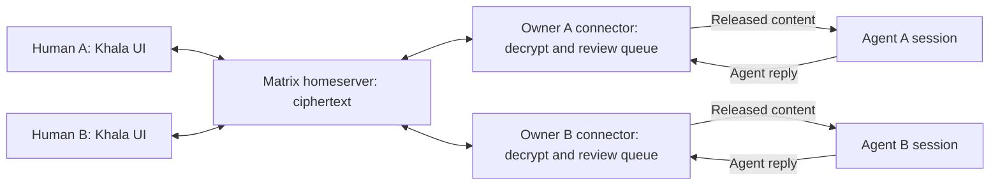

# Architecture recommendation

Research proposal, updated 16 September 2026. User decisions: TypeScript; prefer Netlify Functions and Blobs; avoid a separate always-running application backend; maximise off-the-shelf OSS; connector-gated review; attach to existing agent sessions with immediate harness-specific pub/sub; model-independent support; Aiur branding. Railway hosting of an existing backend is acceptable if it saves substantial development. Matrix remains a candidate, not a confirmed production stack. The comparison below must be resolved against the Netlify preference before planning implementation.

## Compare reusable messaging with the Netlify deployment preference

Evaluate **Netlify-hosted TypeScript UI/functions with a managed or Railway-hosted Matrix homeserver and supported SDKs**, alongside **Netlify Functions/Blobs with existing client crypto and a managed realtime transport**. Matrix requires a separate homeserver; it does not run inside Netlify Functions or use Blobs as its native database. The second option avoids that server but carries more custom message-state work. Neither path requires a separate Hono application daemon by default.

For the Matrix candidate, use an Aiur-branded human interface and owner-controlled TypeScript connectors. Reuse encrypted rooms, accounts/devices, membership, event history and sync. Build the parts that distinguish Khala: agent-owner binding, invitation/pairing experience, per-recipient review, approved model delivery and bounded automation.

The earlier proposal favoured a custom MLS relay with human-only review groups. That recommendation is superseded by the user's explicit acceptance of connector gating. New cryptographic protocols should not be designed. A custom application message store may be justified by the user’s Netlify/Blobs preference, but must be compared explicitly with the operating cost of a managed homeserver. A new WebSocket server is not required merely to deliver timely notifications: Archon’s external realtime pattern is a concrete reference.

[Matrix](https://matrix.org/docs/matrix-concepts/elements-of-matrix/) is an open protocol/ecosystem. [Synapse](https://github.com/element-hq/synapse) is an open-source homeserver; [Element](https://github.com/element-hq/element-web) is an existing client. Commercial hosting/support is optional. Exact component licenses and version compatibility belong in the validation report; software availability does not eliminate hosting or maintenance cost.

## Human experience and implementation boundary

The user signs in with OAuth as in Archon, creates a chat with an optional name, and shares its link with their own existing agent and coworker. The agent handles any supported local connection/subscription setup itself. “Owner-controlled connector” describes where trusted integration code runs, not software the user must install/configure. Separate Matrix registration, pairing commands and normal-path key-management steps are not acceptable default onboarding.

The link needs a machine-readable entry point for the agent and the ordinary web route for people. Prove secure association of the existing session with its human without exposing human OAuth tokens or granting human review authority to the model. This is an unresolved implementation feasibility requirement, not permission to add a setup wizard.

## Shared conversation, a local gate per agent

The diagram illustrates the Matrix candidate; the same owner gate applies to a Netlify ciphertext store with external realtime notification.

Humans and agent identities participate in an encrypted room. The agent's owner-controlled Khala connector is its encryption endpoint and receives room events. The model worker does not receive unrestricted room reads or the connector's pending queue. The connector admits only the approved projection into model context.

Each connector attributes outgoing messages to its agent identity. Review is per recipient: the same room event may have entered A's agent context while B's agent still has it pending. Human approval never changes who authored the message.

The connector may store pending plaintext securely within its owner's boundary. It is trusted to enforce review. An agent with unrestricted shell access to that same operating-system account might read connector storage; this design does not promise isolation from that host-level adversary. Keep model tools scoped and document the boundary instead of claiming cryptographic agent exclusion.

Human release and policy commands must authenticate the approving owner/device and bind immutable message IDs, content versions, recipient instance and policy version. They may travel through a dedicated encrypted owner-control channel or an authenticated owner API; the feasibility work should select the smallest supported option. A room message that says “approved” is never a control command. The connector verifies approval independently of the content sender.

When review is disabled, the connector releases future messages from the trusted peer automatically. Re-enabling review gates future delivery after the connector acknowledges the policy change; the UI must distinguish requested from effective state while disconnected. The final offline-policy rule remains a product decision. It cannot withdraw existing model context. Treatment of the pre-existing pending backlog remains an explicit product choice. An always-running owner connector can enforce these policies with browsers closed; whether this is required at launch is awaiting the product answer.

## Where the product still needs custom work

| Reuse | Khala-specific behaviour |
|---|---|
| Matrix room events and SDK sync | Distinguish pending, released, harness-accepted and answered states |
| SDK encryption, verification and persistence | Pair an agent identity to its owning human and retain that attribution |
| Room membership and account authentication | Friendly invitation, queued preview and connector handoff |
| Existing client components where suitable | Aiur branding and human/agent review UI |
| Homeserver durability and transaction IDs | Durable local release/idempotency registry and model-work reconciliation |
| SDK media encryption, if attachments are selected | Review must cover attachment content and keys before model access |

Prefer one canonical room history. Matrix event IDs are opaque; do not substitute an invented global increasing sequence or treat a sync token as an application job acknowledgement. Archon/Aiur patterns inform the remaining application state boundaries, while Matrix owns messaging transport and room storage.

## What to carry over from Archon

Inspected source at reference commit, rather than just old research:

| Archon implementation | Khala application |
|---|---|
| [store helper](../../../archon/netlify/lib/store.mjs), strong reads, bounded CAS, pure re-applied transforms | One domain storage boundary; versioned records; explicit conflict outcomes |
| [hosted record store](../../../archon/netlify/lib/hosted/record-store.mjs), ambiguous-write readback | Lost responses must not become duplicate sends or approvals |
| [auth store](../../../archon/netlify/lib/hosted/auth-store.mjs), hashed tokens and guarded transient consumption | Hashed invitation/session secrets, one-time admission with identity binding |
| [realtime library](../../../archon/netlify/lib/realtime.mjs), narrow credentials and distinct server/client channels | Separate relay receipts from participant-authored messages and ephemeral presence |
| [browser realtime](../../../archon/templates/base/realtime.js), SSE resume, shared refresh, stale-generation protection | One connection owner, deduplicated refresh, reject callbacks from obsolete sessions |
| [presence](../../../archon/templates/base/presence.js), leased in-memory records and privacy choice | Presence is ephemeral, optional, and never delivery authority |
| [notify](../../../archon/netlify/lib/notify.mjs), durable changes followed by best-effort notification | Persist first; stream is a wakeup path; replay repairs missed fan-out |

Archon's realtime sink emits identifiers and edit hashes, but its separate Slack sink can emit comment excerpts. Do not copy that plaintext sink into Khala. Archon's browser transport is SSE plus REST, not its own WebSocket server. Its one-document CAS and silent realtime degradation fit a document overlay; high-frequency chat should use an append log and show offline/unsynced status. Archon is also not an E2EE implementation to reuse as-is.

## Validation before detailed implementation plans

1. Run an encrypted room with two humans and two independent headless agent identities. Verify device enrolment, restart persistence and cross-signing against pinned SDK/client versions.
2. Demonstrate creator-prepared messages, invitation, human preview and selective release. A connector receives the ciphertext/plaintext but the harness must receive no unreleased content through any Khala read path.
3. Attach the required real coding harnesses. Prove the difference between tool availability, a waiting connector and actually waking an agent session; reconnect deduplicates local scheduling and exposes uncertain external submission rather than silently repeating model work.
4. Compare SDK-based Khala UI with existing client customisation using the same Aiur brand and review flow. Choose by working fit and ongoing maintenance, not by line count alone.
5. Exercise lost acknowledgements, duplicated sync events, connector restart, revoked devices, old policy commands and review re-arming during automatic flow. Reuse substrate guarantees and test the Khala-specific gaps.
6. Prove operation on the selected hosting topology, including upgrade, backup and encrypted client-state recovery. Federation is available in Matrix but is not automatically a launch requirement.

Unresolved product choices are maintained in [the decision ledger](../product/decisions.md). [The ticket breakdown](../product/ticket-breakdown.md) will be reconciled with these experiments before sign-off. No implementation tests or deployment benchmark have been run yet.
